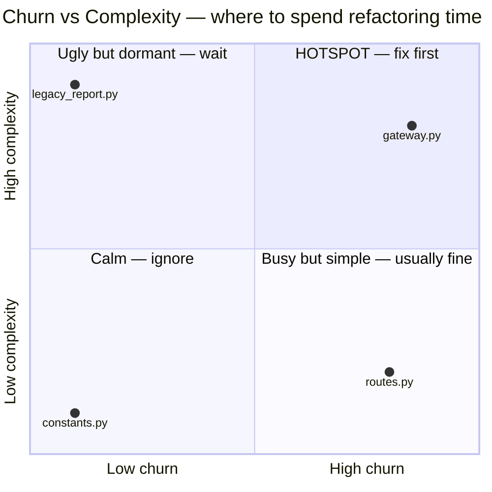

# Hotspot Analysis — Junior Level

> **Category:** [Anti-Patterns at Scale](../README.md) → **Hotspot Analysis** — *use git history to find the few files where complexity and change frequency collide — that is where anti-patterns actually cost money.*
> **Covers (collectively):** Churn × complexity · Code-as-a-crime-scene · Change / temporal coupling · Knowledge maps & bus factor · Defect-density prioritization

---

## Table of Contents

1. [Introduction](#introduction)
2. [Prerequisites](#prerequisites)
3. [Glossary](#glossary)
4. [The Wrong Targets: "Biggest" and "Ugliest"](#the-wrong-targets-biggest-and-ugliest)
5. [What a Hotspot Is: Churn × Complexity](#what-a-hotspot-is-churn--complexity)
6. [Reading `git log`: Where Churn Lives](#reading-git-log-where-churn-lives)
7. [The Quadrant Map](#the-quadrant-map)
8. [A First Look at One File's History](#a-first-look-at-one-files-history)
9. [Why This Beats Intuition](#why-this-beats-intuition)
10. [Common Mistakes](#common-mistakes)
11. [Test Yourself](#test-yourself)
12. [Cheat Sheet](#cheat-sheet)
13. [Summary](#summary)
14. [Further Reading](#further-reading)
15. [Related Topics](#related-topics)

---

## Introduction

> Focus: **What is a hotspot?** and **Why is the biggest/ugliest file the wrong thing to fix first?**

You've learned to recognize anti-patterns — a God Object, an arrow pyramid, tangled spaghetti. In a real codebase there are *hundreds* of files with some smell. You cannot refactor all of them, and you shouldn't: most bad code is **harmless** because nobody ever touches it. A 2,000-line mess that hasn't been edited in three years costs you nothing this quarter.

So the real question at scale isn't *"is this code bad?"* — almost everything is a little bad. The question is *"which bad code is **costing us money right now**, and which will keep costing us next month?"*

**Hotspot analysis** answers that with data you already have: your **git history**. The insight, due to Adam Tornhill (*Your Code as a Crime Scene*), is that the files worth fixing are the ones that are **both**:

- **complex** — hard to read and change (a lot of code, deeply nested, many branches), *and*
- **frequently changed** — they show up in commit after commit.

A file that is complex *and* changes constantly is where developers burn the most time, make the most mistakes, and introduce the most bugs. That intersection is a **hotspot**. Everything else — the ugly file nobody edits, the busy file that's actually simple — is a lower priority.

> **The mindset shift:** "ugly" is a property of the code. "Expensive" is a property of the code **multiplied by how often you pay the cost of changing it.** Git history tells you the second half, and the second half is the half intuition gets wrong.

---

## Prerequisites

- **Required:** You can recognize the basic anti-patterns from earlier chapters (God Object, Long Method, deep nesting) — hotspot analysis tells you *where* to apply that knowledge.
- **Required:** Basic `git` — you can run `git log`, `git show`, and read a commit. We use git as a *data source*, not just version control.
- **Required:** Comfort on the command line: pipes (`|`), `sort`, `uniq`, `head`.
- **Helpful:** You've felt the pain of editing the same gnarly file for the third time this month — that file is almost certainly a hotspot.

---

## Glossary

| Term | Definition |
|------|-----------|
| **Hotspot** | A file (or function) that is **both** complex **and** frequently changed — the intersection where refactoring pays off most. |
| **Churn** | How often a file changes: the number of commits (or lines added/removed) that touched it over a time window. Mined from git history. |
| **Complexity** | How hard a file is to change. At this level we use a cheap proxy: lines of code, indentation depth, branch count. |
| **Crime scene** | Tornhill's metaphor: like a detective, you don't search the whole city — you go where the evidence (the commits) points. |
| **Bus factor** | How many people understand a file. If one person made 95% of its commits and they leave, the knowledge leaves too. |
| **Temporal / change coupling** | Two files that keep changing *together* in the same commits, even though nothing in the code obviously links them. (Senior topic; named here.) |
| **LOC** | Lines of code — the crudest complexity proxy, but surprisingly useful and trivial to compute. |

---

## The Wrong Targets: "Biggest" and "Ugliest"

When someone says "let's pay down tech debt," the two instincts are almost always wrong.

**Wrong target #1 — the biggest file.** Sorting files by size and attacking the top of the list feels rigorous. But size alone tells you nothing about cost. A giant generated file, a 5,000-line vendored library, a fat constants table — all huge, all harmless, because **nobody edits them**. You'd spend a week refactoring code that was never going to bite you.

**Wrong target #2 — the ugliest file.** The file everyone *complains* about is a better signal than size, but it's still a feeling, not a measurement — and feelings are biased. People remember the file they fought *last*, not the one that costs the team the most *in aggregate*. They overweight aesthetic ugliness (bad names, weird formatting) and underweight the quiet file that's edited by six people a week and breaks every other release.

Both instincts miss the same variable: **how often do you actually pay the cost?** A messy file you touch once a year is a cheap mess. A moderately messy file you touch twice a week is an expensive one. Refactoring should follow the **money**, and the money is spent on **change**.

> **The key realization:** "worst code" and "most expensive code" are different questions. Hotspot analysis answers the second — the one that actually decides where your finite refactoring time goes.

---

## What a Hotspot Is: Churn × Complexity

A hotspot is the **product** of two independent axes:

```
            high complexity
                  │
   refactor       │   ★ HOTSPOT
   maybe-later    │   (complex AND
   (hard but      │    frequently changed)
    rarely touched)│   ← fix this first
                  │
 ─────────────────┼───────────────────────►
                  │                  high churn
   ignore         │   watch
   (simple AND    │   (simple but
    rarely touched)│    changes a lot —
                  │    often fine: config, routes)
```

Read the four corners:

- **Top-right — high churn × high complexity → the hotspot.** Hard to change *and* changed constantly. This is where bugs are born and time disappears. **Refactor here first.**
- **Top-left — high complexity, low churn.** Ugly but dormant. Real debt, but it isn't charging interest. Leave it; revisit only if a feature forces you in.
- **Bottom-right — high churn, low complexity.** Changes a lot but is *easy* to change — a routing table, a config map, a list of feature flags. Frequent change here is usually **healthy and fine**, not a problem to fix.
- **Bottom-left — low churn, low complexity.** Calm, simple, ignored. Correctly so.

Neither axis alone is enough. Churn alone flags the config file you change daily (harmless). Complexity alone flags the dormant 5,000-line fossil (harmless). **Their product** flags the file that is *both* — and that intersection is small, which is exactly why it's actionable: out of a thousand files, maybe ten are real hotspots.

> The whole value of the technique is **prioritization**. It doesn't tell you the code is bad — you already knew that. It tells you *which* bad code to fix first when you can only fix a few.

---

## Reading `git log`: Where Churn Lives

Churn comes from git history, and the foundational command is `git log`. Start by just looking at what commits touched a file:

```bash
# How many commits have touched this file, ever?
git log --oneline -- src/payments/gateway.py | wc -l
#  →  214      (this file has been edited in 214 commits — high churn)

# Compare with a calm file:
git log --oneline -- src/utils/constants.py | wc -l
#  →  6        (barely touched — low churn)
```

`git log -- <path>` restricts the log to commits that changed that path. Piping to `wc -l` counts them. A file in 214 commits is being *worked on hard*; a file in 6 is dormant. That single number is the simplest possible churn metric.

To see the actual edits — *who* and *when* and *what kind* of change:

```bash
# Recent history of one file: hash, date, author, subject
git log --pretty='%h %ad %an %s' --date=short -- src/payments/gateway.py | head
#  a1b3c9f 2026-05-30 Priya     fix: retry on gateway timeout
#  9f0e2d1 2026-05-28 Priya     fix: handle partial refund
#  3c7a8b2 2026-05-21 Marco     feat: add Klarna provider
#  ...
```

When the *same file* shows a long stream of recent commits — especially many `fix:` commits — you're looking at a churn hotspot in real time. (Lots of bug-fixes concentrated in one file is its own strong signal; that's **defect density**, picked up at senior level.)

You don't need any special tool to *see* a hotspot for one suspected file. The next level (`middle.md`) shows how to rank **every** file automatically with a one-liner, instead of guessing which path to inspect.

---

## The Quadrant Map

Here's the same idea as a decision you can apply to any file you're tempted to "clean up":



Before you propose refactoring a file, ask the two questions the axes encode:

1. **Is it actually complex/hard to change?** (Not just long — *tangled*.)
2. **Does it actually change often?** (Check `git log`, don't guess.)

Only a "yes" to **both** earns the top-right corner and your time.

---

## A First Look at One File's History

Let's make churn concrete on a single file. Imagine `git log` for `gateway.py` shows this over the last 90 days:

```
$ git log --pretty='%ad %an %s' --date=short --since='90 days ago' \
      -- src/payments/gateway.py
2026-05-30 Priya  fix: retry on gateway timeout
2026-05-28 Priya  fix: handle partial refund edge case
2026-05-21 Marco  feat: add Klarna provider
2026-05-19 Priya  fix: idempotency key collision
2026-05-12 Priya  refactor: extract fee calc (didn't finish)
2026-05-04 Marco  fix: currency rounding
2026-04-28 Priya  fix: timeout on 3DS callback
... 19 commits total in 90 days ...
```

What a junior reads from this, no tooling required:

- **High churn:** 19 commits in 90 days — roughly one edit every five days. This file is *hot*.
- **Mostly fixes:** the `fix:` density says the file is also error-prone — changes here keep going wrong.
- **A stalled refactor:** "extract fee calc (didn't finish)" — someone already felt the pain and bounced off. That's a person-sized signal that the file is too complex to change safely.
- **Bus-factor risk:** Priya authored most of these. If the file's knowledge lives in one head, that's fragility on top of the churn.

Now pair that with one cheap complexity check:

```bash
wc -l src/payments/gateway.py
#  → 980 src/payments/gateway.py      (long — likely complex)
```

Long *and* hot *and* fix-heavy: this is your hotspot, and you found it with `git log` and `wc -l`. No CodeScene license required to *start*.

---

## Why This Beats Intuition

You might think a senior who knows the codebase doesn't need git archaeology — they "just know" where the bad code is. Two reasons that intuition loses to the data:

1. **Intuition is biased toward the recent and the loud.** People remember the file they fought last week, the bug that paged them at 2 a.m. They systematically forget the quietly-expensive file that everyone touches a little. The git log has no such bias — it counts every commit equally.

2. **Intuition doesn't scale and doesn't transfer.** A new team member, or anyone on a 5,000-file monolith nobody fully knows, has no intuition to consult. The git history is the same for everyone and it's *always available*. It turns "ask the person who's been here longest" into "run a command."

The data won't *replace* your judgment — a churning config file is fine, and only you know that. But it points your judgment at the **right ten files** instead of letting you wander the whole repo. That's the entire pitch: **measure where the cost is, then bring your refactoring skill to bear there.**

---

## Common Mistakes

Mistakes juniors make when they first meet hotspot analysis:

1. **Ranking by file size and calling it "tech debt prioritization."** Big ≠ expensive. A huge dormant file costs nothing; refactor it and you've spent your time on code that was never going to hurt you. Size is a weak complexity proxy and *no* churn signal at all.
2. **Trusting the "everyone hates that file" story.** It's a real signal but a biased one — people remember their last fight, not the aggregate cost. Confirm with `git log` before you spend a sprint on it.
3. **Treating churn alone as badness.** A config file, a routing table, or a feature-flag list legitimately changes every day. High churn on *simple* code is healthy, not a hotspot. You need complexity too.
4. **Treating complexity alone as urgency.** The ugliest file in the repo might be dead weight nobody edits. Ugly + dormant = wait. Without churn, complexity isn't urgent.
5. **Forgetting it's about prioritization, not diagnosis.** Hotspot analysis doesn't tell you *what's wrong* with a file (you still read it for that). It tells you *which* file to read first. Don't expect it to do the refactoring thinking for you.
6. **Believing you need a paid tool to begin.** `git log`, `wc -l`, `sort`, and `uniq` get you 80% of the value. CodeScene/code-maat add rigor and pretty maps later — they aren't the price of entry.

---

## Test Yourself

1. Define a **hotspot** in one sentence, naming both axes.
2. Why is "refactor the biggest file in the repo" usually a bad way to spend a refactoring sprint?
3. A `config/feature_flags.yaml` file shows 300 commits this year — more than any source file. Is it a hotspot? Why or why not?
4. Write the git command that counts how many commits have ever touched `src/auth/session.go`.
5. You're told "everyone knows `billing.py` is our worst file." What would you check in git history *before* agreeing to spend a sprint refactoring it?
6. Two files have the same complexity. File A was edited in 4 commits last year; File B in 90. Which gets your refactoring time, and what principle decides it?

<details>
<summary>Answers</summary>

1. A **hotspot** is a file that is **both complex (hard to change) and high-churn (frequently changed)** — the intersection where refactoring effort pays off most.
2. Because **size measures neither cost nor change frequency.** The biggest files are often generated, vendored, or dormant — huge but never edited, so refactoring them spends effort on code that was never going to bite you. Cost follows *change*, not line count.
3. **No** (probably not). It has enormous churn but **near-zero complexity** — it's a flat list of flags that's trivial to change. High churn on simple code is normal and healthy. A hotspot needs *both* axes; a config file fails the complexity test.
4. `git log --oneline -- src/auth/session.go | wc -l` (count the commits that touched the path).
5. Run `git log -- billing.py` (and `… | wc -l`) to check its **actual churn**: how many commits, how recent, how many are `fix:` commits. The "worst file" claim is intuition, which is biased toward the loud and recent; confirm it's genuinely *hot* (not just memorably ugly once) before committing a sprint.
6. **File B.** Equal complexity, but B changes ~20× more often, so you pay the cost-of-change ~20× more often. The principle: **expense = complexity × churn**; with complexity tied, churn breaks the tie.

</details>

---

## Cheat Sheet

| Question | What to check | Tool |
|---|---|---|
| How often does this file change? (**churn**) | Count commits that touched it | `git log --oneline -- <path> \| wc -l` |
| How hard is it to change? (**complexity**, cheap proxy) | Line count, nesting depth | `wc -l <path>` |
| Is it a **hotspot**? | High on **both** axes | the product, not either alone |
| Is high churn here a problem? | Only if the file is also **complex** | config/routes churning a lot = fine |
| Where's the bug-prone code? | Many `fix:` commits in one file | `git log --grep=fix -- <path>` |

> **One rule to remember:** *Refactor where complexity and change frequency collide — not the biggest file, not the ugliest, but the one you keep paying to edit.*

---

## Summary

- A real codebase has hundreds of imperfect files; you can only fix a few, so the question is **which few cost the most** — not *"is this bad?"* but *"is this **expensive**?"*
- A **hotspot** is a file that is **both complex and frequently changed (high churn)**. The cost of bad code is paid every time you change it, so cost ≈ complexity × churn.
- The two natural instincts — refactor the **biggest** file, or the **ugliest** file — are both wrong: size measures nothing useful, and "ugliest" is biased intuition. Both ignore *how often you actually pay*.
- **Churn comes from git history** — `git log -- <path> | wc -l` counts how often a file changes; a cheap complexity proxy like `wc -l` covers the other axis. You can spot a hotspot today with no special tools.
- Think in **quadrants**: complex+churning = fix first; complex+dormant = wait; simple+churning (config/routes) = usually fine; simple+calm = ignore.
- Next: [`middle.md`](middle.md) — *compute hotspots for the **whole repo** with a churn one-liner and a small Python script that joins churn × complexity into a ranked top-N list, so you pick targets from data, not vibes.*

---

## Further Reading

- **Your Code as a Crime Scene** — Adam Tornhill (1st ed. 2015, 2nd ed. 2024) — the founding book; the crime-scene metaphor, churn-as-evidence, hotspots.
- **Software Design X-Rays** — Adam Tornhill (2018) — hotspots at scale, change coupling, the techniques behind CodeScene.
- **Pro Git** — Chacon & Straub (free online) — chapters on `git log` and inspecting history; the raw material of churn.
- **Refactoring** — Martin Fowler (2nd ed. 2018) — *what* to do once a hotspot points you at a file.

---

## Related Topics

- [Refactoring → Code Smells](../../../refactoring/01-code-smells/README.md) — what you do *to* a hotspot once you've found it.
- [Bad Structure → Junior](../../01-development/01-bad-structure/senior.md) — the shapes (God Object, spaghetti) that hotspots usually turn out to contain.
- [Architecture Fitness Functions](../01-architecture-fitness-functions/senior.md) — once you fix a hotspot, *gate* it so it doesn't degrade again.
- [Automated Large-Scale Refactoring](../04-automated-large-scale-refactoring/senior.md) — *fix* a hotspot that spans many files.
- [Anti-Pattern Budgets & Ratcheting](../02-anti-pattern-budgets-and-ratcheting/senior.md) — stop new hotspots forming while you clean up.
- [Architecture → Anti-Patterns](../../../../../Architecture/anti-patterns/README.md) — the organizational view of the same costs.
