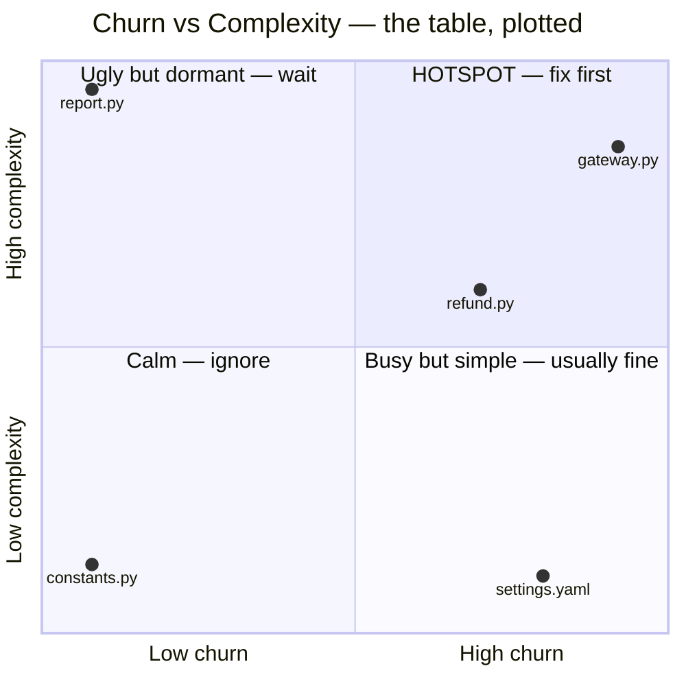

# Hotspot Analysis — Middle Level

> **Category:** [Anti-Patterns at Scale](../README.md) → **Hotspot Analysis** — *use git history to find the few files where complexity and change frequency collide — that is where anti-patterns actually cost money.*
> **Covers (collectively):** Churn × complexity · Code-as-a-crime-scene · Change / temporal coupling · Knowledge maps & bus factor · Defect-density prioritization

---

## Table of Contents

1. [Introduction](#introduction)
2. [Prerequisites](#prerequisites)
3. [The Two Axes, Made Computable](#the-two-axes-made-computable)
4. [Churn: One Command, Whole Repo](#churn-one-command-whole-repo)
5. [Complexity: Cheap Proxies That Work](#complexity-cheap-proxies-that-work)
6. [The Churn × Complexity Table](#the-churn--complexity-table)
7. [A Script That Joins Churn and Complexity](#a-script-that-joins-churn-and-complexity)
8. [Reading the Ranked Output](#reading-the-ranked-output)
9. [Bounding the Time Window](#bounding-the-time-window)
10. [Common Mistakes](#common-mistakes)
11. [Test Yourself](#test-yourself)
12. [Cheat Sheet](#cheat-sheet)
13. [Summary](#summary)
14. [Further Reading](#further-reading)
15. [Related Topics](#related-topics)

---

## Introduction

> Focus: **Computing hotspots yourself.** Turn "I suspect this file is hot" into a ranked list of the whole repo, produced by a command and a small script — so targets come from data, not vibes.

`junior.md` taught you what a hotspot *is*: a file that is both **complex** and **high-churn**, and why that intersection — not the biggest or ugliest file — is where refactoring pays off. It also showed you how to inspect *one* file you already suspected.

The middle-level skill is the inversion: instead of guessing a path and confirming it, you compute **both axes for every file at once** and let the ranking tell you where to look. That removes the last place vibes can hide. "I think `gateway.py` is bad" becomes a row near the top of a table you can hand to anyone, and the file you never thought about — the one quietly edited by six people a week — appears whether or not it was on your radar.

Everything here runs on tools you already have: `git`, the shell, and ~30 lines of Python. No CodeScene license, no `code-maat` install. You are reconstructing the core of those tools so you understand exactly what they measure.

> **The mindset shift:** stop asking "is this file bad?" and start *measuring* two numbers per file. The hotspot is an emergent property of the product of those numbers — and you can only see it once you've computed it for the whole repo, not one file at a time.

---

## Prerequisites

- **Required:** [`junior.md`](junior.md) — you know what churn, complexity, and a hotspot are, and why size alone is the wrong target.
- **Required:** Comfortable shell: pipes, `sort`, `uniq -c`, `awk`/`cut`, redirection. We compose these heavily.
- **Required:** Basic Python — you can read a dict, a loop, and `subprocess`. The join script is small but you'll want to modify it.
- **Helpful:** You've run `git log` with `--format`/`--pretty` and `--name-only` before. If not, the commands below explain each flag.

---

## The Two Axes, Made Computable

A hotspot needs a number on each axis. The middle-level goal is one cheap, repeatable number per file per axis:

| Axis | What it measures | Cheap, computable proxy |
|---|---|---|
| **Churn** | How often the file changes | Count of commits that touched it (or lines added + removed) over a window |
| **Complexity** | How hard the file is to change | Lines of code; or indentation/nesting depth; or cyclomatic complexity |

Neither proxy is perfect — that's fine. The hotspot ranking is robust to noisy proxies because it depends on the *product* and on the *ordering*, not on precise absolute values. A file in the 95th percentile on both axes stays near the top whether you measure complexity as raw LOC or as cyclomatic complexity. The job is to get *a* number, rank, and look at the top.

---

## Churn: One Command, Whole Repo

The single most useful churn command lists the files touched by every commit and counts how often each appears:

```bash
git log --format= --name-only | sort | uniq -c | sort -rn | head -20
```

Read it left to right:

- `git log --format=` — log every commit but print **no** commit header (empty format string). All that remains is the file list from…
- `--name-only` — …which prints, for each commit, the paths it changed, one per line.
- `sort` — group identical paths next to each other so `uniq` can count them.
- `uniq -c` — collapse runs of identical lines into one line prefixed with the count.
- `sort -rn` — sort by that count, numeric, descending — most-churned first.
- `head -20` — the top 20.

Sample output:

```
 214 src/payments/gateway.py
 188 src/api/routes.py
 152 config/settings.yaml
 141 src/payments/refund.py
  97 src/orders/service.py
  ...
```

That count is **commit-touch churn**: how many commits edited each file. It is the cheapest, most stable churn metric and the one to start with.

A finer alternative is **line churn** — lines added plus deleted — which weights a 200-line rewrite more than a one-character fix:

```bash
# Lines added + deleted per file (numstat), summed across all commits.
git log --numstat --format= \
  | awk 'NF==3 { added[$3]+=$1; deleted[$3]+=$2 }
         END   { for (f in added) print added[f]+deleted[f], f }' \
  | sort -rn | head -20
```

`--numstat` prints `added<TAB>deleted<TAB>path` per changed file (`-` for binary files, which the `NF==3` guard skips). Commit-touch and line churn usually agree on the top files; when they disagree, it's a clue (a file with few commits but huge line churn is being rewritten wholesale).

> Start with commit-touch churn. Reach for line churn only when you need to distinguish "edited often in small ways" from "rewritten in bulk."

---

## Complexity: Cheap Proxies That Work

You need a complexity number per file. Three proxies, in increasing cost and accuracy:

**1. Lines of code** — crude but free and shockingly predictive (long files are usually complex files):

```bash
# LOC per tracked source file, largest first.
git ls-files '*.py' | xargs wc -l | sort -rn | head -20
```

**2. Indentation depth** — Tornhill's observation: *whitespace shape* tracks logical complexity closely. Deeply nested code has many leading spaces. A file's mean or max indentation is a better complexity proxy than raw LOC and is still trivial to compute:

```bash
# Mean leading-whitespace (indentation) per line — a complexity proxy.
awk '{ match($0, /^ */); sum += RLENGTH; n++ }
     END { if (n) printf "%.1f\n", sum/n }' src/payments/gateway.py
```

**3. Cyclomatic complexity** — the real metric: independent paths through the code (≈ number of branches + 1). Most accurate, needs a tool:

```bash
# Python: radon gives cyclomatic complexity per function and file
radon cc -s -a src/payments/gateway.py
# Go: gocyclo; Java: PMD / checkstyle; multi-language: lizard
lizard src/payments/gateway.py     # works across many languages
```

For a first hotspot pass, **LOC is enough**. Upgrade to indentation or cyclomatic complexity when you want to defend the ranking or when LOC misleads (a long but flat data file scores high on LOC but is genuinely simple).

---

## The Churn × Complexity Table

Put the two numbers side by side and the hotspots announce themselves. Suppose a 12-month window gives:

| File | Churn (commits) | Complexity (LOC) | Churn × LOC | Verdict |
|---|---:|---:|---:|---|
| `src/payments/gateway.py` | 214 | 980 | 209,720 | **Hotspot — fix first** |
| `src/payments/refund.py` | 141 | 620 | 87,420 | **Hotspot — second** |
| `src/orders/service.py` | 97 | 540 | 52,380 | Watch — rising |
| `config/settings.yaml` | 152 | 90 | 13,680 | High churn, trivial — *fine* |
| `src/legacy/report.py` | 6 | 1,900 | 11,400 | Ugly but dormant — wait |
| `src/utils/constants.py` | 6 | 110 | 660 | Calm — ignore |

The product column sorts the list, but **read both raw columns too** — the product alone hides *why* a file ranks where it does:

- `gateway.py` and `refund.py` score high on **both** axes. Real hotspots. They top the list and they deserve the top.
- `settings.yaml` has the second-highest churn in the repo, but its complexity is ~90 trivial lines of key/value config. High churn × low complexity = a routine config file. **Not a hotspot** — the product is modest *and* the complexity column tells you it's harmless to change. Don't refactor it.
- `legacy/report.py` is the biggest file by far, but 6 commits in a year. Real debt, zero interest. The product is low *because* churn is low. Leave it until a feature forces you in.

> The product ranks; the two raw columns *explain*. A file you'd never refactor (`settings.yaml`) and a file you'd refactor first (`gateway.py`) can have a similar-looking product for opposite reasons — always look at both axes, not just the column you sorted on.



---

## A Script That Joins Churn and Complexity

The table above is what you want automatically, for every file, ranked. Here is a self-contained Python script that mines churn from git, measures complexity as LOC, joins them, and prints the top hotspots. It depends only on `git` and the standard library.

```python
#!/usr/bin/env python3
"""hotspots.py — rank files by churn × complexity from git history.

Churn      = number of commits that touched the file (in the window).
Complexity = lines of code (cheap proxy; swap in cyclomatic complexity later).
Score      = churn * loc.

Usage:  python3 hotspots.py [--since '12 months ago'] [--top 20]
"""
import argparse
import os
import subprocess
from collections import Counter

# File types we treat as source; tune for your repo.
SOURCE_EXT = {".py", ".go", ".java", ".js", ".ts", ".rb", ".rs", ".kt", ".c", ".cpp"}


def churn(since: str) -> Counter:
    """commits-touched count per file, from git log."""
    out = subprocess.run(
        ["git", "log", "--format=", "--name-only", f"--since={since}"],
        capture_output=True, text=True, check=True,
    ).stdout
    counts = Counter()
    for path in out.splitlines():
        path = path.strip()
        if path:                       # skip blank lines between commits
            counts[path] += 1
    return counts


def loc(path: str) -> int:
    """lines of code; 0 if the file no longer exists (deleted/renamed)."""
    if not os.path.isfile(path):
        return 0
    with open(path, "rb") as f:        # binary-safe line count
        return sum(1 for _ in f)


def is_source(path: str) -> bool:
    return os.path.splitext(path)[1] in SOURCE_EXT


def main() -> None:
    ap = argparse.ArgumentParser()
    ap.add_argument("--since", default="12 months ago")
    ap.add_argument("--top", type=int, default=20)
    args = ap.parse_args()

    counts = churn(args.since)
    rows = []
    for path, commits in counts.items():
        if not is_source(path):        # ignore config, docs, vendored data
            continue
        lines = loc(path)
        if lines == 0:                 # file deleted since the window — skip
            continue
        rows.append((commits * lines, commits, lines, path))

    rows.sort(reverse=True)            # by score, descending
    print(f"{'score':>10}  {'churn':>6}  {'loc':>6}  file")
    print("-" * 60)
    for score, commits, lines, path in rows[: args.top]:
        print(f"{score:>10}  {commits:>6}  {lines:>6}  {path}")


if __name__ == "__main__":
    main()
```

Run it at the repo root:

```bash
python3 hotspots.py --since '12 months ago' --top 15
```

The script is deliberately small so you can read every line and extend it. Two natural upgrades:

- **Better complexity:** replace `loc()` with a call to `radon cc` / `lizard` and parse the cyclomatic number. The join logic doesn't change.
- **Better churn:** swap the commit count for line churn via `--numstat` (sum of added + deleted), if you want bulk rewrites to weigh more.

---

## Reading the Ranked Output

A run might print:

```
     score   churn     loc  file
------------------------------------------------------------
    209720     214     980  src/payments/gateway.py
     87420     141     620  src/payments/refund.py
     52380      97     540  src/orders/service.py
     41600      80     520  src/auth/session.py
     28900      85     340  src/api/serializers.py
     ...
```

How to act on it — this is the part that separates a number from a decision:

1. **Look at the top 5–10, not the whole list.** The value is prioritization; you act on a handful. The long tail is noise.
2. **Sanity-check each top row against the two raw columns.** A high score from `churn=300, loc=80` is a churning *simple* file (probably a config or routing file that slipped past your extension filter) — not a hotspot. A high score from `churn=8, loc=4000` is a near-dormant giant — not urgent. You want both columns *high*.
3. **Open the top genuine hotspot and read it.** The ranking tells you *where*; it does not tell you *what's wrong*. Now bring your anti-pattern knowledge — is it a God Object? Arrow code? — from the earlier chapters.
4. **Re-run after a quarter.** A hotspot you refactor should *fall* down the list (complexity drops); a file *climbing* the list is your next target before it gets worse. The ranking is a trend instrument, not a one-shot photo.

---

## Bounding the Time Window

Churn is meaningless without a window. "214 commits" since *when*? The window encodes a decision about what "recently expensive" means:

```bash
# Last 12 months — the usual default: captures current pain, ignores ancient history.
git log --format= --name-only --since='12 months ago' | sort | uniq -c | sort -rn

# Last 90 days — what's hot *right now* (good before a refactoring sprint).
git log --format= --name-only --since='90 days ago' | sort | uniq -c | sort -rn
```

Why the window matters:

- **Too long** (all history): a file that churned heavily three years ago during initial development but is stable now scores high on lifetime churn and pollutes the ranking with *old* pain. You'd refactor a file that's already calm.
- **Too short** (last 2 weeks): you over-fit to whatever the team happened to touch this sprint — a temporary spike, not a structural hotspot.
- **A rolling 6–12 months** is the usual sweet spot: long enough to be structural, short enough to reflect the code *as it is now*. Match it to your release cadence and how fast the codebase moves.

> Always state the window when you report a hotspot. "`gateway.py`, 214 commits **over the last 12 months**" is a claim someone can reproduce; "`gateway.py` is hot" is a vibe.

---

## Common Mistakes

1. **Sorting only by the score column and trusting it blind.** The product ranks, but a high score can come from high-churn-trivial (a config that leaked past your filter) or huge-but-dormant. Always read the raw churn and LOC columns next to the score.
2. **Forgetting to set a window.** Lifetime churn buries today's hotspots under files that were hot during the project's first year. Default to a rolling 12 months.
3. **Letting config/generated/vendored files into the ranking.** A `package-lock.json` or a generated `*.pb.go` can dominate churn *and* LOC and crowd out real source. Filter by extension and exclude generated/vendored paths (the script's `SOURCE_EXT` is a start; add a path-exclude next).
4. **Treating LOC as truth instead of a proxy.** A 4,000-line constants file scores high on LOC but is trivial. When LOC misleads, upgrade that file's complexity to cyclomatic or indentation depth before deciding.
5. **Refactoring the whole top-20.** The output is a priority queue, not a to-do list. Fix the top one or two, re-measure, repeat. Trying to clean the whole list is how a "quick win" becomes a doomed six-week rewrite.
6. **Not re-running.** A single ranking is a snapshot. The signal you actually want is *movement*: did the file you fixed drop, and what's climbing? Re-run every quarter and diff.

---

## Test Yourself

1. Write the one-line shell command that prints the 20 most-churned files in the repo, most-churned first, counting commit-touches.
2. In that pipeline, what does `--format=` (empty) do, and why is it there?
3. A file ranks #2 by churn×LOC with `churn=260, loc=70`. Should you refactor it? What does the raw-column split tell you?
4. Name two cheaper-than-cyclomatic complexity proxies, and one reason indentation depth can beat raw LOC.
5. Why does a 12-month window usually beat "all history" for a churn ranking? Give the concrete failure mode of all-history.
6. The script measures complexity as `loc()`. Describe the single change that upgrades it to cyclomatic complexity, and why the rest of the script is unaffected.

<details>
<summary>Answers</summary>

1. `git log --format= --name-only | sort | uniq -c | sort -rn | head -20`
2. `--format=` sets an **empty commit header format**, so `git log` prints *no* hash/author/date/subject lines — only the file paths from `--name-only` survive into the pipe, so `uniq -c` counts files cleanly without commit metadata polluting the counts.
3. **Probably not.** `churn=260` is very high but `loc=70` is trivial — high churn on a tiny file. The score is inflated by churn alone; the low LOC says it's cheap to change (likely a config/routing/flags file that slipped past the source filter). A hotspot needs *both* columns high. Read the file: if it's a flat config, exclude it and move on.
4. **LOC** and **indentation/nesting depth** are both cheaper than cyclomatic complexity. Indentation can beat raw LOC because a long but *flat* file (a big data/constants table) has low indentation and is genuinely simple, whereas LOC would flag it as complex — indentation tracks *logical* nesting, which is closer to true change-difficulty.
5. A rolling window reflects the code **as it is now**. With all-history, a file that churned heavily during the project's first year but has been stable since scores high on *lifetime* churn and rises to the top — so you'd spend refactoring time on a file that's already calm. The 12-month window drops that stale signal and surfaces *current* pain.
6. Replace the body of `loc(path)` with a call that runs a cyclomatic-complexity tool (e.g., `radon cc`/`lizard`) on the file and parses out the number. The rest is unaffected because the join only needs *a* per-file complexity number to multiply by churn — it doesn't care how that number was computed. (Same reason churn can swap commit-count for line churn independently.)

</details>

---

## Cheat Sheet

| Task | Command / approach |
|---|---|
| Churn (commit-touches), whole repo | `git log --format= --name-only \| sort \| uniq -c \| sort -rn` |
| Churn over a window | add `--since='12 months ago'` to `git log` |
| Line churn (added+deleted) | `git log --numstat --format=` + `awk` summing `$1+$2` per `$3` |
| Complexity — cheap | `git ls-files '*.py' \| xargs wc -l \| sort -rn` |
| Complexity — better | indentation depth (`awk` on leading spaces) or `radon`/`gocyclo`/`lizard` |
| Hotspot = | rank by **churn × complexity**, then read *both* raw columns |
| Act on | the **top 1–2**, re-measure next quarter, watch what climbs |

> **One rule to remember:** *Compute both numbers for every file, rank by the product, but decide by reading both columns — the score finds candidates, the columns confirm them.*

---

## Summary

- The middle-level skill is to compute churn **and** complexity for the **whole repo at once** and rank by the product — replacing "I suspect this file" with a list anyone can reproduce.
- **Churn** comes from one command: `git log --format= --name-only | sort | uniq -c | sort -rn`. Use commit-touch counts first; line churn (`--numstat`) when bulk rewrites should weigh more.
- **Complexity** has cheap proxies: LOC (free), indentation depth (better — tracks logical nesting), cyclomatic complexity (best, needs a tool). LOC is enough to start.
- The **churn × complexity table** ranks by the product, but you decide by reading *both raw columns*: a high score can mean a real hotspot (both high) or a harmless config (churn high, complexity trivial). Never act on the score alone.
- A ~30-line Python script joins git churn and LOC into a ranked top-N. It's small on purpose: swap in cyclomatic complexity or line churn without touching the join.
- Always **bound the window** (rolling 12 months is the default) and **re-run** — the real signal is movement: what fell after you fixed it, and what's climbing next.
- Next: [`senior.md`](senior.md) — *churn × complexity finds single-file hotspots, but the most expensive coupling is invisible to it: files that change **together** while living apart. Senior level mines **temporal (change) coupling** and defect coupling, then turns the findings into a prioritized refactoring backlog tied to fitness functions and ratchets.*

---

## Further Reading

- **Your Code as a Crime Scene** — Adam Tornhill (1st ed. 2015, 2nd ed. 2024) — the churn × complexity hotspot, why indentation tracks complexity, computing it from git.
- **Software Design X-Rays** — Adam Tornhill (2018) — the algorithms behind CodeScene; scaling hotspots beyond the file.
- **code-maat** — Tornhill's open-source miner (the tool the books build on) — read its README to see the same metrics computed at scale.
- **radon / lizard / gocyclo** — drop-in cyclomatic-complexity tools to upgrade the script's complexity axis.
- **Pro Git** — Chacon & Straub (free online) — `git log` formatting, `--numstat`, `--name-only`, history selection.

---

## Related Topics

- [Hotspot Analysis → Junior](junior.md) — what churn, complexity, and a hotspot are; spotting one file by hand.
- [Hotspot Analysis → Senior](senior.md) — beyond single files: temporal/change coupling and a prioritized backlog.
- [Refactoring → Code Smells](../../../refactoring/01-code-smells/README.md) — what to *do* to the top file once the ranking points at it.
- [Bad Structure → Senior](../../01-development/01-bad-structure/senior.md) — the shapes (God Object, spaghetti) a high-LOC hotspot usually turns out to contain.
- [Architecture Fitness Functions](../01-architecture-fitness-functions/senior.md) — gate a fixed hotspot so its complexity can't climb back.
- [Anti-Pattern Budgets & Ratcheting](../02-anti-pattern-budgets-and-ratcheting/senior.md) — stop new hotspots forming while you work the queue.
- [Architecture → Anti-Patterns](../../../../../Architecture/anti-patterns/README.md) — the organizational view of the same costs.
