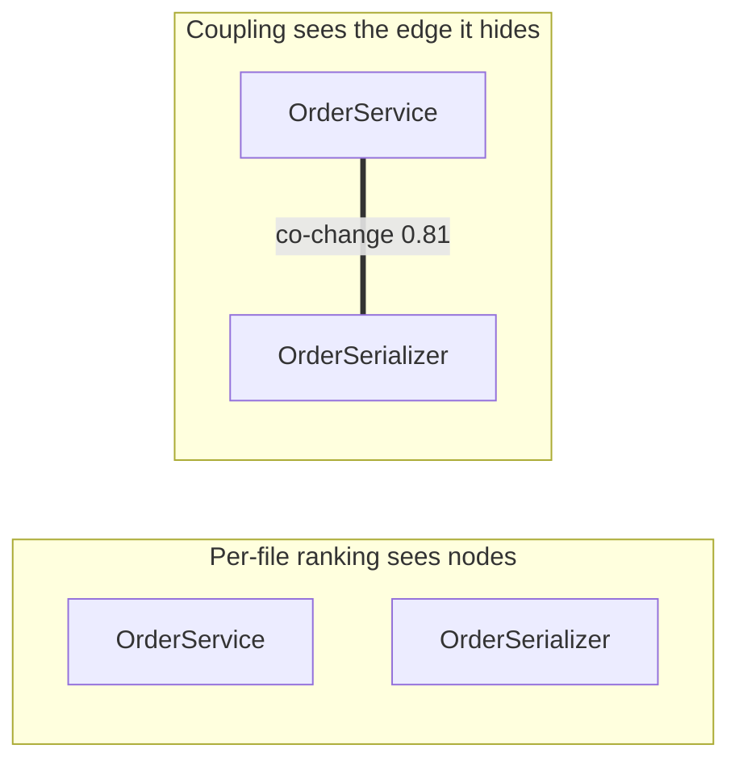
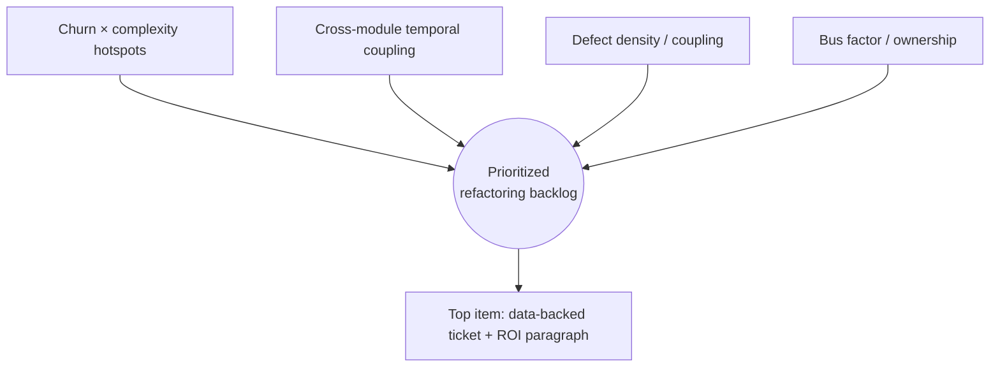

# Hotspot Analysis — Senior Level

> **Category:** [Anti-Patterns at Scale](../README.md) → **Hotspot Analysis** — *use git history to find the few files where complexity and change frequency collide — that is where anti-patterns actually cost money.*
> **Covers (collectively):** Churn × complexity · Code-as-a-crime-scene · Change / temporal coupling · Knowledge maps & bus factor · Defect-density prioritization

---

## Table of Contents

1. [Introduction](#introduction)
2. [Prerequisites](#prerequisites)
3. [The Limit of Single-File Hotspots](#the-limit-of-single-file-hotspots)
4. [Change / Temporal Coupling: Files That Change Together](#change--temporal-coupling-files-that-change-together)
5. [Computing Temporal Coupling Yourself](#computing-temporal-coupling-yourself)
6. [Defect Coupling: Files That Break Together](#defect-coupling-files-that-break-together)
7. [code-maat and CodeScene: What They Add](#code-maat-and-codescene-what-they-add)
8. [Building a Prioritized Refactoring Backlog](#building-a-prioritized-refactoring-backlog)
9. [Tying Hotspots to Fitness Functions and Ratchets](#tying-hotspots-to-fitness-functions-and-ratchets)
10. [Common Mistakes](#common-mistakes)
11. [Test Yourself](#test-yourself)
12. [Cheat Sheet](#cheat-sheet)
13. [Summary](#summary)
14. [Further Reading](#further-reading)
15. [Related Topics](#related-topics)

---

## Introduction

> Focus: **Beyond churn — coupling.** The most expensive structure isn't a single hot file; it's the *hidden coupling between files that change together but live apart*. Senior level mines temporal and defect coupling, then turns the findings into a prioritized backlog wired to fitness functions and ratchets.

`middle.md` taught you to compute churn × complexity for the whole repo and rank the files. That ranking is genuinely useful — but it has a blind spot, and at scale the blind spot is where the worst money goes.

Churn × complexity is a **per-file** metric. It cannot see *relationships*. Two files can each look moderate on their own — middling churn, middling size — yet change in lockstep: every time you edit `OrderService` you must also edit `OrderSerializer`, even though no `import` obviously forces it. That **change coupling** is invisible to a single-file ranking, and it is often the costlier problem, because it means every change is secretly a *multi-file* change and the team is paying a tax nobody charted.

The senior skill is to mine the *co-change* structure of the history — which files move together, which files appear together in bug fixes — and to fold that into a **prioritized refactoring backlog** that you can defend with data and then *protect* with fitness functions and ratchets so the gains don't erode.

> **The mindset shift:** a hotspot ranking answers "*where* is the complexity I keep editing?" Coupling analysis answers "*which edits secretly drag other edits along?*" The second is the structural truth a per-file metric can't reach — and it's where architectural debt actually hides.

---

## Prerequisites

- **Required:** [`middle.md`](middle.md) — you can compute churn (commit-touches and line churn) and complexity (LOC, indentation, cyclomatic) for the whole repo and rank by the product.
- **Required:** Fluent `git log` mining: `--name-only`, `--numstat`, `--format`, `--since`, `--grep`, and you can post-process with `awk`/Python.
- **Required:** You understand coupling and cohesion structurally (see [Coupling & State](../../02-design/02-coupling-and-state/senior.md)) — temporal coupling is *empirical evidence* of the logical coupling those chapters describe.
- **Helpful:** Familiarity with [Architecture Fitness Functions](../01-architecture-fitness-functions/senior.md) and [Anti-Pattern Budgets & Ratcheting](../02-anti-pattern-budgets-and-ratcheting/senior.md) — this file ends by wiring hotspot findings into both.
- **Helpful:** You've read Tornhill's *Software Design X-Rays* or used CodeScene — we reconstruct its core metrics from raw git.

---

## The Limit of Single-File Hotspots

The middle-level ranking is a **marginal** view: it scores each file independently and never asks how files relate. Three real situations it cannot see:

- **A clean split that isn't.** You broke a God Object into `OrderService` and `OrderPricing`. Each now looks healthy on the per-file ranking. But the history shows they change *together* 80% of the time — the split was cosmetic; the logical responsibility is still one thing spread across two files. The ranking says "good"; the coupling says "you just made it worse — same change, now two files and a sync burden."
- **The expensive pair, neither of which is a hotspot.** `config/routes.py` (high churn, trivial) and `handlers/dispatch.py` (moderate everything) each rank unremarkably. But every route change forces a dispatch change, and people forget the second half, shipping bugs. The *pair* is the problem; neither *file* is.
- **The architectural seam under strain.** A frontend module and a backend serializer change together on every feature because they share an implicit contract. That's a missing abstraction (a schema, a typed API) — a relationship, not a file.

In each case the cost lives in an **edge**, not a **node**. Single-file hotspot analysis ranks nodes. To see the edges you need co-change analysis.



---

## Change / Temporal Coupling: Files That Change Together

**Temporal coupling** (a.k.a. change coupling, logical coupling, co-change): two files are temporally coupled when they tend to be modified in the *same commits*, over and over, regardless of whether the code shows an explicit dependency.

It is *evidence-based* coupling. Static analysis finds dependencies the code *declares*; temporal coupling finds dependencies the *team actually exercises* — including ones with no syntactic trace:

- A duplicated constant or business rule copy-pasted into two files: no import links them, but every rule change edits both. Pure temporal coupling, invisible to a dependency graph.
- A frontend form and the backend endpoint it posts to: separate languages, separate repos sometimes, but coupled by a shared contract.
- A class and its test that *over-specifies* it: every refactor breaks and rewrites the test. (Some of this is healthy; persistent high coupling between production code and a single test often signals a brittle test, not real coupling.)

Two numbers describe a coupled pair:

- **Degree of coupling** — of the commits that touched *either* file, what fraction touched *both*? `coupling(A,B) = shared / (touched_A + touched_B − shared)`. A degree of 0.8 means 80% of the time you edit one, you edit the other.
- **Support / revisions** — how many shared commits the degree is computed from. A degree of 1.0 from *2* shared commits is noise; 0.7 from 90 shared commits is a structural fact. **Always read degree and support together** — degree without support is the coupling-analysis equivalent of a score without its raw columns.

> The dangerous coupling is **high degree + high support + physical distance**: two files in different modules/packages that nonetheless change together constantly. They *look* decoupled (different directories) but *behave* as one unit. That gap between apparent and actual structure is the architectural debt.

---

## Computing Temporal Coupling Yourself

You don't need a tool to start. Mine pairs of files that appear in the same commit, then count co-occurrences. Here is a self-contained script:

```python
#!/usr/bin/env python3
"""coupling.py — temporal (change) coupling from git history.

For every commit, take the set of files changed and emit all unordered pairs.
Coupling(A,B) = shared_commits / commits_touching_either.
Report pairs with enough support to be trustworthy.
"""
import subprocess
from collections import Counter
from itertools import combinations

MIN_SUPPORT = 8        # ignore pairs seen in fewer than this many commits
MAX_FILES_PER_COMMIT = 25   # skip giant bulk commits (formatting, vendoring, merges)


def commits():
    """yield the list of files changed in each commit."""
    out = subprocess.run(
        ["git", "log", "--format=%x00", "--name-only", "--no-merges",
         "--since=12 months ago"],
        capture_output=True, text=True, check=True,
    ).stdout
    for block in out.split("\x00"):
        files = [ln.strip() for ln in block.splitlines() if ln.strip()]
        if files:
            yield files


def main():
    touched = Counter()          # commits that touched each file
    shared = Counter()           # commits that touched each pair
    for files in commits():
        files = sorted(set(files))
        if len(files) > MAX_FILES_PER_COMMIT:
            continue             # bulk commit: would couple everything to everything
        for f in files:
            touched[f] += 1
        for a, b in combinations(files, 2):
            shared[(a, b)] += 1

    rows = []
    for (a, b), s in shared.items():
        if s < MIN_SUPPORT:
            continue
        either = touched[a] + touched[b] - s
        degree = s / either if either else 0
        rows.append((degree, s, a, b))

    rows.sort(reverse=True)      # strongest coupling first
    print(f"{'degree':>6}  {'supp':>4}  file pair")
    print("-" * 70)
    for degree, s, a, b in rows[:25]:
        print(f"{degree:6.2f}  {s:>4}  {a}  <->  {b}")


if __name__ == "__main__":
    main()
```

Three design choices that matter — and that the tools also make:

- `--no-merges`: merge commits restate a whole branch's files and would fabricate coupling. Exclude them.
- `MAX_FILES_PER_COMMIT`: a single 400-file "reformat everything" or "bump license headers" commit would pair every file with every other file (an *O(n²)* explosion of false coupling). Cap commit size and these vanish. (Professional level treats this filtering rigorously.)
- `MIN_SUPPORT`: a pair seen twice with degree 1.0 is a coincidence. Require enough shared commits before you trust the degree.

Sample output:

```
degree  supp  file pair
----------------------------------------------------------------------
  0.83    71  src/orders/service.py     <->  src/orders/serializer.py
  0.78    44  src/api/routes.py         <->  src/api/handlers.py
  0.71    39  web/checkout/form.tsx     <->  src/payments/gateway.py
  0.66    52  src/orders/service.py     <->  src/orders/service_test.py
  ...
```

Now interpret with architecture in mind:

- Row 1: same package, very high degree — likely **one responsibility split across two files** (or a leaky abstraction). Candidate to *merge* the responsibility or introduce a cleaner internal boundary.
- Row 3: a `.tsx` form coupled to a Python `gateway.py` across the front/back boundary — a **missing shared contract** (a schema, generated types). Candidate to introduce that contract so the coupling has a home.
- Row 4: production code coupled to its own test — usually fine, but 0.66 sustained can mean a **brittle, over-specified test** that rewrites on every change.

---

## Defect Coupling: Files That Break Together

Co-change in *any* commit is one signal. Co-change in **bug-fix** commits is a sharper one — it points at where defects cluster, which is precisely where refactoring buys reliability, not just convenience.

Restrict the history to fix commits, then run the same churn and coupling analysis:

```bash
# Defect density: which files appear most in bug-fix commits (last 12 months)?
git log --format= --name-only --no-merges --since='12 months ago' \
    --grep='fix\|bug\|hotfix\|defect\|patch' -i \
  | sort | uniq -c | sort -rn | head -20
```

This is **defect density**: a file in 40 fix commits is where bugs *land* and get patched repeatedly — a strong signal the file (or its design) is error-prone, independent of total churn. A file can have modest overall churn but a high *share* of fix commits; that ratio (`fix_commits / total_commits`) is often more telling than the raw count.

**Defect coupling** is the same idea applied to pairs: files that co-occur in *fix* commits. If `auth.py` and `session.py` keep getting fixed *together*, a bug in one routinely implies a bug in the other — they share a fragile contract. That pair belongs near the top of the backlog because refactoring it pays in *fewer incidents*, the most defensible refactoring ROI you can put in front of a manager.

> **Caveat on `--grep`:** keyword-matching commit messages is a *heuristic*, only as good as your team's commit hygiene. It's a strong start; the rigorous version (professional level) links commits to closed bug tickets / incident IDs instead of trusting the word "fix" in the subject line.

---

## code-maat and CodeScene: What They Add

You've now hand-rolled the core metrics. The tools exist because doing this *rigorously at scale* is more work than a 30-line script.

**`code-maat`** (Tornhill's open-source miner, the engine behind the books): you feed it a git log in a specific format and it computes churn, coupling, age, and ownership analyses:

```bash
# Produce the log format code-maat expects, then run an analysis.
git log --all --numstat --date=short --pretty=format:'--%h--%ad--%an' \
    --no-renames --after=2025-06-01 > logfile.log

maat -l logfile.log -c git2 -a coupling      # temporal coupling
maat -l logfile.log -c git2 -a revisions     # churn (revisions per file)
maat -l logfile.log -c git2 -a authors       # author count per file (bus factor)
maat -l logfile.log -c git2 -a entity-effort # who did how much work where
```

What it adds over your script: battle-tested filtering, several analyses (ownership, age, effort) in one tool, and a stable output format you can pipe into dashboards.

**CodeScene** (Tornhill's commercial product) adds the layers that are genuinely hard to build yourself:

- **Function-level hotspots** — churn × complexity *inside* a file, so you target the hot *function* in a 2,000-line file, not the whole file.
- **Knowledge maps & bus factor** — who owns each hotspot; what becomes orphaned if a person leaves (the "off-boarding risk" map). This is the *people* dimension of the same git data.
- **Trend / "X-ray" over time** — is a hotspot getting hotter or cooling after your refactor? Visual, automatic, historical.
- **Change-coupling across architectural boundaries**, rendered as a map, with significance filtering already handled.

> The progression is deliberate: **raw git → code-maat → CodeScene** trades effort for rigor and visualization. Start with raw git so you understand *what is being measured*; adopt the tools when the analysis becomes routine and you need it to be trustworthy and shareable, not when you're learning what a hotspot is.

---

## Building a Prioritized Refactoring Backlog

The point of all this mining is **one ranked list of refactoring work, ordered by cost-of-not-doing-it**, that you can defend. Combine the signals — don't rank on any single one:

| Signal | Source | What it argues |
|---|---|---|
| Churn × complexity | `hotspots.py` (middle) | "You keep editing hard code here." |
| Temporal coupling (degree+support, cross-module) | `coupling.py` | "Every change here secretly drags another file." |
| Defect density / defect coupling | `--grep`/ticket-linked | "Bugs cluster here — refactoring buys reliability." |
| Bus factor / ownership | `maat -a authors` | "One person holds this; it's a single point of failure." |

A workable scoring rubric for a backlog item:

1. **Is it a churn×complexity hotspot?** (high → strong base priority)
2. **Is it in high cross-module temporal coupling?** (high → the fix is architectural and high-leverage)
3. **Does it carry high defect density?** (high → the ROI is fewer incidents — the most fundable kind)
4. **Is the bus factor 1?** (yes → add risk-reduction urgency)

Then for each top item write a **one-paragraph case**: the metric, the window, the cost it's imposing (e.g., "*23 of last quarter's incidents touched this pair*"), and the proposed change. That paragraph is what turns "we should refactor someday" into a prioritized, funded ticket — refactoring justified by *data*, sequenced by *cost*, not by whoever complained loudest.



---

## Tying Hotspots to Fitness Functions and Ratchets

Finding and fixing a hotspot is worthless if it silently degrades back. Hotspot analysis and the other at-scale techniques form a loop: **measure → fix → guard → prevent**.

- **Fitness functions** turn a hotspot's metric into an *automated gate*. Once you've refactored `gateway.py` from 980 lines and cyclomatic 140 down to a set of 200-line collaborators, add a [fitness function](../01-architecture-fitness-functions/senior.md) that *fails the build* if any file's complexity climbs past a threshold — so the win is defended by CI, not by vigilance.

- **Ratchets** handle the realistic case where you can't fix everything at once. An [anti-pattern budget / ratchet](../02-anti-pattern-budgets-and-ratcheting/senior.md) records the *current* hotspot metrics as a ceiling and forbids regression: complexity and churn-coupling can only go *down* over time. New code can't add to a known hotspot; the hotspot can only shrink. The hotspot ranking is the natural input to the ratchet's baseline.

- **Coupling fitness functions** are especially powerful: encode "module X must not be temporally coupled to module Y above degree 0.5" as a check that runs `coupling.py` in CI and fails when an architectural seam starts fraying. You've turned an *empirical* observation into an *enforced* boundary.

The full at-scale toolchain then chains naturally:

1. **Hotspot analysis** (this file) tells you *where* and *what* to fix.
2. [Automated large-scale refactoring](../04-automated-large-scale-refactoring/senior.md) fixes a hotspot that spans many files mechanically.
3. [Strangler-fig and seams](../05-strangler-fig-and-seams/senior.md) replaces a hotspot too dangerous to refactor in place.
4. [Fitness functions](../01-architecture-fitness-functions/senior.md) and [ratchets](../02-anti-pattern-budgets-and-ratcheting/senior.md) keep it from coming back.

> Hotspot analysis is the *targeting* system for every other technique in this chapter. Without it you refactor by intuition; with it, every other at-scale tool is aimed at the code that actually costs money.

---

## Common Mistakes

1. **Stopping at single-file hotspots.** Churn × complexity is necessary but blind to relationships. The costliest debt is often a coupled *pair* of unremarkable files. Always run a coupling pass before declaring the analysis done.
2. **Trusting coupling degree without support.** A degree of 1.0 from 2 shared commits is noise. Read degree *and* support together; set a `MIN_SUPPORT` floor — it's the coupling analog of reading raw columns next to a score.
3. **Letting bulk commits fabricate coupling.** One "reformat everything" or vendoring commit pairs every file with every other file (O(n²) false edges). Cap files-per-commit and exclude merges, or your coupling report is fiction.
4. **Treating production↔test coupling as a problem to eliminate.** Some co-change between code and its test is *healthy* (the test tracks the behavior). Only *persistently high* coupling suggests a brittle, over-specified test. Don't refactor away a test that's correctly tracking change.
5. **Trusting `--grep='fix'` as ground truth for defects.** It's a heuristic bounded by commit hygiene. For high-stakes decisions, link commits to closed bug/incident tickets instead of keyword-matching subjects.
6. **Producing a ranking and no backlog.** Metrics that don't become prioritized, data-backed tickets change nothing. The deliverable is a *sequenced backlog with an ROI paragraph per item*, not a chart.
7. **Fixing a hotspot and not guarding it.** Without a fitness function or ratchet, complexity creeps back and you re-pay the cost. Bake the post-refactor metric into CI as a ceiling.
8. **Treating the analysis as one-shot.** Coupling and hotspots *move*. Re-run quarterly; the signal you most want is the *trend* — what cooled after a fix and what's heating up next.

---

## Test Yourself

1. Give a concrete scenario where two files are *each* unremarkable on a churn × complexity ranking yet are the most expensive thing in the codebase. What metric reveals them?
2. Define temporal coupling's **degree** and **support**, and explain why a degree of 1.0 can be worthless.
3. Why must you exclude merge commits and cap files-per-commit before computing temporal coupling? What false result does each prevent?
4. Two files in *different packages* show coupling degree 0.85 over 60 shared commits. Why is the cross-package fact more alarming than the same number within one package?
5. What does **defect coupling** add over plain temporal coupling, and why is it the most *fundable* refactoring signal to put in front of management?
6. Name two things CodeScene computes that your 30-line scripts realistically cannot, and one reason to still start with raw git.
7. You refactor a hotspot down from cyclomatic 140 to 30. Describe the fitness function and the ratchet that together stop it from climbing back, and which at-scale chapter each comes from.
8. Why is `--grep='fix'` a heuristic rather than ground truth, and what's the rigorous replacement?

<details>
<summary>Answers</summary>

1. Example: `OrderService` and `OrderSerializer` (or `routes.py` and `dispatch.py`) — each has middling churn and size, so neither tops a per-file ranking, but the history shows they're edited *together* 80%+ of the time. Every "single" change is secretly two files, and people forget the second half and ship bugs. **Temporal (change) coupling** reveals them; churn × complexity, being per-file, cannot.
2. **Degree** = of the commits touching *either* file, the fraction touching *both* (`shared / (touched_A + touched_B − shared)`). **Support** = how many shared commits that degree is computed from. A degree of 1.0 is worthless at support 2 — two coincidental co-edits — because there's no statistical weight behind it. Degree describes strength; support describes trust; you need both.
3. **Merge commits** restate every file on the merged branch, fabricating co-change between files that were never edited together — exclude with `--no-merges`. **Bulk commits** (reformat-everything, vendoring, license headers) touch hundreds of files at once; pairing them all yields an O(n²) explosion of false coupling — cap files-per-commit. Each prevents fictional edges that would swamp the real ones.
4. Cross-package high coupling means the code *looks* decoupled (separate modules/directories, an apparent architectural boundary) but *behaves* as one unit — the gap between apparent and actual structure is exactly where architectural debt hides. Within one package, tight co-change is more expected and often benign; *across* a boundary it signals a leaky or missing abstraction straddling the seam.
5. Defect coupling restricts co-change to **bug-fix commits**, so it flags files that *break* together, not merely change together — pointing at fragile shared contracts where refactoring buys *fewer incidents*, not just convenience. It's the most fundable signal because "this pair caused 23 of last quarter's incidents" is a reliability/cost argument a manager can act on, unlike "this code is ugly."
6. CodeScene adds (any two): **function-level hotspots** (churn × complexity inside a file), **knowledge/bus-factor maps** (off-boarding risk per hotspot), **trends over time** (is it cooling after the fix?), and **boundary-crossing coupling with significance filtering** rendered visually. Still start with raw git so you *understand what's being measured* — adopt tools for rigor/scale, not to learn the concept.
7. **Fitness function** (from [Architecture Fitness Functions](../01-architecture-fitness-functions/senior.md)): a CI check that fails the build if any file's cyclomatic complexity exceeds a threshold (e.g., 40) — defends the win automatically. **Ratchet** (from [Anti-Pattern Budgets & Ratcheting](../02-anti-pattern-budgets-and-ratcheting/senior.md)): record the post-refactor metric (30) as a ceiling that can only decrease, so no future commit can push it back up. The fitness function gates an absolute bar; the ratchet prevents *any* regression from the new baseline.
8. `--grep='fix'` keyword-matches commit *subjects*, so it's only as accurate as commit hygiene — it misses fixes worded differently and false-positives on "fix typo in docs." The rigorous replacement links commits to **closed bug/incident tickets** (by issue ID referenced in the commit, or via the tracker's API), so "defect" means an actual recorded defect, not a word in a message.

</details>

---

## Cheat Sheet

| Goal | Approach |
|---|---|
| Files that change **together** (temporal coupling) | Pairs co-occurring in commits; `degree = shared / (touched_A + touched_B − shared)` |
| Trust a coupling number | Read **degree + support** together; set `MIN_SUPPORT` floor |
| Avoid false coupling | `--no-merges` **and** cap files-per-commit (drop bulk reformat/vendor commits) |
| The dangerous coupling | High degree + high support + **cross-module** (apparent vs actual structure gap) |
| Defect density | `git log --grep='fix\|bug\|hotfix' -i --format= --name-only \| sort \| uniq -c \| sort -rn` |
| Defect coupling | Same pairing, restricted to fix commits — files that *break* together |
| Rigorous tooling | raw git → **code-maat** (`-a coupling/revisions/authors`) → **CodeScene** (function-level, knowledge maps, trends) |
| Deliverable | A **prioritized backlog**: each item = metric + window + cost/ROI paragraph |
| Don't let it regress | Bake the post-fix metric into a **fitness function** + **ratchet** |

> **One rule to remember:** *The costliest debt is usually an edge, not a node — find the files that change and break **together** across module boundaries, fix the missing abstraction between them, then ratchet the coupling so it can't grow back.*

---

## Summary

- Churn × complexity is a **per-file** metric with a blind spot: it can't see *relationships*. At scale, the costliest debt is often a coupled **pair** of individually-unremarkable files — an expensive *edge*, not a hot *node*.
- **Temporal (change) coupling** finds files that change together regardless of declared dependencies — evidence-based coupling that catches copy-pasted rules, front/back contracts, and cosmetic God-Object splits. Trust it only with **degree *and* support** together.
- Computing it yourself means pairing files within each commit — but you **must** exclude merges and cap files-per-commit, or bulk commits fabricate O(n²) false coupling. The dangerous signal is high degree + support + **cross-module distance**.
- **Defect coupling** restricts co-change to bug-fix commits, pointing at fragile shared contracts where refactoring buys *fewer incidents* — the most fundable ROI. `--grep='fix'` is a heuristic; link to real tickets for rigor.
- **code-maat** adds rigorous, multi-analysis mining; **CodeScene** adds function-level hotspots, knowledge/bus-factor maps, and trends. Start with raw git to understand the metrics, then adopt tools for scale and trust.
- The deliverable is a **prioritized refactoring backlog** combining churn×complexity, cross-module coupling, defect density, and bus factor — each item a data-backed ticket with a cost/ROI paragraph, sequenced by cost-of-not-doing-it.
- Hotspot analysis is the **targeting system** for the rest of this chapter: fix the target, then **guard** it with a [fitness function](../01-architecture-fitness-functions/senior.md) and **ratchet** the metric ([budgets & ratcheting](../02-anti-pattern-budgets-and-ratcheting/senior.md)) so the win doesn't erode.
- Next: [`professional.md`](professional.md) — *scaling this to huge, long-lived monorepos: the normalization pitfalls (renames, vendored code, bulk-format commits) that skew churn, statistical care, combining hotspots with coverage and production incidents, automating a dashboard, and the hard limits — a config file can legitimately churn forever, so churn alone is never "badness."*

---

## Further Reading

- **Software Design X-Rays** — Adam Tornhill (2018) — the canonical treatment of change coupling, defect analysis, knowledge maps, and the algorithms behind CodeScene.
- **Your Code as a Crime Scene** — Adam Tornhill (2nd ed. 2024) — the crime-scene method; temporal coupling and social/ownership analysis from git.
- **code-maat** — the open-source miner; read its analyses (`coupling`, `revisions`, `authors`, `age`) to see these metrics computed rigorously.
- **Working Effectively with Legacy Code** — Michael Feathers (2004) — seams; Feathers' own early writing on mining version history for hotspots predates Tornhill's books.
- **Building Evolutionary Architectures** — Ford, Parsons, Kua (2nd ed. 2022) — fitness functions, the natural enforcement layer for coupling boundaries you discover.

---

## Related Topics

- [Hotspot Analysis → Middle](middle.md) — computing the per-file churn × complexity ranking this file extends.
- [Hotspot Analysis → Professional](professional.md) — scaling, normalization pitfalls, statistical rigor, dashboards, and the limits of churn.
- [Coupling & State → Senior](../../02-design/02-coupling-and-state/senior.md) — the *logical* coupling that temporal coupling is empirical evidence of.
- [Refactoring → Code Smells](../../../refactoring/01-code-smells/README.md) — Shotgun Surgery and Divergent Change are the smells temporal coupling detects from history.
- [Architecture Fitness Functions](../01-architecture-fitness-functions/senior.md) — turn a coupling boundary into an enforced CI gate.
- [Anti-Pattern Budgets & Ratcheting](../02-anti-pattern-budgets-and-ratcheting/senior.md) — baseline a hotspot's metrics and forbid regression.
- [Automated Large-Scale Refactoring](../04-automated-large-scale-refactoring/senior.md) — fix a hotspot that spans many files mechanically.
- [Strangler-Fig & Seams](../05-strangler-fig-and-seams/senior.md) — replace a hotspot too dangerous to refactor in place.
- [Architecture → Anti-Patterns](../../../../../Architecture/anti-patterns/README.md) — the organizational view of the same costs.
