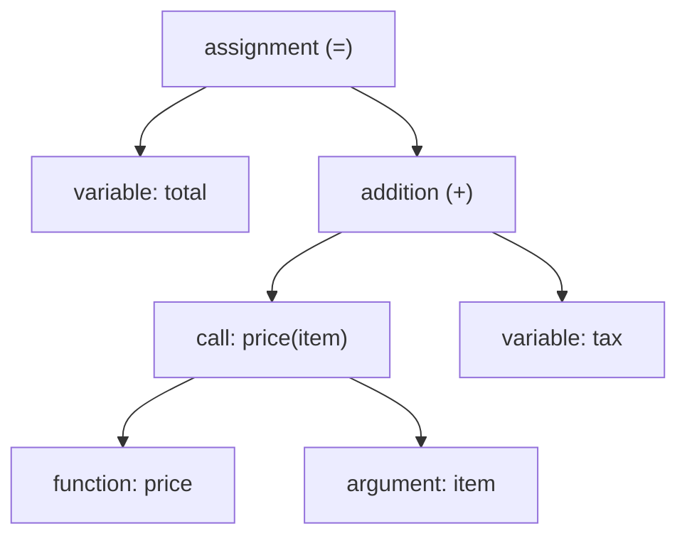
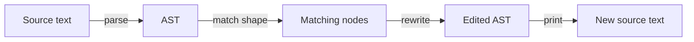

# Automated Large-Scale Refactoring — Junior Level

> **Category:** [Anti-Patterns at Scale](../README.md) → **Automated Large-Scale Refactoring** — *apply the same fix to hundreds of sites mechanically, safely, and reviewably — codemods, not find-and-replace.*
> **Covers (collectively):** Codemods & AST transforms · Type-aware rewrites · Pattern tools (Comby, Semgrep, gofmt -r) · Idempotency & verification · Landing huge mechanical diffs

---

## Table of Contents

1. [Introduction](#introduction)
2. [Prerequisites](#prerequisites)
3. [Glossary](#glossary)
4. [The Core Idea: Code Is a Tree, Not a String](#the-core-idea-code-is-a-tree-not-a-string)
5. [Why `sed` and Regex Break on Code](#why-sed-and-regex-break-on-code)
6. [What a Codemod Actually Is](#what-a-codemod-actually-is)
7. [Your First Safe Transform: `gofmt -r`](#your-first-safe-transform-gofmt--r)
8. [A Tiny Structural Pattern with Comby](#a-tiny-structural-pattern-with-comby)
9. [The One Rule: Verify, Don't Trust](#the-one-rule-verify-dont-trust)
10. [Common Mistakes](#common-mistakes)
11. [Test Yourself](#test-yourself)
12. [Cheat Sheet](#cheat-sheet)
13. [Summary](#summary)
14. [Further Reading](#further-reading)
15. [Related Topics](#related-topics)

---

## Introduction

> Focus: **Why `sed`/regex breaks on code, and what a codemod is.**

You renamed a function. Now 240 files call it by the old name. The obvious move is a giant find-and-replace — `sed -i 's/oldName/newName/g'` across the repo, or your editor's "Replace in All Files" button. It feels fast. It is also how juniors corrupt a codebase in one commit.

The problem is that **text replacement doesn't know what code *means*.** It can't tell the difference between a function call named `oldName`, a comment that mentions `oldName`, a string literal `"oldName"` printed to a user, and a *different* function called `processOldName`. To `sed`, those are all just characters. It will happily change all of them — and some of those changes are bugs.

This file teaches the one mental shift that fixes this: **code is a tree, not a string.** A tool that edits the tree (a *codemod*) understands structure — it can change *the call* without touching the comment or the string. At the junior level your goal is to:

- understand *why* regex on code is dangerous,
- know what a codemod is and how it differs,
- run your first safe, structure-aware transform, and
- internalize the one rule that makes any of this survivable: **verify the result, never trust the tool blindly.**

> **The mindset shift:** when you have to make the same change in many places, the question is not "what string do I search for?" It's "what *shape* in the code do I want to rewrite, and into what shape?" That question has a real answer; the string question only has a lucky guess.

---

## Prerequisites

- **Required:** You can write and call functions in at least one language (examples use Go, JavaScript, and Python).
- **Required:** Comfortable on the command line — running a tool, passing it a flag, reading its output.
- **Required:** Basic `git` — you can make a commit and run `git diff` to see what changed.
- **Helpful:** You've used find-and-replace before and, ideally, been burned by it once. That memory is what this file explains.
- **Helpful:** A rough idea of what a syntax tree is — a function contains statements, a statement contains expressions. We'll build the rest.

---

## Glossary

| Term | Definition |
|------|-----------|
| **AST** | *Abstract Syntax Tree* — the tree-shaped representation of source code that a compiler builds after parsing. The "real" structure underneath the text. |
| **Parse** | Turn source text into an AST. A parser knows the language's grammar, so it can tell a call from a comment from a string. |
| **Codemod** | A program that rewrites source code by editing its parse tree (or structure), not its raw text. Coined at Facebook for large-scale automated refactors. |
| **Transform** | The specific rule a codemod applies: "find this shape, replace with that shape." |
| **Node** | One element of the AST — a function, a call, a literal, an `if`. The thing a transform matches and edits. |
| **Idempotent** | Running it twice produces the same result as running it once. A safe transform is idempotent. |
| **Find-and-replace** | Text-level substitution (`sed`, editor replace). Has no idea what the text means. |
| **Structural search** | Searching for a *pattern of code shape* (e.g., "any call to `foo` with two arguments"), not a literal string. |

---

## The Core Idea: Code Is a Tree, Not a String

When you look at `total = price(item) + tax`, you see a line of text. The compiler does not. It parses that text into a tree:



Every meaningful thing — *this is a call*, *this is the function name*, *this is an argument*, *this is a variable* — is a labeled node in the tree. The whitespace, the comments, the exact spelling are surface details layered on top.

This matters because a refactor is almost always a statement about the *tree*: "rename the function `price`" means "change the `function` node named `price`," not "change every occurrence of the letters `p-r-i-c-e`." Text tools only see the letters. Tree tools see the node. That difference is the whole topic.

---

## Why `sed` and Regex Break on Code

Here is a concrete, common disaster. You want to rename the function `total` to `subtotal`. You run:

```bash
sed -i 's/total/subtotal/g' *.py
```

Watch what it does to this perfectly normal file:

```python
# BEFORE — you want to rename only the function `total`
def total(items):                 # ← the function (should change)
    return sum(i.price for i in items)

grand_total = total(cart)         # ← a different variable named grand_total
print("Your total is:", total(cart))   # ← a user-facing string
# total() returns the cart total   # ← a comment
```

```python
# AFTER sed — four changes, three of them wrong
def subtotal(items):                          # ✓ correct
    return sum(i.price for i in items)

grand_subtotal = subtotal(cart)               # ✗ broke an unrelated variable name
print("Your subtotal is:", subtotal(cart))    # ✗ changed text shown to the user
# subtotal() returns the cart subtotal        # ✗ rewrote a comment
```

`sed` matched the *letters* `total` everywhere: inside `grand_total`, inside the string `"Your total is:"`, and inside the comment. It cannot tell that only one of those four is the function you meant. The compiler still runs (the variable rename is internally consistent), so you might not even notice — until a user sees the wrong word, or until `grand_total` collides with something.

The three places regex reliably gets you:

1. **Inside strings** — `"total"`, `'total'`, log messages, SQL, HTML. These are data, not code, and must not change.
2. **Inside comments** — documentation that mentions the name, or commented-out code.
3. **Substrings of other identifiers** — `total` inside `grand_total`, `subtotal`, `total_count`. A word-boundary regex (`\btotal\b`) helps with #3 but does *nothing* for #1 and #2, because strings and comments contain whole words too.

> **The trap:** regex feels precise because you can add `\b` and lookaheads until your test cases pass. But code has effectively infinite cases — a string somewhere contains your token, a macro builds the name from pieces, a comment quotes it. You cannot regex your way to understanding syntax. The parser already understands it; use the parser.

---

## What a Codemod Actually Is

A **codemod** flips the process around. Instead of matching text, it:

1. **Parses** each file into an AST (using the language's real grammar).
2. **Walks** the tree looking for nodes that match a *structural* pattern — e.g., "a function-call node whose callee is named `total`."
3. **Rewrites** only those nodes.
4. **Prints** the tree back to source, preserving everything it didn't touch.



Because step 2 works on *node kinds*, a codemod can target "calls to `total`" while ignoring the string `"Your total is:"` and the comment — those are different node kinds (a *string literal* and a *comment*), so they never match. That's the entire reason codemods are safe where `sed` is not.

The famous tools, by ecosystem (you'll go deep on these in later levels):

| Tool | Language(s) | What it edits |
|------|------------|---------------|
| **jscodeshift** | JS / TS | the JavaScript AST (built on `recast`) |
| **ts-morph** | TypeScript | the TS AST, with type information |
| **OpenRewrite** | Java, others | a *type-aware* tree (LST) — knows real types |
| **Comby** | many languages | structural patterns (lighter than full AST) |
| **Semgrep** | many languages | structural patterns + autofix, security-focused |
| **`gofmt -r`** | Go | the Go AST, via a built-in rewrite rule |

You don't need all of these now. You need to run *one* and feel the difference.

---

## Your First Safe Transform: `gofmt -r`

Go ships a codemod in the standard toolchain. `gofmt -r` takes a rewrite rule of the form `pattern -> replacement`, where single lowercase letters are *wildcards* that match any expression. It operates on the AST, so it's structural by construction.

Take the cleanest real example — collapsing a redundant boolean comparison. Suppose the codebase is full of `enabled == true` and you want plain `enabled`:

```bash
# Rewrite rule: the pattern on the left, the replacement on the right.
# `a` is a wildcard matching any expression.
gofmt -r 'a == true -> a' -w ./...
```

```go
// BEFORE
if enabled == true {           // verbose
    run()
}
s := "enabled == true"         // a STRING that happens to contain the pattern

// AFTER gofmt -r
if enabled {                   // ✓ rewritten — it was real code
    run()
}
s := "enabled == true"         // ✓ untouched — it's a string literal, a different node
```

Notice the payoff: the string `"enabled == true"` is **not** changed, even though its text matches the pattern exactly. `gofmt` parsed the file, saw that those characters live inside a *string literal node* rather than a *comparison node*, and left them alone. `sed 's/== true//'` would have mangled the string. This is the safety a codemod buys you, in one command.

The flags to know:

- no `-w`: print the result to stdout so you can **preview** it (always do this first).
- `-w`: write changes back to the files (do this only after the preview looks right).
- `./...` is just the files; you can point it at one file while learning.

> **Try it now.** Take any Go file, run `gofmt -r 'a == true -> a' yourfile.go` (no `-w`), and read the diff in the terminal. Add a string literal containing `== true` and confirm it survives. That single experiment teaches more than this whole section.

---

## A Tiny Structural Pattern with Comby

Not every language ships a built-in like `gofmt -r`. [Comby](https://comby.dev) fills that gap: it matches *structural* patterns across many languages using `:[holes]` as wildcards, and it understands strings and comments enough not to match inside them by default.

Say a JavaScript codebase logs with `console.log(...)` and you want to route everything through `logger.info(...)`:

```bash
# :[args] is a hole that captures whatever is inside the parentheses, balanced.
comby 'console.log(:[args])' 'logger.info(:[args])' .js
```

```javascript
// BEFORE
console.log("user signed in", userId);
const help = "call console.log() to debug";   // a STRING mentioning the pattern

// AFTER comby
logger.info("user signed in", userId);          // ✓ the real call, rewritten
const help = "call console.log() to debug";      // ✓ string left alone
```

The hole `:[args]` matched `"user signed in", userId` — *balanced* parentheses and all — and Comby reassembled it on the right-hand side. The string `"call console.log() to debug"` was not touched, because Comby knows it's a string. A naive regex `console\.log\((.*)\)` would have stumbled on nested parentheses *and* matched inside the string.

Run it without writing first by leaving off `-i`; add `-i` (in-place) only after you've inspected the diff Comby prints.

> Comby and `gofmt -r` sit at the *pattern* end of the spectrum — quick, readable, great for shape-to-shape rewrites. Full AST tools (jscodeshift, ts-morph, OpenRewrite) sit at the *precise* end — more code to write, but able to reason about scope, types, and imports. Junior you starts with patterns; later levels graduate to AST tools when patterns aren't precise enough.

---

## The One Rule: Verify, Don't Trust

A codemod is safer than `sed`, but it is **not** magically correct. It does exactly what you told it across hundreds of files — including your mistakes, hundreds of times. The discipline that keeps you safe is the same every single run:

```bash
# 1. PREVIEW — never write blind. See the diff first.
gofmt -r 'a == true -> a' yourfile.go        # no -w: prints, doesn't write

# 2. APPLY on a clean branch, so the diff is the ONLY change.
git switch -c codemod/simplify-bool
gofmt -r 'a == true -> a' -w ./...

# 3. READ THE DIFF — skim every changed hunk, or at least a big sample.
git diff

# 4. PROVE IT STILL WORKS — compile and run the tests.
go build ./... && go test ./...
```

If the build breaks or a test fails, the transform was wrong — `git restore .` and fix the pattern. Because you ran it on a clean branch with nothing else in the diff, undoing is one command. This loop — **preview → apply on a clean branch → read the diff → build + test** — is non-negotiable, and you'll see it sharpened, not replaced, at every higher level.

> **Why "twice == once" matters (idempotency).** A good transform run a second time should change *nothing* — it already fixed everything that matched. If running it twice keeps changing files, your pattern matches its own output, which is a sign it's wrong or unstable. You'll write transforms with this property deliberately in [`middle.md`](middle.md). For now: after applying, run it once more and confirm the second run produces an empty diff.

---

## Common Mistakes

1. **Reaching for `sed`/editor replace on code.** It matches letters, not meaning — it will hit strings, comments, and substrings of other names. Use a structural tool.
2. **Trusting the codemod without reading the diff.** Safer than regex is not the same as correct. Always preview, then read the changed hunks.
3. **Running the transform on a dirty branch.** If you have other uncommitted changes, you can't tell the mechanical edit from your own work, and you can't cleanly undo. Start from a clean branch.
4. **Skipping the build and tests.** A change that compiles can still be wrong, and one that doesn't compile is obvious only if you actually try. `build && test` after every codemod.
5. **Assuming word boundaries make regex safe.** `\btotal\b` still matches the whole word `total` *inside a string or comment*. Boundaries fix substring hits, not the string/comment problem.
6. **Confusing "it ran" with "it's done."** A transform that silently matched *zero* files ran successfully and changed nothing. Check that the number of edited files is what you expected.

---

## Test Yourself

1. Why does `sed -i 's/total/subtotal/g' *.py` risk corrupting a file even when you only meant to rename one function? Name the three places it goes wrong.
2. In one sentence, what is the difference between a codemod and a find-and-replace?
3. You run `gofmt -r 'a == true -> a'` on a file containing the line `msg := "ready == true"`. Does the string change? Why or why not?
4. What does it mean for a transform to be *idempotent*, and how would you check it from the command line?
5. Put these four steps in the correct order: read the diff, preview without writing, run build + tests, apply on a clean branch.
6. A teammate says "the codemod ran with no errors, so we're done." What's missing from that claim?

<details>
<summary>Answers</summary>

1. `sed` matches the **letters** `total`, not the function. It goes wrong (a) **inside strings** like `"Your total is:"`, (b) **inside comments**, and (c) **inside other identifiers** like `grand_total`. Only one of the four matches is the function you meant; the parser knows which, `sed` doesn't.
2. A codemod rewrites code by editing its parse tree (so it knows a call from a string from a comment); find-and-replace substitutes raw text with no idea what it means.
3. **No, the string does not change.** `gofmt` parsed the file and saw those characters live inside a *string literal node*, not a *comparison node*, so the rule `a == true -> a` doesn't match there. Only real `== true` comparisons in code are rewritten.
4. Idempotent means running it twice gives the same result as running it once — the second run changes nothing because everything matching is already fixed. Check it: apply the transform, commit, run it again, and confirm `git diff` is empty.
5. (1) Preview without writing, (2) apply on a clean branch, (3) read the diff, (4) run build + tests. (Preview first, then make the clean-branch change the only change, inspect it, prove it.)
6. "No errors" only means the tool didn't crash. Missing: did it change the files you expected (not zero, not too many)? Does the diff look right when you read it? Does the code still **build and pass tests**? "Ran" ≠ "correct."

</details>

---

## Cheat Sheet

| Situation | Don't | Do |
|---|---|---|
| Rename a function across many files | `sed -i 's/old/new/g'` | A codemod that matches the *call/declaration node* |
| Simplify `x == true` in Go | regex | `gofmt -r 'a == true -> a' -w` |
| Swap `console.log` for `logger.info` (JS) | regex with balanced-paren pain | `comby 'console.log(:[a])' 'logger.info(:[a])' .js` |
| Verify the result | trust the tool | preview → clean branch → read diff → `build && test` |
| Check the transform is stable | hope | run it twice; the second run must be a no-op (idempotent) |

> **One rule to remember:** *Code is a tree, not a string. Match the shape, rewrite the node, then verify — never `sed` your way through syntax.*

---

## Summary

- **Find-and-replace doesn't understand code.** `sed`/regex match letters, so they corrupt strings, comments, and substrings of unrelated names. The compiler may still run, hiding the damage.
- **A codemod edits the tree, not the text.** It parses code into an AST, matches *node shapes* ("calls to `total`"), rewrites only those, and prints the rest untouched — which is exactly why it skips strings and comments.
- **You already have safe tools.** `gofmt -r 'pattern -> replacement'` ships with Go; Comby and Semgrep give structural patterns across many languages. Start with one and watch a matching string literal survive a rewrite that `sed` would have mangled.
- **The one rule is verification.** Preview → apply on a clean branch → read the diff → `build && test`. And a good transform is *idempotent*: run it twice, the second run changes nothing.
- Next: [`middle.md`](middle.md) — *writing and testing your own codemod end-to-end: a real jscodeshift/ts-morph/Comby transform, before/after fixtures, idempotency, and running it over a whole directory.*

---

## Further Reading

- **Comby documentation** — [comby.dev](https://comby.dev) — structural search-and-replace, holes, the gentlest on-ramp to codemods.
- **`gofmt` and the `-r` flag** — the Go command docs and `go doc cmd/gofmt` — a codemod in the standard toolchain.
- **"Codemod" origins** — Facebook Engineering's posts on jscodeshift and `codemod` — why text replacement didn't scale and what replaced it.
- **Refactoring** — Martin Fowler (2nd ed., 2018) — Rename Method/Variable and why mechanical, behavior-preserving change is its own discipline.

---

## Related Topics

- [Refactoring → Refactoring Techniques](../../../refactoring/02-refactoring-techniques/README.md) — the by-hand catalog of the changes a codemod automates.
- [Hotspot Analysis](../03-hotspot-analysis/senior.md) — how to choose *where* to point a large-scale refactor first.
- [Architecture Fitness Functions](../01-architecture-fitness-functions/senior.md) — automated guardrails that keep a fixed pattern from coming back.
- [Bad Structure → Senior](../../01-development/01-bad-structure/senior.md) — the structural problems large-scale refactors set out to undo.
- [Bad Shortcuts → Senior](../../01-development/02-bad-shortcuts/senior.md) — why find-and-replace is the convenient shortcut that compounds into damage.
