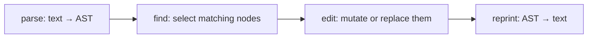

# Automated Large-Scale Refactoring — Middle Level

> **Category:** [Anti-Patterns at Scale](../README.md) → **Automated Large-Scale Refactoring** — *apply the same fix to hundreds of sites mechanically, safely, and reviewably — codemods, not find-and-replace.*
> **Covers (collectively):** Codemods & AST transforms · Type-aware rewrites · Pattern tools (Comby, Semgrep, gofmt -r) · Idempotency & verification · Landing huge mechanical diffs

---

## Table of Contents

1. [Introduction](#introduction)
2. [Prerequisites](#prerequisites)
3. [The Anatomy of a Codemod](#the-anatomy-of-a-codemod)
4. [A Complete jscodeshift Transform](#a-complete-jscodeshift-transform)
5. [The Same Idea in ts-morph](#the-same-idea-in-ts-morph)
6. [The Pattern-Tool Alternative: Comby](#the-pattern-tool-alternative-comby)
7. [Idempotency: Twice Must Equal Once](#idempotency-twice-must-equal-once)
8. [Testing a Codemod with Fixtures](#testing-a-codemod-with-fixtures)
9. [Running It Over a Directory](#running-it-over-a-directory)
10. [Common Mistakes](#common-mistakes)
11. [Test Yourself](#test-yourself)
12. [Cheat Sheet](#cheat-sheet)
13. [Summary](#summary)
14. [Further Reading](#further-reading)
15. [Related Topics](#related-topics)

---

## Introduction

> Focus: **Writing and testing a codemod.**

[`junior.md`](junior.md) made the case that code is a tree and gave you ready-made transforms (`gofmt -r`, a one-line Comby). That's enough to simplify booleans. It is not enough for the real job: *"every call site of `fetch(url, opts)` must become `httpClient.get(url, opts)`, and the import has to change too."* No built-in rule covers that. You have to **write the transform yourself.**

This level is about authoring a codemod end-to-end and earning the right to run it on a real codebase. A codemod you wrote is just a program, and like any program it can be wrong — so it gets the same treatment as any program: small, focused, and **tested with before/after fixtures** before it touches a single real file.

Three disciplines define the middle level:

1. **Write the transform as match → edit → reprint.** Find the node shape, change it, let the tool reprint the file with everything else intact.
2. **Make it idempotent.** Running it twice must equal running it once. A transform that isn't idempotent is one you can't safely re-run, can't safely apply in batches, and probably matches its own output — a latent bug.
3. **Test it like code.** A fixture is a `before` file and the exact `after` you expect. The test runs your transform on `before` and asserts the output equals `after`. No fixture, no trust.

> **The mental model:** a codemod is not a script you run once and eyeball. It's a small, tested *program* whose input is source code and whose output is source code. Treat its output the way you'd treat any function's output — pin it with tests, then run it at scale.

---

## Prerequisites

- **Required:** Comfortable with [`junior.md`](junior.md) — you know why regex on code is unsafe and you've run `gofmt -r` or a one-line Comby.
- **Required:** You can read and write JavaScript/TypeScript well enough to follow a transform (the AST tools with the best teaching APIs are JS/TS). The *concepts* transfer to any language.
- **Required:** You can run a Node tool from the command line (`npx`) and write a basic unit test.
- **Helpful:** You've used [AST Explorer](https://astexplorer.net) or want to — paste code, see its tree, and learn the node names for your parser.
- **Helpful:** unit-testing-patterns and refactoring-techniques for the testing vocabulary and the by-hand version of the change you're automating.

---

## The Anatomy of a Codemod

Every AST codemod, in every tool, has the same four phases. Internalize them once and the specific API stops mattering:



1. **Parse** — the tool turns the file into an AST. You don't write this; you receive a tree.
2. **Find** — you query the tree for the nodes you care about, by *kind* and by *details*: "CallExpression whose callee is the identifier `fetch`."
3. **Edit** — you change those nodes: rename, replace, wrap, add an argument, remove one.
4. **Reprint** — the tool serializes the tree back to source. Good tools (jscodeshift via `recast`, ts-morph) preserve untouched formatting so the diff shows *only* your change.

The hard, valuable thinking is all in **Find**. Get the query too broad and you rewrite things you didn't mean to; too narrow and you miss real call sites. The rest of this file is mostly examples of writing a precise Find.

> **Use AST Explorer to find node names.** Paste `fetch(url, opts)` into astexplorer.net (pick the right parser), click the `fetch` token, and the tree shows you it's a `CallExpression` → `callee` → `Identifier` with `name: "fetch"`. Those are the exact field names your query will use. Guessing them from memory is slow; reading them off the tree is instant.

---

## A Complete jscodeshift Transform

The goal: rewrite every `fetch(url, opts)` call into `httpClient.get(url, opts)`. A codemod, not a regex, because `fetch` appears in strings (`"use fetch()"`), in comments, and possibly as a property (`obj.fetch()`) we must *not* touch.

[jscodeshift](https://github.com/facebook/jscodeshift) is Facebook's codemod runner. A transform is a function exporting `(fileInfo, api) => string`:

```javascript
// transform.js — rewrite top-level fetch(...) calls to httpClient.get(...)
module.exports = function (fileInfo, api) {
  const j = api.jscodeshift;            // the AST toolkit, "j" by convention
  const root = j(fileInfo.source);      // 1. PARSE: source → queryable tree

  root
    // 2. FIND: every call expression whose callee is the bare identifier `fetch`.
    //    `callee: { type: 'Identifier', name: 'fetch' }` excludes obj.fetch()
    //    (that callee is a MemberExpression) and excludes the string "fetch".
    .find(j.CallExpression, {
      callee: { type: 'Identifier', name: 'fetch' },
    })
    // 3. EDIT: replace the callee `fetch` with the member expression `httpClient.get`,
    //    keeping the original arguments untouched.
    .forEach((path) => {
      path.node.callee = j.memberExpression(
        j.identifier('httpClient'),
        j.identifier('get'),
      );
      // arguments stay as-is: (url, opts) carries over for free
    });

  // 4. REPRINT: tree → source, preserving formatting of everything we didn't touch.
  return root.toSource();
};
```

What this gets right that a regex cannot:

```javascript
// BEFORE
const res = await fetch(url, opts);     // ← bare call → rewrite
const doc = "remember to fetch(it)";    // ← string → leave alone
api.fetch(url);                          // ← obj.fetch → leave alone (MemberExpression callee)
// fetch the data here                   // ← comment → leave alone
```

```javascript
// AFTER
const res = await httpClient.get(url, opts);   // ✓ only the real bare call changed
const doc = "remember to fetch(it)";           // ✓ string survives
api.fetch(url);                                 // ✓ method call survives
// fetch the data here                          // ✓ comment survives
```

The query `callee: { type: 'Identifier', name: 'fetch' }` is doing the precision work: `api.fetch(...)` has a `MemberExpression` callee, not an `Identifier`, so it never matches. That single line is the difference between a correct refactor and a corruption.

> A complete real codemod would also add `import { httpClient } from './http'` to files that now use it, and skip files that already import it. That import-management step is where transforms get genuinely tricky; it's a natural lead into [`senior.md`](senior.md) and [`professional.md`](professional.md). For now, keep the transform small and obviously correct.

---

## The Same Idea in ts-morph

[ts-morph](https://ts-morph.com) wraps the real TypeScript compiler, so it sees **types**, not just syntax — which matters when "the same name" means different things in different files. The four phases are identical; the API is higher-level:

```typescript
// rename-method.ts — rename method `save()` to `persist()` on class Repository
import { Project, SyntaxKind } from "ts-morph";

const project = new Project({ tsConfigFilePath: "tsconfig.json" }); // 1. PARSE (whole project, with types)

for (const sourceFile of project.getSourceFiles()) {
  sourceFile
    .getDescendantsOfKind(SyntaxKind.CallExpression)               // 2. FIND: every call expression
    .forEach((call) => {
      const expr = call.getExpression();
      if (expr.getKind() !== SyntaxKind.PropertyAccessExpression) return;
      const prop = expr.asKindOrThrow(SyntaxKind.PropertyAccessExpression);
      if (prop.getName() !== "save") return;

      // Type-aware guard: only rewrite .save() when the receiver is a Repository.
      // This is what syntax-only tools (Comby, jscodeshift) cannot do — they'd
      // rewrite EVERY .save() including unrelated classes that also have one.
      const receiverType = prop.getExpression().getType().getText();
      if (!receiverType.includes("Repository")) return;

      prop.getNameNode().replaceWithText("persist");                // 3. EDIT
    });
}

project.saveSync();                                                 // 4. REPRINT all changed files
```

The type guard `receiverType.includes("Repository")` is the headline. A purely syntactic tool sees `x.save()` and `y.save()` as the same shape; it cannot know `x` is a `Repository` and `y` is a `Map`. ts-morph asks the type checker, so it renames `Repository.save` while leaving `Map.save` alone. You'll see in [`professional.md`](professional.md) why this type-awareness is the dividing line for correctness at scale — and why Java's OpenRewrite is built entirely around it.

---

## The Pattern-Tool Alternative: Comby

When you don't need type information — a pure shape-to-shape rewrite — a full AST transform is overkill. [Comby](https://comby.dev) expresses the same change as two patterns, no program to write:

```bash
# Rewrite fetch(...) → httpClient.get(...), capturing the args in the hole :[args].
# -i applies in place; omit it to preview the diff Comby prints.
comby 'fetch(:[args])' 'httpClient.get(:[args])' .js .ts
```

`:[args]` is a hole: it matches the *balanced* contents of the parentheses (so nested calls and commas are handled) and Comby drops it back into the replacement. Comby also won't match inside strings or comments by default, so the `"remember to fetch(it)"` case is safe for free.

The trade-off, made concrete:

| | Comby / `gofmt -r` (pattern) | jscodeshift / ts-morph (AST) |
|---|---|---|
| **Effort** | a one-line command | a small program to write and test |
| **Precision** | shape only — can't tell `obj.fetch()` from `fetch()` without care | full node kinds; ts-morph adds *types* |
| **Best for** | uniform, syntactic, local rewrites | rewrites needing scope, types, or import edits |
| **Idempotency** | check it yourself | check it yourself |

A useful rule: **reach for the pattern tool first; escalate to an AST transform only when the pattern can't be made precise enough.** Here, Comby's `fetch(:[args])` *would* also match a property access like `api.fetch(x)` in some configurations, so if that distinction matters, escalate to the jscodeshift version with its `Identifier`-callee guard. Pick the weakest tool that's still correct.

---

## Idempotency: Twice Must Equal Once

A transform is **idempotent** if running it a second time changes nothing. Formally, `transform(transform(x)) == transform(x)`. This is not a nicety — it's a correctness property you depend on constantly:

- You'll **re-run** the codemod after rebasing onto new code that added more call sites.
- You'll **apply it in batches** (per directory, per team) and the batches overlap.
- A CI check might run it and fail if it produces a diff — only meaningful if a clean tree stays clean.

The classic non-idempotent bug is a transform whose output *also matches its input pattern*:

```javascript
// NON-IDEMPOTENT: wraps every console.log(x) in a guard...
// but the guarded call STILL contains console.log(x), so a second run wraps it AGAIN.
root.find(j.CallExpression, { callee: { object: { name: 'console' }, property: { name: 'log' } } })
  .forEach((path) => {
    // replaces console.log(x) with  if (DEBUG) console.log(x)
    // run #2 sees console.log(x) inside the new if and wraps it once more → nesting grows
  });
```

```javascript
// Run 1:  console.log(x)                  → if (DEBUG) console.log(x)
// Run 2:  if (DEBUG) console.log(x)        → if (DEBUG) if (DEBUG) console.log(x)   ✗ grows forever
```

The fix is to make the transform **recognize already-transformed code and skip it** — match only what still needs changing:

```javascript
.find(j.CallExpression, { callee: { object: { name: 'console' }, property: { name: 'log' } } })
  .filter((path) => {
    // Skip calls already wrapped in `if (DEBUG)` — check the ancestor.
    const stmt = path.parent; // ExpressionStatement
    return !isInsideDebugGuard(stmt);   // idempotency guard
  })
  .forEach((path) => { /* wrap it */ });
```

> **How to test idempotency in one line:** run the transform, then run it again, and assert the second run produces no change. With jscodeshift, `transform(transform(src)) === transform(src)` is a unit test you should literally write. At the command line: apply, `git commit`, apply again, `git diff --exit-code` must be empty.

---

## Testing a Codemod with Fixtures

A **fixture** is a pair: an input file and the exact expected output. The test runs your transform on the input and asserts byte-equality with the expected output. jscodeshift ships a helper for exactly this:

```
__testfixtures__/
  fetch-to-client.input.js      ← the "before" (handwritten, covers the tricky cases)
  fetch-to-client.output.js     ← the "after" (the exact result you want)
__tests__/
  fetch-to-client.test.js       ← runs the transform on input, asserts == output
```

```javascript
// __testfixtures__/fetch-to-client.input.js — pack the EDGE CASES in here on purpose
const a = await fetch(url, opts);     // the real call
const b = "fetch(x) in a string";     // must NOT change
api.fetch(url);                        // member call, must NOT change
// fetch in a comment                  // must NOT change
const c = await fetch(`/u/${id}`);     // template-literal arg, must carry over
```

```javascript
// __testfixtures__/fetch-to-client.output.js — the EXACT expected result
const a = await httpClient.get(url, opts);
const b = "fetch(x) in a string";
api.fetch(url);
// fetch in a comment
const c = await httpClient.get(`/u/${id}`);
```

```javascript
// __tests__/fetch-to-client.test.js
const { defineTest } = require('jscodeshift/dist/testUtils');
defineTest(__dirname, 'transform', null, 'fetch-to-client'); // input → transform → assert == output
```

The discipline is to **put your hard cases in the `input` fixture first** — the string, the comment, the member call, the template literal — and only then write the transform until the test passes. This is test-driven development applied to refactoring: the fixture *specifies* what "correct" means, and the moment the transform passes it, you have a regression-proof spec of the change. ts-morph and Comby don't ship `defineTest`, but the pattern is identical: a `before` file, a `golden` after file, and an assertion that your run reproduces the golden output.

> **Always include negative cases.** The most important lines in `input.js` are the ones that must *not* change. A transform that rewrites the real call is easy; a transform that leaves the string, comment, and member call alone is the one worth trusting. Without negative fixtures you're only testing the easy half.

---

## Running It Over a Directory

Once the fixtures pass, run it for real — on a clean branch, with preview and verification, exactly the loop from [`junior.md`](junior.md) but now over many files:

```bash
git switch -c codemod/fetch-to-client      # clean branch: the diff is ONLY the codemod

# DRY RUN first: -d prints what would change without writing; -p shows the output.
npx jscodeshift -t transform.js --dry --print src/

# Apply for real, across the whole tree, in parallel (jscodeshift forks workers).
npx jscodeshift -t transform.js src/

# VERIFY the result.
git diff --stat                            # how many files changed — is it what you expected?
npm run build && npm test                  # does it still compile and pass?

# Idempotency check: a second run must do nothing.
npx jscodeshift -t transform.js src/ && git diff --exit-code   # exits non-zero if anything changed
```

Read the `--dry --print` output before you ever write files. Then check `git diff --stat`: if you expected ~30 changed files and see 300, your Find is too broad — stop and tighten it. If you see 0, it's too narrow (or matched nothing) — also stop. The file count is the cheapest sanity check you have.

> **Comby and `gofmt -r` follow the same loop:** preview without `-i`/`-w`, switch to a clean branch, apply, `git diff` + build + test, then re-run to confirm idempotency. The tool changes; the safety discipline does not.

---

## Common Mistakes

1. **Writing the transform before the fixtures.** Without an `input`/`output` pair you have no definition of "correct" and no regression test. Write the fixture — including the must-not-change cases — first.
2. **A Find that's too broad.** Matching `CallExpression` with callee name `fetch` but forgetting to require an `Identifier` callee will also rewrite `obj.fetch()`. Always pin the node *kind*, not just the name.
3. **Shipping a non-idempotent transform.** If a second run keeps changing files, your output matches your input pattern. Add a guard that skips already-transformed code, and test `transform(transform(x)) == transform(x)`.
4. **Forgetting negative test cases.** Testing only that the real call is rewritten misses the whole point — the value is leaving strings, comments, and unrelated calls alone. Put those in the fixture.
5. **Using an AST tool where a pattern tool suffices (or vice-versa).** Don't write 60 lines of jscodeshift for a rewrite Comby does in one line; don't reach for Comby when you genuinely need type information (use ts-morph/OpenRewrite). Pick the weakest tool that's still correct.
6. **Skipping the file-count sanity check.** "It ran" tells you nothing. If `git diff --stat` shows wildly more or fewer files than you expected, the query is wrong — investigate before committing.
7. **Not managing imports.** Rewriting `fetch(...)` to `httpClient.get(...)` without adding the `httpClient` import produces code that doesn't compile. A complete transform fixes the imports too (or you do it as a follow-up pass).

---

## Test Yourself

1. Name the four phases every AST codemod goes through, and say which one carries the precision risk.
2. In the jscodeshift transform, why does `callee: { type: 'Identifier', name: 'fetch' }` correctly skip `api.fetch(url)`?
3. What does ts-morph let you do in the `save → persist` rename that Comby and jscodeshift cannot, and why does that prevent a class of mistakes?
4. Give a concrete example of a non-idempotent transform and explain how a second run makes things worse. How do you fix it?
5. You're writing fixtures for "rename function `total` to `subtotal`." List three lines that must appear in your `input` fixture as *negative* cases.
6. After running a codemod on a clean branch, `git diff --stat` shows 612 files changed but you expected about 40. What do you do, and what likely went wrong?
7. Write the one-line command-level check that proves your transform is idempotent.

<details>
<summary>Answers</summary>

1. **Parse → Find → Edit → Reprint.** The precision risk is entirely in **Find**: too broad rewrites things you didn't mean; too narrow misses real sites. Parse, Edit, and Reprint are largely mechanical.
2. `api.fetch(url)` is a `CallExpression` whose **callee is a `MemberExpression`** (`api.fetch`), not an `Identifier`. The query requires the callee's `type` to be `Identifier`, so the member call never matches — only the bare `fetch(...)` does.
3. ts-morph sees **types**: it can require that the receiver of `.save()` is a `Repository` before renaming. Comby/jscodeshift only see syntax, so they'd rewrite *every* `.save()` — including `someMap.save()` on an unrelated class — corrupting code that merely shares the method name.
4. Wrapping `console.log(x)` in `if (DEBUG) console.log(x)`: the output still *contains* `console.log(x)`, so a second run wraps it again → `if (DEBUG) if (DEBUG) console.log(x)`, growing on every run. Fix: add a guard that detects already-wrapped calls and skips them, so only un-guarded calls match.
5. Any three of: `const s = "rename total here";` (string), `// total is the sum` (comment), `cart.total()` or `order.total` (a method/property named total on another object), `grand_total = ...` (substring of another identifier). They must stay unchanged.
6. Stop — don't commit. The **Find query is too broad** (e.g., matching a common name without pinning the node kind/scope, or matching inside member expressions you meant to skip). Inspect a few unexpected hunks in `git diff`, tighten the query, regenerate, and recheck the count before applying.
7. Apply, then: `npx jscodeshift -t transform.js src/ && git diff --exit-code` — the second application must produce no diff (non-zero exit means it changed something → not idempotent). Equivalently, as a unit test: `assert(transform(transform(src)) === transform(src))`.

</details>

---

## Cheat Sheet

| Need | Tool | Why |
|---|---|---|
| One-line syntactic rewrite, no types | **Comby** / `gofmt -r` | weakest sufficient tool; no program to write |
| Precise node-kind rewrite in JS/TS | **jscodeshift** | full AST; pin `type` + `name` in the query |
| Rewrite that depends on *types* | **ts-morph** (JS/TS), OpenRewrite (Java) | asks the type checker; distinguishes `Repository.save` from `Map.save` |
| Define "correct" | **fixtures** | `input` + exact `output`; include must-not-change cases |
| Run it | clean branch → `--dry --print` → apply → `build && test` → re-run | preview, verify, prove idempotent |
| Prove stable | `apply && git diff --exit-code` | second run must be a no-op |

**The transform-authoring loop:** *fixture first (with negative cases) → write the narrowest Find that passes → confirm idempotent → run on a clean branch with preview → build + test → re-run to verify no-op.*

---

## Summary

- **A codemod is a small, tested program**, not a one-off script. Every AST transform is the same four phases — **Parse → Find → Edit → Reprint** — and nearly all the risk lives in **Find**: too broad corrupts, too narrow misses.
- **jscodeshift** rewrites the JS/TS AST; pinning the node *kind* (`Identifier` callee, not just the name `fetch`) is what skips strings, comments, and `obj.fetch()`. **ts-morph** adds **type awareness**, letting you rename `Repository.save` without touching `Map.save` — the precision a syntactic tool can't reach.
- **Comby / `gofmt -r`** express many rewrites as a one-line pattern. Reach for the **weakest tool that's still correct**; escalate to an AST (and then a type-aware) tool only when the pattern can't be made precise.
- **Idempotency is a correctness property:** `transform(transform(x)) == transform(x)`. A transform whose output matches its own input pattern grows on every run — guard against already-transformed code and test the double-application.
- **Fixtures specify correctness:** a `before` file and the exact `after`, with the *must-not-change* cases (strings, comments, unrelated calls) front and center. Write them before the transform.
- **Run it like junior taught, at scale:** clean branch → dry-run preview → apply → check the file count → `build && test` → re-run to confirm a no-op.
- Next: [`senior.md`](senior.md) — *rolling one transform across a monorepo or many repos: splitting the giant diff into reviewable chunks, staged application, commit hygiene (mechanical vs semantic), CODEOWNERS, rollback, and tying the rollout to hotspots and fitness functions.*

---

## Further Reading

- **jscodeshift** — [github.com/facebook/jscodeshift](https://github.com/facebook/jscodeshift) — the runner, the `defineTest` fixture helper, and example transforms.
- **ts-morph** — [ts-morph.com](https://ts-morph.com) — navigating and editing the TypeScript AST *with type information*.
- **Comby** — [comby.dev](https://comby.dev) — structural patterns and holes across many languages; the low-effort default.
- **AST Explorer** — [astexplorer.net](https://astexplorer.net) — paste code, read the real node names your query needs.
- **Refactoring** — Martin Fowler (2nd ed., 2018) — the by-hand mechanics of the renames and replacements you're now automating and testing.

---

## Related Topics

- [Refactoring → Refactoring Techniques](../../../refactoring/02-refactoring-techniques/README.md) — Rename Method, Change Function Declaration: the manual moves a codemod mechanizes.
- [Hotspot Analysis](../03-hotspot-analysis/senior.md) — pick the files where a transform pays off most.
- [Architecture Fitness Functions](../01-architecture-fitness-functions/senior.md) — turn "don't reintroduce the old pattern" into an automated test.
- [Bad Structure → Senior](../../01-development/01-bad-structure/senior.md) — the structural debt these transforms repay.
- [Bad Shortcuts → Senior](../../01-development/02-bad-shortcuts/senior.md) — the find-and-replace shortcut a tested codemod replaces.
