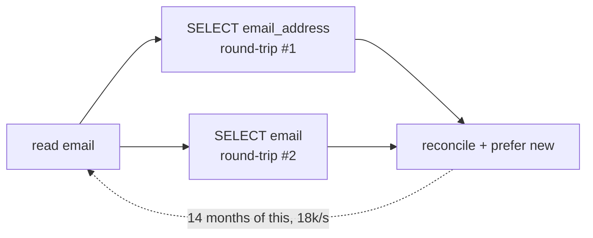

# Expand-Contract Refactors — Optimize This

> **Category:** [Anti-Patterns at Scale](../README.md) → **Expand-Contract Refactors**
> **Covers (collectively):** Parallel Change (expand-contract) · Backward & forward compatibility · Deprecation windows · Schema / API / event / DB evolution · Dual-write / dual-read & Tolerant Reader

---

Expand-contract has a temporary middle phase by design: dual-write, dual-read, a compatibility shim, a feature flag. The whole point is that this scaffolding is **scaffolding** — it comes down once migration completes. The anti-pattern this file attacks is the migration that **expanded and migrated but never contracted**: the dual-path is still on, months or years later, and now every request pays for it forever.

Two failure modes, both common:

1. **Never contracted** — the dual-write/dual-read is permanent. The cleanup ticket was never filed, or filed and dropped. The old column, the flag, and the compatibility branch are now load-bearing debt.
2. **Contracted in spirit but expensive in practice** — the reconciliation between old and new is done with **two synchronous round-trips on the hot path**, so the migration's correctness machinery doubles your latency and your blast radius on every single request.

> **How to use this file.** Each section has a *before* (the lingering/expensive version), the optimization, an *after*, and the correctness note the change introduces. The numbers are illustrative — measure your own. Refer to [`senior.md`](senior.md) for the migration lifecycle and [`interview.md` Q32](interview.md) for why teams fail to finish.

---

## Table of Contents

1. [The Problem: A Dual-Read Left On Forever](#the-problem-a-dual-read-left-on-forever)
2. [Optimization 1 — Finish the Contract (Delete the Old Path)](#optimization-1--finish-the-contract-delete-the-old-path)
3. [The Problem: Synchronous Dual-Write on the Hot Path](#the-problem-synchronous-dual-write-on-the-hot-path)
4. [Optimization 2 — Make Reconciliation Async & Cheap](#optimization-2--make-reconciliation-async--cheap)
5. [Optimization 3 — Sample the Comparison, Don't Run It Every Request](#optimization-3--sample-the-comparison-dont-run-it-every-request)
6. [Before / After Summary](#before--after-summary)
7. [Common Mistakes](#common-mistakes)
8. [Summary](#summary)
9. [Related Topics](#related-topics)

---

## The Problem: A Dual-Read Left On Forever

Here's a read path from a column-rename migration that was started 14 months ago. The migration "worked" — and then nobody filed the contract ticket.

```java
// readUserEmail — still dual-reading 14 months after the migration "finished".
public String readUserEmail(long userId) {
    String fromNew = repo.selectEmailAddress(userId);   // round-trip #1 to the new column
    String fromOld = repo.selectEmail(userId);          // round-trip #2 to the old column

    if (fromNew != null && fromOld != null && !fromNew.equals(fromOld)) {
        log.warn("email mismatch for {}: new={} old={}", userId, fromNew, fromOld);
        return fromOld;                                  // "trust the old one, just in case"
    }
    return fromNew != null ? fromNew : fromOld;          // prefer new, fall back to old
}
```

Every email read does **two database round-trips** and a reconciliation, *forever*, to defend against a divergence that the backfill resolved over a year ago. The cost:

```
reads/sec (peak):           18,000
DB round-trips per read:    2          ← should be 1
extra round-trips/sec:      18,000     ← pure waste, every second, every day
p99 latency contribution:   +9 ms      ← the second query, serialized
```

Worse than the latency: the old column is now **load-bearing**. Nobody can drop it, because `readUserEmail` still falls back to it. Every future schema change to `users` must keep `email` working. The temporary scaffold became permanent structure.



This is the dominant real-world expand-contract anti-pattern: not doing it *wrong*, but **not finishing it**.

---

## Optimization 1 — Finish the Contract (Delete the Old Path)

The fix is the contract step that was skipped. But you don't just delete — you **prove it's safe, then delete**, in the right order.

**Step 1 — Prove old and new agree.** Run a one-time reconciliation query (offline, on a replica) to confirm there's no real divergence left:

```sql
-- On a read replica: any row where the two columns disagree?
SELECT count(*)
FROM   users
WHERE  email IS DISTINCT FROM email_address;   -- expect 0 after a completed backfill
```

If that's 0 (and the dual-write has kept it 0), the fallback has been dead weight the entire time — the `log.warn` never fired in production. Confirm that from the logs/metric too.

**Step 2 — Contract the read.** Single column, single round-trip:

```java
// After — single read. The new column is the sole source of truth.
public String readUserEmail(long userId) {
    return repo.selectEmailAddress(userId);   // one round-trip; old column no longer touched
}
```

**Step 3 — Stop writing the old column, then drop it** (the rest of the contract sequence):

```sql
-- After confirming nothing reads OR writes `email`:
ALTER TABLE users DROP COLUMN email;
```

**Result:**

```
DB round-trips per read:    2  → 1     (−50%)
extra round-trips/sec:      18,000 → 0
p99 latency contribution:   +9 ms → 0
old column `email`:         load-bearing → dropped (schema freed)
```

**Correctness note.** The deletion is the one irreversible step, so gate it: the `IS DISTINCT FROM` count must be 0, the mismatch metric must be flat-zero over a full traffic cycle, and you must drop the *read* of `email` (Step 2) and the *write* of `email` before the `DROP COLUMN` (Step 3). Do them as separate deploys so that if something still reads `email`, you find out at "stopped reading" (recoverable) rather than at "dropped the column" (data loss). This is just the back half of the standard sequence in [`tasks.md` Exercise 3](tasks.md#exercise-3--zero-downtime-db-column-rename--full-sequence) — finally executed.

---

## The Problem: Synchronous Dual-Write on the Hot Path

Sometimes the dual-path *is* still legitimately needed (the migration is genuinely in flight), but it's implemented in the most expensive possible way: **two synchronous round-trips to two stores, inline on the request**, plus an inline comparison.

```python
# place_order — dual-writing to the legacy store and the new store, synchronously, inline.
def place_order(order):
    legacy_id = legacy_store.insert(order)          # round-trip #1 (sync, ~25 ms)
    new_id    = new_store.insert(order)             # round-trip #2 (sync, ~25 ms)

    # inline reconciliation on the hot path
    legacy_row = legacy_store.fetch(legacy_id)      # round-trip #3 (sync, ~25 ms)
    new_row    = new_store.fetch(new_id)            # round-trip #4 (sync, ~25 ms)
    if normalize(legacy_row) != normalize(new_row):
        raise InconsistencyError(order.id)          # fail the user's request on a mismatch!

    return new_id
```

Every order now pays **four serial round-trips** (~100 ms added) and — worse — a transient mismatch or a slow/unavailable *legacy* store **fails the user's order**. The migration's verification machinery has become a latency tax and a new failure mode on the critical path.

```
checkout p99 before migration:  40 ms
checkout p99 now:               40 + 100 = 140 ms     (3.5×)
new failure mode:               legacy store down  → user's order rejected
```

The migration coupled the *new* path's availability to the *old* path it was supposed to be replacing. That's backwards.

---

## Optimization 2 — Make Reconciliation Async & Cheap

The new store is the future source of truth, so the **user's request should depend only on the new store.** The legacy write and the consistency check move **off** the hot path.

```python
# After — the hot path commits to the new store and returns. Everything else is async.
def place_order(order):
    new_id = new_store.insert(order)                # the ONLY synchronous write (~25 ms)
    outbox.enqueue("order_mirror", {"order_id": new_id})  # cheap local enqueue, same tx
    return new_id                                    # user is done in ~25 ms

# Background worker — mirrors to legacy and reconciles, off the request path.
def mirror_worker(msg):
    order = new_store.fetch(msg["order_id"])
    legacy_store.upsert(order)                       # idempotent: safe to retry
    if normalize(order) != normalize(legacy_store.fetch(order.id)):
        metrics.increment("order_mirror_mismatch")   # alert, don't fail a user
```

**What changed:**
- The request makes **one** synchronous write (new store) and a **local** outbox enqueue in the same transaction — no second remote round-trip on the hot path.
- The legacy mirror and the comparison run in a **background worker**, which can **retry** without the user waiting and is **idempotent** (the `upsert` tolerates re-delivery).
- A mismatch increments a **metric and alerts** — it no longer rejects the customer's order. Consistency is monitored, not enforced synchronously.

```
checkout p99:           140 ms → 28 ms      (back near the pre-migration 40 ms)
sync round-trips:        4 → 1
legacy-store outage:     fails user's order → just delays the async mirror (retried)
consistency:             enforced inline → monitored async + reconciled
```

**Correctness note.** You've traded *synchronous* consistency for *eventual* consistency between the two stores — acceptable precisely because the new store is authoritative and the legacy store is a soon-to-be-deleted mirror. The outbox-in-the-same-transaction pattern guarantees the mirror message is never lost even if the worker is down. And this is **still a migration**, so the endgame remains: once you trust the new store, **contract** — delete the mirror worker, the legacy `upsert`, and eventually the legacy store. Async reconciliation is the *bridge*, not the destination.

---

## Optimization 3 — Sample the Comparison, Don't Run It Every Request

If you want live confidence that old and new agree *during* migration but don't want to pay for a full comparison on every request, **sample**. A 1% comparison catches systematic divergence within seconds at 1% of the cost.

```python
# Compare a sampled fraction of reads; serve from the new path always.
def read_balance(account_id):
    new_val = new_store.balance(account_id)         # the real read — always served

    if random.random() < 0.01:                      # 1% sample
        old_val = legacy_store.balance(account_id)  # extra round-trip only 1% of the time
        if new_val != old_val:
            metrics.increment("balance_divergence", tags={"account": account_id})

    return new_val                                   # hot path = one round-trip, 99% of the time
```

**Why sampling is enough.** Divergence from a migration bug is **systematic**, not random — if the new store is wrong, it's wrong for a *class* of records, and a 1% sample over a few thousand requests will surface it almost immediately. You don't need to compare every single request to know the two are in sync; you need a steady stream of comparisons feeding a divergence metric.

```
extra round-trips:      100% of reads → 1% of reads      (−99%)
p99 (hot path):         +9 ms (always) → +0 ms (99% of the time)
divergence detection:   still catches systematic bugs within seconds
```

**Correctness note.** Sampling detects *systematic* divergence fast; it will *not* catch a one-off mismatch on a specific unsampled record. That's the right trade during migration: you're validating the *migration*, not auditing every row. For an exhaustive check, run a **full offline reconciliation on a replica** (Optimization 1's `IS DISTINCT FROM` query) — cheaply, off the hot path, on a schedule — instead of paying for it inline on live traffic.

---

## Before / After Summary

| Anti-pattern | Before | After | Win |
|---|---|---|---|
| **Dual-read never contracted** | 2 DB round-trips/read, forever; old column load-bearing | 1 round-trip; old column dropped | −50% reads, schema freed, debt removed |
| **Sync dual-write on hot path** | 4 serial round-trips; legacy outage fails user's order | 1 sync write + async mirror + outbox | p99 140 ms → 28 ms; user decoupled from legacy |
| **Full inline comparison** | compare every request (+9 ms always) | 1% sample + offline full check on replica | −99% comparison cost, same detection |

The through-line: **the dual-path is temporary infrastructure.** Either finish the contract and delete it, or — if it must stay during migration — get it **off the synchronous hot path** and make verification **cheap (async + sampled + offline)** instead of paying full price on every request.

---

## Common Mistakes

1. **Treating "migrated" as "done."** Reads and writes use the new path → ship it → move on. The old path, the flag, and the dual-logic are still there. Migration isn't done until you've **contracted**.
2. **No contract ticket filed at expand time.** The cleanup is remembered only as long as the migrator remembers. File the removal-dated contract ticket *when you start expanding*, gated on zero-callers — not "later."
3. **Enforcing cross-store consistency synchronously on the hot path.** This couples the new path's availability to the old store you're retiring, and turns a transient mismatch into a user-facing failure. Monitor and reconcile async instead.
4. **Comparing every request when sampling would do.** Systematic divergence shows up in a 1% sample within seconds; full inline comparison just doubles your round-trips for no extra signal.
5. **Dropping the column/old path in the same step you stop reading it.** Keep "stop reading," "stop writing," and "drop" as separate, individually-reversible deploys — only the drop is irreversible.

---

## Summary

- The most common expand-contract failure at scale is **never running the contract step** — the dual-write/dual-read/flag/old-column becomes permanent, load-bearing debt, and every request pays for migration machinery that finished long ago.
- **Finish the contract:** prove old and new agree (offline `IS DISTINCT FROM` on a replica + flat-zero mismatch metric), switch to a single read, stop writing the old path, then drop it — as separate, ordered, reversible deploys.
- If the dual-path is *legitimately* still in flight, get it **off the synchronous hot path**: one authoritative write + an outbox-enqueued **async, idempotent, retryable** mirror, with mismatches **alerting** rather than failing the user.
- Make verification **cheap**: **sample** the comparison (1% catches systematic bugs fast) on live traffic, and run the **exhaustive** check **offline on a replica** — never pay for a full comparison inline on every request.
- Async reconciliation and sampling are **bridges during migration**, not destinations. The endgame is always contraction.

---

## Related Topics

- [`senior.md`](senior.md) — the full expand → migrate → contract lifecycle this file finishes.
- [`interview.md`](interview.md) — Q32 (never finishing the contract), Q26–Q29 (the zero-callers gate).
- [`tasks.md`](tasks.md) — Exercise 3's six-step DB sequence, whose contract half this file completes.
- [`find-bug.md`](find-bug.md) — the *unsafe* mirror (drop-on-error dual-write) vs. this file's *slow* one.
- [Strangler Fig & Seams](../05-strangler-fig-and-seams/optimize.md) — finishing the macro migration the dual-path serves.
- [Architecture Fitness Functions](../01-architecture-fitness-functions/optimize.md) — a CI rule that fails the build if the deprecated path is still referenced past its sunset.
- [Anti-Pattern Budgets & Ratcheting](../02-anti-pattern-budgets-and-ratcheting/optimize.md) — drive the count of old-path callers monotonically to zero.
- [Architecture → Anti-Patterns](../../../../../Architecture/anti-patterns/README.md) — system-level contract-evolution siblings.
