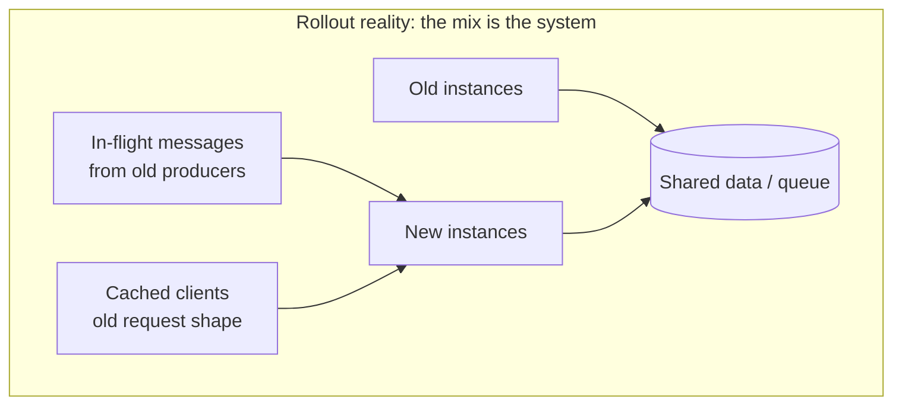
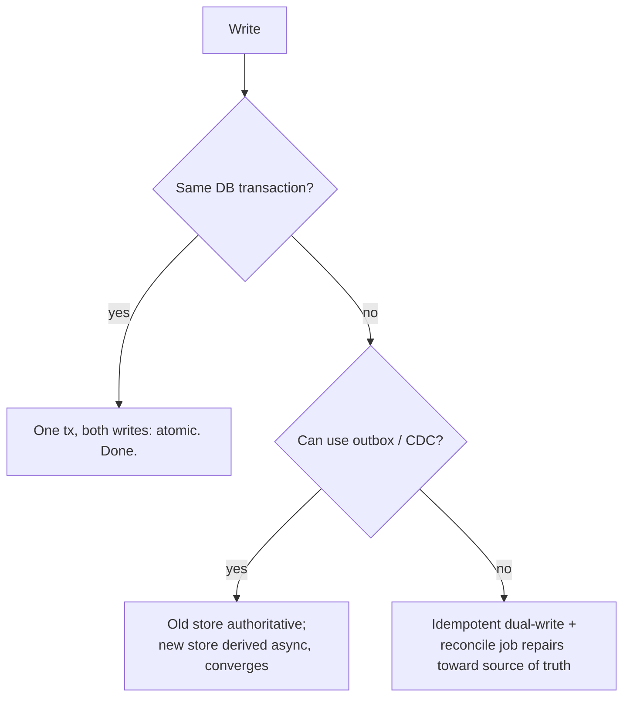
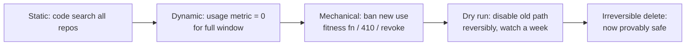

# Expand-Contract Refactors — Professional Level

> **Category:** [Anti-Patterns at Scale](../README.md) → **Expand-Contract Refactors** — *change a contract callers depend on in two safe phases: make new and old both work (expand), migrate, then remove the old (contract) — never one atomic edit you cannot do.*
> **Covers (collectively):** Parallel Change (expand-contract) · Backward & forward compatibility · Deprecation windows · Schema / API / event / DB evolution · Dual-write / dual-read & Tolerant Reader

---

## Table of Contents

1. [Introduction](#introduction)
2. [Prerequisites](#prerequisites)
3. [Distributed Rollout Ordering Under Real Constraints](#distributed-rollout-ordering-under-real-constraints)
4. [Dual-Write Consistency and Partial Failure](#dual-write-consistency-and-partial-failure)
5. [Dual-Read and Reconciliation](#dual-read-and-reconciliation)
6. [The Performance Cost of Carrying Both Paths](#the-performance-cost-of-carrying-both-paths)
7. [Proving the Contract Step Is Safe](#proving-the-contract-step-is-safe)
8. [Rollback at Each Phase](#rollback-at-each-phase)
9. [The Dominant Failure: Stuck Forever in Expand](#the-dominant-failure-stuck-forever-in-expand)
10. [A Worked Example: Splitting a Money Column, End to End](#a-worked-example-splitting-a-money-column-end-to-end)
11. [Common Mistakes](#common-mistakes)
12. [Test Yourself](#test-yourself)
13. [Cheat Sheet](#cheat-sheet)
14. [Summary](#summary)
15. [Further Reading](#further-reading)
16. [Related Topics](#related-topics)

---

## Introduction

> Focus: **Zero-downtime details & failure modes** — distributed rollout ordering, dual-write consistency under partial failure, dual-read reconciliation, the cost of both paths, *proving* the contract phase is safe, rollback, and the dominant failure: getting stuck in "expand" forever.

[`senior.md`](senior.md) established the coordination discipline: deploy order, deprecation windows, the canonical column rename. This file is about everything that goes *wrong* during a real zero-downtime migration and how to engineer against it.

The uncomfortable truth of expand-contract at this level is that **the "expand" state — where both old and new paths are live — is itself a distributed system with its own failure modes.** Dual-writing two stores can succeed on one and fail on the other, leaving them inconsistent. Dual-reading must decide what to do when the two sources disagree. Both paths running at once doubles write cost and competes for cache. And the most consequential failure isn't a crash — it's *never finishing*, leaving the codebase permanently paying the dual-support tax.

The professional disciplines:

1. **Treat the expand window as a system to be engineered, not a phase to be passed through.** Dual-write atomicity, dual-read reconciliation, and the cost of both paths are first-class design problems, not incidental.
2. **Never contract on faith.** "No one uses the old shape" is a claim you must *prove* with code search, usage telemetry, and (where possible) a mechanical guarantee — before the irreversible deletion.
3. **Bound the window in advance.** The migration that stalls in expand is the common, expensive failure. Give it an owner, a deadline, a ratchet, and a forcing function — or it becomes permanent.

> **The mental model:** during expand you are running two implementations of one contract concurrently and keeping them consistent. That is strictly harder than running either alone. You accept that cost *temporarily* to buy safety — and the whole engineering effort is making the temporary actually end, with consistency preserved throughout and a provably-safe deletion at the close.

---

## Prerequisites

- **Required:** Fluent with [`senior.md`](senior.md) — deploy ordering, deprecation windows, the canonical column rename, tracking remaining callers.
- **Required:** A working model of distributed consistency: atomicity across two stores, idempotency, retries, at-least-once delivery, eventual consistency, and why two-phase commit is usually unavailable.
- **Required:** You can read write-latency and error-rate dashboards, design a reconciliation job, and reason about a rolling deploy where N old and M new instances run at once.
- **Helpful:** Experience with CDC / outbox patterns, dual-writing to heterogeneous stores (SQL + search index, two tables, two services), and shadow/dark reads.
- **Helpful:** transaction-isolation, event-driven-architecture, monitoring-alerting, database-migration-patterns skills for the consistency and migration mechanics used throughout.

---

## Distributed Rollout Ordering Under Real Constraints

`senior.md` gave the ordering rule (producer-first to add, consumer-first to remove). In a real fleet, two constraints sharpen it:

- **Rolling deploys mean old and new run simultaneously.** There is no instant where "the service" is on one version. For the entire rollout, version N and N+1 instances serve traffic together and hit the same data. Every step must be correct for *the mix*, not just the end state. This is why you never advance two phases in one deploy: the intermediate mix would be inconsistent.
- **Caches, queues, and clients lag the deploy.** An in-flight message was produced by an old instance and consumed by a new one. A cached client holds the old request shape for hours. A retried request replays an old payload. The "old shape" therefore persists in the system well after the last old instance is gone — which is why the deprecation window is measured from *last observed use*, not *last deploy*.



> **The operative rule:** advance **one** phase per deploy, let it fully roll out (and drain queues/caches that carry the old shape), confirm the new mix is healthy on the dashboards, *then* advance. A migration is a sequence of individually-safe steps, each verified before the next — never a batch.

---

## Dual-Write Consistency and Partial Failure

The expand step for stateful migrations is **dual-write**: every mutation writes both the old and new location. If both are columns in one table, a single transaction makes it atomic and this section is easy. The hard case is dual-writing to **two stores that don't share a transaction** — two tables that can't be locked together, a database plus a search index, two services. Then dual-write is a distributed write, and it can *partially fail*.

```python
# DANGER: non-atomic dual-write. If the second write fails, the two stores
# diverge — old has the update, new doesn't (or vice versa). Now reads
# disagree and the migration is built on inconsistent data.
def save(order):
    old_store.write(order)          # succeeds
    new_store.write(order)          # raises → old and new now inconsistent
```

There is no free lunch (no cross-store atomic commit without 2PC, which you usually can't have). The professional options, roughly in order of preference:

1. **Single transaction when possible.** If old and new are columns/tables in the same database, write both in one transaction — partial failure is impossible. Prefer this; it's why column-add is the friendliest migration.

2. **Make the new write the *derived* one via an outbox / CDC.** Write only the old store transactionally, and propagate to the new store asynchronously from the transaction log (change-data-capture) or an outbox table written in the *same* transaction. The new store lags but converges; there's a single source of truth and no torn dual-write.

```python
# Outbox: the new-store write is an event committed in the SAME transaction
# as the old-store write. A consumer applies it to the new store; on failure
# it retries idempotently. No partial dual-write — one atomic commit.
def save(order):
    with db.transaction():
        old_store.write(order)
        outbox.append(NewStoreUpsert(order))   # same tx → atomic with the write
    # async worker drains outbox → new_store, idempotently, with retries
```

3. **Idempotent retry with a repair fallback.** If you must write both stores directly, make each write idempotent (keyed by id+version) and retry the laggard; back it with a **reconciliation job** that periodically finds and fixes divergence. Accept that there's a window of inconsistency bounded by the reconcile interval.

```python
def save(order):
    new_store.upsert(order)         # idempotent: safe to retry
    old_store.upsert(order)
    # If new_store wrote but old_store failed, the retry or the nightly
    # reconcile job repairs old_store from new_store (the chosen source of truth).
```

> **Decide the source of truth explicitly.** During dual-write *one* store is authoritative; the other is being populated. Reads serve from the authoritative one until the switch. Reconciliation always repairs *toward* the source of truth. Skipping this decision is how teams end up with two stores that each think they're right and no way to reconcile.



---

## Dual-Read and Reconciliation

The mirror of dual-write is **dual-read** (or *shadow read*): during migration, read the new path *alongside* the old, compare, and use the comparison to gain confidence before you switch. It's how you verify the new path is correct under real production load *without* trusting it yet.

```go
// Shadow read: serve from the trusted (old) path, asynchronously read the new
// path, and record any mismatch. Drives the confidence to switch reads later.
func GetBalance(id string) Money {
    old := oldStore.Balance(id)          // authoritative; this is what we return
    go func() {                           // shadow: off the hot path
        if new := newStore.Balance(id); new != old {
            metrics.Counter("migration.balance.mismatch").Inc()
            log.Warn("shadow mismatch", "id", id, "old", old, "new", new)
        }
    }()
    return old
}
```

The mismatch metric is the gate to switch reads: **you flip to the new path when the mismatch rate is zero (or a known, explained residual) over a representative window** — peak traffic, month-end, the long-tail keys. A clean shadow comparison is far stronger evidence than "the backfill finished."

When old and new genuinely disagree at read time (a real risk during dual-write with async propagation), you need a **reconciliation policy**: which value wins, and how you repair. Options: last-writer-wins by version/timestamp, source-of-truth-wins (repair the other toward it), or surface the conflict for manual resolution (rare, for high-value data like money). Whatever you choose, **the read path must be deterministic** — never "sometimes old, sometimes new" with no rule.

> **Shadow reads convert "we hope the new path is right" into "we measured it against production for two weeks and it matched."** That evidence is what makes both the read-switch and the eventual contract defensible.

---

## The Performance Cost of Carrying Both Paths

Expand is not free, and at scale the cost is measurable:

- **Write amplification.** Dual-write doubles writes for every mutation — two `INSERT`s, or a DB write plus an index update, or a DB write plus an outbox row and an async apply. Throughput-bound systems feel this directly: a write-heavy table mid-migration can see write latency and replication lag rise.
- **Storage and cache pressure.** Both columns/tables exist; the working set grows; cache hit rates drop because two representations compete for the same memory. A doubled hot column can push a table out of buffer-pool residency.
- **Read overhead from shadow reads.** Dual/shadow reads do extra work per request. Keep shadows **off the hot path** (async, sampled) so they don't inflate user-facing latency — sample at 1–5% if full shadow is too expensive.
- **Backfill load.** The one-time backfill competes with live traffic for I/O and locks. Batch it, throttle it, run it off-peak, and watch replication lag — a naive full-table `UPDATE` can stall the primary.

```
# Illustrative: write latency during the dual-write window (reproduce on your system).
# p99 write latency:  before 8ms → during dual-write 14ms → after contract 8ms
# The bump is the cost of expand. It is temporary IF the migration finishes —
# which is exactly why a stuck migration is so expensive: the tax never ends.
```

> **The performance cost is the strongest argument for *finishing*.** Every metric above returns to baseline only after the contract step. A migration stuck in expand pays the write-amplification, storage, and complexity tax *forever* — turning a temporary cost into a permanent one. Budget the cost, monitor it, and treat its persistence as a signal the migration has stalled.

---

## Proving the Contract Step Is Safe

The contract step is **irreversible** (you delete the old column, drop the field, remove the endpoint). "I'm pretty sure nothing uses it" is not good enough. You prove it, with layered evidence, strongest last:

1. **Static proof — code search across all repos.** Grep/AST-search every repository (yours and consumers') for references to the old name. Works only for callers whose source you can see; necessary but not sufficient.

2. **Dynamic proof — usage telemetry at zero.** The per-caller counter on the old path (from `senior.md`), at zero for a **full deprecation window** that covers your slowest caller (the monthly batch job, the cached mobile client). This catches the callers code search can't see.

3. **Mechanical proof — make new use impossible.** Before deleting, *prevent* re-adoption: a fitness-function CI rule that fails any build referencing the deprecated symbol; an API gateway that 410s the old version; a DB trigger/permission that rejects writes to the old column. Now the count *can't* climb back during the window (this is the ratchet, made mechanical).

4. **Reversible dry run — break it before you delete it.** The strongest dynamic test short of deletion: **stop serving the old path without removing it** (return errors, or make the old column unreadable) behind a flag, watch for fallout for a window, and keep the ability to flip it back instantly. If nothing breaks, deletion is safe. If something breaks, you've found the last caller *recoverably*.

```sql
-- Reversible dry run before DROP: make the old column unreadable by the app
-- (revoke), watch for errors for a week. If clean, the real DROP is safe.
-- This is recoverable (re-GRANT); DROP COLUMN is not.
REVOKE SELECT (name) ON users FROM app_role;
```



> **Order the evidence by reversibility.** Everything before the final delete must be *recoverable*. The irreversible step happens only after the reversible dry run came back clean. You never learn "something still used it" from a `DROP COLUMN` — you learn it from a `REVOKE` you can undo.

---

## Rollback at Each Phase

A key virtue of expand-contract: **most phases are independently reversible**, because the old path is still there. Know the rollback for each:

| Phase | Rollback | Reversible? |
|---|---|---|
| Add column / emit new field (expand) | Stop writing/emitting new; it's additive, old untouched | Fully — trivial |
| Dual-write | Stop writing the new store; old is still authoritative | Fully |
| Backfill | Harmless to re-run (idempotent); nothing reads new yet | Fully |
| Switch reads to new | **Flip reads back to old** — safe *because dual-write kept old correct* | Fully (this is why dual-write spans the switch) |
| Stop writing old | Resume writing old + **re-backfill the gap** written while you weren't | Recoverable, with a repair |
| Drop old column/field | **None** — irreversible (restore from backup only) | No |

The design consequence: **keep the cheap rollback available as long as possible.** Dual-write existing across the read-switch is precisely what makes the riskiest step (switching reads) instantly reversible — flip back and the old data is still correct. The only truly irreversible step is the final drop, which is exactly why it's gated behind the full proof above.

> **Practical rollback drill:** before switching reads in production, *rehearse* the flip-back (toggle the read source via flag in staging or a canary). The first time you flip reads back should not be during an incident.

---

## The Dominant Failure: Stuck Forever in Expand

The migration rarely fails by crashing. It fails by **never finishing the contract step** — the new path is live, the old path is *also* live, and it stays that way for years. This is the single most common and most expensive expand-contract failure.

Why it happens:

- **No owner after the fun part.** Building the new path is interesting; chasing the last three teams to migrate is tedious. The migration loses its champion and stalls at 90%.
- **The last 10% of callers are the hardest.** They're the legacy services nobody wants to touch, the third-party clients you can't force, the batch job whose owner left. The long tail dominates the timeline.
- **"Both work, so why bother?"** Once the new path serves traffic, the pain is invisible to users, so the cleanup is endlessly deprioritized — while the tax (write amplification, dual-read overhead, two-shape complexity, the cognitive load of "which is real?") compounds on every future change.

The cost of stalling is exactly the [premature-abstraction](../07-premature-abstraction-at-scale/senior.md)-adjacent trap from the other direction: permanent complexity with no payoff. Every engineer who later touches this code must understand *both* shapes and the migration that never ended.

Engineering against the stall:

- **Bound the window up front.** The deprecation has a *sunset date* decided when you start expand, not "someday." The date is the forcing function.
- **Ratchet, don't just deprecate.** Make old-path usage a budget that can only fall ([ratcheting](../02-anti-pattern-budgets-and-ratcheting/senior.md)) — a fitness function that fails CI if a new caller adopts the old shape. The count can't climb, so the tail can only shrink.
- **Assign the contract step as owned work, with a deadline,** the same as a feature. "Drop `name` column" is a tracked ticket with an owner and a date, not a wish.
- **Make the old path progressively painful.** As the sunset nears, log louder, then warn, then inject latency / return errors for a fraction of old-path traffic (a *forcing function*) so the last callers feel pressure to move.
- **Track the migration as an explicit state machine** (expand → migrating → ready-to-contract → done) with the current state visible. A migration with no visible "done" state never reaches it.

```mermaid
graph LR
    EX[Expand: both live] --> MIG[Migrating: callers moving]
    MIG --> RTC[Ready to contract: usage = 0]
    RTC --> DONE[Contracted: old gone, tax paid back]
    MIG -.->|no owner, no date,<br/>no ratchet| STUCK[STUCK: permanent dual-support tax]
    style STUCK fill:#3a2a2a
    style DONE fill:#2a3a2a
```



> **Expand-contract's failure mode is not a bad deploy — it's a migration that never ends.** Finishing is a *project management* discipline as much as an engineering one: an owner, a sunset date, a ratchet, and a forcing function. Without them, you've traded one atomic risk for a permanent complexity tax.

---

## A Worked Example: Splitting a Money Column, End to End

A table stores `amount` as a float (a bug — money in floats rounds wrong). You must migrate to integer `amount_cents`, with no downtime, across services that read the table directly, and *prove* the old column is dead before dropping it.

**Phase 1 — Expand (schema + dual-write, one transaction).**
```sql
ALTER TABLE payments ADD COLUMN amount_cents BIGINT;   -- cheap, nullable
```
```python
def save_payment(p):
    with db.transaction():                              # atomic: both or neither
        db.execute(
            "INSERT INTO payments (id, amount, amount_cents) VALUES (%s, %s, %s)",
            (p.id, p.amount_float, round(p.amount_float * 100)),
        )
# Same-transaction dual-write → no partial-failure window. amount stays authoritative.
```

**Phase 2 — Backfill (batched, throttled).**
```sql
UPDATE payments SET amount_cents = ROUND(amount * 100)
WHERE amount_cents IS NULL
LIMIT 5000;   -- repeat until 0 rows; throttle, watch replication lag
```

**Phase 3 — Shadow read (gain confidence).**
```python
def read_amount_cents(id):
    old = round(db.scalar("SELECT amount FROM payments WHERE id=%s", id) * 100)
    new = db.scalar("SELECT amount_cents FROM payments WHERE id=%s", id)
    if old != new:
        metrics.counter("payments.amount.mismatch").inc()   # gate to switch
    return old   # still serving from the trusted (old) computation
```
Switch reads to `amount_cents` only when the mismatch counter is flat zero across month-end (the float-rounding edge cases surface there).

**Phase 4 — Switch reads, then stop dual-write.** Deploy reads from `amount_cents` (still dual-writing → reads instantly reversible). After a clean window, stop writing `amount`.

**Phase 5 — Prove and contract.**
```sql
-- Static: grep all repos for `amount` (non-cents). Dynamic: per-caller read
-- counter on `amount` at zero for a full window. Mechanical + dry run:
REVOKE SELECT (amount) ON payments FROM app_role;   -- reversible; watch a week
-- Only then, the irreversible step:
ALTER TABLE payments DROP COLUMN amount;
```

> **Illustrative end state:** the float-rounding bug is gone, no request ever saw an error or stale value, every intermediate state was independently deployable and (until the final `DROP`) reversible, and the deletion happened only after a reversible `REVOKE` dry run came back clean. The migration *finished* — gated by a sunset date and a ratchet — so the dual-write write-amplification tax was paid back instead of becoming permanent.

---

## Common Mistakes

1. **Non-atomic dual-write with no reconciliation.** Writing two stores outside a transaction and assuming both succeed. Use one transaction, an outbox/CDC, or idempotent writes plus a reconcile job — and name the source of truth.
2. **Switching reads before the backfill is *complete and verified*.** A new read on a not-yet-backfilled row returns null/zero. Confirm every row has the new value (and shadow-reads match) before flipping.
3. **No shadow-read evidence.** Switching reads because "the backfill finished" instead of "shadow reads matched production for two weeks." The shadow comparison is the real proof the new path is correct under load.
4. **Advancing two phases in one deploy.** During a rolling deploy the mixed-version fleet then runs an inconsistent combination. One phase per deploy, fully rolled out and verified, then the next.
5. **Contracting on faith.** Dropping the old shape on "probably unused" instead of layered proof (code search → usage-zero-for-a-window → mechanical ban → reversible dry run). The drop is irreversible; the evidence before it must be recoverable.
6. **Throwing away the cheap rollback too early.** Stopping dual-write before you're sure of the new read path removes your instant flip-back. Keep dual-write spanning the read switch.
7. **Ignoring the cost of expand.** Treating dual-write/shadow-read overhead as free; not monitoring write latency, replication lag, or cache pressure during the window.
8. **No sunset date, no owner, no ratchet — getting stuck in expand.** The dominant failure. Bound the window up front, ratchet old-path usage down, assign the contract step as owned dated work, and add a forcing function for the long tail.
9. **Window sized to the fastest caller.** Removing the old shape after online services migrated, before the monthly batch job ran. Size the window to the slowest legitimate consumer.

---

## Test Yourself

1. You must dual-write to a SQL table and a separate search index that share no transaction. The SQL write succeeds and the index write fails. What are your three structural options, and which do you prefer when correctness matters most?
2. What is a shadow (dual) read, where does it sit relative to the hot path, and what specific signal does it produce that gates the read-switch?
3. During a rolling deploy, why is it unsafe to both switch reads to the new column *and* stop writing the old column in the same release?
4. List the four layers of evidence that the contract step is safe, ordered weakest to strongest, and explain why the final irreversible delete must come after a *reversible* dry run.
5. Which single phase of the column rename makes the read-switch instantly reversible, and what breaks about rollback if you remove it too early?
6. Name the dominant failure mode of expand-contract at scale, three reasons it happens, and three mechanisms that force the migration to actually finish.
7. Why is "the backfill finished, so the new path is correct" weaker evidence than "shadow reads matched for two weeks across month-end"?

<details>
<summary>Answers</summary>

1. (a) **Single transaction** — not available here (two stores, no shared tx). (b) **Outbox / CDC** — write SQL transactionally and emit a change event in the *same* transaction; an async worker idempotently applies it to the index. SQL is the source of truth; the index converges; no torn dual-write. (c) **Idempotent dual-write + reconciliation job** — retry the failed write, and a periodic job repairs divergence toward the source of truth. When correctness matters most, prefer **(b) outbox/CDC**: there's one atomic commit and a single source of truth, so the stores can't permanently disagree.
2. A shadow read serves the response from the trusted (old) path while *also* reading the new path asynchronously and comparing. It sits **off the hot path** (async, often sampled) so it doesn't inflate user latency. It produces a **mismatch rate**; the read-switch is gated on that rate being zero (or a known residual) over a representative window.
3. Because the rolling deploy runs old and new instances simultaneously. If the same release flips reads to new and stops writing old, an old instance still writing only `name` coexists with a new instance reading `full_name` — and rows the old instance writes won't have `full_name`, so the new reader gets nulls. Dual-write must span the read switch; reads switch in one deploy, writes stop in a *later* one.
4. Weakest → strongest: (1) **static code search** across repos (misses callers you can't see); (2) **usage telemetry at zero** for a full window (catches unseen callers); (3) **mechanical ban** on new use (fitness function / 410 / revoke — count can't climb back); (4) **reversible dry run** — disable the old path without deleting it and watch for fallout. The irreversible delete comes last because you must be able to *recover* if evidence is wrong; you learn "something still used it" from a `REVOKE` you can undo, never from a `DROP` you can't.
5. **Dual-write** (continuing to write the old column) makes the read-switch reversible: if reading `full_name` misbehaves, you flip reads back to `name`, which is still correct *because you're still writing it*. Stop dual-writing too early and flipping reads back returns stale data for everything written in the meantime — the cheap rollback is gone.
6. **Stuck forever in expand** — old and new paths both live indefinitely. Reasons: no owner after the interesting part; the last 10% of callers (legacy/third-party/orphaned) are the hardest; "both work" makes cleanup invisible and endlessly deprioritized while the tax compounds. Forcing mechanisms: a **sunset date** set at the start; a **ratchet** (fitness function failing CI on new old-path adoption, so usage only falls); the **contract step assigned as owned, dated work**; plus a **forcing function** (escalating warnings → injected latency/errors) on the long tail.
7. "Backfill finished" proves only that the new column has *values*, not that those values are *correct* or that the new read path computes the right answer under real conditions. Shadow reads compare old vs new on *live production traffic*, including the edge cases (month-end, the float-rounding keys) that backfill alone never exercises — so a clean two-week shadow window is direct evidence of correctness, not just population.

</details>

---

## Cheat Sheet

| Failure mode | Engineering defense |
|---|---|
| **Partial dual-write** (two stores, no shared tx) | One transaction if possible; else outbox/CDC (single source of truth) or idempotent write + reconcile; name the source of truth |
| **Read-time disagreement** | Deterministic reconciliation policy (LWW / source-of-truth-wins); never "sometimes old, sometimes new" |
| **Switching reads too early** | Gate on backfill complete **and** shadow-read mismatch = 0 over a representative window |
| **Mixed-version inconsistency** | One phase per deploy, fully rolled out + verified before the next |
| **Unsafe contract** | Layered proof: code search → usage = 0 for full window → mechanical ban → reversible dry run → *then* delete |
| **Lost rollback** | Keep dual-write spanning the read switch; only the final drop is irreversible |
| **Cost of both paths** | Monitor write amplification, replication lag, cache pressure; sample shadow reads; throttle backfill |
| **Stuck in expand** (the big one) | Sunset date up front · ratchet old-path usage down · contract step = owned dated work · forcing function on the tail |

> **One rule to remember:** *The expand window is a distributed system you must keep consistent and a tax you must stop paying — engineer dual-write/read for partial failure, prove the contract step with reversible evidence, and force the migration to actually finish.*

---

## Summary

- The **expand window is itself a distributed system**: dual-write can partially fail, dual-read can disagree, and both paths cost real write amplification, storage, and cache pressure. Engineer it deliberately — don't treat it as a phase you just pass through.
- **Dual-write consistency:** prefer one transaction; else an **outbox/CDC** with a single source of truth, or idempotent writes plus a reconciliation job. Always name which store is authoritative and reconcile *toward* it.
- **Dual-read / shadow read** serves from the trusted path while comparing the new one off the hot path; the **mismatch metric at zero over a representative window** (peak, month-end, long tail) is the real evidence to switch reads — far stronger than "the backfill finished."
- **Rolling deploys mean the mix is the system.** Advance one phase per deploy, fully rolled out and verified, because old and new instances serve the same data simultaneously; the old shape also persists in queues and caches after the last old instance, so windows are measured from last *use*, not last deploy.
- **Prove the contract step with reversible evidence first:** code search → usage telemetry at zero for a full window → mechanical ban on new use → a reversible dry run (disable, don't delete) → only then the irreversible drop.
- **Rollback is cheap at every phase except the final drop** — and dual-write spanning the read switch is exactly what keeps the riskiest step (switching reads) instantly reversible.
- **The dominant failure is not a crash but never finishing** — stuck in expand, paying the dual-support tax forever. Defeat it with a sunset date set up front, a ratchet so old-path usage can only fall, the contract step owned as dated work, and a forcing function on the long tail.
- This completes the level ladder for Expand-Contract: [`junior.md`](junior.md) (why atomic edits fail) → [`middle.md`](middle.md) (the three steps across real contracts) → [`senior.md`](senior.md) (coordinating producer & consumer) → **professional.md** (zero-downtime failure modes and finishing the migration).

---

## Further Reading

- **Designing Data-Intensive Applications** — Martin Kleppmann (2017) — dual-write hazards, derived data, change-data-capture, the outbox pattern, and reconciliation; the canonical reference for the consistency problems in this file.
- **Refactoring Databases: Evolutionary Database Design** — Ambler & Sadalage (2006) — transition-period dual-writing/reading and the safe removal of deprecated schema.
- **Database Reliability Engineering** — Campbell & Majors (2017) — online schema change, batched throttled backfills, and operating migrations under live load.
- **Release It!** — Michael Nygard (2nd ed., 2018) — versioning, forcing functions, and the operational reality of long-lived migrations.
- **Martin Fowler — "ParallelChange"**, **"BlueGreenDeployment"**, and posts on dark/shadow launching — the rollout and verification techniques referenced here.
- **transaction-isolation**, **event-driven-architecture** (outbox/CDC), **monitoring-alerting**, **database-migration-patterns** skills — the consistency, propagation, and tracking mechanics.

---

## Related Topics

- [Strangler Fig & Seams → Senior](../05-strangler-fig-and-seams/senior.md) — the component-level migration whose every seam is a zero-downtime expand-contract.
- [Architecture Fitness Functions → Senior](../01-architecture-fitness-functions/senior.md) — the mechanical ban on re-adopting the old shape, and ordering enforced as a CI gate.
- [Anti-Pattern Budgets & Ratcheting → Senior](../02-anti-pattern-budgets-and-ratcheting/senior.md) — old-path usage as a budget that can only fall: the cure for "stuck in expand."
- [Premature Abstraction at Scale → Senior](../07-premature-abstraction-at-scale/senior.md) — the related permanent-complexity trap when a migration never pays itself back.
- [Clean Code → Error Handling](../../../clean-code/06-error-handling/README.md) — tolerant reads and graceful handling of missing/old shapes during the window.
- [Clean Code → Abstraction & Information Hiding](../../../clean-code/22-abstraction-and-information-hiding/README.md) — a small, hidden contract is what makes zero-downtime evolution feasible at all.
- [Abstraction Failures → Senior](../../02-design/03-abstraction-failures/senior.md) — when the contract being migrated was the wrong abstraction to begin with.
- [Architecture → Anti-Patterns](../../../../../Architecture/anti-patterns/README.md) — the system-level view of distributed consistency and coordinated change.
- [`junior.md`](junior.md) · [`middle.md`](middle.md) · [`senior.md`](senior.md) — the technique from one method up to this level.
