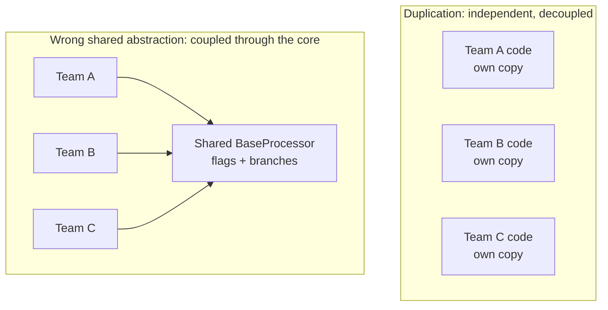
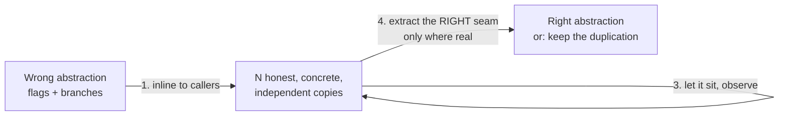

# Premature Abstraction at Scale — Senior Level

> **Category:** [Anti-Patterns at Scale](../README.md) → **Premature Abstraction at Scale** — *the "clean", generic, decoupled design nobody needed — when over-abstraction is itself the anti-pattern, and how to unwind it at scale.*
> **Covers (collectively):** Speculative Generality · Wrapper-itis & needless indirection · Premature decoupling & one-implementation interfaces · The Wrong Abstraction · AHA / Rule of Three / YAGNI as the cure

---

## Table of Contents

1. [Introduction](#introduction)
2. [Prerequisites](#prerequisites)
3. [The Problem You Inherit: A Wrong Abstraction With 200 Callers](#the-problem-you-inherit-a-wrong-abstraction-with-200-callers)
4. [Why a Shared Abstraction *Is* Coupling](#why-a-shared-abstraction-is-coupling)
5. [Metz's Path: Inline It Back to Duplication First](#metzs-path-inline-it-back-to-duplication-first)
6. [A Worked Unwind, Step by Step](#a-worked-unwind-step-by-step)
7. [The Inline IS a Codemod: Doing It Across the Codebase](#the-inline-is-a-codemod-doing-it-across-the-codebase)
8. [Where to Aim: Hotspots, Not Every Abstraction](#where-to-aim-hotspots-not-every-abstraction)
9. [Extract-vs-Wait: The Senior Judgment Call](#extract-vs-wait-the-senior-judgment-call)
10. [Keeping It From Regrowing: Fitness Functions](#keeping-it-from-regrowing-fitness-functions)
11. [Common Mistakes](#common-mistakes)
12. [Test Yourself](#test-yourself)
13. [Cheat Sheet](#cheat-sheet)
14. [Summary](#summary)
15. [Further Reading](#further-reading)
16. [Related Topics](#related-topics)

---

## Introduction

> Focus: **Unwinding a wrong abstraction at scale** — when the premature design is no longer a clever class but a load-bearing dependency that hundreds of files import, and the cure is to go *backwards*: inline it to duplication so the real seams reveal themselves.

[`junior.md`](junior.md) taught you to recognize premature abstraction; [`middle.md`](middle.md) taught you to resist creating it and to tell an earned abstraction from a speculative one. This file is about the situation you *inherit* as a senior: the wrong abstraction is three years old. Two hundred files import the `BaseProcessor`. Every caller passes a flag to opt out of half of its behavior. New requirements arrive as ever-uglier conditionals threaded through the shared core, because nobody can touch the abstraction without touching everyone. The cost is no longer "a layer is a bit hard to read" — it's that **the wrong abstraction has become a coupling point across teams**, and a change that should be local now requires a cross-team negotiation.

> **The distinction that defines this topic.** [Over-Engineering → senior](../../01-development/03-over-engineering/senior.md) covers the *organizational forces* that produce over-engineering and the shared safe-change toolkit (seams, Strangler Fig, branch-by-abstraction). **This topic is the specific case of unwinding the *wrong abstraction*:** the counter-intuitive senior move of *re-introducing duplication* to free callers, the reason a shared abstraction is itself coupling, and the fact that the inline is mechanical enough to be a **codemod** ([Automated Large-Scale Refactoring](../04-automated-large-scale-refactoring/senior.md)). [Abstraction Failures → senior](../../02-design/03-abstraction-failures/senior.md) treats the same wrong-abstraction at design granularity; here it's the *at-scale mechanics*.

> **The senior mindset shift:** the junior asks "is this abstraction good?"; the senior asks **"what does this abstraction cost us to carry, who is coupled through it, what would it cost to unwind, and is the cheapest correct move to add a parameter, fork it, or *delete it back to duplication*?"** The hardest thing to internalize: **the wrong abstraction is more expensive than no abstraction, and the path forward often runs backward** — through duplication — before the *right* seams become visible.

---

## Prerequisites

- **Required:** Fluency with [`junior.md`](junior.md) and [`middle.md`](middle.md) — the shapes, the Rule of Three, "same knowledge vs same shape," earned-keep criteria.
- **Required:** You can change behavior across a large codebase safely: characterization tests, seams, branch-by-abstraction, parallel-change (covered mechanically in [Over-Engineering → senior](../../01-development/03-over-engineering/senior.md) and the [Strangler Fig](../05-strangler-fig-and-seams/senior.md) topic).
- **Strongly recommended:** [Automated Large-Scale Refactoring → senior](../04-automated-large-scale-refactoring/senior.md) — the inline-the-abstraction move *is* a codemod; you'll apply it with OpenRewrite / jscodeshift / Comby / `gofmt -r`.
- **Helpful:** [Hotspot Analysis → senior](../03-hotspot-analysis/senior.md) — to decide *which* wrong abstraction is worth unwinding (most aren't).
- **Helpful:** refactoring-techniques and code-smell-detection skills.

---

## The Problem You Inherit: A Wrong Abstraction With 200 Callers

A wrong abstraction at scale has a recognizable life cycle. Someone saw two similar things and extracted a shared core. Then a third case arrived that was *almost* the same — so they added a conditional. Then a fourth needed a slightly different output — a boolean flag. By case eight, the "shared" core is a maze of flags, each call site passing the combination that bends the abstraction back into the shape it actually needs.

```java
// The wrong abstraction, fully grown. Every new requirement added a parameter
// or a branch, because nobody could afford to NOT share the core.
abstract class ReportProcessor {
    final Report process(Source src, boolean includeHeader, boolean compress,
                         boolean legacyDateFormat, ExportMode mode,
                         boolean skipValidation, Locale locale) {
        var rows = read(src);
        if (!skipValidation) validate(rows);            // case 3 needed to skip this
        if (legacyDateFormat) rows = reformatDates(rows); // case 5 only
        var out = render(rows, includeHeader, locale);    // header flag: cases 1,2,6
        return mode == ExportMode.STREAM ? stream(out)    // case 7 only
             : compress ? gzip(out) : out;                // compress: cases 4,8
    }
    abstract List<Row> read(Source s);   // each subclass overrides one or two hooks
    abstract Report render(...);
}
```

Every boolean is a scar where a caller's reality didn't fit the abstraction. The **flag arguments are the diagnosis**: a caller passing `skipValidation=true` is *opting out* of the abstraction. When most callers opt out of most of it, the abstraction isn't shared behavior — it's a switchboard, and the "sharing" is fictional.

> **The reliable tell of a wrong abstraction at scale:** the number of boolean/enum parameters grows monotonically over time, and each one exists for a *subset* of callers. The abstraction is being kept alive by conditionals, not earning its place by genuinely shared behavior.

---

## Why a Shared Abstraction *Is* Coupling

The counter-intuitive idea a senior must hold: **DRY trades duplication for coupling.** When you extract shared code, every caller now depends on that shared code's *shape*. That's the whole point when the shape is genuinely shared. But when it isn't, you've created coupling between things that should be independent — and at scale, that coupling crosses team boundaries.



The consequences a senior actually feels:

- **A local change becomes a global one.** Team A needs a new behavior; the only place to put it is the shared core; now the change must be reviewed by B and C, regression-tested against their use cases, and coordinated into one release. The abstraction has *centralized* what was decentralized.
- **The blast radius is everyone.** A bug introduced while serving Team A's new flag can break Team B's report, because they share the core. Duplication would have isolated the blast.
- **Velocity drops for all consumers.** Every team now moves at the speed of the slowest review of the shared dependency. (This is *premature DRY across boundaries* — see [Over-Engineering → senior](../../01-development/03-over-engineering/senior.md).)

> **The trade you're really evaluating:** duplication costs you N copies to update when the *shared knowledge* truly changes. The wrong abstraction costs you a coupling point, a growing flag-set, and a coordination tax *forever*. When the knowledge isn't actually shared, duplication is the cheaper side of the trade — which is exactly Metz's rule, now visible as an org-level coupling cost, not a code-tidiness preference.

---

## Metz's Path: Inline It Back to Duplication First

Sandi Metz's prescription for a wrong abstraction is precise and worth following literally. **You don't refactor a wrong abstraction *forward* into a better one. You inline it *backward* into duplication first, then let the real seams emerge.**

The steps:

1. **Re-inline the abstraction into each caller.** Copy the shared code back into every call site, specialized to what *that* caller actually needs — dropping the flags it always passed and the branches it never took. You now have N honest, concrete, *independent* implementations.
2. **Delete the now-dead abstraction.** Once every caller is inlined, the shared core has zero references. Delete it (git keeps history).
3. **Let the duplication sit.** Resist the urge to immediately re-abstract. The point of inlining is to *see the real shapes* without the wrong abstraction distorting them.
4. **Find the *actual* seams.** With N concrete implementations side by side, the genuine commonality — if any — becomes visible. Now you can extract the *right* abstraction against three real, different, *de-flagged* examples, exactly the way [`middle.md`](middle.md)'s earned-keep criteria require. Often you'll find there was less real commonality than the original abstraction claimed.



> **Why backward-first works.** The wrong abstraction *imposes* a shape; you can't see the right one through it because every caller is already bent to fit the wrong one. Inlining removes the distortion. It feels like regression — you're *adding* duplication on purpose — but it's the only move that recovers the information the abstraction destroyed. The duplication is a *temporary, intentional* state, not the destination.

---

## A Worked Unwind, Step by Step

Take the `ReportProcessor` above. Three real callers: `SalesReport`, `TaxReport`, `AuditReport`. Inline each.

**Step 1 — inline `SalesReport`, dropping the flags it always passed** (`includeHeader=true, compress=true, legacyDateFormat=false, mode=FILE, skipValidation=false`):

```java
// SalesReport: concrete, honest, no flags. Only the branches it actually used.
class SalesReport {
    Report generate(Source src) {
        var rows = read(src);
        validate(rows);                       // it always validated
        var out = render(rows, /*header*/ true, Locale.US);
        return gzip(out);                     // it always compressed to a file
    }
}
```

**Step 2 — inline `TaxReport`** (which always passed `legacyDateFormat=true, skipValidation=false, compress=false`):

```java
class TaxReport {
    Report generate(Source src) {
        var rows = reformatDates(read(src));  // the legacy date format it needs
        validate(rows);
        return render(rows, /*header*/ true, locale());   // no compression
    }
}
```

**Step 3 — inline `AuditReport`** (which passed `skipValidation=true, mode=STREAM`):

```java
class AuditReport {
    Report generate(Source src) {
        var rows = read(src);                 // audit intentionally skips validation
        return stream(render(rows, /*header*/ false, Locale.US));
    }
}
```

**Step 4 — delete `ReportProcessor`** (now zero references) and observe. With the three side by side, the *real* commonality is visible and small: they all `read(src)` then `render(...)`. Validation, date-reformatting, compression, streaming, headers — every one of those was a *difference*, not shared behavior. The honest abstraction, if you extract anything at all, is tiny:

```java
// The RIGHT, narrow abstraction — only what's genuinely shared, no flags.
List<Row> readRows(Source src) { /* the one real commonality */ }
// Each report calls readRows() and then does its own thing. The 7-flag
// switchboard is gone; the coupling is gone; each report changes independently.
```

Seven flags collapsed to zero, one coupling point became three independent classes, and the "shared core" turned out to be one shared helper. That gap — between the seven-flag abstraction and the one-line real commonality — *is the measure of how wrong the original abstraction was.*

---

## The Inline IS a Codemod: Doing It Across the Codebase

When the wrong abstraction has 200 callers, you don't inline by hand — you script it. **The inline is a mechanical, AST-shaped transform**, which is exactly what [Automated Large-Scale Refactoring](../04-automated-large-scale-refactoring/senior.md) is for. The realization that turns a months-long manual slog into a reviewable PR: *replacing a call to the abstraction with the specialized body it produces for that call site's constant arguments is a codemod.*

```bash
# 1. Find every caller and the flag-combination it passes (the input to the transform).
rg -n 'ReportProcessor|\.process\(' --type java

# 2. For mechanical sub-cases (e.g., "every caller that passes compress=false"),
#    a structural find/replace handles the bulk:
comby 'process(:[src], :[args], compress=false)' 'render(read(:[src]))' .java

# 3. For the real work, a typed codemod (OpenRewrite recipe) that:
#    - reads each call site's constant arguments
#    - clones the abstraction body, constant-folds the flags, deletes dead branches
#    - inlines the result into the caller
#    then deletes the now-unreferenced ReportProcessor.
./gradlew rewriteRun -Drewrite.activeRecipe=org.acme.InlineReportProcessor
```

The discipline is the same as any large-scale refactor:

- **Characterization tests first.** Before you inline, pin the *current* behavior of each caller with tests, so you can prove the inline preserved behavior. (You're changing structure, not behavior — the safety net must enforce that.)
- **Mechanical, reviewable diffs.** A codemod produces a uniform, machine-generated diff that reviewers can spot-check rather than read line by line.
- **One caller (or one flag-cohort) per PR where possible.** Inlining is embarrassingly parallel: each caller is independent once the shared core is still in place. Inline them incrementally; delete the core only after the last reference is gone (branch-by-abstraction in reverse).

> **The senior insight:** "inline the wrong abstraction" sounds like artisanal hand-work, but at scale it's the *same machinery* you'd use to *introduce* an abstraction — a codemod over the AST with a characterization-test net. The direction is reversed; the tooling is identical.

---

## Where to Aim: Hotspots, Not Every Abstraction

A large codebase has hundreds of premature abstractions. **Most are harmless** — a one-implementation interface in a file nobody touches costs nothing real. Unwinding it is busywork that adds risk for no return. The senior triage uses [Hotspot Analysis](../03-hotspot-analysis/senior.md): aim only where the wrong abstraction sits on a **change hotspot**.

The signal is **churn × coupling**:

- **High churn:** the abstraction's file (or its flag-set) changes often — every new requirement forces a touch. `git log` shows the shared core in the top percentile of commits.
- **High fan-out coupling:** many callers, ideally across team boundaries. Each touch ripples.
- **Growing flag-set:** the parameter list has grown commit over commit (visible in `git log -p` on the signature).

```bash
# Find abstractions that are ALSO hotspots: changed often, imported widely.
git log --format= --name-only --since='1 year ago' | sort | uniq -c | sort -rn | head
#   → if BaseProcessor.java is near the top AND has 200 importers, it's worth unwinding.
```

An abstraction that is wrong *and* a hotspot *and* a cross-team coupling point is where unwinding pays for itself in regained velocity. An abstraction that is wrong but cold and local is a smell you note and leave. **The wrongness is necessary but not sufficient; the cost is what justifies the work.**

---

## Extract-vs-Wait: The Senior Judgment Call

The mirror of unwinding is knowing when *not* to extract in the first place — the judgment that prevents the next wrong abstraction. At senior scale, the cost of being wrong is asymmetric and you should price it in:

| | **Extract now (abstract early)** | **Wait (tolerate duplication)** |
|---|---|---|
| **If you're right** | Small win: one place to change shared knowledge | Small cost: N places to change *if* it changes |
| **If you're wrong** | **Large cost:** a coupling point across callers/teams, a growing flag-set, an expensive unwind | Small cost: cheap to merge later when the real pattern appears |
| **Reversibility** | Hard — callers wire into the shape | Easy — merge is a local codemod |

The expected-cost math favors **waiting** whenever you're uncertain, because the downside of a wrong abstraction is far larger and harder to reverse than the downside of duplication. Extract early *only* when the variation is proven, the knowledge is genuinely shared, and the axis is stable (the earned-keep test from [`middle.md`](middle.md)). When in doubt, **DAMP over DRY**: keep the honest duplication and merge it the day a third real, different, knowledge-sharing case makes the right abstraction obvious.

> **The reframe:** you're not choosing between "clean" and "messy." You're choosing between a *reversible* cost (duplication you can merge with a codemod) and a *sticky* cost (a coupling point you'll unwind across 200 files). Prefer the reversible side of every uncertain bet.

---

## Keeping It From Regrowing: Fitness Functions

Once you've unwound a wrong abstraction, the *force* that produced it — the reflex to DRY everything, premature-decouple, wrap "for later" — is still in the team. Without a guard, the abstraction regrows under a new name. Encode the lesson as an [Architecture Fitness Function](../01-architecture-fitness-functions/senior.md) so the bad shape *fails the build*:

```python
# import-linter (Python): forbid the unwound shared core from coming back as a
# new cross-boundary dependency. If a team re-couples through a "common" module,
# CI fails — the lesson is enforced, not just documented in an ADR.
[importlinter:contract:no-shared-report-core]
name = Reports must not share a processor core
type = independence
modules =
    reports.sales
    reports.tax
    reports.audit
```

Other guards that fit this topic:

- **Cap interface-with-one-implementation** via an ArchUnit rule or a custom lint — flag new interfaces that gain no second implementation within a release.
- **Flag-argument budget** (an [anti-pattern budget](../02-anti-pattern-budgets-and-ratcheting/senior.md)): ratchet down the number of boolean parameters on shared functions; a new flag on a shared core requires explicit sign-off.
- **A "Rule of Three" review norm** as a documented, enforced convention: no new shared abstraction without three cited, different call sites in the PR description.

> Fitness functions don't replace judgment — they *capture* a judgment you've already made so the codebase can't silently regress to it. The unwind fixes today's wrong abstraction; the fitness function stops the team from rebuilding it next quarter.

---

## Common Mistakes

Senior-level mistakes — the expensive ones:

1. **Refactoring the wrong abstraction *forward* into a "better" abstraction.** You can't see the right shape through the wrong one. Inline to duplication *first*, observe, *then* extract — or don't. Skipping the inline usually produces wrong-abstraction v2.
2. **Re-abstracting immediately after inlining.** The inlined duplication needs to *sit* so the real seams emerge. Extracting the moment you finish inlining defeats the entire exercise.
3. **Inlining cold, local abstractions.** Unwinding a harmless one-impl interface in code nobody touches is risk without reward. Aim at hotspots — wrong *and* costly.
4. **Inlining by hand at scale.** Two hundred manual edits are slow, error-prone, and unreviewable. The inline is a codemod; script it, pin behavior with characterization tests, and ship mechanical diffs.
5. **Unwinding without a characterization net.** Inlining is a behavior-preserving transform *only if you can prove it*. No tests → you're guessing, and a dropped branch silently changes behavior for one caller.
6. **Treating "DRY" as an unconditional good.** DRY trades duplication for coupling. When the knowledge isn't shared, that trade is a loss — and at scale it's a cross-team coupling loss. Sometimes the senior move is to *add* duplication.
7. **Fixing the abstraction but not the force.** If the team's reflex to over-DRY persists, the abstraction regrows. Encode the lesson as a fitness function / review norm so CI enforces it.
8. **Confusing this with deleting *good* abstractions.** A deep module with three real, different implementations is *not* a wrong abstraction. Don't inline the `SessionStore` that genuinely has Redis/Postgres/Memory backends — that one earned its keep.

---

## Test Yourself

1. A shared `BaseProcessor` has grown from 0 to 7 boolean parameters over two years, each used by a subset of callers. What does the growing flag-set *diagnose*, and why are the flags themselves the evidence?
2. Explain the claim "a shared abstraction *is* coupling." What concrete, org-level cost does it impose that duplication does not?
3. Why does Metz's path inline a wrong abstraction *backward* into duplication before extracting a better one, instead of refactoring it forward directly?
4. You've inlined a wrong abstraction into 200 callers. Two reviewers ask "isn't this just adding duplication?" Give the precise answer.
5. Why is "inline the wrong abstraction" a *codemod* and not artisanal hand-work? What two safety mechanisms must accompany it at scale?
6. You find a one-implementation interface that is clearly premature, but it lives in a file changed twice in three years and imported by one caller. Do you unwind it? Justify using hotspot reasoning.
7. State the extract-vs-wait asymmetry. Why does it bias an *uncertain* decision toward waiting?
8. After unwinding, what stops the same wrong abstraction from regrowing next quarter, and why isn't an ADR enough?

<details>
<summary>Answers</summary>

1. It diagnoses **the wrong abstraction**: the core isn't shared behavior, it's a switchboard. Each flag is a place a caller *opts out* of the abstraction because its reality didn't fit. A flag used by a *subset* of callers means the abstraction is being bent to accommodate differences — the flags are the scars of forcing distinct things through one shape.
2. Extracting shared code makes every caller depend on that code's *shape*; when the shape isn't genuinely shared, you've coupled independent things. The org-level cost duplication avoids: a local change (Team A's new behavior) becomes a global one — it must go in the shared core, be reviewed by B and C, regression-tested against their cases, and released in coordination. Duplication keeps those changes independent and the blast radius local.
3. Because the wrong abstraction *imposes* a shape that every caller is already bent to fit — you can't see the right seam through it. Inlining removes the distortion, recovering the real, concrete shapes the abstraction destroyed. Only with N honest implementations side by side can you tell whether (and where) a genuine, knowledge-sharing seam exists. Refactoring forward usually just produces wrong-abstraction v2.
4. It's **intentional, temporary** duplication that recovers information the wrong abstraction destroyed. It frees each caller from the shared coupling point and the flag-switchboard, and it makes the *real* commonality visible so you can extract the right (narrow) abstraction — or correctly decide there's less shared knowledge than the original claimed. The destination isn't duplication; it's the *correct* structure, which you can't see until the wrong one is gone.
5. Because inlining a call to the abstraction is mechanically: clone the body, constant-fold this caller's constant arguments, delete dead branches, splice into the caller — an AST transform you can express as an OpenRewrite/jscodeshift/Comby recipe. Two safety mechanisms: **characterization tests** (prove behavior is preserved) and **incremental, reviewable, mechanical diffs** (one caller/flag-cohort per PR; delete the core only after the last reference).
6. **No** — note it, leave it. Unwinding has a cost and a risk; the payoff comes only when the wrong abstraction is *also* a hotspot (high churn, high cross-team fan-out, growing flag-set). A cold, single-caller interface costs essentially nothing real; spending effort and risk to inline it is busywork. Wrongness is necessary but not sufficient — the *cost* justifies the work.
7. If you abstract early and you're **right**, the win is small (one place to change); if you're **wrong**, the cost is large and sticky (a coupling point + growing flags + an expensive, 200-file unwind). If you wait and you're wrong, the cost is small and *reversible* (merge later with a codemod). Because the wrong-abstraction downside is far larger and harder to reverse, an uncertain decision should default to waiting (DAMP over DRY).
8. A **fitness function** that makes the bad shape fail the build — e.g., an `import-linter` independence contract forbidding the three report modules from re-coupling through a "common" core, an ArchUnit/lint rule against one-impl interfaces, or a flag-argument budget. An ADR is documentation a human must remember and enforce; the team's over-DRY reflex persists, so without an automated gate the abstraction silently regrows. The fitness function *captures* the judgment so CI enforces it.

</details>

---

## Cheat Sheet

| Step | Action | Tool / safety net |
|---|---|---|
| **Diagnose** | Growing flag-set, callers opting out, "shared" core is a switchboard | `git log -p` on the signature; count flags over time |
| **Triage** | Unwind only if wrong **and** a hotspot (churn × cross-team fan-out) | [Hotspot Analysis](../03-hotspot-analysis/senior.md): `git log` churn, importer count |
| **Pin behavior** | Characterization tests on every caller before touching anything | The net that proves the inline preserved behavior |
| **Inline backward** | Clone body into each caller, constant-fold its flags, drop dead branches | Codemod: OpenRewrite / jscodeshift / Comby / `gofmt -r` |
| **Delete the core** | Remove the abstraction once it has zero references | Branch-by-abstraction in reverse; git keeps history |
| **Let it sit, then extract** | Observe the N concrete shapes; extract the *narrow* real seam — or keep the duplication | Earned-keep test from [`middle.md`](middle.md) |
| **Lock it in** | Make the bad shape fail the build so it can't regrow | [Fitness function](../01-architecture-fitness-functions/senior.md) / [anti-pattern budget](../02-anti-pattern-budgets-and-ratcheting/senior.md) |

> **The senior rule:** *The path out of a wrong abstraction runs backward through duplication. Inline it (as a codemod, with a characterization net), let the real shapes surface, then extract only the narrow seam that genuinely earns its keep — and lock the lesson in with a fitness function so it can't regrow.*

---

## Summary

- The wrong abstraction at scale is not a tidiness problem — it's a **coupling point**, usually across teams, kept alive by a monotonically growing flag-set where each flag marks a caller *opting out* of the shared shape.
- **A shared abstraction *is* coupling.** DRY trades duplication for dependence on a shared shape. When the knowledge is genuinely shared that's a win; when it isn't, you've centralized what should be independent and bought a permanent coordination tax. Sometimes the senior move is to *add* duplication.
- **Metz's path runs backward:** inline the wrong abstraction into each caller (specialized, de-flagged, independent), delete the dead core, let the duplication *sit*, and only then extract the *narrow, real* seam — or keep the duplication. The gap between the flag-laden abstraction and the tiny real commonality measures how wrong it was.
- **The inline is a codemod.** At 200 callers you don't hand-edit — you script an AST transform (OpenRewrite/jscodeshift/Comby) behind a characterization-test net, shipping mechanical, reviewable, incremental diffs. The tooling is identical to *introducing* an abstraction; only the direction reverses.
- **Aim at hotspots, not every abstraction.** Most premature abstractions are cold and harmless. Unwind only where the wrongness coincides with churn and cross-team fan-out — where the coupling actually costs velocity.
- **Extract-vs-wait is asymmetric:** a wrong abstraction is a large, sticky, hard-to-reverse cost; duplication is a small, reversible one. Uncertain decisions default to waiting.
- **Lock the lesson in** with a fitness function so the over-DRY reflex can't regrow the abstraction under a new name.
- Next: [`professional.md`](professional.md) — *measuring the cost (readability, runtime dispatch, build-graph depth) and governing abstraction org-wide without turning "delete abstractions" into its own cargo cult.*

---

## Further Reading

- **["The Wrong Abstraction"](https://sandimetz.com/blog/2016/1/20/the-wrong-abstraction)** — Sandi Metz (2016) — the inline-backward prescription, step by step.
- **99 Bottles of OOP** — Sandi Metz & Katrina Owen (2nd ed., 2020) — an entire book deriving the right abstraction by *first* writing the duplication and watching the seams appear.
- **Refactoring** — Martin Fowler (2nd ed., 2018) — *Inline Function*, *Inline Class*, *Collapse Hierarchy*, *Remove Flag Argument*, *Combine Functions into Class* — the mechanical moves of an unwind.
- **Working Effectively with Legacy Code** — Michael Feathers (2004) — characterization tests and seams: the net under the inline.
- **Your Code as a Crime Scene / Software Design X-Rays** — Adam Tornhill (2015 / 2018) — churn × complexity to find the abstraction worth unwinding.
- **Building Evolutionary Architectures** — Ford, Parsons, Kua (2nd ed., 2022) — fitness functions to stop the regrowth.

---

## Related Topics

- [Over-Engineering → senior](../../01-development/03-over-engineering/senior.md) — the organizational forces behind over-abstraction and the shared safe-change toolkit (this file is the *wrong-abstraction unwind* specifically).
- [Abstraction Failures → senior](../../02-design/03-abstraction-failures/senior.md) — the wrong abstraction at *design* granularity (Inner-Platform, Golden Hammer, Interface Bloat).
- [Automated Large-Scale Refactoring → senior](../04-automated-large-scale-refactoring/senior.md) — the codemod tooling the inline runs on.
- [Hotspot Analysis → senior](../03-hotspot-analysis/senior.md) — choosing *which* wrong abstraction is worth unwinding.
- [Architecture Fitness Functions → senior](../01-architecture-fitness-functions/senior.md) — making the unwound shape fail the build so it can't regrow.
- [Strangler Fig & Seams → senior](../05-strangler-fig-and-seams/senior.md) · [Expand-Contract Refactors → senior](../06-expand-contract-refactors/senior.md) — the incremental, safe-change mechanics this inline reuses.
- [Clean Code → Abstraction & Information Hiding](../../../clean-code/22-abstraction-and-information-hiding/README.md) · [Clean Code → Classes](../../../clean-code/09-classes/README.md) — what the *right* abstraction looks like.
- [Architecture → Anti-Patterns](../../../../../Architecture/anti-patterns/README.md) — the system-level coupling siblings.
