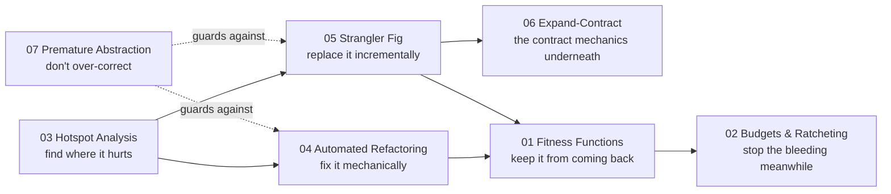

# Anti-Patterns at Scale

> *"You can't refactor your way out of a problem you can't see — and you can't keep a fix that nothing enforces."*

The earlier chapters in this roadmap teach you to **recognize** an anti-pattern in a file and **refactor** it away. This chapter starts where that one ends: **managing anti-patterns across an entire codebase and over time.**

It is the staff / principal-level view. Less *"how do I fix this God Object"* and more *"why does our codebase keep growing God Objects, which of the hundred smells actually costs us money, and how do I remove one across 300 files without a flag day?"*

Everything here is **codebase-grounded** — a rule you can run in CI, a transform you can apply to the source, an analysis over git history. The organizational and people-level dimensions of the same problems (Conway's law, team boundaries, tech-debt as a budgeting conversation) are real and important, but they live in the [Architecture](../../../../Architecture/anti-patterns/README.md) and Soft-Skills roadmaps, not here.

> **The shift:** at junior/senior level you act on the code you can see. At scale you act on the **system that produces the code** — the CI gate that makes the bad shape impossible, the metric that tells you which shape to fix first, the migration that replaces it safely while the system keeps serving traffic.

---

## The Seven Topics

| # | Topic | The staff-level question it answers | Key tools |
|---|---|---|---|
| 01 | **[Architecture Fitness Functions](01-architecture-fitness-functions/junior.md)** | "How do I make the bad shape *fail the build*?" | ArchUnit, import-linter, dependency-cruiser, madge |
| 02 | **[Anti-Pattern Budgets & Ratcheting](02-anti-pattern-budgets-and-ratcheting/junior.md)** | "How do I stop it getting worse *while* I clean up?" | betterer, ESLint `--max-warnings`, SonarQube new-code gate |
| 03 | **[Hotspot Analysis](03-hotspot-analysis/junior.md)** | "Of a thousand smells, *which one* actually hurts?" | git-log mining, code-maat, churn × complexity |
| 04 | **[Automated Large-Scale Refactoring](04-automated-large-scale-refactoring/junior.md)** | "How do I fix the same thing in 300 files *safely*?" | OpenRewrite, jscodeshift, Comby, Semgrep, `gofmt -r` |
| 05 | **[Strangler Fig & Seams](05-strangler-fig-and-seams/junior.md)** | "How do I replace it *without* a rewrite or a flag day?" | branch by abstraction, seams, characterization tests |
| 06 | **[Expand-Contract Refactors](06-expand-contract-refactors/junior.md)** | "How do I change a contract nothing can change atomically?" | parallel change, deprecation, dual-write / dual-read |
| 07 | **[Premature Abstraction at Scale](07-premature-abstraction-at-scale/junior.md)** | "When is the *clean* abstraction the actual anti-pattern?" | rule of three, AHA, inline-the-wrong-abstraction |

---

## How the Topics Connect

These are not seven isolated tricks — they form a loop you run on a real codebase:

- **Hotspots** tell you *where* to spend effort (don't refactor the file nobody touches).
- **Automated refactoring** and **strangler fig** are the two ways to actually remove it — mechanical for the regular, incremental for the entangled.
- **Expand-contract** is the contract-evolution dance that makes incremental replacement safe.
- **Fitness functions** keep the fixed shape fixed; **budgets/ratcheting** stop new instances while the cleanup is in flight.
- **Premature abstraction** is the cautionary topic — the over-correction where you "fix" duplication with the wrong abstraction and create a worse problem.

---

## What This Chapter Is *Not*

- **Not architecture anti-patterns.** Big Ball of Mud, Distributed Monolith, Vendor Lock-In and friends are system-level — see [Architecture → Anti-Patterns](../../../../Architecture/anti-patterns/README.md).
- **Not process / management anti-patterns.** Death March, Mushroom Management, Analysis Paralysis live with Soft-Skills material.
- **Not a substitute for the fix itself.** Knowing *which* God Object to kill (hotspots) and *how* to keep it dead (fitness functions) does not replace knowing how to refactor one — that is the rest of [this roadmap](../README.md).

---

## File Suite

Each topic ships the standard **8-file suite**, same convention as the rest of the roadmap:

| File | Focus | Audience |
|---|---|---|
| `junior.md` | "What is it? Why does it matter?" | First exposure |
| `middle.md` | "When do I reach for it? How do I apply it?" | 1–3 yr |
| `senior.md` | "How do I do this across a real codebase?" | 3–7 yr |
| `professional.md` | Cost, correctness, scale, when it backfires | 7+ yr / specialist |
| `interview.md` | 30+ Q&A | Job preparation |
| `tasks.md` | Hands-on exercises with solutions | Practice |
| `find-bug.md` | A flawed application of the technique — spot it | Critical reading |
| `optimize.md` | Make a slow / unsafe implementation fast & safe | Cleanup practice |

**Recommended order:** `junior.md` → `middle.md` → `senior.md` → `professional.md` → practice files → `interview.md` for review.

Code examples are written in **Go**, **Java**, and **Python**, matching the rest of [Code Craft](../../README.md).

---

## Prerequisites

You should already be comfortable with the earlier anti-pattern chapters ([Development](../01-development/README.md), [Design](../02-design/README.md)) and with **git**, **CI**, and at least one **build system** — every topic here turns a refactoring instinct into something a machine enforces, measures, or applies.

---

## Further Reading

- **Building Evolutionary Architectures** — Ford, Parsons, Kua (2nd ed., 2022) — fitness functions as the spine of an architecture that's allowed to change.
- **Your Code as a Crime Scene** / **Software Design X-Rays** — Adam Tornhill (2015 / 2018) — hotspots, change coupling, mining git history.
- **Refactoring** — Martin Fowler (2nd ed., 2018) — Strangler Fig, Branch by Abstraction, Parallel Change.
- **Working Effectively with Legacy Code** — Michael Feathers (2004) — seams and characterization tests, the foundation of safe incremental change.
- **99 Bottles of OOP** — Sandi Metz & Katrina Owen (2nd ed., 2020) — "the wrong abstraction," and why duplication is sometimes the cheaper bet.

---

## Related Roadmaps

- [Anti-Patterns (this roadmap)](../README.md) — the in-the-file anti-patterns this chapter helps you manage at scale.
- [Refactoring](../../refactoring/README.md) — the techniques these topics automate, prioritize, and enforce.
- [Architecture → Anti-Patterns](../../../../Architecture/anti-patterns/README.md) — the system-level siblings.
