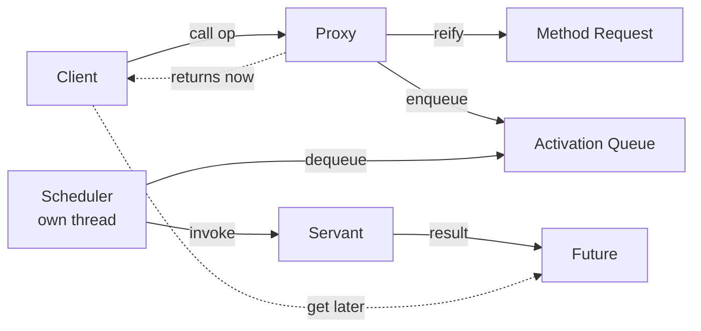
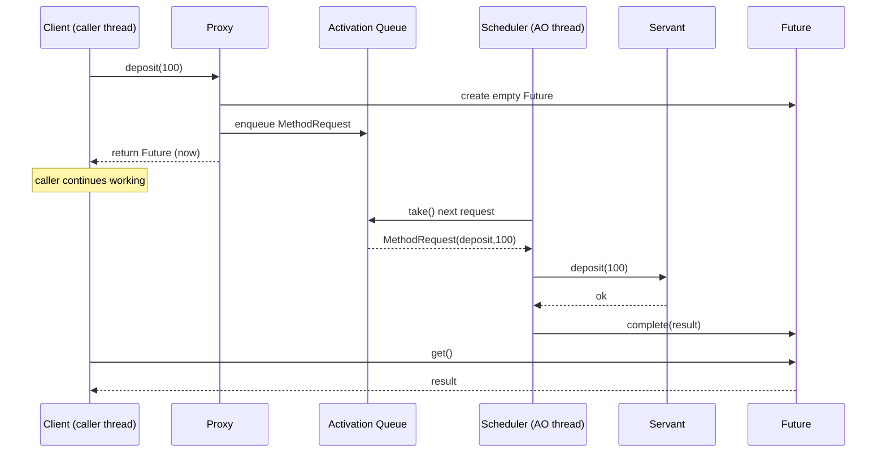
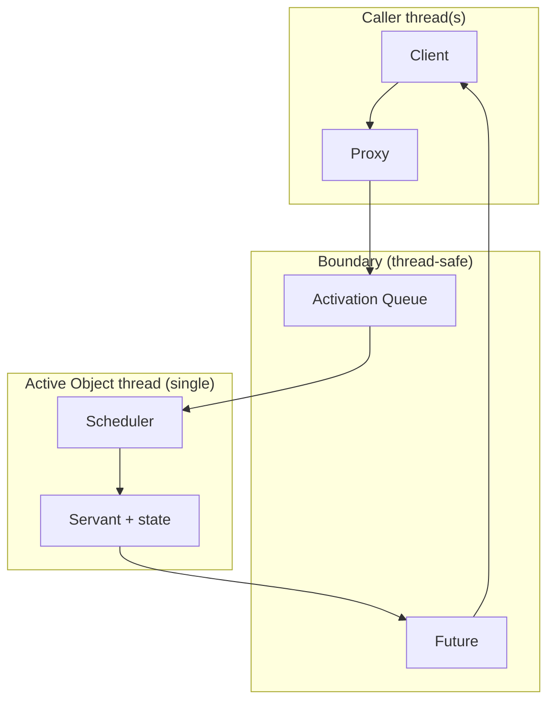
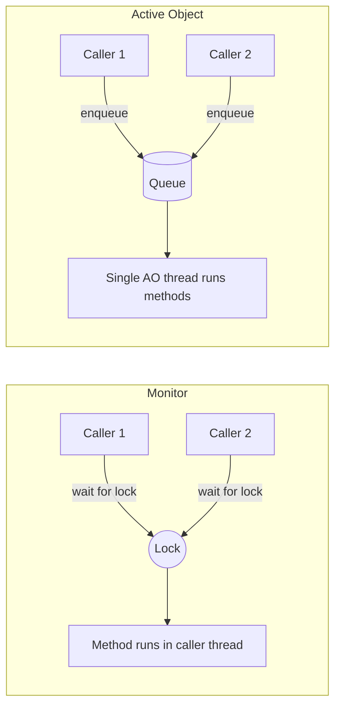

# Active Object — Junior Level

> **Source:** POSA2 — *Pattern-Oriented Software Architecture, Vol. 2* (Schmidt et al.) · Doug Lea, *Concurrent Programming in Java*
> **Category:** [Concurrency](../README.md) — *"Patterns for coordinating work across threads, cores, and machines."*

## Table of Contents

1. [Introduction](#introduction)
2. [Prerequisites](#prerequisites)
3. [Glossary](#glossary)
4. [Core Concepts](#core-concepts)
5. [Real-World Analogies](#real-world-analogies)
6. [Mental Models](#mental-models)
7. [Pros & Cons](#pros--cons)
8. [Use Cases](#use-cases)
9. [Code Examples](#code-examples)
10. [Coding Patterns](#coding-patterns)
11. [Clean Code](#clean-code)
12. [Best Practices](#best-practices)
13. [Edge Cases & Pitfalls](#edge-cases--pitfalls)
14. [Common Mistakes](#common-mistakes)
15. [Tricky Points](#tricky-points)
16. [Test Yourself](#test-yourself)
17. [Tricky Questions](#tricky-questions)
18. [Cheat Sheet](#cheat-sheet)
19. [Summary](#summary)
20. [What You Can Build](#what-you-can-build)
21. [Further Reading](#further-reading)
22. [Related Topics](#related-topics)
23. [Diagrams & Visual Aids](#diagrams--visual-aids)

---

## Introduction

Imagine you call a method on an object. Normally, *your* thread runs that method's
code, start to finish, before the call returns. If the method takes 200 ms, your
thread is stuck for 200 ms. If two threads call it at once, they collide over the
object's fields and you reach for locks.

**Active Object** breaks that assumption. It **decouples method *invocation* from
method *execution***. When you call a method, you don't run its body. Instead, the
call is packaged into a small object — a *Method Request* — and dropped into a
queue. A separate thread, owned by the object, pulls requests off the queue one at
a time and runs them. Your call returns almost immediately, handing you a
*Future* — a placeholder for the result that will arrive later.

The consequences are large and pleasant:

- The object has **one thread of its own**. Because only that thread ever touches
  the object's state, you need *no locks* on that state. The queue is the only
  synchronized handoff.
- **Callers never block on each other.** Ten threads can call the same Active
  Object concurrently; each just enqueues and walks away. They serialize on the
  *queue*, not on the *work*.
- **Invocation is asynchronous.** A slow operation no longer freezes the caller.

This is one of the oldest and most influential concurrency patterns. You already
use it without knowing: an actor's *mailbox* (Akka, Erlang's `gen_server`),
Android's `HandlerThread`/`Looper`, and a `SingleThreadExecutor` placed in front
of a stateful object are all Active Objects.

This page builds the pattern from zero with runnable Java, the six participants,
and the traps that bite first-timers.

---

## Prerequisites

You'll get the most from this page if you're comfortable with:

- **Threads and `Runnable`.** What it means to start a thread and have it run a
  loop.
- **Java basics.** Generics (`Future<T>`), interfaces, anonymous classes or
  lambdas.
- **The idea of a queue.** FIFO: first in, first out.
- **Why shared mutable state is dangerous.** Two threads writing the same field
  without coordination corrupts it (a *data race*).

If "data race" is fuzzy, here is the one-sentence version: when two threads access
the same memory and at least one writes, with no synchronization between them, the
result is undefined — you can read half-written values or values that never appear
in any sane interleaving. Active Object's whole appeal is that it makes data races
*structurally impossible* for the servant's state.

You do **not** need to know `synchronized`, `volatile`, or the Java Memory Model in
depth yet. Those arrive at the [middle](middle.md) and
[professional](professional.md) levels.

---

## Glossary

| Term | Meaning |
|---|---|
| **Active Object** | An object whose methods run in *its own* thread, not the caller's. |
| **Passive object** | A normal object; its methods run in whatever thread called them. |
| **Proxy** | The public face clients call. Looks like a normal API; secretly enqueues. |
| **Method Request** | A reified (objectified) method call: which operation, plus its arguments. |
| **Activation List / Queue** | The thread-safe queue holding pending Method Requests. |
| **Scheduler** | The loop running in the Active Object's thread; dequeues and dispatches requests. |
| **Servant** | The plain object that holds state and does the real work. |
| **Future** | A placeholder handed back at enqueue time; later holds the result. |
| **Guard / synchronization constraint** | A condition that must hold before a request may run (e.g. "buffer not full"). |
| **Reify** | To turn an action (a method call) into a first-class object you can store and pass around. |
| **Backpressure** | Slowing or rejecting producers when the queue can't keep up. |

---

## Core Concepts

### The one idea

> A client invokes an operation; the operation *executes later, on a different
> thread, serialized with all other operations on the same object*.

Everything else is mechanism to make that idea safe and ergonomic.

### The six participants

POSA2 names six roles. In real code, several often collapse into one class, but
keeping them distinct first is the fastest way to understand the pattern.



1. **Proxy** — what clients see. Exposes the same method signatures as the servant,
   but each method *builds a Method Request, enqueues it, and returns a Future*.
   The proxy lives in the *caller's* thread.

2. **Method Request** — a small object capturing one call: the operation to run and
   its arguments. Often it also carries the Future to fill in, and a *guard* that
   says whether it's allowed to run yet.

3. **Activation List / Queue** — a thread-safe queue. Producers (any caller thread)
   enqueue; one consumer (the scheduler) dequeues. This is the *only* place
   cross-thread synchronization happens.

4. **Scheduler** — runs in the Active Object's own dedicated thread. Its loop:
   take the next runnable request, invoke it on the servant, repeat. It may honor
   guards (skip/defer requests whose precondition is false).

5. **Servant** — the boring, single-threaded object that actually implements the
   behavior and holds the state. Because *only the scheduler thread* ever calls it,
   it needs no synchronization.

6. **Future** — returned to the caller immediately. Starts empty; the scheduler
   fills it when the servant produces a result. The caller reads it via `get()`
   (which blocks until ready) or registers a callback.

### The lifecycle of one call

```
caller thread                          active-object thread
-------------                          --------------------
proxy.deposit(100)
  └─ build MethodRequest(deposit,100)
  └─ create empty Future<Void>
  └─ enqueue request           ──────►  scheduler.take() returns it
  └─ return Future immediately           servant.deposit(100)  // runs here
        (caller continues)               future.complete(null)
                                         loop: take() next...
caller: future.get()  // blocks
        → returns when complete
```

Notice the two threads share exactly one thing safely: the queue. The servant's
balance field is touched only by the right-hand column.

### Active Object vs Monitor Object (the key contrast)

These two patterns solve the same problem — safe concurrent access to a stateful
object — in opposite ways. Learn them as a pair.

| | **Monitor Object** | **Active Object** |
|---|---|---|
| Where the method runs | In the **caller's** thread | In the object's **own** thread |
| Coordination | A **lock** the callers contend for | A **queue** callers hand off to |
| Caller blocking | Callers block while another holds the lock | Callers never block on each other; they enqueue and leave |
| Invocation style | Synchronous | Asynchronous (returns a Future) |
| State protection | `synchronized` / mutex | Single-threaded servant (no locks) |

A Monitor Object is a guarded *room* one caller enters at a time. An Active Object
is a *clerk* who takes your request slip and serves everyone from one window.

---

## Real-World Analogies

**The coffee shop counter.** You don't make your own latte. You place an order
(method request), it goes on the barista's queue, and you get a buzzer (future).
You're free to sit down. One barista (single thread) serves the queue in order, so
two customers never fight over the espresso machine (shared state). When your
buzzer goes off, you collect the result.

**The restaurant kitchen ticket rail.** Servers (callers, many threads) clip
tickets (method requests) onto the rail (activation queue). The line cook (the
servant, one thread) works tickets in order. Servers don't cook; they just submit
and move on.

**The office mailroom.** You drop a letter in the outbox (enqueue). The mail clerk
(scheduler thread) processes the outbox sequentially. You don't wait by the box —
you go back to work and check later for a reply (future).

**Drive-through with one window.** Cars (callers) arrive in parallel but the order
window (queue) serializes them. One kitchen (servant) fulfills. If too many cars
arrive, the lane backs up onto the street — that's an *unbounded queue* problem,
and why real drive-throughs cap the lane length (*backpressure*).

---

## Mental Models

**Model 1 — "Mail a request, get a tracking number."** Calling an Active Object is
like mailing a package: you hand it off (enqueue), receive a tracking number
(future), and continue your day. The package is delivered (executed) by someone
else, later.

**Model 2 — "One desk, one worker, an inbox."** The servant is a desk with private
papers. Exactly one worker sits at it. Everyone else slides requests into the inbox
(queue). Because only one worker touches the desk, the papers never get scrambled —
no locks needed.

**Model 3 — "Serialize work, not callers."** Locks serialize *callers* (they wait
their turn to enter). Active Object serializes *work* (the single thread does jobs
one by one) while letting callers run free. The serialization moves from the entry
door to the worklist.

**Model 4 — "A method call you can hold in your hand."** Normally a method call is
an event that happens and is gone. Active Object *reifies* it into a Method Request
object — now you can store it, queue it, reorder it, log it, or drop it.

---

## Pros & Cons

### Pros

| Benefit | Why it matters |
|---|---|
| **No locks on servant state** | Single-threaded servant = no data races, no deadlocks *inside* the object. |
| **Callers don't block each other** | High caller concurrency; submit-and-continue. |
| **Asynchronous by construction** | Slow operations don't freeze callers. |
| **Natural ordering** | A FIFO queue gives predictable, sequential execution. |
| **Requests are objects** | Can be logged, prioritized, retried, persisted, scheduled. |
| **Clear boundary** | All concurrency lives at the queue; the servant stays simple. |

### Cons

| Cost | Why it hurts |
|---|---|
| **Queue can grow unbounded** | Producers faster than the one consumer → memory blows up. |
| **Single thread is a throughput ceiling** | One servant thread can't use many cores for *one* object. |
| **Latency overhead** | Enqueue/dequeue/context-switch adds cost per call. |
| **Complexity** | Six participants vs a `synchronized` method. |
| **Future misuse** | A blocking `future.get()` right after the call re-serializes everything. |
| **Shutdown is tricky** | You must drain or reject pending requests cleanly. |

The single most important con to internalize as a junior: **an unbounded queue is a
memory leak waiting to happen.** Always think about what stops producers when the
consumer falls behind.

---

## Use Cases

- **A stateful service touched by many threads.** A bank account, a session
  manager, an in-memory counter, a connection registry — wrap it as an Active
  Object and the concurrency problem disappears.
- **GUI / UI event loops.** Only the UI thread may touch widgets. Background
  threads post work to it. Android's `Handler`/`Looper` is exactly this.
- **Serializing access to a non-thread-safe library.** Many C libraries or
  hardware drivers must be called from one thread. Front them with an Active
  Object.
- **The actor model.** Each actor is an Active Object: a mailbox (queue), a private
  state (servant), and a single thread of execution that processes messages in
  order.
- **Rate-limited or ordered external calls.** When calls to a downstream system
  must be sequential or paced, the queue gives you a natural choke point.

---

## Code Examples

### A bank account as an Active Object (Java)

We'll start by spelling out all six participants, then show the idiomatic compact
version.

#### Step 1 — The Servant (plain, single-threaded, no locks)

```java
// The Servant does the real work. It is NOT thread-safe and does not need to be:
// only the scheduler thread ever calls it.
final class AccountServant {
    private long balanceCents = 0;

    void deposit(long cents) {
        balanceCents += cents;            // safe: one thread only
    }

    boolean withdraw(long cents) {
        if (balanceCents < cents) return false;
        balanceCents -= cents;
        return true;
    }

    long balance() {
        return balanceCents;
    }
}
```

#### Step 2 — Method Request, Queue, Scheduler, Proxy, Future

In modern Java we get the queue, the scheduler thread, and the Future "for free"
from `java.util.concurrent`. A **`SingleThreadExecutor`** *is* an activation queue
plus a scheduler running on one dedicated thread. A submitted `Callable`/`Runnable`
*is* the reified Method Request. `submit` returns a `Future`.

```java
import java.util.concurrent.*;

// The Proxy: clients see normal-looking methods that return Futures.
public final class Account {
    private final AccountServant servant = new AccountServant();

    // The activation queue + scheduler thread, bundled into one executor.
    private final ExecutorService scheduler =
            Executors.newSingleThreadExecutor(r -> {
                Thread t = new Thread(r, "account-active-object");
                t.setDaemon(true);
                return t;
            });

    // deposit(): reify the call as a task, enqueue it, return a Future.
    public Future<Void> deposit(long cents) {
        return scheduler.submit(() -> {       // runs on the active-object thread
            servant.deposit(cents);
            return null;
        });
    }

    public Future<Boolean> withdraw(long cents) {
        return scheduler.submit(() -> servant.withdraw(cents));
    }

    public Future<Long> balance() {
        return scheduler.submit(servant::balance);
    }

    public void shutdown() {
        scheduler.shutdown();                 // stop accepting; drain existing
    }
}
```

#### Step 3 — Using it from many threads, with no locks anywhere

```java
public static void main(String[] args) throws Exception {
    Account account = new Account();

    // 100 threads hammering the same account — and yet no data race,
    // because every operation runs on the single account thread.
    var pool = Executors.newFixedThreadPool(100);
    var dones = new ArrayList<Future<?>>();
    for (int i = 0; i < 1000; i++) {
        dones.add(pool.submit(() -> account.deposit(100)));
    }
    for (Future<?> d : dones) d.get();        // wait for all submissions
    pool.shutdown();

    System.out.println("Balance = " + account.balance().get()); // 100000
    account.shutdown();
}
```

The balance is *always* exactly `100000`. No `synchronized`, no `AtomicLong`, no
lost updates — because the servant runs on one thread.

### The same idea in Go

Go's idiomatic Active Object is a goroutine that owns state and is fed by a
channel. The channel is the activation queue; the goroutine is the scheduler +
servant; a reply channel is the future.

```go
package main

import "fmt"

// A request is the reified method call. The reply channel is its future.
type depositReq struct {
    cents int64
    reply chan int64 // new balance
}

type Account struct {
    deposits chan depositReq
}

func NewAccount() *Account {
    a := &Account{deposits: make(chan depositReq, 64)} // bounded queue
    go a.loop()                                         // the active-object thread
    return a
}

// loop owns the balance: no other goroutine touches it, so no mutex needed.
func (a *Account) loop() {
    var balance int64
    for req := range a.deposits {
        balance += req.cents
        req.reply <- balance
    }
}

// Deposit is the proxy: build a request, enqueue, return the future (reply chan).
func (a *Account) Deposit(cents int64) <-chan int64 {
    reply := make(chan int64, 1)
    a.deposits <- depositReq{cents: cents, reply: reply}
    return reply
}

func main() {
    a := NewAccount()
    fmt.Println(<-a.Deposit(100)) // 100
    fmt.Println(<-a.Deposit(50))  // 150
}
```

---

## Coding Patterns

**Pattern: Executor-as-Active-Object.** The dominant modern Java idiom. One
`Executors.newSingleThreadExecutor()` per stateful object. Submit lambdas;
they're your Method Requests. `submit` gives you the Future. Don't hand-roll a
queue and thread unless you need custom guard logic.

**Pattern: Name the thread.** Use a `ThreadFactory` to give the active-object
thread a descriptive name (`"account-active-object"`). It makes thread dumps and
profiler output readable.

**Pattern: Servant stays oblivious.** The servant should not know it lives inside
an Active Object. It's a plain class with plain methods. This keeps it unit-testable
in isolation and lets you reuse it elsewhere.

**Pattern: Return `Future`, not `void`, even for mutators.** A `Future<Void>` lets
callers wait for completion or detect failure if they need to — without forcing
them to.

**Pattern: Bound the queue.** Prefer a bounded `BlockingQueue` (or a bounded-queue
executor) so a runaway producer is blocked or rejected instead of exhausting memory.

---

## Clean Code

- **Keep the proxy thin.** A proxy method should do three things: build the request,
  enqueue it, return the future. No business logic — that belongs in the servant.
- **One responsibility per participant.** Proxy = adapt + enqueue. Scheduler =
  loop + dispatch. Servant = behavior + state. Future = result handoff. Don't
  blur them.
- **Name the future-returning methods honestly.** `Future<Long> balance()` reads
  fine. If you want a synchronous-looking API, wrap the `get()` in a clearly named
  `balanceNow()` — and document that it blocks.
- **Make the servant `final` and its fields `private`.** Nothing outside the
  scheduler thread should reach in.
- **Centralize shutdown.** One `shutdown()` method on the proxy; don't leak the
  executor.

---

## Best Practices

1. **Always bound the activation queue.** Decide what happens on overflow: block
   the producer, reject the request, or drop. Never "let it grow."
2. **Never call `future.get()` on the active-object thread.** That's a self-wait —
   the thread that must complete the future is the one blocking on it. Instant
   deadlock.
3. **Keep servant methods short.** A long-running request stalls *every* queued
   request behind it (head-of-line blocking). Break big jobs up or offload.
4. **Make the active-object thread a daemon** (or shut it down explicitly) so it
   doesn't keep the JVM alive.
5. **Don't share the servant.** If anything outside the Active Object holds a
   reference to the servant and calls it directly, the single-thread guarantee is
   broken and you're back to data races.
6. **Prefer composition over inheritance** for the proxy/servant split; it keeps
   the servant reusable and testable.

---

## Edge Cases & Pitfalls

**Unbounded queue → OutOfMemoryError.** The classic. Producers outpace the single
consumer; the queue grows without limit until the heap is exhausted. Always bound.

**Blocking `get()` immediately after the call.** Writing
`account.deposit(100).get()` everywhere makes the pattern *synchronous* again — you
lose the "callers don't block" benefit and pay the queue overhead for nothing.

**Head-of-line blocking.** One slow request (say, a 5-second I/O call) holds up
every request behind it because there's only one consumer thread.

**Shutdown while requests pending.** If you `shutdownNow()`, queued requests are
dropped and their futures never complete — callers waiting on `get()` hang forever
(or you must cancel them).

**Servant leaking `this`.** If a servant method passes `this` to outside code that
calls it later from another thread, the single-thread guarantee evaporates.

**Forgetting the future is empty at first.** The future returned at enqueue time is
*not* the result. Reading it without `get()` (e.g. logging the Future object)
shows a pending placeholder, not a value.

---

## Common Mistakes

| Mistake | Consequence | Fix |
|---|---|---|
| Unbounded queue | OOM under load | Use a bounded queue + backpressure |
| `get()` on the AO thread | Deadlock | Never block the servant thread on its own future |
| `get()` right after every call | Synchronous again, slower | Batch the `get()`s; or use callbacks |
| Sharing the servant directly | Data races return | Encapsulate; only the proxy reaches the servant |
| Long servant methods | Head-of-line blocking | Keep requests small; offload I/O |
| Catching nothing in the request | Exception kills the loop or hides | Capture exceptions into the future |
| Forgetting shutdown | JVM won't exit / thread leak | Daemon thread + explicit `shutdown()` |

---

## Tricky Points

- **The proxy runs in the caller's thread; the servant runs in the AO thread.**
  They are different threads. The only object that crosses the boundary safely is
  the queue entry (and the future).
- **The future is the *only* synchronized way to read a result.** Don't try to read
  a servant field from the caller's thread to "peek" at the answer — that's a data
  race.
- **Order is FIFO by default, but only per-queue.** If you have multiple proxies
  feeding multiple queues, there's no global order.
- **A `SingleThreadExecutor` already gives happens-before guarantees** between a
  submitted task and code that observes its future — the library handles the memory
  visibility for you. (More on this at the [professional](professional.md) level.)
- **Exceptions in a task are captured into the future**, not thrown on the AO
  thread — `future.get()` rethrows them wrapped in `ExecutionException`. If you use
  raw `execute(Runnable)`, an uncaught exception can kill the worker thread.

---

## Test Yourself

1. In one sentence, what does Active Object decouple?
2. Which of the six participants runs in the caller's thread, and which runs in the
   Active Object's own thread?
3. Why does the servant need no locks?
4. What does the proxy return immediately, before the work is done?
5. Name the single most dangerous default to avoid in the activation queue.
6. Why is calling `future.get()` on the Active Object's *own* thread a bug?
7. How is Active Object different from Monitor Object in *where the method runs*?
8. What modern Java class gives you "queue + scheduler + thread" in one?

<details>
<summary>Answers</summary>

1. Method *invocation* from method *execution*.
2. The **Proxy** runs in the caller's thread; the **Scheduler** and **Servant**
   run in the Active Object's own thread.
3. Because only one thread (the scheduler) ever touches its state — no concurrent
   access, so no data race.
4. A **Future** (an empty placeholder for the eventual result).
5. An **unbounded** queue (causes OOM under load). Bound it.
6. The thread that must *complete* the future is the same thread *blocking* on it —
   it can never make progress: deadlock.
7. Monitor Object runs the method in the *caller's* thread under a lock; Active
   Object runs it in the *object's own* thread.
8. `Executors.newSingleThreadExecutor()`.

</details>

---

## Tricky Questions

1. **If callers "don't block on each other," do they ever block at all?**
   Yes — a caller blocks if it chooses to call `future.get()` and the result isn't
   ready, or if the queue is bounded and full (then `enqueue` blocks). What they
   *don't* do is block waiting for *another caller's* operation to finish, the way
   they would contending for a lock.

2. **Two deposits and a withdraw arrive "at the same time." What's the order?**
   Whatever order they hit the queue. The single thread then runs them strictly
   one at a time in FIFO order. There is no interleaving *within* the servant.

3. **Is an Active Object faster than a `synchronized` object?**
   Not for raw throughput on a single hot object — you've added queue and
   context-switch overhead. It wins on *caller responsiveness* and *simplicity of
   the servant*, not microbenchmark speed. See [optimize.md](optimize.md).

4. **What happens to in-flight futures when I shut down?**
   With `shutdown()`, already-queued tasks complete and their futures resolve; new
   submissions are rejected. With `shutdownNow()`, queued tasks are dropped and
   their futures never complete — you must cancel or callers will hang.

---

## Cheat Sheet

```
INTENT   Decouple method invocation from method execution.
HOW      Call → reified as Method Request → Activation Queue → Scheduler
         (own thread) → Servant → result via Future.

SIX PARTICIPANTS
  Proxy            caller-side API; enqueues, returns Future
  Method Request   the reified call (op + args + future + guard)
  Activation Queue thread-safe FIFO of requests
  Scheduler        loop in the AO's own thread; dequeues & dispatches
  Servant          plain, single-threaded state + behavior (no locks)
  Future           placeholder for the result

JAVA SHORTCUT
  Executors.newSingleThreadExecutor()  // = queue + scheduler + thread
  submit(callable) -> Future           // = reify + enqueue + future

VS MONITOR OBJECT
  Monitor: runs in caller's thread, under a lock, callers block.
  Active : runs in its own thread, via a queue, callers don't block each other.

GOLDEN RULES
  ✓ Bound the queue (backpressure)
  ✓ Keep servant methods short
  ✗ Never future.get() on the AO thread
  ✗ Never share the servant directly
```

---

## Summary

- **Active Object decouples invocation from execution.** You call; the work runs
  later, on the object's own thread.
- **Six participants:** Proxy, Method Request, Activation Queue, Scheduler,
  Servant, Future. In Java a `SingleThreadExecutor` collapses queue + scheduler +
  thread; `submit` collapses reify + enqueue + future.
- **The payoff:** the servant is single-threaded, so it needs *no locks*; callers
  hand off and continue without blocking on each other.
- **The price:** queue management (bound it!), single-thread throughput ceiling,
  per-call latency, and the discipline of using futures correctly.
- **Contrast with Monitor Object:** same goal, opposite mechanism — caller's thread
  + lock vs own thread + queue.

---

## What You Can Build

- A **thread-safe in-memory counter / metrics store** with no locks.
- A **bank account or wallet service** that 1000 threads can hit safely.
- A **logging service** that serializes writes to one file from many producers.
- A **tiny actor** — mailbox + state + loop — and a chat of two actors messaging
  each other.
- A **UI-thread dispatcher** that lets background work safely update a single-
  threaded UI model.

---

## Further Reading

- **POSA2 — *Pattern-Oriented Software Architecture, Vol. 2*** (Schmidt, Stal,
  Rohnert, Buschmann), the Active Object chapter — the canonical description of the
  six participants.
- **Doug Lea, *Concurrent Programming in Java*** — the executor/idiom view.
- **`java.util.concurrent` Javadoc** — `ExecutorService`, `Future`,
  `BlockingQueue`.
- **Akka and Erlang `gen_server` docs** — Active Object realized as the actor
  model.

---

## Related Topics

- [Monitor Object](../02-monitor-object/junior.md) — the lock-based sibling; learn
  the two together.
- [Thread Pool](../05-thread-pool/junior.md) — the scheduler generalized to many
  worker threads.
- [Producer–Consumer](../06-producer-consumer/junior.md) — the queue handoff at the
  heart of Active Object.
- [Future / Promise](../07-future-promise/junior.md) — the result-handoff
  participant, in depth.
- [Half-Sync/Half-Async](../08-half-sync-half-async/junior.md) — layering sync and
  async tiers across a queue.

---

## Diagrams & Visual Aids

### The full collaboration



### Where each participant lives



### Active Object vs Monitor Object at a glance


