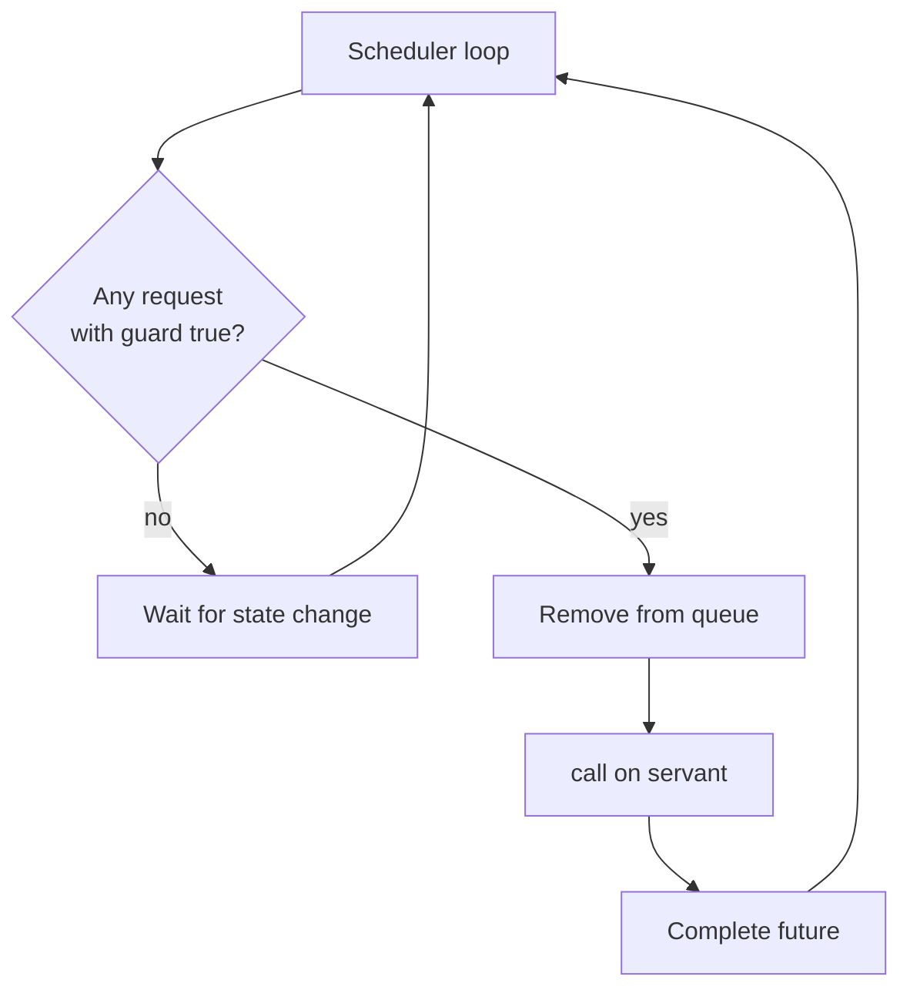
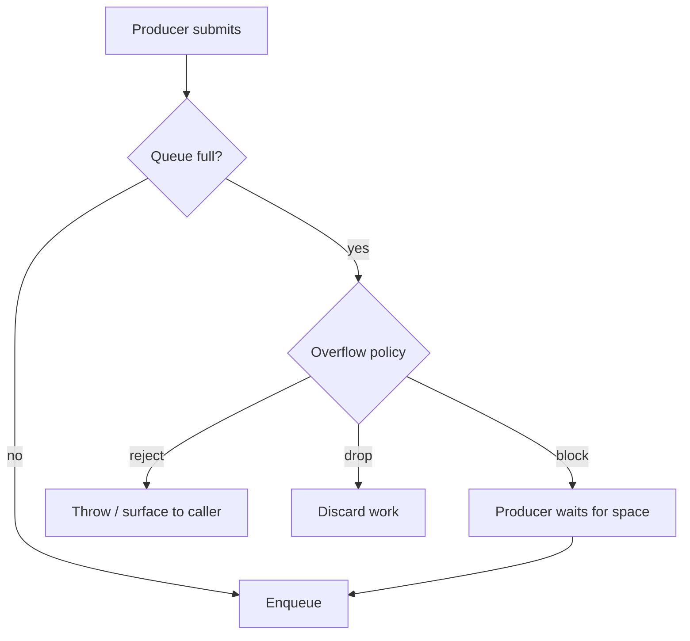
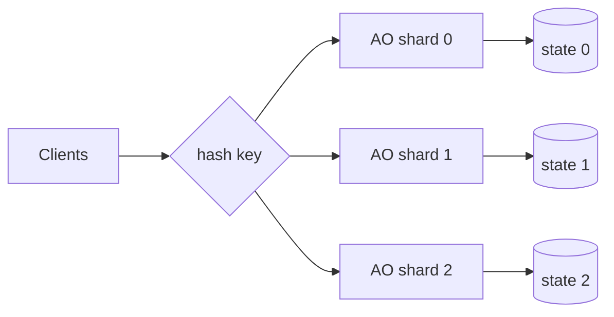

# Active Object — Middle Level

> **Source:** POSA2 — *Pattern-Oriented Software Architecture, Vol. 2* (Schmidt et al.) · Doug Lea, *Concurrent Programming in Java*
> **Prerequisite:** [Junior](junior.md)

## Table of Contents

1. [Introduction](#introduction)
2. [When to Use Active Object](#when-to-use-active-object)
3. [When NOT to Use Active Object](#when-not-to-use-active-object)
4. [Real-World Cases](#real-world-cases)
5. [Code Examples — Production-Grade](#code-examples--production-grade)
6. [Deep Dive: Method Requests, Guards & the Scheduler](#deep-dive-method-requests-guards--the-scheduler)
7. [Deep Dive: Bounded Queues & Backpressure](#deep-dive-bounded-queues--backpressure)
8. [Deep Dive: Futures, Composition & Error Propagation](#deep-dive-futures-composition--error-propagation)
9. [Trade-offs](#trade-offs)
10. [Alternatives Comparison](#alternatives-comparison)
11. [Refactoring to Active Object](#refactoring-to-active-object)
12. [Pros & Cons (Deeper)](#pros--cons-deeper)
13. [Edge Cases](#edge-cases)
14. [Tricky Points](#tricky-points)
15. [Best Practices](#best-practices)
16. [Tasks (Practice)](#tasks-practice)
17. [Summary](#summary)
18. [Related Topics](#related-topics)
19. [Diagrams](#diagrams)

---

## Introduction

At the junior level you saw the mechanism: call → reify → enqueue → single thread →
servant → future. At this level we turn it into something you'd ship. That means
confronting the parts the toy version hand-waved:

- The activation queue must be **bounded**, and you must *choose* an overflow
  policy. This is the difference between a robust service and a memory bomb.
- Method Requests sometimes can't run *yet* — a bounded buffer can't accept a `put`
  while full. That's a **guard** (synchronization constraint), and honoring guards
  is the scheduler's real job, not just FIFO dequeuing.
- Futures need **composition and error propagation**, or callers degenerate into a
  forest of blocking `get()` calls.
- You need a **clean shutdown** that drains in-flight work and resolves or cancels
  pending futures.

We'll also place Active Object precisely against its alternatives — `synchronized`,
`ConcurrentHashMap`, actors, and a plain thread pool — so you know *when* to reach
for it and, just as important, when not to.

---

## When to Use Active Object

Use Active Object when **all or most** of these hold:

- **You have a stateful object that many threads must use.** The state is the
  reason; if it were stateless you'd just use a thread pool.
- **The state is mutated, not just read.** Read-mostly state is better served by
  immutable snapshots or a `ReadWriteLock`.
- **You want callers to stay responsive.** Submit-and-continue beats block-and-wait
  for latency-sensitive callers (UI threads, request handlers).
- **Sequential, ordered execution is acceptable or desirable.** If operations
  *must* be serialized (e.g. a ledger, an append-only log), the single thread is a
  feature, not a limitation.
- **You can tolerate the throughput ceiling of one thread per object.** If one
  object's operations are cheap and the object isn't a global bottleneck, fine.
- **You want to keep concurrency out of the domain logic.** The servant stays a
  plain, lock-free, unit-testable class.

A crisp heuristic: *"Many threads, one mutable thing, and I'd rather queue than
lock."*

---

## When NOT to Use Active Object

- **The operation is read-only and hot.** A single serializing thread turns
  parallel reads into a line. Use immutable data, `ConcurrentHashMap`, or a
  `StampedLock` optimistic read.
- **You need to scale one object across cores.** One Active Object = one thread =
  one core for that object's work. If a *single* object is your bottleneck, sharding
  it (many Active Objects, each owning a partition) or a different design is needed.
- **The operation is trivial and uncontended.** Wrapping `counter++` in a queue +
  thread + future is wildly over-engineered; an `AtomicLong` or even a
  `synchronized` block is simpler and faster.
- **Strict low latency per call is required and the queue adds too much.** Enqueue,
  context switch, and dequeue cost microseconds; for nanosecond-budget paths that's
  too much.
- **Callers genuinely need the result before continuing every time.** If every call
  is immediately `.get()`-ed, you've paid for asynchrony you never use — a Monitor
  Object is simpler.

> Rule of thumb: Active Object shines for **stateful, write-heavy, many-caller**
> objects where sequential execution is acceptable. It is a poor fit for
> **read-heavy, embarrassingly parallel, or nanosecond-latency** work.

---

## Real-World Cases

**Android `HandlerThread` / `Looper`.** A `Looper` owns a `MessageQueue`; a
`Handler` posts `Message`/`Runnable` (method requests) to it; the looper thread
(scheduler) processes them in order against UI/state (servant). This is Active
Object, shipped to billions of devices.

**Akka / actor frameworks.** Each actor has a *mailbox* (bounded activation queue),
processes one message at a time on a dispatcher thread, and mutates private state
with no locks. `ask` returns a `Future`. The actor model *is* Active Object plus
location transparency and supervision.

**A `SingleThreadExecutor` guarding a non-thread-safe resource.** Teams routinely
wrap a non-reentrant native library, a `SimpleDateFormat`, or a stateful protocol
codec in a single-thread executor so all access is serialized on one thread.

**Database connection or session managers.** A connection that must not be used
concurrently is fronted by an Active Object so all statements serialize cleanly.

---

## Code Examples — Production-Grade

### A bounded, backpressured Active Object with proper shutdown

```java
import java.util.concurrent.*;

public final class BoundedAccount implements AutoCloseable {

    private final AccountServant servant = new AccountServant();
    private final ThreadPoolExecutor scheduler;

    public BoundedAccount(int queueCapacity) {
        // One thread (the AO thread). A BOUNDED queue. CallerRuns as backpressure:
        // if the queue is full, the submitting thread is made to wait by running
        // a no-op-ish rejection — here we use ABORT and surface it instead.
        this.scheduler = new ThreadPoolExecutor(
                1, 1,                          // exactly one worker
                0L, TimeUnit.MILLISECONDS,
                new ArrayBlockingQueue<>(queueCapacity),       // bounded!
                namedDaemonFactory("account-active-object"),
                new ThreadPoolExecutor.AbortPolicy());          // reject on overflow
    }

    public Future<Void> deposit(long cents) {
        return submit(() -> { servant.deposit(cents); return null; });
    }

    public Future<Boolean> withdraw(long cents) {
        return submit(() -> servant.withdraw(cents));
    }

    public Future<Long> balance() {
        return submit(servant::balance);
    }

    private <T> Future<T> submit(Callable<T> task) {
        try {
            return scheduler.submit(task);
        } catch (RejectedExecutionException overloaded) {
            // Backpressure made visible: tell the caller, don't silently drop.
            CompletableFuture<T> f = new CompletableFuture<>();
            f.completeExceptionally(overloaded);
            return f;
        }
    }

    @Override
    public void close() throws InterruptedException {
        scheduler.shutdown();                              // stop accepting
        if (!scheduler.awaitTermination(5, TimeUnit.SECONDS)) {
            scheduler.shutdownNow();                        // give up; cancel rest
        }
    }

    private static ThreadFactory namedDaemonFactory(String name) {
        return r -> { Thread t = new Thread(r, name); t.setDaemon(true); return t; };
    }
}
```

Key production touches: a **bounded** `ArrayBlockingQueue`, an explicit **rejection
policy** that becomes visible *backpressure* instead of memory growth or silent
loss, and an `AutoCloseable` **shutdown** that drains then force-stops.

### Choosing a backpressure policy

```java
// 1) Block the producer (natural throttle, but can stall request threads):
new ThreadPoolExecutor.CallerRunsPolicy();
// — actually runs the task on the caller thread; breaks single-thread guarantee!
//   Do NOT use CallerRunsPolicy for an Active Object whose servant must be
//   single-threaded. It would run servant code on a foreign thread.

// 2) A truly blocking put (preferred for AO): wrap a bounded BlockingQueue and
//    call put() yourself, so the producer blocks until space frees up.

// 3) Reject and surface (AbortPolicy): fail fast, let the caller retry/shed.

// 4) Drop oldest/newest (DiscardOldest/Discard): only if losing work is OK.
```

A subtlety worth memorizing: **`CallerRunsPolicy` is wrong for Active Object.** It
runs the rejected task on the *caller's* thread, which would execute servant code
off the single AO thread and reintroduce data races. For Active Object, prefer a
hand-managed bounded `BlockingQueue.put()` (block the producer) or `AbortPolicy`
(reject + surface).

### Hand-rolled scheduler with a guard (Go)

When a request must wait for a *condition* (a guard), the executor abstraction is
too coarse and you write the loop yourself. A bounded buffer with `put`/`take`
guards is the textbook example.

```go
package main

import "fmt"

type op struct {
    kind  string // "put" or "take"
    val   int
    reply chan int // future
}

type BoundedBuffer struct {
    ops chan op
}

func NewBoundedBuffer(cap int) *BoundedBuffer {
    b := &BoundedBuffer{ops: make(chan op, 128)}
    go b.loop(cap)
    return b
}

// The scheduler honors guards: a take waits while empty; a put waits while full.
// Here we model guards by buffering pending requests until they can proceed.
func (b *BoundedBuffer) loop(capacity int) {
    var data []int
    var pendingTakes []op // takes waiting because buffer was empty

    serveTakes := func() {
        for len(pendingTakes) > 0 && len(data) > 0 {
            t := pendingTakes[0]
            pendingTakes = pendingTakes[1:]
            t.reply <- data[0]
            data = data[1:]
        }
    }

    for o := range b.ops {
        switch o.kind {
        case "put":
            for len(data) >= capacity { // guard: not-full
                // In real code we'd defer; here we just busy-defer via re-buffer.
            }
            data = append(data, o.val)
            o.reply <- 1
            serveTakes()
        case "take":
            if len(data) == 0 {
                pendingTakes = append(pendingTakes, o) // defer until not-empty
            } else {
                o.reply <- data[0]
                data = data[1:]
            }
        }
    }
}
```

The point: the scheduler isn't always "dequeue and run." Sometimes it must check a
**guard** and *defer* a request until its precondition holds — that deferral logic
is the part `SingleThreadExecutor` can't express for you.

---

## Deep Dive: Method Requests, Guards & the Scheduler

POSA2's Method Request is richer than "a lambda." Its full interface is:

```java
interface MethodRequest {
    boolean guard();   // may this run *now*? (synchronization constraint)
    void call();       // execute against the servant, fulfilling the future
}
```

The scheduler's loop, in its general form, is:

```java
while (running) {
    MethodRequest r = queue.peekRunnable();   // find a request whose guard() is true
    if (r == null) { waitForStateChange(); continue; }
    queue.remove(r);
    r.call();                                  // runs on the AO thread
}
```

**Guards turn Active Object into a coordination engine.** A `put` on a full bounded
buffer has `guard() == false`; the scheduler skips it and tries another runnable
request (or waits). When a `take` later frees space, the `put`'s guard flips true
and it becomes runnable. This is how Active Object expresses *conditional
synchronization* — the same problem `wait`/`notify` solves in a Monitor Object, but
without exposing locks to the servant.

Most modern Java code skips explicit guards and uses a `SingleThreadExecutor`
(strict FIFO, no deferral). You only hand-roll the scheduler when you need
guard-based reordering — bounded buffers, priority scheduling, or fairness.

---

## Deep Dive: Bounded Queues & Backpressure

The activation queue is the pattern's pressure-relief valve. Get it wrong and the
whole system fails under load.

| Queue choice | Behavior under overload | Use when |
|---|---|---|
| Unbounded (`LinkedBlockingQueue` default) | Grows until OOM | **Never** in production |
| Bounded `ArrayBlockingQueue` + `put()` | Producer blocks | You can throttle producers |
| Bounded + `AbortPolicy` | Producer gets exception | You can shed/retry load |
| Bounded + Discard | Work silently dropped | Loss is acceptable (e.g. metrics) |
| Priority queue | Reorders by priority | Some requests are urgent |

**Backpressure** is the discipline of letting the *slow consumer's* pace propagate
back to the producers. The three honest options: **block** them, **reject** them
(so they can retry or shed), or **drop** the work (so they keep going but lose
data). What you must never do is let the queue absorb unbounded backlog — that
converts a throughput problem into a crash.

A common production shape: bounded queue + reject + a circuit breaker / load
shedder in front, so callers fail fast and the system degrades gracefully instead
of collapsing.

---

## Deep Dive: Futures, Composition & Error Propagation

A `Future` you can only `get()` (block on) is half a feature. `CompletableFuture`
adds **composition** (chain work without blocking) and clean **error propagation**.

```java
import java.util.concurrent.*;

public Future<Long> transfer(BoundedAccount from, BoundedAccount to, long cents) {
    // Compose without blocking the calling thread or the AO threads:
    CompletableFuture<Boolean> ok = toCF(from.withdraw(cents));
    return ok.thenCompose(success -> {
        if (!success) {
            return CompletableFuture.failedFuture(new IllegalStateException("NSF"));
        }
        return toCF(to.deposit(cents)).thenCompose(v -> toCF(to.balance()));
    });
}

// Adapt a plain Future to a CompletableFuture (executor-submitted futures
// already complete; here we just bridge for composition).
private static <T> CompletableFuture<T> toCF(Future<T> f) {
    return CompletableFuture.supplyAsync(() -> {
        try { return f.get(); }
        catch (Exception e) { throw new CompletionException(e); }
    });
}
```

**Error propagation rule:** an exception thrown inside a Method Request must land in
its Future, not vanish and not kill the scheduler thread. With `submit(Callable)`,
the library captures it — `future.get()` rethrows it as `ExecutionException`. With
raw `execute(Runnable)`, an uncaught exception can terminate the worker thread,
silently killing your Active Object. **Always submit `Callable`/`Runnable` via
`submit`, or catch-and-complete the future manually.**

---

## Trade-offs

| Axis | Active Object | Cost / Tension |
|---|---|---|
| Throughput (one object) | One thread → bounded | Can't parallelize a single object's work |
| Latency (caller) | Low — submit & continue | But `get()` reintroduces blocking |
| Latency (per op) | + enqueue/dequeue/switch | Bad for nanosecond budgets |
| Memory | Queue holds pending work | Unbounded = OOM; bounded = backpressure |
| Simplicity of servant | High — no locks | Complexity moved to proxy/scheduler |
| Ordering | FIFO, predictable | Hard to do priority without custom scheduler |
| Failure isolation | Good — one thread, one servant | A poisoned request can stall the queue |

---

## Alternatives Comparison

| Approach | State protection | Caller blocks? | Parallelism | Best for |
|---|---|---|---|---|
| **Active Object** | Single thread, no locks | No (until `get()`) | 1 thread/object | Stateful, write-heavy, many callers |
| **Monitor Object** | Lock (`synchronized`) | Yes, on the lock | Concurrent readers possible w/ RW lock | Simple mutual exclusion, sync API |
| **`ConcurrentHashMap` / lock-free** | CAS / striped locks | Rarely | High | Read-heavy maps, counters |
| **Thread Pool** | None (stateless tasks) | No | N threads | Stateless, parallel work |
| **Actor framework** | Mailbox (= Active Object) | No (ask returns future) | 1/actor, many actors | Distributed, supervised, message-driven |
| **Immutable + copy-on-write** | No shared mutation | No | High reads | Read-mostly config/snapshots |

Active Object and the actor model are the same core idea; an actor framework adds
supervision, location transparency, and routing on top.

---

## Refactoring to Active Object

You have a lock-heavy `synchronized` class and want to convert it.

**Before — Monitor-style, locks everywhere:**

```java
public final class Inventory {
    private final Map<String, Integer> stock = new HashMap<>();

    public synchronized boolean reserve(String sku, int qty) {
        int have = stock.getOrDefault(sku, 0);
        if (have < qty) return false;
        stock.put(sku, have - qty);
        return true;
    }
    public synchronized void restock(String sku, int qty) {
        stock.merge(sku, qty, Integer::sum);
    }
}
```

**Steps:**

1. **Extract the servant.** Strip `synchronized` off the methods and rename the
   class to `InventoryServant`. It's now a plain single-threaded class.
2. **Add a proxy** holding a `SingleThreadExecutor` and the servant.
3. **Turn each public method into a submit** that returns a `Future`.
4. **Bound the queue** and pick a rejection policy.
5. **Add `shutdown()`** and make the thread a daemon.

**After:**

```java
public final class Inventory implements AutoCloseable {
    private final InventoryServant servant = new InventoryServant();
    private final ExecutorService ao = Executors.newSingleThreadExecutor(
        r -> { var t = new Thread(r, "inventory-ao"); t.setDaemon(true); return t; });

    public Future<Boolean> reserve(String sku, int qty) {
        return ao.submit(() -> servant.reserve(sku, qty));
    }
    public Future<Void> restock(String sku, int qty) {
        return ao.submit(() -> { servant.restock(sku, qty); return null; });
    }
    public void close() { ao.shutdown(); }
}
```

The servant lost all its `synchronized` keywords — concurrency now lives entirely
in the proxy. Callers gained asynchrony; the domain logic got simpler.

---

## Pros & Cons (Deeper)

**Pro — concurrency is *localized*.** All thread coordination is in the proxy and
queue. The servant and its tests are single-threaded and trivial. This is a huge
maintainability win on a large codebase: junior engineers can safely edit servant
logic without understanding the memory model.

**Pro — requests are data.** Because a call is a reified object, you can log it,
persist it (for crash recovery / event sourcing), prioritize it, rate-limit it, or
replay it. A `synchronized` method offers none of this.

**Con — head-of-line blocking is structural.** One slow request stalls everything
behind it. There is no preemption. Mitigation: keep requests short; offload genuine
I/O to *another* Active Object or pool; never do blocking I/O on the AO thread for a
latency-sensitive object.

**Con — the throughput ceiling is real.** A single hot Active Object caps at what
one core can do. The standard fix is **sharding**: N Active Objects, each owning a
key range, so unrelated keys run in parallel (this is how partitioned actor systems
and Kafka-style consumers scale).

---

## Edge Cases

- **Reentrancy.** A servant method that calls back into its own proxy enqueues a new
  request behind itself and then — if it blocks on that future — deadlocks. Servant
  code must never `get()` its own Active Object.
- **Ordering across proxies.** FIFO holds *per queue*. Two Active Objects have no
  mutual order; if you need cross-object ordering you need an additional sequencer.
- **Cancellation.** `future.cancel(true)` can't interrupt a request that's already
  running on the AO thread unless the servant checks interruption. For a queued
  (not-yet-running) request, cancel removes it.
- **Rejected submissions.** Under a bounded queue, `submit` can throw
  `RejectedExecutionException`. Callers must handle it (it's backpressure, not a
  bug).
- **Shutdown races.** A submit racing with `shutdown()` may be rejected. Make the
  proxy's `close()` idempotent and document the post-shutdown contract.

---

## Tricky Points

- **`CallerRunsPolicy` violates the single-thread invariant.** It executes the task
  on the caller's thread — never use it for an Active Object whose servant must be
  single-threaded.
- **`submit(Runnable)` returns `Future<?>` whose `get()` returns `null`** but
  *still* rethrows exceptions — use it to detect failures even for void operations.
- **A `SingleThreadExecutor` is not the same as `newFixedThreadPool(1)` for
  reconfiguration** — the single-thread version is wrapped so it can't be resized up
  to multiple threads, preserving the single-thread guarantee.
- **Memory visibility is handled for you** by the executor: actions before a
  `submit` happen-before the task's execution, and the task's effects happen-before
  a successful `future.get()`. (Details in [professional.md](professional.md).)

---

## Best Practices

1. **Bound the queue; choose an explicit overflow policy.** Block, reject, or drop —
   never grow unbounded.
2. **Never use `CallerRunsPolicy`** for a state-owning Active Object.
3. **Keep servant methods short and non-blocking.** Offload real I/O.
4. **Submit `Callable`/`Runnable` so exceptions land in the future**; never let them
   kill the AO thread.
5. **Prefer `CompletableFuture`** for composition; avoid scattering blocking
   `get()` calls.
6. **Implement `AutoCloseable`** with drain-then-force shutdown.
7. **Name the thread** and make it a daemon.
8. **Shard when one object becomes the bottleneck** — many Active Objects over a key
   space.

---

## Tasks (Practice)

1. Convert a `synchronized` `Counter` to an Active Object; verify 1M increments from
   50 threads give exactly 1M.
2. Add a **bounded** queue (capacity 1000) and a producer that floods it; observe
   `RejectedExecutionException` and add a retry-with-backoff on the caller side.
3. Implement a guard-based bounded buffer Active Object (`put` waits when full,
   `take` waits when empty) with a hand-rolled scheduler.
4. Implement `transfer(from, to, amount)` across two Active Objects using
   `CompletableFuture` composition, with no blocking `get()`.
5. Add graceful `close()` that drains pending work within a 5s deadline, then
   force-stops, cancelling unfinished futures.

Full versions with solution sketches are in [tasks.md](tasks.md).

---

## Summary

- Production Active Object = **bounded queue + explicit backpressure + guard-aware
  scheduler (when needed) + composable futures + clean shutdown.**
- **Guards** let the scheduler defer requests until a precondition holds — that's
  how Active Object does conditional synchronization without exposing locks.
- **`CallerRunsPolicy` is a trap**; it breaks the single-thread guarantee.
- Use it for **stateful, write-heavy, many-caller** objects; avoid it for
  **read-heavy, parallel, or nanosecond-latency** work.
- When one object becomes the bottleneck, **shard** into many Active Objects.

---

## Related Topics

- [Monitor Object](../02-monitor-object/middle.md) — the lock-based alternative;
  compare backpressure vs blocking.
- [Producer–Consumer](../06-producer-consumer/middle.md) — bounded queues and
  backpressure in depth.
- [Future / Promise](../07-future-promise/middle.md) — `CompletableFuture`
  composition.
- [Thread Pool](../05-thread-pool/middle.md) — rejection policies and queue sizing.
- [Half-Sync/Half-Async](../08-half-sync-half-async/middle.md) — layering the queue
  between sync and async tiers.

---

## Diagrams

### Scheduler with guards



### Backpressure decision



### Sharded Active Objects


