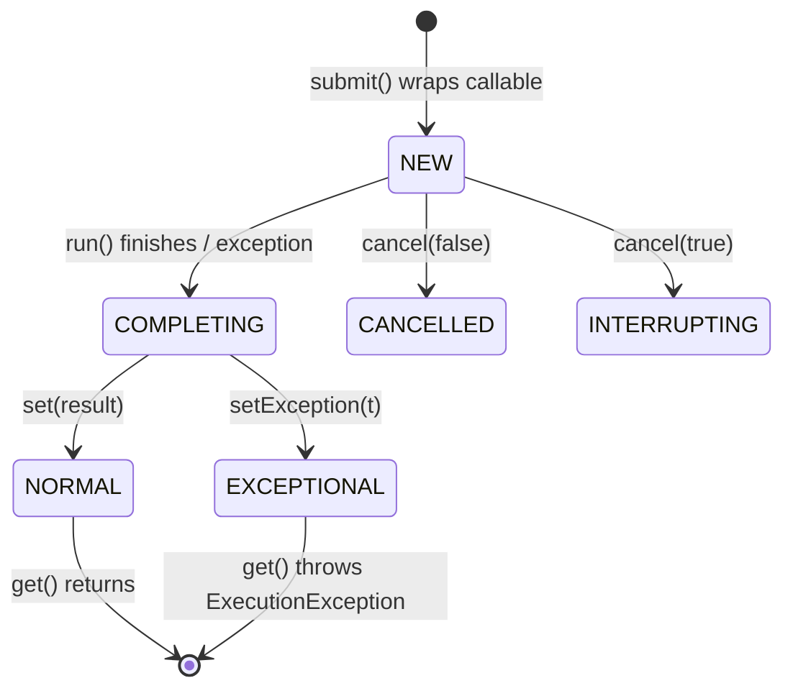
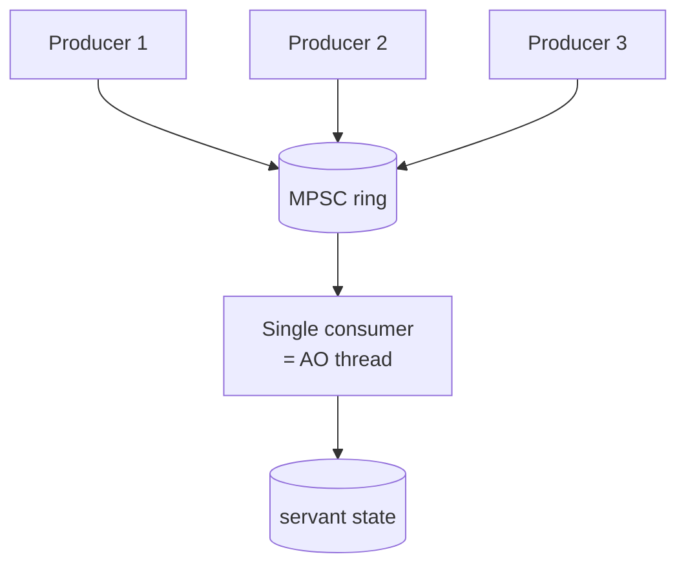

# Active Object — Professional Level

> **Source:** POSA2 — *Pattern-Oriented Software Architecture, Vol. 2* (Schmidt et al.) · Doug Lea, *Concurrent Programming in Java*
> **Prerequisite:** [Senior](senior.md)

## Table of Contents

1. [Introduction](#introduction)
2. [Internals: How a `SingleThreadExecutor` Really Works](#internals-how-a-singlethreadexecutor-really-works)
3. [Memory Model and Visibility](#memory-model-and-visibility)
4. [Performance: Queue Mechanics & Contention](#performance-queue-mechanics--contention)
5. [Performance: Latency, Throughput & Batching Math](#performance-latency-throughput--batching-math)
6. [Cross-Language Comparison](#cross-language-comparison)
7. [Microbenchmark Anatomy](#microbenchmark-anatomy)
8. [Diagrams](#diagrams)
9. [Related Topics](#related-topics)

---

## Introduction

This level dissects the machine. We open `ThreadPoolExecutor` and the
`BlockingQueue` it sits on, trace the exact JMM edges that make a lock-free servant
correct, quantify where the cycles go (enqueue CAS, parking/unparking, cache-line
movement, context switches), and compare how Java, Go, Rust, Erlang, and C++ each
realize the pattern. Finally we build a defensible JMH microbenchmark and read its
numbers honestly — including the traps that make naive Active Object benchmarks
lie.

---

## Internals: How a `SingleThreadExecutor` Really Works

`Executors.newSingleThreadExecutor()` returns a `ThreadPoolExecutor` (wrapped in a
`FinalizableDelegatedExecutorService` so its pool size can't be changed) configured
as:

```java
new ThreadPoolExecutor(1, 1, 0L, MILLISECONDS, new LinkedBlockingQueue<Runnable>());
```

The submit/execute path, step by step:

1. **`submit(callable)`** wraps the callable in a `FutureTask` (which *is* the
   Method Request + the Future fused into one object) and calls `execute(task)`.
2. **`execute`** checks the worker count. Core pool size is 1; if the single worker
   exists, the task goes straight to the queue via `workQueue.offer(task)`.
3. **`LinkedBlockingQueue.offer`** appends a node. It uses *two* locks (a `putLock`
   and a `takeLock`) so producers and the consumer rarely contend, plus an
   `AtomicInteger count`. The producer signals `notEmpty` if the queue was empty.
4. **The worker thread** runs `getTask()` → `workQueue.take()`. If empty, `take`
   *parks* the thread on the `notEmpty` condition (`LockSupport.park`), consuming
   no CPU.
5. On dequeue, the worker calls `task.run()` → `FutureTask.run()`, which invokes the
   callable, then `set(result)` / `setException(t)` — transitioning the future's
   state and unparking any thread blocked in `get()`.

The key realizations:

- **`FutureTask` is the unification** of POSA2's Method Request and Future. Its
  internal `state` field (`NEW → COMPLETING → NORMAL/EXCEPTIONAL`) is the future's
  state machine; its `runner`/`waiters` fields handle the handoff.
- **Parking, not spinning.** An idle Active Object burns zero CPU; the worker is
  parked in the kernel until a task arrives. Wakeup latency is the cost.
- **`LinkedBlockingQueue` is unbounded by default** — exactly the OOM trap. A
  bounded Active Object must pass an explicit capacity (then `offer` returns false
  / `put` blocks).

For a hand-rolled high-performance Active Object you'd replace `LinkedBlockingQueue`
(two locks, node allocation per item, pointer-chasing dequeue) with an
`ArrayBlockingQueue` (one lock, no per-item allocation) or a lock-free MPSC ring
(Disruptor-style) — see [optimize.md](optimize.md).

---

## Memory Model and Visibility

The lock-free servant is correct *only* by the JMM edges the executor establishes.
The precise guarantees (from the `java.util.concurrent` package spec):

> *"Actions in a thread prior to the submission of a `Runnable` to an `Executor`
> happen-before its execution begins. Similarly for tasks submitted to an
> `ExecutorService`."*
> *"Actions taken by the asynchronous computation represented by a `Future`
> happen-before actions subsequent to the retrieval of the result via
> `Future.get()`."*

Mechanically, these edges come from the queue's internal synchronization, not magic:

- The producer's `offer` releases the queue's lock (a *release*); the consumer's
  `take` acquires it (an *acquire*). Release/acquire on the same monitor establishes
  happens-before — so everything the producer wrote before `submit` is visible to
  the worker.
- `FutureTask` uses a release when it `set`s the result and an acquire when `get`
  reads it (via its state field and `LockSupport`/CAS), establishing the
  execution→`get` edge.

Consequences for servant code:

- **No `volatile`/`synchronized`/`Atomic*` needed on servant fields** touched only
  by the AO thread. The single-thread execution order is sequentially consistent
  *for that thread*, and cross-thread visibility is fenced by the queue + future.
- **A "peek" bypassing the future is a race.** If any other thread reads a servant
  field directly (no `submit`/`get`), there is *no* happens-before edge and the read
  is a data race — even if it "looks fine" in tests.
- **Escaping references break everything.** If the servant publishes a reference to
  its mutable internal state (returns the live `Map`, not a copy) and a caller reads
  it off-thread, you've punched a hole through the queue's fence.

For a hand-rolled scheduler, you must *manually* supply both edges: a `BlockingQueue`
(spec'd to establish happens-before between `put` and `take`) for the submit edge,
and a `CompletableFuture`/`CountDownLatch` for the result edge.

---

## Performance: Queue Mechanics & Contention

Where the cycles go on a single `submit` → execute → `get` round trip:

| Cost center | Approx. magnitude | Notes |
|---|---|---|
| Enqueue (lock + node alloc) | tens of ns | `ArrayBlockingQueue` lock; `LinkedBlockingQueue` adds allocation |
| Park/unpark the worker | hundreds of ns–µs | Only when the queue was empty (worker parked) |
| Context switch to AO thread | ~1–5 µs | Kernel scheduler, cache-cold worker |
| Servant work | domain-dependent | The only "useful" part |
| Complete future + unpark caller | hundreds of ns | If a caller is blocked in `get()` |
| Cache-line transfer of the node/queue head | tens of ns | False-sharing-sensitive |

Three contention realities:

1. **MPSC, not MPMC.** An Active Object has many producers, **one** consumer. A
   queue tuned for MPSC (e.g. JCTools `MpscArrayQueue`, or the Disruptor) crushes a
   general `LinkedBlockingQueue` because it avoids consumer-side locking entirely.
2. **Wakeup amortization.** If the producer rate is high enough that the worker
   never parks (the queue is never empty), you pay *zero* park/unpark cost — the
   worker spins through `take()` without blocking. Throughput regimes differ wildly
   from latency regimes for this reason.
3. **False sharing.** Producer count, head, and tail indices on the same cache line
   ping-pong between cores. Padding hot fields (`@Contended`) measurably helps under
   high producer counts.

---

## Performance: Latency, Throughput & Batching Math

**Latency of one operation** through an idle Active Object:

```
T_op ≈ T_enqueue + T_wakeup + T_ctxswitch + T_servant + T_complete + T_get_wakeup
```

The non-servant overhead is roughly **1–5 µs**. So Active Object is excellent when
`T_servant` ≫ a few µs (real work), and wasteful when `T_servant` is nanoseconds
(e.g. a counter increment — use `AtomicLong`).

**Throughput** is governed by the single consumer and per-op fixed cost `c`:

```
max_throughput ≈ 1 / (c + w_servant_per_op)
```

Batching attacks `c`. If a batch of `B` requests shares one fixed cost `C_fixed`
(an fsync, a flush, a syscall) plus per-item `c_item`:

```
per-op cost = C_fixed/B + c_item
```

As `B → large`, the fixed cost vanishes. Concretely: an fsync is ~1 ms. Per-request
fsync caps you at ~1000 writes/s. Batch 1000 writes per fsync and you approach
~1,000,000 writes/s for the same durability — a **1000×** swing from one design
choice. This is *the* reason single-writer + batch dominates write-ahead logging.

**Little's Law** ties it together: `L = λ × W`. Queue depth `L` equals arrival rate
`λ` times residence time `W`. If `λ` exceeds the consumer's service rate even
briefly, `W` (and thus latency and queue depth) grows without bound — which is why
bounded queues + backpressure aren't optional at scale; they're the mechanism that
forces `λ ≤ service rate`.

---

## Cross-Language Comparison

| Language | Idiomatic Active Object | Queue | Future | Notes |
|---|---|---|---|---|
| **Java** | `SingleThreadExecutor` + servant | `BlockingQueue` | `Future` / `CompletableFuture` | Library does memory fences; richest composition |
| **Go** | Goroutine owning state + channel | buffered `chan` | reply `chan` | "Share memory by communicating"; select for multiplexing |
| **Erlang/Elixir** | `gen_server` process | process mailbox | `call`/`reply` ref | Per-process heap → no shared mutation at all; supervision built in |
| **Rust** | `tokio::task` + `mpsc` channel | `mpsc::Sender` | `oneshot::Sender` | Ownership moves into the task; compiler proves no shared state |
| **C++** | `std::thread` + `std::queue`+`condition_variable` | hand-rolled | `std::future`/`std::promise` | You build all six participants by hand |
| **Akka/Scala** | Actor | mailbox | `ask` → `Future` | Dispatcher multiplexing; supervision; clustering |

Go's version is worth contrasting in detail: the channel **is** the activation
queue, the goroutine **is** scheduler+servant, and a per-request reply channel **is**
the future. Go's runtime multiplexes millions of goroutines over OS threads (M:N),
so "one goroutine per Active Object" is cheap — structurally similar to Akka's
dispatcher multiplexing but built into the language.

```go
// Go: select lets one Active Object multiplex many request types + shutdown.
func (a *Account) loop() {
    var bal int64
    for {
        select {
        case r := <-a.deposits:
            bal += r.cents; r.reply <- bal
        case r := <-a.queries:
            r.reply <- bal
        case <-a.quit:
            return                    // clean shutdown
        }
    }
}
```

Erlang's `gen_server` is the purest form: each process has its *own heap*, so there
is literally no shared mutable memory to race over — the activation queue (mailbox)
is the only channel, and crashes are isolated and supervised. Active Object's
intent, taken to its language-level conclusion.

---

## Microbenchmark Anatomy

A trustworthy comparison of Active Object vs `synchronized` vs `AtomicLong`, with
the traps called out.

```java
@BenchmarkMode(Mode.Throughput)
@OutputTimeUnit(TimeUnit.SECONDS)
@State(Scope.Benchmark)
@Threads(8)                              // 8 producer threads contend
public class CounterBench {

    AtomicLong atomic;
    SyncCounter sync;
    Account active;

    @Setup public void up() {
        atomic = new AtomicLong();
        sync   = new SyncCounter();
        active = new Account();
    }
    @TearDown public void down() { active.shutdown(); }

    @Benchmark public long atomicInc()      { return atomic.incrementAndGet(); }

    @Benchmark public long syncInc()        { return sync.inc(); }

    // TRAP 1: this .get() makes the AO synchronous — measures round-trip, not throughput.
    @Benchmark public long activeInc_get()  { return get(active.deposit(1)); }

    // Fairer for throughput: fire-and-forget, measure consumer drain separately.
    @Benchmark public void activeInc_async(Blackhole bh) { bh.consume(active.deposit(1)); }

    static long get(Future<?> f) { try { f.get(); return 0; } catch (Exception e){throw new RuntimeException(e);} }
}
```

Reading the results honestly:

- **`AtomicLong` wins** the raw increment benchmark, by a lot. Active Object adds
  queue + context-switch overhead for a nanosecond operation. **This does not mean
  Active Object is bad** — it means a counter is the wrong use case (see
  [middle.md](middle.md), "When NOT to Use").
- **TRAP 1 — blocking `get()` in the benchmark** turns Active Object into a
  synchronous round-trip and measures *latency*, then reports it as if it were
  *throughput*. The async variant (fire requests, measure the consumer's drain rate)
  is the honest throughput number.
- **TRAP 2 — unbounded queue inflates async numbers.** With an unbounded queue the
  producer never blocks, so "throughput" is really "enqueue rate," not "work done."
  Measure consumer completions, and use a bounded queue so producers feel real
  backpressure.
- **TRAP 3 — warmup and dead-code elimination.** Without JMH `@Warmup` and a
  `Blackhole`, the JIT deletes the work and you benchmark nothing.
- **The real win shows up with realistic `T_servant`.** Re-run with a servant that
  does ~10 µs of work *and* contends; now Active Object's lock-free servant and
  batching can *beat* the `synchronized` version because lock convoys and cache-line
  ping-pong dominate the lock case.

> Benchmark lesson: Active Object is a *latency-and-correctness* tool, not a
> raw-throughput tool for trivial ops. Benchmarks that ignore this (blocking `get`,
> unbounded queue, nanosecond servant) systematically slander the pattern.

---

## Diagrams

### `FutureTask` state machine (Method Request + Future fused)



### Where the cycles go (single round trip)


(Only the green box is useful work; everything else is overhead — minimize it via
MPSC queues, batching, and avoiding needless `get()`.)

### MPSC: many producers, one consumer



---

## Related Topics

- [Monitor Object](../02-monitor-object/professional.md) — lock internals and JMM
  edges for the alternative.
- [Future / Promise](../07-future-promise/professional.md) — `FutureTask` /
  `CompletableFuture` internals.
- [Producer–Consumer](../06-producer-consumer/professional.md) — `BlockingQueue`
  implementations and lock-free MPSC queues.
- [Thread Pool](../05-thread-pool/professional.md) — `ThreadPoolExecutor` internals
  and dispatcher multiplexing.
- [Double-Checked Locking](../10-double-checked-locking/professional.md) — another
  pattern that lives or dies by the memory model.
