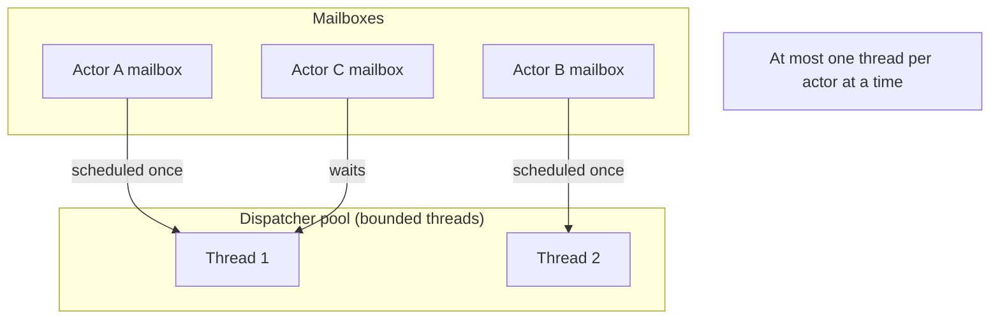
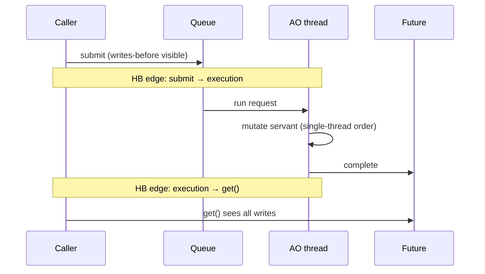
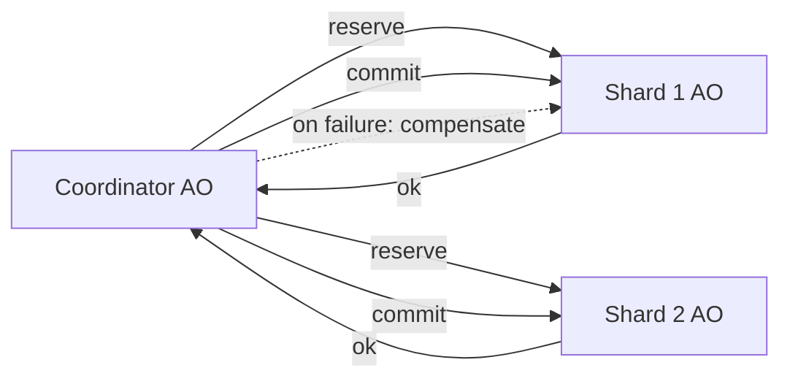

# Active Object — Senior Level

> **Source:** POSA2 — *Pattern-Oriented Software Architecture, Vol. 2* (Schmidt et al.) · Doug Lea, *Concurrent Programming in Java*
> **Prerequisite:** [Middle](middle.md)

## Table of Contents

1. [Introduction](#introduction)
2. [Active Object at Architectural Scale](#active-object-at-architectural-scale)
3. [Scaling Deep-Dive: Sharding, Affinity & the Single-Thread Ceiling](#scaling-deep-dive-sharding-affinity--the-single-thread-ceiling)
4. [Concurrency Deep Dive: Memory Model & Happens-Before](#concurrency-deep-dive-memory-model--happens-before)
5. [Testability Strategies](#testability-strategies)
6. [When Active Object Becomes a Problem](#when-active-object-becomes-a-problem)
7. [Code Examples — Advanced](#code-examples--advanced)
8. [Real-World Architectures](#real-world-architectures)
9. [Pros & Cons at Scale](#pros--cons-at-scale)
10. [Trade-off Analysis Matrix](#trade-off-analysis-matrix)
11. [Migration Patterns](#migration-patterns)
12. [Diagrams](#diagrams)
13. [Related Topics](#related-topics)

---

## Introduction

A senior engineer's relationship with Active Object is less "how do I build one" and
more "where does this pattern sit in a system that must handle 100k req/s, survive
overload, recover from crashes, and be tested deterministically." At this level the
pattern stops being a class and becomes an **architectural unit**: the per-entity
serialization boundary that underpins actor systems, partitioned stream processors,
sharded in-memory stores, and single-writer disk engines.

We focus on four senior concerns: (1) **scaling** past the single-thread ceiling
via sharding and affinity; (2) the **memory-model guarantees** that make the
lock-free servant actually correct, not just apparently correct; (3) **determinism
in tests** despite the asynchrony; and (4) the **failure modes** — overload,
poisoned requests, head-of-line blocking — that turn this pattern from asset into
incident.

---

## Active Object at Architectural Scale

The single most important reframing: **Active Object is the unit of
single-writer-per-entity.** Once you see it that way, a large family of scalable
architectures reveals itself as "Active Object, replicated."

- **Actor systems (Akka, Orleans, Erlang/OTP).** Millions of actors, each an Active
  Object with a private mailbox and state. Scale = many cheap Active Objects
  multiplexed over a bounded dispatcher thread pool. The single-thread-*per-actor*
  guarantee is preserved even though there are far fewer threads than actors,
  because an actor is only ever scheduled on *one* dispatcher thread at a time.
- **Partitioned stream processing (Kafka consumers, Flink keyed state).** Each
  partition / key-group is processed by one thread → single-writer semantics per
  key → no locks on per-key state. That's Active Object at the partition grain.
- **Sharded in-memory stores.** Redis is famously single-threaded for command
  execution: a global Active Object over the whole keyspace. It scales *out*
  (many instances) rather than *up*, precisely the Active Object scaling story.
- **LMAX Disruptor / single-writer disk engines.** A single writer thread owns the
  log; producers hand off via a ring buffer (a specialized bounded activation
  queue). Eliminating write contention is the whole point.

The architectural insight: **you don't scale one Active Object up; you scale the
*number* of Active Objects out, each owning a disjoint slice of state.** The hard
parts then become *routing* (which shard owns this key) and *cross-shard
operations* (which now need a saga or two-phase protocol, because you gave up a
global lock).

---

## Scaling Deep-Dive: Sharding, Affinity & the Single-Thread Ceiling

The throughput of one Active Object is bounded by one core. Three levers move past
it.

### 1. Sharding by key

Partition state by a key; route each request to the owning shard's Active Object.
Disjoint keys now run fully in parallel.

```java
public final class ShardedStore<K, V> implements AutoCloseable {
    private final ExecutorService[] shards;
    private final StoreServant<K, V>[] servants;

    @SuppressWarnings("unchecked")
    public ShardedStore(int n) {
        shards = new ExecutorService[n];
        servants = new StoreServant[n];
        for (int i = 0; i < n; i++) {
            servants[i] = new StoreServant<>();
            shards[i] = Executors.newSingleThreadExecutor(named("store-shard-" + i));
        }
    }

    private int shardOf(K key) {
        return Math.floorMod(key.hashCode(), shards.length); // stable affinity
    }

    public Future<V> get(K key) {
        int s = shardOf(key);
        return shards[s].submit(() -> servants[s].get(key));
    }
    public Future<Void> put(K key, V v) {
        int s = shardOf(key);
        return shards[s].submit(() -> { servants[s].put(key, v); return null; });
    }
    public void close() { for (var e : shards) e.shutdown(); }
    // ... named() factory omitted
}
```

**Affinity is the load-bearing property:** a given key *always* maps to the same
shard, so that key's state is only ever touched by one thread. Break affinity (e.g.
resize shards naively) and you reintroduce races. Resharding must therefore drain
and migrate, not just rehash.

### 2. Dispatcher multiplexing (actor-style)

Instead of a thread per object, use a small pool of dispatcher threads and ensure
**at most one** runs a given Active Object at a time. This decouples "number of
Active Objects" (millions) from "number of threads" (dozens). The mailbox carries a
"scheduled" flag; when a message arrives and the actor isn't scheduled, it's handed
to a dispatcher thread which drains a bounded batch then yields. This is how Akka
runs 10M actors on 8 threads.

### 3. Batching on the consumer

The single thread can amortize per-op overhead by draining the queue in batches
(`drainTo`) and applying many requests under one pass (one fsync, one flush, one
lock-free epoch). Throughput rises sharply when fixed per-op costs dominate. See
[optimize.md](optimize.md).

### The ceiling, stated precisely

> One Active Object's *write* throughput ≤ what one core sustains for the servant's
> per-op work. You cannot parallelize *within* an entity. You parallelize *across*
> entities (sharding) or *amortize* per entity (batching).

---

## Concurrency Deep Dive: Memory Model & Happens-Before

The lock-free servant is correct only because of specific **happens-before** edges.
A senior must be able to name them.

For a `SingleThreadExecutor` (or any `ExecutorService`), the JMM guarantees:

1. **Submit → execution.** *"Actions in a thread prior to the submission of a
   `Runnable`/`Callable` to an `ExecutorService` happen-before its execution
   begins."* So arguments and any state the caller set up are visible to the AO
   thread.
2. **Execution → result observation.** *"Actions taken by the asynchronous
   computation happen-before actions subsequent to the retrieval of the result via
   `Future.get()`."* So when a caller reads `future.get()`, it sees everything the
   request did.
3. **Sequential consistency within the AO thread.** Because exactly one thread runs
   all requests in program order, the servant's reads/writes are ordered with no
   inter-thread reordering to worry about — the single-threaded mental model is
   *valid*, not just convenient.

The chain that makes the pattern safe:

```
caller writes args  ──HB──►  enqueue  ──HB──►  AO thread runs request N
AO request N writes state ──(program order on one thread)──► AO request N+1 reads it
AO request completes future ──HB──►  caller's future.get() returns
```

What this buys you: **no `volatile`, no `synchronized`, no `Atomic*` on servant
fields** — the executor's queue provides the memory fences. What it does *not*
cover: any field the caller reads *without* going through the future (a "peek" at
servant state from outside) — that's a data race with no happens-before edge.

For a hand-rolled scheduler you must supply these edges yourself: a
`BlockingQueue.put`/`take` pair establishes happens-before (the JMM specifies that
`BlockingQueue` implementations do), and completing/awaiting a future (e.g. via a
`CountDownLatch` or `CompletableFuture`) establishes the result edge.

---

## Testability Strategies

Asynchrony makes naive tests flaky. Senior-grade testing makes the AO
**deterministic on demand**.

**1. Test the servant directly — single-threaded, no AO.** The servant is a plain
class. 90% of your logic tests should bypass the proxy entirely and call the
servant on the test thread. Fast, deterministic, no concurrency.

```java
@Test void withdrawFailsWhenInsufficient() {
    var s = new AccountServant();
    s.deposit(100);
    assertFalse(s.withdraw(150)); // pure single-threaded logic test
}
```

**2. Inject the executor; use a synchronous one in tests.** Make the proxy take an
`ExecutorService`. In production pass a single-thread executor; in tests pass a
*same-thread* executor so `submit` runs inline and futures complete synchronously.

```java
ExecutorService sameThread = new AbstractExecutorService() {
    public void execute(Runnable r) { r.run(); }     // run inline, deterministically
    /* shutdown/awaitTermination boilerplate ... */
};
var account = new Account(sameThread);
assertEquals(100L, account.deposit(100).get()); // no real thread, no flakiness
```

**3. Deterministic scheduler for ordering tests.** When you must test interleavings
(guards, fairness), use a manually-pumped scheduler: enqueue requests, then call
`scheduler.step()` N times to advance deterministically.

**4. Concurrency stress tests with `jcstress` / barriers.** For the *boundary*
(the queue handoff), use stress harnesses that hammer enqueue from many threads and
assert no lost updates. The servant doesn't need this; the handoff does.

**5. Await futures, never `Thread.sleep`.** Tests block on `future.get(timeout)` —
deterministic completion, not timing guesses.

---

## When Active Object Becomes a Problem

| Symptom | Root cause | What to do |
|---|---|---|
| p99 latency spikes under load | Head-of-line blocking: one slow request | Move blocking I/O off the AO thread; split into a second AO/pool |
| OOM / GC death spiral | Unbounded (or too-large) queue absorbing backlog | Bound the queue; add load shedding / circuit breaker |
| One core pinned at 100%, others idle | Single hot Active Object is the bottleneck | Shard by key; batch on the consumer |
| Throughput collapses, not degrades | No backpressure → queue grows → cache/GC thrash | Bounded queue + reject/block policy |
| Random hangs | A request blocked on its own AO's future (reentrancy) | Forbid servant→own-proxy blocking calls |
| AO silently stops processing | Uncaught exception killed the worker (raw `execute`) | `submit` + capture into future; supervise/restart thread |
| Cross-entity invariants violated | Sharding removed the global lock | Saga / 2-phase / single coordinator AO for invariants |

The two that cause real incidents most often: **head-of-line blocking from a
blocking call on the AO thread**, and **unbounded-queue OOM under a load spike**.
Design reviews should ask both questions explicitly.

---

## Code Examples — Advanced

### Supervised Active Object (auto-restart on poison)

A raw `execute(Runnable)` whose body throws can kill the worker thread, silently
freezing the Active Object. A supervised version restarts.

```java
public final class SupervisedActiveObject<S> implements AutoCloseable {
    private final S servant;
    private final BlockingQueue<Runnable> queue = new ArrayBlockingQueue<>(10_000);
    private volatile boolean running = true;
    private Thread worker;

    public SupervisedActiveObject(S servant) {
        this.servant = servant;
        startWorker();
    }

    private void startWorker() {
        worker = new Thread(() -> {
            while (running) {
                Runnable req;
                try { req = queue.take(); }
                catch (InterruptedException e) { return; }
                try {
                    req.run();                       // request must capture its own exceptions
                } catch (Throwable poison) {
                    // Should not happen if requests complete futures exceptionally,
                    // but supervise anyway: log, drop the poison, keep serving.
                    log(poison);
                }
            }
        }, "supervised-ao");
        worker.setDaemon(true);
        worker.start();
    }

    public <T> CompletableFuture<T> submit(Function<S, T> op) {
        var f = new CompletableFuture<T>();
        boolean accepted = queue.offer(() -> {        // bounded: offer, not put
            try { f.complete(op.apply(servant)); }
            catch (Throwable t) { f.completeExceptionally(t); } // exception → future
        });
        if (!accepted) f.completeExceptionally(new RejectedExecutionException("full"));
        return f;
    }

    public void close() { running = false; worker.interrupt(); }
    private static void log(Throwable t) { /* ... */ }
}
```

Two senior touches: **every exception is funneled into the future** (so the worker
never dies from request logic), and the worker loop **survives stray `Throwable`s**
as defense in depth. The queue is bounded; `offer` rejects on overflow.

### Batching scheduler (amortized fsync)

```java
public void run() {
    var batch = new ArrayList<WriteReq>(1024);
    while (running) {
        batch.clear();
        WriteReq first = queue.take();        // block for at least one
        batch.add(first);
        queue.drainTo(batch, 1023);           // grab whatever else is ready
        for (WriteReq r : batch) servant.apply(r);  // apply all in memory
        servant.fsync();                      // ONE fsync for the whole batch
        for (WriteReq r : batch) r.future.complete(null);
    }
}
```

One `fsync` per *batch* instead of per request can lift durable-write throughput by
10–100×, because the fixed cost (a disk flush) is amortized. This is the single-
writer + batch pattern behind write-ahead logs.

---

## Real-World Architectures

**Akka dispatcher.** Mailbox (bounded activation queue) + dispatcher thread pool +
the throughput/batch knob (`throughput = N` messages per scheduling turn before
yielding). Supervision restarts a crashed actor — the supervised-AO idea, formalized.

**Redis.** A global single-threaded command loop = one big Active Object over the
keyspace; multiplexed I/O (an event loop) feeds it. Scales by clustering (sharding)
and replicas (read fan-out). Active Object explains why a single Redis instance
needs no locks yet still saturates a core.

**Kafka Streams / Flink keyed state.** Per-key serialization via partition→thread
affinity = Active Object per key-group; state is local and lock-free; scaling is
adding partitions/tasks.

**LMAX Disruptor.** A ring buffer (specialized bounded queue) with a single writer
per slot and sequence barriers establishing happens-before. Active Object's "single
writer, hand off via queue" pushed to mechanical-sympathy extremes (no locks, cache-
line padding, batching).

**Android UI.** `Looper`/`Handler`/`MessageQueue` — the canonical client-side
Active Object: all UI state is touched only by the main looper thread; background
threads `post` requests.

---

## Pros & Cons at Scale

**Pros**

- **Lock-free correctness scales linearly with shards.** Adding shards adds
  parallelism without adding lock-contention complexity.
- **Per-entity ordering for free.** Many systems *need* per-key ordering
  (event sourcing, ledgers); Active Object gives it as a byproduct.
- **Backpressure has a natural home** (the bounded queue), making overload behavior
  explicit and tunable.
- **Failure isolation per entity** (with supervision) limits blast radius.

**Cons**

- **Cross-entity transactions are hard.** Removing the global lock means
  multi-entity invariants need sagas/2PC — real complexity you didn't have with one
  big lock.
- **Routing/affinity becomes a system concern.** Resharding, hot-key skew, and
  rebalancing are now your problem.
- **Head-of-line blocking is global per entity.** One pathological request degrades
  every operation on that entity.
- **Observability is harder.** Latency now includes queue wait; you must measure
  queue depth and wait time, not just service time.

---

## Trade-off Analysis Matrix

| Dimension | Single big Active Object | Sharded Active Objects | Monitor Object (lock) | Lock-free (CAS) |
|---|---|---|---|---|
| Per-object throughput | 1 core | N cores (across keys) | Multi (RW) | High |
| Cross-entity invariants | Trivial (one thread) | Hard (saga/2PC) | Trivial (one lock) | Hard |
| Per-entity ordering | ✓ | ✓ | Caller-dependent | ✗ |
| Backpressure | ✓ (queue) | ✓ | ✗ (callers block) | ✗ |
| Servant complexity | Low (no locks) | Low | Medium (lock discipline) | High |
| Read scalability | ✗ (serialized) | Limited | ✓ (RW lock) | ✓ |
| Failure isolation | Per object | Per shard | Per critical section | N/A |
| Observability of overload | ✓ (queue depth) | ✓ | ✗ | ✗ |

---

## Migration Patterns

**Monolithic lock → sharded Active Objects.** Identify the partition key, split
state by key, route to per-shard Active Objects. The risk is any operation that
spanned keys under the old global lock — enumerate those *first* and design a saga
or coordinator before you remove the lock.

**Synchronous service → asynchronous Active Object (strangler).** Keep the
synchronous façade (it calls `submit(...).get()` internally) so callers are
unchanged, while the internals become async. Then, endpoint by endpoint, migrate
callers to consume the future directly and drop the blocking `get()`.

**Thread-per-request + lock → Active Object.** When lock contention dominates a
stateful component, move it behind a single thread. Often *reduces* latency despite
serialization, because lock-convoy and cache-line ping-pong vanish (see
[optimize.md](optimize.md), the "replace lock with single writer" walkthrough).

**Active Object → actor framework.** When you need supervision, location
transparency, or millions of entities, adopt Akka/Orleans rather than hand-rolling
dispatcher multiplexing. You're not changing the pattern, just its runtime.

---

## Diagrams

### Dispatcher multiplexing (many AOs, few threads)



### Happens-before chain



### Cross-shard saga



---

## Related Topics

- [Monitor Object](../02-monitor-object/senior.md) — lock-based alternative; compare
  memory-model guarantees.
- [Producer–Consumer](../06-producer-consumer/senior.md) — queue/backpressure at
  scale.
- [Leader/Followers](../09-leader-followers/senior.md) — thread-efficient
  alternative for event demultiplexing.
- [Thread Pool](../05-thread-pool/senior.md) — dispatcher multiplexing and sizing.
- [Future / Promise](../07-future-promise/senior.md) — composition and error
  propagation at scale.
- [Half-Sync/Half-Async](../08-half-sync-half-async/senior.md) — the layered
  architecture Active Object often plugs into.
