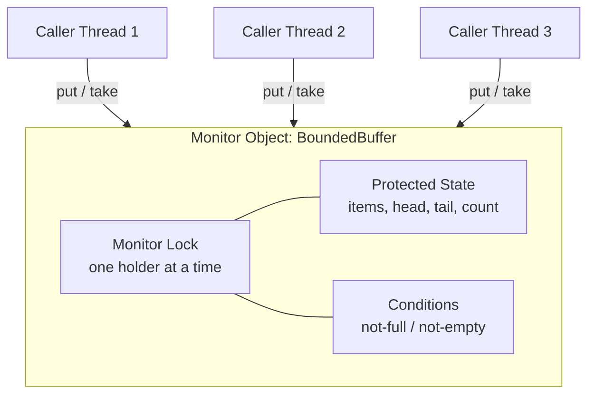

# Monitor Object — Junior Level

> **Source:** POSA2 — *Pattern-Oriented Software Architecture, Vol. 2* (Schmidt et al.) · Doug Lea, *Concurrent Programming in Java*
> **Category:** [Concurrency](../README.md) — *"Patterns for coordinating work across threads, cores, and machines."*

## Table of Contents

1. [Introduction](#introduction)
2. [Prerequisites](#prerequisites)
3. [Glossary](#glossary)
4. [Core Concepts](#core-concepts)
5. [Real-World Analogies](#real-world-analogies)
6. [Mental Models](#mental-models)
7. [Pros & Cons](#pros--cons)
8. [Use Cases](#use-cases)
9. [Code Examples](#code-examples)
10. [Coding Patterns](#coding-patterns)
11. [Clean Code](#clean-code)
12. [Best Practices](#best-practices)
13. [Edge Cases & Pitfalls](#edge-cases--pitfalls)
14. [Common Mistakes](#common-mistakes)
15. [Tricky Points](#tricky-points)
16. [Test Yourself](#test-yourself)
17. [Tricky Questions](#tricky-questions)
18. [Cheat Sheet](#cheat-sheet)
19. [Summary](#summary)
20. [What You Can Build](#what-you-can-build)
21. [Further Reading](#further-reading)
22. [Related Topics](#related-topics)
23. [Diagrams & Visual Aids](#diagrams--visual-aids)

---

## Introduction

Imagine two threads grabbing money from the same bank account at the same instant. Both read the balance as $100. Both subtract $80. Both write back $20. The account just paid out $160 it never had. This is a **race condition**, and it is the central problem the **Monitor Object** pattern exists to solve.

A Monitor Object is an object whose methods are guaranteed to run **one thread at a time**. While one thread is executing inside the object, every other thread that calls one of its synchronized methods must wait outside. The object protects its own internal data, so callers never see it in a half-modified state. On top of that mutual exclusion, the Monitor adds a second power: a thread that *cannot make progress* (a consumer asking an empty queue for an item) can **step aside, release the lock, and sleep** until another thread signals that the situation has changed.

The pattern's name comes from the idea that the object "monitors" access to itself. In Java, this is so fundamental that the runtime builds it into the language: every object has a hidden lock, and the `synchronized` keyword turns any method into a monitor method. You have probably already used Monitor Objects without naming them. This topic gives you the name, the rules, and — most importantly — the *correct* way to wait and signal, because the wrong way produces bugs that only appear under load and are notoriously hard to reproduce.

## Prerequisites

- **Threads:** A thread is an independent path of execution. Multiple threads in one process share the same memory (objects, fields), which is exactly why coordination is needed.
- **Race condition:** A bug where the result depends on the unpredictable timing of two or more threads touching shared data.
- **Mutual exclusion (mutex):** A mechanism that lets at most one thread into a "critical section" at a time.
- **Critical section:** A block of code that reads or writes shared state and therefore must not run concurrently with itself.
- **Java basics:** Classes, methods, exceptions, and how to start a `Thread` or submit to an `ExecutorService`.

If "race condition" and "critical section" are new, read those two ideas first — everything below assumes them.

## Glossary

| Term | Meaning |
|------|---------|
| **Monitor Object** | An object whose synchronized methods run one thread at a time. |
| **Monitor Lock** | The single lock guarding the object; acquired on entry, released on exit. In Java, the object's *intrinsic lock* (a.k.a. *monitor*). |
| **Monitor Condition** | A queue of threads waiting for a specific situation to become true (e.g. "buffer not full"). |
| **Critical section** | Code that must run under mutual exclusion. |
| **`wait()`** | Atomically release the lock and sleep until signaled. |
| **`notify()` / `notifyAll()`** | Wake one / all threads waiting on this object's condition. |
| **Spurious wakeup** | A thread returning from `wait()` *without* being signaled. Permitted by the JVM — your code must tolerate it. |
| **Lost wakeup** | A signal sent before a thread started waiting, so the thread sleeps forever. A bug. |
| **Reentrancy** | A thread that holds the lock can re-enter another synchronized method on the same object without deadlocking. |
| **Mesa semantics** | "Signal-and-continue": the signaler keeps running; the woken thread must re-check its condition. (Java's model.) |

## Core Concepts

A Monitor Object has exactly three moving parts.

**1. The Monitor Object itself.** A normal object with private state and a set of methods. The methods are *synchronized* — entering one acquires the lock, returning (normally or by exception) releases it.

**2. The Monitor Lock.** One lock per object. Because only one thread can hold it, only one synchronized method body runs at a time. This gives **serialization of method execution**: callers line up and take turns. Crucially, the body runs **in the caller's own thread** — the Monitor does not own a thread. (This is the key contrast with [Active Object](../01-active-object/junior.md), which runs requests in *its own* thread.)

**3. Monitor Conditions.** Mutual exclusion alone is not enough. A consumer that finds the buffer empty cannot just spin-loop holding the lock — that would block every producer from ever filling it. Instead the consumer calls `wait()`, which **atomically releases the lock and sleeps**. A producer later adds an item and calls `notify()`/`notifyAll()` to wake the sleeper, which then **re-acquires the lock** and re-checks the condition.

The single most important rule in this entire topic:

> **Always wait inside a `while` loop that re-checks the condition — never an `if`.**

```java
while (!conditionHolds()) {
    wait();
}
// condition is now guaranteed true, and we hold the lock
```

Why `while` and not `if`? Two reasons: **spurious wakeups** (the JVM may wake a thread for no reason) and **stale conditions** under Mesa semantics (between being signaled and re-acquiring the lock, another thread may have already consumed the resource). The `while` loop re-checks after every wakeup, so the code is correct only when the condition is *actually* true. Using `if` here is the most common Monitor bug in existence.

## Real-World Analogies

- **A single-stall restroom with a key.** Only one person (thread) holds the key (lock) and is inside at a time. Everyone else waits in line. The "wait/notify" twist: if you go in and discover there's no toilet paper (condition not met), you don't camp inside hogging the room — you step out, give up the key, and wait for staff to restock and call you back.
- **A meeting room with a talking stick.** Whoever holds the stick speaks; others stay silent. If you take the stick but realize you need data a colleague hasn't produced yet, you put the stick down (release the lock) and wait until they signal it's ready.
- **A drive-through order window.** Cars (threads) are served strictly one at a time at the window (critical section). The kitchen (another thread) signals "order ready," waking the car that's been waiting on its food.

## Mental Models

- **"One room, one key, a waiting bench."** The object is a room. The lock is the only key. Conditions are benches outside where blocked threads nap until called.
- **"Serialize, then cooperate."** Step one: force one-at-a-time entry (mutual exclusion). Step two: let threads that can't proceed yield politely (condition synchronization). A Monitor is both.
- **"Sleep without the key."** `wait()` is special precisely because it *atomically* hands back the key while sleeping. If it kept the key, no one could ever wake it — instant deadlock.
- **"Signal is a hint, not a guarantee."** Under Mesa semantics, a `notify()` means "the situation *might* now be favorable — go re-check." That is why you re-check in a loop.

## Pros & Cons

| ✓ Pros | ✗ Cons |
|--------|--------|
| Encapsulates synchronization *inside* the object — callers write ordinary method calls. | One lock per object can become a bottleneck (low concurrency). |
| Built into Java (`synchronized`) — no library needed. | Easy to misuse: `if` instead of `while`, `notify` instead of `notifyAll`, forgetting to hold the lock. |
| Mutual exclusion + condition waiting in one tidy package. | Runs in the caller's thread — a slow method blocks the caller. |
| Lock auto-releases on exception (with `synchronized`). | Nested monitors can deadlock; ordering matters. |
| Reentrant: a synchronized method can call another safely. | Coarse-grained locking hurts on multi-core scaling. |

## Use Cases

- **Bounded buffer / blocking queue** — the textbook example: producers wait when full, consumers wait when empty.
- **Connection / object pools** — borrowers wait when the pool is exhausted.
- **Thread-safe counters, caches, and registries** — simple shared state with read/modify/write that must be atomic.
- **Coordinating a fixed shared resource** — printers, hardware ports, a single file handle.
- **A "latch" or "gate"** — threads wait until some one-time event (initialization complete) occurs.

For high-throughput production code you'd usually reach for `java.util.concurrent` (e.g. `ArrayBlockingQueue`) — but those are *built from* the Monitor Object pattern. Learning the pattern teaches you what's inside them.

## Code Examples

### A thread-safe counter (mutual exclusion only)

```java
public final class Counter {
    private long value = 0;

    public synchronized void increment() { value++; }      // critical section
    public synchronized long get()       { return value; } // also synchronized!
}
```

Note that **`get()` is synchronized too**. Reading shared mutable state needs the lock as well, both for atomicity and for *visibility* (so the reader sees the latest write — more on this in [middle](middle.md)).

### The canonical example: a bounded buffer (mutual exclusion + conditions)

```java
public final class BoundedBuffer<T> {
    private final Object[] items;
    private int head = 0, tail = 0, count = 0;

    public BoundedBuffer(int capacity) {
        items = new Object[capacity];
    }

    public synchronized void put(T x) throws InterruptedException {
        while (count == items.length) {   // WHILE, never IF
            wait();                        // release lock, sleep until "not full"
        }
        items[tail] = x;
        tail = (tail + 1) % items.length;
        count++;
        notifyAll();                       // wake any waiting consumers
    }

    @SuppressWarnings("unchecked")
    public synchronized T take() throws InterruptedException {
        while (count == 0) {               // WHILE, never IF
            wait();                        // release lock, sleep until "not empty"
        }
        T x = (T) items[head];
        items[head] = null;                // help GC, avoid leak
        head = (head + 1) % items.length;
        count--;
        notifyAll();                       // wake any waiting producers
        return x;
    }
}
```

This single class demonstrates every part of the pattern: the lock (`synchronized`), the conditions ("not full" / "not empty"), the mandatory `while` loops, and `notifyAll()` to wake waiters after a state change.

### The same idea in C++ (`std::mutex` + `std::condition_variable`)

```cpp
#include <mutex>
#include <condition_variable>
#include <queue>

template <typename T>
class BoundedBuffer {
public:
    explicit BoundedBuffer(size_t cap) : capacity_(cap) {}

    void put(T x) {
        std::unique_lock<std::mutex> lock(mutex_);
        not_full_.wait(lock, [this] { return queue_.size() < capacity_; }); // predicate = the while-loop
        queue_.push(std::move(x));
        not_empty_.notify_one();
    }

    T take() {
        std::unique_lock<std::mutex> lock(mutex_);
        not_empty_.wait(lock, [this] { return !queue_.empty(); });
        T x = std::move(queue_.front());
        queue_.pop();
        not_full_.notify_one();
        return x;
    }

private:
    std::mutex mutex_;
    std::condition_variable not_full_, not_empty_;
    std::queue<T> queue_;
    size_t capacity_;
};
```

The C++ `wait(lock, predicate)` form is the loop built in — it keeps waiting until the predicate is true, exactly like the Java `while`.

## Coding Patterns

- **Guarded suspension:** `while (!ready) wait();` — block until a precondition holds. This is the heartbeat of the pattern.
- **Two-condition split:** Use distinct conditions ("not full" vs "not empty") so you can `notify()` only the relevant waiters — covered in [middle](middle.md) with `ReentrantLock` + `Condition`.
- **Notify after every state change:** Whenever you change state that another thread might be waiting on, signal.
- **Keep critical sections short:** Do the minimum under the lock; never call slow/blocking I/O while holding it.

## Clean Code

- Make fields `private` so the only way to touch state is through synchronized methods — the lock can't protect what callers reach around.
- Synchronize **both** writers and readers of shared mutable state.
- Name conditions for the situation they represent (`notFull`, `notEmpty`), not for who waits on them.
- Prefer `notifyAll()` until you can *prove* `notify()` is safe (one condition, identical waiters).
- Don't expose the lock object; encapsulate synchronization inside the class.

## Best Practices

1. **`while`, not `if`,** around every `wait()`.
2. **Hold the lock** when you call `wait()`, `notify()`, or `notifyAll()` — otherwise you get `IllegalMonitorStateException`.
3. **`notifyAll()` by default;** downgrade to `notify()` only with proof.
4. **Keep critical sections tiny;** never do network/disk I/O under the lock.
5. **Always restore the interrupt flag** or propagate `InterruptedException` — don't swallow it.
6. **Lock on a private, final object** if you don't want to expose the intrinsic lock (`private final Object lock = new Object();`).
7. **Prefer `java.util.concurrent`** for real systems; hand-roll monitors only when you must.

## Edge Cases & Pitfalls

- **Lost wakeup:** A producer calls `notify()` *before* the consumer calls `wait()`. The signal vanishes; the consumer sleeps forever. Mitigation: always hold the lock around state change + notify, and re-check the condition in a `while`.
- **Spurious wakeup:** `wait()` returns with no signal sent. The `while` loop catches it by re-checking.
- **`notify()` wakes the wrong thread:** With a single condition and mixed waiters (producers and consumers on the same lock), `notify()` may wake a producer when only a consumer can proceed — and that producer goes back to sleep, leaving everyone stuck. `notifyAll()` avoids this.
- **Calling `wait()`/`notify()` outside `synchronized`:** throws `IllegalMonitorStateException` immediately.
- **Holding the lock during long work:** turns your "concurrent" object into a serial bottleneck.

## Common Mistakes

| Mistake | Consequence | Fix |
|---------|-------------|-----|
| `if (empty) wait();` | Acts on a stale/false condition after wakeup → corruption. | Use `while`. |
| `notify()` with mixed waiters | Deadlock (wrong thread woken). | Use `notifyAll()` or split conditions. |
| Reader method not synchronized | Stale reads, torn values. | Synchronize readers too. |
| `wait()` without holding lock | `IllegalMonitorStateException`. | Wait inside `synchronized`. |
| Swallowing `InterruptedException` | Threads can't be cancelled; hangs on shutdown. | Re-interrupt or propagate. |
| Doing I/O under the lock | Throughput collapses. | Move I/O outside the critical section. |

## Tricky Points

- **`wait()` releases only *this* object's lock.** If the thread holds *other* locks too, those are kept — a recipe for **nested monitor lockout**. Avoid waiting while holding more than one lock.
- **Reentrancy is per-thread, per-lock.** A thread already holding the lock can call another synchronized method on the same object freely. It does *not* let a *different* thread in.
- **Mesa vs Hoare semantics.** Java uses **Mesa** ("signal-and-continue"): the signaled thread doesn't run immediately and must re-check. Some textbook pseudocode assumes **Hoare** semantics (signaled thread runs at once) where `if` would suffice — that's why old examples mislead you. In Java, **always `while`**.
- **`notifyAll()` causes a thundering herd:** all waiters wake, contend for the lock, most re-check and sleep again. Correct but potentially wasteful — a [middle](middle.md)-level optimization concern.

## Test Yourself

1. Why must `wait()` *atomically* release the lock and sleep, rather than do them in two steps?
2. What is the difference between a spurious wakeup and a lost wakeup?
3. Why is `get()` on a shared counter synchronized even though it only reads?
4. When is `notify()` safe to use instead of `notifyAll()`?
5. Where does a Monitor Object's code run — its own thread or the caller's?

<details>
<summary>Answers</summary>

1. If the two steps weren't atomic, a `notify()` could slip in *between* releasing the lock and sleeping, so the thread would sleep through its own wakeup (a lost wakeup). Atomicity closes that window.
2. **Spurious:** woken with no signal sent (JVM-permitted; `while` handles it). **Lost:** a signal was sent but no thread was waiting yet, so it's gone forever (a real bug).
3. For **visibility** (the reader must see the latest write under the Java Memory Model) and **atomicity** (a `long` read could otherwise be torn, and the reader must observe a consistent value).
4. Only when there is a single condition and all waiters are interchangeable, so waking exactly one is always sufficient and correct.
5. The **caller's** thread. The Monitor owns a lock, not a thread — unlike [Active Object](../01-active-object/junior.md).

</details>

## Tricky Questions

1. **A producer calls `notifyAll()` but no consumer is waiting yet. Is the signal lost?** Yes — `notify`/`notifyAll` only wake threads *currently* in `wait()`. They are not queued. This is why consumers must re-check the condition with `while` and why state + notify must be done under the same lock: the consumer either already sees the new state (and never waits) or is waiting and gets woken.
2. **Can a thread that called `wait()` be woken by `notify()` on a *different* object?** No. `wait`/`notify` are tied to a specific object's monitor. You must signal the same object the thread waited on.
3. **Does `synchronized` on a `static` method use the same lock as an instance method?** No — static synchronized locks on the `Class` object; instance synchronized locks on `this`. They are different monitors.

## Cheat Sheet

```text
MONITOR OBJECT = one lock + condition waiting, one thread at a time

Mutual exclusion:   synchronized methods / blocks
Wait correctly:     while (!cond) wait();      // NEVER if
Signal:             notifyAll();               // default; notify() only if provable
Rules:
  - hold the lock to call wait/notify/notifyAll
  - wait() atomically releases lock + sleeps
  - Mesa semantics → re-check condition after wakeup
  - synchronize readers AND writers
  - keep critical sections short; no I/O under lock
Java realizations:  synchronized + wait/notifyAll
                    ReentrantLock + Condition (multiple conditions)
Runs in:            the caller's thread (cf. Active Object = own thread)
```

## Summary

The Monitor Object pattern makes an object thread-safe by guarding it with a single lock so only one method runs at a time, and by letting threads that can't proceed `wait()` on a condition until another thread signals a change. In Java it's `synchronized` plus `wait`/`notifyAll`; in C++ it's `std::mutex` plus `std::condition_variable`. The bounded buffer is the canonical example. The non-negotiable rule is to **wait inside a `while` loop**, because Java uses Mesa (signal-and-continue) semantics and the JVM permits spurious wakeups — so a signal is only a hint to re-check, never a promise the condition holds. Get the `while` loop and the lock-held-during-notify rule right, and you have eliminated the two worst Monitor bugs before they happen.

## What You Can Build

- A **thread-safe bounded blocking queue** from scratch.
- A **fixed-size object pool** that blocks borrowers when empty.
- A **rate gate** that lets N threads through and queues the rest.
- A **one-shot latch** that blocks workers until "ready" fires.
- A **producer–consumer pipeline** (then compare with [Producer–Consumer](../06-producer-consumer/junior.md)).

## Further Reading

- Schmidt et al., *Pattern-Oriented Software Architecture, Vol. 2*, Monitor Object chapter.
- Doug Lea, *Concurrent Programming in Java*, 2nd ed. — guarded methods.
- Goetz et al., *Java Concurrency in Practice*, ch. 14 (building custom synchronizers).
- Java docs: `Object.wait/notify/notifyAll`, `java.util.concurrent.locks.Condition`.

## Related Topics

- [Active Object](../01-active-object/junior.md) — decouples method call from execution using its *own* thread; contrast with Monitor's caller-thread model.
- [Producer–Consumer](../06-producer-consumer/junior.md) — the problem the bounded buffer solves.
- [Balking](../11-balking/junior.md) — return immediately instead of waiting when the object isn't ready.

## Diagrams & Visual Aids

**The three participants:**



**Lifecycle of a `take()` on an empty buffer (Mesa, signal-and-continue):**

```mermaid
sequenceDiagram
    participant C as Consumer
    participant M as Monitor (lock)
    participant P as Producer
    C->>M: acquire lock, call take()
    C->>C: count == 0 → wait()
    Note over C,M: wait() releases lock + sleeps
    P->>M: acquire lock, put(x)
    P->>P: count++, notifyAll()
    P->>M: release lock (continues running)
    Note over C: woken, but must re-acquire lock
    C->>M: re-acquire lock
    C->>C: while re-checks count > 0 ✓ → take item
    C->>M: notifyAll(); release lock
```
