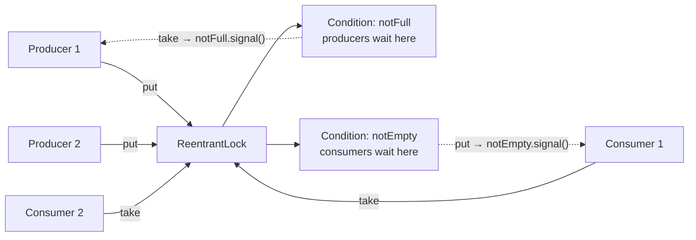

# Monitor Object — Middle Level

> **Source:** POSA2 — *Pattern-Oriented Software Architecture, Vol. 2* (Schmidt et al.) · Doug Lea, *Concurrent Programming in Java*
> **Category:** [Concurrency](../README.md) — *"Patterns for coordinating work across threads, cores, and machines."*
> **Prerequisite:** [junior](junior.md)

## Table of Contents

1. [Introduction](#introduction)
2. [When to Use Monitor Object](#when-to-use-monitor-object)
3. [When NOT to Use Monitor Object](#when-not-to-use-monitor-object)
4. [Real-World Cases](#real-world-cases)
5. [Code Examples — Production-Grade](#code-examples--production-grade)
6. [Deep Dive: `notify()` vs `notifyAll()` and Multiple Conditions](#deep-dive-notify-vs-notifyall-and-multiple-conditions)
7. [Deep Dive: Reentrancy and Nested Monitor Lockout](#deep-dive-reentrancy-and-nested-monitor-lockout)
8. [Deep Dive: Interruption, Cancellation, and Timed Waits](#deep-dive-interruption-cancellation-and-timed-waits)
9. [Trade-offs](#trade-offs)
10. [Alternatives Comparison](#alternatives-comparison)
11. [Refactoring to Monitor Object](#refactoring-to-monitor-object)
12. [Pros & Cons (Deeper)](#pros--cons-deeper)
13. [Edge Cases](#edge-cases)
14. [Tricky Points](#tricky-points)
15. [Best Practices](#best-practices)
16. [Tasks (Practice)](#tasks-practice)
17. [Summary](#summary)
18. [Related Topics](#related-topics)
19. [Diagrams](#diagrams)

---

## Introduction

At the junior level you learned the shape of a Monitor Object: one lock, condition waiting, `while`-not-`if`. At this level the questions get sharper. *Which* signaling primitive should you use, and why does `notify()` so often cause subtle deadlocks? When do you graduate from the intrinsic lock to an explicit `ReentrantLock` with multiple `Condition`s? How do you make a Monitor responsive to cancellation and timeouts so it doesn't hang during shutdown? And critically — when is the whole pattern the *wrong* tool, because a single object-wide lock has become your throughput ceiling?

We'll work through these with production-grade Java. The thread running point throughout: a Monitor Object trades concurrency for simplicity. It serializes access through one lock. That's a feature when correctness matters more than raw parallelism, and a liability when it doesn't.

## When to Use Monitor Object

- **Shared mutable state with read-modify-write invariants** that must hold atomically (counters, buffers, pools, registries).
- **Coordination via conditions** — threads must *block until* some state becomes true ("not empty", "below capacity", "leader elected").
- **You want the synchronization encapsulated** so callers write plain method calls and can't reach around the lock.
- **Moderate contention** where the simplicity of one lock outweighs the cost of serialization.
- **You're building a custom synchronizer** that `java.util.concurrent` doesn't provide off the shelf.

## When NOT to Use Monitor Object

- **High-contention hot paths** — a single object lock serializes everything; use lock striping, `ConcurrentHashMap`, or lock-free structures instead.
- **Read-mostly workloads** — a `ReadWriteLock` or `StampedLock` lets readers run in parallel; a Monitor forces them to queue.
- **A ready-made `java.util.concurrent` type exists** — `ArrayBlockingQueue`, `Semaphore`, `CountDownLatch`, `Phaser` are battle-tested Monitor implementations. Don't reinvent them.
- **Long-running or blocking operations** — never hold a Monitor lock across I/O; if your method *is* long work, consider [Active Object](../01-active-object/middle.md) so the caller isn't blocked.
- **Pure message-passing designs** (actors, channels) where you avoid shared mutable state entirely.

## Real-World Cases

- **`java.util.concurrent.ArrayBlockingQueue`** is a Monitor Object: one `ReentrantLock`, two `Condition`s (`notEmpty`, `notFull`). Reading its source is the best Monitor tutorial in existence.
- **HikariCP / database connection pools** block borrowers on a condition until a connection is returned — Monitor semantics with timeouts.
- **Logging frameworks' bounded async appenders** use a Monitor-backed queue between application threads and the I/O writer thread.
- **In-memory caches with bounded size** (an LRU with capacity) guard eviction + insertion as one critical section.

## Code Examples — Production-Grade

### Bounded buffer with `ReentrantLock` and two `Condition`s

The intrinsic-lock version from [junior](junior.md) had one weakness: a single condition forces `notifyAll()`, waking producers and consumers indiscriminately. With explicit conditions, you signal *only* the threads that can actually proceed.

```java
import java.util.concurrent.locks.*;

public final class BoundedBuffer<T> {
    private final Lock lock = new ReentrantLock();
    private final Condition notFull  = lock.newCondition();
    private final Condition notEmpty = lock.newCondition();

    private final Object[] items;
    private int head, tail, count;

    public BoundedBuffer(int capacity) {
        if (capacity <= 0) throw new IllegalArgumentException("capacity > 0");
        items = new Object[capacity];
    }

    public void put(T x) throws InterruptedException {
        lock.lock();
        try {
            while (count == items.length) {
                notFull.await();           // wait on the RIGHT condition
            }
            items[tail] = x;
            tail = (tail + 1) % items.length;
            count++;
            notEmpty.signal();             // wake exactly one consumer
        } finally {
            lock.unlock();                  // ALWAYS unlock in finally
        }
    }

    @SuppressWarnings("unchecked")
    public T take() throws InterruptedException {
        lock.lock();
        try {
            while (count == 0) {
                notEmpty.await();
            }
            T x = (T) items[head];
            items[head] = null;
            head = (head + 1) % items.length;
            count--;
            notFull.signal();               // wake exactly one producer
            return x;
        } finally {
            lock.unlock();
        }
    }
}
```

Two improvements over the intrinsic version: (1) `signal()` instead of `signalAll()` is now **safe and efficient**, because each condition has exactly one kind of waiter; (2) the `try/finally` makes lock release explicit and exception-safe. This is essentially how `ArrayBlockingQueue` is written.

### Timed, cancellable take with `offer`/`poll` semantics

```java
import java.util.concurrent.TimeUnit;

public T poll(long timeout, TimeUnit unit) throws InterruptedException {
    long nanos = unit.toNanos(timeout);
    lock.lock();
    try {
        while (count == 0) {
            if (nanos <= 0L) return null;          // timed out → balk
            nanos = notEmpty.awaitNanos(nanos);    // returns remaining time
        }
        @SuppressWarnings("unchecked") T x = (T) items[head];
        items[head] = null;
        head = (head + 1) % items.length;
        count--;
        notFull.signal();
        return x;
    } finally {
        lock.unlock();
    }
}
```

`awaitNanos` returns the *remaining* nanoseconds, letting the `while` loop subtract elapsed time across spurious wakeups — the correct way to implement a deadline. Returning `null` on timeout is the [Balking](../11-balking/middle.md) pattern grafted onto the Monitor.

## Deep Dive: `notify()` vs `notifyAll()` and Multiple Conditions

This is the most consequential design choice in a Monitor.

**With the intrinsic lock (one condition queue per object):** all waiters — producers *and* consumers — sleep on the same monitor. A `notify()` wakes *one arbitrary* waiter. Suppose the buffer just became non-empty and you `notify()`. The JVM might wake a *producer* (who was waiting for "not full"). The producer re-checks, sees the buffer is still full (or now non-full but irrelevant), and goes back to sleep — **without** having helped the waiting consumer. The signal is consumed by the wrong thread. With more waiters this becomes a stuck system. Hence: **with a single condition and heterogeneous waiters, use `notifyAll()`.**

**`notify()` is safe only when all three hold:**
1. **Uniform waiters** — every thread waiting on the monitor is waiting for the *same* condition.
2. **One-in, one-out** — a single state change enables exactly one waiter.
3. **No condition variable confusion** — there's only one logical condition.

The clean fix is **multiple `Condition` objects** on a `ReentrantLock`. Each condition has its *own* wait queue, so `notFull.signal()` can *only* wake a producer and `notEmpty.signal()` can *only* wake a consumer. Now `signal()` is both correct and cheaper than `signalAll()` (no thundering herd).

| Approach | Wake cost | Correctness risk | Use when |
|----------|-----------|------------------|----------|
| `notifyAll()` (intrinsic) | All waiters wake, most re-sleep | Low | Mixed waiters, simple code |
| `notify()` (intrinsic) | One waiter | High — wrong-thread wakeup | Only uniform waiters |
| `signal()` per `Condition` | One correct waiter | Low | Distinct conditions (preferred) |

## Deep Dive: Reentrancy and Nested Monitor Lockout

**Reentrancy:** Java's intrinsic lock and `ReentrantLock` are *reentrant* — a thread already holding the lock can re-acquire it. This is why a synchronized method can call another synchronized method on the same object without self-deadlock. It's essential: without reentrancy, internal helper calls would hang the very thread that holds the lock.

**Nested monitor lockout** is the dangerous cousin. Consider thread T holding lock A, then entering a synchronized method on object B (lock B) and calling `B.wait()`. `wait()` releases **only lock B** — T *keeps lock A*. Now any thread that needs lock A to ever produce the condition B is waiting for can't get it. T sleeps forever holding A; the producer blocks on A. Deadlock.

```java
// DANGEROUS: waiting while holding an outer lock
synchronized (a) {                 // holds A
    synchronized (b) {             // holds B
        while (!ready) b.wait();   // releases ONLY B; still holds A → lockout risk
    }
}
```

**Rules to avoid it:**
- Never call `wait()`/`await()` while holding *more than one* lock.
- Don't hold a lock when calling out to code you don't control (it might try to acquire your lock or wait).
- Establish and document a **global lock ordering** when multiple locks are unavoidable.

## Deep Dive: Interruption, Cancellation, and Timed Waits

A Monitor that ignores interruption hangs on shutdown. `Object.wait()`, `Condition.await()`, and `awaitNanos()` all throw `InterruptedException` when the thread is interrupted while blocked.

```java
public T take() throws InterruptedException {   // propagate, don't swallow
    lock.lock();
    try {
        while (count == 0) notEmpty.await();    // throws on interrupt → caller can cancel
        ...
    } finally {
        lock.unlock();
    }
}
```

If you absolutely cannot propagate, **restore the flag** so higher layers still see the cancellation:

```java
try {
    ...
} catch (InterruptedException e) {
    Thread.currentThread().interrupt();   // re-assert; never silently swallow
    return; // or fall through to a safe state
}
```

`ReentrantLock` also offers `awaitUninterruptibly()` (rarely correct) and `tryLock(timeout)` for deadlock-avoidant acquisition. Prefer interruptible waits so your service shuts down cleanly.

## Trade-offs

- **Simplicity vs throughput.** One lock is dead simple and correct, but serializes everything. Scaling means giving that up (striping, lock-free).
- **`notifyAll` correctness vs cost.** `notifyAll()` is the safe default but wakes everyone (thundering herd). Multiple conditions buy back efficiency at the cost of more code.
- **Encapsulation vs flexibility.** Hiding the lock inside the object is clean but prevents callers from composing multiple operations atomically (you'd need a coarser method or an exposed lock).
- **Intrinsic vs explicit lock.** `synchronized` is concise and auto-releases on exception; `ReentrantLock` adds multiple conditions, timed/interruptible/`tryLock`, and fairness — at the cost of mandatory `try/finally`.

## Alternatives Comparison

| Mechanism | Concurrency | Conditions | Best for |
|-----------|-------------|-----------|----------|
| **Monitor Object** (`synchronized` / `ReentrantLock`) | One thread at a time | ✓ (`wait`/`await`) | Shared state + condition blocking |
| **`ReadWriteLock` / `StampedLock`** | Parallel reads | Limited | Read-mostly state |
| **`Semaphore`** | N permits | Counting only | Resource pools, rate gates |
| **`BlockingQueue`** | Internally a Monitor | Built-in | Producer–consumer (use this, don't rebuild) |
| **Atomics / CAS** | Lock-free | None | Single-variable counters/flags |
| **[Active Object](../01-active-object/middle.md)** | Own thread, async | Via queue | Decoupling call from execution |
| **Immutable + copy-on-write** | Fully parallel reads | None | Rarely-changing shared config |

## Refactoring to Monitor Object

**Symptom:** a class with shared fields touched by multiple threads, guarded by ad-hoc `synchronized` blocks, busy-wait loops, or `Thread.sleep()` polling.

**Before — busy-wait polling (burns CPU, high latency):**

```java
public T take() {
    while (true) {
        synchronized (this) {
            if (count > 0) { /* remove and return */ }
        }
        Thread.sleep(10);   // poll — wastes CPU, adds latency
    }
}
```

**Steps:**
1. Make all shared state `private`.
2. Route every access through synchronized methods (no field access from outside).
3. Replace each `sleep`-poll loop with `while (!condition) wait();`.
4. After every state mutation, `notifyAll()` (or `signal()` on the right `Condition`).
5. If waiters are heterogeneous or contention is high, switch to `ReentrantLock` + multiple `Condition`s.
6. Add interruptible/timed variants for cancellation.

**After:** the guarded-suspension version from [Code Examples](#code-examples--production-grade) — no polling, no wasted CPU, threads sleep until exactly the moment they can proceed.

## Pros & Cons (Deeper)

| ✓ Pros | ✗ Cons |
|--------|--------|
| Encapsulated synchronization; callers see plain methods. | One lock = serialization bottleneck under contention. |
| Condition variables express "block until" cleanly. | `notify` misuse is a classic deadlock source. |
| Reentrant — internal calls are safe. | Nested monitors risk lockout; needs lock ordering. |
| `ReentrantLock` adds timed/interruptible/fair acquisition. | More ceremony (`try/finally`) than `synchronized`. |
| Runs in caller's thread — no extra thread overhead. | Slow methods block callers; bad for long work. |

## Edge Cases

- **Signal before wait (lost wakeup):** keep state-change + signal under the same lock, and re-check with `while`, so a waiter either sees the new state or is reliably woken.
- **`signalAll` thundering herd:** many waiters wake, contend, most re-sleep. Use distinct conditions to scope wakeups.
- **Timeout arithmetic:** must subtract elapsed time across spurious wakeups (`awaitNanos` returns the remainder) or a deadline can be silently extended.
- **Exception mid-critical-section:** leaves state consistent only if you mutate atomically; `finally` releases the lock but won't undo partial writes — order mutations so an exception can't leave a half-updated invariant.
- **Capacity-zero / single-slot buffers:** degenerate cases where producer and consumer must strictly hand off; ensure your `while` conditions still terminate.

## Tricky Points

- **`signal()` on a `Condition` requires holding the lock**, just like `notify()`. Forgetting throws `IllegalMonitorStateException`.
- **Each `Condition` is bound to one `Lock`.** You can't `await` on a condition from a different lock.
- **Fairness has a cost.** `new ReentrantLock(true)` grants the lock in FIFO order, eliminating starvation but lowering throughput. Default (non-fair) is faster; use fair only when starvation is observed.
- **Mesa semantics still apply with `Condition`.** `await()` can return spuriously and the state may be stale — the `while` loop is mandatory here too.

## Best Practices

1. Prefer **`ReentrantLock` + named `Condition`s** when you have distinct wait reasons.
2. Always `lock()` outside `try` and `unlock()` inside `finally`.
3. Use **`signal()` per dedicated condition**; fall back to `signalAll()`/`notifyAll()` only with mixed waiters.
4. Make all waits **interruptible**; propagate or restore the interrupt flag.
5. Provide **timed variants** (`poll`/`offer`) so callers aren't stuck forever.
6. Keep critical sections minimal; **never block on I/O** under the lock.
7. Reach for **`java.util.concurrent`** before hand-rolling — and read its source to learn the pattern.

## Tasks (Practice)

1. Rewrite the intrinsic-lock bounded buffer to use `ReentrantLock` + two conditions; prove `signal()` is now safe.
2. Add `offer(x, timeout)` and `poll(timeout)` with correct deadline arithmetic.
3. Make all waits interruptible and write a test that cancels a blocked `take()`.
4. Build a fixed-size connection pool with `borrow()`/`release()` that blocks when exhausted and times out.
5. Demonstrate a nested-monitor lockout in a unit test, then fix it by removing the outer wait.

## Summary

The Monitor Object's correctness hinges on three middle-level decisions. First, **how you signal**: `notifyAll()`/`signalAll()` is the safe default with mixed waiters, but multiple `Condition` objects on a `ReentrantLock` let you `signal()` exactly the right waiter — correct *and* cheap. Second, **how you handle blocking**: make waits interruptible and timed so the Monitor cooperates with cancellation and shutdown. Third, **whether to use the pattern at all**: a single object lock is a throughput ceiling, so under high contention or read-mostly access, reach for `ReadWriteLock`, atomics, lock striping, or a ready-made `java.util.concurrent` synchronizer. Master `ReentrantLock` + `Condition` and the `notify`/`notifyAll` decision, and you can build any custom synchronizer correctly.

## Related Topics

- [Active Object](../01-active-object/middle.md) — when method execution should leave the caller's thread.
- [Producer–Consumer](../06-producer-consumer/middle.md) — the bounded buffer in its natural habitat.
- [Balking](../11-balking/middle.md) — return immediately instead of waiting; pairs with timed Monitor methods.

## Diagrams

**Two-condition routing — signal reaches only the right waiters:**



**Nested monitor lockout:**

```mermaid
sequenceDiagram
    participant T as Thread T
    participant A as Lock A
    participant B as Lock B
    participant P as Producer
    T->>A: acquire A
    T->>B: acquire B
    T->>B: wait() — releases B only, KEEPS A
    P->>A: needs A to produce condition... BLOCKED
    Note over T,P: T sleeps holding A; P waits for A → deadlock
```
