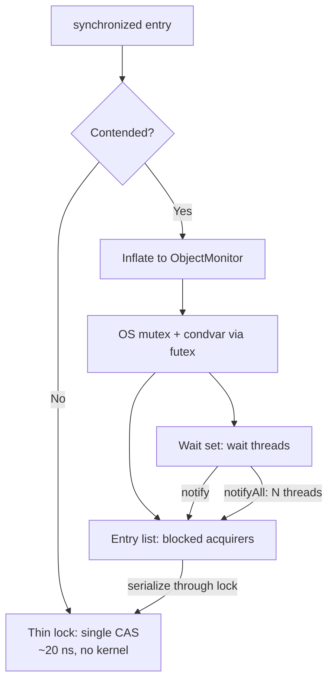
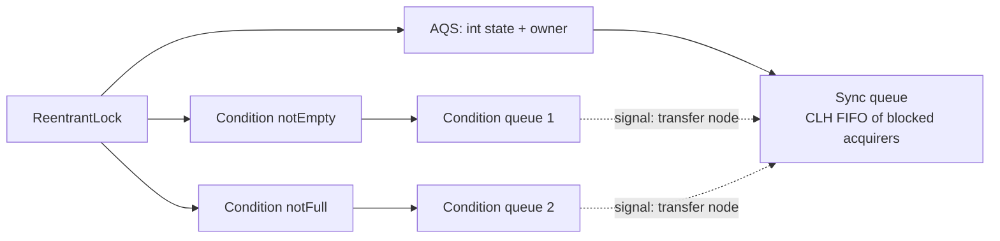

# Monitor Object — Professional Level

> **Source:** POSA2 — *Pattern-Oriented Software Architecture, Vol. 2* (Schmidt et al.) · Doug Lea, *Concurrent Programming in Java*
> **Category:** [Concurrency](../README.md) — *"Patterns for coordinating work across threads, cores, and machines."*
> **Prerequisite:** [senior](senior.md)

## Table of Contents

1. [Introduction](#introduction)
2. [Internals: How `synchronized` and AQS Actually Work](#internals-how-synchronized-and-aqs-actually-work)
3. [Memory Model and Visibility](#memory-model-and-visibility)
4. [Performance: Lock Acquisition Cost Anatomy](#performance-lock-acquisition-cost-anatomy)
5. [Performance: Contention, Convoying, and Wakeup Cost](#performance-contention-convoying-and-wakeup-cost)
6. [Performance: Virtual Threads and Pinning](#performance-virtual-threads-and-pinning)
7. [Cross-Language Comparison](#cross-language-comparison)
8. [Microbenchmark Anatomy](#microbenchmark-anatomy)
9. [Diagrams](#diagrams)
10. [Related Topics](#related-topics)

---

## Introduction

At this level you need to explain *why* a Monitor costs what it costs, down to the JVM and CPU. The right lock choice, the difference between a 25 ns uncontended acquire and a 10 µs contended one, why `notifyAll()` on 500 waiters tanks a tail latency, and why a `synchronized` block can quietly pin a virtual thread and starve a carrier — these are professional-grade concerns that decide whether a service holds its SLO under load. We'll dissect a real Monitor implementation (`ArrayBlockingQueue` / AQS), the memory-model machinery, the performance physics, and how the pattern manifests across Java, C++, Go, and POSIX.

## Internals: How `synchronized` and AQS Actually Work

**Intrinsic locks (`synchronized`).** Every Java object header carries a *mark word* that doubles as lock state. The JVM uses a tiered locking scheme:
- **Thin / lightweight lock:** uncontended case. Acquiring uses a single CAS to install a pointer to a lock record on the acquiring thread's stack into the mark word. No OS involvement — on the order of tens of nanoseconds.
- **Inflation to a heavyweight monitor:** on contention, the lock *inflates* into an OS-level monitor (an `ObjectMonitor` in HotSpot) backed by a native mutex + condition variable. Now blocking involves a kernel transition (`futex` on Linux), parking the thread — microseconds, plus a context switch.
- **Biased locking** (single-thread fast path) existed historically but was **deprecated and disabled by default in JDK 15+** and removed later because it hurt the common multi-thread case and complicated the JVM.

An inflated `ObjectMonitor` maintains: an owner, an **entry list** (threads blocked trying to acquire) and a **wait set** (threads in `wait()`). `notify()` moves one thread from the wait set to the entry list; `notifyAll()` moves all of them — they then *contend* for the lock one at a time. This is exactly why `notifyAll()` on a deep wait set is expensive: N threads get unparked and serialize through one lock.

**Explicit locks (`ReentrantLock`, `Condition`)** are built on **AbstractQueuedSynchronizer (AQS)**. AQS holds:
- An `int` **state** (for `ReentrantLock`: 0 = free, >0 = hold count for reentrancy; the owner thread is tracked separately).
- A **CLH-based FIFO wait queue** of nodes, one per blocked thread, linked and updated via CAS.
- `Condition` objects each maintain their **own** singly-linked condition queue; `await()` moves the current thread's node from the sync queue to that condition queue, `signal()` transfers it back.

Acquire is a CAS on `state`; failure enqueues a node and `LockSupport.park()`s. Release sets `state` and `unpark()`s the successor. AQS is the shared substrate beneath `ReentrantLock`, `Semaphore`, `CountDownLatch`, `ReentrantReadWriteLock`, and `ArrayBlockingQueue`'s lock — learning it explains all of them.

**`ArrayBlockingQueue` dissected:** one `ReentrantLock`, two `Condition`s (`notEmpty`, `notFull`), a circular array, and `putIndex`/`takeIndex`/`count`. `put` awaits `notFull`, enqueues, `signal()`s `notEmpty`. It uses `signal()` (not `signalAll`) safely *because the conditions are separated* — the senior-level lesson realized in production code.

## Memory Model and Visibility

The JMM defines a **synchronizes-with / happens-before** partial order. The monitor rule: *an unlock on monitor M synchronizes-with every subsequent lock on M.* Combined with program order, this means everything the unlocking thread did is visible to the locking thread.

At the hardware level this is implemented with **memory barriers (fences)**:
- A monitor **acquire** compiles to a *load-acquire* barrier — no subsequent load/store may be hoisted above it.
- A monitor **release** compiles to a *store-release* barrier — no prior load/store may sink below it; on x86 this is largely free for stores due to TSO, but the lock prefix / `mfence` is emitted where the model requires it (e.g. `volatile` writes followed by `volatile` reads). On weakly-ordered ISAs (ARM/Power), explicit `dmb`/`lwsync`/`isync` are emitted — locks are measurably more expensive there.

`volatile` provides the *same* happens-before edge for a single variable (volatile write synchronizes-with subsequent volatile read of that variable) but **no atomicity for read-modify-write** and no mutual exclusion. The professional distinction: use `volatile` for a flag observed across threads; use a Monitor when multiple fields form an invariant or when you need to *block* on a condition.

**`final` field semantics** interact too: a properly constructed object's `final` fields are visible without synchronization after the constructor completes — but *only* if the reference doesn't escape during construction. Monitors don't change this, but the same publication discipline applies to objects stored into Monitor-guarded state.

## Performance: Lock Acquisition Cost Anatomy

Approximate costs (order-of-magnitude, modern x86; ARM higher on barriers):

| Operation | Cost | Notes |
|-----------|------|-------|
| Uncontended thin-lock acquire (`synchronized`) | ~10–25 ns | single CAS, stays in cache |
| Uncontended `ReentrantLock.lock()` | ~15–30 ns | CAS on AQS state |
| Contended acquire (park/unpark) | ~1–10 µs | kernel `futex`, context switch |
| `signal()` / `notify()` one waiter | ~1–3 µs | one unpark + reschedule |
| `signalAll()` / `notifyAll()` of N waiters | ~N × unpark | thundering herd; tail-latency killer |
| Cache-line bounce on the lock word | ~100+ ns/transfer | contended CAS ping-pongs the line across cores |

The dominant *hidden* cost under contention is **cache coherence traffic**: the lock word's cache line bounces between cores (MESI invalidations) on every contended CAS. This is why a lock that's "fast" in a single-thread microbenchmark collapses at 32 cores — you're benchmarking the coherence fabric, not the lock logic.

## Performance: Contention, Convoying, and Wakeup Cost

- **Convoying:** if the lock holder is descheduled (page fault, GC pause, preemption) while holding the Monitor, *all* waiters stall for the full off-CPU duration. A 10 ms GC pause under the lock becomes 10 ms added to every queued request. Mitigation: minimize time-under-lock; never allocate large objects or do I/O inside the critical section.
- **Thundering herd from `notifyAll()`:** the fix is dedicated `Condition`s + `signal()`, or a design where only the relevant single waiter is woken. Measure wait-set depth in production; a deep wait set + `notifyAll()` is a latency landmine.
- **Lock fairness:** `new ReentrantLock(true)` enforces FIFO, eliminating starvation but typically *halving* throughput because it disables barging (a thread that could grab a just-freed lock must instead yield to the queue head). Default unfair locks let a running thread barge — higher throughput, possible starvation. Professional rule: default to unfair; switch to fair only with measured starvation and an SLO that demands it.
- **Adaptive spinning:** HotSpot spins briefly before parking on a contended monitor, betting the holder releases soon — cheaper than a park/unpark round trip for short critical sections. This is why *short* critical sections are disproportionately cheaper: they stay in the spin regime and never hit the kernel.

## Performance: Virtual Threads and Pinning

Project Loom (virtual threads, JDK 21+) changes the calculus. A virtual thread blocked on `ReentrantLock`/`Condition` **unmounts** from its carrier — cheap, scalable, millions of waiters possible. But a virtual thread blocked inside a **`synchronized`** block historically **pins** the carrier OS thread (it cannot unmount while holding the intrinsic monitor's native frame), starving the carrier pool and defeating Loom's scalability.

Professional guidance for virtual-thread-heavy services:
- **Prefer `ReentrantLock` over `synchronized`** for Monitors on the hot path — `ReentrantLock` does not pin.
- JDK 24 (JEP 491) **removed most `synchronized` pinning**, but mixed-version fleets and edge cases mean explicit locks remain the safer default for high-concurrency Loom workloads.
- Keep critical sections short regardless — even unmounting has overhead, and a contended Monitor still serializes virtual threads just as it serializes platform threads.

## Cross-Language Comparison

| Language | Monitor realization | `while`-loop rule? | Notes |
|----------|---------------------|--------------------|-------|
| **Java** | `synchronized` + `wait`/`notifyAll`; `ReentrantLock` + `Condition` | Yes (Mesa, spurious wakeups) | Object-level intrinsic monitor; AQS for explicit |
| **C++** | `std::mutex` + `std::condition_variable` | Yes — use `cv.wait(lock, pred)` (loop built in) | `condition_variable` permits spurious wakeups; predicate form is mandatory style |
| **C / POSIX** | `pthread_mutex_t` + `pthread_cond_t` | Yes — `while (!pred) pthread_cond_wait(...)` | Spurious wakeups explicitly permitted by the standard |
| **C#/.NET** | `lock` (Monitor class) + `Monitor.Wait`/`Pulse`/`PulseAll` | Yes | `Monitor` is the literal name; same Mesa semantics |
| **Go** | Idiomatically channels (CSP); `sync.Mutex` + `sync.Cond` exist | Yes for `sync.Cond` | Community prefers channels over condition variables |
| **Python** | `threading.Lock` + `threading.Condition` | Yes — `while not pred: cond.wait()` | GIL serializes bytecode but does NOT remove the need for the loop |
| **Rust** | `Mutex<T>` + `Condvar` | Yes — `cvar.wait_while(guard, |s| !pred)` | Lock *owns* the data (`Mutex<T>`), so unsynchronized access is a compile error |

The universal across every row: **wait inside a loop re-checking the predicate** (Mesa semantics + spurious wakeups). Rust is notable for encoding the Monitor's "data only accessible under lock" invariant into the *type system* — `Mutex<T>` makes the unsynchronized-read bug a compile error rather than a runtime data race.

### Equivalent C++ and Java side by side

```cpp
// C++: predicate form hides the while-loop, but it IS a loop
std::unique_lock<std::mutex> lk(m);
not_empty_.wait(lk, [&]{ return !q.empty(); });   // re-checks predicate
T v = std::move(q.front()); q.pop();
not_full_.notify_one();
```

```java
// Java: the while-loop is explicit
lock.lock();
try {
    while (q.isEmpty()) notEmpty.await();          // re-checks condition
    T v = q.poll();
    notFull.signal();
} finally { lock.unlock(); }
```

## Microbenchmark Anatomy

Benchmarking a Monitor correctly is harder than the Monitor itself. A JMH harness:

```java
@State(Scope.Group)
public class BufferBench {
    BoundedBuffer<Integer> buf = new BoundedBuffer<>(1024);

    @Benchmark @Group("g") @GroupThreads(4)
    public void producer() throws InterruptedException { buf.put(1); }

    @Benchmark @Group("g") @GroupThreads(4)
    public Integer consumer() throws InterruptedException { return buf.take(); }
}
```

Pitfalls that produce **lies**:
- **No warmup → measuring the interpreter / thin-lock-before-inflation.** Always warm up so the JIT compiles and the lock reaches steady contention state.
- **Single-threaded microbenchmark of a lock.** Uncontended acquire (~20 ns) tells you nothing about the 10 µs contended path that dominates production. Benchmark *at* the contention level you'll deploy.
- **Coordinated omission.** Measuring throughput hides tail latency; record the *latency distribution* (HdrHistogram), because a Monitor's p999 under `notifyAll` herd is where SLOs die.
- **Dead-code elimination.** The JIT removes work whose result is unused; consume results via `Blackhole`.
- **False sharing.** Benchmark counters on the same cache line as the lock word inflate contention artificially; pad with `@Contended`.
- **CPU pinning / frequency scaling.** Turbo and migration add noise; pin threads and disable turbo for stable numbers.

The professional deliverable from a Monitor benchmark is not "ops/sec" but a **contention curve**: throughput and p99/p999 latency vs thread count. The knee in that curve is your serialization ceiling — the architectural fact that drives the [migration](senior.md#migration-patterns) decision.

## Diagrams

**Intrinsic monitor inflation path:**



**AQS structure under `ReentrantLock` + `Condition`:**



## Related Topics

- [Active Object](../01-active-object/professional.md) — internals of the request-queue + scheduler; the threaded alternative to the Monitor's caller-thread model.
- [Producer–Consumer](../06-producer-consumer/professional.md) — performance of the Monitor-backed queue as a system seam.
- [Balking](../11-balking/professional.md) — non-blocking guard semantics atop Monitor state.
