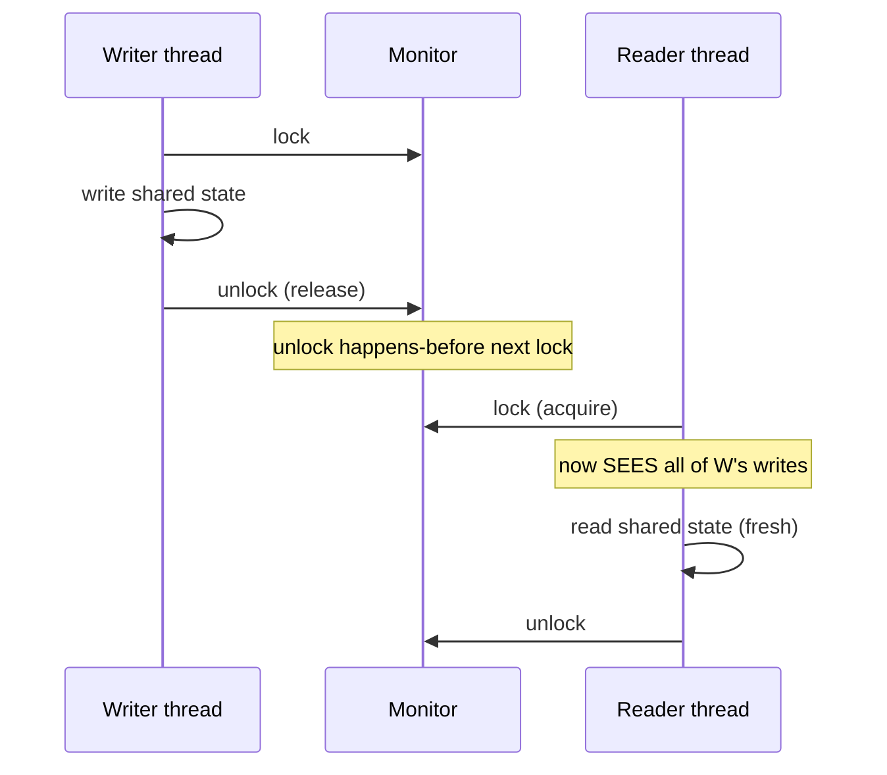

# Monitor Object — Senior Level

> **Source:** POSA2 — *Pattern-Oriented Software Architecture, Vol. 2* (Schmidt et al.) · Doug Lea, *Concurrent Programming in Java*
> **Category:** [Concurrency](../README.md) — *"Patterns for coordinating work across threads, cores, and machines."*
> **Prerequisite:** [middle](middle.md)

## Table of Contents

1. [Introduction](#introduction)
2. [Monitor Object at Architectural Scale](#monitor-object-at-architectural-scale)
3. [Scaling Deep-Dive: From One Lock to Many](#scaling-deep-dive-from-one-lock-to-many)
4. [Concurrency Deep Dive: Memory Model & Happens-Before](#concurrency-deep-dive-memory-model--happens-before)
5. [Testability Strategies](#testability-strategies)
6. [When Monitor Object Becomes a Problem](#when-monitor-object-becomes-a-problem)
7. [Code Examples — Advanced](#code-examples--advanced)
8. [Real-World Architectures](#real-world-architectures)
9. [Pros & Cons at Scale](#pros--cons-at-scale)
10. [Trade-off Analysis Matrix](#trade-off-analysis-matrix)
11. [Migration Patterns](#migration-patterns)
12. [Diagrams](#diagrams)
13. [Related Topics](#related-topics)

---

## Introduction

A senior engineer rarely *adds* a Monitor Object — the codebase is full of them already, mostly as `synchronized` methods written years ago. The senior job is judgment: deciding when an object-wide lock is the right correctness boundary, when it has silently become the system's scalability ceiling, and how to migrate off it without introducing the very races it was preventing. This level treats the Monitor not as a coding pattern but as an *architectural decision about your concurrency granularity* — and grounds that decision in the Java Memory Model, because at scale the difference between "works on my laptop" and "corrupts data under load on a 64-core box" is happens-before reasoning, not luck.

## Monitor Object at Architectural Scale

The Monitor Object sits at the **finest granularity** of a spectrum of concurrency-control strategies:

```
single global lock  <  per-object Monitor  <  lock striping  <  lock-free / CAS  <  shared-nothing / actors
        (simplest)                                                              (most scalable)
```

Architecturally, every Monitor Object is a **serialization point**. Amdahl's Law is brutal here: if 5% of your request path is serialized through one hot Monitor, your *maximum* speedup is 20× no matter how many cores you add. The senior question is never "is this Monitor correct?" — it's "what fraction of my critical path does this serialization point own, and is that acceptable at target load?"

Three architectural roles a Monitor plays well:
- **Invariant boundary.** A small object with a tight multi-field invariant (a bounded buffer's `head/tail/count`) is *correctly* a Monitor — splitting its lock would break the invariant.
- **Handoff point.** The Monitor-backed blocking queue between thread pools is the load-bearing seam of nearly every server: front-end threads enqueue, worker threads dequeue, the queue absorbs bursts.
- **Coordination primitive.** Latches, barriers, and one-shot gates are Monitors; their contention is low because they fire rarely.

Where Monitors go wrong architecturally is when a *coarse* object (a whole cache, a whole session manager) becomes a single lock that every request must pass through.

## Scaling Deep-Dive: From One Lock to Many

When profiling shows a Monitor is the bottleneck (high `BLOCKED` thread time, lock contention in async-profiler), the migration ladder is:

**1. Shrink the critical section.** Often the cheapest win. Compute outside the lock, mutate inside. Move I/O, serialization, and allocation out of the guarded block.

**2. Split conditions.** If `notifyAll()` is causing a thundering herd, move to `ReentrantLock` + dedicated `Condition`s so wakeups are scoped.

**3. Lock striping.** Replace one Monitor over N entries with M Monitors, each owning a partition (`ConcurrentHashMap`'s historical design). Contention drops ~M×, but **cross-stripe invariants are lost** — you can no longer atomically touch two stripes. This is the single biggest correctness trap in the migration.

**4. Read/write separation.** For read-mostly state, a `StampedLock`'s optimistic read lets readers run with *zero* contention in the common case, validating after the fact. A Monitor can't do this — every read takes the exclusive lock.

**5. Lock-free.** Replace the Monitor with atomic CAS loops or immutable copy-on-write. Maximum scalability, maximum subtlety; reserve for proven hot paths.

The senior discipline: **don't skip rungs**. Most "the Monitor is too slow" complaints are solved at rung 1 (the critical section was doing JSON serialization under the lock).

## Concurrency Deep Dive: Memory Model & Happens-Before

A Monitor Object gives you *two* guarantees, and engineers routinely remember only the first.

**1. Mutual exclusion** — one thread in the critical section at a time.

**2. Visibility / ordering** — via the **Java Memory Model (JMM)**: *unlocking a monitor happens-before every subsequent lock of that same monitor.* Concretely, all writes a thread makes while holding the lock are **visible** to the next thread that acquires it, and the compiler/CPU may not reorder across the lock boundary in a way that breaks this.

This is why an *unsynchronized* reader of shared mutable state is a bug even if writes are synchronized: without acquiring the same lock, the reader has **no happens-before edge** to the writer and may observe a stale value, a torn `long`/`double`, or a partially-constructed object — indefinitely, not just briefly.

```java
// BROKEN: writer synchronized, reader not → no happens-before edge
public synchronized void set(int v) { this.value = v; }
public int get() { return this.value; }   // may see stale value FOREVER
```

The fix is to synchronize the reader on the *same* monitor, or make the field `volatile` (which establishes its own happens-before edge for that single variable). Note `volatile` gives visibility but **not** atomicity for compound actions — a Monitor gives both.

**Reentrancy and the JMM:** because the lock is reentrant, a thread re-entering doesn't re-establish a happens-before edge against itself — but it doesn't need to; the edges that matter are *between different threads* across the same monitor.

**Mesa semantics, formally:** `notify()` makes the woken thread *eligible* to re-acquire the lock; it does not transfer the lock or guarantee the condition still holds. The happens-before edge is established only when the woken thread actually re-acquires. This is the memory-model justification for the `while` loop, not just an implementation quirk.

## Testability Strategies

Concurrency bugs are probabilistic; testing must force the rare interleavings.

- **Invariant assertions under stress.** Run N producers + M consumers against the Monitor for millions of ops; assert conservation laws (items in == items out, count never negative or > capacity). A `BoundedBuffer` test that never violates `0 <= count <= capacity` across 10M ops is strong evidence.
- **Deterministic interleaving with latches.** Use `CountDownLatch`/`CyclicBarrier` to pin two threads to a specific order and reproduce a known race (e.g. signal-before-wait). This turns a flaky bug into a deterministic test.
- **`jcstress`** (the OpenJDK concurrency stress harness) for memory-model-level claims — it exhaustively probes reorderings the JMM permits and reports observed outcomes.
- **Instrumented locks / interleaving injection.** Tools like `Thread.yield()` injection, `vmlens`, or `Lincheck` (linearizability checker) explore interleavings you'd never hit by chance.
- **Timeout watchdogs.** Wrap blocking tests in a timeout; a hang *is* the failure signal for lost-wakeup and deadlock bugs.
- **Lock-order verification.** Static or runtime checks (e.g. Google's `GuardedBy`/`@LockGraph`, or a custom lock-order tracker) catch nested-monitor and deadlock-ordering violations.

The senior mindset: a passing concurrency test proves *nothing* about correctness; it only fails to disprove it. Pair stress tests with happens-before reasoning.

## When Monitor Object Becomes a Problem

- **Hot single lock.** Profiler shows threads spending more time `BLOCKED` on the monitor than `RUNNABLE`. Throughput is flat as you add cores.
- **Thundering herd.** `notifyAll()` on a deep wait queue wakes hundreds of threads to do one unit of work — context-switch storm.
- **Convoying.** A slow operation under the lock makes every other thread queue behind it; the lock acquisition order serializes the whole pipeline at the slowest member's pace.
- **Priority inversion.** A low-priority thread holds the Monitor while a high-priority thread blocks on it (acute in real-time / latency-SLO systems).
- **Lock-ordering deadlock.** Two Monitors acquired in opposite orders by two threads. Endemic once objects start calling each other's synchronized methods.
- **Composed-operation gaps.** Each method is atomic, but "check-then-act" across *two* method calls is not — callers reintroduce races the Monitor was meant to prevent.

## Code Examples — Advanced

### Read-mostly state: Monitor vs `StampedLock`

A registry read 100:1 over writes. A Monitor serializes reads needlessly. `StampedLock`'s optimistic read removes read-side contention entirely in the happy path:

```java
import java.util.concurrent.locks.StampedLock;

public final class PointCache {
    private final StampedLock sl = new StampedLock();
    private double x, y;

    public void move(double nx, double ny) {       // write: exclusive
        long stamp = sl.writeLock();
        try { x = nx; y = ny; }
        finally { sl.unlockWrite(stamp); }
    }

    public double distanceFromOrigin() {           // read: optimistic
        long stamp = sl.tryOptimisticRead();       // no lock acquired
        double cx = x, cy = y;
        if (!sl.validate(stamp)) {                 // a write happened → fall back
            stamp = sl.readLock();
            try { cx = x; cy = y; }
            finally { sl.unlockRead(stamp); }
        }
        return Math.sqrt(cx * cx + cy * cy);
    }
}
```

This is *not* a Monitor — it deliberately abandons "one thread at a time" for reads. The senior point: knowing when to leave the pattern is as important as knowing it.

### Shrinking the critical section

```java
// BEFORE: serialization + heavy work under the lock
public synchronized void record(Event e) {
    String json = serialize(e);          // CPU-heavy, NO shared state — wrongly under lock
    buffer.add(json);                     // the only line that needs the lock
}

// AFTER: do heavy work first, lock only the mutation
public void record(Event e) {
    String json = serialize(e);          // outside the lock — runs in parallel
    synchronized (this) {
        buffer.add(json);                 // tiny critical section
    }
}
```

Often a 10× throughput improvement with zero change to the synchronization model — just a tighter boundary.

## Real-World Architectures

- **Thread-pool work queues.** `ThreadPoolExecutor`'s `BlockingQueue` is a Monitor handoff between submitting and worker threads — the canonical "Monitor as architectural seam."
- **Connection pools (HikariCP).** A Monitor-style borrow/return with timed waits and a fairness policy; HikariCP famously *minimizes* time under the lock to cut contention.
- **Append-only commit logs.** A single Monitor serializes appends to guarantee total order, then fans out reads lock-free against immutable segments — Monitor for the write path, lock-free for reads.
- **Database buffer-pool latches.** Page latches are short-duration Monitors; contention on hot pages is a classic DB scaling wall, solved with latch-free B-tree variants (Bw-tree).
- **Actor runtimes.** Each actor's mailbox is effectively a Monitor; the actor model *replaces* shared-memory Monitors with per-actor serialization — a shared-nothing escape from the lock.

## Pros & Cons at Scale

| ✓ At scale | ✗ At scale |
|-----------|-----------|
| Strong, easy-to-reason invariant boundary. | Hard serialization point — Amdahl ceiling. |
| JMM gives free visibility + ordering. | Coarse locks convoy and starve. |
| Backpressure for free (bounded blocking). | `notifyAll` thundering herd at depth. |
| Cheap, well-understood, no extra threads. | Composed cross-method ops aren't atomic. |
| Foundation of all `j.u.c` synchronizers. | Lock-ordering deadlocks as objects interact. |

## Trade-off Analysis Matrix

| Dimension | Monitor Object | Lock Striping | StampedLock (read-mostly) | Lock-free (CAS) | Actor / shared-nothing |
|-----------|----------------|---------------|---------------------------|-----------------|------------------------|
| Read scalability | ✗ (serialized) | ~ (per stripe) | ✓ (optimistic) | ✓ | ✓ |
| Write scalability | ✗ | ~ | ✗ | ✓ (low contention) | ✓ |
| Multi-field invariant | ✓ | ✗ (within stripe only) | ✓ | ~ (hard) | ✓ (per actor) |
| Condition blocking | ✓ | ~ | ✗ | ✗ (build your own) | ✓ (mailbox) |
| Implementation difficulty | Low | Medium | Medium | High | Medium |
| Debuggability | High | Medium | Medium | Low | Medium |
| Best fit | Small shared invariant | Partitionable map | Read-heavy snapshot | Single hot counter | Stateful entities |

## Migration Patterns

**Pattern A — Strangle a coarse Monitor with striping.** Introduce a partitioned structure behind the same interface; route by key to per-stripe Monitors. Verify no operation needs two stripes atomically *before* migrating (this is the kill criterion).

**Pattern B — Replace with a `java.util.concurrent` type.** Most hand-rolled bounded buffers should become `ArrayBlockingQueue`/`LinkedBlockingQueue`. Migrate behind the existing method signatures; delete the custom `wait`/`notify` code. Lower risk than it looks — you're swapping in audited Monitor implementations.

**Pattern C — Split read and write paths.** Keep a Monitor for the rare write path; serve reads from an immutable snapshot updated atomically (copy-on-write reference swap). Readers become lock-free; writers stay simple.

**Pattern D — Coarsen *up*.** Sometimes the fix is *fewer* locks: many fine-grained Monitors that are always taken together cause deadlock-ordering bugs; collapsing them into one Monitor removes the ordering problem at the cost of concurrency. Counterintuitive but valid when correctness is failing.

In every migration, the load-bearing artifact is a **stress test asserting the invariant** that runs before and after — it's the only thing that catches a reintroduced race.

## Diagrams

**Concurrency-granularity spectrum and where Monitor sits:**


**Happens-before edge created by a monitor:**



## Related Topics

- [Active Object](../01-active-object/senior.md) — moves execution off the caller's thread; the architectural alternative when methods are long-running.
- [Producer–Consumer](../06-producer-consumer/senior.md) — the Monitor-backed queue as the central architectural seam.
- [Balking](../11-balking/senior.md) — non-blocking fast path layered on Monitor state.
