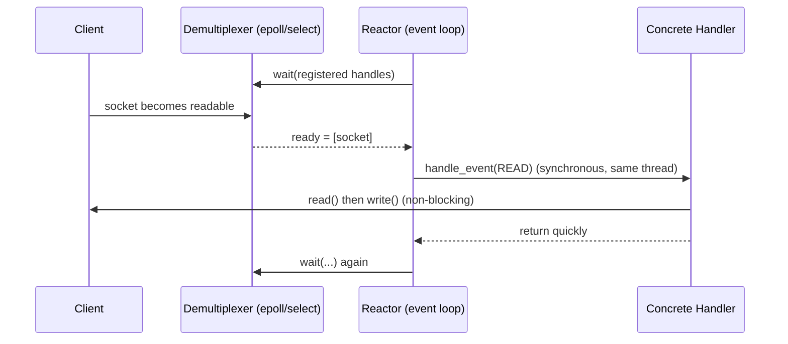
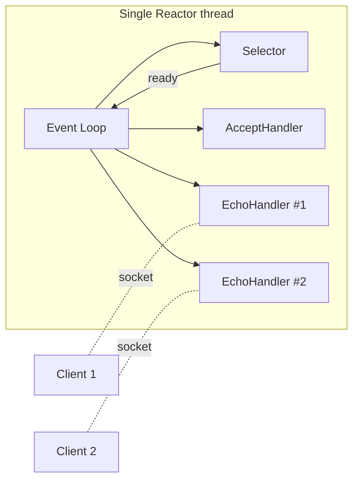

# Reactor — Junior Level

> **Source:** POSA2 — *Pattern-Oriented Software Architecture, Vol. 2* (Schmidt et al.) · Doug Schmidt, *Reactor* paper
> **Category:** [Concurrency](../README.md) — *"Patterns for coordinating work across threads, cores, and machines."*

## Table of Contents

1. [Introduction](#1-introduction)
2. [Prerequisites](#2-prerequisites)
3. [Glossary](#3-glossary)
4. [Core Concepts](#4-core-concepts)
5. [Real-World Analogies](#5-real-world-analogies)
6. [Mental Models](#6-mental-models)
7. [Pros & Cons](#7-pros--cons)
8. [Use Cases](#8-use-cases)
9. [Code Examples](#9-code-examples)
10. [Coding Patterns](#10-coding-patterns)
11. [Clean Code](#11-clean-code)
12. [Best Practices](#12-best-practices)
13. [Edge Cases & Pitfalls](#13-edge-cases--pitfalls)
14. [Common Mistakes](#14-common-mistakes)
15. [Tricky Points](#15-tricky-points)
16. [Test Yourself](#16-test-yourself)
17. [Tricky Questions](#17-tricky-questions)
18. [Cheat Sheet](#18-cheat-sheet)
19. [Summary](#19-summary)
20. [What You Can Build](#20-what-you-can-build)
21. [Further Reading](#21-further-reading)
22. [Related Topics](#22-related-topics)
23. [Diagrams & Visual Aids](#23-diagrams--visual-aids)

---

## 1. Introduction

Imagine a single waiter serving 10,000 tables. The naive approach gives every table its own waiter (one thread per connection) — but 10,000 waiters cost a fortune in salary (memory) and spend most of their time standing idle, waiting for diners to decide. The **Reactor** pattern is the opposite: **one** alert waiter who watches all 10,000 tables at once and walks over only when a table actually raises its hand.

Concretely, the Reactor pattern handles service requests that are delivered **concurrently** to an application from one or more clients. Instead of blocking one thread per client, a single-threaded **event loop** asks the operating system one question — *"which of these thousands of sockets is ready to be read or written right now?"* — and the OS answers with the small set that are ready. The loop then **synchronously dispatches** each ready socket to the handler responsible for it.

This is the engine behind **Node.js** (via libuv), **Netty**'s `NioEventLoop`, **Redis**, **nginx**, and Python's **Twisted**. If you have ever wondered how a single Redis process serves 100,000 requests per second, the answer is: a Reactor.

The defining characteristic is that Reactor is **readiness-based**. The OS tells you *"the socket is now readable"* — and then **you** perform the actual `read()`. (Contrast this with [Proactor](../04-proactor/junior.md), where the OS does the read for you and tells you *"the read is complete, here is the data."*)

## 2. Prerequisites

- **Sockets and file descriptors (fds).** A network connection is, to the OS, just a numbered handle you can read from and write to.
- **Blocking vs non-blocking I/O.** A *blocking* `read()` parks the thread until data arrives. A *non-blocking* `read()` returns immediately — with data, or with "would block."
- **Threads cost memory.** Each OS thread reserves a stack (often ~1 MB). Ten thousand threads = ~10 GB of stack plus heavy context-switching.
- **Basic Java or C.** Examples use Java NIO (`Selector`, `SelectionKey`) and C (`epoll`).
- Helpful: the idea of an **interface** / callback, since handlers are registered objects.

## 3. Glossary

| Term | Meaning |
|------|---------|
| **Handle** | An OS resource identifier — a socket fd, a pipe, a timer fd. The thing we wait on. |
| **Synchronous Event Demultiplexer** | The OS call that blocks until ≥1 handle is ready: `select`, `poll`, `epoll_wait`, `kqueue`. |
| **Reactor (Initiation Dispatcher)** | The component owning the event loop: registers/removes handlers and runs `handle_events()`. |
| **Event Handler** | An interface with `handle_event()` and `get_handle()`. |
| **Concrete Event Handler** | Your application logic — e.g. an `EchoHandler` that reads bytes and writes them back. |
| **Readiness** | "This handle can now be operated on without blocking" (readable / writable). |
| **Interest set** | The events you have asked the demultiplexer to watch for on a handle (READ, WRITE, ACCEPT). |
| **Event loop** | The infinite loop: demultiplex → dispatch → repeat. |

## 4. Core Concepts

The Reactor has exactly **five participants**. Learn these and you understand the pattern.

1. **Handle** — identifies an OS resource (a socket). Multiple handles are managed at once.
2. **Synchronous Event Demultiplexer** — the blocking OS function (`select`/`epoll_wait`). It blocks the calling thread until one or more handles become ready, then returns the ready set.
3. **Reactor** — defines `register_handler()`, `remove_handler()`, and the loop `handle_events()`. It calls the demultiplexer, then for each ready handle, invokes the associated handler.
4. **Event Handler** — the interface (`handle_event(type)`, `get_handle()`).
5. **Concrete Event Handler** — implements the actual service (accept a connection, echo bytes, parse HTTP).

The control flow is **inverted** (Hollywood Principle: "don't call us, we'll call you"). You do not call `read()` in a loop; you register interest in READ, and the Reactor calls *your* handler when read won't block.

```
loop forever:
    ready = demultiplexer.wait(registered_handles)   # blocks here
    for handle in ready:
        handler = lookup(handle)
        handler.handle_event(handle.ready_type)        # synchronous dispatch
```

The word **synchronous** is critical: dispatch happens *in the same thread*, *right now*, *one handle at a time*. The Reactor does not return to waiting until the handler finishes. **This is why a slow handler stalls everything** — the loop's most important rule.

## 5. Real-World Analogies

- **The single attentive waiter.** One waiter scans the whole room. A raised hand = a ready handle. They serve that table briefly, then resume scanning. If one table demands a 20-minute conversation (a blocking handler), every other table waits.
- **A receptionist with a multi-line phone.** Lights blink when calls come in. The receptionist (event loop) picks up the blinking line (ready handle), takes a quick message, and moves on. They must never get stuck on one long call.
- **A lifeguard at a pool.** One lifeguard watches many swimmers. They don't assign one guard per swimmer; they scan and react to the swimmer in trouble (the ready event).

## 6. Mental Models

- **"Ask the OS, don't poll yourself."** The naive non-blocking approach loops over every socket asking "ready? ready? ready?" — burning 100% CPU. The demultiplexer lets the OS do this efficiently and put your thread to sleep until something happens.
- **Readiness, not completion.** Reactor hands you a *notification* ("you can read now"), not *data*. You still do the work. (Proactor hands you the *result*.)
- **One thread, many connections.** The pattern decouples the number of connections (thousands) from the number of threads (one). Concurrency without parallelism.
- **The loop is sacred.** Everything that runs inside the loop must be fast and non-blocking, because it is the only thread.

## 7. Pros & Cons

| ✓ Pros | ✗ Cons |
|--------|--------|
| Handles thousands of connections with one thread — tiny memory footprint | A single blocking/slow handler stalls **all** connections |
| No locks needed for per-connection state (single thread = no data races) | Cannot use multiple CPU cores on its own (single-threaded) |
| Predictable, low latency under high connection counts | Inverted control flow is harder to read/debug than blocking code |
| Coarse-grained concurrency is explicit and centralized | CPU-bound work must be offloaded to a [Thread Pool](../05-thread-pool/junior.md) |
| Portable structure (swap `epoll`/`kqueue`/`select` underneath) | Partial reads/writes must be handled manually — state machines per connection |

## 8. Use Cases

- **High-concurrency network servers**: HTTP servers (nginx), caches (Redis), message brokers, chat/WebSocket servers.
- **I/O-bound workloads** where threads would otherwise sit idle waiting on the network.
- **Connection counts ≫ core counts** (C10K and beyond): 10k–1M sockets.
- **Latency-sensitive services** where thread-context-switch overhead matters.
- **Not** for CPU-bound batch jobs — those want a [Thread Pool](../05-thread-pool/junior.md) for parallelism.

## 9. Code Examples

### Java NIO — a minimal single-threaded echo server (the Reactor)

```java
import java.io.IOException;
import java.net.InetSocketAddress;
import java.nio.ByteBuffer;
import java.nio.channels.*;
import java.util.Iterator;
import java.util.Set;

public class EchoReactor {
    public static void main(String[] args) throws IOException {
        Selector selector = Selector.open();                  // the demultiplexer

        ServerSocketChannel server = ServerSocketChannel.open();
        server.bind(new InetSocketAddress(9090));
        server.configureBlocking(false);                       // non-blocking is mandatory
        server.register(selector, SelectionKey.OP_ACCEPT);     // interest: accept

        System.out.println("Reactor listening on :9090");

        while (true) {                                          // the event loop
            selector.select();                                 // blocks until ≥1 handle ready
            Set<SelectionKey> ready = selector.selectedKeys();
            Iterator<SelectionKey> it = ready.iterator();
            while (it.hasNext()) {
                SelectionKey key = it.next();
                it.remove();                                   // MUST remove — see pitfalls

                if (!key.isValid()) continue;
                if (key.isAcceptable()) accept(selector, key);
                else if (key.isReadable()) echo(key);
            }
        }
    }

    // Concrete handler: accept a new connection, register it for READ
    private static void accept(Selector selector, SelectionKey key) throws IOException {
        ServerSocketChannel server = (ServerSocketChannel) key.channel();
        SocketChannel client = server.accept();                // won't block — it's ready
        if (client == null) return;
        client.configureBlocking(false);
        client.register(selector, SelectionKey.OP_READ, ByteBuffer.allocate(1024));
    }

    // Concrete handler: read available bytes, write them back
    private static void echo(SelectionKey key) throws IOException {
        SocketChannel client = (SocketChannel) key.channel();
        ByteBuffer buf = (ByteBuffer) key.attachment();
        int n = client.read(buf);                              // won't block — it's readable
        if (n == -1) { client.close(); return; }               // peer closed
        buf.flip();
        client.write(buf);                                     // simplistic: assumes full write
        buf.clear();
    }
}
```

Test it: `nc localhost 9090`, type a line, see it echoed back. One thread serves every client.

### C with epoll — the same idea on Linux

```c
#include <sys/epoll.h>
#include <sys/socket.h>
#include <unistd.h>
#include <fcntl.h>
#include <string.h>

#define MAX_EVENTS 1024

int main(void) {
    int listen_fd = /* socket(), bind(), listen(), set non-blocking */ 0;

    int epfd = epoll_create1(0);                       // the demultiplexer
    struct epoll_event ev = { .events = EPOLLIN, .data.fd = listen_fd };
    epoll_ctl(epfd, EPOLL_CTL_ADD, listen_fd, &ev);    // register interest: readable

    struct epoll_event events[MAX_EVENTS];
    for (;;) {                                          // the event loop
        int n = epoll_wait(epfd, events, MAX_EVENTS, -1);  // blocks until ready
        for (int i = 0; i < n; i++) {
            int fd = events[i].data.fd;
            if (fd == listen_fd) {
                int client = accept(listen_fd, NULL, NULL);
                fcntl(client, F_SETFL, O_NONBLOCK);
                struct epoll_event cev = { .events = EPOLLIN, .data.fd = client };
                epoll_ctl(epfd, EPOLL_CTL_ADD, client, &cev);
            } else {
                char buf[1024];
                ssize_t r = read(fd, buf, sizeof buf);   // won't block — it's ready
                if (r <= 0) { close(fd); }               // epoll auto-removes closed fd
                else        { write(fd, buf, r); }        // echo
            }
        }
    }
}
```

### Go — note on style

Go intentionally **hides** the Reactor. The runtime's netpoller *is* an epoll/kqueue Reactor, but it lets you write blocking-looking code with goroutines:

```go
for {
    conn, _ := listener.Accept()
    go handle(conn)          // looks like one-goroutine-per-conn...
}
func handle(c net.Conn) {
    io.Copy(c, c)            // ...but conn.Read blocks the *goroutine*, not the OS thread
}
```

Under the hood, when `c.Read` would block, the goroutine is parked and its fd is registered with the runtime's epoll Reactor. You get Reactor efficiency with blocking-style code — the pattern is built into the runtime.

## 10. Coding Patterns

- **Always configure non-blocking** before registering. A blocking channel inside the loop will freeze it.
- **One handler object per connection** holding that connection's state (its read buffer, parse state). In Java, attach it to the `SelectionKey`.
- **Register/deregister interest dynamically.** Register `OP_WRITE` *only* when you have pending data to send; otherwise the loop spins (see Pitfalls).
- **Lookup table handle → handler.** The Reactor maps the ready handle back to its concrete handler. Java's `SelectionKey.attachment()` is this lookup.

## 11. Clean Code

- Give the loop one job: demultiplex and dispatch. Keep service logic in handlers.
- Name handlers by role: `AcceptHandler`, `EchoHandler`, `HttpRequestHandler`.
- Extract `accept()`, `read()`, `write()` into small methods, as above — the loop body should read like a table of contents.
- Never put `Thread.sleep`, a database call, or a `synchronized` block waiting on a lock inside a handler. Those block the loop.

## 12. Best Practices

- **Keep handlers short and non-blocking.** If a handler must do CPU-heavy or blocking work, hand it to a [Thread Pool](../05-thread-pool/junior.md) and post the result back to the loop.
- **Handle partial reads/writes.** TCP gives you *some* bytes, not necessarily a whole message. Buffer per connection.
- **Always remove the key from `selectedKeys()`** after handling it (Java).
- **Set `SO_REUSEADDR`** so restarts don't fail with "address in use."
- **Close handles and deregister** on errors / peer disconnect to avoid fd leaks.

## 13. Edge Cases & Pitfalls

- **Blocking inside a handler stalls every connection.** The cardinal sin.
- **`OP_WRITE` busy-spin.** A socket is almost always writable, so if you leave `OP_WRITE` registered with nothing to send, `select()` returns instantly forever, pinning a CPU core at 100%. Register write interest only when you have buffered output.
- **Forgetting `it.remove()`** in Java means the same key is "ready" again next loop even when it isn't — leading to spurious dispatches.
- **Partial writes.** `client.write(buf)` may write only half the buffer. You must keep the rest and register `OP_WRITE` to finish later.
- **Thundering herd.** If many threads/processes wait on the same listen socket, all wake on one connection. (Single-Reactor avoids this; multi-Reactor must manage it.)
- **Peer reset (`read` returns -1 or throws).** Close and deregister; don't let one broken socket crash the loop.

## 14. Common Mistakes

- Doing a synchronous database query inside `handle_event`. → Offload it.
- Registering a blocking channel. → Always `configureBlocking(false)`.
- Leaving `OP_WRITE` always on. → Toggle it.
- Assuming one `read()` returns a whole message. → It does not; TCP is a byte stream.
- Catching no exceptions in the loop, so one bad connection kills the server. → Guard each dispatch.

## 15. Tricky Points

- **Readiness can be a lie ("spurious wakeup").** `epoll` may report readable, but a concurrent event made it non-ready — your non-blocking `read` then returns "would block." Always handle that gracefully.
- **Level-triggered vs edge-triggered (epoll).** Level-triggered (default) keeps reporting while data remains; edge-triggered reports only on the *transition* and forces you to drain the socket fully in one go. Getting this wrong silently loses data.
- **Single thread ≠ no concurrency bugs.** You still get logical races between events on different connections if they share mutable state.

## 16. Test Yourself

1. What question does the Reactor ask the OS on each loop iteration?
2. Why must every handler be non-blocking?
3. What is the difference between *readiness* and *completion*?
4. Why is leaving `OP_WRITE` registered dangerous?
5. Name the five participants of the Reactor pattern.
6. Why does a single-threaded Reactor need no locks for per-connection state?

## 17. Tricky Questions

1. A `read()` inside your readable handler returns 0 bytes but doesn't error. Is the connection closed? *(No — 0 from non-blocking read can mean "would block"; -1 means closed.)*
2. You added `OP_WRITE` interest and now CPU is pinned at 100% with no traffic. Why? *(The socket is writable and you never deregistered the interest.)*
3. Your echo server occasionally drops the tail of large messages. Likely cause? *(Partial write — you assumed `write()` flushed the whole buffer.)*

## 18. Cheat Sheet

```
Intent:   one thread serves many I/O sources via OS readiness notification
Engine:   select / poll / epoll / kqueue  (synchronous event demultiplexer)
Loop:     wait(ready) -> for each ready handle -> dispatch to its handler
Model:    READINESS-based (you do the read).  Proactor = COMPLETION-based.
Rule #1:  handlers must be NON-BLOCKING and SHORT.
Rule #2:  register OP_WRITE only when you have data to send.
Java:     Selector + SelectionKey (OP_ACCEPT/OP_READ/OP_WRITE), it.remove()
Used by:  Node/libuv, Netty NioEventLoop, Redis, nginx, Twisted
```

## 19. Summary

The Reactor pattern lets **one thread** serve **many** I/O sources by delegating the "who's ready?" question to an efficient OS demultiplexer and then **synchronously dispatching** each ready event to a registered handler. It is **readiness-based**: the OS says "you can read now," and your handler does the read. It shines for I/O-bound, high-connection-count servers and is the backbone of Node.js, Netty, Redis, and nginx. The one rule you must never break: **handlers must not block**, because they all share the single loop thread.

## 20. What You Can Build

- A single-threaded echo or chat server handling thousands of clients.
- A tiny HTTP/1.0 server that parses requests in a per-connection state machine.
- A toy Redis-style key-value server over TCP.
- A WebSocket broadcast hub.

## 21. Further Reading

- Doug Schmidt, *Reactor: An Object Behavioral Pattern for Demultiplexing and Dispatching Handles for Synchronous Events*.
- *POSA2*, Chapter on the Reactor pattern.
- The C10K problem (Dan Kegel).
- libuv design overview; Netty `NioEventLoop` source.

## 22. Related Topics

- [Proactor](../04-proactor/junior.md) — completion-based sibling.
- [Thread Pool](../05-thread-pool/junior.md) — where you offload blocking/CPU work.
- [Half-Sync/Half-Async](../08-half-sync-half-async/junior.md) — combine a Reactor front with worker threads.
- [Leader/Followers](../09-leader-followers/junior.md) — multi-threaded variant that shares one demultiplexer.

## 23. Diagrams & Visual Aids




