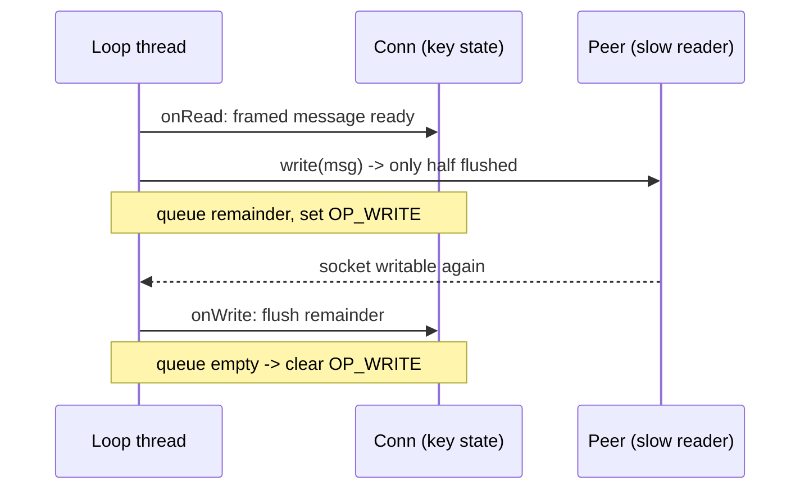
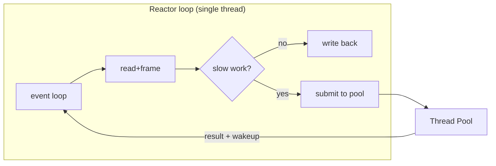

# Reactor — Middle Level

> **Source:** POSA2 — *Pattern-Oriented Software Architecture, Vol. 2* (Schmidt et al.) · Doug Schmidt, *Reactor* paper
> **Category:** [Concurrency](../README.md) — *"Patterns for coordinating work across threads, cores, and machines."*
> **Prerequisite:** [junior](junior.md)

## Table of Contents

1. [Introduction](#1-introduction)
2. [When to Use Reactor](#2-when-to-use-reactor)
3. [When NOT to Use Reactor](#3-when-not-to-use-reactor)
4. [Real-World Cases](#4-real-world-cases)
5. [Code Examples — Production-Grade](#5-code-examples--production-grade)
6. [Deep Dive: Partial Reads, Writes & Backpressure](#6-deep-dive-partial-reads-writes--backpressure)
7. [Deep Dive: Toggling Write Interest Correctly](#7-deep-dive-toggling-write-interest-correctly)
8. [Deep Dive: Offloading Work Without Blocking the Loop](#8-deep-dive-offloading-work-without-blocking-the-loop)
9. [Trade-offs](#9-trade-offs)
10. [Alternatives Comparison](#10-alternatives-comparison)
11. [Refactoring to Reactor](#11-refactoring-to-reactor)
12. [Pros & Cons (Deeper)](#12-pros--cons-deeper)
13. [Edge Cases](#13-edge-cases)
14. [Tricky Points](#14-tricky-points)
15. [Best Practices](#15-best-practices)
16. [Tasks (Practice)](#16-tasks-practice)
17. [Summary](#17-summary)
18. [Related Topics](#18-related-topics)
19. [Diagrams](#19-diagrams)

---

## 1. Introduction

At the junior level you saw a single loop dispatch ready sockets to handlers. At the middle level the interesting problems begin: TCP is a **byte stream**, not a message stream, so reads and writes are *partial*; a writable socket can busy-spin your CPU; and a handler that does real work (parsing, a DB call) can freeze every connection. This level is about writing a Reactor that survives production: correct buffering, correct interest management, and a disciplined boundary between the loop thread and worker threads.

## 2. When to Use Reactor

- **I/O-bound services with many concurrent connections.** The classic fit: thousands of mostly-idle sockets.
- **Latency-sensitive servers** where per-request thread context switches are measurable overhead.
- **Memory-constrained environments** — one loop + small per-connection buffers beats thousands of 1 MB thread stacks.
- **Event-driven protocols** (HTTP keep-alive, WebSocket, MQTT, Redis RESP) where most time is spent waiting for the network.

## 3. When NOT to Use Reactor

- **CPU-bound workloads.** A Reactor gives concurrency, not parallelism. If each request burns CPU, you need a [Thread Pool](../05-thread-pool/junior.md) across cores.
- **Code that must call blocking APIs** (legacy JDBC drivers, blocking file I/O on Linux). Either offload them or pick [Half-Sync/Half-Async](../08-half-sync-half-async/junior.md).
- **Low connection counts.** With 50 connections, one-thread-per-connection is simpler and fast enough — don't pay the complexity tax.
- **Teams unfamiliar with non-blocking discipline.** One accidental blocking call sinks the whole service; the failure mode is global, not local.

## 4. Real-World Cases

- **Redis** — single-threaded Reactor (`ae` event library) over epoll/kqueue; its speed comes from never blocking and never locking.
- **nginx** — one Reactor per worker process, typically one worker per core, each owning a non-blocking event loop.
- **Node.js** — libuv runs a Reactor loop; all your JS callbacks are concrete handlers. A blocking `JSON.parse` of a 100 MB body stalls *every* request.
- **Netty** — `NioEventLoop` is a Reactor; a `Channel` is bound to exactly one loop for its lifetime, so per-channel handlers run lock-free.

## 5. Code Examples — Production-Grade

A Reactor that handles partial reads, frames messages by newline, buffers pending writes, and toggles `OP_WRITE`. This is the shape real servers take.

```java
import java.io.IOException;
import java.net.InetSocketAddress;
import java.nio.ByteBuffer;
import java.nio.channels.*;
import java.util.*;

public class LineEchoReactor {

    // Per-connection state — the "Concrete Event Handler" + its data.
    static final class Conn {
        final SocketChannel ch;
        ByteBuffer in  = ByteBuffer.allocate(4096);
        final Deque<ByteBuffer> out = new ArrayDeque<>();  // pending writes (backpressure queue)
        Conn(SocketChannel ch) { this.ch = ch; }
    }

    private final Selector selector;

    LineEchoReactor(int port) throws IOException {
        selector = Selector.open();
        ServerSocketChannel server = ServerSocketChannel.open();
        server.setOption(StandardSocketOptions.SO_REUSEADDR, true);
        server.bind(new InetSocketAddress(port));
        server.configureBlocking(false);
        server.register(selector, SelectionKey.OP_ACCEPT);
    }

    void run() throws IOException {
        while (true) {
            selector.select();
            Iterator<SelectionKey> it = selector.selectedKeys().iterator();
            while (it.hasNext()) {
                SelectionKey key = it.next();
                it.remove();
                try {
                    if (!key.isValid())        continue;
                    if (key.isAcceptable())    onAccept(key);
                    else {
                        if (key.isReadable())  onRead(key);
                        if (key.isWritable())  onWrite(key);   // only fires if OP_WRITE set
                    }
                } catch (IOException e) {
                    close(key);                                // one bad conn never kills the loop
                }
            }
        }
    }

    private void onAccept(SelectionKey key) throws IOException {
        ServerSocketChannel server = (ServerSocketChannel) key.channel();
        SocketChannel ch;
        while ((ch = server.accept()) != null) {               // drain the accept backlog
            ch.configureBlocking(false);
            ch.register(selector, SelectionKey.OP_READ, new Conn(ch));
        }
    }

    private void onRead(SelectionKey key) throws IOException {
        Conn c = (Conn) key.attachment();
        int n = c.ch.read(c.in);
        if (n == -1) { close(key); return; }                   // -1 = peer closed; 0 = would-block
        c.in.flip();
        // Frame by newline; leftover partial line stays buffered for next read.
        int start = c.in.position();
        for (int i = c.in.position(); i < c.in.limit(); i++) {
            if (c.in.get(i) == '\n') {
                ByteBuffer line = ByteBuffer.allocate(i - start + 1);
                for (int j = start; j <= i; j++) line.put(c.in.get(j));
                line.flip();
                queueWrite(key, c, line);                       // echo the framed line
                start = i + 1;
            }
        }
        c.in.position(start);
        c.in.compact();                                        // keep the partial tail
    }

    private void queueWrite(SelectionKey key, Conn c, ByteBuffer data) throws IOException {
        c.out.addLast(data);
        flush(key, c);
    }

    private void onWrite(SelectionKey key) throws IOException {
        flush(key, (Conn) key.attachment());
    }

    private void flush(SelectionKey key, Conn c) throws IOException {
        while (!c.out.isEmpty()) {
            ByteBuffer head = c.out.peekFirst();
            c.ch.write(head);                                  // may write only part
            if (head.hasRemaining()) {                         // socket buffer full -> backpressure
                key.interestOps(key.interestOps() | SelectionKey.OP_WRITE);
                return;
            }
            c.out.removeFirst();
        }
        // Nothing pending: clear OP_WRITE so we don't busy-spin.
        key.interestOps(key.interestOps() & ~SelectionKey.OP_WRITE);
    }

    private void close(SelectionKey key) {
        try { key.channel().close(); } catch (IOException ignored) {}
        key.cancel();
    }

    public static void main(String[] args) throws IOException {
        new LineEchoReactor(9090).run();
    }
}
```

The three production lessons in this code: (1) read loops keep a partial tail via `compact()`; (2) writes are queued and `OP_WRITE` is toggled on/off precisely; (3) every dispatch is wrapped so a single broken connection is closed, not fatal.

## 6. Deep Dive: Partial Reads, Writes & Backpressure

TCP guarantees *byte ordering*, not *message boundaries*. A 1000-byte message may arrive as 300 + 700, or 1 byte at a time. Two consequences:

- **Read framing.** You must buffer incoming bytes per connection and only act when you have a *complete* protocol unit (a line, an HTTP request, a length-prefixed frame). The leftover partial unit stays in the buffer (`compact()`).
- **Write backpressure.** If the peer reads slowly, the OS send buffer fills and `write()` returns having written *fewer* bytes than offered. You must queue the remainder, register `OP_WRITE`, and finish when the socket becomes writable again. If you instead loop calling `write()` until it all goes out, you've reintroduced blocking. Unbounded queueing is also dangerous — a slow consumer can OOM your server, so cap the queue and either drop the connection or stop reading from the producer.

## 7. Deep Dive: Toggling Write Interest Correctly

A connected TCP socket is *almost always writable* (its send buffer has space). So:

- **Wrong:** register `OP_WRITE` permanently. `select()` returns immediately on every loop, pinning a CPU at 100% even with zero traffic.
- **Right:** the socket's default interest is `OP_READ` only. When you have data to send, try writing it immediately; only if `write()` couldn't flush everything do you add `OP_WRITE`. When the queue drains, *remove* `OP_WRITE`. The pattern is: **OP_WRITE means "I have a pending partial write," not "I might write someday."**

## 8. Deep Dive: Offloading Work Without Blocking the Loop

A handler that needs to do something slow (CPU parsing, a blocking DB call, gzip) must not do it on the loop thread. The pattern:

1. The loop reads the request bytes (fast, non-blocking) and frames a complete message.
2. It submits a task to a [Thread Pool](../05-thread-pool/junior.md): `executor.submit(() -> compute(msg))`.
3. The worker computes off-loop, then **must not** touch the connection directly. Instead it posts the result back to the loop via a task queue and wakes the selector: `taskQueue.add(result); selector.wakeup();`.
4. The loop, at the top of its next iteration, drains the task queue and writes results using its normal (single-threaded, lock-free) write path.

This is exactly the [Half-Sync/Half-Async](../08-half-sync-half-async/junior.md) pattern: an async Reactor front, a sync worker pool behind a queue. The key invariant: **only the loop thread touches channel/selector state.**

## 9. Trade-offs

| Axis | Reactor's position |
|------|--------------------|
| Memory per connection | Very low (a buffer + small state) |
| CPU parallelism | None by default — one core |
| Code complexity | High — inverted flow, manual buffering |
| Latency under load | Low and predictable for I/O-bound |
| Failure blast radius | Global — one blocking call stalls all |
| Locking | None needed for per-connection state |

## 10. Alternatives Comparison

| Approach | Concurrency | Parallelism | Memory | Blocking-safe | Best for |
|----------|------------|-------------|--------|---------------|----------|
| Thread-per-connection | threads | yes | high (1 MB/conn) | yes | low conn count, simple code |
| **Reactor** | events (1 thread) | no | low | no | I/O-bound, high conn count |
| [Proactor](../04-proactor/junior.md) | completions | depends | low | n/a | true async OS (IOCP, io_uring) |
| [Half-Sync/Half-Async](../08-half-sync-half-async/junior.md) | events + threads | yes | medium | yes (workers) | mixed I/O + CPU work |
| [Leader/Followers](../09-leader-followers/junior.md) | shared demux | yes | low | careful | multi-core, no handoff cost |

## 11. Refactoring to Reactor

Migrating a thread-per-connection server:

1. **Make all sockets non-blocking** and introduce a `Selector`.
2. **Externalize per-connection state.** Local variables in the blocking handler (parse position, buffers) become fields on a `Conn` object attached to the key — because the loop no longer has a stack frame per connection.
3. **Turn blocking reads into a read-and-frame step** driven by `OP_READ`.
4. **Turn blocking writes into a queue + `OP_WRITE`** path.
5. **Move CPU/blocking work to a thread pool** with a wake-the-selector callback.
6. **Replace shared locks** with single-thread ownership where state is per-connection.

## 12. Pros & Cons (Deeper)

- **Pro — cache friendliness.** One thread means per-connection state is touched by one core; no cross-core cache-line bouncing or false sharing.
- **Pro — deterministic ordering.** Events on one connection are processed in order, in one thread — easy to reason about.
- **Con — head-of-line blocking.** A handler that takes 5 ms delays *every* other ready event by 5 ms. Tail latency suffers if any handler is slow.
- **Con — debuggability.** Stack traces are shallow (loop → handler) and lose the causal chain across async boundaries.

## 13. Edge Cases

- **`select()` wakeups with empty ready set** (signals, `wakeup()` calls) — loop and continue, don't assume work exists.
- **Cancelled keys** remain in the selector until the next `select()` — operating on a cancelled key throws `CancelledKeyException`; always check `isValid()`.
- **Accept storms** — `accept()` in a `while` loop to drain the backlog; one `OP_ACCEPT` event may represent many pending connections.
- **Half-closed connections** — peer closed write but you still have data to send; handle `read == -1` independently from flushing pending writes.

## 14. Tricky Points

- **`it.remove()` is not optional.** The `selectedKeys()` set is not cleared by the framework. A forgotten `remove()` re-dispatches stale keys.
- **`selector.wakeup()` is the only thread-safe way** to nudge a blocked `select()` from another thread. Calling `register()` from a worker thread can deadlock against an in-progress `select()`.
- **Edge-triggered epoll demands full drain.** If you read once and stop while data remains, you'll never get another notification (until *new* data arrives) and the request hangs.

## 15. Best Practices

- One `Selector` per loop thread; never share a `SocketChannel` across loops.
- Cap per-connection write queues; apply backpressure (stop reading) when full.
- Wrap every dispatch in try/catch; close on error, never let the loop die.
- Use a monotonic timer wheel for per-connection timeouts rather than scanning all connections each tick.
- Measure loop iteration time; if any handler exceeds a budget (e.g. 1 ms), it's a bug.

## 16. Tasks (Practice)

1. Extend `LineEchoReactor` to broadcast each line to *all* connected clients (a chat server).
2. Add an idle-timeout that closes connections silent for 30 s.
3. Add a bounded write queue (max 64 buffers); when full, stop reading from that connection.
4. Replace newline framing with length-prefixed framing (4-byte big-endian length).
5. Offload an artificial 10 ms CPU task to a thread pool and post the result back via `wakeup()`.

## 17. Summary

A production Reactor is defined less by its loop and more by the discipline around it: frame partial reads, queue and backpressure partial writes, toggle `OP_WRITE` precisely, and offload anything slow to a worker pool while keeping all channel/selector mutation on the single loop thread. Break the non-blocking discipline anywhere and the failure is global. Respect it and one thread serves tens of thousands of connections with low, predictable latency.

## 18. Related Topics

- [Proactor](../04-proactor/junior.md) — when the OS does the I/O for you.
- [Thread Pool](../05-thread-pool/junior.md) — the offload target.
- [Half-Sync/Half-Async](../08-half-sync-half-async/junior.md) — Reactor + worker pool combined.
- [Leader/Followers](../09-leader-followers/junior.md) — multi-threaded demultiplexing.

## 19. Diagrams




