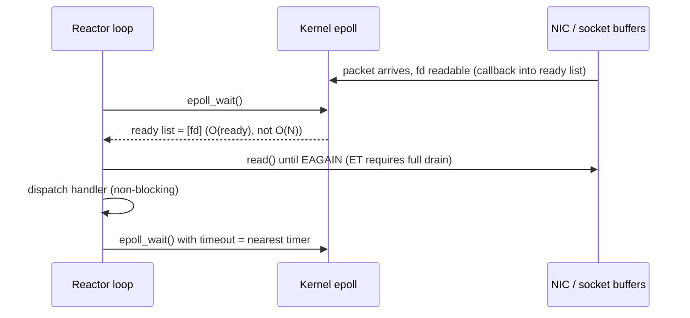
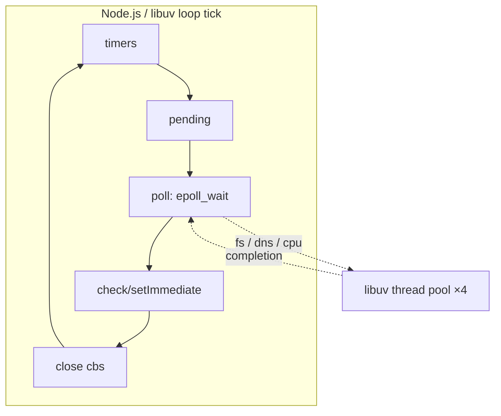

# Reactor — Professional Level

> **Source:** POSA2 — *Pattern-Oriented Software Architecture, Vol. 2* (Schmidt et al.) · Doug Schmidt, *Reactor* paper
> **Category:** [Concurrency](../README.md) — *"Patterns for coordinating work across threads, cores, and machines."*
> **Prerequisite:** [senior](senior.md)

## Table of Contents

1. [Introduction](#1-introduction)
2. [Internals: epoll, the Engine Beneath](#2-internals-epoll-the-engine-beneath)
3. [Internals: libuv, Netty NioEventLoop, Redis ae](#3-internals-libuv-netty-nioeventloop-redis-ae)
4. [Memory Model and Visibility](#4-memory-model-and-visibility)
5. [Performance: select vs poll vs epoll vs kqueue](#5-performance-select-vs-poll-vs-epoll-vs-kqueue)
6. [Performance: C10K to C10M](#6-performance-c10k-to-c10m)
7. [Cross-Language Comparison](#7-cross-language-comparison)
8. [Microbenchmark Anatomy](#8-microbenchmark-anatomy)
9. [Diagrams](#9-diagrams)
10. [Related Topics](#10-related-topics)

---

## 1. Introduction

At the professional level the Reactor is no longer a pattern you implement — it is a pattern whose *implementation in the OS and runtime* you must understand to diagnose production pathologies: a loop pinned at 100% CPU with no traffic, p99 latency cliffs, `epoll_wait` returning storms of spurious events, or a "single-threaded" Redis suddenly bottlenecked on `read()`. This level dissects the engines (`epoll`, `kqueue`, libuv, `NioEventLoop`), the memory-model rules that make cross-thread offload correct, and the measurement methodology that separates real wins from noise.

## 2. Internals: epoll, the Engine Beneath

`epoll` is a kernel data structure (an interest list + a ready list) that solves `select`/`poll`'s fundamental scaling flaw: those scan *all* registered fds on every call (O(N)), whereas `epoll` returns only the *ready* ones (O(ready)).

- **`epoll_create1`** allocates the kernel object.
- **`epoll_ctl(ADD/MOD/DEL)`** mutates the interest list once per change — not per wait. The kernel hooks each registered fd's wait queue, so readiness is delivered by *callback* into `epoll`'s ready list, not by polling.
- **`epoll_wait`** copies out only the ready descriptors. Cost is O(number-ready), independent of the millions registered.

**Level-triggered (LT, default)** reports readiness as long as the condition holds: if 4 KB is buffered and you read 1 KB, the next `epoll_wait` reports readable again. Simple and forgiving.

**Edge-triggered (ET)** reports only the *transition* from not-ready to ready. After an ET notification you **must** read until `EAGAIN`, or the remaining bytes sit unnoticed until *new* data triggers another edge — a classic hang. ET reduces wakeups (fewer syscalls) and is the high-performance choice, but requires draining loops and non-blocking fds. `EPOLLONESHOT` disables an fd after one event until re-armed — essential when multiple threads share one epoll to prevent two threads handling the same fd.

**Thundering herd** on a shared listen fd: pre-4.5 kernels woke *every* waiter on one connection. `EPOLLEXCLUSIVE` (Linux 4.5+) wakes only one; `SO_REUSEPORT` sidesteps it entirely by giving each reactor its own listen socket with in-kernel hashing.

## 3. Internals: libuv, Netty NioEventLoop, Redis ae

**libuv (Node.js).** A portable Reactor: `epoll` on Linux, `kqueue` on BSD/macOS, IOCP on Windows (where it emulates a Reactor over a Proactor). The loop has *phases* per tick: timers → pending callbacks → poll (`epoll_wait` with a timeout computed from the nearest timer) → check (`setImmediate`) → close callbacks. Crucially, libuv also owns a **thread pool** (default 4, `UV_THREADPOOL_SIZE`) for operations with no async kernel API — file I/O, DNS (`getaddrinfo`), and user CPU work via `uv_queue_work`. So Node is a Reactor *front* with a [Half-Sync/Half-Async](../08-half-sync-half-async/junior.md) offload behind it.

**Netty `NioEventLoop`.** Wraps a JDK `Selector`. Each loop owns its channels for life (lock-free per-channel handlers). It famously works around the JDK epoll **`Selector.select()` 100%-CPU bug** (a spin where `select` returns 0 immediately in a tight loop) by counting empty selects and *rebuilding the selector* past a threshold. `ioRatio` time-slices between processing I/O events and the task queue so neither starves. On Linux, `EpollEventLoop` bypasses NIO entirely with native epoll + edge-triggered mode for lower overhead.

**Redis `ae`.** A minimal hand-rolled Reactor over `epoll`/`kqueue`/`select`/evport. Single-threaded command execution is *why* every Redis command is atomic — no command can observe another's partial state. Redis 6 added **I/O threads** that parallelize only the socket `read`/`write` and protocol parsing; the command dispatch loop stays single-threaded, preserving atomicity while removing the syscall bottleneck on many-client workloads.

## 4. Memory Model and Visibility

The single-loop design's superpower is that per-connection state needs no synchronization — but that holds *only* while one thread touches it. The moment you offload to a worker pool, the Java Memory Model (and equivalently C++'s `std::memory_order`) governs correctness:

- **The handoff queue must publish.** Enqueueing a result on a `ConcurrentLinkedQueue` (or any `j.u.c` structure) provides a *happens-before* edge: writes the worker did before `offer()` are visible to the loop after `poll()`. A naked field write + `selector.wakeup()` does **not** guarantee the field is visible — `wakeup()` is not specified to establish ordering for arbitrary memory.
- **`volatile` for flags, queues for data.** A `volatile boolean shutdown` is fine for a single flag; bulk results travel via the concurrent queue.
- **No locks on the loop's hot path.** Any `synchronized` or lock acquired by a handler can block the loop on contention — a global stall. Use lock-free MPSC queues for inbound tasks (Netty's `MpscQueue`).
- **False sharing.** When N reactors keep per-loop counters in one array, adjacent counters share a 64-byte cache line and ping-pong between cores. Pad to a cache line (`@Contended` / alignment) — this is why shared-nothing reactor-per-core outperforms shared-state designs.

## 5. Performance: select vs poll vs epoll vs kqueue

| Mechanism | Per-call cost | fd limit | Readiness model | Platform |
|-----------|--------------|----------|-----------------|----------|
| `select` | O(N) scan, copies fd_set each call | `FD_SETSIZE` (1024) | LT | POSIX (legacy) |
| `poll` | O(N) scan, array each call | none (array size) | LT | POSIX |
| `epoll` | O(ready), kernel-resident interest list | ~unlimited | LT + ET, oneshot, exclusive | Linux |
| `kqueue` | O(ready), kernel-resident | ~unlimited | LT + ET; also files/signals/timers | BSD/macOS |
| `io_uring` | O(ready); submission/completion rings, batched syscalls | ~unlimited | completion (Proactor-like) | Linux 5.1+ |

The cliff: `select`/`poll` cost grows with *total* connections even when few are active — at 50k connections with 100 active, you scan 50k entries per call. `epoll`/`kqueue` cost grows only with *active* connections. This is the whole reason C10K demanded epoll. `io_uring` goes further, blurring into [Proactor](../04-proactor/junior.md) territory by batching submissions and delivering completions — reducing syscalls per op toward zero.

## 6. Performance: C10K to C10M

- **C10K (Dan Kegel, ~1999).** 10,000 concurrent connections on one box. Solved by abandoning thread-per-connection for epoll/kqueue Reactors. Today trivial.
- **C10M (~2013).** 10 million connections. Even epoll's per-packet kernel work and context switches become the wall. Techniques: kernel-bypass (DPDK), user-space TCP stacks, `SO_REUSEPORT` reactor-per-core (Seastar), zero-copy (`sendfile`, `splice`, `MSG_ZEROCOPY`), and batching syscalls (`recvmmsg`/`io_uring`). The Reactor structure survives; the I/O substrate beneath it changes.
- **Syscall amortization.** At millions of ops/sec the syscall itself (~hundreds of ns + cache pollution) dominates. `io_uring` batches submissions and completions to amortize this, which is why modern high-end reactors migrate to it.

## 7. Cross-Language Comparison

| Runtime | Reactor engine | Offload for blocking | Programming model |
|---------|---------------|----------------------|-------------------|
| Node.js | libuv (epoll/kqueue/IOCP) | libuv 4-thread pool | callbacks / async-await |
| Java (Netty) | `Selector` / native epoll | user `ExecutorService` | handlers / `ChannelPipeline` |
| Java (Loom) | JVM netpoller (epoll) | virtual-thread scheduler | blocking thread-per-request |
| Go | runtime netpoller (epoll/kqueue) | `GOMAXPROCS` M:N scheduler | blocking goroutines |
| Rust (Tokio) | mio (epoll/kqueue/IOCP) | `spawn_blocking` pool | `async`/`.await` |
| Python (asyncio) | selectors (epoll/kqueue) | `run_in_executor` | `async`/`await` |
| C/C++ | raw epoll/kqueue/io_uring or libevent/libev | manual thread pool | explicit callbacks |

The pattern is universal; the difference is *how much it's hidden*. Go and Loom hide it entirely behind blocking-looking code (the runtime *is* the Reactor). Tokio/asyncio expose it as `async`/`await` (cooperative tasks are concrete handlers, `.await` points are where control returns to the loop). Netty exposes it as explicit handler pipelines. C exposes it raw.

## 8. Microbenchmark Anatomy

Measuring a Reactor honestly requires avoiding the standard traps:

- **Measure loop latency, not just throughput.** Throughput hides head-of-line blocking. Track per-iteration loop time and the delay between fd-ready and handler-start (the *dispatch latency*).
- **Closed vs open loop.** A closed-loop client (send → wait for reply → send) *masks* server overload because the client backs off. Use an **open-loop / constant-arrival** load generator (`wrk2`, not `wrk`) to expose true tail latency; this is the *coordinated omission* problem (Gil Tene) — naive tools omit exactly the slow samples that matter.
- **Report percentiles, never the mean.** A Reactor's pathology is tail latency; report p50/p99/p99.9. Mean throughput can look great while p99.9 is catastrophic because one slow handler stalled a batch.
- **Pin and isolate.** Pin reactor threads to cores (`taskset`/`sched_setaffinity`), isolate cores (`isolcpus`), disable turbo/HT for reproducibility, warm up the JIT before measuring.
- **Count syscalls.** `strace -c` / `perf stat` on `epoll_wait`, `read`, `write` reveals whether you're syscall-bound (then batch with `io_uring`/`recvmmsg`) or compute-bound.
- **Watch for the empty-select spin.** A loop returning instantly with zero ready keys but high CPU is the JDK selector bug or a stuck `OP_WRITE` — `perf top` shows `epoll_wait` hot with zero work done.

## 9. Diagrams

## 10. Related Topics

- [Proactor](../04-proactor/junior.md) — IOCP / io_uring completion model.
- [Half-Sync/Half-Async](../08-half-sync-half-async/junior.md) — the libuv/Netty offload architecture.
- [Leader/Followers](../09-leader-followers/junior.md) — shared-demultiplexer threading with `EPOLLONESHOT`.
- [Thread Pool](../05-thread-pool/junior.md) — sizing the offload pool.
