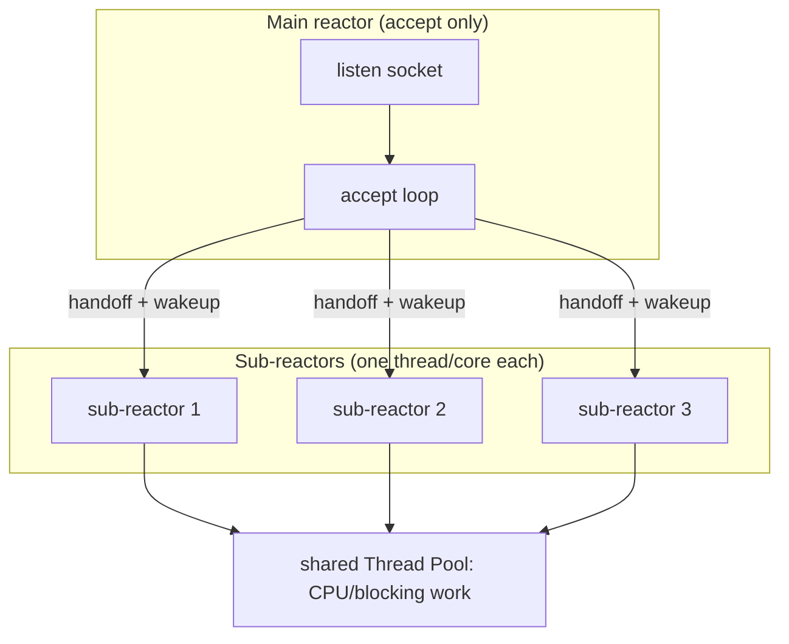
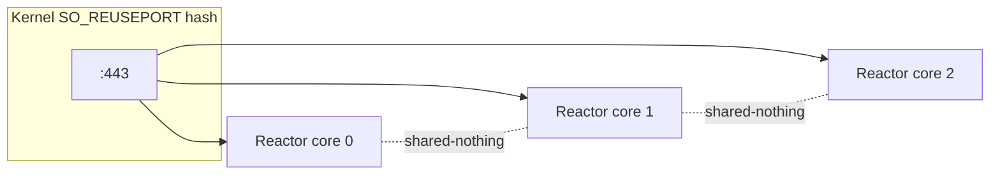

# Reactor — Senior Level

> **Source:** POSA2 — *Pattern-Oriented Software Architecture, Vol. 2* (Schmidt et al.) · Doug Schmidt, *Reactor* paper
> **Category:** [Concurrency](../README.md) — *"Patterns for coordinating work across threads, cores, and machines."*
> **Prerequisite:** [middle](middle.md)

## Table of Contents

1. [Introduction](#1-introduction)
2. [Reactor at Architectural Scale](#2-reactor-at-architectural-scale)
3. [Scaling Deep-Dive: Multi-Reactor & Reactor-per-Core](#3-scaling-deep-dive-multi-reactor--reactor-per-core)
4. [Concurrency Deep Dive](#4-concurrency-deep-dive)
5. [Testability Strategies](#5-testability-strategies)
6. [When Reactor Becomes a Problem](#6-when-reactor-becomes-a-problem)
7. [Code Examples — Advanced](#7-code-examples--advanced)
8. [Real-World Architectures](#8-real-world-architectures)
9. [Pros & Cons at Scale](#9-pros--cons-at-scale)
10. [Trade-off Analysis Matrix](#10-trade-off-analysis-matrix)
11. [Migration Patterns](#11-migration-patterns)
12. [Diagrams](#12-diagrams)
13. [Related Topics](#13-related-topics)

---

## 1. Introduction

A single Reactor saturates exactly one core. On a 64-core machine that wastes 98% of the hardware. The senior-level question is therefore not *"how does the loop work?"* but *"how do I scale a readiness-based, single-threaded primitive across many cores while preserving its lock-free, cache-friendly properties?"* The answer is a small family of multiplexing topologies — main/sub reactors, reactor-per-core with `SO_REUSEPORT`, and the [Leader/Followers](../09-leader-followers/junior.md) variant — each trading affinity, balance, and complexity differently.

## 2. Reactor at Architectural Scale

A Reactor is a *node-local* concurrency primitive; it composes upward into the standard tiers of a high-throughput service:

- **Connection acceptance** — one (or N) acceptor reactors own the listen socket(s).
- **I/O processing** — a pool of I/O reactors, each owning a disjoint subset of connections, each on its own thread/core.
- **Application work** — a bounded [Thread Pool](../05-thread-pool/junior.md) behind the I/O reactors for anything CPU-bound or blocking.

This is Netty's model exactly: a *boss* `EventLoopGroup` (acceptors) and a *worker* `EventLoopGroup` (I/O reactors), each loop owning its channels for life so per-channel handlers stay lock-free.

## 3. Scaling Deep-Dive: Multi-Reactor & Reactor-per-Core

Three established topologies:

**(a) Main/Sub-Reactor (acceptor/handler split).** One *main* reactor does only `accept()`. On a new connection it picks a *sub*-reactor (round-robin or least-loaded) and registers the connection there. Each sub-reactor runs its own loop on its own thread. Pros: clean separation, easy balancing at accept time. Cons: the main reactor is a single accept bottleneck (~hundreds of thousands of accepts/sec — usually fine), and handing a fd to another thread's selector requires a thread-safe register + `wakeup()`.

**(b) Reactor-per-core with `SO_REUSEPORT`.** Each core runs a *complete* reactor — its own listen socket bound to the same port with `SO_REUSEPORT`. The kernel hashes incoming connections across the listeners, spreading accepts in-kernel and **eliminating the thundering herd** (only one listener is woken per connection). This is nginx's modern model and the design behind frameworks like Seastar. Pros: shared-nothing, perfect core affinity, no cross-thread fd handoff, linear scaling. Cons: load balance is by connection hash, so long-lived skewed connections can imbalance cores; requires `SO_REUSEPORT` (Linux 3.9+).

**(c) [Leader/Followers](../09-leader-followers/junior.md).** A pool of threads shares *one* demultiplexer. The current *leader* waits in `select()`; when an event arrives it promotes a follower to leader and then processes the event itself. This avoids both per-connection thread handoff and the extra queue of Half-Sync/Half-Async. Cons: subtle promotion logic, and shared demultiplexer state needs careful synchronization.

The decisive question between (a) and (b): **do connections need to migrate between loops?** If yes (load rebalancing), main/sub is more flexible. If you want true shared-nothing and maximal cache locality, reactor-per-core wins.

## 4. Concurrency Deep Dive

- **The lock-free invariant.** Within one reactor, a channel is owned by exactly one thread for its lifetime, so per-connection state needs no synchronization. Break this — let another thread write to a channel — and you reintroduce locks plus subtle ordering bugs. Cross-loop communication must go through a thread-safe task queue drained *by the owning loop*.
- **Memory visibility across the offload boundary.** When a worker thread produces a result and hands it back via the loop's task queue, the queue (an MPSC structure) must establish a happens-before edge. `selector.wakeup()` plus a `ConcurrentLinkedQueue` gives the needed visibility; a plain field write does not.
- **Timer management.** Scanning every connection for timeouts is O(N) per tick. Use a *hashed timer wheel* (Netty's `HashedWheelTimer`) for O(1) amortized scheduling, owned by the loop.
- **Fairness and starvation.** If you always drain all I/O before processing queued tasks (or vice versa), one side can starve the other. Netty uses an `ioRatio` to time-slice between I/O and task processing. Likewise, a connection emitting an unbounded stream of small messages can starve others within one loop iteration — bound the work per connection per iteration.

## 5. Testability Strategies

- **Abstract the demultiplexer.** Program the loop against a `Demultiplexer` interface; inject a deterministic fake that returns scripted ready-sets. This makes the loop unit-testable without real sockets.
- **Deterministic clocks.** Inject the timer source so timeout logic is testable without sleeping.
- **Property tests for framing.** Feed the read path bytes in adversarial chunk boundaries (1-byte-at-a-time, giant chunks) and assert message framing is identical — this catches the most common Reactor bugs.
- **Loopback integration tests.** Spin up the real reactor on an ephemeral port; assert behavior under concurrent clients and slow-reader backpressure.
- **Chaos: inject a slow handler** in a test and assert your loop-latency monitor fires — the safety net that catches accidental blocking in code review.

## 6. When Reactor Becomes a Problem

- **CPU-bound services.** If 80% of time is computation, a single loop is a one-core ceiling; you need parallelism, not an event loop.
- **Genuinely blocking dependencies** with no async client (old JDBC, some file/DNS paths). Offloading helps but the offload queue becomes the bottleneck and complexity grows.
- **Deeply nested async logic.** Callback chains ("callback hell") obscure control flow; this is a maintainability cost, partly mitigated by async/await, fibers, or virtual threads.
- **Tail-latency sensitivity with heterogeneous handlers.** One occasionally-slow handler inflates p99 for *all* connections sharing that loop. If you can't bound handler time, the shared loop is a liability.

The strategic alternative when blocking is unavoidable and per-task isolation matters: **Java virtual threads (Project Loom)** give thread-per-request code that scales like a Reactor, because the JVM scheduler is itself a Reactor over a carrier-thread pool — effectively pushing the pattern below your application.

## 7. Code Examples — Advanced

### Main/Sub-reactor with thread-safe connection handoff (Java)

```java
// Main reactor: accepts, then hands the channel to a sub-reactor on another thread.
final class SubReactor implements Runnable {
    private final Selector selector = Selector.open();
    private final Queue<SocketChannel> pending = new ConcurrentLinkedQueue<>();
    SubReactor() throws IOException {}

    // Called from the MAIN reactor thread — must be thread-safe.
    void handoff(SocketChannel ch) {
        pending.add(ch);
        selector.wakeup();                 // break the sub-reactor's select()
    }

    public void run() {
        try {
            while (true) {
                selector.select();
                // Drain handoffs ON the owning thread before touching channels.
                for (SocketChannel ch; (ch = pending.poll()) != null; ) {
                    ch.configureBlocking(false);
                    ch.register(selector, SelectionKey.OP_READ, new Conn(ch));
                }
                Iterator<SelectionKey> it = selector.selectedKeys().iterator();
                while (it.hasNext()) {
                    SelectionKey key = it.next(); it.remove();
                    if (!key.isValid()) continue;
                    if (key.isReadable()) /* read+frame */ ;
                    if (key.isWritable()) /* flush */ ;
                }
            }
        } catch (IOException e) { /* loop-fatal: log + restart strategy */ }
    }
    static final class Conn { final SocketChannel ch; Conn(SocketChannel c){ch=c;} }
}
```

The non-negotiable rule visible here: the main thread only *enqueues* and *wakes*; only the sub-reactor's own thread calls `register()` and touches channels. Registering from the foreign thread races against the in-flight `select()` and can deadlock or corrupt key state.

### Reactor-per-core with SO_REUSEPORT (C)

```c
for (int core = 0; core < ncores; core++) {
    pthread_create(&t[core], NULL, reactor_main, (void*)(intptr_t)core);
}

void *reactor_main(void *arg) {
    int listen_fd = socket(AF_INET, SOCK_STREAM | SOCK_NONBLOCK, 0);
    int one = 1;
    setsockopt(listen_fd, SOL_SOCKET, SO_REUSEPORT, &one, sizeof one); // kernel load-balances
    bind(listen_fd, /* same addr:port for every core */ 0, 0);
    listen(listen_fd, 1024);

    int epfd = epoll_create1(0);
    struct epoll_event ev = { .events = EPOLLIN, .data.fd = listen_fd };
    epoll_ctl(epfd, EPOLL_CTL_ADD, listen_fd, &ev);
    /* private epoll + private connections => shared-nothing, no cross-core locks */
    run_event_loop(epfd, listen_fd);
    return NULL;
}
```

## 8. Real-World Architectures

- **nginx** — reactor-per-worker, one worker pinned per core, `SO_REUSEPORT` for in-kernel balancing; worker isolation means a crash takes one core's connections, not the whole server.
- **Redis** — historically pure single Reactor (the whole DB on one loop, which is why commands are atomic); Redis 6+ adds I/O threads that *only* do socket read/write while command execution stays single-threaded — preserving the lock-free data-structure invariant.
- **Netty** — boss/worker `EventLoopGroup`s; `EventLoop` per thread; channel pinned to a loop for life; `ioRatio` to balance I/O vs task time.
- **Envoy** — worker-thread-per-core, each a libevent Reactor, shared-nothing with connection-level load balancing.
- **Seastar (ScyllaDB)** — extreme reactor-per-core, shared-nothing, message-passing between cores; no locks anywhere on the data path.

## 9. Pros & Cons at Scale

| ✓ At scale | ✗ At scale |
|-----------|-----------|
| Reactor-per-core scales ~linearly, shared-nothing | Connection-hash balancing can skew under long-lived heavy conns |
| No locks on the hot path → no contention collapse | One slow handler inflates p99 for the whole loop |
| Memory ~flat in connection count | CPU-bound work still needs a separate pool |
| Crash isolation per worker (multi-process) | Cross-loop handoff adds queues + wakeups + visibility rules |

## 10. Trade-off Analysis Matrix

| Topology | Core scaling | Balance quality | Cross-loop handoff | Cache affinity | Complexity |
|----------|-------------|-----------------|--------------------|----------------|-----------|
| Single Reactor | 1 core | n/a | none | best | low |
| Main/Sub-reactor | linear-ish | good (accept-time) | yes (queue+wakeup) | good | medium |
| Reactor-per-core (REUSEPORT) | linear | kernel-hash | none | best | medium |
| [Leader/Followers](../09-leader-followers/junior.md) | linear | demand-driven | none | good | high |
| [Half-Sync/Half-Async](../08-half-sync-half-async/junior.md) | linear (workers) | queue-driven | yes | medium | medium |

## 11. Migration Patterns

- **Single → reactor-per-core.** Make the reactor shared-nothing first (no global mutable state), then fork N loops with `SO_REUSEPORT`. The hard part is auditing globals (caches, metrics) for cross-loop sharing.
- **Single → main/sub.** Split the accept path from the I/O path; introduce the thread-safe handoff queue + `wakeup()`. Verify no channel is ever touched by two threads.
- **Reactor → Loom/virtual threads.** When blocking dependencies dominate and you want simpler code, replace hand-written async handlers with thread-per-request on virtual threads; the JVM's Reactor sits underneath. Migrate leaf-first, keeping the wire protocol unchanged.
- **Add I/O threads (Redis-style).** Keep application logic single-threaded; parallelize only socket read/write. Lowest-risk way to break a single-loop I/O ceiling without touching data-structure invariants.

## 12. Diagrams





## 13. Related Topics

- [Leader/Followers](../09-leader-followers/junior.md) — shared-demultiplexer multi-threading.
- [Half-Sync/Half-Async](../08-half-sync-half-async/junior.md) — the offload architecture.
- [Thread Pool](../05-thread-pool/junior.md) — the CPU/blocking-work tier.
- [Proactor](../04-proactor/junior.md) — completion-based scaling on IOCP / io_uring.
