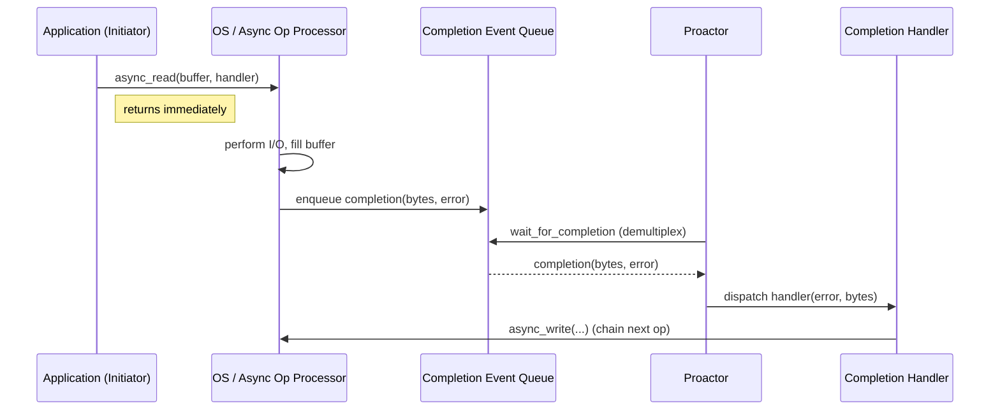
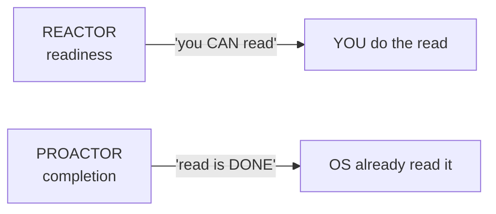

# Proactor — Junior Level

> **Source:** POSA2 — *Pattern-Oriented Software Architecture, Vol. 2* (Schmidt et al.)
> **Category:** [Concurrency](../README.md) — *"Patterns for coordinating work across threads, cores, and machines."*

## Table of Contents

1. [Introduction](#1-introduction)
2. [Prerequisites](#2-prerequisites)
3. [Glossary](#3-glossary)
4. [Core Concepts](#4-core-concepts)
5. [Real-World Analogies](#5-real-world-analogies)
6. [Mental Models](#6-mental-models)
7. [Pros & Cons](#7-pros--cons)
8. [Use Cases](#8-use-cases)
9. [Code Examples](#9-code-examples)
10. [Coding Patterns](#10-coding-patterns)
11. [Clean Code](#11-clean-code)
12. [Best Practices](#12-best-practices)
13. [Edge Cases & Pitfalls](#13-edge-cases--pitfalls)
14. [Common Mistakes](#14-common-mistakes)
15. [Tricky Points](#15-tricky-points)
16. [Test Yourself](#16-test-yourself)
17. [Tricky Questions](#17-tricky-questions)
18. [Cheat Sheet](#18-cheat-sheet)
19. [Summary](#19-summary)
20. [What You Can Build](#20-what-you-can-build)
21. [Further Reading](#21-further-reading)
22. [Related Topics](#22-related-topics)
23. [Diagrams & Visual Aids](#23-diagrams--visual-aids)

---

## 1. Introduction

Most code you have written reads a socket like this: you call `read()`, your thread blocks, the kernel copies bytes into your buffer, and `read()` returns. The thread that asked for the data is the thread that waits for it and the thread that touches it. Simple — but one thread can wait on only one thing at a time, so a server serving ten thousand connections needs roughly ten thousand threads.

The **Proactor** pattern breaks that one-thread-per-connection coupling by inverting *who does the waiting and who does the I/O*. Instead of "ask, then block until done," you say to the operating system: **"Start reading 4 KB into this buffer, and when you have *completely finished*, tell me."** Your thread returns immediately. The OS performs the entire read in the background — including copying the bytes into your buffer — and when the operation **completes**, it places a **completion event** onto a queue. A dispatcher (the **Proactor**) pulls that event off the queue and calls your **completion handler**, handing it the result: how many bytes were transferred and whether an error occurred.

The defining word is **completion**. Proactor is a *completion-based* (asynchronous) model. Its sibling, [Reactor](../03-reactor/junior.md), is a *readiness-based* model: Reactor tells you "this socket is now *readable* — you go do the `read()` yourself," whereas Proactor tells you "the `read()` I started for you is *finished* — here are your bytes." That single difference — readiness vs. completion — ripples through the entire design, and learning to articulate it is the whole point of this topic.

Proactor is the pattern behind **Windows I/O Completion Ports (IOCP)**, **Boost.Asio**, **.NET asynchronous I/O**, and Linux's modern **io_uring**. If you have ever written `await socket.ReadAsync(...)` in C# or `socket.async_read_some(buffer, handler)` in C++, you have used a Proactor whether you knew it or not.

## 2. Prerequisites

Before this topic you should be comfortable with:

- **Blocking vs. non-blocking I/O** — what it means for a syscall to return immediately vs. wait.
- **Callbacks / function objects** — a Proactor *calls you back*; you must be at ease passing a lambda or functor to be invoked later.
- **Sockets and buffers** — `read`/`write`, and the idea that a buffer is just a region of memory the kernel fills or drains.
- **Threads and a thread pool** — Proactor usually runs completion handlers on a small pool of worker threads.
- **[Reactor](../03-reactor/junior.md)** — strongly recommended first. Proactor is best understood *by contrast* with Reactor.

## 3. Glossary

| Term | Meaning |
|------|---------|
| **Asynchronous Operation** | An I/O request (read, write, accept, connect) that runs to completion in the background without blocking the initiating thread. |
| **Asynchronous Operation Processor** | The entity that actually executes the operation — almost always the **OS kernel** (IOCP, io_uring, POSIX aio). |
| **Completion Handler** | Your callback. Invoked when the operation finishes; receives the **result** (bytes transferred + error code). |
| **Completion Event** | A record that "operation X finished with result Y," enqueued when the OS is done. |
| **Completion Event Queue** | The OS-managed queue holding completed events until the Proactor dequeues them. |
| **Asynchronous Event Demultiplexer** | The blocking call that waits for the next completion event (`GetQueuedCompletionStatus` on Windows; `io_uring_wait_cqe` on Linux). |
| **Proactor** | The dispatcher: it blocks on the demultiplexer, dequeues completions, and calls the matching completion handler. |
| **Initiator** | The code that *starts* the async op (e.g., your application calling `async_read`). |
| **`io_context` / `io_service`** | Boost.Asio's name for the Proactor engine you `run()`. |

## 4. Core Concepts

**The lifecycle of one asynchronous read.** Walk it once, slowly:

1. **Initiate.** Your code calls `async_read(socket, buffer, handler)`. This *registers* the operation with the OS and **returns immediately**. No bytes have moved yet.
2. **OS executes.** The kernel performs the read — waits for data to arrive, then copies it **into your buffer**. Your application thread is free to do anything else (or initiate more operations).
3. **Completion enqueued.** When the read fully finishes, the OS posts a completion event onto the completion queue, recording *bytes transferred* and *error status*.
4. **Demultiplex.** A thread sitting in the Proactor's event loop is blocked on the demultiplexer (`GetQueuedCompletionStatus` / io_uring CQ). It wakes up with the next completion.
5. **Dispatch.** The Proactor looks up which completion handler owns this operation and **calls it**, passing the result.
6. **Handle.** Your completion handler runs — the buffer is *already full of valid bytes*. You process them, and typically **initiate the next operation** (chaining reads to keep the connection alive).

**The participants, mapped to the lifecycle:**

```
Application ──initiate──▶ Async Operation Processor (OS kernel)
                              │ performs the I/O
                              ▼
                    Completion Event Queue
                              │
   Proactor ◀─demultiplex─────┘   (blocks on Async Event Demultiplexer)
       │ dispatch
       ▼
  Completion Handler  ◀── receives (bytes_transferred, error)
```

**The one idea to carry forever:** in Proactor, *the OS does the work and reports completion*. In Reactor, *the OS reports readiness and you do the work*. Everything else is a consequence of this.

## 5. Real-World Analogies

- **The restaurant order (Proactor).** You tell the waiter "bring me the steak." You don't go to the kitchen, you don't check whether ingredients are ready — you go back to your conversation. When the steak is *fully cooked and plated*, the waiter brings it to your table. The "completion event" is the waiter arriving with a finished dish. Contrast Reactor: the waiter taps you and says "the kitchen counter is free — go cook your own steak now."

- **Package delivery vs. tracking app.** Proactor is the courier who **rings your doorbell when the package is at your door** (completion). Reactor is the tracking app that says "your package is *out for delivery* — go stand at the pickup point and grab it yourself" (readiness).

- **Drive-through with a number.** You order, you get a number, you pull forward and *wait elsewhere*. When your food is done, your number is called. You never block the order window. The number is the operation handle; "your number is called" is the completion event.

## 6. Mental Models

- **"Fire and get notified."** You fire an operation; you get notified on completion. The gap in between is free time.
- **Completion is a *result*, not a *signal*.** A Proactor completion carries data (`bytes_transferred`, `error`). A Reactor notification carries only "you can now act."
- **Buffer ownership crosses the boundary.** When you initiate an async read, you *lend your buffer to the kernel*. The kernel writes into it asynchronously. **You may not touch or free that buffer until the completion fires** — this is the single most important safety rule (see Pitfalls).
- **Inversion of control.** Your logic is shredded into callbacks. There is no top-to-bottom function that "reads then processes then writes"; instead each step is a handler that initiates the next. This is powerful but harder to read than straight-line blocking code.

## 7. Pros & Cons

| Pros ✓ | Cons ✗ |
|--------|--------|
| ✓ Massive scalability: thousands of connections on a few threads | ✗ Inverted control flow — logic fragmented into callbacks |
| ✓ The OS does the I/O on its own optimized path (zero app threads blocked) | ✗ Harder to debug: stack traces don't show the logical flow |
| ✓ Decouples number of connections from number of threads | ✗ Buffer-lifetime hazards (use-after-free if buffer freed early) |
| ✓ Often the highest-throughput model on Windows (IOCP-native) | ✗ True async I/O support is uneven across platforms |
| ✓ Clean separation: initiation, execution, completion | ✗ Error handling must live in *every* completion handler |

## 8. Use Cases

- **High-concurrency network servers** — web servers, proxies, chat backends, game servers handling 10k–1M connections.
- **Windows server software** — IOCP is the canonical high-performance I/O mechanism on Windows; Proactor is its natural pattern.
- **File and disk I/O at scale** — async file reads/writes (databases, log shippers) where you want overlapping I/O without thread-per-file.
- **Latency-sensitive services** — where blocking a thread per request would balloon thread counts and context-switch overhead.
- **Anything built on Boost.Asio, .NET async, or io_uring** — these *are* Proactors.

## 9. Code Examples

**C++ with Boost.Asio — the canonical Proactor.** An echo session that reads asynchronously and writes back on completion.

```cpp
#include <boost/asio.hpp>
#include <memory>
#include <array>
#include <iostream>

using boost::asio::ip::tcp;

// One session = one connection. Lives as a shared_ptr so it stays alive
// for as long as any async operation referencing it is outstanding.
class EchoSession : public std::enable_shared_from_this<EchoSession> {
public:
    explicit EchoSession(tcp::socket socket) : socket_(std::move(socket)) {}

    void start() { do_read(); }

private:
    void do_read() {
        auto self = shared_from_this();  // keep session alive until completion
        // INITIATE: ask the OS to read into buffer_. Returns immediately.
        socket_.async_read_some(
            boost::asio::buffer(buffer_),
            // COMPLETION HANDLER: called by the Proactor when the read finishes.
            [this, self](boost::system::error_code ec, std::size_t bytes) {
                if (!ec) {
                    do_write(bytes);     // buffer_ is now full of valid bytes
                } // else: connection closed/errored -> session dies, socket closes
            });
    }

    void do_write(std::size_t length) {
        auto self = shared_from_this();
        boost::asio::async_write(
            socket_, boost::asio::buffer(buffer_, length),
            [this, self](boost::system::error_code ec, std::size_t /*bytes*/) {
                if (!ec) do_read();      // chain: keep the connection alive
            });
    }

    tcp::socket socket_;
    std::array<char, 1024> buffer_;      // buffer lives as long as the session
};

int main() {
    boost::asio::io_context io;          // <-- THE PROACTOR engine
    tcp::acceptor acceptor(io, tcp::endpoint(tcp::v4(), 9000));

    std::function<void()> do_accept = [&]() {
        acceptor.async_accept([&](boost::system::error_code ec, tcp::socket sock) {
            if (!ec) std::make_shared<EchoSession>(std::move(sock))->start();
            do_accept();                 // accept the next connection
        });
    };
    do_accept();

    io.run();                            // run the Proactor loop (blocks here)
}
```

**Java with NIO.2 — `AsynchronousSocketChannel` + `CompletionHandler`.**

```java
import java.net.InetSocketAddress;
import java.nio.ByteBuffer;
import java.nio.channels.*;

public class EchoServer {
    public static void main(String[] args) throws Exception {
        // The "Proactor" here is the channel group's thread pool.
        AsynchronousServerSocketChannel server =
            AsynchronousServerSocketChannel.open()
                .bind(new InetSocketAddress(9000));

        // accept() is itself asynchronous: completion handler fires per connection.
        server.accept(null, new CompletionHandler<AsynchronousSocketChannel, Void>() {
            public void completed(AsynchronousSocketChannel ch, Void att) {
                server.accept(null, this);   // re-arm: accept the next client
                readLoop(ch);
            }
            public void failed(Throwable t, Void att) { /* log */ }
        });

        Thread.currentThread().join();       // keep the JVM alive
    }

    static void readLoop(AsynchronousSocketChannel ch) {
        ByteBuffer buf = ByteBuffer.allocate(1024);  // buffer must outlive the op
        // INITIATE async read; completion handler receives bytes-transferred.
        ch.read(buf, buf, new CompletionHandler<Integer, ByteBuffer>() {
            public void completed(Integer n, ByteBuffer b) {
                if (n == -1) { closeQuietly(ch); return; }
                b.flip();
                ch.write(b, b, new CompletionHandler<Integer, ByteBuffer>() {
                    public void completed(Integer w, ByteBuffer bb) {
                        readLoop(ch);        // chain the next read
                    }
                    public void failed(Throwable t, ByteBuffer bb) { closeQuietly(ch); }
                });
            }
            public void failed(Throwable t, ByteBuffer b) { closeQuietly(ch); }
        });
    }

    static void closeQuietly(AsynchronousSocketChannel ch) {
        try { ch.close(); } catch (Exception ignored) {}
    }
}
```

> **io_uring note.** On modern Linux, the truly asynchronous, completion-based equivalent is **io_uring**: you place I/O requests on a **submission queue (SQ)** and the kernel posts results on a **completion queue (CQ)**. Reading the CQ (`io_uring_wait_cqe`) *is* the Proactor's "wait for next completion" step. Boost.Asio can be built on an io_uring backend, making the Asio code above a real Proactor on Linux rather than a Reactor emulation.

## 10. Coding Patterns

- **Chain in the completion handler.** A long-lived connection is a loop expressed as recursion: read → on-completion write → on-completion read. Each handler initiates the next op.
- **`shared_from_this` to extend lifetime (C++).** Capture `auto self = shared_from_this()` in the lambda so the session object can't be destroyed while an async op is pending. This is the idiomatic fix for "object died mid-operation."
- **One buffer per outstanding operation.** Never reuse a buffer that the kernel still owns.
- **Re-arm the acceptor.** Always start the *next* `async_accept` inside the current accept's handler, or you accept exactly one connection and stop.

## 11. Clean Code

- Give handlers intention-revealing names: `on_read_complete`, `on_write_complete` — not anonymous spaghetti.
- Keep each completion handler *small*: validate the error, do one thing, initiate the next op. Push real logic out to named methods.
- Always handle the `error_code` / `failed()` path **first**. The happy path is the exception, not the rule, in network code.
- Encapsulate a connection's whole lifecycle in one class (`Session`). State that the kernel writes into (buffers) lives there, with a lifetime tied to the object.

## 12. Best Practices

- ✓ **Tie buffer lifetime to operation lifetime.** Store the buffer in the session object that lives via `shared_ptr` (C++) or a captured reference (Java).
- ✓ **Always check the error code first** in every handler; treat EOF (`n == -1`, `eof`) as a normal close.
- ✓ **Keep handlers non-blocking.** Never call a blocking syscall inside a completion handler — you'd stall a Proactor worker thread.
- ✓ **Size the worker pool deliberately** (often ~= core count for IOCP). More isn't better.
- ✓ **Initiate the next op before doing slow work**, where ordering allows, to overlap I/O with computation.

## 13. Edge Cases & Pitfalls

- **Buffer freed before completion → use-after-free.** The kernel is still writing into memory you released. This is *the* classic Proactor bug and it crashes intermittently, hours later. **The buffer must outlive the async op.**
- **Object destroyed mid-operation.** Same problem at object granularity: the completion handler is a member of a session that got deleted. Fix with `shared_from_this`.
- **Partial transfers.** `async_read_some` / `read()` may return *fewer* bytes than the buffer holds. Use `async_read` (Asio) for "read exactly N," or loop.
- **Forgetting to re-arm.** Not initiating the next accept/read means the server silently goes dead after one event.
- **Blocking inside a handler.** A `sleep`, a lock contention, or a synchronous DB call inside a completion handler starves the whole Proactor.

## 14. Common Mistakes

- ✗ Allocating a buffer on the **stack** of the initiating function — it's gone the moment the function returns, but the async op is still running.
- ✗ Capturing `this` in a lambda **without** `shared_from_this`, then letting the session go out of scope.
- ✗ Treating a completion as "data is ready, go read it" — no, the data is *already in your buffer*; that's Reactor thinking.
- ✗ Ignoring `bytes_transferred` and assuming the buffer is full.
- ✗ Doing CPU-heavy work in the handler and wondering why latency spikes for *all* connections.

## 15. Tricky Points

- **Who touches the buffer, and when?** In Proactor the *kernel* touches it, *during* the operation, *before* your handler runs. In Reactor *you* touch it, *after* readiness, inside your handler. Memorize this.
- **A completion can fire on a different thread** than the one that initiated the op (any worker in the pool). Shared state needs synchronization or a strand/serialization mechanism.
- **`async_*` returning immediately is not the same as "done."** It means "accepted for later"; the work happens after you return.

## 16. Test Yourself

1. In Proactor, who performs the actual `read()` system call work — your thread or the OS?
2. What two pieces of information does a completion event carry?
3. Why must a buffer passed to `async_read` outlive the call to `async_read` itself?
4. What is the Proactor analog of Boost.Asio's `io_context.run()`?
5. Name the Linux mechanism that gives Proactor-style completion semantics.

## 17. Tricky Questions

1. **"Reactor and Proactor both use an event loop and callbacks — so they're the same, right?"** No. Reactor dispatches on **readiness** ("you can read now"); Proactor dispatches on **completion** ("the read is finished, here are the bytes"). The OS does the I/O in Proactor, you do it in Reactor.
2. **"If `async_read` returns immediately and there's no error, the data is in my buffer, yes?"** No — it returns immediately because the op *hasn't run yet*. The data is valid only inside the completion handler.
3. **"Can I reuse the same buffer for the next read right after calling `async_read`?"** No, not until the previous read's completion fires; the kernel still owns it.

## 18. Cheat Sheet

```
PROACTOR = completion-based async I/O. "OS does the work, calls you when DONE."

Flow:  initiate(async_read, buffer, handler)  -> returns immediately
       OS performs I/O (fills buffer)
       OS enqueues completion event (bytes, error)
       Proactor dequeues (GetQueuedCompletionStatus / io_uring CQ)
       Proactor calls your handler(error, bytes_transferred)

Participants: Async Operation | Async Op Processor (OS) | Completion Handler |
              Completion Event Queue | Async Event Demultiplexer | Proactor

REACTOR  = readiness ("you CAN read")  -> YOU read
PROACTOR = completion ("read is DONE") -> OS already read

RULE #1: buffer must outlive the async op (else use-after-free)
RULE #2: never block inside a completion handler
RULE #3: chain the next op inside the current handler
```

## 19. Summary

The Proactor pattern handles **asynchronous, completion-based** I/O. You **initiate** an operation; the **OS performs the entire I/O** and posts a **completion event** carrying the result; the **Proactor** dispatches that event to your **completion handler**. This decouples connection count from thread count and yields the highest throughput on completion-native platforms (Windows IOCP, io_uring). The price is inverted control flow, harder debugging, and a strict rule that **buffers and objects must outlive their pending operations**. Always contrast it with [Reactor](../03-reactor/junior.md): readiness vs. completion is the whole story.

## 20. What You Can Build

- An **async echo/chat server** in Boost.Asio handling thousands of connections on 1–4 threads.
- A **port-forwarding proxy** that async-reads from one socket and async-writes to another.
- An **async file copier** that overlaps reads and writes.
- A small **HTTP/1.1 server** that parses requests in completion handlers.

## 21. Further Reading

- *POSA2 — Pattern-Oriented Software Architecture, Vol. 2*, Schmidt et al. — the canonical Proactor chapter.
- Boost.Asio documentation — "Proactor design pattern" overview page.
- Microsoft Docs — *I/O Completion Ports*.
- Linux `io_uring` man pages (`io_uring_setup`, `io_uring_enter`).

## 22. Related Topics

- [Reactor](../03-reactor/junior.md) — the readiness-based counterpart; learn both together.
- [Future / Promise](../07-future-promise/junior.md) — completions are often surfaced as futures.
- [Half-Sync/Half-Async](../08-half-sync-half-async/junior.md) — bridges async I/O to sync processing layers.

## 23. Diagrams & Visual Aids




