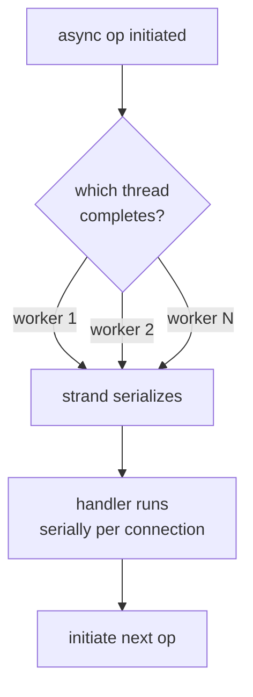
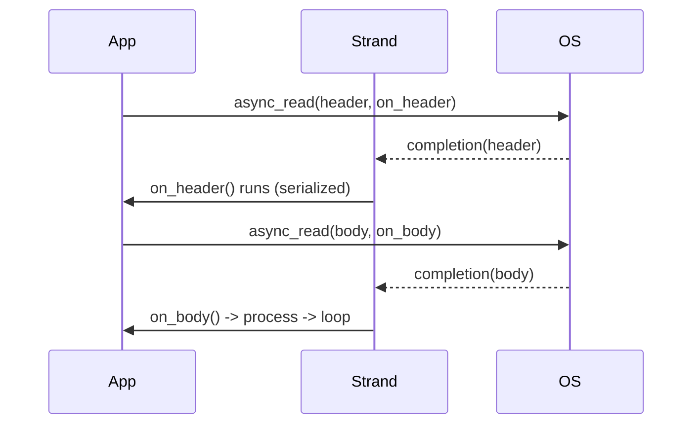

# Proactor — Middle Level

> **Source:** POSA2 — *Pattern-Oriented Software Architecture, Vol. 2* (Schmidt et al.)
> **Category:** [Concurrency](../README.md) — *"Patterns for coordinating work across threads, cores, and machines."*
> **Prerequisite:** [junior](junior.md)

## Table of Contents

1. [Introduction](#1-introduction)
2. [When to Use Proactor](#2-when-to-use-proactor)
3. [When NOT to Use Proactor](#3-when-not-to-use-proactor)
4. [Real-World Cases](#4-real-world-cases)
5. [Code Examples — Production-Grade](#5-code-examples--production-grade)
6. [Reactor vs Proactor — The Deep Comparison](#6-reactor-vs-proactor--the-deep-comparison)
7. [Thread Model & Strands](#7-thread-model--strands)
8. [Buffer & Lifetime Management](#8-buffer--lifetime-management)
9. [Trade-offs](#9-trade-offs)
10. [Alternatives Comparison](#10-alternatives-comparison)
11. [Refactoring to Proactor](#11-refactoring-to-proactor)
12. [Pros & Cons (Deeper)](#12-pros--cons-deeper)
13. [Edge Cases](#13-edge-cases)
14. [Tricky Points](#14-tricky-points)
15. [Best Practices](#15-best-practices)
16. [Tasks (Practice)](#16-tasks-practice)
17. [Summary](#17-summary)
18. [Related Topics](#18-related-topics)
19. [Diagrams](#19-diagrams)

---

## 1. Introduction

At the junior level you learned the mechanics: initiate an async op, the OS does the I/O, a completion handler runs with the result. At this level you make *engineering* decisions about Proactor: when it earns its complexity, how it compares with Reactor under realistic load, how to keep buffers and objects alive safely, and how to serialize access to per-connection state when completions land on arbitrary threads. The recurring theme is that Proactor trades **straight-line readability** for **scalability and OS-optimized I/O**, and your job is to know when that trade is worth it.

## 2. When to Use Proactor

- ✓ **You're on Windows and need top I/O throughput.** IOCP is the platform's fastest path; Proactor is its idiom. Emulating Reactor with `select`/`WSAPoll` is strictly slower.
- ✓ **Connection count vastly exceeds desired thread count** (10k–1M sockets, a handful of threads).
- ✓ **I/O dominates and CPU per request is small.** The OS overlapping I/O while your few threads stay free is exactly the win.
- ✓ **You want the kernel to own the I/O path** — async file I/O, scatter/gather, registered buffers (io_uring), TLS offload — to minimize user-space copies and syscalls.
- ✓ **You're already on Boost.Asio, .NET, or io_uring** — you're using a Proactor regardless; embrace it.

## 3. When NOT to Use Proactor

- ✗ **Simple, low-concurrency services.** A thread-per-connection blocking server is *far* easier to read and debug; don't pay Proactor's complexity tax for 50 connections.
- ✗ **CPU-bound workloads.** If each request does heavy computation, the bottleneck is cores, not I/O multiplexing; a [thread pool](../05-thread-pool/junior.md) over blocking I/O may be simpler and just as fast.
- ✗ **Platforms with weak true-async support.** Classic POSIX `aio_*` is patchy; if you'd be *emulating* Proactor on top of a Reactor (epoll), you inherit Reactor's costs plus an emulation layer — often just use [Reactor](../03-reactor/junior.md) directly.
- ✗ **Teams unfamiliar with async/callback control flow.** The debugging burden is real; mismatched team skill turns a performance win into a maintenance liability.

## 4. Real-World Cases

- **Boost.Asio servers** (proxies, brokers, financial gateways) — Proactor on IOCP/io_uring/epoll depending on platform.
- **.NET / Kestrel** — async I/O on Windows is IOCP-backed; `async`/`await` hides a Proactor.
- **High-frequency trading gateways on Windows** — IOCP for minimal-latency socket completion.
- **Modern Linux I/O engines** — databases and storage daemons adopting io_uring for async file + network completion (e.g., ScyllaDB-style designs).

## 5. Code Examples — Production-Grade

A read-exactly-N framing read with timeout, strand serialization, and disciplined lifetime, in Boost.Asio:

```cpp
#include <boost/asio.hpp>
#include <memory>
#include <vector>

using boost::asio::ip::tcp;
namespace asio = boost::asio;

class Connection : public std::enable_shared_from_this<Connection> {
public:
    Connection(tcp::socket sock)
        : socket_(std::move(sock)),
          strand_(socket_.get_executor()),   // serialize handlers for THIS conn
          timer_(socket_.get_executor()) {}

    void start() { read_header(); }

private:
    void arm_timeout() {
        timer_.expires_after(std::chrono::seconds(30));
        auto self = shared_from_this();
        timer_.async_wait(asio::bind_executor(strand_,
            [this, self](boost::system::error_code ec) {
                if (!ec) socket_.cancel();    // fires completions with operation_aborted
            }));
    }

    void read_header() {
        header_.resize(4);
        auto self = shared_from_this();
        arm_timeout();
        // async_read = read EXACTLY header_.size() bytes (handles partial reads)
        asio::async_read(socket_, asio::buffer(header_),
            asio::bind_executor(strand_,
                [this, self](boost::system::error_code ec, std::size_t) {
                    timer_.cancel();
                    if (ec) return;           // eof / abort / error -> drop conn
                    std::size_t len = decode_len(header_);
                    read_body(len);
                }));
    }

    void read_body(std::size_t len) {
        body_.resize(len);                    // body_ outlives the op (member)
        auto self = shared_from_this();
        arm_timeout();
        asio::async_read(socket_, asio::buffer(body_),
            asio::bind_executor(strand_,
                [this, self](boost::system::error_code ec, std::size_t) {
                    timer_.cancel();
                    if (ec) return;
                    process(body_);
                    read_header();            // loop
                }));
    }

    static std::size_t decode_len(const std::vector<char>& h) { /* parse */ return 0; }
    void process(const std::vector<char>&) { /* business logic, non-blocking */ }

    tcp::socket socket_;
    asio::strand<tcp::socket::executor_type> strand_;
    asio::steady_timer timer_;
    std::vector<char> header_, body_;
};
```

Key production touches: **`async_read`** (not `async_read_some`) to handle partial reads; a **strand** so all handlers for one connection run serially even on a multi-thread pool; a **timer** that cancels the socket to enforce idle timeouts; **member buffers** sized per-message so lifetime is correct.

## 6. Reactor vs Proactor — The Deep Comparison

This table is the heart of the topic. Internalize it.

| Dimension | **Reactor** (readiness) | **Proactor** (completion) |
|-----------|-------------------------|----------------------------|
| **Event meaning** | "Handle is *ready*" (you can read/write now) | "Operation is *complete*" (it already happened) |
| **Who performs the I/O** | Your application thread, inside the handler | The OS kernel, in the background |
| **When the buffer is touched** | *After* dispatch, by you, in the handler | *Before* dispatch, by the kernel, during the op |
| **Demultiplexer** | `select`/`poll`/`epoll`/`kqueue` (readiness) | `GetQueuedCompletionStatus` / io_uring CQ (completion) |
| **Handler receives** | Just the ready handle | The *result*: bytes transferred + error |
| **Buffer lifetime risk** | Low — buffer used synchronously in handler | High — buffer lent to kernel across time |
| **Thread model** | Typically single reactor thread doing I/O | Pool of threads draining completions |
| **Control flow** | Inverted, but I/O is synchronous within handler | Inverted *and* I/O is async — more fragmentation |
| **Portability** | Excellent (epoll/kqueue/select everywhere) | Best on Windows; uneven async on classic POSIX |
| **Debuggability** | Easier — handler does the read you can step into | Harder — completion is detached from initiation |
| **Best platform** | Linux/BSD (epoll/kqueue) | Windows (IOCP), modern Linux (io_uring) |
| **Canonical libs** | libevent, libev, Netty (epoll) | Boost.Asio (IOCP), .NET async, io_uring |

**The crisp one-liner:** *Reactor multiplexes readiness and you do the I/O; Proactor multiplexes completion and the OS does the I/O.*

A frequent practical consequence: on Linux *before* io_uring, "Proactor" libraries (including Asio) were **emulated over epoll** — Asio internally did the `read()` for you on readiness and then invoked your "completion" handler. You got the Proactor *API* over a Reactor *engine*. io_uring finally makes Asio a *true* Proactor on Linux.

## 7. Thread Model & Strands

Completions can be dispatched on **any** worker thread in the Proactor pool. Two handlers for the *same connection* could otherwise run concurrently on two threads, corrupting per-connection state. Solutions:

- **Strand (Asio):** a `strand` guarantees serial execution of all handlers bound to it — no locks needed for per-connection state. Bind every handler for a connection to that connection's strand.
- **Single-threaded `io_context`:** run the Proactor on one thread; simplest, but caps you at one core for handler execution.
- **Per-connection lock:** works but is error-prone and slower; strands are the idiomatic answer.

IOCP and io_uring let you size the completion-draining thread pool. A common heuristic is *threads ≈ CPU cores*; oversubscription just adds context-switch overhead because the threads are rarely blocked.

## 8. Buffer & Lifetime Management

- Store buffers as **members of the per-connection object**, sized per operation.
- Keep the object alive with **`shared_from_this`** captured in each handler lambda.
- For scatter/gather, hold the `iovec`/buffer-sequence storage alive too — Asio's buffer views are *non-owning*.
- On **cancellation**, outstanding ops still complete (with `operation_aborted`); your buffer/object must survive until those final completions fire. Do *not* free on cancel — free in the handler.

## 9. Trade-offs

- **Throughput vs. readability.** Proactor maximizes I/O throughput at the cost of fragmented, callback-driven logic. Coroutines (`co_await` in Asio, `async/await` in C#) recover readability without losing the Proactor engine.
- **Latency tail vs. thread count.** Few threads = low context-switch overhead, but a single slow (blocking) handler stalls everyone — tail latency explodes. Discipline (never block in handlers) is mandatory.
- **OS coupling.** You buy into IOCP/io_uring semantics; behavior and tuning differ across platforms even behind a portable API like Asio.

## 10. Alternatives Comparison

| Approach | Concurrency model | When it wins over Proactor |
|----------|-------------------|----------------------------|
| Thread-per-connection (blocking) | 1 thread / conn | Low connection counts; simplest to read/debug |
| [Reactor](../03-reactor/junior.md) | Readiness loop | Linux-first, you want to control I/O, easier debugging |
| [Thread pool](../05-thread-pool/junior.md) + blocking I/O | N workers | CPU-bound work; moderate connections |
| [Half-Sync/Half-Async](../08-half-sync-half-async/junior.md) | Async front, sync back | Want async I/O *and* simple synchronous business logic |
| Coroutines over Proactor | Async, sync-looking | Proactor throughput *with* readable straight-line code |

## 11. Refactoring to Proactor

A staged migration from thread-per-connection:

1. **Identify the hot path** — the blocking `read`/`write` loop per connection.
2. **Introduce an event engine** — adopt Asio's `io_context` (or io_uring directly).
3. **Convert one operation** — replace the blocking `read` with `async_read` + a completion handler that contains the *next* step.
4. **Move per-connection state** into a `Session`/`Connection` object held by `shared_ptr`.
5. **Serialize with a strand** before going multi-threaded.
6. **Add timeouts and cancellation** via timers.
7. **Optionally adopt coroutines** to flatten the callback chain back into readable code.

## 12. Pros & Cons (Deeper)

| Pros ✓ | Cons ✗ |
|--------|--------|
| ✓ Kernel-optimized I/O path; minimal blocked threads | ✗ Lifetime correctness is *your* burden (buffers/objects) |
| ✓ Scales to enormous connection counts cheaply | ✗ Stack traces don't reflect logical flow → hard debugging |
| ✓ Natural fit for Windows; future-proof on io_uring | ✗ A single blocking handler poisons the whole pool |
| ✓ Clean initiation/completion separation enables composition | ✗ Per-connection state needs strands/locks under multi-threading |
| ✓ Coroutines restore readability on top | ✗ Emulated Proactor (epoll backend) gives API benefits, not engine benefits |

## 13. Edge Cases

- **Cancellation races:** cancel + in-flight completion both fire; handlers must be idempotent about closing.
- **Half-open connections:** read completes with `eof` but writes may still be pending; drain or abort cleanly.
- **Zero-byte reads** (`bytes_transferred == 0` without error) — possible on some ops; treat carefully.
- **Backpressure:** if you keep initiating reads faster than you process, memory balloons. Throttle by not re-arming reads until prior work drains.
- **`operation_aborted` floods** after `socket.cancel()` — expected, handle gracefully.

## 14. Tricky Points

- A **strand does not create a thread**; it's a serialization guarantee layered over the pool.
- `async_read` vs `async_read_some`: the former loops internally until N bytes or error; the latter is one OS read that may be short.
- On the epoll-backed Asio, your "completion" handler runs on the `io_context` thread that did the emulated read — buffer touch still happens before your handler, *conceptually*, but mechanically Asio did the read for you.

## 15. Best Practices

- ✓ Default to `async_read`/`async_write` (full ops) over `*_some` unless you specifically want partial.
- ✓ Bind every per-connection handler to that connection's **strand**.
- ✓ Enforce **idle timeouts** with timers that `cancel()` the socket.
- ✓ Never allocate I/O buffers on a transient stack frame.
- ✓ Profile thread-pool size; start at core count.
- ✓ Consider **coroutines** for any non-trivial protocol to keep logic linear.

## 16. Tasks (Practice)

1. Convert the junior echo server to read **exact-length framed messages** using `async_read`.
2. Add a **30-second idle timeout** that closes inactive connections.
3. Make it **multi-threaded** (`io_context` run on N threads) and add **strands**; prove no data races.
4. Rewrite one connection's logic using **Asio coroutines** (`co_await async_read`).
5. Add **backpressure**: stop reading when an outbound queue exceeds a threshold.

## 17. Summary

At the middle level, Proactor is a deliberate trade: you adopt callback-inverted, completion-based I/O to gain kernel-optimized scalability, then defend that gain with discipline — correct buffer/object lifetimes, strands for per-connection serialization, timeouts, backpressure, and (ideally) coroutines to keep the code readable. The Reactor-vs-Proactor table is the decision tool: choose Proactor when you're completion-platform-native (Windows IOCP, io_uring) and connection-count-dominated; choose Reactor when you're Linux-epoll-first and value debuggability.

## 18. Related Topics

- [Reactor](../03-reactor/junior.md) · [Future / Promise](../07-future-promise/junior.md) · [Half-Sync/Half-Async](../08-half-sync-half-async/junior.md) · [Thread Pool](../05-thread-pool/junior.md)

## 19. Diagrams




