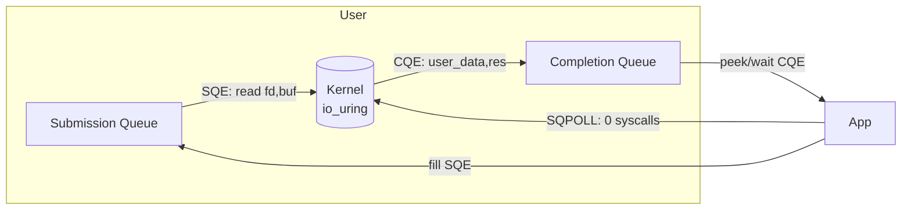
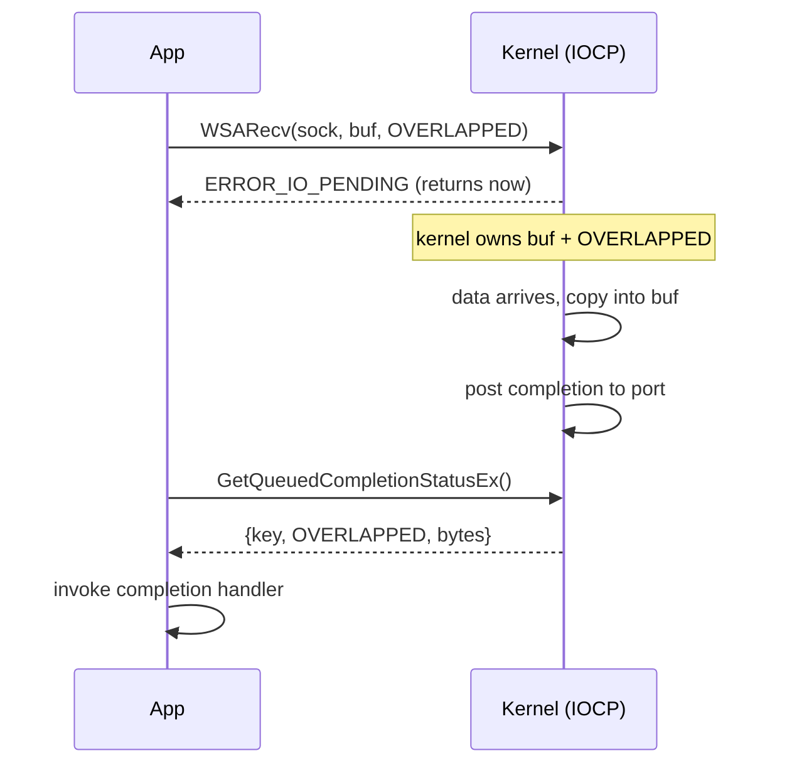

# Proactor — Professional Level

> **Source:** POSA2 — *Pattern-Oriented Software Architecture, Vol. 2* (Schmidt et al.)
> **Category:** [Concurrency](../README.md) — *"Patterns for coordinating work across threads, cores, and machines."*
> **Prerequisite:** [senior](senior.md)

## Table of Contents

1. [Introduction](#1-introduction)
2. [Internals: Windows IOCP](#2-internals-windows-iocp)
3. [Internals: Linux io_uring](#3-internals-linux-io_uring)
4. [Internals: Boost.Asio Engine](#4-internals-boostasio-engine)
5. [Memory Model and Visibility](#5-memory-model-and-visibility)
6. [Performance: Syscall & Copy Economics](#6-performance-syscall--copy-economics)
7. [Performance: Tail Latency & Pool Tuning](#7-performance-tail-latency--pool-tuning)
8. [Cross-Language Comparison](#8-cross-language-comparison)
9. [Microbenchmark Anatomy](#9-microbenchmark-anatomy)
10. [Diagrams](#10-diagrams)
11. [Related Topics](#11-related-topics)

---

## 1. Introduction

At the professional level you reason about Proactor down to syscalls, cachelines, and memory fences. The three engines worth knowing cold are **Windows IOCP**, **Linux io_uring**, and **Boost.Asio** (which abstracts over both, plus epoll). Each implements the same pattern with materially different mechanics, and those mechanics dictate your performance ceiling and your failure modes.

## 2. Internals: Windows IOCP

IOCP is the archetypal Proactor.

- **Creation & association.** `CreateIoCompletionPort` makes a port; associating a handle (socket/file) with it routes that handle's completions to the port.
- **Initiation.** You issue an *overlapped* operation: `WSARecv`/`WSASend`/`ReadFile` with an `OVERLAPPED` structure. The call returns `ERROR_IO_PENDING`; the kernel takes ownership of your buffer and the `OVERLAPPED`.
- **Completion drain.** Threads call `GetQueuedCompletionStatus` (or `GetQueuedCompletionStatusEx` for batched dequeue). This *is* the asynchronous event demultiplexer. It returns the bytes transferred, the completion key (your per-handle context), and the `OVERLAPPED` pointer (your per-operation context).
- **Concurrency value.** The port has a max number of *runnable* threads (set at creation, usually = core count). The kernel keeps exactly that many threads released; if one blocks, it can release another from a larger pool — built-in cushion against an accidentally-blocking handler.
- **LIFO thread wakeup.** IOCP wakes the *most recently* blocked thread first to keep caches warm.
- **Buffer ownership.** The `OVERLAPPED` and buffer **must remain valid until the completion is dequeued** — the canonical use-after-free hazard, here at the Win32 layer.

## 3. Internals: Linux io_uring

io_uring is Linux's true async/completion interface and the modern Proactor substrate.

- **Two ring buffers in shared memory** between user space and kernel: the **submission queue (SQ)** and the **completion queue (CQ)**. Shared memory means submission/completion can happen with *zero syscalls* in the steady state.
- **Submission.** Fill a submission queue entry (SQE) describing the op (opcode, fd, buffer, offset), advance the SQ tail. `io_uring_enter` tells the kernel to process submissions — but with **SQPOLL** mode a kernel thread polls the SQ and you skip the syscall entirely.
- **Completion.** The kernel posts a completion queue entry (CQE) carrying the `user_data` you set and the `res` (bytes transferred, or negative errno). `io_uring_wait_cqe` / peeking the CQ is the demultiplex step.
- **Registered buffers & fixed files** (`IORING_REGISTER_BUFFERS`, fixed fd table) pre-pin memory and pre-resolve fds, eliminating per-op page pinning and fd lookup — the big throughput lever.
- **Linked & batched SQEs** let you express dependent operation chains (read-then-write) submitted together, cutting syscalls further.
- **Multishot** ops post multiple completions from a single submission (e.g., multishot accept/recv).

io_uring is what finally makes Boost.Asio a *true* Proactor on Linux rather than an epoll emulation.

## 4. Internals: Boost.Asio Engine

- **Per-platform backend.** Asio's `io_context` selects an implementation: **IOCP** on Windows, **io_uring** (newer Asio, opt-in) or **epoll** (default historically) on Linux, **kqueue** on BSD/macOS.
- **Emulated Proactor over epoll.** On the epoll backend, Asio registers for readiness, and *internally performs the `read`/`write`* on the reactor thread, then invokes your "completion" handler with the result. You get the Proactor *interface* over a Reactor *engine* — correct semantics, but the data path is user-space, not kernel-async.
- **Handler allocation.** Asio supports custom handler allocators (`asio_handler_allocate`) so the per-op handler closure can come from a fast per-strand pool, avoiding global `malloc` on the hot path.
- **Strands** are implemented as a serialization queue + executor, not a thread; they guarantee non-concurrent handler execution.

## 5. Memory Model and Visibility

- **Completion establishes happens-before.** The kernel's write into your buffer *happens-before* your completion handler observes it, and the framework's dispatch (enqueue on one thread, dequeue+invoke on another) provides the synchronizes-with edge. You may read the buffer in the handler without extra fences.
- **Cross-handler application state still needs synchronization.** Two handlers on two threads sharing a counter or map require atomics/locks/strands — the completion edge only covers the I/O buffer, not your data structures.
- **`OVERLAPPED`/SQE publication.** When you initiate, the store of buffer-pointer/length into the kernel structure must be visible to the kernel before it acts; the syscall (or the SQ tail store + memory barrier in io_uring) provides this. With SQPOLL you must use the prescribed barriers (`io_uring` smp_store_release on the tail) — getting this wrong is a subtle data race with a kernel thread.
- **False sharing on completion queues.** Per-core sharded designs avoid multiple cores writing adjacent CQ/queue cachelines; a shared port (IOCP) trades that for kernel-side balancing.

## 6. Performance: Syscall & Copy Economics

- **Syscall amortization.** Classic Reactor: ≥2 syscalls per I/O (epoll_wait readiness + read). Native Proactor batches: IOCP `GetQueuedCompletionStatusEx` dequeues many completions per call; io_uring with SQPOLL can hit **zero syscalls** per op in steady state. This is the dominant throughput differentiator at high QPS.
- **Copies.** Both IOCP and io_uring still copy kernel↔user for normal recv/send. io_uring **registered buffers** avoid per-op page pinning (not the copy itself); zero-copy send (`IORING_OP_SEND_ZC`) removes the copy for large writes. Asio's epull emulation adds no copies but no kernel-async benefit.
- **Allocation.** The per-operation closure/`OVERLAPPED`/SQE is on the hot path; pool it. A `malloc` per completion at 1M ops/s is a measurable tax and an allocator-contention source.

## 7. Performance: Tail Latency & Pool Tuning

- **Thread count.** Native Proactor wants threads ≈ cores; the threads are rarely blocked, so oversubscription only adds context switches and cache pollution. IOCP's concurrency value enforces this while keeping spares.
- **The blocking-handler poison.** One synchronous call inside a handler removes a worker from the rotation; at scale this shows as *correlated p99/p999 spikes* across unrelated connections. Detect with per-handler latency histograms; never allow blocking calls in handlers (offload to a separate pool).
- **Batching vs. latency.** `GetQueuedCompletionStatusEx`/io_uring CQ batching boosts throughput but can add a few µs of latency if you wait to accumulate a batch; tune batch size against your latency SLO.
- **NUMA.** Pin per-core Proactors and allocate buffers node-local; a remote buffer touch on every completion is a silent throughput cap.

## 8. Cross-Language Comparison

| Platform / Language | Proactor mechanism | Notes |
|---------------------|--------------------|-------|
| **C++ / Boost.Asio** | IOCP / io_uring / epoll-emulated | Most explicit; coroutines available; handler allocators |
| **C++ / raw IOCP** | `GetQueuedCompletionStatus` | Maximum control, maximum footgun (manual `OVERLAPPED`) |
| **C / liburing** | io_uring SQ/CQ | Lowest-level true async on Linux; registered buffers, SQPOLL |
| **C# / .NET** | IOCP-backed (Windows), io_uring/epoll (Linux) | `async`/`await`, `SocketAsyncEventArgs`; Proactor hidden |
| **Java / NIO.2** | `AsynchronousChannel` + `CompletionHandler` | Proactor API; backend epoll-emulated on Linux, IOCP on Windows |
| **Rust / tokio (io-uring)** | io_uring or epoll | `tokio-uring` true Proactor; default mio is Reactor |
| **Node.js / libuv** | IOCP (Windows), epoll/thread-pool (Unix) | Proactor on Windows; emulated + threadpool for file I/O on Unix |

**Key insight:** the *API* (completion callbacks/await) can be Proactor-shaped on every platform, but whether the *engine* is truly async depends on the backend — IOCP and io_uring are real; epoll-backed implementations emulate.

## 9. Microbenchmark Anatomy

To benchmark a Proactor honestly:

- **Measure the right thing.** Report ops/s *and* p50/p99/p999 latency; throughput alone hides the blocking-handler poison.
- **Warm up.** JIT (Java/.NET), allocator pools, and page caches must be warm; discard the first N seconds.
- **Pin and isolate.** Pin Proactor threads to cores, isolate them from the load generator (separate machine or NUMA node) to avoid measuring scheduler noise.
- **Control buffer reuse.** A benchmark that reuses one buffer hides allocation cost present in production; test both.
- **Count syscalls.** `strace -c` / ETW: a true io_uring+SQPOLL run shows near-zero `io_uring_enter`; an epoll emulation shows epoll_wait+read pairs. This *proves* whether you're getting engine benefits or just API sugar.
- **Vary connection count and message size.** Proactor's edge widens with connection count and shrinks for tiny message counts where syscall amortization can't kick in.
- **Compare against Reactor on the same box** to quantify the actual delta — on Linux pre-io_uring it's often negligible; on Windows IOCP and with io_uring it's substantial.

## 10. Diagrams

## 11. Related Topics

- [Reactor](../03-reactor/junior.md) · [Future / Promise](../07-future-promise/junior.md) · [Half-Sync/Half-Async](../08-half-sync-half-async/junior.md) · [Thread Pool](../05-thread-pool/junior.md) · [Leader/Followers](../09-leader-followers/junior.md)
