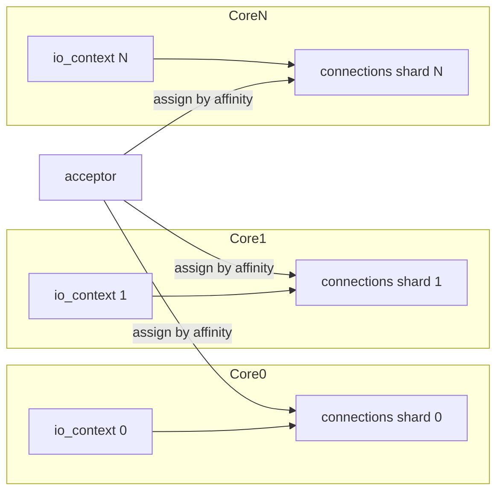
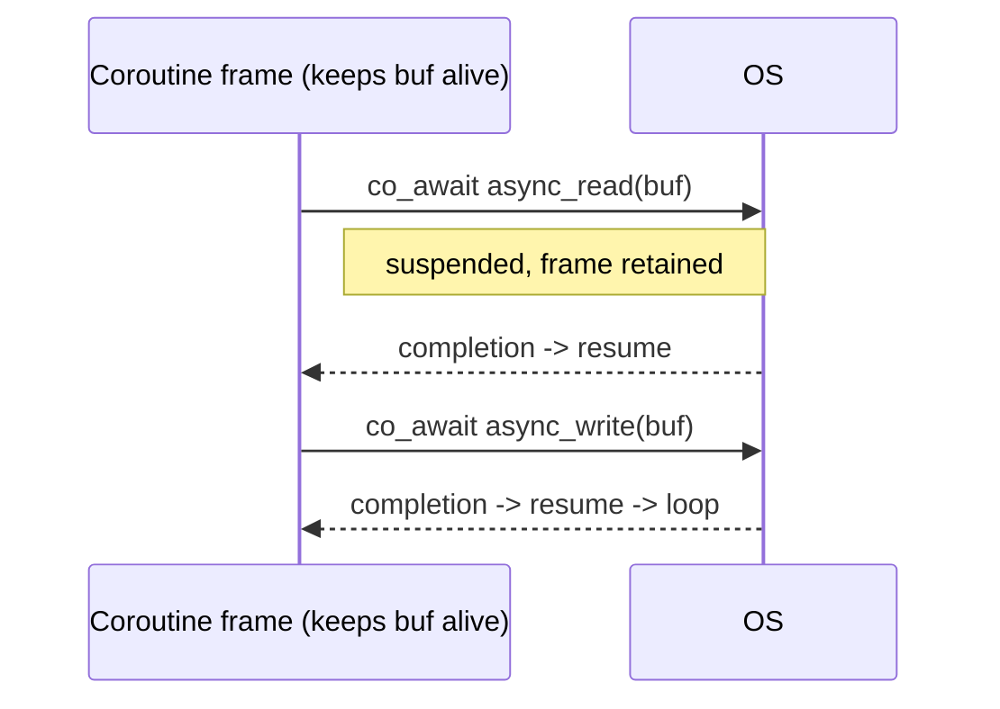

# Proactor — Senior Level

> **Source:** POSA2 — *Pattern-Oriented Software Architecture, Vol. 2* (Schmidt et al.)
> **Category:** [Concurrency](../README.md) — *"Patterns for coordinating work across threads, cores, and machines."*
> **Prerequisite:** [middle](middle.md)

## Table of Contents

1. [Introduction](#1-introduction)
2. [Proactor at Architectural Scale](#2-proactor-at-architectural-scale)
3. [Scaling Deep-Dive: Threads, Cores, NUMA](#3-scaling-deep-dive-threads-cores-numa)
4. [Concurrency Deep Dive](#4-concurrency-deep-dive)
5. [Testability Strategies](#5-testability-strategies)
6. [When Proactor Becomes a Problem](#6-when-proactor-becomes-a-problem)
7. [Code Examples — Advanced](#7-code-examples--advanced)
8. [Real-World Architectures](#8-real-world-architectures)
9. [Pros & Cons at Scale](#9-pros--cons-at-scale)
10. [Trade-off Analysis Matrix](#10-trade-off-analysis-matrix)
11. [Migration Patterns](#11-migration-patterns)
12. [Diagrams](#12-diagrams)
13. [Related Topics](#13-related-topics)

---

## 1. Introduction

A senior engineer doesn't ask "how does Proactor work" but "what does choosing Proactor commit my architecture to for the next five years." Proactor is not just an I/O technique; it's a structural decision that propagates into your threading model, your memory ownership conventions, your testing strategy, your observability, and your portability ceiling. This level treats Proactor as a load-bearing architectural choice and examines where it shines, where it silently fails, and how it migrates.

## 2. Proactor at Architectural Scale

At scale, Proactor's value is **decoupling the demand axis (connections, requests) from the supply axis (threads, cores)**. A blocking-thread server's thread count tracks connections linearly; Proactor's thread count tracks *cores*. This is what lets a single box terminate hundreds of thousands of connections.

The architectural commitments that follow:

- **Ownership discipline becomes a system-wide invariant.** Every buffer and every per-connection object has a lifetime that must dominate its outstanding operations. This isn't a local rule — it's a contract every subsystem (TLS, framing, application logic) must honor. A leak or a use-after-free anywhere is a system-wide hazard.
- **The completion handler is the unit of scheduling.** Your "program" is a graph of handlers, each initiating successors. Latency budgets, fairness, and prioritization must be reasoned about at handler granularity, not function granularity.
- **Blocking is contagious.** One handler that blocks (a sync DB call, a lock, a `malloc` under contention) steals a Proactor worker from *every* connection. At scale this manifests as correlated tail-latency spikes — the hardest class of production incident to diagnose.

## 3. Scaling Deep-Dive: Threads, Cores, NUMA

- **One `io_context` per core, pinned.** The highest-throughput Asio/io_uring designs run a *separate* Proactor instance per core, each with its own completion queue and its connections sharded to it. This eliminates cross-thread cacheline bouncing on the completion queue and lets you pin threads to cores. IOCP, by contrast, deliberately shares one completion port across threads and lets the kernel hand the next completion to whichever thread is idle — a different but also valid model.
- **Connection affinity.** Sharding connections to a fixed Proactor avoids strands entirely *for that connection's own state* — it's effectively single-threaded per shard. Cross-shard work (broadcast, shared caches) still needs coordination.
- **NUMA.** Pin each per-core Proactor's threads and allocate its buffers from the local NUMA node. A completion draining on a remote node pays cross-socket memory latency on every buffer touch.
- **IOCP concurrency value.** IOCP lets you cap the number of *runnable* threads (the "concurrency value," typically core count) while keeping a larger pool to absorb the occasional blocking handler — a built-in cushion the per-core model lacks.

## 4. Concurrency Deep Dive

- **Memory visibility across the completion boundary.** When the kernel fills a buffer and posts a completion, your handler must observe those bytes. The async I/O framework provides the necessary happens-before edge (the completion dispatch synchronizes-with the handler invocation). You rely on this; don't add redundant fences, but *do* synchronize any *application* state shared between handlers running on different threads.
- **Strands vs. sharding vs. locks.** Strands serialize handlers logically but still hop threads; per-core sharding gives true thread-locality with no serialization primitive at all; locks are the fallback when state is genuinely shared. Prefer sharding > strands > locks for hot per-connection state.
- **Completion ordering.** Completions for *independent* operations may arrive in any order across threads. Within a strand they're serialized but not necessarily in initiation order unless the operations themselves are ordered (e.g., a single socket's reads). Never assume global completion ordering.
- **Cancellation semantics.** `cancel()` doesn't synchronously stop work; in-flight ops still complete (`operation_aborted`). Senior code treats cancellation as *eventually consistent* and keeps objects alive until the final completion drains.

## 5. Testability Strategies

Proactor code is notoriously hard to test because completions are detached from initiation. Tactics:

- **Inject the executor.** Make `io_context`/executor a dependency. In tests, drive it with a **manual/mock executor** that you `poll()` step by step, so completions fire deterministically.
- **Test handlers as pure functions.** Extract business logic out of completion handlers into pure functions taking `(bytes, error)`; unit-test those directly without any I/O.
- **Loopback integration tests.** Run a real `io_context` over a loopback socket pair to exercise the full async path, including partial reads and timeouts.
- **Deterministic time.** Use a virtual/steady clock you can advance to test timeout and cancellation paths without real waiting.
- **Fault injection.** Simulate `eof`, `connection_reset`, short reads, and `operation_aborted` to verify every error branch in every handler.

## 6. When Proactor Becomes a Problem

- **CPU-bound services** — Proactor multiplexes I/O, not computation; you'll just have idle completion threads waiting behind a saturated CPU. Use a thread pool for the compute.
- **Deep callback graphs without coroutines** — beyond a few chained ops, raw callbacks become unmaintainable; adopt coroutines or you accrue crippling complexity.
- **Mixed blocking dependencies** — if your stack inevitably blocks (a legacy sync client, a chatty ORM), Proactor's "never block" rule is violated by construction; bridge via [Half-Sync/Half-Async](../08-half-sync-half-async/junior.md) instead.
- **Emulated Proactor on epoll** — you pay Reactor's costs plus an abstraction; if you're Linux-only and pre-io_uring, a direct Reactor may be simpler and equally fast.
- **Debuggability ceiling** — incident response on a 1M-connection Proactor box requires async-aware tracing (correlation IDs across handlers); without it, root-causing a stall is brutal.

## 7. Code Examples — Advanced

**Coroutines over the Proactor engine** — Asio's `awaitable` flattens the callback graph while keeping the completion-based engine underneath:

```cpp
#include <boost/asio.hpp>
#include <boost/asio/awaitable.hpp>
#include <boost/asio/co_spawn.hpp>
#include <boost/asio/detached.hpp>

using boost::asio::ip::tcp;
namespace asio = boost::asio;
using asio::awaitable;
using asio::use_awaitable;

// Straight-line logic, async engine. Each co_await suspends the coroutine
// and resumes it on the completion -- no manual callback chaining.
awaitable<void> echo(tcp::socket socket) {
    std::vector<char> buf(4096);
    try {
        for (;;) {
            std::size_t n = co_await socket.async_read_some(
                asio::buffer(buf), use_awaitable);          // suspends until completion
            co_await asio::async_write(
                socket, asio::buffer(buf, n), use_awaitable);
        }
    } catch (const std::exception&) { /* connection closed */ }
}

awaitable<void> listener(tcp::acceptor acceptor) {
    for (;;) {
        tcp::socket sock = co_await acceptor.async_accept(use_awaitable);
        co_spawn(acceptor.get_executor(), echo(std::move(sock)), asio::detached);
    }
}

int main() {
    asio::io_context io;
    co_spawn(io, listener(tcp::acceptor(io, {tcp::v4(), 9000})), asio::detached);
    io.run();
}
```

The buffer lifetime problem largely *dissolves* with coroutines: `buf` is a local of the coroutine frame, which the runtime keeps alive across suspension points. This is a major senior-level reason to prefer coroutines on Proactor.

**Per-core sharded Proactor (sketch):**

```cpp
unsigned cores = std::thread::hardware_concurrency();
std::vector<asio::io_context> ios(cores);
std::vector<std::thread> threads;
std::vector<asio::executor_work_guard<asio::io_context::executor_type>> guards;
for (unsigned c = 0; c < cores; ++c) {
    guards.emplace_back(asio::make_work_guard(ios[c]));
    threads.emplace_back([&ios, c] { ios[c].run(); });   // pin to core c in prod
}
// Accept on io[0], then HAND each new connection to ios[next_shard]
// so that connection's handlers always run on one thread -> no strand needed.
```

## 8. Real-World Architectures

- **Windows high-performance servers** — IIS, SQL Server network layer, HFT gateways: one IOCP port, kernel-balanced thread pool, completion-driven.
- **io_uring storage/database engines** — per-core shard with its own ring (submission + completion), registered buffers and fixed files to skip per-op fd/buffer lookups, async file *and* network I/O unified.
- **Boost.Asio middleware** — message brokers and proxies that compile to IOCP on Windows, io_uring/epoll on Linux behind one source base.
- **.NET Kestrel** — `async`/`await` over an IOCP-backed (or io_uring on newer Linux) transport; the Proactor is invisible to app code.

## 9. Pros & Cons at Scale

| Pros ✓ | Cons ✗ |
|--------|--------|
| ✓ Connection count decoupled from thread count | ✗ Blocking is contagious — correlated tail latency |
| ✓ Per-core sharding → near-linear scaling, cache locality | ✗ Ownership discipline is a system-wide invariant |
| ✓ Kernel-optimized data path (registered buffers, zero-copy) | ✗ Async-aware tracing required for incident response |
| ✓ Coroutines restore readability and fix lifetime hazards | ✗ Emulated on epoll = abstraction tax with no engine gain |
| ✓ Future-proof: io_uring is the Linux trajectory | ✗ Useless for CPU-bound work |

## 10. Trade-off Analysis Matrix

| Concern | Thread/conn | Reactor | Proactor (native) | Proactor + coroutines |
|---------|-------------|---------|--------------------|------------------------|
| Max connections | Low | High | Very high | Very high |
| Code readability | Best | Poor | Worst | Good |
| Debuggability | Best | Medium | Hard | Medium |
| Throughput (I/O-bound) | Low | High | Highest (Win/io_uring) | Highest |
| Lifetime hazards | None | Low | High | Low |
| Portability | Best | Best | Windows-best | Follows engine |
| CPU-bound fit | Medium | Poor | Poor | Poor |

## 11. Migration Patterns

- **Reactor → Proactor** on Linux: swap the epoll backend for io_uring; with Asio this can be a backend/config change, gaining true async file I/O.
- **Blocking → Proactor:** stage via Half-Sync/Half-Async — keep synchronous business logic behind a queue, async only the I/O edge.
- **Callbacks → coroutines:** mechanical rewrite of `async_x(..., handler)` to `co_await async_x(..., use_awaitable)`; do it module by module.
- **Single → per-core sharded:** introduce connection affinity, remove strands for per-connection state, pin threads.

## 12. Diagrams





## 13. Related Topics

- [Reactor](../03-reactor/junior.md) · [Future / Promise](../07-future-promise/junior.md) · [Half-Sync/Half-Async](../08-half-sync-half-async/junior.md) · [Thread Pool](../05-thread-pool/junior.md) · [Leader/Followers](../09-leader-followers/junior.md)
