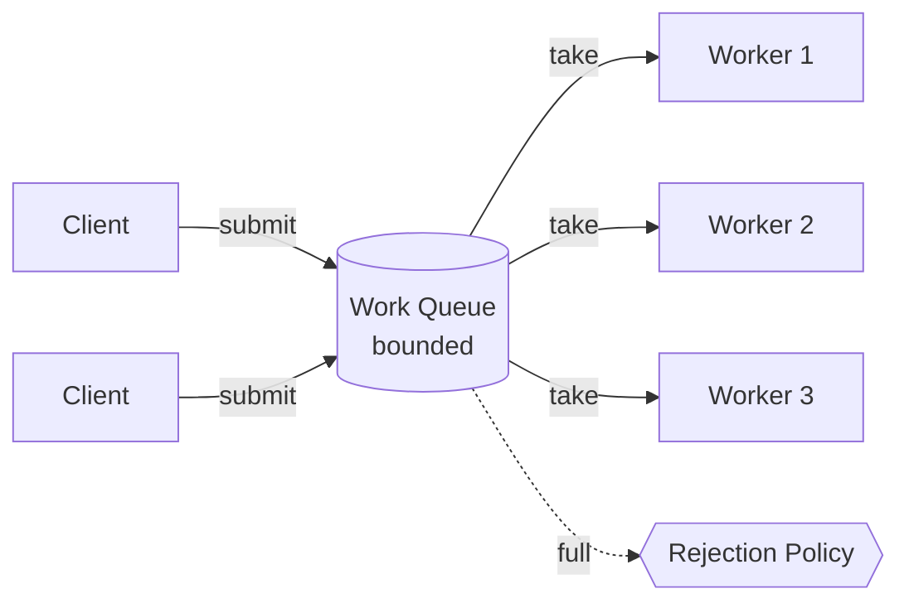
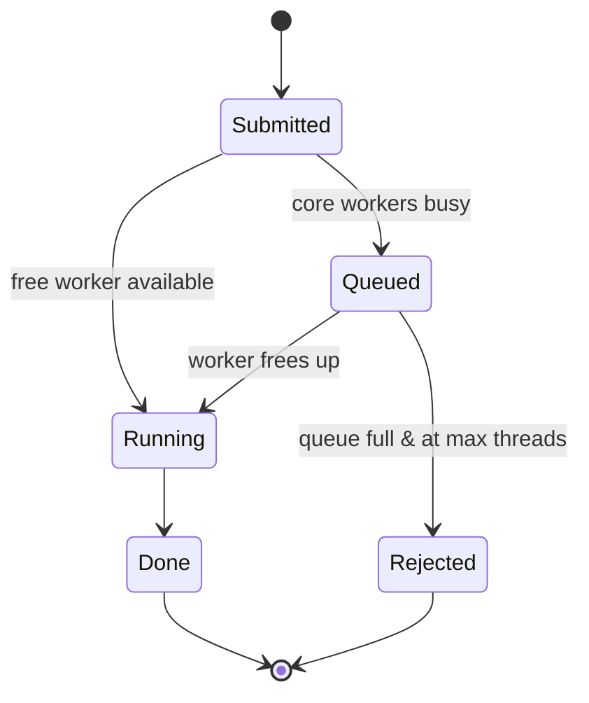
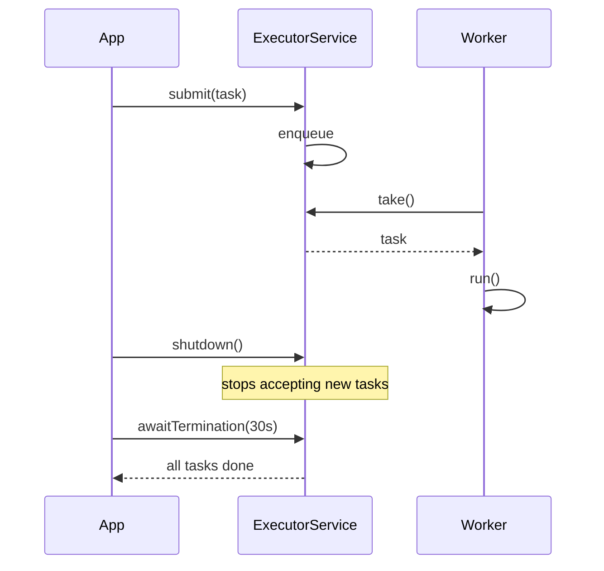

# Thread Pool — Junior Level

> **Source:** POSA2 (Schmidt et al.) · Doug Lea, *Concurrent Programming in Java* · JSR-166 (`java.util.concurrent`)
> **Category:** [Concurrency](../README.md) — *"Patterns for coordinating work across threads, cores, and machines."*

## Table of Contents

1. [Introduction](#1-introduction)
2. [Prerequisites](#2-prerequisites)
3. [Glossary](#3-glossary)
4. [Core Concepts](#4-core-concepts)
5. [Real-World Analogies](#5-real-world-analogies)
6. [Mental Models](#6-mental-models)
7. [Pros & Cons](#7-pros--cons)
8. [Use Cases](#8-use-cases)
9. [Code Examples](#9-code-examples)
10. [Coding Patterns](#10-coding-patterns)
11. [Clean Code](#11-clean-code)
12. [Best Practices](#12-best-practices)
13. [Edge Cases & Pitfalls](#13-edge-cases--pitfalls)
14. [Common Mistakes](#14-common-mistakes)
15. [Tricky Points](#15-tricky-points)
16. [Test Yourself](#16-test-yourself)
17. [Tricky Questions](#17-tricky-questions)
18. [Cheat Sheet](#18-cheat-sheet)
19. [Summary](#19-summary)
20. [What You Can Build](#20-what-you-can-build)
21. [Further Reading](#21-further-reading)
22. [Related Topics](#22-related-topics)
23. [Diagrams & Visual Aids](#23-diagrams--visual-aids)

---

## 1. Introduction

A **thread pool** maintains a fixed, bounded set of **worker threads** that sit in a loop pulling **tasks** from a shared **work queue** and executing them. Instead of spawning a brand-new thread for every unit of work, you submit work to the pool and let already-warm threads pick it up.

Two problems motivate the pattern, and they pull in opposite directions:

1. **Thread creation is expensive.** Creating an OS thread costs roughly 0.5–1 MB of stack memory plus a kernel system call to register it with the scheduler. Doing this per request, thousands of times a second, burns CPU and memory on bookkeeping rather than on your actual work.
2. **Unbounded threads crash the machine.** If you create one thread per incoming request and traffic spikes, you can spawn tens of thousands of threads. The OS scheduler thrashes (excessive context switching), memory is exhausted, and the process dies with `OutOfMemoryError: unable to create new native thread`.

A thread pool solves both at once: **reuse** threads to amortize creation cost, and **cap** the thread count to protect the machine. The cap is the more important half — a thread pool is fundamentally a **concurrency limiter** with a queue in front of it.

> **One-sentence intent:** *Keep a bounded crew of reusable worker threads draining a shared queue, so you pay thread-creation cost once and never let load create more threads than the machine can survive.*

---

## 2. Prerequisites

You should be comfortable with:

- **What a thread is** — an independent path of execution scheduled by the OS, sharing the process's heap memory with sibling threads.
- **`Runnable` and `Callable`** — Java's two task abstractions. `Runnable.run()` returns nothing; `Callable.call()` returns a value and may throw a checked exception.
- **Basic blocking** — a thread can `wait` / `park` until a condition is met (e.g., a queue is non-empty) without burning CPU.
- **A queue** — a FIFO collection. A *blocking* queue additionally makes a consumer wait when empty and (optionally) a producer wait when full.

If "thread" itself is fuzzy, read an intro to OS threads first; this topic assumes you already know that creating one is not free.

---

## 3. Glossary

| Term | Meaning |
|------|---------|
| **Task** | A unit of work, expressed as a `Runnable` (no result) or `Callable<V>` (returns `V`). |
| **Worker thread** | A long-lived thread inside the pool that loops: take a task → run it → repeat. |
| **Work queue** | The shared buffer where submitted-but-not-yet-running tasks wait. |
| **Core pool size** | The number of workers the pool keeps alive even when idle. |
| **Maximum pool size** | The hard ceiling on worker threads the pool will ever create. |
| **Keep-alive time** | How long a *non-core* idle worker waits before terminating itself. |
| **Saturation / rejection policy** | What the pool does when both the queue and the workers are full. |
| **`Future<V>`** | A handle to a result that will exist *later*; lets you wait for and retrieve a task's outcome. |
| **`Executor` / `ExecutorService`** | Java's interfaces for "something I can submit tasks to." `ExecutorService` adds lifecycle (shutdown) and `Future`-returning submission. |
| **Graceful shutdown** | Stop accepting new tasks, let in-flight + queued tasks finish, then terminate workers. |

---

## 4. Core Concepts

### The five participants

1. **Task** — what to run. You write it; the pool runs it.
2. **Work queue** — a thread-safe (usually *blocking*) queue holding pending tasks.
3. **Worker threads** — the crew that drains the queue.
4. **Pool manager** — the object you talk to (`ExecutorService`). It owns the queue, owns the workers, and decides when to create or retire them.
5. **Saturation policy** — the rule applied when the pool can't accept more work.

```
   submit(task)            take()
client ─────────▶ [ work queue ] ─────────▶ worker thread ─▶ run()
                       ▲  ▲  ▲                worker thread ─▶ run()
                  pending tasks               worker thread ─▶ run()
                                                (bounded crew)
```

### The decoupling that makes it powerful

The pool **decouples task submission from task execution**. The submitter does not block waiting for a thread; it just drops work on the queue and moves on (or gets a `Future`). This is the same producer/consumer split you see in [Producer–Consumer](../06-producer-consumer/junior.md), with workers as consumers and your code as the producer.

### Why "bounded" is the whole point

An idle, perfectly-tuned pool and an unbounded thread-spawner behave identically under light load. The difference shows up under **overload**. The bounded pool queues excess work (or rejects it) and keeps running at a steady, survivable rate. The unbounded spawner accelerates toward collapse exactly when you most need it to hold steady. A thread pool trades *latency under overload* (work waits in the queue) for *survival under overload* (the machine stays up).

---

## 5. Real-World Analogies

- **Bank tellers.** A bank has 4 tellers (workers) and one waiting line (queue). Customers (tasks) join the line; whichever teller frees up next serves the next customer. The bank does not hire a teller per customer — it would go broke. When the lobby is full (queue full), a guard turns people away or asks them to come back (rejection policy).
- **Restaurant kitchen.** A fixed number of cooks work off a ticket rail. Tickets pile up at lunch rush (queue grows), but you don't hire 200 cooks for the noon spike — the kitchen physically can't hold them, and they'd collide.
- **Airport taxi rank.** A bounded set of cabs idles at the rank. Passengers queue. A cab takes one fare, drops off, returns to the back of the rank. The cabs are *reused*; nobody builds a new car per passenger.

The recurring theme: a small reusable crew plus a waiting line beats a crew that grows without limit.

---

## 6. Mental Models

**Model 1 — "A queue with N drains."** Picture a sink (the queue) with N drain holes (workers). Water (tasks) flows in. If inflow ≤ drain capacity, the sink stays empty. If inflow exceeds it, the sink fills up; eventually it overflows (rejection). N is fixed — you tune it, you don't grow it on demand.

**Model 2 — "Threads are a budget, not free."** You have a fixed budget of threads. A thread pool forces you to spend that budget deliberately instead of letting every request charge a new thread to the machine's credit card until it maxes out.

**Model 3 — "The pool is a valve."** It regulates how much concurrency hits a downstream resource (a database, an API, a disk). Size the pool, and you've sized the maximum simultaneous pressure on that resource. This is why pools double as protection for the things they call.

---

## 7. Pros & Cons

| ✓ Pros | ✗ Cons |
|--------|--------|
| Amortizes thread creation/teardown cost across many tasks | Adds latency under load — tasks wait in the queue |
| Caps concurrency, protecting CPU, memory, and downstream services | Misconfiguration is subtle and dangerous (e.g., unbounded queue → OOM) |
| Reuses warm threads (cache-friendly, no per-task syscall) | Pool-induced deadlock if tasks submit-and-wait on the same pool |
| Centralizes lifecycle and shutdown logic | Hides backpressure — a growing queue can mask an overloaded system |
| Pluggable queue + rejection policy give explicit overload behavior | Sizing requires understanding the workload (CPU-bound vs IO-bound) |

---

## 8. Use Cases

- **Web/RPC servers** — a request handler pool serving incoming connections (most servlet containers and frameworks do this internally).
- **Parallel batch work** — fan out N independent jobs (resize 10,000 images, parse 1,000 files) across a fixed crew.
- **Background/async tasks** — sending emails, writing audit logs, warming caches, off the request's critical path.
- **Bounded fan-out to a downstream** — calling an external API with at most K concurrent connections so you don't overwhelm it (the pool *is* the limiter).
- **Scheduled/periodic jobs** — a `ScheduledThreadPoolExecutor` running cron-like tasks on a shared crew.

**Anti-use-case:** a single one-off background task. Spawning one thread (or using a `CompletableFuture` with a shared common pool) is simpler than standing up a whole pool.

---

## 9. Code Examples

### Java — the easy on-ramp (and its hidden trap)

```java
import java.util.concurrent.*;

ExecutorService pool = Executors.newFixedThreadPool(4);

for (int i = 0; i < 100; i++) {
    final int id = i;
    pool.submit(() -> {
        System.out.println("task " + id + " on " + Thread.currentThread().getName());
    });
}

pool.shutdown();                                  // stop accepting new tasks
pool.awaitTermination(60, TimeUnit.SECONDS);      // wait for in-flight tasks to finish
```

`newFixedThreadPool(4)` gives you 4 reusable workers. Convenient — but it secretly uses an **unbounded** `LinkedBlockingQueue`, which means it will queue work forever and can run you out of memory. We'll fix that in [middle.md](middle.md). For learning, it's fine.

### Java — getting a result back with `Future`

```java
ExecutorService pool = Executors.newFixedThreadPool(4);

Future<Integer> f = pool.submit(() -> {
    Thread.sleep(100);
    return 6 * 7;                                 // a Callable<Integer>
});

Integer answer = f.get();                         // BLOCKS until the task finishes
System.out.println(answer);                       // 42

pool.shutdown();
```

`submit` returns a [Future / Promise](../07-future-promise/junior.md) immediately; `f.get()` blocks the calling thread until the worker produces the result.

### Java — building the pool explicitly (preview of the real knobs)

```java
ThreadPoolExecutor pool = new ThreadPoolExecutor(
    4,                                    // corePoolSize: always-on workers
    8,                                    // maximumPoolSize: hard ceiling
    60L, TimeUnit.SECONDS,                // keep-alive for extra (non-core) workers
    new ArrayBlockingQueue<>(100),        // BOUNDED queue — this is the safe choice
    new ThreadPoolExecutor.CallerRunsPolicy()  // when saturated, run on caller's thread
);
```

These seven arguments are the whole pattern; [middle.md](middle.md) dissects each one.

### Go — a worker pool over channels

Go has no `ThreadPoolExecutor`; you build a pool from goroutines and a channel. The channel *is* the work queue.

```go
func main() {
    tasks := make(chan int, 100)   // buffered channel = bounded work queue
    var wg sync.WaitGroup

    const workers = 4
    for w := 0; w < workers; w++ {  // start a fixed crew of goroutines
        wg.Add(1)
        go func(id int) {
            defer wg.Done()
            for t := range tasks {  // drain until channel closed
                fmt.Printf("task %d on worker %d\n", t, id)
            }
        }(w)
    }

    for i := 0; i < 100; i++ {
        tasks <- i                  // submit
    }
    close(tasks)                    // signal "no more work"
    wg.Wait()                       // wait for workers to finish
}
```

### Python — `concurrent.futures`

```python
from concurrent.futures import ThreadPoolExecutor

def work(n):
    return n * n

with ThreadPoolExecutor(max_workers=4) as pool:   # context manager shuts down for you
    futures = [pool.submit(work, i) for i in range(100)]
    results = [f.result() for f in futures]         # .result() blocks like Java's .get()
```

The `with` block guarantees `shutdown(wait=True)` on exit — Python's clean answer to "don't forget to shut down."

---

## 10. Coding Patterns

- **Submit-and-collect.** Submit N tasks, hold their `Future`s in a list, then loop and `get()` each. Simple parallel fan-out/fan-in.
- **Fire-and-forget.** `pool.execute(runnable)` for background work whose result you don't need. (Still handle exceptions — see pitfalls.)
- **Pool as a field, not a local.** Create the pool once (e.g., in a constructor or DI container), reuse it for the object's lifetime, shut it down on application stop. Creating a pool per call defeats the entire purpose.
- **One pool per resource type.** A pool for CPU-bound work, a separate pool for IO-bound work, a separate pool for the flaky external API. Mixing them couples unrelated failures (a [bulkhead](../../../../system-design/README.md) idea explored in [senior.md](senior.md)).

---

## 11. Clean Code

```java
// ✗ Unclear: anonymous pool, magic number, no shutdown, no naming
Executors.newFixedThreadPool(8).submit(() -> doWork());

// ✓ Named, owned, shut down, threads identifiable in stack traces
private final ExecutorService imageWorkers = new ThreadPoolExecutor(
    CORE, MAX, 60, TimeUnit.SECONDS,
    new ArrayBlockingQueue<>(QUEUE_CAPACITY),
    new ThreadFactoryBuilder().setNameFormat("image-worker-%d").build(),
    new ThreadPoolExecutor.CallerRunsPolicy());

@PreDestroy
void stop() {
    imageWorkers.shutdown();
    if (!imageWorkers.awaitTermination(30, TimeUnit.SECONDS)) {
        imageWorkers.shutdownNow();
    }
}
```

Clean-code rules specific to pools:

- **Name your threads.** `image-worker-3` in a stack trace beats `pool-2-thread-3`. Use a `ThreadFactory`.
- **Own the lifecycle.** Whoever creates the pool is responsible for shutting it down.
- **Make the knobs named constants**, not literals buried in a constructor call.
- **Don't share one global pool for everything** — name pools by purpose.

---

## 12. Best Practices

- **Always bound the queue.** An unbounded queue turns "max 8 threads" into a lie and hides overload until OOM.
- **Always shut down.** `shutdown()` then `awaitTermination()`, falling back to `shutdownNow()`. Leaked pools keep the JVM alive and leak threads.
- **Choose a rejection policy deliberately.** The default (`AbortPolicy`) throws; decide whether that, caller-runs (backpressure), or discard is right for *your* workload.
- **Never block a pool thread on another task in the same pool** — that's how you deadlock the pool.
- **Size it on purpose** (see [middle.md](middle.md)): CPU-bound ≈ number of cores; IO-bound can be larger.
- **Handle task exceptions.** An uncaught exception in a `Runnable` silently kills the task (and can be invisible). Wrap work in try/catch or use `submit` + inspect the `Future`.

---

## 13. Edge Cases & Pitfalls

- **The silent-failure trap.** With `execute(runnable)`, an exception thrown by the task is dropped (it goes to the thread's uncaught-exception handler, often unnoticed). With `submit(...)`, the exception is captured in the `Future` and only surfaces when you call `get()` — if you never call `get()`, it vanishes too.
- **Forgetting shutdown.** Non-daemon pool threads keep the JVM from exiting. Your program "hangs" after `main` returns.
- **Unbounded queue OOM.** `newFixedThreadPool` / `newSingleThreadExecutor` use unbounded queues; under sustained overload the queue grows until the heap is gone.
- **`newCachedThreadPool` under load.** It has *no* core threads and an unbounded *max*, creating a new thread per task if none is free — i.e., the very unbounded-thread problem the pattern exists to prevent.
- **Pool-induced deadlock.** A task running on the pool submits another task to the *same* pool and waits for its result. If all workers are similarly blocked, no one is left to run the awaited tasks. Covered in depth in [senior.md](senior.md).

---

## 14. Common Mistakes

| Mistake | Why it hurts | Fix |
|---------|--------------|-----|
| Using `Executors.newFixedThreadPool` in production | Unbounded queue → OOM under load | Build a `ThreadPoolExecutor` with a bounded queue |
| Creating a pool per request/call | Defeats reuse; spawns threads anyway | Create once, reuse, store as a field |
| Never calling `shutdown()` | Thread leak; JVM won't exit | Own and close the lifecycle |
| Submitting and never reading the `Future` | Exceptions silently swallowed | Read `Future`s, or log inside the task |
| Sizing by guesswork | Too small → underutilization; too big → thrashing | Size by workload type (see middle) |
| One shared pool for CPU + IO + risky calls | One slow dependency starves everything | Separate pools per concern |

---

## 15. Tricky Points

- **`submit` vs `execute`.** `execute(Runnable)` returns void and routes exceptions to the uncaught handler. `submit(...)` returns a `Future` and *captures* exceptions inside it. They behave differently on failure — this surprises people constantly.
- **`shutdown()` does not stop running tasks.** It stops *accepting new* ones and lets the queue drain. `shutdownNow()` attempts to interrupt running tasks and returns the un-started ones.
- **`Future.get()` blocks the caller**, including a worker thread if you call it from one. That's the deadlock seed.
- **Core threads aren't pre-created by default.** They're started lazily as tasks arrive (unless you call `prestartAllCoreThreads()`).
- **The queue fills *before* the pool grows past core size**, not after — a counterintuitive growth rule explored in [middle.md](middle.md).

---

## 16. Test Yourself

1. What two distinct problems does a thread pool solve, and which one matters more under overload?
2. Name the five participants in the pattern.
3. Why is an *unbounded* work queue dangerous?
4. What's the difference between `submit` and `execute` when the task throws?
5. What does `shutdown()` do that `shutdownNow()` does not, and vice versa?
6. Describe a scenario that causes pool-induced deadlock.
7. Why might you run two separate pools instead of one big one?

<details>
<summary>Answers</summary>

1. (a) Amortizing thread creation cost; (b) capping concurrency to protect the machine. **(b)** matters more under overload — survival beats efficiency.
2. Task, work queue, worker threads, pool manager (`ExecutorService`), saturation/rejection policy.
3. The queue grows without limit under sustained overload, consuming heap until `OutOfMemoryError`; it also hides the overload until it's catastrophic.
4. `execute`: exception goes to the thread's uncaught-exception handler (easily lost). `submit`: exception is stored in the `Future` and re-thrown from `get()`.
5. `shutdown()` stops accepting new tasks but lets queued+running tasks complete. `shutdownNow()` interrupts running tasks and returns queued-but-unstarted ones; it does not wait.
6. A pool task submits another task to the *same* pool and calls `get()`. If all workers do this, none are free to run the awaited tasks → deadlock.
7. Isolation (bulkheading): a slow or failing dependency only saturates its own pool, not unrelated work.

</details>

---

## 17. Tricky Questions

1. **If `maximumPoolSize` is 8 but you use an unbounded queue, how many threads will ever run?** At most `corePoolSize` (e.g., 4) — the pool only grows past core size when the queue is *full*, and an unbounded queue is never full. So `maximumPoolSize` is effectively dead config.
2. **Does a bigger pool always mean faster?** No. For CPU-bound work, more threads than cores adds context-switching overhead and slows you down. Throughput plateaus then declines.
3. **Can a thread pool make a single sequential task faster?** No — parallelism needs independent tasks. A pool speeds up *throughput* of many tasks, not *latency* of one indivisible task.
4. **Why might adding a queue make your system worse?** A long queue absorbs overload invisibly, inflating latency and masking the need to scale or shed load; sometimes failing fast is healthier.

---

## 18. Cheat Sheet

```
INTENT  : reuse a bounded crew of worker threads draining a shared queue
WHY     : (1) amortize thread-creation cost  (2) CAP concurrency  ← the important one

JAVA ENTRY POINTS
  Executors.newFixedThreadPool(n)    // convenient, UNBOUNDED queue (OOM risk)
  Executors.newCachedThreadPool()    // UNBOUNDED threads (load risk)
  new ThreadPoolExecutor(...)        // the real, safe way — 7 knobs

THE 7 KNOBS
  corePoolSize, maximumPoolSize, keepAliveTime, unit,
  workQueue, threadFactory, rejectionHandler

GROWTH RULE  : fill core → fill QUEUE → grow to max → REJECT
QUEUES       : SynchronousQueue | ArrayBlockingQueue(bounded ✓) | LinkedBlockingQueue(unbounded ✗)
REJECTION    : Abort(default) | CallerRuns | Discard | DiscardOldest

LIFECYCLE    : submit/execute → shutdown() → awaitTermination() → shutdownNow()
SUBMIT vs EXECUTE : submit→Future(captures exception) | execute→void(exception lost)
DEADLOCK SEED: pool task calls get() on a task in the SAME pool
```

---

## 19. Summary

A thread pool keeps a **bounded crew of reusable worker threads** draining a **shared work queue**. It exists to **amortize thread-creation cost** and, more importantly, to **cap concurrency** so load can't take down the machine. In Java you reach for `ExecutorService` / `ThreadPoolExecutor`; the seven constructor knobs (core size, max size, keep-alive, queue, thread factory, rejection policy) *are* the pattern. The dangerous defaults — unbounded queues in `newFixedThreadPool`, unbounded threads in `newCachedThreadPool` — are why seniors build pools explicitly. Always bound the queue, always shut down, never block a pool thread on the same pool, and size the pool to the workload. Get those four right and the pattern is your workhorse for the rest of the concurrency patterns.

---

## 20. What You Can Build

- A **parallel image thumbnailer**: submit one task per image to a fixed pool, collect `Future`s, write results.
- A **bounded web crawler**: a pool of K workers fetching URLs, with K = your politeness limit toward the target site.
- A **background email/notification dispatcher** that drains a queue off the request path.
- A **mini load test harness**: a pool firing N concurrent requests at an endpoint and timing them.

---

## 21. Further Reading

- Brian Goetz et al., *Java Concurrency in Practice* — Chapters 6 (Task Execution) and 8 (Applying Thread Pools). The canonical treatment.
- Doug Lea, *Concurrent Programming in Java* — the design behind `java.util.concurrent`.
- Schmidt et al., *POSA2* — the "Thread Pool" / "Leader-Followers" patterns at the architectural level.
- The `java.util.concurrent.ThreadPoolExecutor` Javadoc — read the class-level doc; it is unusually complete.

---

## 22. Related Topics

- [Producer–Consumer](../06-producer-consumer/junior.md) — the queue-with-workers structure a thread pool is built on.
- [Future / Promise](../07-future-promise/junior.md) — how you get results back from submitted tasks.
- [Half-Sync/Half-Async](../08-half-sync-half-async/junior.md) — layering a sync worker pool behind an async front end.
- [Leader/Followers](../09-leader-followers/junior.md) — an alternative that avoids the queue hand-off.

---

## 23. Diagrams & Visual Aids

**Structure:**



**Task lifecycle:**



**Submit / shutdown sequence:**


