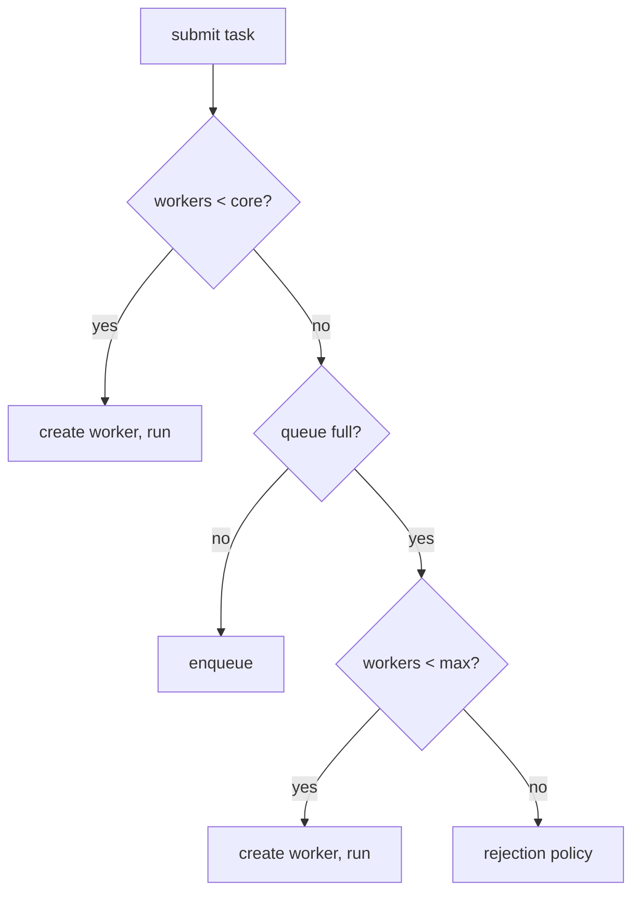
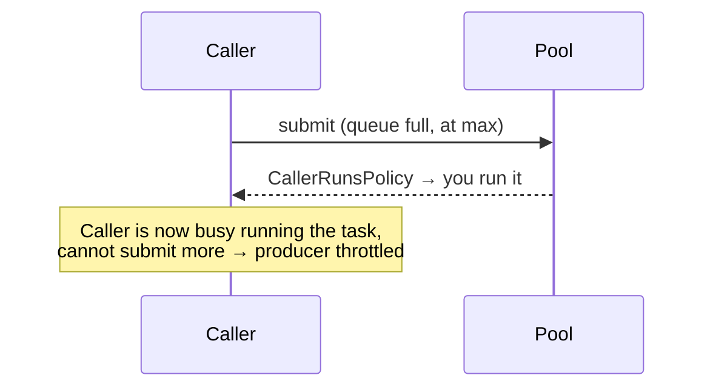
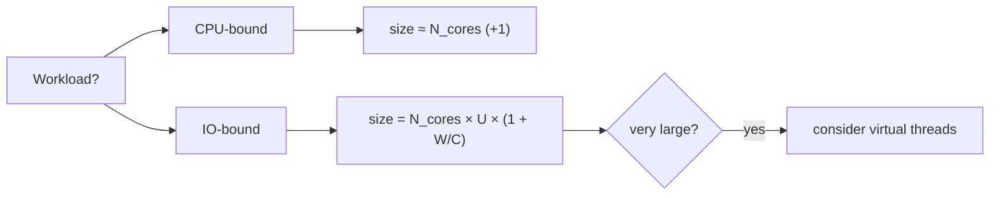

# Thread Pool — Middle Level

> **Source:** POSA2 (Schmidt et al.) · Doug Lea, *Concurrent Programming in Java* · JSR-166 (`java.util.concurrent`)
> **Category:** [Concurrency](../README.md) — *"Patterns for coordinating work across threads, cores, and machines."*
> **Prerequisite:** [junior.md](junior.md)

## Table of Contents

1. [Introduction](#1-introduction)
2. [When to Use a Thread Pool](#2-when-to-use-a-thread-pool)
3. [When NOT to Use a Thread Pool](#3-when-not-to-use-a-thread-pool)
4. [Real-World Cases](#4-real-world-cases)
5. [Code Examples — Production-Grade](#5-code-examples--production-grade)
6. [Pool Sizing](#6-pool-sizing)
7. [Queue & Rejection Policies](#7-queue--rejection-policies)
8. [Trade-offs](#8-trade-offs)
9. [Alternatives Comparison](#9-alternatives-comparison)
10. [Refactoring to a Thread Pool](#10-refactoring-to-a-thread-pool)
11. [Pros & Cons (Deeper)](#11-pros--cons-deeper)
12. [Edge Cases](#12-edge-cases)
13. [Tricky Points](#13-tricky-points)
14. [Best Practices](#14-best-practices)
15. [Tasks (Practice)](#15-tasks-practice)
16. [Summary](#16-summary)
17. [Related Topics](#17-related-topics)
18. [Diagrams](#18-diagrams)

---

## 1. Introduction

At junior level you learned *what* a thread pool is and that `Executors.newFixedThreadPool` is a trap. This level is about the engineering decisions: **how big**, **what queue**, **what to do when full**, and **when not to use a pool at all**. The center of gravity is the `ThreadPoolExecutor` constructor — seven arguments that encode every one of those decisions. Get fluent with them and you can reason about any pool's behavior under load by inspection.

The single most important idea to internalize: a thread pool's behavior under **overload** is determined almost entirely by the **queue** and the **rejection policy**, not by the pool size. Most production incidents trace to one of those two being wrong.

---

## 2. When to Use a Thread Pool

- **Many short, independent tasks.** The per-task work is small relative to thread-creation cost, so reuse pays off (request handlers, message processing, parallel I/O).
- **You must cap concurrency on a downstream resource.** A pool of size K guarantees at most K simultaneous calls to that database/API/disk. The pool *is* the rate limiter.
- **You want explicit, configurable overload behavior.** Queue + rejection policy let you choose between buffering, backpressure, and shedding — and tune them per environment.
- **Long-lived service with steady task flow.** The pool stays warm; creation cost is paid once at startup.

## 3. When NOT to Use a Thread Pool

- **A single, indivisible task.** No parallelism to exploit; a plain thread or `CompletableFuture` on the common pool is simpler.
- **Tasks that submit-and-wait on the same pool.** Classic deadlock setup (see [senior.md](senior.md)). Either use a separate pool for the inner work or restructure to avoid blocking.
- **Massively concurrent, mostly-blocking I/O on modern Java.** Virtual threads (Project Loom, Java 21+) let you write one-thread-per-task code without the pool's sizing headaches. A bounded *platform*-thread pool may be the wrong tool — see [senior.md](senior.md)/[professional.md](professional.md).
- **Truly CPU-saturating divide-and-conquer.** A `ForkJoinPool` with work-stealing usually beats a plain `ThreadPoolExecutor` because it balances uneven subtasks across workers.
- **When a message broker already gives you bounded consumers.** If a queue system (SQS, Kafka with a consumer group) already throttles and persists work, an in-process pool can be redundant.

---

## 4. Real-World Cases

- **Tomcat / Jetty connection handling.** Servlet containers front requests with a bounded worker pool. Tune `maxThreads` and the accept queue; too small starves throughput, too large thrashes and can melt the database behind it.
- **HikariCP and the pool-of-pools.** A DB connection pool of size N means your request pool calling it should be sized with N in mind — 200 request threads contending for 10 connections just queue inside HikariCP. The bottleneck moves, it doesn't disappear.
- **gRPC / HTTP client fan-out.** Aggregating 5 downstream services per request: a bounded pool caps total in-flight calls so one slow dependency can't open thousands of sockets.
- **Image/video transcoding farm.** CPU-bound; pool sized ≈ cores. More threads only add scheduling overhead.

---

## 5. Code Examples — Production-Grade

### Java — a properly configured pool

```java
import java.util.concurrent.*;

int cores = Runtime.getRuntime().availableProcessors();

ThreadPoolExecutor pool = new ThreadPoolExecutor(
    cores,                                  // corePoolSize
    cores * 2,                              // maximumPoolSize
    60L, TimeUnit.SECONDS,                  // keep-alive for non-core workers
    new ArrayBlockingQueue<>(1_000),        // BOUNDED queue — explicit overload point
    new ThreadFactory() {                   // named threads for observability
        private final AtomicInteger n = new AtomicInteger();
        public Thread newThread(Runnable r) {
            Thread t = new Thread(r, "api-worker-" + n.incrementAndGet());
            t.setUncaughtExceptionHandler((th, ex) ->
                log.error("uncaught in {}", th.getName(), ex));
            return t;
        }
    },
    new ThreadPoolExecutor.CallerRunsPolicy()  // backpressure when saturated
);
pool.prestartAllCoreThreads();              // warm up so first requests aren't slow
```

### Java — submit, collect, time out, handle failure

```java
List<Callable<Result>> tasks = buildTasks();

List<Future<Result>> futures = pool.invokeAll(
    tasks, 5, TimeUnit.SECONDS);            // bound total wait; unfinished are cancelled

for (Future<Result> f : futures) {
    try {
        Result r = f.get();                 // already complete (invokeAll waited)
        consume(r);
    } catch (CancellationException e) {
        log.warn("task timed out");
    } catch (ExecutionException e) {
        log.error("task failed", e.getCause());  // unwrap the real exception
    }
}
```

### Go — bounded worker pool with results and error handling

```go
type job struct{ id int }
type result struct {
    id  int
    err error
}

func runPool(jobs []job, workers int) []result {
    in := make(chan job)
    out := make(chan result)
    var wg sync.WaitGroup

    for i := 0; i < workers; i++ {     // fixed crew
        wg.Add(1)
        go func() {
            defer wg.Done()
            for j := range in {
                err := process(j)
                out <- result{j.id, err}
            }
        }()
    }
    go func() {                         // feeder
        for _, j := range jobs {
            in <- j
        }
        close(in)
    }()
    go func() { wg.Wait(); close(out) }()  // close results when all workers done

    var results []result
    for r := range out {
        results = append(results, r)
    }
    return results
}
```

### Python — bounded pool with `as_completed` and timeouts

```python
from concurrent.futures import ThreadPoolExecutor, as_completed, TimeoutError

with ThreadPoolExecutor(max_workers=8, thread_name_prefix="io") as pool:
    futures = {pool.submit(fetch, url): url for url in urls}
    for fut in as_completed(futures, timeout=30):
        url = futures[fut]
        try:
            data = fut.result()
        except Exception as exc:
            log.error("failed %s: %s", url, exc)
```

---

## 6. Pool Sizing

Sizing is the question juniors guess at and seniors compute. Two regimes:

### CPU-bound work

The task spends nearly all its time computing. More threads than cores just adds context-switching overhead.

```
optimal pool size ≈ N_cores   (sometimes N_cores + 1 to cover the rare page fault)
```

Past the core count, throughput is flat then declines. Measure; don't over-provision.

### IO-bound work (Brian Goetz's formula)

The task spends much of its time *waiting* (network, disk, DB). While a thread waits, the core is free for another thread, so you want more threads than cores. The target is enough threads to keep all cores busy despite the waiting:

```
N_threads = N_cores × U_cpu × (1 + W/C)

  N_cores = available cores
  U_cpu   = target CPU utilization (0..1)
  W       = average time the task spends WAITING
  C       = average time the task spends COMPUTING
```

Example: 8 cores, target 100% CPU, each task waits 90 ms and computes 10 ms (W/C = 9):
`N = 8 × 1 × (1 + 9) = 80` threads. The high wait/compute ratio is *why* IO pools are large.

### Little's Law as a sanity check

Little's Law relates the three quantities you actually care about:

```
L = λ × W
  L = average number of tasks in the system (in-flight + queued)
  λ = arrival rate (tasks/sec)
  W = average time a task spends in the system (queue wait + service)
```

If 500 requests/sec each take 40 ms to *service*, you need `λ × W = 500 × 0.04 = 20` workers busy on average just to keep up — below that, the queue grows without bound. Little's Law tells you the *floor*; the Goetz formula tells you the size that keeps cores busy; you pick the larger and leave headroom.

> **Rule of thumb:** start from the formula, then load-test and watch queue depth + latency. The formula gets you to the right order of magnitude; measurement gets you the number.

---

## 7. Queue & Rejection Policies

### The three queue choices (this decision dominates overload behavior)

| Queue | Capacity | Effect | When |
|-------|----------|--------|------|
| `SynchronousQueue` | 0 (hand-off) | No buffering; a submit must meet a free worker or the pool grows/rejects | Want max responsiveness, willing to grow threads aggressively (`newCachedThreadPool` uses this) |
| `ArrayBlockingQueue(n)` | bounded | Buffers up to `n`, then triggers growth/rejection | **The production default** — explicit, predictable overload point |
| `LinkedBlockingQueue` | unbounded (default) | Buffers forever; pool never grows past core; OOM under sustained overload | Almost never in production; it's the classic trap |

> **The unbounded-queue trap, precisely:** with `LinkedBlockingQueue` the queue is *never* full, so the `ThreadPoolExecutor` never creates threads beyond `corePoolSize`, and `maximumPoolSize` becomes dead configuration. Worse, the queue grows without limit until the heap is exhausted. `Executors.newFixedThreadPool` does exactly this.

### The `ThreadPoolExecutor` growth rule (memorize this)

Tasks do **not** spill into new threads as soon as core threads are busy. The order is:

```
1. workers < corePoolSize        → create a new worker, run task on it
2. core full, queue not full     → ENQUEUE the task        ← counterintuitive step
3. queue full, workers < max     → create a new worker up to maximumPoolSize
4. queue full AND at max         → invoke the rejection policy
```

The surprise is **step 2**: the queue fills *before* the pool grows past core. So with a huge queue, you rarely reach max size; with a tiny `SynchronousQueue`, you grow to max immediately.

### Rejection (saturation) policies

| Policy | Behavior | Use when |
|--------|----------|----------|
| `AbortPolicy` (default) | Throws `RejectedExecutionException` | Caller must know it failed; fail-fast |
| `CallerRunsPolicy` | Runs the task on the *submitting* thread | Natural backpressure — submitter slows down, stops accepting more |
| `DiscardPolicy` | Silently drops the new task | Lossy work is acceptable (e.g., metrics samples) |
| `DiscardOldestPolicy` | Drops the *oldest* queued task, retries the new one | Freshest data matters more than completeness |

`CallerRunsPolicy` deserves special mention: it converts a saturated pool into **backpressure**. The thread that submits work gets conscripted to run a task, so it can't submit more until it finishes — automatically throttling the producer. This is often the most resilient default for ingest pipelines.

---

## 8. Trade-offs

- **Latency vs survival.** A queue trades higher latency under load (work waits) for not crashing. A short queue fails fast; a long queue hides problems.
- **Throughput vs fairness.** A single big pool maximizes throughput but lets one workload starve another. Per-workload pools add fairness at the cost of total utilization.
- **Buffering vs backpressure.** A long queue buffers spikes but decouples you from reality (you stop feeling overload until it's too late). `CallerRunsPolicy` / short queues push backpressure to the caller early.
- **Reuse vs isolation.** One pool reuses threads efficiently; many pools isolate failures. You trade efficiency for blast-radius control.

---

## 9. Alternatives Comparison

| Approach | Bounds concurrency? | Reuses threads? | Best for |
|----------|--------------------|-----------------|----------|
| **`ThreadPoolExecutor`** | ✓ (size + queue) | ✓ | Many short independent tasks; capping downstream load |
| **`ForkJoinPool`** | ✓ (parallelism level) | ✓ + work-stealing | Recursive divide-and-conquer; uneven subtasks |
| **Virtual threads (Loom)** | ✗ by default (use a `Semaphore` to bound) | N/A (cheap to create) | Massively concurrent blocking I/O on Java 21+ |
| **One thread per task** | ✗ | ✗ | A handful of long-lived tasks only |
| **Reactive/event loop** | ✓ (fixed event-loop threads) | ✓ | Non-blocking I/O at very high connection counts |
| **External queue + consumers** | ✓ | ✓ | Durable, cross-process, restart-safe work |

---

## 10. Refactoring to a Thread Pool

**Before — thread per task (the anti-pattern):**

```java
while (true) {
    Socket conn = serverSocket.accept();
    new Thread(() -> handle(conn)).start();   // ✗ unbounded threads; spike = crash
}
```

**After — bounded pool with explicit overload behavior:**

```java
ThreadPoolExecutor pool = new ThreadPoolExecutor(
    16, 64, 60, TimeUnit.SECONDS,
    new ArrayBlockingQueue<>(256),
    namedFactory("conn"),
    new ThreadPoolExecutor.CallerRunsPolicy());   // ✓ submitter throttles under load

while (true) {
    Socket conn = serverSocket.accept();
    pool.execute(() -> {
        try (conn) { handle(conn); }
        catch (IOException e) { log.warn("conn error", e); }
    });
}
```

Refactoring checklist:
1. Identify the unbounded `new Thread(...)` (or per-call `Executors.new...`).
2. Hoist a single pool to a field; size it.
3. Pick a **bounded** queue with a capacity you can justify.
4. Pick a rejection policy that matches your overload story.
5. Add named threads + an uncaught-exception handler.
6. Wire `shutdown()` into your lifecycle.

---

## 11. Pros & Cons (Deeper)

| ✓ | ✗ |
|---|---|
| Concurrency cap doubles as protection for downstream resources | The cap can become a bottleneck if mis-sized below demand |
| Queue absorbs bursts, smoothing throughput | The same queue hides sustained overload and inflates tail latency |
| Rejection policy makes overload behavior a deliberate choice | Wrong policy (silent discard) can lose work invisibly |
| Centralized lifecycle + metrics (queue depth, active count) | Adds a tuning surface: every knob is a thing that can be set wrong |
| Composes with `Future`/`CompletableFuture` for fan-out/fan-in | Blocking inside a pool thread (e.g., `get()` on same pool) risks deadlock |

---

## 12. Edge Cases

- **`invokeAll` blocks until all tasks finish** (or the timeout). It does not return early on the first failure — design accordingly.
- **`CallerRunsPolicy` during shutdown.** If the pool is shutting down, the caller-runs task is *discarded*, not run — a subtle correctness gap if you relied on it.
- **Core threads not pre-started.** Until `prestartAllCoreThreads()` or the first tasks arrive, you have *zero* warm threads; the first burst pays creation cost.
- **`allowCoreThreadTimeOut(true)`** lets even core threads die when idle — useful for bursty services that should release threads between spikes.
- **Queue + max interaction surprise.** A pool with a large queue and `max > core` may *never* reach max, because the queue fills first (growth rule, step 2).

---

## 13. Tricky Points

- **Sizing IO pools with the Goetz formula gives large numbers** (dozens to hundreds). That's correct — and it's a strong hint that virtual threads might serve you better than a giant platform-thread pool.
- **`Future.get()` without a timeout can hang forever** if the task hangs. Always prefer `get(timeout, unit)` for external-dependency work.
- **Metrics lie if you only watch CPU.** A pool can be saturated (queue full, latency climbing) while CPU is low — because it's IO-bound and *thread-starved*. Watch `getActiveCount()`, `getQueue().size()`, and rejection counts.
- **Resizing at runtime is possible** (`setCorePoolSize` / `setMaximumPoolSize`) but takes effect lazily; don't expect instant rebalancing.

---

## 14. Best Practices

- **Build pools explicitly** with `ThreadPoolExecutor`; treat `Executors.new*` factories as teaching toys.
- **Bound the queue** and justify its capacity from Little's Law, not vibes.
- **Default to `CallerRunsPolicy`** for ingest paths to get backpressure for free; use `AbortPolicy` when callers must learn of failure.
- **Name threads and install an uncaught-exception handler.**
- **Expose pool metrics** (active count, queue depth, completed, rejected) to your monitoring.
- **One pool per concern** (CPU / IO / risky-dependency) to bulkhead failures.
- **Size from the formula, then load-test** and adjust to observed latency + queue depth.

---

## 15. Tasks (Practice)

1. Build a `ThreadPoolExecutor` with a bounded queue and `CallerRunsPolicy`; flood it with 10,000 tasks and observe that no task is rejected but submission *slows down*. Explain why.
2. Compute the IO-bound pool size for: 16 cores, 80% target CPU, tasks that wait 200 ms and compute 20 ms. Then validate with a load test.
3. Replace a `new Thread(...)`-per-request loop (provided in [tasks.md](tasks.md)) with a bounded pool and prove the thread count stays capped under a flood.
4. Demonstrate the unbounded-queue trap: show that with `LinkedBlockingQueue` the pool never exceeds `corePoolSize` even when `maximumPoolSize` is large.

Full task set with solution sketches: [tasks.md](tasks.md).

---

## 16. Summary

The middle-level skill is *configuring* a pool, not just using one. The `ThreadPoolExecutor` seven knobs encode every overload decision; the **queue choice** and **rejection policy** dominate behavior under load far more than raw pool size. Size CPU-bound pools at ≈ cores, IO-bound pools by Brian Goetz's `N_cores × U × (1 + W/C)` formula, and sanity-check capacity with Little's Law (`L = λW`). Remember the growth rule — the queue fills *before* the pool grows past core — because it explains the most confusing pool behavior you'll meet. Default to bounded queues and `CallerRunsPolicy` for backpressure, bulkhead with one pool per concern, and instrument queue depth so you can *see* saturation before it becomes an incident.

---

## 17. Related Topics

- [Producer–Consumer](../06-producer-consumer/junior.md) — the queue + workers core the pool is built on.
- [Future / Promise](../07-future-promise/junior.md) — `invokeAll`, `CompletableFuture`, result handling.
- [Half-Sync/Half-Async](../08-half-sync-half-async/junior.md) — async front, pooled sync workers behind.
- [Leader/Followers](../09-leader-followers/junior.md) — avoids the queue hand-off entirely.

---

## 18. Diagrams

**The growth rule:**



**Backpressure with CallerRunsPolicy:**



**Sizing decision:**


