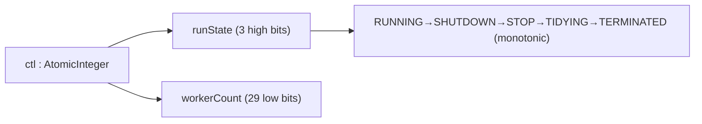
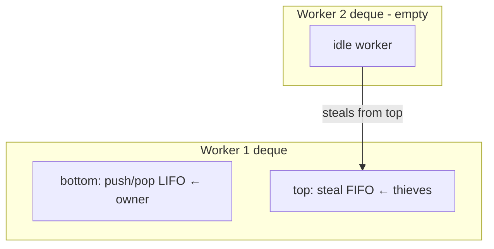
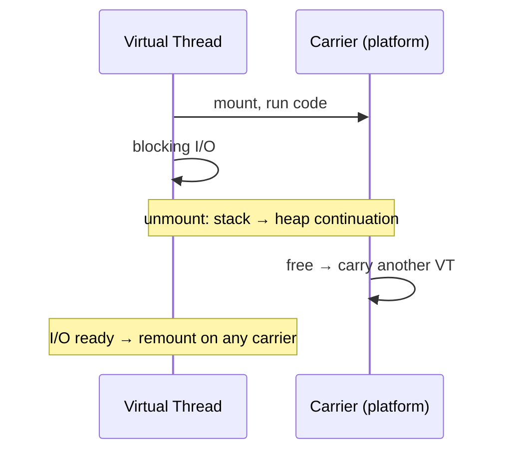

# Thread Pool — Professional Level

> **Source:** POSA2 (Schmidt et al.) · Doug Lea, *Concurrent Programming in Java* · JSR-166 (`java.util.concurrent`)
> **Category:** [Concurrency](../README.md) — *"Patterns for coordinating work across threads, cores, and machines."*
> **Prerequisite:** [senior.md](senior.md)

## Table of Contents

1. [Introduction](#1-introduction)
2. [ThreadPoolExecutor Internals](#2-threadpoolexecutor-internals)
3. [ForkJoinPool & Work-Stealing](#3-forkjoinpool--work-stealing)
4. [Virtual Threads / Project Loom](#4-virtual-threads--project-loom)
5. [Memory Model and Visibility](#5-memory-model-and-visibility)
6. [Performance: Contention & Scalability](#6-performance-contention--scalability)
7. [Performance: Cache, NUMA, False Sharing](#7-performance-cache-numa-false-sharing)
8. [Cross-Language Comparison](#8-cross-language-comparison)
9. [Microbenchmark Anatomy](#9-microbenchmark-anatomy)
10. [Diagrams](#10-diagrams)
11. [Related Topics](#11-related-topics)

---

## 1. Introduction

Professional mastery means knowing what happens *below* the API: how `ThreadPoolExecutor` packs its state into a single atomic word, why `ForkJoinPool`'s work-stealing deques are lock-free, exactly how a virtual thread unmounts from its carrier, and which memory barriers the executor inserts on your behalf. At this level you reason about cache lines, contention on the queue's locks, and the difference between a benchmark that measures your pool and one that measures the JIT warming up. The goal is to predict and explain performance, not just observe it.

---

## 2. ThreadPoolExecutor Internals

### Packed control state

`ThreadPoolExecutor` stores **both** the run state and the worker count in a single `AtomicInteger`, `ctl`:

```
ctl = runState (high 3 bits) | workerCount (low 29 bits)

  runState : RUNNING < SHUTDOWN < STOP < TIDYING < TERMINATED  (monotonically increasing)
  workerCount : number of live workers (≤ ~500 million, the 29-bit cap)
```

Packing both into one atomic lets the executor read-modify-write the entire lifecycle decision (e.g., "increment worker count *only if* still RUNNING") with a single CAS, avoiding a lock on the hot path of worker creation. State transitions are one-way and monotonic — you can never go backward from SHUTDOWN to RUNNING.

### The worker

Each worker is a `Worker` object that **is** an `AbstractQueuedSynchronizer` (AQS). The worker extends AQS to implement a non-reentrant lock whose held/free state signals "currently running a task" vs "idle and interruptible." `shutdownNow()` interrupts only workers whose lock is free (so it doesn't interrupt a task mid-flight unnecessarily, but can interrupt blocked-on-`take()` idle workers). The worker loop:

```
runWorker(w):
  while ((task = getTask()) != null):       // getTask() blocks on the queue
     w.lock()                               // mark "running"
     beforeExecute(); task.run(); afterExecute()
     w.unlock()                             // mark "idle"
  processWorkerExit(w)                      // queue empty + allowed to die → terminate
```

`getTask()` is where keep-alive lives: non-core workers call `workQueue.poll(keepAlive, unit)`; a timeout return means "I've been idle too long" and the worker exits, shrinking the pool back toward core size.

### The queue lock as the real bottleneck

A standard `ThreadPoolExecutor` funnels every submit and every `take` through the work queue's lock. `LinkedBlockingQueue` uses *two* locks (separate put/take) so producers and consumers don't contend with each other; `ArrayBlockingQueue` uses *one* lock for both. Under high submission rates with many workers, this single point becomes the scalability ceiling — which is precisely the problem `ForkJoinPool` solves with per-worker deques.

---

## 3. ForkJoinPool & Work-Stealing

`ForkJoinPool` replaces the single shared queue with **one deque (double-ended queue) per worker**, enabling lock-free work distribution:

- A worker pushes/pops its *own* tasks at the **bottom** of its deque (LIFO) — no contention, cache-friendly (recently forked subtasks are still warm).
- An *idle* worker **steals** from the **top** of a *victim's* deque (FIFO). Stealing from the opposite end minimizes contention with the owner and tends to steal larger, older work units (better granularity).
- The deque is a lock-free structure (CAS-based); the owner's bottom operations almost never contend with stealers' top operations.

This makes `ForkJoinPool` ideal for **recursive divide-and-conquer** with uneven subtask sizes: workers that finish early steal work from busy ones, keeping all cores saturated without a central bottleneck.

```java
class SumTask extends RecursiveTask<Long> {
    final long[] a; final int lo, hi;
    SumTask(long[] a, int lo, int hi) { this.a=a; this.lo=lo; this.hi=hi; }
    protected Long compute() {
        if (hi - lo <= 10_000) {                       // sequential threshold
            long s = 0; for (int i=lo;i<hi;i++) s+=a[i]; return s;
        }
        int mid = (lo + hi) >>> 1;
        SumTask left = new SumTask(a, lo, mid);
        left.fork();                                   // push to my deque
        long right = new SumTask(a, mid, hi).compute(); // run inline (avoid trivial fork)
        return left.join() + right;                    // join may help-steal while waiting
    }
}
Long total = ForkJoinPool.commonPool().invoke(new SumTask(data, 0, data.length));
```

Key subtlety: `join()` doesn't merely block — a joining worker can **execute other tasks** (including the one it's waiting on, or unrelated stolen work) instead of idling. This *help-stealing* is why ForkJoin doesn't suffer the pool-induced deadlock that a plain `ThreadPoolExecutor` does for divide-and-conquer. **But** blocking on *non*-FJ operations (raw I/O, a `synchronized` lock) inside a ForkJoin task starves the pool — wrap such calls in `ForkJoinPool.ManagedBlocker` so the pool can compensate by spawning a temporary worker.

---

## 4. Virtual Threads / Project Loom

A **virtual thread** (Java 21+) is a `Thread` scheduled by the JVM, not the OS. It runs on a **carrier** (a platform thread from a default `ForkJoinPool`). The mechanics:

- **Mount/unmount.** When a virtual thread executes, it's *mounted* on a carrier. When it hits a blocking operation that the JDK has retrofitted (socket I/O, `sleep`, most `java.util.concurrent` blocking), the JVM **unmounts** it: the virtual thread's stack is copied to the heap (a *continuation*), and the carrier is freed to run a different virtual thread. When the blocking call is ready, the virtual thread is re-mounted (possibly on a different carrier).
- **Cost.** A virtual thread starts at a few hundred bytes (a heap continuation) vs ~1 MB for a platform-thread stack. You can have millions.
- **Scheduler.** A dedicated `ForkJoinPool` (default parallelism = core count) carries virtual threads. CPU-bound virtual threads gain nothing — they never unmount, so they're just platform threads with extra steps.

### Pinning — the performance cliff

A virtual thread **cannot unmount** while:
- inside a `synchronized` block/method (the monitor is tied to the carrier), or
- inside a native frame (JNI).

A *pinned* virtual thread holds its carrier even while blocked, defeating the model. If many virtual threads pin simultaneously, you exhaust carriers and throughput collapses. Fix: replace `synchronized` with `ReentrantLock` on blocking hot paths. (Later JDKs reduce monitor pinning, but native pinning remains.) Diagnose with `-Djdk.tracePinnedThreads=full`.

### When virtual threads replace pools — and when they don't

| Workload | Verdict |
|----------|---------|
| Thread-per-request blocking I/O | ✓ Replace bounded pool with `newVirtualThreadPerTaskExecutor()` |
| Capping concurrency on a downstream | ✗ Still needed — use a `Semaphore`, not thread count |
| CPU-bound compute | ✗ Keep a bounded platform pool / `ForkJoinPool` |
| Pooling for *reuse* | ✗ Obsolete — virtual threads are cheap; **never pool virtual threads** |

---

## 5. Memory Model and Visibility

The Java Memory Model (JMM) defines which writes a thread is guaranteed to see. Executors insert the necessary barriers so you usually don't have to:

- **`submit(task)` happens-before the worker runs `task`.** Everything the submitting thread wrote before `submit` is visible inside the task. The barrier comes from the queue's lock/`volatile` CAS on enqueue/dequeue.
- **Task completion happens-before `Future.get()` returns.** The result and any side effects the task performed are visible to whoever calls `get()`. (`FutureTask` publishes its result through a `volatile` state field.)
- **`shutdown()`/`awaitTermination()`** establish happens-before from completed tasks to the thread observing termination.

Consequence: handing a freshly-constructed mutable object into `submit()` and reading mutated fields out of `get()` needs **no extra synchronization** — the executor already fenced it. Adding `volatile`/locks on top is redundant and a sign of misunderstanding the JMM. The danger is mutable state shared *between concurrently running tasks without* going through such a boundary — that still needs its own synchronization.

---

## 6. Performance: Contention & Scalability

The shared work queue is the contention point. Throughput as you add workers follows Amdahl/USL: it rises, plateaus, then *declines* as queue-lock contention dominates.

- **Single-queue executors** (`ThreadPoolExecutor`) scale until the queue lock saturates. `LinkedBlockingQueue`'s split put/take locks push that ceiling higher than `ArrayBlockingQueue`'s single lock, at the cost of an allocation per node and worse cache behavior.
- **Per-worker-deque executors** (`ForkJoinPool`) scale further because most operations touch only the owner's deque; contention only on steals, which are rare when work is balanced.
- **Task granularity matters more than pool size.** Tasks that take microseconds spend more time in queue handoff than in work; batch them. Tasks that take milliseconds amortize the handoff trivially.

> Rule: if profiling shows hot time in `LinkedBlockingQueue.take`/`AbstractQueuedSynchronizer`, your bottleneck is queue contention, not your task code. Coarsen tasks or move to per-worker deques.

---

## 7. Performance: Cache, NUMA, False Sharing

- **Cache locality of work-stealing.** A worker popping its own deque LIFO re-touches data it just produced — likely still in L1/L2. This is why ForkJoin's owner-side is LIFO: it's cache-optimal. Stealers take from the far end (cold, but rarely).
- **False sharing.** Per-worker counters/state packed into the same 64-byte cache line cause invisible contention: two workers updating adjacent fields invalidate each other's cache line. JSR-166 classes use `@Contended` (cache-line padding) on hot per-worker fields (`ForkJoinPool.WorkQueue`) to avoid this. If you build your own pool, pad hot counters.
- **NUMA.** On multi-socket machines, a thread stealing work allocated on another socket's memory pays a remote-memory penalty. Large-scale ForkJoin workloads sometimes pin pools per NUMA node and partition data accordingly — the same bulkhead instinct applied to memory topology.

---

## 8. Cross-Language Comparison

| Language | Pool mechanism | Work distribution | Notes |
|----------|---------------|-------------------|-------|
| **Java** | `ThreadPoolExecutor` (shared queue), `ForkJoinPool` (per-worker deques), virtual threads | Both, by choice | Richest set of knobs; JMM gives strong handoff guarantees |
| **Go** | Goroutines + `GOMAXPROCS` OS threads; you build pools from channels | Per-P run queues + global queue + work-stealing in the *runtime* | The runtime scheduler is itself a work-stealing pool; user "pools" just bound goroutine count |
| **Python** | `concurrent.futures.ThreadPoolExecutor` / `ProcessPoolExecutor` | Shared `queue.Queue` | GIL serializes CPU-bound threads → use `ProcessPoolExecutor` for CPU work |
| **C# / .NET** | `ThreadPool`, TPL, `Task` | Global queue + per-thread local queues + work-stealing | Closest analog to ForkJoin; `async/await` over the pool |
| **Rust** | `rayon` (work-stealing), `tokio` (async runtime, work-stealing scheduler) | Per-worker deques | `rayon` for CPU parallelism, `tokio` for async I/O |

Two recurring lessons: (1) **modern runtimes lean on work-stealing** because a single shared queue doesn't scale; (2) **the language's concurrency model dictates the pool** — Go's goroutines and Java's virtual threads make user-space *thread* pools largely obsolete for I/O, leaving the pool's real job as *concurrency limiting* (a semaphore), not thread reuse.

---

## 9. Microbenchmark Anatomy

Measuring a pool correctly is harder than it looks. A naive benchmark measures the JIT, GC, and `System.nanoTime` overhead more than your pool.

**What goes wrong:**
- **No warm-up.** The first thousands of iterations run interpreted/C1; steady-state C2 code is 10–50× faster. Measuring cold = measuring the compiler.
- **Dead-code elimination.** If task results aren't consumed, the JIT may delete the task body entirely. Consume results (a JMH `Blackhole`).
- **Coordinated omission.** Measuring service time but not queue wait understates latency catastrophically under load. Measure end-to-end (submit → result), and use an open-loop load generator that doesn't pause when the system slows.
- **Measuring throughput at one concurrency.** Sweep producer count and task granularity; the queue-lock cliff only appears under contention.

**A defensible JMH skeleton:**

```java
@State(Scope.Benchmark)
public class PoolBench {
    ExecutorService pool;
    @Setup public void up()   { pool = new ThreadPoolExecutor(8,8,0,SECONDS,
                                    new ArrayBlockingQueue<>(1024)); }
    @TearDown public void down() { pool.shutdownNow(); }

    @Benchmark
    @Threads(16)                                  // 16 producers contend on the queue
    public void submitAndAwait(Blackhole bh) throws Exception {
        Future<Integer> f = pool.submit(() -> fib(20));  // real, non-trivial work
        bh.consume(f.get());                              // consume → no DCE
    }
}
```

Report: throughput vs producer count, and a latency *distribution* (p50/p99/p999), not a mean. A pool's pathology lives in the tail.

---

## 10. Diagrams

**ThreadPoolExecutor ctl word:**



**Work-stealing deques:**



**Virtual thread mount/unmount:**



---

## 11. Related Topics

- [Producer–Consumer](../06-producer-consumer/junior.md) — the queue whose lock is the scalability ceiling.
- [Future / Promise](../07-future-promise/junior.md) — `FutureTask`'s volatile-published result and JMM guarantees.
- [Half-Sync/Half-Async](../08-half-sync-half-async/junior.md) — async front end over pooled sync workers.
- [Leader/Followers](../09-leader-followers/junior.md) — removes the queue handoff that bottlenecks a shared-queue pool.
