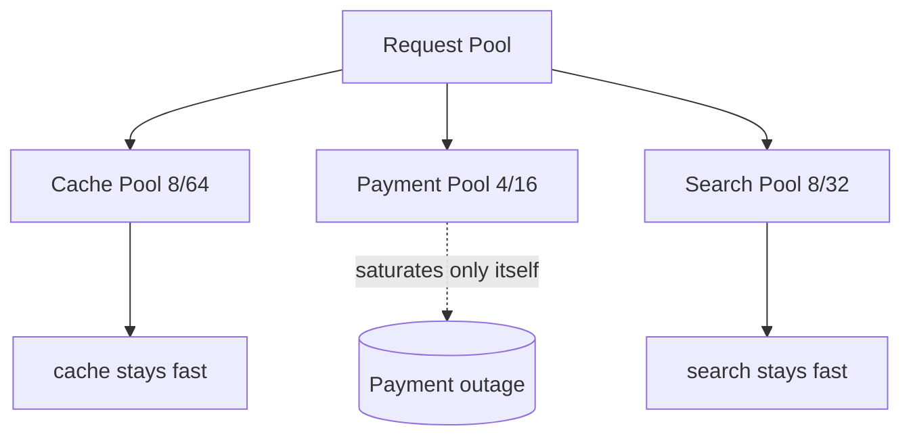
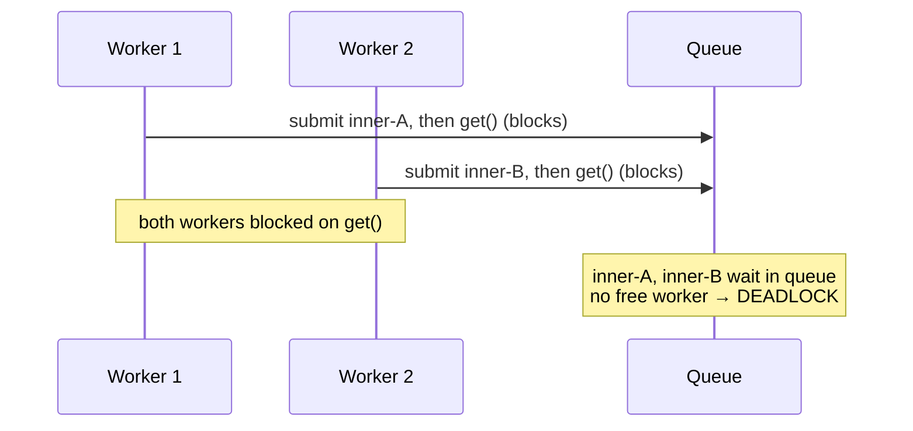
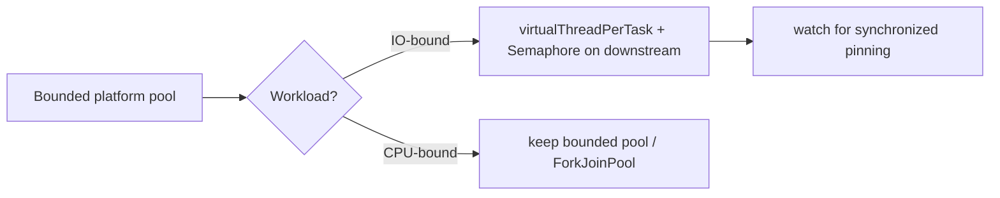

# Thread Pool — Senior Level

> **Source:** POSA2 (Schmidt et al.) · Doug Lea, *Concurrent Programming in Java* · JSR-166 (`java.util.concurrent`)
> **Category:** [Concurrency](../README.md) — *"Patterns for coordinating work across threads, cores, and machines."*
> **Prerequisite:** [middle.md](middle.md)

## Table of Contents

1. [Introduction](#1-introduction)
2. [Thread Pools at Architectural Scale](#2-thread-pools-at-architectural-scale)
3. [Pool-per-Subsystem / Bulkheads](#3-pool-per-subsystem--bulkheads)
4. [Concurrency Deep Dive](#4-concurrency-deep-dive)
5. [Testability Strategies](#5-testability-strategies)
6. [When Thread Pools Become a Problem](#6-when-thread-pools-become-a-problem)
7. [Code Examples — Advanced](#7-code-examples--advanced)
8. [Real-World Architectures](#8-real-world-architectures)
9. [Pros & Cons at Scale](#9-pros--cons-at-scale)
10. [Trade-off Analysis Matrix](#10-trade-off-analysis-matrix)
11. [Migration Patterns (to Virtual Threads)](#11-migration-patterns-to-virtual-threads)
12. [Diagrams](#12-diagrams)
13. [Related Topics](#13-related-topics)

---

## 1. Introduction

At senior level, a thread pool stops being a utility and becomes an **architectural boundary**. Each pool defines a concurrency domain: a hard limit on how much of the system can be doing one *kind* of thing at once. That limit is simultaneously a performance lever, a stability guarantee, and a failure-isolation boundary. The senior questions are: how many pools, where do their edges fall, how do they fail, and how do they degrade. The deadliest failures here aren't slow code — they're **pool-induced deadlock** and **cross-pool starvation**, where the *structure* of pool usage, not any single task, takes the system down.

---

## 2. Thread Pools at Architectural Scale

A service is rarely one pool. It's a *topology* of pools, each guarding a resource:

- An **accept/request pool** (the front door) bounds total in-flight requests.
- One **per-dependency pool** for each external system (DB, cache, payment API, search).
- A **CPU pool** for compute (serialization, compression, ML inference).
- A **scheduled pool** for periodic maintenance.

The architecture insight: **the smallest pool on a request's path is its true concurrency limit.** If requests need a DB connection and your DB pool is 10, then sizing the request pool at 500 just moves the queue — 490 requests wait inside the connection pool instead. Sizing must be done *along the whole path*, with the tightest resource as the anchor.

A second insight: **pools compose their failures.** If pool A's tasks block on pool B, then B's saturation propagates back into A as occupied-but-idle threads. The dependency graph between pools is as important as the call graph between services.

---

## 3. Pool-per-Subsystem / Bulkheads

The **bulkhead** pattern (named after a ship's watertight compartments) isolates failures by giving each subsystem its own pool. One flooded compartment doesn't sink the ship.

**The failure it prevents:** a shared pool of 50 threads serves both a fast cache and a slow, flaky payment API. The payment API degrades to 5-second latency. Within seconds, all 50 threads are parked on payment calls. Cache requests — which would return in 1 ms — now have *zero* available threads and time out. A failure in one dependency has taken down an *unrelated* feature. This is cascading failure via shared-pool exhaustion, and it's one of the most common production outages in service architectures.

**The fix:** separate pools.

```java
ExecutorService cachePool   = bounded("cache",   8,  64);
ExecutorService paymentPool = bounded("payment", 4,  16);   // small + isolated
ExecutorService searchPool  = bounded("search",  8,  32);
```

Now a payment outage saturates only `paymentPool` (16 threads), and its rejection policy sheds payment load while cache and search keep serving. The bulkhead converts a system-wide outage into a single-feature degradation. Pair each bulkhead pool with a [circuit breaker](../../../../system-design/README.md) on the same dependency for fast-fail once the pool is clearly overwhelmed.

**Cost:** lower total utilization (each pool reserves threads that sit idle when its subsystem is quiet) and more tuning surface. The trade is *efficiency for blast-radius control* — almost always worth it at scale.

---

## 4. Concurrency Deep Dive

### Pool-induced deadlock (thread starvation deadlock)

The textbook killer. A task running *on* the pool submits a subtask to the *same* pool and blocks (`Future.get()`) waiting for it.

```java
ExecutorService pool = Executors.newFixedThreadPool(2);

Future<String> outer = pool.submit(() -> {
    Future<String> inner = pool.submit(() -> "inner");   // same pool
    return inner.get();                                  // ✗ blocks a worker
});
```

With 2 workers, submit 2 outer tasks: both workers are now blocked on `inner.get()`, but no worker is free to *run* the inner tasks. The pool deadlocks at 100% "busy", 0% progress. The condition: **dependent tasks sharing a bounded pool, where parents block on children.** Fixes: (1) use a *separate* pool for inner work; (2) restructure to non-blocking composition (`CompletableFuture.thenCompose`) so no worker parks; (3) never call `get()` from a pool thread on the same pool.

### Starvation and fairness

A single pool with mixed task durations starves short tasks behind long ones (head-of-line blocking in a FIFO queue). Mitigations: priority queues (`PriorityBlockingQueue`) for differentiated work, or — better — separate pools per duration class so a long-running batch can't monopolize the crew serving latency-sensitive requests.

### The memory model boundary

Submitting a task to a pool establishes a **happens-before** edge: everything the submitting thread did before `submit()` is visible to the worker that runs the task. Likewise, `Future.get()` returning establishes happens-before from the task's completion back to the caller. This is why you can hand mutable state into a task and read its results without extra synchronization — the executor's internal queue handoff provides the memory barrier. Rely on this; don't add redundant `volatile`/locks around values already crossing a submit/`get()` boundary. (Full memory-model treatment in [professional.md](professional.md).)

---

## 5. Testability Strategies

Pools make tests flaky if you let them. Strategies:

- **Inject the `Executor`.** Take `Executor` (or `ExecutorService`) as a constructor dependency, never `new` one inside the class. In tests, inject a **same-thread executor** (`Runnable::run` / Guava's `directExecutor()`) so submitted work runs synchronously and deterministically.
- **Make the pool a seam, not a singleton.** A global static pool is untestable and unshuttable. DI it.
- **Test saturation explicitly.** Configure a tiny pool + tiny queue + `AbortPolicy` in a test and assert that the N+1th submission is rejected — proving your overload handling works *before* production proves it doesn't.
- **Deterministic concurrency.** Use `CountDownLatch`/`CyclicBarrier` to control task interleaving in tests rather than `Thread.sleep`. For interleaving-sensitive bugs, tools like `jcstress` stress the memory model.
- **Verify shutdown.** Assert `awaitTermination` returns true within a bound and that no threads leak (`ThreadMXBean` before/after).

```java
// Production wiring injects a real pool; tests inject a same-thread executor.
service = new ReportService(Runnable::run);   // tasks run inline → deterministic
```

---

## 6. When Thread Pools Become a Problem

- **Pool-induced deadlock** (above) — structural, not load-related; can lie dormant until a specific call pattern triggers it.
- **Thread-per-blocking-call doesn't scale.** A pool sized for 10,000 concurrent blocking I/O operations needs ~10,000 platform threads ≈ 10 GB of stack. The platform-thread pool *cannot* reach the concurrency a virtual-thread model handles trivially. When your Goetz-formula size is in the thousands, the pool is the wrong tool.
- **Queue-as-shock-absorber masks overload.** A generous queue keeps the pool from rejecting, so the system *looks* healthy (low error rate) while tail latency explodes. The queue converts an availability problem into a latency problem you may not be alerting on.
- **Tuning debt.** Every pool is N knobs × M environments of configuration that drifts out of date as workloads change. A topology of 8 pools is 56 numbers nobody re-validates.
- **Pool exhaustion cascades** across services when shared (the bulkhead failure of §3).

The senior judgment: a thread pool is the right tool for **bounded CPU-bound parallelism** and **capping concurrency on a downstream**. For **massively concurrent blocking I/O**, it's increasingly the wrong tool on the JVM — see §11.

---

## 7. Code Examples — Advanced

### Bulkhead with circuit-breaker fallback

```java
public CompletableFuture<Quote> getQuote(Req r) {
    return CompletableFuture
        .supplyAsync(() -> pricingClient.fetch(r), pricingPool)   // isolated pool
        .orTimeout(800, TimeUnit.MILLISECONDS)
        .exceptionally(ex -> Quote.cached(r));                    // degrade, don't fail
}
```

If `pricingPool` is saturated, `supplyAsync` rejects → the `exceptionally` branch serves a cached quote. The bulkhead + timeout + fallback keeps the page up while pricing is sick.

### Avoiding pool-induced deadlock with non-blocking composition

```java
// ✗ blocks a worker on the same pool
Future<B> f = pool.submit(() -> step2(pool.submit(this::step1).get()));

// ✓ no worker ever parks; stages chain without blocking
CompletableFuture
    .supplyAsync(this::step1, pool)
    .thenApplyAsync(this::step2, pool)   // safe: thenApply doesn't block a worker waiting
    .thenAccept(this::consume);
```

### Saturation-aware submission

```java
boolean accepted = false;
try { pool.execute(task); accepted = true; }
catch (RejectedExecutionException e) { metrics.shed(); /* shed load deliberately */ }
```

---

## 8. Real-World Architectures

- **Netflix Hystrix / resilience4j bulkheads.** Each dependency gets its own thread pool (or semaphore); a sick dependency saturates only its compartment. This pattern emerged directly from shared-pool exhaustion outages at scale.
- **Servlet container + connection pool stack.** Request pool (e.g., 200) → service logic → DB connection pool (e.g., 20). The 20-connection pool is the real limit; the request pool just decides whether excess waits or is rejected at the door.
- **Tiered pools by latency class.** Separate pools for interactive (low-latency, small queue, fail-fast) vs batch (high-throughput, large queue, caller-runs) work, so a nightly batch can't degrade the interactive path.
- **ForkJoinPool common pool for parallel streams.** `parallelStream()` uses the shared common pool — a hidden global resource. A blocking task in a parallel stream silently degrades *every* parallel stream in the JVM. Seniors give CPU-heavy or blocking parallel work its *own* `ForkJoinPool`.

---

## 9. Pros & Cons at Scale

| ✓ At scale | ✗ At scale |
|-----------|-----------|
| Per-pool limits become explicit, monitorable capacity contracts | Topology of pools = large, drifting tuning surface |
| Bulkheads convert system outages into single-feature degradations | Pool dependency graph adds a deadlock/starvation failure mode |
| Pools compose with circuit breakers, timeouts, fallbacks | Shared pools (parallelStream, common pool) cause action-at-a-distance |
| Queue depth + rejection rate are first-class saturation signals | Generous queues hide overload behind latency, dodging alerts |
| Deterministic capacity for capacity planning (Little's Law) | Platform-thread pools cap blocking-I/O concurrency far below need |

---

## 10. Trade-off Analysis Matrix

| Dimension | Single big pool | Per-subsystem pools (bulkheads) | Virtual threads |
|-----------|-----------------|-------------------------------|-----------------|
| Failure isolation | ✗ one bad dep sinks all | ✓ contained per compartment | ✓ no shared crew to exhaust |
| Total utilization | ✓ highest | ✗ idle reserves per pool | ✓ high (cheap threads) |
| Tuning burden | ✓ one set of knobs | ✗ N sets of knobs | ✓ minimal (no sizing) |
| Blocking-I/O scale | ✗ capped by thread count | ✗ capped per pool | ✓ scales to ~millions |
| CPU-bound parallelism | ✓ | ✓ | ✗ still need to bound (semaphore) |
| Predictable backpressure | ✓ via queue+policy | ✓ per compartment | ✗ must add explicit limiter |

---

## 11. Migration Patterns (to Virtual Threads)

Java 21 (Project Loom) makes threads cheap: a **virtual thread** is a lightweight, JVM-scheduled thread that yields its underlying carrier (a platform thread) whenever it blocks on I/O. This dissolves the sizing problem for blocking workloads — you create one virtual thread per task and stop tuning pool size.

**What changes:** for IO-bound, thread-per-request servers, the bounded platform-thread pool was a *workaround* for expensive threads. Remove the workaround:

```java
// Before: bounded platform-thread pool sized by the Goetz formula
ExecutorService pool = new ThreadPoolExecutor(80, 80, ...);

// After: one virtual thread per task — no sizing, no queue tuning
ExecutorService pool = Executors.newVirtualThreadPerTaskExecutor();
```

**What does NOT change — you still need to bound concurrency on downstreams.** Virtual threads remove the *thread* limit, not the *resource* limit. If 50,000 virtual threads all hit a 20-connection DB pool, you've moved the bottleneck, not removed it. Re-introduce a deliberate limiter:

```java
Semaphore dbLimit = new Semaphore(20);            // explicit concurrency cap
dbLimit.acquire();
try { return queryDatabase(); } finally { dbLimit.release(); }
```

**Migration checklist:**
1. Classify each pool: CPU-bound or IO-bound?
2. **IO-bound** → replace the pool with `newVirtualThreadPerTaskExecutor()`; add `Semaphore`s where you were relying on pool size to cap a downstream.
3. **CPU-bound** → keep a bounded platform-thread pool (or `ForkJoinPool`); virtual threads don't help compute and still need bounding.
4. **Watch for pinning.** A virtual thread blocked inside a `synchronized` block (or a native call) pins its carrier, negating the benefit. Replace `synchronized` with `ReentrantLock` on hot blocking paths.
5. Keep your **bulkhead semantics** — express them as semaphores/rate limiters rather than separate thread pools.

The mental shift: pools managed *both* concurrency and thread reuse. Virtual threads make reuse free, so the pool's remaining job — **bounding concurrency** — should be expressed *directly* (semaphore, rate limiter) rather than implicitly via thread count.

---

## 12. Diagrams

**Pool topology / bulkheads:**



**Pool-induced deadlock:**



**Migration to virtual threads:**



---

## 13. Related Topics

- [Producer–Consumer](../06-producer-consumer/junior.md) — the queue handoff and its happens-before edge.
- [Future / Promise](../07-future-promise/junior.md) — `CompletableFuture` non-blocking composition that avoids pool deadlock.
- [Half-Sync/Half-Async](../08-half-sync-half-async/junior.md) — the architectural layering bulkheaded pools sit inside.
- [Leader/Followers](../09-leader-followers/junior.md) — a pool variant that removes the queue handoff for lower latency.
