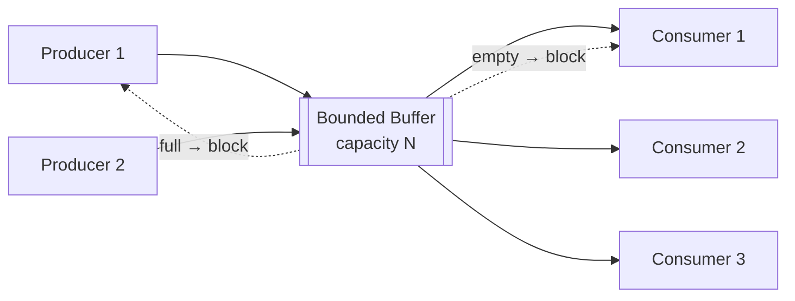
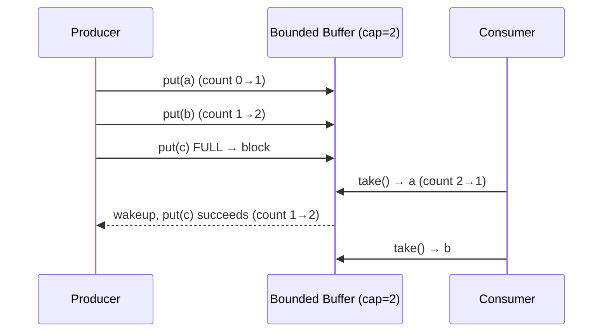

# Producer–Consumer — Junior Level

> **Source:** Dijkstra (bounded buffer) · Doug Lea, *Concurrent Programming in Java* · JSR-166 (`java.util.concurrent`)
> **Category:** [Concurrency](../README.md) — *"Patterns for coordinating work across threads, cores, and machines."*

---

## Table of Contents

1. [Introduction](#introduction)
2. [Prerequisites](#prerequisites)
3. [Glossary](#glossary)
4. [Core Concepts](#core-concepts)
5. [Real-World Analogies](#real-world-analogies)
6. [Mental Models](#mental-models)
7. [Pros & Cons](#pros-cons)
8. [Use Cases](#use-cases)
9. [Code Examples](#code-examples)
10. [Coding Patterns](#coding-patterns)
11. [Clean Code](#clean-code)
12. [Best Practices](#best-practices)
13. [Edge Cases & Pitfalls](#edge-cases-pitfalls)
14. [Common Mistakes](#common-mistakes)
15. [Tricky Points](#tricky-points)
16. [Test Yourself](#test-yourself)
17. [Tricky Questions](#tricky-questions)
18. [Cheat Sheet](#cheat-sheet)
19. [Summary](#summary)
20. [What You Can Build](#what-you-can-build)
21. [Further Reading](#further-reading)
22. [Related Topics](#related-topics)
23. [Diagrams & Visual Aids](#diagrams-visual-aids)

---

## Introduction

> Focus: **What is it?** and **How to use it?**

**Producer–Consumer** is a concurrency pattern that decouples threads that *create* work from threads that *process* it, using a shared **buffer** (a queue) sitting between them. Producers drop items into the buffer; consumers pull items out. Neither side calls the other directly. They only ever touch the queue.

That single layer of indirection buys you two things that are hard to get any other way:

1. **Rate smoothing.** Producers and consumers run at different, fluctuating speeds. The buffer absorbs the difference so a momentary burst from one side doesn't stall the other.
2. **Backpressure.** When the buffer is **bounded** (has a maximum size), a fast producer that outruns the consumers eventually finds the queue full and *blocks* — it is forced to slow down to the consumers' pace. That self-regulation is the whole point.

In one sentence: *"Put work in a box; let some threads fill the box and other threads empty it, and make the box push back when it's full or empty."*

This is one of the oldest problems in concurrency. Edsger Dijkstra formalized the **bounded-buffer problem** in the 1960s, and it remains the canonical exercise for understanding condition synchronization. In modern Java you rarely hand-roll it — you use a `BlockingQueue`. In Go, the language gives it to you for free: a **channel** *is* a producer–consumer buffer. We will build all three.

---

## Prerequisites

What you should know before reading this:

- **Required:** Threads — how to start one, and the idea that two threads run "at the same time" and interleave unpredictably.
- **Required:** Shared mutable state and **race conditions** — why two threads writing the same variable without coordination corrupts it.
- **Required:** A mutex / lock (`synchronized` in Java, `sync.Mutex` in Go) — mutual exclusion of a critical section.
- **Helpful:** [Monitor Object](../02-monitor-object/junior.md) — Producer–Consumer is the textbook use of a monitor's `wait`/`notify` mechanism.
- **Helpful:** Queues (FIFO) as a data structure. The buffer is almost always a queue.

---

## Glossary

| Term | Meaning |
|------|---------|
| **Producer** | A thread that creates work items and puts them into the buffer. |
| **Consumer** | A thread that takes work items out of the buffer and processes them. |
| **Buffer / Queue** | The shared data structure between producers and consumers. Usually FIFO. |
| **Bounded buffer** | A buffer with a fixed maximum capacity. Full → producers block. |
| **Unbounded buffer** | A buffer with no capacity limit. Never blocks producers — but can exhaust memory. |
| **Backpressure** | The mechanism by which a full buffer slows producers down, propagating "I'm overloaded" upstream. |
| **Blocking** | A thread voluntarily suspends (releasing the CPU and the lock) until a condition becomes true. |
| **`wait` / `notify`** | Java's monitor primitives: `wait()` parks a thread on a condition; `notify`/`notifyAll` wakes parked threads. |
| **Lost wakeup** | A bug where a notification fires before a thread starts waiting, so the wait blocks forever. |
| **Spurious wakeup** | A thread returns from `wait()` without being notified. Real and allowed by the JVM — hence the `while` loop. |
| **Poison pill** | A sentinel item that means "shut down" — used to stop consumers cleanly. |
| **Channel (Go)** | A built-in, type-safe, thread-safe producer–consumer queue. `ch <- x` produces, `<-ch` consumes. |

---

## Core Concepts

### 1. The buffer is the only shared state

Producers and consumers do **not** know about each other. The only thing they share is the buffer. This is what makes the pattern so composable: you can add more producers or more consumers without changing any of the existing ones. They just contend on the same queue.

### 2. Two conditions, not one

A bounded buffer has **two** blocking conditions, and beginners almost always forget one of them:

- **"Buffer is full"** → a producer must wait until a consumer removes something.
- **"Buffer is empty"** → a consumer must wait until a producer adds something.

A correct implementation handles both. Drop either check and you get either lost data (overwriting a full buffer) or a crash (reading from an empty one).

### 3. Wait inside a `while`, never an `if`

This is the single most important rule in this entire topic.

```java
while (count == capacity) {   // ✓ re-check after waking
    notFull.await();
}
```

```java
if (count == capacity) {      // ✗ WRONG — see Tricky Points
    notFull.await();
}
```

After a thread wakes from `wait()`, the condition it waited for **may no longer hold** — another thread could have raced in and grabbed the slot, or the JVM may have woken it spuriously. You must re-test the condition. A `while` loop does exactly that. An `if` checks once and trusts it, which is a race waiting to happen.

### 4. Bounded gives backpressure; unbounded gives OOM risk

A **bounded** buffer is a feature, not a limitation. The bound is what makes the producer block, which is what protects a slow consumer from being buried. An **unbounded** queue never blocks the producer — which sounds nice until the producer is twice as fast as the consumer and the queue grows until the process runs out of memory. Prefer bounded buffers by default.

### 5. A Thread Pool *is* a Producer–Consumer

When you submit tasks to an `ExecutorService`, you are the producer, the internal task queue is the buffer, and the worker threads are the consumers. See [Thread Pool](../05-thread-pool/junior.md). Understanding Producer–Consumer is understanding how thread pools work under the hood.

---

## Real-World Analogies

- **A kitchen pass.** Cooks (producers) place finished plates on the heated pass; waiters (consumers) pick them up and carry them out. The pass is the buffer. If the pass fills up, cooks have nowhere to put food and must pause — backpressure. If the pass is empty, waiters wait.
- **An airport baggage carousel.** Handlers (producers) load bags onto the belt; passengers (consumers) take their bag off. The belt is a bounded buffer; if it's packed, handlers stop loading.
- **A mailbox.** The postal worker drops letters in (produce); you take them out (consume). You don't need to be home when the letter arrives — the mailbox decouples you in time. That decoupling-in-time is the essence of the pattern.

---

## Mental Models

**Model 1 — The conveyor belt.** Picture a belt with a fixed number of slots. Producers stand on the left placing items in empty slots; consumers stand on the right taking items out. When all slots are full, the left side stops. When all slots are empty, the right side stops. Backpressure is just "the belt is full, stop feeding it."

**Model 2 — Two faucets and a bucket.** The producer is a faucet filling a bucket; the consumer is a drain emptying it. A *bounded* bucket overflows if you don't stop the faucet — so the pattern wires a float valve that shuts the faucet when full. An *unbounded* bucket is a bucket with no top: convenient, until the room floods.

**Model 3 — Mailboxes between actors.** Forget shared memory; think messages. Each item handed across the buffer is a message. The producer fires and forgets; the consumer receives whenever it's ready. This is the bridge to message queues and Go channels.

---

## Pros & Cons

| ✓ Pros | ✗ Cons |
|--------|--------|
| Decouples producers from consumers — add/remove either side freely | Adds latency: an item waits in the queue before processing |
| Smooths bursty load; buffer absorbs spikes | Bounded buffer adds a tuning knob (capacity) you must size correctly |
| Built-in backpressure with a bounded buffer | Unbounded buffer risks out-of-memory under sustained overload |
| Naturally parallel: scale consumers to use more cores | Ordering across multiple consumers is not guaranteed |
| Clean shutdown story (poison pills / channel close) | Hand-rolled versions are error-prone (`while` loops, `notifyAll`) |

---

## Use Cases

- **Web servers:** the acceptor thread produces requests; a worker pool consumes them.
- **Logging:** application threads produce log records into a queue; one background thread consumes and writes to disk, so I/O never blocks business logic.
- **ETL / data pipelines:** a reader produces rows; transformers and writers consume.
- **Image/video processing:** a frame grabber produces frames; encoder threads consume them.
- **Email/notification dispatch:** request handlers enqueue messages; a sender pool delivers them.

---

## Code Examples

### Java — hand-rolled bounded buffer (`wait`/`notifyAll`)

This is the classic exercise. It shows exactly what a `BlockingQueue` does for you.

```java
public class BoundedBuffer<T> {
    private final Object[] items;
    private int head, tail, count;          // ring-buffer indices

    public BoundedBuffer(int capacity) {
        this.items = new Object[capacity];
    }

    public synchronized void put(T item) throws InterruptedException {
        while (count == items.length) {     // ✓ while, not if
            wait();                         // releases the lock, parks the thread
        }
        items[tail] = item;
        tail = (tail + 1) % items.length;
        count++;
        notifyAll();                        // wake any waiting consumers
    }

    @SuppressWarnings("unchecked")
    public synchronized T take() throws InterruptedException {
        while (count == 0) {                // ✓ while, not if
            wait();
        }
        T item = (T) items[head];
        items[head] = null;                 // help GC; avoid leaking references
        head = (head + 1) % items.length;
        count--;
        notifyAll();                        // wake any waiting producers
        return item;
    }
}
```

Two `synchronized` methods, two `while` guards, `notifyAll` after every change. That is the whole pattern. Note we use **one** lock (the object's monitor) for both conditions, which is why we must use `notifyAll`, not `notify` — a `notify` might wake the wrong kind of waiter (a producer that wakes another producer). More on this in Tricky Points.

### Java — idiomatic `BlockingQueue`

In real code you do not write the above. You write this:

```java
import java.util.concurrent.*;

BlockingQueue<Task> queue = new ArrayBlockingQueue<>(1000);   // bounded

// Producer
queue.put(task);    // blocks if the queue is full

// Consumer
Task task = queue.take();   // blocks if the queue is empty
```

`put` and `take` are the blocking, backpressure-aware operations. `ArrayBlockingQueue` is bounded; `LinkedBlockingQueue` can be bounded or unbounded. The library handles every locking detail correctly.

### Go — channels (producer–consumer made first-class)

In Go you don't reach for a library; the language *is* the pattern. A channel with a buffer is a bounded queue.

```go
func main() {
    jobs := make(chan int, 100) // buffered channel = bounded buffer (capacity 100)
    var wg sync.WaitGroup

    // Consumers
    for w := 0; w < 3; w++ {
        wg.Add(1)
        go func() {
            defer wg.Done()
            for job := range jobs { // ranges until the channel is closed
                process(job)
            }
        }()
    }

    // Producer
    for i := 0; i < 1000; i++ {
        jobs <- i // blocks when the buffer is full — backpressure, for free
    }
    close(jobs) // signal "no more work"; consumers' range loops then exit

    wg.Wait()
}
```

`jobs <- i` is produce; `for job := range jobs` is consume; `close(jobs)` is graceful shutdown. There are no locks, no `wait`/`notify`, no poison pills. This is why Go's tagline is *"share memory by communicating."*

---

## Coding Patterns

- **The drain loop (consumer):** `while (running) { item = take(); process(item); }` — a consumer is almost always an infinite loop pulling from the buffer.
- **The fire-and-forget producer:** `queue.put(item)` and move on. The producer never waits for processing to finish.
- **Fan-out:** one producer, many consumers — to parallelize processing.
- **Fan-in:** many producers, one consumer — e.g. many request threads, one DB writer.
- **Pipeline:** chain stages where each stage's consumer is the next stage's producer (especially natural with Go channels).

---

## Clean Code

- **Name the queue for its contents:** `pendingEmails`, not `queue` or `buf`.
- **Hide the queue behind an interface.** Producers should call `submit(task)`, not poke a raw `BlockingQueue`. This lets you swap the buffer later.
- **Make items immutable.** Once an item is handed to the buffer, the producer must not mutate it — the consumer may already be reading it. Immutable items eliminate a whole class of races.
- **Prefer `BlockingQueue` / channels over hand-rolled `wait`/`notify`.** Hand-rolling is for learning; the standard library is for production.

---

## Best Practices

1. **Bound your buffers.** Pick a sensible capacity; never use an unbounded queue unless you have proven the producer cannot outrun the consumer.
2. **Always wait in a `while` loop.** Re-check the condition after every wakeup.
3. **Use `notifyAll`, not `notify`,** when one lock guards multiple wait conditions (full and empty).
4. **Plan shutdown from day one.** Decide on poison pills (Java) or `close()` (Go) before you ship.
5. **Don't do heavy work while holding the lock.** Take the item out, *then* process it outside the critical section.
6. **Make items immutable** so the hand-off is safe.

---

## Edge Cases & Pitfalls

- **Empty buffer at startup:** consumers must block, not spin or crash.
- **Full buffer under burst:** producers must block (or be rejected), not silently drop or overwrite.
- **Shutdown with items still queued:** decide — drain remaining items, or discard? Document it.
- **A consumer crashes mid-item:** the item is lost unless you have acknowledgment. (At-least-once delivery needs more than a plain queue.)
- **Interrupt during `put`/`take`:** these methods throw `InterruptedException`. You must handle it — usually by stopping cleanly.

---

## Common Mistakes

1. **Using `if` instead of `while` around `wait()`.** The number-one Producer–Consumer bug. Causes corruption under spurious wakeups and multi-thread races.
2. **Forgetting one of the two conditions.** Handling "empty" but not "full," so producers overrun a full buffer.
3. **Using `notify` with mixed waiters.** A producer wakes another producer; both go back to sleep; deadlock. Use `notifyAll`.
4. **Holding the lock during processing.** Kills throughput — only one thread works at a time.
5. **Unbounded queue "to be safe."** It is the opposite of safe; it converts overload into an out-of-memory crash.
6. **No shutdown mechanism.** Consumers block forever on `take()` and the program never exits.

---

## Tricky Points

- **Why `notifyAll` and not `notify`?** With a single lock and two conditions (full/empty), `notify` wakes *one arbitrary* waiter. If a producer finishes and `notify` happens to wake another producer (which still can't proceed because the buffer is full), the consumers that *could* proceed stay asleep. Over time everyone parks → deadlock. `notifyAll` wakes everyone; the ones that can't proceed re-check their `while` and go back to sleep. The fix for the cost of `notifyAll` (waking too many) is to use two separate `Condition` objects — covered at the Middle level.
- **`wait()` releases the lock.** A common misconception is that a waiting thread holds the lock. It does not — `wait()` atomically releases the monitor and parks, then re-acquires before returning. That's what lets other threads make progress.
- **Spurious wakeups are real.** The JVM is permitted to return from `wait()` with no `notify`. Your `while` loop is what makes this harmless.

---

## Test Yourself

1. What are the *two* conditions a bounded buffer must block on?
2. Why must you wait inside a `while` loop and not an `if`?
3. What does a bounded buffer give you that an unbounded one does not?
4. In Go, what closes the producer–consumer relationship cleanly?
5. How is a Thread Pool an instance of Producer–Consumer?

<details><summary>Answers</summary>

1. "Buffer full" (producers wait) and "buffer empty" (consumers wait).
2. Because the awaited condition may be false again after waking (spurious wakeup or another thread raced in); `while` re-checks it.
3. **Backpressure** — a full bounded buffer blocks the producer, protecting a slow consumer; unbounded never blocks and risks OOM.
4. `close(ch)` — the consumers' `for range ch` loops then terminate.
5. The submitter is the producer, the internal task queue is the buffer, and the worker threads are the consumers.

</details>

---

## Tricky Questions

- If `put` and `take` both call `notifyAll`, can a single `notifyAll` ever wake a thread that *immediately* has to go back to sleep? *(Yes — that's expected; the `while` loop handles it.)*
- Is the order in which items come out of a multi-consumer buffer the same as the order they went in? *(The queue is FIFO, but which consumer gets which item — and when it finishes — is not ordered.)*
- What happens if a producer puts an item and there are no consumers running yet? *(It sits in the buffer; nothing is lost as long as the buffer isn't full.)*

---

## Cheat Sheet

```
INTENT   Decouple producers from consumers via a shared bounded buffer;
         smooth rate mismatch; provide backpressure.

JAVA     Hand-rolled : synchronized + while(full)/while(empty) + notifyAll
         Idiomatic   : BlockingQueue.put() / .take()   (ArrayBlockingQueue)
         High-perf   : LMAX Disruptor ring buffer

GO       ch := make(chan T, N)   // bounded buffer
         ch <- x                 // produce (blocks when full)
         x := <-ch / range ch    // consume (blocks when empty)
         close(ch)               // graceful shutdown

RULES    1. Bound the buffer (backpressure, no OOM)
         2. wait() inside while, never if
         3. notifyAll, not notify (one lock, two conditions)
         4. plan shutdown: poison pill (Java) / close (Go)
         5. process OUTSIDE the lock
```

---

## Summary

Producer–Consumer puts a **bounded buffer** between threads that create work and threads that process it. The buffer decouples the two sides in time, smooths bursty load, and — because it is bounded — provides **backpressure** that forces fast producers to wait for slow consumers. In Java you can hand-roll it with `synchronized` + `while` + `notifyAll`, but you should use a `BlockingQueue` in real code. In Go, a buffered channel *is* the pattern. The rules that matter most: bound the buffer, always wait in a `while` loop, use `notifyAll`, and plan your shutdown.

---

## What You Can Build

- A background **log writer** that batches application logs off the hot path.
- A **download manager** with a fixed pool of consumers pulling URLs off a queue.
- A simple **job worker** that accepts tasks over HTTP and processes them asynchronously.
- A **multi-stage pipeline** (read → transform → write) using channels.

---

## Further Reading

- Doug Lea, *Concurrent Programming in Java*, ch. on bounded buffers.
- *Java Concurrency in Practice* (Goetz et al.), ch. 5 — `BlockingQueue` and the producer–consumer idiom.
- The Go Blog, *Go Concurrency Patterns: Pipelines and cancellation*.
- Dijkstra, *Cooperating Sequential Processes* (the origin of the bounded-buffer problem).

---

## Related Topics

- [Monitor Object](../02-monitor-object/junior.md) — the `wait`/`notify` machinery behind the hand-rolled buffer.
- [Thread Pool](../05-thread-pool/junior.md) — a pool *is* a producer–consumer where consumers are workers.
- [Balking](../11-balking/junior.md) — the alternative to blocking when the buffer can't accept work right now.

---

## Diagrams & Visual Aids




