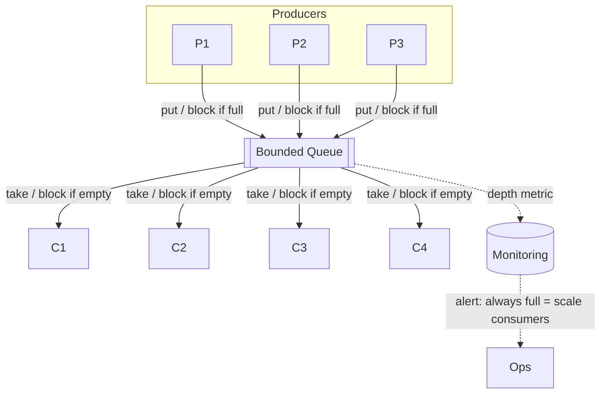
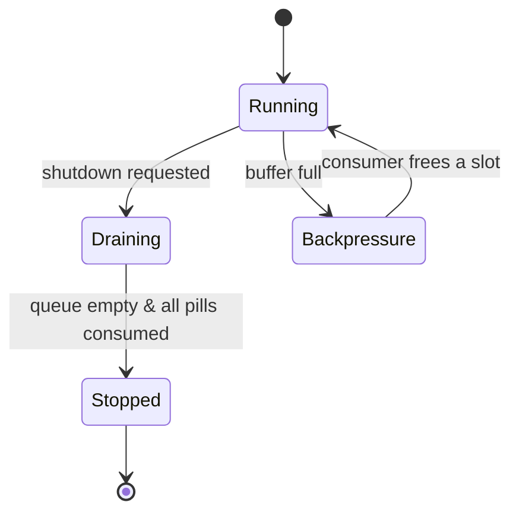

# Producer–Consumer — Middle Level

> **Source:** Dijkstra (bounded buffer) · Doug Lea, *Concurrent Programming in Java* · JSR-166 (`java.util.concurrent`)
> **Category:** [Concurrency](../README.md) — *"Patterns for coordinating work across threads, cores, and machines."*
> **Prerequisite:** [Junior](junior.md)

---

## Table of Contents

1. [Introduction](#introduction)
2. [When to Use Producer–Consumer](#when-to-use)
3. [When NOT to Use It](#when-not-to-use)
4. [Real-World Cases](#real-world-cases)
5. [Code Examples — Production-Grade](#code-examples-production-grade)
6. [Bounded vs Unbounded Buffers & Backpressure](#bounded-vs-unbounded)
7. [Multiple Producers/Consumers & Shutdown (poison pills)](#multiple-and-shutdown)
8. [Trade-offs](#trade-offs)
9. [Alternatives Comparison](#alternatives-comparison)
10. [Refactoring to Producer–Consumer](#refactoring)
11. [Pros & Cons (Deeper)](#pros-cons-deeper)
12. [Edge Cases](#edge-cases)
13. [Tricky Points](#tricky-points)
14. [Best Practices](#best-practices)
15. [Tasks (Practice)](#tasks)
16. [Summary](#summary)
17. [Related Topics](#related-topics)
18. [Diagrams](#diagrams)

---

## Introduction

> Focus: **When to use it?** and **What are the trade-offs?**

At the junior level you learned *what* the pattern is and the two ironclad rules (`while` loops, `notifyAll`). At the middle level the questions change. *When* does a bounded buffer earn its keep versus a direct call? *How big* should the buffer be? What happens with **multiple** producers and consumers, and how do you shut the whole thing down without losing work or hanging a thread forever? This level is about turning the textbook buffer into a production component.

The central design decision is almost always **bounded vs unbounded**, because that decision *is* the decision about backpressure — and backpressure is the difference between a system that degrades gracefully under load and one that falls over.

---

## When to Use Producer–Consumer

Reach for it when **all** of these are true:

- **Rates differ and fluctuate.** Producers and consumers run at different, bursty speeds. The buffer absorbs the mismatch.
- **Work can be processed asynchronously.** The producer doesn't need the result immediately (or at all). If it needs the result *now*, you want a [Future/Promise](../07-future-promise/junior.md), not a fire-and-forget queue.
- **You want to parallelize processing.** Fan out to N consumers to use N cores.
- **You need to throttle.** A bounded buffer caps in-flight work, protecting downstream systems (a database, a third-party API) from being overwhelmed.

It is the natural decomposition whenever a fast, latency-sensitive thread (an HTTP acceptor, a UI thread) must hand slow work (disk I/O, image encoding) to background threads.

---

## When NOT to Use It

- **The consumer needs to return a result to the producer.** A plain queue is one-way. Use a Future, a request/response channel, or a synchronous call.
- **Strict total ordering is required across all items** *and* you have multiple consumers. Parallel consumers reorder completion. Use a single consumer or partition the work so each key goes to one consumer.
- **The work is trivial.** If processing an item is cheaper than the queue's lock/handoff overhead, the buffer is pure cost. Just call the function.
- **You can't tolerate any added latency.** The buffer always adds queueing delay. Real-time hot paths may not afford it.
- **The producer truly cannot ever outrun the consumer.** Then bounding buys nothing — but it also costs nothing, so still prefer bounded.

---

## Real-World Cases

- **Database write batching.** Many request threads (producers) enqueue rows; a single writer (consumer) batches them into one `INSERT ... VALUES (...), (...)` every 50 ms. Fan-in plus batching cuts round-trips by 100×.
- **Webhook delivery.** API handlers enqueue outbound webhooks; a consumer pool delivers them with retries, isolating slow third parties from the request path.
- **Metrics/telemetry.** Hot-path code drops measurements into a bounded ring; a flusher consumes and ships them. If the ring fills, you *drop* metrics (a deliberate "lossy under pressure" choice) rather than slow the app.
- **Video transcoding.** A demuxer produces frames; an encoder pool consumes. Bounded buffer keeps memory flat regardless of input size.

---

## Code Examples — Production-Grade

### Java — two `Condition`s instead of `notifyAll`

The hand-rolled junior version used one lock and `notifyAll`, which wakes producers and consumers indiscriminately. A production buffer uses a `ReentrantLock` with **two separate conditions**, so you signal *only* the side that can make progress. This is exactly how `ArrayBlockingQueue` is built.

```java
public class BoundedBuffer<T> {
    private final ReentrantLock lock = new ReentrantLock();
    private final Condition notFull  = lock.newCondition();
    private final Condition notEmpty = lock.newCondition();
    private final Object[] items;
    private int head, tail, count;

    public BoundedBuffer(int capacity) { items = new Object[capacity]; }

    public void put(T x) throws InterruptedException {
        lock.lock();
        try {
            while (count == items.length) notFull.await();  // ✓ while
            items[tail] = x;
            tail = (tail + 1) % items.length;
            count++;
            notEmpty.signal();   // wake ONE consumer — targeted, not notifyAll
        } finally {
            lock.unlock();
        }
    }

    @SuppressWarnings("unchecked")
    public T take() throws InterruptedException {
        lock.lock();
        try {
            while (count == 0) notEmpty.await();            // ✓ while
            T x = (T) items[head];
            items[head] = null;
            head = (head + 1) % items.length;
            count--;
            notFull.signal();    // wake ONE producer
            return x;
        } finally {
            lock.unlock();
        }
    }
}
```

With two conditions, `signal` (wake one) is safe and cheaper than `signalAll`, because every thread on `notFull` genuinely *can* proceed once a slot opens. This is the targeted-signalling optimization.

### Java — the version you actually ship

```java
ExecutorService consumers = Executors.newFixedThreadPool(4);
BlockingQueue<Order> queue = new ArrayBlockingQueue<>(2000);

// consumers
for (int i = 0; i < 4; i++) {
    consumers.submit(() -> {
        try {
            while (true) {
                Order o = queue.take();          // blocks when empty
                if (o == POISON_PILL) break;     // graceful shutdown
                process(o);
            }
        } catch (InterruptedException e) {
            Thread.currentThread().interrupt();
        }
    });
}

// producer
queue.put(order);                                 // blocks when full → backpressure
```

### Go — worker pool with bounded channel and clean shutdown

```go
func runPipeline(ctx context.Context, inputs []Order) {
    jobs := make(chan Order, 1000)   // bounded
    var wg sync.WaitGroup

    for i := 0; i < 4; i++ {         // consumer pool
        wg.Add(1)
        go func() {
            defer wg.Done()
            for o := range jobs {    // exits when jobs is closed
                process(o)
            }
        }()
    }

    go func() {                      // producer
        defer close(jobs)            // close = "no more work" = shutdown signal
        for _, o := range inputs {
            select {
            case jobs <- o:          // blocks when full → backpressure
            case <-ctx.Done():       // cancellation
                return
            }
        }
    }()

    wg.Wait()
}
```

In Go, `close(jobs)` replaces the poison pill entirely — *one* close signals *all* consumers. That's cleaner than Java, where you must enqueue one poison pill per consumer.

---

## Bounded vs Unbounded Buffers & Backpressure

| | Bounded buffer | Unbounded buffer |
|---|---|---|
| Producer blocks when full? | ✓ Yes | ✗ Never |
| Backpressure to producer | ✓ Built-in | ✗ None |
| Memory under sustained overload | ✓ Flat (capped) | ✗ Grows → OOM |
| Latency under overload | Bounded by capacity | Unbounded (queue grows forever) |
| Risk | Producer stalls if consumer dies | Process dies (OOM) if consumer dies |
| Default choice | **✓ Yes** | Only when overrun is provably impossible |

**The key insight:** an unbounded queue doesn't *remove* the overload problem, it *relocates* it. The producer never feels pain, so the pain accumulates as memory until the whole process dies — at the worst possible time, and with no warning. A bounded queue surfaces the problem *immediately* as producer slowdown, which you can monitor, alert on, and shed load against.

**Three responses when a bounded buffer fills:**

1. **Block** the producer (`put`, `ch <- x`) — apply backpressure. Default.
2. **Reject** the item (`offer()` returns `false`, `select { case ch<-x: default: }`) — fail fast / shed load. See [Balking](../11-balking/junior.md).
3. **Drop** the oldest or newest (ring-buffer overwrite, `Disruptor` with a non-blocking strategy) — for lossy telemetry where freshness beats completeness.

Choosing among block / reject / drop is a *product* decision, not a technical one.

---

## Multiple Producers/Consumers & Shutdown (poison pills)

**Multiple producers, multiple consumers** is the common case and works without changes — they all contend on the same thread-safe buffer. The subtleties are about *shutdown*, which is where most production bugs live.

**The poison pill (Java).** A sentinel item meaning "stop." The classic mistake: enqueue *one* pill for *N* consumers. The first consumer takes it and exits; the others block forever. You must enqueue **one pill per consumer**, or use a known-count latch.

```java
static final Order POISON_PILL = new Order(); // unique sentinel
// to shut down N consumers:
for (int i = 0; i < N; i++) queue.put(POISON_PILL);
```

A subtler rule: **producers must finish before pills are sent**, and pills go in *after* real work. Otherwise a consumer eats the pill while items remain behind it and exits early, losing data. (Unless you intentionally want to discard remaining work.)

**Go's `close`** sidesteps all of this: close the channel once, and every `for range` consumer terminates after draining what's left. But note: **closing a channel that producers still write to panics.** With multiple producers, you need a `sync.WaitGroup` over producers and a single goroutine that closes the channel after all producers finish.

```go
go func() { producerWg.Wait(); close(jobs) }()  // close only after all producers done
```

---

## Trade-offs

| Decision | Option A | Option B | Pick A when… |
|----------|----------|----------|--------------|
| Bound | Bounded | Unbounded | Almost always (backpressure, memory safety) |
| Full behavior | Block | Reject/Drop | You must not lose work and can tolerate producer stall |
| Signalling | One lock + `notifyAll` | Two `Condition`s + `signal` | Throughput matters and waiter types are mixed → B |
| Consumers | One | Pool | Order matters → one; throughput matters → pool |
| Shutdown | Poison pill | Interrupt / `close` | — language/idiom dependent |

---

## Alternatives Comparison

| Approach | Decoupling | Backpressure | Result back to caller | Cross-process |
|----------|-----------|--------------|----------------------|---------------|
| **Producer–Consumer (in-proc queue)** | ✓ | ✓ (if bounded) | ✗ | ✗ |
| Direct synchronous call | ✗ | n/a | ✓ | ✗ |
| [Future/Promise](../07-future-promise/junior.md) | partial | ✗ | ✓ | ✗ |
| [Thread Pool](../05-thread-pool/junior.md) | ✓ (is P–C) | ✓ (bounded queue) | ✓ (via `Future`) | ✗ |
| Message queue (Kafka/SQS) | ✓ | ✓ | ✗ | ✓ |

A Thread Pool *is* a Producer–Consumer where the consumers are reusable workers and the result comes back via a `Future`. A distributed message queue is Producer–Consumer crossing the process and machine boundary.

---

## Refactoring to Producer–Consumer

**Before** — the HTTP handler does slow work inline; every request waits on disk and the third-party email API:

```java
@PostMapping("/order")
public void create(@RequestBody Order o) {
    saveToDb(o);
    sendConfirmationEmail(o);   // slow: 300 ms, blocks the request thread
    writeAuditLog(o);           // slow: disk I/O
}
```

**After** — push slow, fire-and-forget work onto a bounded queue; the request returns immediately, consumers do the slow parts:

```java
@PostMapping("/order")
public void create(@RequestBody Order o) {
    saveToDb(o);                       // still synchronous — caller needs it
    emailQueue.put(o);                 // hand off; returns in microseconds
    auditQueue.put(o);
}
```

The refactor cut p99 latency from 350 ms to ~5 ms and, because the queue is bounded, a slow email provider now applies backpressure instead of pinning every request thread.

---

## Pros & Cons (Deeper)

| ✓ Pros | ✗ Cons |
|--------|--------|
| Isolates slow/unreliable work from latency-sensitive threads | Adds a tuning surface: capacity, consumer count |
| Bounded buffer turns overload into observable backpressure | Fire-and-forget means errors happen *after* the producer left — needs its own error handling |
| Scales consumers independently of producers | At-least-once / durability needs more than an in-memory queue |
| Batching opportunities (consumer drains N at once) | Shutdown correctness is genuinely tricky (pills, draining) |

---

## Edge Cases

- **Poison pill ordering:** pills enqueued before real work drains → premature shutdown, lost items.
- **Producer faster than consumers, forever:** bounded → producers permanently blocked (a real, intended signal — alert on it). Unbounded → OOM.
- **Consumer throws an exception** mid-item: the item is gone. Wrap processing in try/catch; decide retry vs dead-letter.
- **All consumers die:** producers block on a full buffer indefinitely. Add a watchdog / health check.
- **Re-entrancy:** a consumer that produces back into the *same* bounded queue can self-deadlock when the queue is full. Use a separate queue or unbounded handoff for the recursive path.

---

## Tricky Points

- **`signal` vs `signalAll` with two conditions:** with separate `notFull`/`notEmpty` conditions, `signal` (wake one) is correct and faster, because every thread waiting on a condition can genuinely proceed. With one lock and `notifyAll`, you *must* wake all because you can't target. The two-condition design is the optimization.
- **`offer` vs `put`:** `put` blocks (backpressure); `offer` returns immediately with `true`/`false` (balking). `offer(x, timeout)` is the middle ground — wait a bit, then give up.
- **Draining on shutdown:** `BlockingQueue.drainTo(list)` atomically empties the queue — useful for "process what's left, then stop."

---

## Best Practices

1. **Default to bounded.** Justify any unbounded queue in writing.
2. **Choose block/reject/drop explicitly** and document it where the queue is created.
3. **One poison pill per consumer**, sent only after producers finish; in Go, close exactly once after all producers are done.
4. **Wrap consumer work in try/catch** — a fire-and-forget error must not kill the consumer thread silently.
5. **Monitor queue depth.** A queue that's always full means under-provisioned consumers; always empty means over-provisioned. Both are alerts.
6. **Use two `Condition`s** (or just a `BlockingQueue`) for any real throughput.

---

## Tasks (Practice)

1. Convert the one-lock/`notifyAll` junior buffer to a two-`Condition` `ReentrantLock` version; verify with a stress test of 4 producers / 4 consumers.
2. Implement `offer(x, timeout)` returning `false` on timeout. Compare behavior under overload to blocking `put`.
3. Build a worker pool with correct poison-pill shutdown for N consumers; prove no consumer hangs and no item is lost.
4. In Go, build a multi-producer pipeline that closes the channel exactly once after all producers finish; trigger and then fix a close-panic.
5. Add queue-depth metrics and reproduce "consumers under-provisioned" vs "over-provisioned" by tuning sleep times.

---

## Summary

The middle-level Producer–Consumer is a design conversation about **backpressure and shutdown**. Prefer **bounded** buffers — they convert overload into observable producer slowdown instead of an invisible march toward OOM. Decide block vs reject vs drop deliberately. Use a `ReentrantLock` with two `Condition`s (or just a `BlockingQueue`) so you can signal precisely. Get shutdown right: one poison pill per consumer after producers finish, or a single `close` in Go after all producers are done. Done well, the pattern isolates slow work, scales consumers independently, and degrades gracefully.

---

## Related Topics

- [Monitor Object](../02-monitor-object/junior.md) — the lock + condition primitive underneath.
- [Thread Pool](../05-thread-pool/junior.md) — a pool is a Producer–Consumer with reusable worker-consumers.
- [Balking](../11-balking/junior.md) — the reject/drop alternative to blocking when the buffer is full.
- [Future/Promise](../07-future-promise/junior.md) — when the producer needs the result back.

---

## Diagrams




