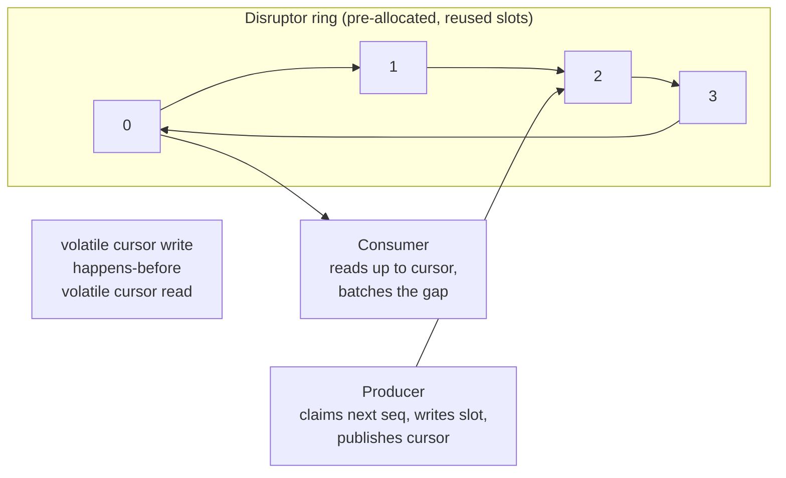
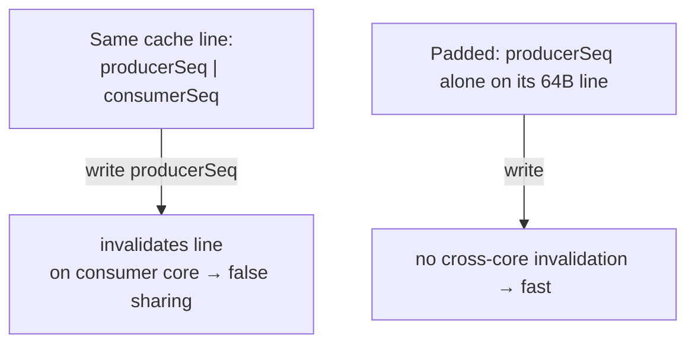

# Producer–Consumer — Professional Level

> **Source:** Dijkstra (bounded buffer) · Doug Lea, *Concurrent Programming in Java* · JSR-166 (`java.util.concurrent`)
> **Category:** [Concurrency](../README.md) — *"Patterns for coordinating work across threads, cores, and machines."*
> **Prerequisite:** [Senior](senior.md)

---

## Table of Contents

1. [Introduction](#introduction)
2. [BlockingQueue Internals](#blockingqueue-internals)
3. [Lock-Free Queues & the LMAX Disruptor](#lock-free-disruptor)
4. [Memory Model and Visibility](#memory-model)
5. [Performance: Throughput, Latency, Mechanical Sympathy](#performance)
6. [Cross-Language Comparison](#cross-language)
7. [Microbenchmark Anatomy](#microbenchmark-anatomy)
8. [Diagrams](#diagrams)
9. [Related Topics](#related-topics)

---

## Introduction

> Focus: **What does the metal actually do, and how do I make it fast and correct?**

At this level the abstraction dissolves and you reason about cache lines, memory fences, park/unpark syscalls, and the Java Memory Model. The questions are concrete: why is `LinkedBlockingQueue` sometimes faster than `ArrayBlockingQueue` and sometimes slower? Why does the LMAX Disruptor hit 25M ops/sec where a `BlockingQueue` tops out near 1M? What guarantees that a consumer sees the *fully constructed* object a producer enqueued? And how do you benchmark any of this without lying to yourself?

---

## BlockingQueue Internals

### `ArrayBlockingQueue` — one lock, fixed array

A circular buffer over a pre-allocated `Object[]`, guarded by a **single** `ReentrantLock` with two `Condition`s (`notEmpty`, `notFull`).

- **Memory:** allocated once at construction; zero per-item garbage. Memory is flat and predictable.
- **Contention:** producers and consumers share *one* lock. Every `put` and every `take` serializes on it. Under heavy mixed load the lock is the bottleneck.
- **Fairness:** optional. The fair variant (`new ArrayBlockingQueue<>(n, true)`) enforces FIFO lock acquisition — preventing starvation but cutting throughput substantially.

Use it when memory predictability matters and contention is moderate, or when capacity is small enough that the array is cheap.

### `LinkedBlockingQueue` — two locks, linked nodes

A linked list with **separate** `putLock` and `takeLock` and an `AtomicInteger count`.

- **Two-lock decoupling:** producers contend only with producers, consumers only with consumers. Producers and consumers proceed in parallel — higher throughput under balanced mixed load. This "two-lock queue" design is from Michael & Scott.
- **Cost:** a `Node` allocation per item → GC pressure. The `count` is an `AtomicInteger` because the two locks each touch it.
- **Bounding:** optional. Default is `Integer.MAX_VALUE` — effectively **unbounded**, the classic foot-gun (`Executors.newFixedThreadPool` uses exactly this, so an overloaded pool grows its queue to OOM).

### Choosing between them

| | `ArrayBlockingQueue` | `LinkedBlockingQueue` |
|---|---|---|
| Locks | 1 (shared) | 2 (put / take) |
| Per-item allocation | None | One `Node` |
| Bounded | Always | Optional (default unbounded ⚠) |
| Throughput, mixed load | Lower (lock shared) | Higher (locks split) |
| Memory profile | Flat, predictable | GC churn |
| Latency tail | Tighter | Looser (GC pauses) |

Specialized cousins worth knowing: `SynchronousQueue` (capacity zero — every `put` waits for a `take`; a pure hand-off, used by `newCachedThreadPool`), `LinkedTransferQueue` (lock-free, `transfer()` waits for receipt), and `PriorityBlockingQueue` (unbounded heap-ordered — no FIFO, no backpressure).

---

## Lock-Free Queues & the LMAX Disruptor

The LMAX Disruptor was built to process 6M orders/sec on a single thread, and its design is the canonical lesson in **mechanical sympathy** — writing software that works *with* the hardware.

### The ring buffer

A pre-allocated, power-of-two-sized array of *reusable* slots. Producers and consumers track monotonically increasing **sequence numbers**; the slot is `sequence & (size - 1)` (a bitmask, not a modulo). Because entries are pre-allocated and reused, the Disruptor produces **zero garbage** in steady state — no per-item allocation, no GC pressure, no GC pause in the tail latency.

### Why it's faster than a `BlockingQueue`

1. **No locks.** Coordination is via a single `volatile` cursor (the published sequence) updated with CAS. A consumer reads the cursor; if it's ahead of the consumer's own sequence, entries are available. No lock acquire, no park/unpark syscall on the fast path.
2. **No allocation, no GC.** Reusing ring slots eliminates the `Node` churn of a linked queue.
3. **Cache-friendly.** The array layout is contiguous — sequential access prefetches well, unlike a linked list whose nodes scatter across the heap and thrash the cache.
4. **Batching for free.** A consumer that falls behind sees the cursor jump and processes the whole gap in one pass — amortizing coordination across many entries.
5. **Wait strategies.** Choose the latency/CPU trade-off: `BusySpinWaitStrategy` (lowest latency, burns a core), `YieldingWaitStrategy`, `BlockingWaitStrategy` (lowest CPU, highest latency). A `BlockingQueue` only ever does the last one.

### False sharing and padding — the headline trick

Two independent `volatile` fields (say a producer's cursor and a consumer's sequence) that land on the **same 64-byte cache line** create *false sharing*: a write to one invalidates the other in every other core's cache, forcing a coherence round-trip even though the values are logically unrelated. The cores ping-pong the line and throughput collapses.

The fix is **cache-line padding** — surrounding the hot field with dead bytes so it owns its line:

```java
// Conceptual: pad a frequently-written sequence onto its own 64-byte cache line
abstract class LhsPadding { long p1, p2, p3, p4, p5, p6, p7; } // 56 bytes
abstract class Value extends LhsPadding { volatile long value; } // +8 = 64
abstract class RhsPadding extends Value { long p9, p10, p11, p12, p13, p14, p15; }
final class Sequence extends RhsPadding { /* value now alone on its line */ }
```

This is the actual technique inside `Sequence` in the Disruptor (modern JDKs offer `@Contended` for the same effect). It looks absurd — padding with unused longs — and it can double throughput. That is mechanical sympathy: the correctness is in the hardware behavior, not the source semantics.

---

## Memory Model and Visibility

The hand-off must publish the item *safely* — the consumer must see a **fully constructed** object, not a half-initialized one. The guarantee comes from a **happens-before** edge:

- **Blocking queues:** the producer's `lock.unlock()` (a release) happens-before the consumer's `lock.lock()` (an acquire). Everything the producer wrote before the unlock is visible to the consumer after the lock. The lock *is* the memory barrier.
- **Disruptor:** the producer's `volatile` write of the published sequence happens-before the consumer's `volatile` read of it. Writing the cursor publishes every field written to the slot beforehand.
- **Go channels:** the spec states a send on a channel happens-before the corresponding receive completes. The channel is the synchronization point — which is why `go test -race` trusts channel hand-offs.

The corollary, stated as a hard rule: **never mutate an item after handing it to the buffer.** Post-handoff mutation by the producer has no happens-before edge to the consumer's read → a data race → undefined behavior under the memory model, not just a stale value. Make items immutable, or transfer ownership and forget them.

---

## Performance: Throughput, Latency, Mechanical Sympathy

- **The park/unpark tax.** Every block/wake on a `BlockingQueue` is a `LockSupport.park`/`unpark` — a kernel transition and context switch, ~1–5 µs each. At 1M items/sec that's significant; at 10M it dominates. The Disruptor's busy-spin avoids it entirely (at the cost of a pinned core).
- **Throughput ceilings (single machine, ballpark):** fair `ArrayBlockingQueue` ~10⁵/s; default `ArrayBlockingQueue`/`LinkedBlockingQueue` ~10⁶/s; Disruptor ~10⁷/s. Orders of magnitude, not percentages.
- **Latency tail is the real story.** Throughput averages hide GC pauses and lock convoying. The Disruptor's zero-GC, lock-free path delivers a tight p99.9 — which is why exchanges and trading systems use it. For most services, a `BlockingQueue`'s tail is fine.
- **Batching beats everything downstream.** The single highest-leverage optimization isn't the queue implementation — it's having the consumer `drainTo` a batch and amortize the expensive downstream call (fsync, network round-trip) across hundreds of items.
- **Right-size the consumer pool.** For CPU-bound consumers, pool size ≈ cores. For I/O-bound consumers, larger (Little's Law: concurrency = throughput × latency). An undersized pool keeps the queue perpetually full (latency climbs); oversized burns context switches.

---

## Cross-Language Comparison

| Language | Idiomatic Producer–Consumer | Bounding | Backpressure | Notes |
|----------|-----------------------------|----------|--------------|-------|
| **Java** | `BlockingQueue` (`put`/`take`); Disruptor for HFT | Explicit capacity | `put` blocks; `offer` rejects | Mature `j.u.c` toolkit |
| **Go** | Buffered channel; `for range` / `close` | Channel capacity | Send blocks when full | Pattern is first-class; `close` = shutdown |
| **C#/.NET** | `BlockingCollection<T>` / `System.Threading.Channels` | Bounded capacity | `Writer.WriteAsync` awaits | `Channels` is the modern async-friendly choice |
| **Rust** | `std::sync::mpsc` / `crossbeam` / `tokio::mpsc` | `sync_channel(n)` bounds | Bounded sender `.send().await` | Ownership move = compile-time safe hand-off |
| **C++** | Hand-rolled `mutex`+`condition_variable`, or `moodycamel::ConcurrentQueue` | Manual | Manual | No std bounded queue; libs fill the gap |
| **Python** | `queue.Queue(maxsize)` / `asyncio.Queue` | `maxsize` | `put` blocks | GIL limits true CPU parallelism of consumers |

The constants differ wildly but the shape is identical: a bounded buffer, a blocking-or-rejecting full operation, a blocking empty operation, and a close/shutdown signal. Rust is the standout — moving ownership across the channel makes the "don't mutate after handoff" rule a *compile error* rather than a discipline.

---

## Microbenchmark Anatomy

Benchmarking a queue is a minefield; here is how to not fool yourself.

```java
@BenchmarkMode(Mode.Throughput)
@OutputTimeUnit(TimeUnit.SECONDS)
@State(Scope.Group)
public class QueueBench {
    BlockingQueue<Integer> q = new ArrayBlockingQueue<>(1024);

    @Benchmark @Group("pc") @GroupThreads(1)
    public void produce() throws InterruptedException { q.put(1); }

    @Benchmark @Group("pc") @GroupThreads(1)
    public Integer consume() throws InterruptedException { return q.take(); }
}
```

**Pitfalls that produce lies:**

1. **No warmup / JIT not settled.** The first thousands of iterations run interpreted or partially compiled. Use JMH's warmup; never time a cold loop with `System.nanoTime()`.
2. **Dead-code elimination.** If the consumer's result is unused, the JIT may delete the work. Return it / use a `Blackhole`.
3. **Measuring an empty or always-full queue.** A producer-only benchmark on an unbounded queue measures allocation, not the pattern. Balance producer and consumer threads (JMH `@Group`).
4. **Coordinated omission.** When measuring latency, a stalled load generator stops sending during the stall and *omits* the very latencies you care about. Use a fixed-rate generator (HdrHistogram + corrected sampling).
5. **Ignoring GC and the tail.** Report p99/p99.9, not just the mean. A queue with great throughput and a 200 ms GC pause is unusable for low-latency work.
6. **Single-core box / shared CI runner.** Contention behavior is meaningless without real parallel cores and a quiet machine. Pin threads; isolate cores for serious numbers.

Always compare implementations *under the same balanced, warmed-up, multi-core harness*, and look at the latency distribution, not a single number.

---

## Diagrams




