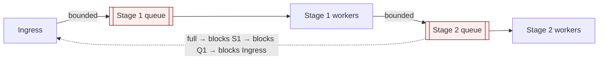
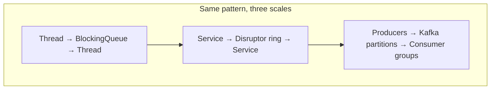

# Producer–Consumer — Senior Level

> **Source:** Dijkstra (bounded buffer) · Doug Lea, *Concurrent Programming in Java* · JSR-166 (`java.util.concurrent`)
> **Category:** [Concurrency](../README.md) — *"Patterns for coordinating work across threads, cores, and machines."*
> **Prerequisite:** [Middle](middle.md)

---

## Table of Contents

1. [Introduction](#introduction)
2. [Producer–Consumer at Architectural Scale](#architectural-scale)
3. [Backpressure & Flow Control](#backpressure-flow-control)
4. [Concurrency Deep Dive](#concurrency-deep-dive)
5. [Testability Strategies](#testability-strategies)
6. [When It Becomes a Problem](#when-it-becomes-a-problem)
7. [Code Examples — Advanced](#code-examples-advanced)
8. [Real-World Architectures (Kafka / SQS / Disruptor)](#real-world-architectures)
9. [Pros & Cons at Scale](#pros-cons-at-scale)
10. [Trade-off Analysis Matrix](#trade-off-matrix)
11. [Migration Patterns](#migration-patterns)
12. [Diagrams](#diagrams)
13. [Related Topics](#related-topics)

---

## Introduction

> Focus: **How does it behave at scale, and when does it break?**

A bounded buffer between two threads and a partitioned, replicated, persistent log spanning a fleet of machines are the *same pattern* at different scales. The senior job is to recognize that, and to reason about the properties that change as you scale: **flow control, ordering, durability, and head-of-line blocking**. The in-process queue and Kafka share an intent and a vocabulary; they differ in their failure modes and their cost.

This level focuses on the queue as a **system backbone** — the place where load, latency, and backpressure are negotiated — and on the failure modes that make queues the single most common source of production incidents: unbounded growth and head-of-line blocking.

---

## Producer–Consumer at Architectural Scale

Once you zoom out, the buffer stops being a data structure and becomes the **integration seam** of the whole system. Every async boundary — between services, between a service and a worker fleet, between an ingest tier and a processing tier — is a producer–consumer relationship. The queue is where you place the controls.

Properties that emerge only at scale:

- **Durability.** An in-memory queue loses everything on crash. A persistent log (Kafka, a database-backed outbox) survives. Choosing in-memory vs durable is choosing your delivery guarantee.
- **Delivery semantics.** Plain queues are at-most-once (consumer crash loses the in-flight item) or at-least-once (re-deliver until acked, so consumers must be idempotent). Exactly-once is expensive and usually approximated.
- **Partitioning for ordering.** A single queue with many consumers reorders. Partition by key (all events for user X go to partition P, consumed by one consumer) to get per-key ordering with parallelism.
- **Fan-out via topics.** One producer, many independent consumer groups, each with its own cursor — the pub/sub generalization of producer–consumer. See [Pub/Sub](../../../../../system-design) concepts and [Thread Pool](../05-thread-pool/junior.md).

---

## Backpressure & Flow Control

Backpressure is the property that distinguishes a robust pipeline from one that collapses. At scale it operates at three layers, and a senior designs all three:

1. **Buffer-level:** a bounded queue blocks/rejects the immediate producer. Local, fast.
2. **Connection-level:** TCP flow control and HTTP/2 stream windows propagate "slow down" across the wire. Reactive Streams (`Flux`, RxJava) makes this explicit with `request(n)` demand signalling — the consumer tells the producer how much it can take.
3. **System-level:** load shedding, rate limiting, and admission control reject work at the *edge* before it ever reaches a queue.

**The cardinal rule of flow control:** backpressure must propagate *all the way to the source*. A bounded queue that blocks an in-process producer is useless if that producer is an unbounded thread reading from an unbounded socket buffer — you've just moved the unbounded growth one layer out. Trace the chain from the queue back to the original ingress; every link must be bounded or the whole chain is unbounded.

When you *can't* propagate backpressure (e.g., UDP, fire-and-forget telemetry, an external client you don't control), your only options are **buffer (bounded) + drop** or **buffer + sample**. Decide which signal you can afford to lose.

---

## Concurrency Deep Dive

- **Lock contention is the scaling wall.** A single-lock `BlockingQueue` serializes every `put` and `take`. At high throughput the lock becomes the bottleneck regardless of core count. `LinkedBlockingQueue` mitigates this with **two locks** (a `putLock` and a `takeLock`) so producers and consumers don't contend with each other — only producers contend with producers. `ArrayBlockingQueue` uses **one lock** and trades throughput for predictable memory.
- **False sharing.** When the head and tail indices live on the same cache line, a producer updating `tail` invalidates the cache line the consumer needs for `head`, ping-ponging the line between cores. This is invisible in code and brutal in profiles. Lock-free queues pad indices to separate cache lines.
- **The memory model.** Visibility of the item across the hand-off is guaranteed by the queue's internal synchronization (the lock release/acquire or the volatile sequence write in lock-free designs) establishing a *happens-before* edge. This is why you must not mutate an item after putting it: the consumer may read it through that edge while you mutate it without one — a data race.
- **Wakeup cost.** Every block/unblock is a thread park/unpark — a syscall and a context switch (microseconds). At millions of ops/sec, blocking queues spend more time in the scheduler than doing work. This is the regime where the Disruptor's busy-spin strategy wins.

---

## Testability Strategies

Concurrency bugs are non-deterministic, so testing the pattern requires more than example-based tests:

- **Stress / soak tests.** Run N producers × M consumers for millions of items; assert *conservation* (items in == items out + items dropped) and no deadlock via a global timeout.
- **Deterministic interleaving.** Tools like `jcstress` (Java) or `go test -race` surface races and reorderings a single run would never hit. Always run the Go race detector in CI.
- **Property-based invariants.** Queue depth never exceeds capacity; FIFO order preserved per single consumer; no item delivered twice (for at-most-once) or lost (for at-least-once).
- **Inject latency.** Slow the consumer to force the buffer full and *assert backpressure* (producer blocks / `offer` returns false). This is the test people skip and then ship the OOM.
- **Shutdown tests.** Assert every consumer terminates and no item is lost under concurrent shutdown — the poison-pill / close-channel correctness from the middle level, verified.

---

## When It Becomes a Problem

**1. Unbounded growth (the silent killer).** An unbounded queue under sustained overload grows until OOM. The insidious part: it works perfectly in testing and for months in production, then a downstream slowdown (a degraded DB, a slow partner API) lets the queue grow without limit and the process dies with no warning. *Always* bound; *always* monitor depth.

**2. Head-of-line blocking.** One slow item at the front of a FIFO queue blocks every item behind it, even though they could be processed. A single poison message (one that always fails and retries) can stall an entire partition. Mitigations: per-key partitioning, priority queues, dead-letter queues for repeated failures, and bounded retry with the failing item moved aside.

**3. Stale work.** Items can sit in a deep queue long past their usefulness — a request whose client already timed out is still processed, wasting capacity. Attach deadlines; consumers should drop items whose deadline has passed (a form of [Balking](../11-balking/junior.md)).

**4. Backpressure deadlock.** A → bounded queue → B → bounded queue → A (a cycle). When both queues fill, every thread blocks on a full `put` while holding the slot the other needs. Cyclic producer–consumer graphs need cycle-breaking (unbounded handoff on one edge, or a different topology).

**5. Thundering herd on wakeup.** `notifyAll` / `signalAll` on a deep queue wakes hundreds of threads that immediately contend on one lock, most going back to sleep. Two-condition `signal` and lock-free designs avoid it.

---

## Code Examples — Advanced

### Java — batching consumer with `drainTo` (amortize per-item cost)

```java
List<Event> batch = new ArrayList<>(256);
while (running) {
    Event first = queue.take();        // block until at least one
    batch.add(first);
    queue.drainTo(batch, 255);         // grab whatever else is ready, no extra blocking
    flushBatch(batch);                 // one DB round-trip per ~256 items
    batch.clear();
}
```

Batching is the highest-leverage optimization for a producer–consumer downstream: it amortizes fixed per-call cost (a network round-trip, an fsync) across many items. Throughput often jumps 10–100×.

### Go — fan-out / fan-in pipeline with bounded stages and cancellation

```go
func pipeline(ctx context.Context, in <-chan Job) <-chan Result {
    out := make(chan Result, 256)      // bounded — backpressure between stages
    var wg sync.WaitGroup
    for i := 0; i < runtime.NumCPU(); i++ {
        wg.Add(1)
        go func() {
            defer wg.Done()
            for j := range in {
                select {
                case out <- process(j):
                case <-ctx.Done():     // cancellation propagates as backpressure unwinds
                    return
                }
            }
        }()
    }
    go func() { wg.Wait(); close(out) }()  // close once, after all workers done
    return out
}
```

Each stage is bounded, so backpressure flows naturally from the slowest stage all the way back to the source — Go's channels make multi-stage flow control nearly free.

---

## Real-World Architectures (Kafka / SQS / Disruptor)

| System | Buffer | Bounding / Flow Control | Ordering | Durability | Best for |
|--------|--------|-------------------------|----------|-----------|----------|
| **In-proc `BlockingQueue`** | RAM array/list | Capacity → block | FIFO per single consumer | None (lost on crash) | Single-process async work |
| **LMAX Disruptor** | RAM ring buffer | Ring full → producer waits | Total (single ring) | None | Ultra-low-latency single-process (millions/sec) |
| **Kafka** | Partitioned, replicated log on disk | Consumer lag + producer `max.in.flight`; quotas | Per partition | ✓ Replicated, retained | Durable, high-throughput, multi-consumer event streaming |
| **AWS SQS** | Managed distributed queue | Visibility timeout; no explicit bound | Best-effort (FIFO queues: per group) | ✓ Managed | Decoupling services, work distribution at cloud scale |
| **RabbitMQ** | In-memory/disk queues | `prefetch` (consumer-side bound), publisher confirms | FIFO per queue | ✓ Optional | Routing-rich messaging, RPC, work queues |

The same vocabulary recurs everywhere: a **bound** (capacity / consumer lag / prefetch), a **block-or-drop** decision, an **ordering** scope (per partition / per queue / per consumer), and a **durability** choice. Master the in-process version and the distributed ones are the same idea with the dial set differently. Kafka, in particular, is *literally* a producer–consumer log: producers append, consumer groups track an offset cursor, and consumer lag is the queue depth you monitor.

---

## Pros & Cons at Scale

| ✓ Pros | ✗ Cons |
|--------|--------|
| Universal async seam — one mental model from threads to clusters | Becomes the system's central failure point; needs first-class monitoring |
| Backpressure composes across stages when every stage is bounded | One unbounded link defeats the whole chain |
| Partitioning gives ordering + parallelism together | Cross-partition ordering is lost; rebalancing is complex |
| Durable variants add at-least-once delivery | Durability costs latency (fsync/replication) and demands idempotent consumers |
| Batching amortizes downstream cost dramatically | Head-of-line blocking and stale work are easy to miss until they incident |

---

## Trade-off Analysis Matrix

| Axis | In-proc bounded queue | Disruptor | Durable log (Kafka/SQS) |
|------|----------------------|-----------|-------------------------|
| Latency | µs (with park/unpark) | ns (busy-spin) | ms (network + disk) |
| Throughput | ~10⁶/s (lock-bound) | ~10⁷/s | ~10⁶/s per partition, scales out |
| Durability | None | None | ✓ |
| Backpressure | Capacity | Ring fill | Consumer lag / quotas |
| Ordering | FIFO/1 consumer | Total | Per partition |
| Failure blast radius | Process | Process | Cluster (replicated) |
| Operational cost | ~0 | Low | High (a system to run) |

Read it top to bottom: as you gain durability and cross-machine scale (rightward), you pay orders of magnitude in latency. Choose the leftmost option that meets your durability and scale requirements — don't reach for Kafka when an `ArrayBlockingQueue` suffices.

---

## Migration Patterns

- **In-proc queue → durable log.** When you need to survive restarts or fan out to new consumers, introduce a durable log. Migrate with an **outbox**: write to DB and an outbox table in one transaction, a relay publishes to the log — guaranteeing the queue and your data agree.
- **Unbounded → bounded.** The most common emergency fix. Cap the queue, choose block/reject/drop, add depth metrics, and load-test the overload path *before* it happens in production.
- **Blocking queue → Disruptor.** Only when profiling proves the queue lock is your bottleneck and latency is the product requirement. It's a rewrite, not a swap; budget for it.
- **Single queue → partitioned.** When one consumer can't keep up but ordering matters, partition by key. Per-key order is preserved; global order is sacrificed (usually acceptable).

---

## Diagrams




