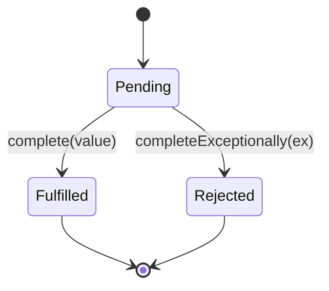
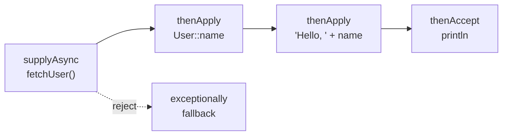

# Future / Promise — Junior Level

> **Source:** Baker & Hewitt (1977, futures) · Doug Lea, *Concurrent Programming in Java* · `java.util.concurrent`/`CompletableFuture`
> **Category:** [Concurrency](../README.md) — *"Patterns for coordinating work across threads, cores, and machines."*

---

## Table of Contents

1. [Introduction](#introduction)
2. [Prerequisites](#prerequisites)
3. [Glossary](#glossary)
4. [Core Concepts](#core-concepts)
5. [Real-World Analogies](#real-world-analogies)
6. [Mental Models](#mental-models)
7. [Pros & Cons](#pros-cons)
8. [Use Cases](#use-cases)
9. [Code Examples](#code-examples)
10. [Coding Patterns](#coding-patterns)
11. [Clean Code](#clean-code)
12. [Best Practices](#best-practices)
13. [Edge Cases & Pitfalls](#edge-cases-pitfalls)
14. [Common Mistakes](#common-mistakes)
15. [Tricky Points](#tricky-points)
16. [Test Yourself](#test-yourself)
17. [Tricky Questions](#tricky-questions)
18. [Cheat Sheet](#cheat-sheet)
19. [Summary](#summary)
20. [What You Can Build](#what-you-can-build)
21. [Further Reading](#further-reading)
22. [Related Topics](#related-topics)
23. [Diagrams & Visual Aids](#diagrams-visual-aids)

---

## Introduction

> Focus: **What is it?** and **How to use it?**

A **Future** is a read-only *placeholder* for a value that does not exist yet. You ask a system to compute something asynchronously, and instead of blocking until the answer arrives, you immediately receive a handle — the Future — that you can hold, pass around, and later query: *"are you done? what's the result?"*

A **Promise** is the *other half* of that handle: the **writable producer side**. Whoever runs the computation holds the Promise and, when the work finishes, *completes* it — supplying either a value (success) or an exception (failure). Completing the Promise is what makes the Future "resolve."

The whole point is **separation of two concerns that callbacks tangle together**:

- **Starting** an asynchronous computation (kick off a download, a query, a CPU-heavy calculation).
- **Consuming** its result (do something with the answer once it's ready).

A Future hands you a *token* for "the answer, eventually" so the rest of your program can keep moving. When you finally need the value, you either **block** and wait, or — far better — **attach a continuation** ("when this resolves, run that next").

```java
// supplyAsync returns a Future for a value computed on another thread.
CompletableFuture<Integer> priceFuture =
        CompletableFuture.supplyAsync(() -> fetchPrice("AAPL"));

// We did NOT block here. priceFuture is a placeholder.
System.out.println("Request sent, doing other work...");

// Later, when we actually need the number:
int price = priceFuture.get();   // blocks ONLY now, if not yet ready
```

The Future / Promise pattern is the foundation of nearly every modern async API: JavaScript `Promise`, Scala `Future`/`Promise`, C++ `std::future`/`std::promise`, Rust `Future`, C# `Task`. Learn it once here and you read all of them.

---

## Prerequisites

You should be comfortable with:

- **Threads** — a Future's value is usually produced on a *different* thread than the one consuming it.
- **Exceptions** — a Future can complete with a value *or* an exception; both are first-class outcomes.
- **Callbacks / lambdas** — composition attaches functions to run "when ready."
- **[Thread Pool](../05-thread-pool/junior.md)** — Futures don't conjure threads; the work runs on an executor.

If "the result isn't ready yet, here's a ticket for it" makes sense to you, you already have the core intuition.

---

## Glossary

| Term | Meaning |
|------|---------|
| **Future** | Read-only handle to a value that will exist later. You can query/await/compose it, but not set it. |
| **Promise** | Writable handle to the *same* slot. The producer completes it with a value or an error. |
| **Complete / resolve / fulfill** | Set the Future's result to a *value*. Transitions it from pending to done. |
| **Reject / completeExceptionally** | Set the Future's result to an *error*. Also a terminal "done" state. |
| **Pending** | The Future has no result yet. |
| **Settled** | The Future is done — either fulfilled or rejected. Terminal and immutable. |
| **`get()` / `await`** | Block the calling thread until the Future settles, then return the value (or throw). |
| **Continuation / callback** | A function attached to run when the Future settles (`thenApply`, `.then`, `map`). |
| **Eager future** | Computation starts immediately when the Future is created (Java, JS). |
| **Lazy future** | Computation starts only when the Future is *driven* (polled/awaited), e.g. Rust. |
| **Composition** | Building a new Future from existing ones without blocking (`thenCompose`, `thenCombine`). |

---

## Core Concepts

### 1. The read side and the write side are different objects (conceptually)

This is the single most clarifying idea. A Future is *read-only*: consumers can only **observe**. A Promise is *write-once*: the producer **completes** it exactly once. In Scala and C++ these are literally two types. In Java's `CompletableFuture` they are merged into one class — but the *methods* split cleanly:

- **Read side:** `get()`, `join()`, `thenApply`, `thenCompose`, `whenComplete`.
- **Write side:** `complete(value)`, `completeExceptionally(ex)`.

```java
CompletableFuture<String> promise = new CompletableFuture<>(); // unsettled

// Hand the READ side to a consumer:
promise.thenAccept(name -> System.out.println("Hello " + name));

// Elsewhere, the producer uses the WRITE side:
promise.complete("Ada");   // now the consumer's callback fires
```

### 2. A Future has exactly three states

`PENDING → FULFILLED` or `PENDING → REJECTED`. Once settled, it is **immutable** — a second `complete()` is ignored (returns `false`). This immutability is what makes Futures safe to share across threads.

### 3. Don't block if you can compose

The beginner instinct is `future.get()`. That works but throws away the benefit: the calling thread sits idle. **Composition** lets you describe *what happens next* without blocking:

```java
CompletableFuture<Integer> lengthFuture =
        fetchUsername()              // CompletableFuture<String>
            .thenApply(String::length);  // CompletableFuture<Integer>, no blocking
```

### 4. Exceptions flow through the chain

If the computation throws, the Future is *rejected*. Downstream `thenApply` stages are **skipped**, and the exception is delivered to the nearest `exceptionally` / `handle` / `whenComplete` — much like a synchronous `try/catch`, but across threads.

---

## Real-World Analogies

- **Restaurant buzzer.** You order, and instead of standing at the counter (blocking), you get a buzzer (the Future). You sit down and chat (do other work). When food is ready, the buzzer flashes (the Promise is completed) and you go collect it.
- **Coat-check ticket.** The ticket (Future) is a claim on your coat. The attendant (producer) holds the actual coat and "completes" the claim when you return. You can hand the ticket to a friend — anyone with it can claim the result.
- **Tracking number.** When you order online you immediately get a tracking number (Future) even though the package doesn't exist on your doorstep yet. You can poll it (`isDone`), wait at the door (`get`), or set up a doorbell notification (`thenAccept`).
- **A blank check that someone else fills in.** You hand out the check (Future); the payer (Promise holder) writes the amount exactly once.

---

## Mental Models

> **A Future is a box that is empty now and will contain exactly one thing later — a value or an error.**

- Think of `CompletableFuture<T>` as a **mailbox with one slot**. The producer drops in one letter (value *or* error). Readers either wait at the mailbox (`get`) or leave a note "forward whatever arrives to me" (`thenApply`).
- Think of **composition as building a pipeline of empty boxes** wired together: when box A fills, its content flows into the function that fills box B, and so on. No thread blocks while the boxes are empty.
- Think of the **executor as the kitchen**: the Future is your order ticket, but *someone in the kitchen* (a thread-pool worker) actually cooks. If the kitchen is understaffed, your ticket waits — Futures don't add cooks.

---

## Pros & Cons

| ✓ Pros | ✗ Cons |
|--------|--------|
| Decouples starting work from consuming its result | Easy to *accidentally block* with `get()`, killing the benefit |
| Composition avoids deeply nested callbacks ("callback hell") | A rejected Future nobody observes silently **swallows the exception** |
| Exceptions propagate through the chain like `try/catch` | Which thread runs your callback is non-obvious (`thenApply` vs `thenApplyAsync`) |
| One uniform abstraction across the whole language ecosystem | Cancellation is *advisory*, not guaranteed to stop the work |
| Naturally enables parallelism (fan-out, then `allOf`) | Debugging async stack traces is harder than synchronous ones |

---

## Use Cases

- **Network/IO calls** — fire an HTTP request, get a Future, continue rendering the page.
- **Fan-out / fan-in** — call three microservices in parallel, combine the three Futures into one result.
- **CPU-bound offloading** — push a heavy computation onto a worker pool, keep the UI thread responsive.
- **Pipelines** — fetch → parse → validate → persist, each step a non-blocking stage.
- **Timeouts and fallbacks** — race a slow call against a timer, take whichever settles first.
- **Return type of an [Active Object](../01-active-object/junior.md)** — method calls return Futures instead of blocking.

---

## Code Examples

### Java — `Future` (the classic, blocking view)

```java
import java.util.concurrent.*;

ExecutorService pool = Executors.newFixedThreadPool(4);

Future<Integer> future = pool.submit(() -> {
    Thread.sleep(200);           // pretend this is slow IO
    return 6 * 7;
});

// ... do other work here ...

Integer answer = future.get();   // blocks until the task finishes
System.out.println(answer);      // 42
pool.shutdown();
```

`Future` (the 2004-era interface) only lets you `get()`, `cancel()`, `isDone()`, `isCancelled()`. It cannot *compose* — that limitation is exactly why `CompletableFuture` exists.

### Java — `CompletableFuture` (composable, non-blocking)

```java
import java.util.concurrent.*;

CompletableFuture<String> greeting =
    CompletableFuture
        .supplyAsync(() -> fetchUser(42))       // runs on a pool thread
        .thenApply(User::name)                   // transform: User -> String
        .thenApply(name -> "Hello, " + name);    // transform again

// Non-blocking consumption:
greeting.thenAccept(System.out::println);

// Or block at the very end if you must:
System.out.println(greeting.join());
```

### Java — the Promise (write) side, made explicit

```java
// An unsettled CompletableFuture IS a promise.
CompletableFuture<String> promise = new CompletableFuture<>();

// Consumer wires up the read side now:
promise.thenAccept(v -> System.out.println("Got: " + v));

// A producer thread completes it later:
new Thread(() -> {
    String result = doSlowWork();
    promise.complete(result);          // fulfill  -> callback fires
    // promise.completeExceptionally(new IOException()); // reject alternative
}).start();
```

### JavaScript — Promise (resolve / reject)

```javascript
// The executor receives the write side: resolve() and reject().
const pricePromise = new Promise((resolve, reject) => {
  fetchPrice("AAPL", (err, price) => {
    if (err) reject(err);   // -> rejected
    else     resolve(price); // -> fulfilled
  });
});

// The read side: .then / .catch
pricePromise
  .then(price => price * 1.1)
  .then(withTax => console.log(withTax))
  .catch(err => console.error("failed:", err));

// async/await is the same Promise, read more linearly:
async function show() {
  try {
    const price = await pricePromise;   // "block" without blocking the thread
    console.log(price);
  } catch (err) {
    console.error(err);
  }
}
```

### Scala — Future + Promise split crisply

```scala
import scala.concurrent.{Future, Promise}
import scala.concurrent.ExecutionContext.Implicits.global
import scala.util.{Success, Failure}

val p = Promise[Int]()        // the WRITE side
val f: Future[Int] = p.future // the READ side, derived from the promise

f.onComplete {                // consumer attaches to the read side
  case Success(v) => println(s"value = $v")
  case Failure(e) => println(s"error = ${e.getMessage}")
}

p.success(42)                 // producer fulfills (or p.failure(ex) to reject)
```

Scala makes the lesson unmissable: `Promise` and `Future` are **two different types**, and you obtain the read side via `promise.future`.

---

## Coding Patterns

- **Fire-and-transform:** `supplyAsync(...).thenApply(...)` — start work, map the result.
- **Fire-and-forget side effect:** `thenAccept(...)` / `thenRun(...)` — consume, no new value.
- **Sequential dependency (flatMap):** `thenCompose(x -> anotherFuture(x))` — when step 2 *itself* returns a Future.
- **Parallel join:** `a.thenCombine(b, (x, y) -> merge(x, y))` — two independent Futures into one.
- **Fan-out / fan-in:** `CompletableFuture.allOf(f1, f2, f3)` then collect results.
- **Recover:** `.exceptionally(ex -> fallbackValue)` — supply a default on failure.

---

## Clean Code

✓ **Name Futures by the value they will hold**, not by "future": `userProfile`, not `userFuture` everywhere — though a `Future` suffix is acceptable when it disambiguates a blocking value from its placeholder.

✓ **Prefer composition to nested `get()` calls.** Chained stages read top-to-bottom; nested blocking reads inside-out.

✗ **Don't `get()` in the middle of a chain** just to feed the next stage — use `thenCompose`.

✗ **Don't leave a Future un-consumed.** A `CompletableFuture` whose exceptional completion nobody observes is a silent bug.

✓ **Pass an explicit `Executor`** to `*Async` methods in production code rather than relying on the hidden default pool.

---

## Best Practices

1. **Avoid blocking `get()`/`join()` inside async code.** Compose instead; reserve blocking for the program's top edge (e.g. `main`).
2. **Always provide an explicit executor** to `supplyAsync`/`thenApplyAsync` in server code — don't silently use the shared `ForkJoinPool.commonPool()`.
3. **Always attach error handling** (`exceptionally`/`handle`/`whenComplete`) to the *end* of every chain.
4. **Keep callbacks short and non-blocking** — a blocking callback ties up a pool thread.
5. **Complete a Promise exactly once**; treat the second `complete()` as a no-op, never as logic.
6. **Set timeouts** (`orTimeout`, `completeOnTimeout`) so a stuck dependency can't hang forever.

---

## Edge Cases & Pitfalls

- **The swallowed exception.** `future.thenApply(f);` — if the Future rejects and you never call `exceptionally`/`get`/`whenComplete`, the error vanishes. No log, no crash.
- **Blocking inside a pool thread.** Calling `get()` on a `ForkJoinPool` worker can starve the pool — every worker waits on results that need a free worker to produce.
- **`thenApply` runs *where the previous stage completed*.** It may run on the completing thread *or* the calling thread — surprising if you assumed "the pool." Use `thenApplyAsync` to force an executor.
- **Cancellation is weak.** `CompletableFuture.cancel(true)` does **not** interrupt the running `supplyAsync` task; it just marks the Future cancelled. The work keeps running.
- **Already-completed Futures run callbacks synchronously.** Attaching `thenApply` to an *already settled* Future runs the function immediately on the *current* thread.

---

## Common Mistakes

1. **Blocking right after starting:** `supplyAsync(...).get()` on the same line — that's just a slow synchronous call with extra ceremony.
2. **Sequential awaits instead of parallel:** `a.get(); b.get();` runs A then B; use `allOf(a, b)` to overlap them.
3. **Catching the wrong exception type:** `get()` wraps the cause in an `ExecutionException`; you must unwrap `e.getCause()`.
4. **Mutating shared state in callbacks without synchronization**, assuming "it's all one thread." It isn't.
5. **Forgetting the chain is lazy on errors** — adding logging *after* an `exceptionally` that already recovered won't see the original error.

---

## Tricky Points

- **`join()` vs `get()`:** both block; `get()` throws *checked* `ExecutionException`/`InterruptedException`, `join()` throws *unchecked* `CompletionException`. `join()` is friendlier inside lambdas.
- **`thenApply` vs `thenCompose`:** `thenApply(f)` where `f` returns a `Future` gives you a nested `Future<Future<T>>`. Use `thenCompose` to flatten — it's the `flatMap` of Futures.
- **`supplyAsync` vs `runAsync`:** `supplyAsync` returns a value (`Supplier`); `runAsync` returns `Void` (`Runnable`).
- **Eager vs lazy:** A Java/JS Future *already started* the moment you created it. A Rust `Future` does **nothing** until polled. This changes how cancellation and resource use behave.

---

## Test Yourself

1. What two responsibilities does the Future/Promise pattern separate?
2. Which methods form the *write* side of a `CompletableFuture`?
3. Why is `supplyAsync(...).get()` usually a code smell?
4. What happens to downstream `thenApply` stages when an upstream stage throws?
5. What is the difference between `thenApply` and `thenCompose`?
6. Does `CompletableFuture.cancel(true)` stop a running `supplyAsync` task?

> Answers: (1) starting async work vs consuming the result; (2) `complete`/`completeExceptionally`; (3) it blocks immediately, discarding the async benefit; (4) they're skipped, the error jumps to `exceptionally`/`handle`; (5) `thenApply` maps to a plain value, `thenCompose` flattens a returned Future; (6) no — it marks the Future cancelled but the task keeps running.

---

## Tricky Questions

1. **If a Future is already completed when you attach `thenApplyAsync`, does the callback still run on the executor?** Yes — `*Async` always dispatches to the executor, even for already-settled Futures, whereas non-async may run inline.
2. **Can two threads both `complete()` the same `CompletableFuture`?** They can both *call* it, but only the first wins; the second returns `false`. It is race-safe.
3. **Does `exceptionally` catch an exception thrown *inside* itself?** No — you'd need another stage after it. Errors in a recovery handler propagate further down.

---

## Cheat Sheet

```text
CREATE
  CompletableFuture.supplyAsync(supplier[, executor])   // value
  CompletableFuture.runAsync(runnable[, executor])      // no value
  new CompletableFuture<>()                              // empty promise

TRANSFORM (read side)
  thenApply(fn)        T -> U        (map)
  thenCompose(fn)      T -> Future<U>(flatMap)
  thenCombine(other,fn)(T,U) -> V    (join two)
  thenAccept(consumer) side effect, no result
  thenRun(runnable)    ignore value, run action

COMBINE MANY
  allOf(f1..fn)   completes when ALL done
  anyOf(f1..fn)   completes when FIRST done

ERRORS
  exceptionally(fn)    ex -> fallback value
  handle((v,ex) -> ...) both branches
  whenComplete((v,ex)) peek, don't transform

WRITE side
  complete(value)
  completeExceptionally(ex)

BLOCK (last resort)
  get()   throws checked ExecutionException
  join()  throws unchecked CompletionException

ASYNC variants: append "Async" to run the stage on an executor.
```

---

## Summary

A **Future** is a read-only proxy for a not-yet-computed value; a **Promise** is the write-once producer side that *completes* it with a value or an error. The pattern separates **starting** async work from **consuming** its result. Prefer **composition** (`thenApply`, `thenCompose`, `thenCombine`, `allOf`) over blocking `get()`, attach **error handling** to every chain, and be deliberate about **which executor** runs each callback. Java's `Future` is the blocking ancestor; `CompletableFuture` is the composable modern tool. The same idea reappears as JS `Promise`, Scala `Future`/`Promise`, C++ `std::future`, and Rust `Future`.

---

## What You Can Build

- A **parallel web-page aggregator** that fetches 5 URLs concurrently and combines them with `allOf`.
- A **non-blocking price service** that races a live quote against a cached fallback via `anyOf`.
- A **retry wrapper** that re-attaches a new attempt in `exceptionally` on failure.
- A small **async pipeline** (`fetch → parse → validate → store`) with no blocking and a single error handler.

---

## Further Reading

- Doug Lea, *Concurrent Programming in Java*, ch. on result-bearing tasks.
- Baker & Hewitt (1977) — the original "future" concept in Actor systems.
- `java.util.concurrent.CompletableFuture` Javadoc — read the stage-method table top to bottom.
- MDN: *Using Promises* — the cleanest plain-language introduction to the read/write split.

---

## Related Topics

- [Active Object](../01-active-object/junior.md) — its asynchronous method calls *return* Futures.
- [Thread Pool](../05-thread-pool/junior.md) — supplies the threads a Future's work runs on.
- [Proactor](../04-proactor/junior.md) — completion-based async IO, a natural producer of Futures.
- [Producer–Consumer](../06-producer-consumer/junior.md) — a Promise/Future is a one-shot, single-slot producer/consumer.

---

## Diagrams & Visual Aids

**The read/write split:**


**Three states:**



**A simple composition pipeline:**


