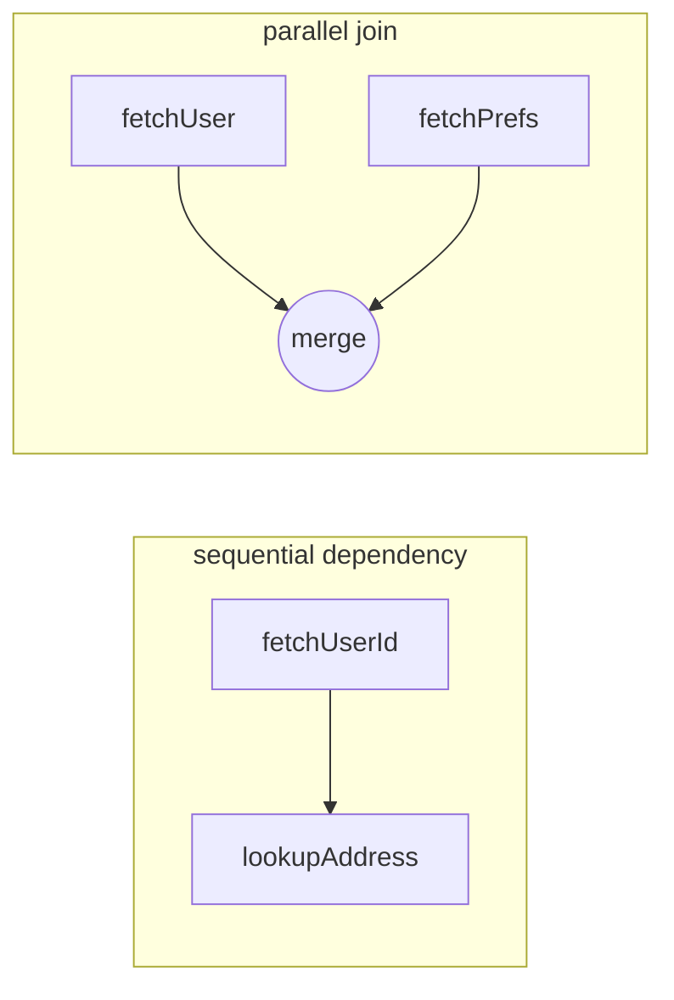
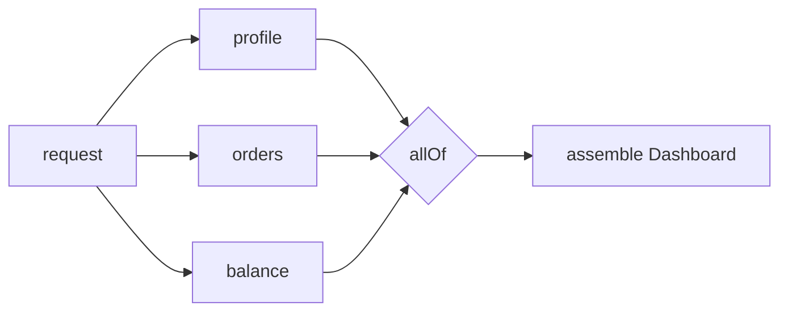
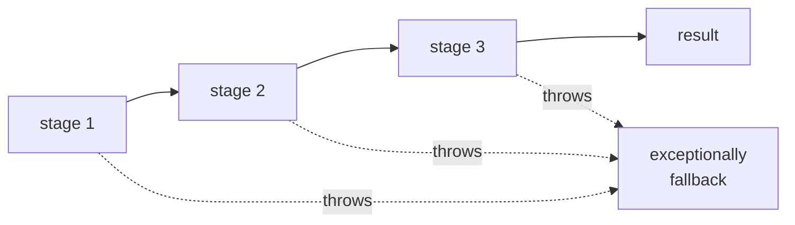

# Future / Promise — Middle Level

> **Source:** Baker & Hewitt (1977, futures) · Doug Lea, *Concurrent Programming in Java* · `java.util.concurrent`/`CompletableFuture`
> **Category:** [Concurrency](../README.md) — *"Patterns for coordinating work across threads, cores, and machines."*
> **Prerequisite:** [junior.md](junior.md)

---

## Table of Contents

1. [Introduction](#introduction)
2. [When to Use Futures/Promises](#when-to-use-futurespromises)
3. [When NOT to Use Them](#when-not-to-use-them)
4. [Real-World Cases](#real-world-cases)
5. [Code Examples — Production-Grade](#code-examples-production-grade)
6. [Composition](#composition)
7. [Error Handling & Cancellation](#error-handling-cancellation)
8. [Trade-offs](#trade-offs)
9. [Alternatives Comparison](#alternatives-comparison)
10. [Refactoring Callbacks to Futures](#refactoring-callbacks-to-futures)
11. [Pros & Cons (Deeper)](#pros-cons-deeper)
12. [Edge Cases](#edge-cases)
13. [Tricky Points](#tricky-points)
14. [Best Practices](#best-practices)
15. [Tasks (Practice)](#tasks-practice)
16. [Summary](#summary)
17. [Related Topics](#related-topics)
18. [Diagrams](#diagrams)

---

## Introduction

> Focus: **When to use it?** and **How to use it well in production?**

At the junior level a Future was "a placeholder you can `get()`." At the middle level the placeholder is almost an afterthought — the real value is **composition**: assembling many asynchronous operations into one coherent, non-blocking flow with a single, well-defined error path.

The mental shift is this: stop thinking *"start a task, wait for it"* and start thinking *"declare a dependency graph of computations and let completions drive it forward."* `CompletableFuture` is, in effect, a tiny **dataflow engine** — each stage fires when its inputs settle. Your job is to wire the graph correctly, pick the right executor for each edge, and make sure exactly one error path captures every failure.

---

## When to Use Futures/Promises

✓ **You have independent IO operations that can overlap.** Three REST calls that don't depend on each other should run in parallel, not in sequence. Futures + `allOf` express that directly.

✓ **You're building a pipeline of asynchronous steps.** `fetch → transform → enrich → persist`, where some steps are themselves async. `thenCompose` chains them without blocking.

✓ **You want to keep a thread (UI, request, event loop) responsive.** Offload, return a Future, continue.

✓ **You need a uniform return type for async APIs.** A method that returns `CompletableFuture<Order>` composes with everything else; a method that takes a callback does not.

✓ **You need fan-in aggregation with a single failure channel.** Combine N results, and if any fails, short-circuit once.

---

## When NOT to Use Them

✗ **Purely synchronous, fast, CPU-trivial work.** Wrapping `2 + 2` in a Future adds scheduling overhead and obscures intent.

✗ **Streams of many values over time.** A Future settles **once**. For a *sequence* of events (ticks, messages, rows) you want **reactive streams** (`Flow`, Reactor `Flux`, RxJava `Observable`) or channels, not a Future.

✗ **When you genuinely need backpressure.** Futures have no notion of "slow down the producer." Reactive streams do.

✗ **When the whole call chain blocks anyway.** If every consumer immediately `get()`s, you've added complexity for nothing; a blocking call is clearer.

✗ **Tight loops over millions of tiny tasks.** The per-future allocation and callback dispatch cost dominates; batch instead.

---

## Real-World Cases

- **API gateway / BFF (backend-for-frontend):** one inbound request fans out to user-service, cart-service, and recommendation-service in parallel, then composes a single response. Latency = slowest of the three, not the sum.
- **Order checkout:** `reserveInventory().thenCompose(r -> chargePayment(r)).thenCompose(p -> createShipment(p))` — sequential because each step depends on the previous, but never blocking a thread.
- **Cache-then-network:** race a local cache lookup against a network fetch with `anyOf`, return whichever resolves first.
- **Batch enrichment:** map a list of IDs to a list of Futures, `allOf`, then collect — a classic fan-out/fan-in.

---

## Code Examples — Production-Grade

### Parallel fan-out / fan-in with an explicit executor

```java
import java.util.concurrent.*;
import java.util.*;
import java.util.stream.*;

private final ExecutorService io =
    Executors.newFixedThreadPool(16, namedDaemonFactory("io-pool"));

public CompletableFuture<Dashboard> loadDashboard(long userId) {
    CompletableFuture<Profile>  profile = supplyAsync(() -> profileApi.get(userId), io);
    CompletableFuture<List<Order>> orders = supplyAsync(() -> orderApi.recent(userId), io);
    CompletableFuture<Balance>  balance = supplyAsync(() -> walletApi.balance(userId), io);

    // Fan-in: wait for all THREE, then assemble — no blocking get() in the middle.
    return CompletableFuture.allOf(profile, orders, balance)
        .thenApply(ignored -> new Dashboard(
                profile.join(),   // safe: allOf guarantees they're done
                orders.join(),
                balance.join()));
}
```

`allOf` returns `CompletableFuture<Void>`; the results live in the original Futures, which we `join()` *after* `allOf` settles (so those joins never actually block).

### Timeout with a fallback

```java
CompletableFuture<Quote> quote =
    supplyAsync(() -> liveQuote(symbol), io)
        .orTimeout(250, TimeUnit.MILLISECONDS)         // reject if too slow (Java 9+)
        .exceptionally(ex -> cache.lastKnownQuote(symbol)); // fall back
```

### JavaScript — parallel and sequential, side by side

```javascript
// Parallel: both requests in flight at once.
const [user, orders] = await Promise.all([
  fetchUser(id),
  fetchOrders(id),
]);

// Sequential: second depends on the first.
const user2  = await fetchUser(id);
const detail = await fetchProfile(user2.profileId);

// Race a request against a timeout:
const result = await Promise.race([
  fetchSlow(),
  new Promise((_, reject) => setTimeout(() => reject(new Error("timeout")), 250)),
]);
```

---

## Composition

The composition methods are the heart of the pattern. Learn them as a small algebra:

| Method | Input → Output | Analogue | Use when |
|--------|----------------|----------|----------|
| `thenApply(fn)` | `T → U` | `map` | next step is a plain synchronous transform |
| `thenCompose(fn)` | `T → Future<U>` | `flatMap` | next step is **itself** async (avoids nesting) |
| `thenCombine(o, fn)` | `(T, U) → V` | `zip` | combine **two independent** Futures |
| `allOf(f…)` | `Void` when all settle | `sequence` | fan-in N results |
| `anyOf(f…)` | first to settle | `race` | take the fastest / first available |
| `thenAccept` / `thenRun` | side effect | `forEach` | terminal action, no new value |

### `thenApply` vs `thenCompose` — the nesting trap

```java
// WRONG: lookupUser returns a Future, so thenApply gives a nested Future.
CompletableFuture<CompletableFuture<Address>> nested =
    fetchUserId().thenApply(id -> lookupAddress(id));   // Future<Future<...>>

// RIGHT: thenCompose flattens it.
CompletableFuture<Address> flat =
    fetchUserId().thenCompose(id -> lookupAddress(id)); // Future<Address>
```

Rule of thumb: **if your lambda returns a `CompletableFuture`, use `thenCompose`, not `thenApply`.**



---

## Error Handling & Cancellation

### The three error operators

```java
future
  .exceptionally(ex -> defaultValue)      // recover: ex -> T, only on failure
  .handle((value, ex) -> ex == null ? value : recover(ex)) // both branches -> U
  .whenComplete((value, ex) -> log(value, ex));            // peek, doesn't transform
```

- **`exceptionally`** — only fires on failure; returns a *replacement value*.
- **`handle`** — fires on both success and failure; can transform either.
- **`whenComplete`** — observe-only; the result/exception passes through unchanged. Ideal for logging and cleanup.

### Unwrapping exceptions

A failure inside a stage is wrapped in a `CompletionException` (for `join`) or `ExecutionException` (for `get`). Always unwrap:

```java
future.exceptionally(ex -> {
    Throwable cause = (ex instanceof CompletionException) ? ex.getCause() : ex;
    log.error("stage failed", cause);
    return fallback;
});
```

### Cancellation reality check

```java
CompletableFuture<String> f = supplyAsync(this::slowTask, io);
f.cancel(true);   // marks f cancelled; does NOT interrupt slowTask
```

`CompletableFuture.cancel` does **not** interrupt the running task — the `mayInterruptIfRunning` flag is effectively ignored. The task runs to completion; only the *Future* is cancelled. If you need real cancellation, the task must cooperatively check a flag / `Thread.interrupted()`, or use the underlying `Future` from a raw `ExecutorService.submit` (whose `cancel(true)` *does* interrupt).

---

## Trade-offs

| Decision | Option A | Option B | Guidance |
|----------|----------|----------|----------|
| Block or compose | `get()` / `join()` | `thenApply`/`thenCompose` | Compose everywhere except the program's outermost edge |
| Executor for callbacks | `thenApply` (inline) | `thenApplyAsync(ex)` | Use `*Async` + explicit executor for anything non-trivial or blocking |
| Aggregate failures | `allOf` (fail-fast) | manual `handle` per future | `allOf` short-circuits on first failure; collect individually if you want partial results |
| One value vs stream | `CompletableFuture` | reactive stream | One-shot → Future; many-over-time → stream |

---

## Alternatives Comparison

| Approach | Strength | Weakness |
|----------|----------|----------|
| **Plain callbacks** | minimal, zero deps | nesting ("callback hell"), no uniform error path, hard to compose |
| **Futures/Promises** | composable, single error channel, language-wide standard | one value only, accidental blocking, executor confusion |
| **async/await** | reads like synchronous code | still Promises underneath; can hide accidental sequential awaits |
| **Reactive streams** (Reactor/Rx) | multiple values, backpressure, rich operators | steep learning curve, heavier, overkill for one value |
| **Structured concurrency / virtual threads** | blocking *looks* blocking but is cheap; clear scoping | newer (Java 21+); ecosystem still catching up |

**Heuristic:** one async value → **Future**; many values + backpressure → **reactive**; "I wish blocking were just cheap" → **virtual threads / structured concurrency**.

---

## Refactoring Callbacks to Futures

**Before — callback hell:**

```java
fetchUser(id, (user, e1) -> {
    if (e1 != null) { handle(e1); return; }
    fetchOrders(user, (orders, e2) -> {
        if (e2 != null) { handle(e2); return; }
        fetchShipping(orders, (ship, e3) -> {
            if (e3 != null) { handle(e3); return; }
            render(user, orders, ship);
        });
    });
});
```

**After — flat Future chain:**

```java
fetchUserF(id)
    .thenCompose(this::fetchOrdersF)
    .thenCompose(this::fetchShippingF)
    .thenAccept(this::render)
    .exceptionally(ex -> { handle(ex); return null; });  // ONE error path
```

The transformation: wrap each callback-style call in a method that returns a `CompletableFuture` (resolve in the success branch, `completeExceptionally` in the error branch), then chain with `thenCompose`. Three nested error checks collapse into one `exceptionally`.

```java
// Adapter: callback API -> Future
CompletableFuture<User> fetchUserF(long id) {
    CompletableFuture<User> p = new CompletableFuture<>();
    fetchUser(id, (user, err) -> {
        if (err != null) p.completeExceptionally(err);
        else             p.complete(user);
    });
    return p;
}
```

---

## Pros & Cons (Deeper)

| ✓ Pros | ✗ Cons |
|--------|--------|
| Single, declarative error channel replaces N scattered checks | Stack traces lose the logical call chain; debugging is harder |
| Composition expresses parallelism (`allOf`) and dependency (`thenCompose`) distinctly | Easy to write *accidentally sequential* code (awaiting one at a time) |
| Decouples API shape from threading model | Executor selection is implicit and error-prone (`thenApply` location) |
| Interops across the whole JVM/JS/Scala ecosystem | Cancellation and timeouts are bolt-ons with surprising semantics |
| Naturally testable as pure dependency graphs | Unobserved exceptions vanish silently |

---

## Edge Cases

- **`allOf` with zero futures** completes immediately and successfully — guard empty input lists.
- **`anyOf` returns `Object`**, not the element type; you must cast. It also completes *exceptionally* if the first to settle failed.
- **A stage that returns `null` from `thenApply`** produces a `CompletableFuture<Void>`-ish chain that may NPE downstream — be explicit about nullable results.
- **Reusing a completed Future** is fine and cheap (it's immutable), but reusing a *Promise* (re-completing) is a no-op silently.
- **Exceptions thrown synchronously by `supplyAsync`'s supplier** are captured into the Future, not thrown to the caller — they surface only via the chain.

---

## Tricky Points

- **`thenCompose` flattens; `thenApply` nests.** This is the most common middle-level bug.
- **`allOf(...).join()` blocks**, but the per-future `join()` *after* it does not — order matters.
- **`whenComplete` does not swallow exceptions**; the result propagates. `handle` *does* "consume" the exception by returning a value. Mixing them up changes whether downstream sees the failure.
- **`exceptionally` only catches *upstream* failures**, not failures inside its own lambda or stages added after it.

---

## Best Practices

1. **Make async methods return `CompletableFuture<T>`**, never accept callbacks — composability is contagious.
2. **One `exceptionally`/`handle` per chain, at the end** — centralize the failure path.
3. **Use `thenCompose` for async steps, `thenApply` for sync transforms** — mechanically.
4. **Pass explicit, named, bounded executors** to every `*Async` call.
5. **Add `orTimeout`/`completeOnTimeout`** to any chain that touches the network.
6. **Never block (`get`) on a pool thread** that the same pool's tasks depend on.

---

## Tasks (Practice)

1. Convert a 3-level nested callback API into a flat `thenCompose` chain with a single `exceptionally`.
2. Implement `loadDashboard` that fetches three services in parallel and combines them, with a 300 ms timeout and a cached fallback.
3. Write `firstSuccessful(List<CompletableFuture<T>>)` that returns the first one to *succeed*, ignoring failures (note: `anyOf` returns the first to *settle*, even if it failed).
4. Demonstrate the `thenApply` nesting bug and fix it with `thenCompose`.
5. Build a callback→Future adapter for a legacy listener-based API.

> Full solutions and 5 more tasks live in [tasks.md](tasks.md).

---

## Summary

Middle-level mastery of Futures is mastery of **composition and error flow**. Use `thenApply` for sync maps, `thenCompose` to flatten async steps, `thenCombine`/`allOf` for parallel fan-in, and `anyOf` to race. Centralize failure handling in one `exceptionally`/`handle` at the chain's end, always pass an **explicit executor** to `*Async`, and add **timeouts** to network-bound chains. Know that **cancellation doesn't interrupt** running work and that **unobserved exceptions vanish**. Reach for **reactive streams** when you have many values over time, and for **virtual threads** when you wish blocking were simply cheap.

---

## Related Topics

- [Active Object](../01-active-object/junior.md) — returns Futures from its asynchronous methods.
- [Thread Pool](../05-thread-pool/junior.md) — the executor behind every `*Async` stage.
- [Proactor](../04-proactor/junior.md) — completion-driven IO that feeds Futures.
- [Producer–Consumer](../06-producer-consumer/junior.md) — a Future is a single-slot, one-shot variant.

---

## Diagrams

**Fan-out / fan-in:**



**Error short-circuit:**


