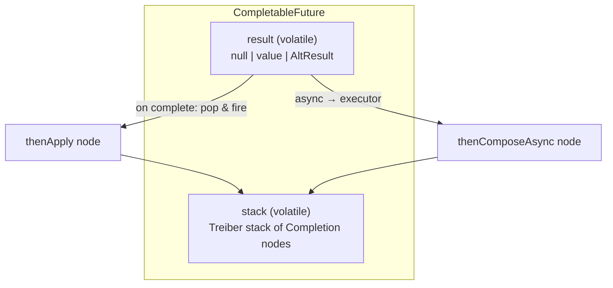
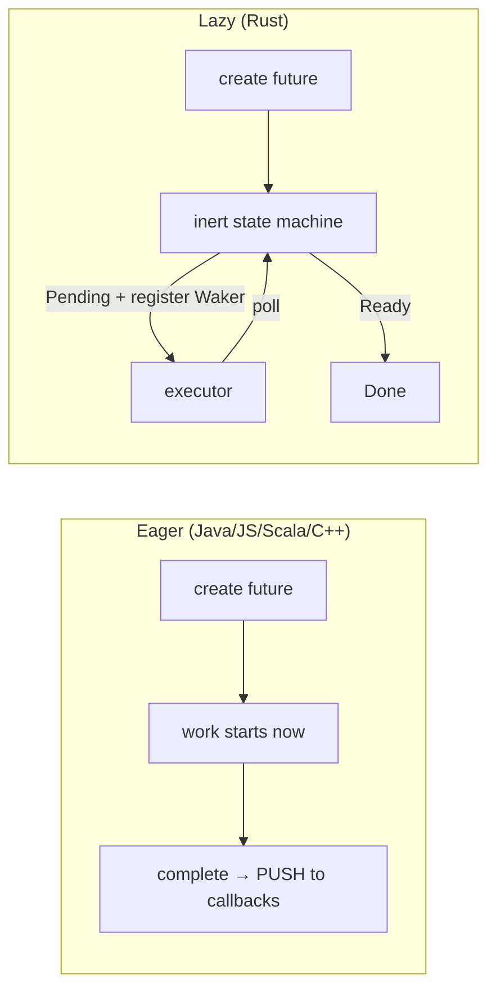

# Future / Promise — Professional Level

> **Source:** Baker & Hewitt (1977, futures) · Doug Lea, *Concurrent Programming in Java* · `java.util.concurrent`/`CompletableFuture`
> **Category:** [Concurrency](../README.md) — *"Patterns for coordinating work across threads, cores, and machines."*
> **Prerequisite:** [senior.md](senior.md)

---

## Table of Contents

1. [Introduction](#introduction)
2. [CompletableFuture Internals](#completablefuture-internals)
3. [Structured Concurrency & Project Loom](#structured-concurrency-project-loom)
4. [Memory Model and Visibility](#memory-model-and-visibility)
5. [Performance](#performance)
6. [Cross-Language Comparison](#cross-language-comparison)
7. [Microbenchmark Anatomy](#microbenchmark-anatomy)
8. [Diagrams](#diagrams)
9. [Related Topics](#related-topics)

---

## Introduction

> Focus: **How is it built, what does it cost at the instruction level, and how do the world's runtimes differ?**

This level opens the box. We trace how `CompletableFuture` actually stores its dependents, why "async vs sync stage" is a dispatch decision and not a magic word, how the JMM publishes a result without a lock, and how four other ecosystems made fundamentally different design choices — most importantly Rust's **lazy, poll-based** Future versus the **eager, push-based** Future of Java/JS/Scala. The goal is to reason about Futures the way you reason about a data structure: states, transitions, memory layout, and costs.

---

## CompletableFuture Internals

### The result field and the encoding

A `CompletableFuture<T>` holds a single volatile field, `result`:

- `null` → still **pending**.
- a non-null sentinel-wrapped value → **completed normally**. (A normal `null` result is stored as a special `NIL` token so `null` value ≠ pending.)
- an `AltResult` wrapping a `Throwable` → **completed exceptionally**.

Completion is a single `CAS` on `result` from `null` to the outcome. First writer wins; this is why `complete` returns `boolean` and the second caller gets `false`.

### The completion stack (Treiber stack of dependents)

Each `CompletableFuture` also holds a volatile `stack` field — a **lock-free Treiber stack** of `Completion` nodes. Every dependent stage you attach (`thenApply`, `thenCompose`, …) pushes a `Completion` node:

- If the source is **already complete** when you attach, the dependent fires **immediately, inline** on the attaching thread (this is why `thenApply` on a settled Future runs synchronously where you stand).
- If the source is **pending**, the node is pushed onto `stack`. When the source completes, the completer **pops and fires** every node — either inline (sync stages) or by handing the node's task to an `Executor` (async stages).

This is the whole engine: a CAS'd result field plus a lock-free stack of continuations. No locks on the hot path.



### Async vs sync stages = *where the Completion runs*

`thenApply` and `thenApplyAsync` build the *same* node; they differ only in the node's `tryFire` policy:

- **Sync (`thenApply`)** → run the function on the thread that triggers the firing (the completer, or the attacher if already done).
- **Async (`thenApplyAsync`)** → wrap the function as a task and submit it to the stage's `Executor` (explicit, or `commonPool`).

So "async" never means "more parallel"; it means "**hop to an executor rather than running inline**." Choosing wrong is a *confinement* decision (which thread), not a speed decision.

### `thenCompose` flattening

`thenCompose` is `flatMap`: when the source completes with `T`, it calls your function producing a *new* `CompletableFuture<U>`, then **relays** that inner future's eventual completion to the outer one (via an internal `UniRelay`/`UniCompose` node). That relay is why no extra thread blocks waiting for the inner future — completion propagation is event-driven.

---

## Structured Concurrency & Project Loom

`CompletableFuture` solved "don't block a platform thread," but at the cost of inverted, callback-shaped control flow and lost stack traces. **Project Loom** attacks the root cause: make blocking cheap.

- **Virtual threads (Java 21):** a `Thread` scheduled by the JVM onto a small pool of carrier (platform) threads. Blocking a virtual thread (on `get()`, IO, locks) *unmounts* it from its carrier instead of parking an OS thread. You can have millions. This makes ordinary blocking `Future.get()` cheap again — removing the prime motivation for `CompletableFuture` composition in new code.
- **Structured concurrency (`StructuredTaskScope`):** binds the lifetime of child tasks to a lexical scope. Forked subtasks must complete before the scope closes; a failure can cancel siblings; cancellation propagates down the tree; and stack traces reflect the real call hierarchy.

```java
try (var scope = new StructuredTaskScope.ShutdownOnFailure()) {
    var user    = scope.fork(() -> userApi.get(id));     // virtual thread, may block
    var balance = scope.fork(() -> walletApi.balance(id));
    scope.join().throwIfFailed(Function.identity());     // wait all; propagate first failure
    return new View(user.get(), balance.get());
}   // scope guarantees no task outlives this block
```

The relationship: `CompletableFuture` remains the **interop return type** (libraries, async servlet APIs, reactive bridges). Structured concurrency is the **internal implementation** strategy when you control the code and want legible, cancellable fan-out. They coexist; you bridge with `CompletableFuture.supplyAsync(supplier, virtualThreadExecutor)` or by completing a `CompletableFuture` from inside a scope.

---

## Memory Model and Visibility

The `result` field is `volatile`. The JMM consequences:

- A successful `complete(v)` is a **volatile write**; any thread that observes completion (via a volatile read of `result` through `get`/`join`/dependent firing) gets a **happens-before** edge. Therefore everything the producer wrote *before* `complete` is visible to consumers *after* they observe completion — **no extra synchronization needed to publish the result graph**, even if it contains mutable objects, provided the producer ceases mutation before completing.
- Dependent-stage firing piggybacks on the same volatile: the completer's writes are visible inside the callback.
- **The hazard is post-completion mutation.** Writing to the result object *after* `complete` races with readers — outside the happens-before edge. Treat the published value as effectively immutable from completion onward.
- **Self-suspension / nested completion** uses the lock-free stack, so there is no monitor to cause visibility gaps; correctness rests entirely on the `result` volatile and CAS.

---

## Performance

### Allocation profile

Each stage allocates: the dependent `CompletableFuture`, a `Completion` node, and (for `*Async`) a task wrapper plus an executor queue entry. A 6-stage chain is ~6–18 small objects. For request-rate workloads this is negligible; for tight inner loops over millions of items it is not — prefer batching or plain blocking in that regime.

### Dispatch cost

- **Sync stage:** a virtual call, no scheduling — nanoseconds.
- **Async stage:** an executor `submit` (queue push + possible thread wakeup) — hundreds of ns to microseconds, plus the cache-cold cost of resuming on a different core.

The optimization lever: **minimize executor hops.** Collapse adjacent pure transforms into one `thenApply`; only go `*Async` when you must change confinement (CPU↔IO) or break a deep recursive completion stack.

### Deep-chain stack depth

Synchronous completion fires dependents **inline and recursively**. A very long synchronous chain completing in one shot can grow the call stack; `CompletableFuture` mitigates with a `NESTED`/`postComplete` loop, but pathologically deep sync chains can still stress the stack — another reason to insert an occasional `*Async` boundary in long pipelines.

---

## Cross-Language Comparison

| Runtime | Read side | Write side | Eager/Lazy | Defining trait |
|---------|-----------|-----------|-----------|----------------|
| **Java** | `CompletableFuture<T>` (read methods) | same object: `complete`/`completeExceptionally` | **eager** | merged read/write; rich composition; executor-explicit |
| **JavaScript** | `Promise<T>` (`.then`/`.catch`) | executor's `resolve`/`reject` | **eager** | single-threaded event loop; microtask queue ordering |
| **Scala** | `Future[T]` (`map`/`flatMap`) | `Promise[T]` (`success`/`failure`), `.future` derives read side | **eager** | cleanest read/write *type* separation |
| **C++** | `std::future<T>` (`get`) | `std::promise<T>` (`set_value`/`set_exception`) | **eager** | separate types; `get` is one-shot; `shared_future` for many readers |
| **Rust** | `impl Future` (`poll`) | a `Waker` resolves; or `oneshot::Sender` | **lazy** | does nothing until polled by an executor; zero-cost, no built-in runtime |

### The deep split: eager (push) vs lazy (poll)

- **Java/JS/Scala/C++ — eager, push:** creating the Future *starts* the work; completion **pushes** to registered callbacks. Cancellation is awkward (the work may already be running); you cannot "not run" a created future.
- **Rust — lazy, poll:** a `Future` is an inert state machine. Nothing runs until an **executor** (Tokio, async-std) `poll`s it; the future returns `Poll::Pending` and registers a `Waker` to be re-polled when progress is possible. Consequences:
  - **Cancellation = drop.** Stop awaiting → the future is dropped → its work simply never advances. Clean and deterministic.
  - **Zero-cost / no heap by default.** `async fn` compiles to a generated enum (state machine); no allocation unless boxed (`Box<dyn Future>`).
  - **No bundled runtime.** You choose the executor; the language ships only the trait.

JavaScript's nuance: Promises always resolve callbacks via the **microtask queue**, so `.then` never runs synchronously even on an already-resolved Promise — the opposite of Java's inline firing on already-completed Futures. This ordering guarantee is why `Promise.resolve().then(...)` is a reliable "next microtick."

Scala's `Future`/`Promise` is the reference model for teaching: `val p = Promise[T](); val f = p.future` — the producer holds `p`, hands out `f`, and `p.success(v)` (write) completes `f` (read). C++ mirrors this with `std::promise`/`get_future()`.

---

## Microbenchmark Anatomy

To measure Future overhead honestly (JMH):

```java
@Benchmark
public Integer syncChain() {                       // no executor hops
    return CompletableFuture.completedFuture(1)
        .thenApply(x -> x + 1)
        .thenApply(x -> x * 2)
        .join();
}

@Benchmark
public Integer asyncChain() throws Exception {     // executor hop per stage
    return CompletableFuture.supplyAsync(() -> 1, pool)
        .thenApplyAsync(x -> x + 1, pool)
        .thenApplyAsync(x -> x * 2, pool)
        .get();
}
```

What you must control to get truth, not folklore:

- **Warm up** (≥5 iterations) so the JIT inlines stage lambdas; cold numbers are meaningless.
- **`Blackhole` the result** — otherwise dead-code elimination deletes the whole chain.
- **Separate the executor cost** — `asyncChain` measures *scheduling*, not your function; the gap between `syncChain` and `asyncChain` *is* the executor-hop tax (typically 1–3 orders of magnitude per hop).
- **Pin thread count / pool type** and report it; `commonPool` parallelism varies by machine.
- **Measure tail (p99), not just mean** — async dispatch's cost lives in the tail under contention.

Typical finding: a sync stage costs tens of nanoseconds; an async hop costs ~0.5–5 µs and is dominated by queueing + cross-core wakeup. Conclusion that generalizes: **`*Async` is for correctness/confinement, never for speeding up cheap pure functions.**

---

## Diagrams

**Eager push vs lazy poll:**



**Loom relationship:**

```mermaid
flowchart LR
    API["public API:\nCompletableFuture<T>"] --> Impl
    subgraph Impl["internal implementation"]
      SC["StructuredTaskScope\n(virtual threads, cheap blocking)"]
    end
    SC -->|complete()| API
```

---

## Related Topics

- [Active Object](../01-active-object/junior.md) — its request queue + Future return is the OO sibling of structured fan-out.
- [Thread Pool](../05-thread-pool/junior.md) — carrier threads for virtual threads; executors for async stages.
- [Proactor](../04-proactor/junior.md) — OS completion ports are the native, lazy-ish "future" of the kernel.
- [Producer–Consumer](../06-producer-consumer/junior.md) — Rust's `oneshot` channel is exactly a one-slot Promise/Future.
