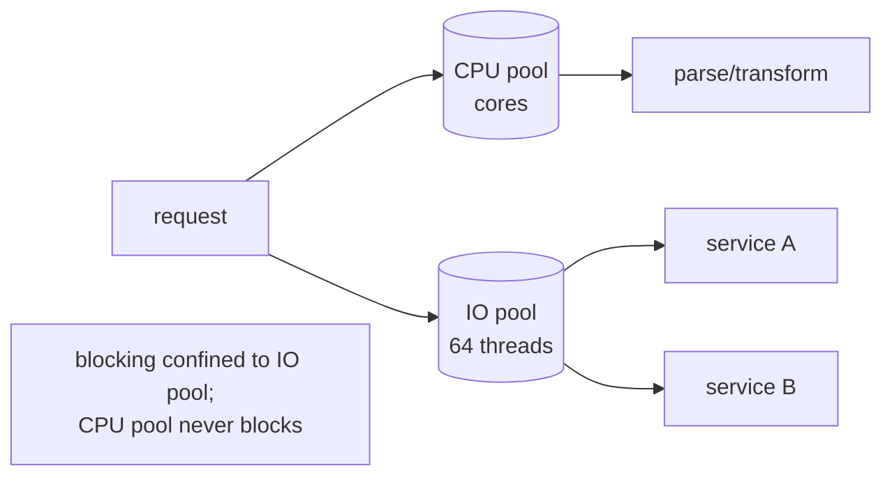
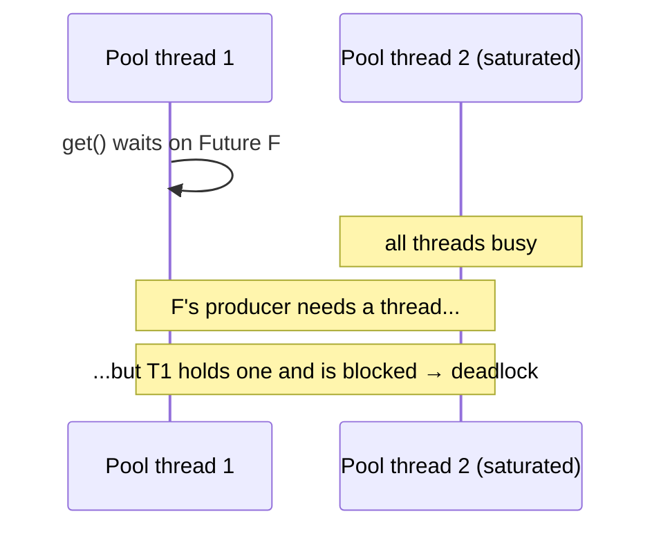

# Future / Promise — Senior Level

> **Source:** Baker & Hewitt (1977, futures) · Doug Lea, *Concurrent Programming in Java* · `java.util.concurrent`/`CompletableFuture`
> **Category:** [Concurrency](../README.md) — *"Patterns for coordinating work across threads, cores, and machines."*
> **Prerequisite:** [middle.md](middle.md)

---

## Table of Contents

1. [Introduction](#introduction)
2. [Futures at Architectural Scale](#futures-at-architectural-scale)
3. [Executor Selection & Thread Confinement for Callbacks](#executor-selection-thread-confinement-for-callbacks)
4. [Concurrency Deep Dive](#concurrency-deep-dive)
5. [Testability Strategies](#testability-strategies)
6. [When Futures Become a Problem](#when-futures-become-a-problem)
7. [Code Examples — Advanced](#code-examples-advanced)
8. [Real-World Architectures](#real-world-architectures)
9. [Pros & Cons at Scale](#pros-cons-at-scale)
10. [Trade-off Analysis Matrix](#trade-off-analysis-matrix)
11. [Migration Patterns](#migration-patterns)
12. [Diagrams](#diagrams)
13. [Related Topics](#related-topics)

---

## Introduction

> Focus: **How does it behave at scale, under failure, and across teams?**

At senior level the question is no longer "how do I compose Futures" but "what does a Future-based architecture *cost* in threads, latency tails, and operational legibility — and when does it quietly fall apart?" Three forces dominate every serious Future system:

1. **Where callbacks run** (executor confinement) determines throughput and correctness.
2. **The happens-before edge at completion** determines whether your data is even visible.
3. **Blocking `get()` on a finite pool** is the single most common way Future systems deadlock or starve in production.

Get those three right and Futures scale beautifully. Get any one wrong and you get tail-latency cliffs that only appear under load.

---

## Futures at Architectural Scale

A request-handling service built on Futures is a **dynamic dataflow graph rebuilt per request**. Each node is a stage; each edge is a completion-triggered dispatch. At scale you care about properties of the *graph*, not individual Futures:

- **Critical path latency** = the longest dependency chain, not the sum of all work. Parallelism via `allOf` collapses independent work onto the slowest branch. Your p99 is the p99 of the slowest *branch*, compounded across the chain.
- **Thread amplification.** Each `*Async` hop may bounce the computation to a different pool thread. A 6-stage chain can touch 6 threads, each with cache-cold context. Fewer, coarser stages = less context-switch churn.
- **Failure blast radius.** With `allOf`'s fail-fast semantics, one slow/failing dependency rejects the whole aggregate. Decide deliberately whether you want fail-fast or *partial results* (collect each future's outcome with `handle` before joining).
- **Backpressure absence.** Futures have no flow control. If requests arrive faster than the pool drains, queues grow unbounded unless you bound the executor's queue and shed load explicitly.

---

## Executor Selection & Thread Confinement for Callbacks

This is where most senior bugs live. Rules:

- **`thenApply` (non-async) runs on whichever thread completed the previous stage — or the *calling* thread if the previous stage is already done.** That thread is unknowable at write time. For a trivial pure transform, fine. For anything that touches shared services or blocks, it's a landmine.
- **`thenApplyAsync(fn)` with no executor uses `ForkJoinPool.commonPool()`** — a shared, JVM-wide, CPU-sized pool. Putting **blocking** work there starves *every* other commonPool user (parallel streams, other libraries). **Never** put blocking work on the common pool.
- **`thenApplyAsync(fn, executor)` with an explicit, purpose-built executor** is the only production-safe form for non-trivial stages.

### Separate pools by workload

```java
// CPU-bound transforms: sized to cores, no blocking allowed.
ExecutorService cpu = Executors.newWorkStealingPool(Runtime.getRuntime().availableProcessors());

// Blocking IO: sized larger, isolated so blocking can't starve CPU work.
ExecutorService io  = Executors.newFixedThreadPool(64, named("io"));

CompletableFuture
    .supplyAsync(() -> remoteCall(req), io)        // blocking → io pool
    .thenApplyAsync(this::parse, cpu)              // CPU → cpu pool
    .thenComposeAsync(p -> remoteCall2(p), io);    // blocking again → io pool
```

**Bulkheading by pool** prevents a slow downstream from consuming the threads that fast paths need — the same principle as the [circuit breaker](../../../../README.md)/bulkhead resilience patterns, applied at the executor boundary.

---

## Concurrency Deep Dive

### Happens-before across completion

The JMM guarantee that makes Futures safe: **actions that happen-before a Future's completion are visible to actions that happen-after observing that completion.** Concretely — everything the producing thread did *before* calling `complete(v)` (or before the `supplyAsync` supplier returned) is visible to any thread that later reads the value via `get`, `join`, or a dependent stage. You do **not** need extra synchronization to publish the *result object*, even if it's mutable, **as long as you stop mutating it before completion**.

The trap: if the producer keeps mutating the result *after* completing the Future, that mutation races with consumers and the happens-before edge does not cover it.

```java
List<Row> rows = new ArrayList<>();
CompletableFuture<List<Row>> f = supplyAsync(() -> {
    fill(rows);
    return rows;            // safe to publish: filled BEFORE return/completion
}, io);
// ✗ DO NOT touch `rows` from the producer after this point.
```

### Completion is single-writer, multi-reader

`complete`/`completeExceptionally` are CAS-based: the first wins, the rest are no-ops. Multiple readers and multiple dependent stages are safe to register concurrently with completion — the implementation handles the race so a callback attached "just as" the Future completes still runs exactly once.

---

## Testability Strategies

Futures are deterministic dependency graphs, which makes them *more* testable than callbacks — if you control the executor and the clock.

- **Inject the executor.** Never hard-code `commonPool`. In tests, pass a **direct (same-thread) executor** so completion is synchronous and assertions are race-free.

```java
Executor direct = Runnable::run;   // runs inline, deterministic in tests
service.loadDashboard(id, direct).join();   // no flakiness
```

- **Use `CompletableFuture.completedFuture(x)` / `failedFuture(ex)`** as stubs for collaborators — instant, no threads.
- **Control time.** Replace `orTimeout` with an injected scheduler so timeout tests don't actually wait.
- **Assert on the *settled outcome*, not on timing.** Use `join()` with an outer test timeout; never `Thread.sleep` to "wait for" a Future.
- **Test the failure path explicitly** — feed `failedFuture` in and assert the `exceptionally` branch produces the fallback and that the error is logged exactly once.

---

## When Futures Become a Problem

### 1. Blocking `get()` on a bounded pool → starvation/deadlock

The canonical production outage. A task on pool P calls `get()` on a Future whose work is *also* scheduled on P. If P is saturated, the producer can't get a thread, and the blocked consumer never releases its thread. With enough such tasks, P deadlocks. **Rule: a pool's tasks must never block on results produced by the same pool.** Either compose (don't block) or use separate pools.

### 2. commonPool blocking → JVM-wide degradation

Blocking work on `ForkJoinPool.commonPool()` slows *every* parallel stream and library that shares it. The symptom is bizarre: unrelated code gets slow.

### 3. Lost exceptions → silent data loss

A `CompletableFuture` that completes exceptionally but is never observed (`get`/`join`/`whenComplete`/dependent stage) swallows the error with no log, no metric. Fire-and-forget chains *must* end in `whenComplete`/`exceptionally` that logs.

### 4. Unbounded fan-out → memory/thread blowup

`ids.stream().map(id -> supplyAsync(() -> fetch(id), io)).collect(...)` launches one task per id. With 100k ids you queue 100k tasks at once. Bound concurrency with a semaphore or a sized pool + batching.

### 5. Tail latency from late stages on a busy pool

A cheap final `thenApplyAsync` queued behind heavy work inherits that queue's latency. Small stages can sit in line behind big ones.

---

## Code Examples — Advanced

### Bounded-concurrency fan-out

```java
Semaphore gate = new Semaphore(32);   // cap concurrent in-flight calls

CompletableFuture<List<Result>> processAll(List<Id> ids) {
    List<CompletableFuture<Result>> futures = ids.stream()
        .map(id -> acquire(gate)
            .thenComposeAsync(p -> fetch(id), io)
            .whenComplete((r, ex) -> gate.release()))   // release in BOTH outcomes
        .toList();

    return CompletableFuture
        .allOf(futures.toArray(CompletableFuture[]::new))
        .thenApply(v -> futures.stream().map(CompletableFuture::join).toList());
}
```

### Partial-results aggregation (no fail-fast)

```java
// Convert each future to one that never fails, capturing outcome explicitly.
List<CompletableFuture<Outcome<Result>>> wrapped = futures.stream()
    .map(f -> f.handle((r, ex) -> ex == null ? Outcome.ok(r) : Outcome.fail(ex)))
    .toList();

CompletableFuture.allOf(wrapped.toArray(CompletableFuture[]::new))
    .thenApply(v -> wrapped.stream().map(CompletableFuture::join).toList());
// Now allOf never short-circuits; you get every outcome, success or failure.
```

### Retry with backoff, expressed as Future recursion

```java
CompletableFuture<T> withRetry(Supplier<CompletableFuture<T>> op, int attempts, Duration delay) {
    return op.get().exceptionallyCompose(ex -> {
        if (attempts <= 1) return CompletableFuture.failedFuture(ex);
        return delayed(delay).thenCompose(v -> withRetry(op, attempts - 1, delay.multipliedBy(2)));
    });
}
```

---

## Real-World Architectures

- **BFF / aggregation gateway:** per-request fan-out across services, fail-fast or partial-results depending on endpoint SLA, bulkheaded pools per downstream, timeouts on every leg.
- **Reactive web stack (pre-Loom):** Servlet 3 async / Spring `DeferredResult<T>` returning a `CompletableFuture` so the container thread is released during IO.
- **Pipeline workers:** Kafka consumer hands each record to a Future pipeline (validate → enrich → persist), with bounded concurrency to respect downstream rate limits.
- **Active Object facades:** an [Active Object](../01-active-object/junior.md) serializes mutations on one thread and returns a Future per request — Futures are the public API of the actor.

---

## Pros & Cons at Scale

| ✓ At scale | ✗ At scale |
|-----------|-----------|
| Parallelism collapses latency to the critical path | Tail latency hides in pool queueing, not in your code |
| Bulkheading by pool isolates failure domains | Cross-pool hops multiply context switches and cache misses |
| Uniform `CompletableFuture` API composes across teams | One blocking `get()` in a hot path can deadlock the service |
| Deterministic graphs are unit-testable with a direct executor | Async stack traces make production incidents harder to root-cause |
| Backpressure can be added with semaphores | No *built-in* backpressure; unbounded fan-out blows up |

---

## Trade-off Analysis Matrix

| Concern | `Future.get()` blocking | `CompletableFuture` composition | Reactive streams | Virtual threads + structured concurrency |
|---------|------------------------|--------------------------------|------------------|------------------------------------------|
| Thread cost under high concurrency | high (1 blocked thread each) | low (callbacks, no blocked threads) | low | low (cheap blocking) |
| Code readability | high | medium (callback-shaped) | low–medium | **high** (looks synchronous) |
| Backpressure | none | none | **built-in** | via bounded scopes |
| Cancellation propagation | weak | weak | strong | **strong** (scope cancels children) |
| Debuggability | good | poor (lost stacks) | poor | **good** (real stacks) |
| Maturity / ecosystem | universal | universal | mature | newer (Java 21+) |

---

## Migration Patterns

### `Future` → `CompletableFuture`

The old `ExecutorService.submit` returns a `Future` you can only block on. Wrap or replace with `supplyAsync`. To bridge a legacy `Future` into a composable one without a blocking thread, use the producing API's callback form, or — last resort — a dedicated bridging pool.

### `CompletableFuture` → virtual threads / structured concurrency (Java 21+)

The endgame: *write blocking code that is cheap to block.* Virtual threads make `get()` acceptable again because blocking a virtual thread doesn't pin a platform thread.

```java
// Structured concurrency: scoped, cancelling, real stack traces (preview in 21).
try (var scope = new StructuredTaskScope.ShutdownOnFailure()) {
    Supplier<Profile> p = scope.fork(() -> profileApi.get(id));   // blocking is fine
    Supplier<Balance> b = scope.fork(() -> walletApi.balance(id));
    scope.join().throwIfFailed();                                  // fan-in + fail-fast
    return new Dashboard(p.get(), b.get());                        // real, linear code
}
```

This subsumes much of what `allOf` + `exceptionally` did — with proper cancellation (a failure cancels siblings) and intelligible stack traces. **Migration guidance:** keep `CompletableFuture` as the *return type* of public async APIs for interop, but implement aggregation internally with structured concurrency where blocking is cheap. Convert the hottest, most deadlock-prone blocking `get()` sites first.

---

## Diagrams

**Bulkheaded executors:**



**Pool starvation from blocking get():**



---

## Related Topics

- [Active Object](../01-active-object/junior.md) — Futures are its public, asynchronous return contract.
- [Thread Pool](../05-thread-pool/junior.md) — executor sizing and bulkheading decide Future throughput.
- [Proactor](../04-proactor/junior.md) — OS completion events drive Future completion in async IO stacks.
- [Producer–Consumer](../06-producer-consumer/junior.md) — bounded queues are the backpressure Futures lack.
