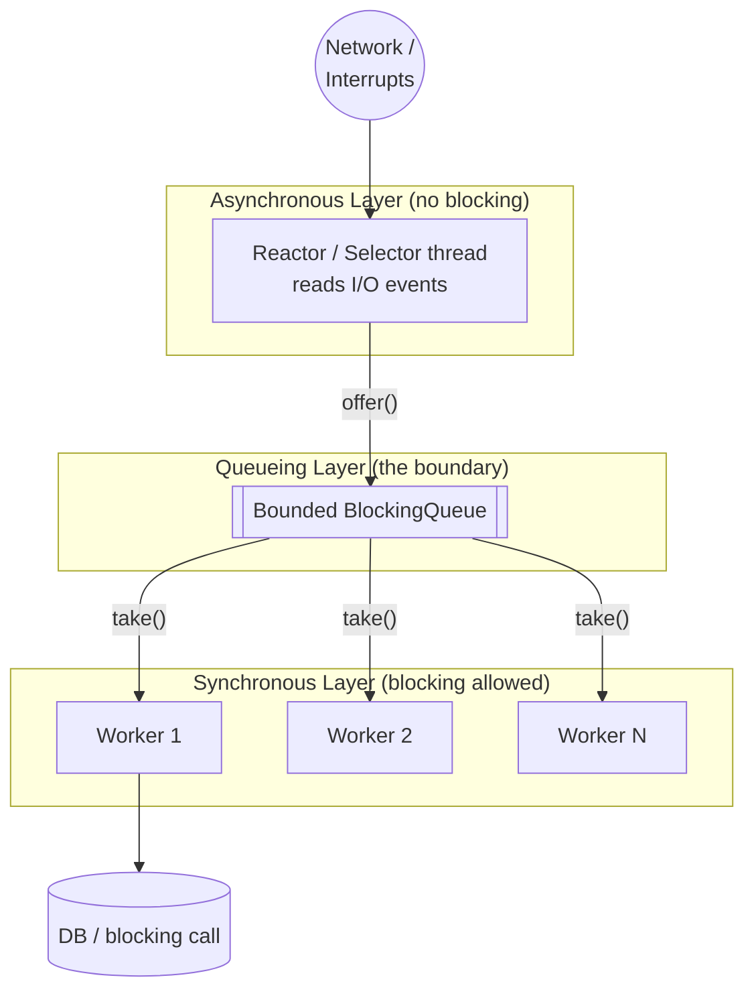
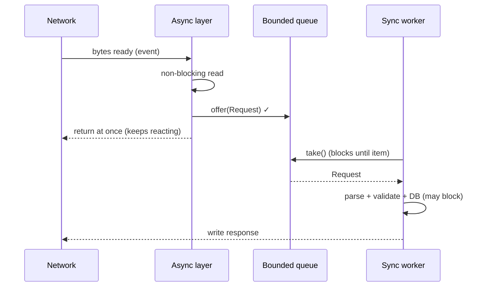

# Half-Sync/Half-Async — Junior Level

> **Source:** POSA2 — *Pattern-Oriented Software Architecture, Vol. 2* (Schmidt et al.)
> **Category:** [Concurrency](../README.md) — *"Patterns for coordinating work across threads, cores, and machines."*

## Table of Contents

1. [Introduction](#introduction)
2. [Prerequisites](#prerequisites)
3. [Glossary](#glossary)
4. [Core Concepts](#core-concepts)
5. [Real-World Analogies](#real-world-analogies)
6. [Mental Models](#mental-models)
7. [Pros & Cons](#pros--cons)
8. [Use Cases](#use-cases)
9. [Code Examples](#code-examples)
10. [Coding Patterns](#coding-patterns)
11. [Clean Code](#clean-code)
12. [Best Practices](#best-practices)
13. [Edge Cases & Pitfalls](#edge-cases--pitfalls)
14. [Common Mistakes](#common-mistakes)
15. [Tricky Points](#tricky-points)
16. [Test Yourself](#test-yourself)
17. [Tricky Questions](#tricky-questions)
18. [Cheat Sheet](#cheat-sheet)
19. [Summary](#summary)
20. [What You Can Build](#what-you-can-build)
21. [Further Reading](#further-reading)
22. [Related Topics](#related-topics)
23. [Diagrams & Visual Aids](#diagrams--visual-aids)

---

## Introduction

Some code is **fast but painful to write**. Some code is **easy to write but too slow** if it owns the hot path. Half-Sync/Half-Async is the architectural pattern that lets you have both at once — by drawing a clean line between them and putting a **queue** in the middle.

Concretely: a network server must react to thousands of I/O events per second. Doing that the fast way means **asynchronous, non-blocking** code — one thread juggling many sockets, never sleeping. But asynchronous code is hard: you cannot just write `result = db.query(...)` and wait, because waiting blocks the one thread that is servicing everyone. So your business logic gets shredded into callbacks, state machines, and continuations.

Half-Sync/Half-Async says: **don't make business logic pay that tax.** Split the system into two worlds:

- An **asynchronous layer** that does only the latency-sensitive, low-level work — accept the connection, read the bytes the instant they arrive, and *hand the work off*. It never blocks.
- A **synchronous layer** where your actual application logic lives. Here, threads are allowed to **block** on `queue.take()`, `socket.read()`, or `db.query()` because each thread serves one request at a time. This code reads top-to-bottom like a normal program.
- A **queueing layer** sits between them. The async layer is the **producer**; the sync layer is the **consumer**. The queue absorbs bursts, decouples the two rates, and is exactly where buffering, backpressure, and shutdown logic live.

You already know two halves of this picture: the [Reactor](../03-reactor/junior.md) is the async layer, and the [Thread Pool](../05-thread-pool/junior.md) draining a [Producer–Consumer](../06-producer-consumer/junior.md) queue is the sync layer. Half-Sync/Half-Async is the pattern that **names the seam between them** and tells you how to design it.

## Prerequisites

You will get the most out of this topic if you are comfortable with:

- **Threads and a thread pool** — what it means to run work on a pool of worker threads. See [Thread Pool](../05-thread-pool/junior.md).
- **Blocking vs. non-blocking calls** — a *blocking* call (e.g. `InputStream.read()`) parks the thread until data is ready; a *non-blocking* call returns immediately even if there is nothing to do.
- **Producer–consumer queues** — a thread-safe queue where some threads add items and others remove them. See [Producer–Consumer](../06-producer-consumer/junior.md).
- **The Reactor pattern** — one thread using a `Selector` to demultiplex many I/O events. See [Reactor](../03-reactor/junior.md).
- Basic Java concurrency: `ExecutorService`, `BlockingQueue`, `synchronized`/`volatile`.

If "blocking vs non-blocking" is fuzzy, read the Reactor junior page first — that pattern *is* the async layer here.

## Glossary

| Term | Meaning |
|------|---------|
| **Asynchronous layer** | The layer that handles low-level, latency-sensitive events without blocking — interrupts, socket readiness, accepts. Fast, hard to program. |
| **Synchronous layer** | The layer where higher-level services run, each in its own thread, free to use simple **blocking** calls. Slower per unit, easy to program. |
| **Queueing layer** | The buffer that mediates the handoff between async and sync layers. The producer–consumer boundary. |
| **Handoff** | The act of moving a unit of work from the async layer to the sync layer (an enqueue + later dequeue). |
| **Boundary** | The line between async and sync. The queue *is* the boundary made concrete. |
| **Backpressure** | A mechanism that slows or stops the producer when the consumer cannot keep up, instead of letting the queue grow forever. |
| **Top-half / bottom-half** | OS-kernel terms for the same split: the interrupt handler (async top-half) does the minimum, then defers the rest to a kernel thread (sync bottom-half). |
| **Half-Sync/Half-Reactive** | The common variant where the asynchronous layer is implemented as a [Reactor](../03-reactor/junior.md). |
| **Draining** | Processing remaining queued work to completion during shutdown rather than dropping it. |

## Core Concepts

**1. Two layers with opposite trade-offs.** The async layer is *efficient but inflexible* — it must never block, so it cannot contain rich logic. The sync layer is *flexible but heavier* — each thread blocks freely, so the model is intuitive, at the cost of one thread per concurrent request. The pattern's whole value is letting each layer do what it is good at.

**2. The queue is the decoupler.** Without the queue, the async layer would have to call the sync logic directly — and if that logic blocked, the async thread would freeze, defeating the purpose. The queue breaks the call: the async thread *enqueues and returns immediately*; a worker thread *dequeues and blocks at its leisure*. The two layers now run at independent rates.

**3. The async layer does the minimum, then defers.** A good async handler reads the bytes (because only it knows the moment data arrived) and immediately pushes a work item onto the queue. It does **not** parse, validate, hit the database, or render a response — all of that is "the rest," and "the rest" belongs to the sync layer.

**4. The sync layer is just normal code.** Inside a worker thread, you write straight-line logic: take an item, process it, maybe block on a database, write the result. No callbacks, no state machines. This is the entire payoff — most of your engineers only ever touch this layer.

**5. Buffering absorbs rate mismatch.** Async events arrive in bursts (a spike of connections); sync workers drain steadily. The queue smooths the bumps — provided it is **bounded** and has a policy for what happens when it fills.

## Real-World Analogies

**A restaurant.** The **waiter** (async layer) moves constantly: greets tables, takes orders, never stands still waiting for food. They drop each order ticket on the **rail** (the queue) and immediately return to the floor. The **cooks** (sync layer) pull tickets one at a time and cook each to completion — they *can* block, standing at the stove while a steak sears, because there are several of them and one slow dish doesn't stop the others. If the waiter tried to cook each order before taking the next, the dining room would grind to a halt.

**A hospital ER triage desk.** The triage nurse (async) does a 30-second assessment and routes each patient to a queue. The doctors (sync) take patients one at a time and spend as long as needed. Triage never gets stuck on one case.

**A mailroom.** The mail carrier (async) drops everything in the inbox bin (queue) and leaves; clerks (sync) process letters one by one. The carrier's route stays fast regardless of how slow any single letter is to handle.

## Mental Models

- **"Catch fast, cook slow."** The async layer's only job is to *catch* events the instant they happen and toss them in the bucket. The sync layer cooks at a comfortable pace.
- **A conveyor belt between two rooms.** Room A (async) is hectic and never stops moving. Room B (sync) is calm; workers pick items off the belt. The belt (queue) is the only shared object.
- **The "no blocking past this line" rule.** Draw a line. Left of it (async): blocking is *forbidden*. Right of it (sync): blocking is *fine*. The queue is the line.

## Pros & Cons

**Pros**

- ✅ **Simpler application code.** Business logic lives in the sync layer and reads like ordinary blocking code — no callback soup.
- ✅ **Good performance.** The async layer keeps I/O reactive and non-blocking, so you don't pay one-thread-per-connection on the hot path.
- ✅ **Clear separation of concerns.** Low-level event handling and high-level logic are physically separated by the queue.
- ✅ **Independent tuning.** You can size the worker pool and the queue separately from the I/O layer.
- ✅ **Natural buffering.** The queue absorbs bursts.

**Cons**

- ❌ **Handoff cost.** Every request crosses the queue: an enqueue, a context switch, often a memory copy, and a wakeup. For tiny tasks this overhead can dominate.
- ❌ **Two-layer complexity.** You now operate two concurrency models and must reason about their interaction.
- ❌ **The queue can become a bottleneck** — or, if unbounded, a memory leak under overload.
- ❌ **Ordering is not free** across the boundary if multiple workers consume in parallel.

## Use Cases

- **Network servers** that accept many connections and run non-trivial per-request logic (web/app servers, RPC servers).
- **Operating-system kernels**: interrupt handlers (async top-half) defer to kernel threads / softirqs (sync bottom-half).
- **GUI / mobile apps**: an event loop (async) posts work to background worker threads (sync) so the UI thread never blocks — e.g. Android's `Looper` + `HandlerThread`.
- **Message-driven pipelines**: an async ingestion front-end feeds a pool of synchronous processors.
- Any system where **a few latency-critical events** feed **a lot of comfortable-to-write logic.**

## Code Examples

Here is the pattern in miniature: a [Reactor](../03-reactor/junior.md)-style async layer accepts connections and reads bytes, then hands each request to a **bounded queue** drained by a synchronous [Thread Pool](../05-thread-pool/junior.md).

```java
// ---- The work item that crosses the boundary ----
record Request(SocketChannel channel, byte[] payload) {}

// ---- Queueing layer: the boundary made concrete ----
final BlockingQueue<Request> queue = new ArrayBlockingQueue<>(1_000); // BOUNDED

// ---- Asynchronous layer (never blocks) ----
// Runs on ONE selector thread. Its only job: read bytes, enqueue, return.
class AsyncLayer implements Runnable {
    private final Selector selector;
    private final BlockingQueue<Request> queue;

    AsyncLayer(Selector selector, BlockingQueue<Request> queue) {
        this.selector = selector;
        this.queue = queue;
    }

    public void run() {
        try {
            while (!Thread.currentThread().isInterrupted()) {
                selector.select();                       // block ONLY here, waiting for events
                var it = selector.selectedKeys().iterator();
                while (it.hasNext()) {
                    SelectionKey key = it.next();
                    it.remove();
                    if (key.isReadable()) {
                        SocketChannel ch = (SocketChannel) key.channel();
                        ByteBuffer buf = ByteBuffer.allocate(4096);
                        int n = ch.read(buf);            // non-blocking read
                        if (n > 0) {
                            buf.flip();
                            byte[] data = new byte[buf.remaining()];
                            buf.get(data);
                            // Hand off and return immediately — do NOT process here.
                            boolean accepted = queue.offer(new Request(ch, data));
                            if (!accepted) reject(ch);   // backpressure: queue is full
                        }
                    }
                }
            }
        } catch (IOException e) { /* log + shut down */ }
    }
}

// ---- Synchronous layer (allowed to block) ----
// A pool of worker threads, each draining the queue and processing to completion.
class SyncWorker implements Runnable {
    private final BlockingQueue<Request> queue;
    SyncWorker(BlockingQueue<Request> queue) { this.queue = queue; }

    public void run() {
        while (!Thread.currentThread().isInterrupted()) {
            try {
                Request req = queue.take();              // BLOCKS — and that's fine here
                byte[] response = handle(req.payload()); // may parse, validate, hit a DB...
                writeBack(req.channel(), response);      // straight-line, easy to read
            } catch (InterruptedException e) {
                Thread.currentThread().interrupt();
                return;                                  // clean shutdown
            }
        }
    }
}

// ---- Wiring ----
var pool = Executors.newFixedThreadPool(8);
for (int i = 0; i < 8; i++) pool.submit(new SyncWorker(queue));
new Thread(new AsyncLayer(selector, queue), "async-io").start();
```

Read it as three boxes: **async** (one thread, never blocks, just reads + enqueues), **queue** (bounded, 1000 slots), **sync** (eight threads, each blocks freely). The `queue.offer(...) == false` branch is your first taste of backpressure.

## Coding Patterns

- **Reactor as the async layer.** In practice the async layer is almost always a [Reactor](../03-reactor/junior.md) (a `Selector` loop). This combination is so common it has its own name: **Half-Sync/Half-Reactive**.
- **Thread pool as the sync layer.** The sync layer is a fixed [Thread Pool](../05-thread-pool/junior.md), one thread per in-flight request.
- **`BlockingQueue` as the boundary.** `ArrayBlockingQueue` (bounded) is the default. Bounded — never `LinkedBlockingQueue()` with no capacity in production.
- **`offer` not `put` on the async side.** The async thread must never block on a full queue (`put` blocks!). Use `offer` and handle rejection.
- **`take` on the sync side.** Workers may block (`take`) — that is the entire point of being in the sync layer.

## Clean Code

- Keep the async handler **tiny**: read, enqueue, return. If you find yourself parsing or validating there, you've crossed the line.
- Name the layers in code — `AsyncLayer`, `SyncWorker`, `boundaryQueue` — so the architecture is visible.
- Make the work item (`Request`) an **immutable** record. It is shared across threads at the moment of handoff; immutability removes a class of visibility bugs.
- Put the queue's capacity and the pool's size in **named constants/config**, not magic numbers buried in the wiring.
- Handle `InterruptedException` by restoring the interrupt flag and returning — don't swallow it.

## Best Practices

- ✅ **Bound the queue.** Always. An unbounded queue turns overload into an out-of-memory crash.
- ✅ **Decide the rejection policy up front**: reject (fast-fail), block the producer (only if it's safe to slow intake), or drop oldest. Make it explicit.
- ✅ **Size the pool to the work.** CPU-bound work → ~number of cores; I/O-bound (blocking on DB/network) → more, since threads spend time parked.
- ✅ **Drain on shutdown.** Stop the async layer first, then let workers finish the queue, then stop them.
- ✅ **Keep the async layer single-purpose** — I/O readiness only.

## Edge Cases & Pitfalls

- **Unbounded queue** → memory grows without limit under load; the JVM eventually OOMs. The classic Half-Sync/Half-Async footgun.
- **Tiny tasks.** If `handle()` takes 2 µs but the handoff costs 5 µs, the pattern *slows you down*. The queue earns its keep only when sync work is substantial.
- **Ordering.** With multiple workers, request *N+1* can finish before request *N*. If a connection requires ordered processing, route all its requests to the same worker.
- **Backpressure that lies.** Calling `offer` and ignoring the `false` result silently drops work. Always handle rejection.
- **Shutdown that drops work.** Killing workers while the queue is non-empty loses in-flight requests.

## Common Mistakes

1. **Doing real work in the async layer.** Parsing, DB calls, or business logic in the selector thread freezes all I/O. Hand off immediately.
2. **Using `put` instead of `offer` on the producer side.** `put` blocks when the queue is full — which blocks the one async thread.
3. **Unbounded queue.** Covered above; it's the #1 production incident from this pattern.
4. **Sharing mutable state in the work item.** If the `Request` holds a mutable buffer the async thread keeps reusing, the worker may read garbage. Copy or make it immutable at handoff.
5. **Forgetting visibility.** Data written by the async thread must be *safely published* to the worker. A thread-safe `BlockingQueue` gives you this for the queued object — but only for what the object *transitively* references at enqueue time.

## Tricky Points

- The async layer **does** block — but only inside `selector.select()`, waiting for events. That's the *one* sanctioned blocking point; it is not blocking on application work.
- The pattern doesn't make things faster than a pure async design; it makes the *code simpler* at a *small, bounded* performance cost. Read the intent carefully: "simplify programming *without unduly reducing performance*."
- The queue gives you visibility for the *reference* you enqueue, not for objects that reference mutates afterward. Stop mutating a work item once it's enqueued.

## Test Yourself

1. What are the three layers, and which one is allowed to block on application work?
2. Why must the async layer use `offer` rather than `put` when enqueuing?
3. What goes wrong if the boundary queue is unbounded?
4. When does the handoff cost make this pattern a *net loss*?
5. Why is the work item best made immutable?

<details><summary>Answers</summary>

1. Async (latency-sensitive I/O, no blocking), Queueing (buffer), Sync (application logic, **blocking allowed**). Only the **sync** layer blocks on application work.
2. `put` blocks when the queue is full, which would freeze the single async thread; `offer` returns `false` instead, letting the async layer apply backpressure and keep moving.
3. The queue grows without bound under overload until the process runs out of memory and crashes.
4. When per-task sync work is tiny — the enqueue + context switch + wakeup cost can exceed the work itself.
5. It is shared across threads at the moment of handoff; immutability prevents the worker from seeing a half-mutated or stale buffer.
</details>

## Tricky Questions

- *"Is the async layer truly never blocking?"* It blocks only in `select()` awaiting events — not on application work. That distinction is the whole pattern.
- *"Where does backpressure live?"* At the boundary: a bounded queue plus a rejection policy. It's the only place the two rates meet.
- *"How is this different from just using a thread pool?"* A thread pool alone still needs *something* to feed it without blocking on I/O. Half-Sync/Half-Async names that feeder (the async layer) and the seam (the queue) as first-class parts of the design.

## Cheat Sheet

| Layer | Threads | Blocks? | Does what |
|-------|---------|---------|-----------|
| **Async** | 1 (or few) | only in `select()` | reads I/O events, enqueues, returns |
| **Queue** | — | — | bounded buffer; backpressure point |
| **Sync** | pool (N) | yes, freely | parses, validates, DB, response |

- Producer side → `offer`, handle `false`. Consumer side → `take`.
- Queue **bounded**, pool **sized to work**, shutdown **drains**.
- Async layer = [Reactor](../03-reactor/junior.md); Sync layer = [Thread Pool](../05-thread-pool/junior.md); seam = [Producer–Consumer](../06-producer-consumer/junior.md).

## Summary

Half-Sync/Half-Async splits a concurrent system into an **asynchronous layer** (fast, non-blocking, latency-sensitive I/O), a **synchronous layer** (simple blocking application code), and a **queueing layer** that hands work between them. The async layer catches events and enqueues; the sync layer dequeues and processes to completion. The result: business logic stays easy to write while the I/O path stays reactive — at the price of a bounded handoff cost paid at the queue. The seam is where backpressure, ordering, and shutdown all live, so you design the queue with as much care as the layers it joins.

## What You Can Build

- A small **echo/RPC server** with a Reactor front-end and a worker pool — the canonical exercise.
- A **log-ingestion pipeline**: async receiver → bounded queue → synchronous parsers/writers.
- A **responsive desktop/mobile UI** where the event loop posts work to background workers (see the Android model in [professional.md](professional.md)).

## Further Reading

- POSA2, *Pattern-Oriented Software Architecture, Vol. 2*, Schmidt et al. — the Half-Sync/Half-Async chapter.
- *Java Concurrency in Practice*, Goetz — `BlockingQueue`, thread pools, safe publication.
- Linux kernel docs on interrupt **top-half / bottom-half** and softirqs/workqueues.

## Related Topics

- [Reactor](../03-reactor/junior.md) — the usual async layer.
- [Thread Pool](../05-thread-pool/junior.md) — the usual sync layer.
- [Producer–Consumer](../06-producer-consumer/junior.md) — the queueing boundary.
- [Leader/Followers](../09-leader-followers/junior.md) — the lower-latency cousin that removes the queue/handoff.

## Diagrams & Visual Aids




