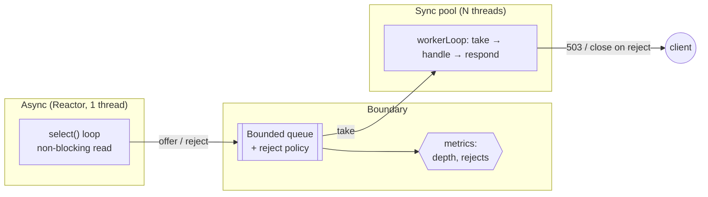
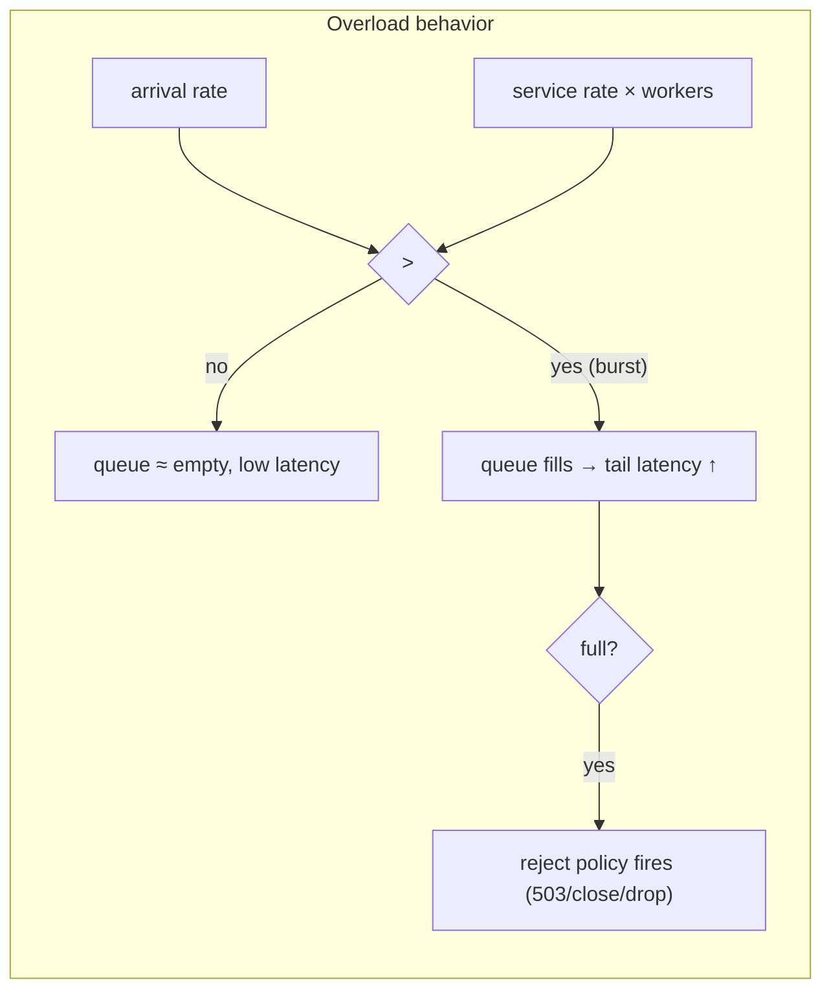

# Half-Sync/Half-Async — Middle Level

> **Source:** POSA2 — *Pattern-Oriented Software Architecture, Vol. 2* (Schmidt et al.)
> **Category:** [Concurrency](../README.md) — *"Patterns for coordinating work across threads, cores, and machines."*
> **Prerequisite:** [junior.md](junior.md)

## Table of Contents

1. [Introduction](#introduction)
2. [When to Use Half-Sync/Half-Async](#when-to-use-half-synchalf-async)
3. [When NOT to Use It](#when-not-to-use-it)
4. [Real-World Cases](#real-world-cases)
5. [Code Examples — Production-Grade](#code-examples--production-grade)
6. [The Three Layers (Async / Queueing / Sync)](#the-three-layers-async--queueing--sync)
7. [Half-Sync/Half-Reactive Variant](#half-synchalf-reactive-variant)
8. [Trade-offs](#trade-offs)
9. [Alternatives Comparison](#alternatives-comparison)
10. [Refactoring to Half-Sync/Half-Async](#refactoring-to-half-synchalf-async)
11. [Pros & Cons (Deeper)](#pros--cons-deeper)
12. [Edge Cases](#edge-cases)
13. [Tricky Points](#tricky-points)
14. [Best Practices](#best-practices)
15. [Tasks (Practice)](#tasks-practice)
16. [Summary](#summary)
17. [Related Topics](#related-topics)
18. [Diagrams](#diagrams)

---

## Introduction

At the junior level you saw the shape: async reads, queue buffers, sync processes. At the middle level the interesting questions are not *what* the layers are but *how you size and connect them*: How big is the queue? What happens when it fills? How many workers? What's the rejection policy, and how does it propagate back to the client? This page is about turning the pattern into a system that survives production load.

The mental upgrade is this: **the queue is not plumbing — it is a control surface.** Its capacity sets your worst-case latency and memory footprint. Its rejection policy *is* your overload behavior. Get those two decisions right and the pattern is robust; get them wrong and you've built either a memory bomb (unbounded) or a system that drops traffic silently.

## When to Use Half-Sync/Half-Async

Reach for it when **all** of these hold:

- The hot path is **latency-sensitive I/O** that you don't want to block (network readiness, interrupts, UI events).
- The per-request work is **substantial enough** that a handoff cost (single-digit microseconds) is negligible against it.
- You want your application logic to be **simple, blocking, straight-line code** — most of the team should not have to think asynchronously.
- You can tolerate (or actively want) a **buffer** between intake and processing to absorb bursts.
- You need **independent tuning** of the I/O layer and the processing layer.

A web/RPC server doing per-request validation + database work is the textbook fit: the accept/read is async, the request handling is comfortable blocking code.

## When NOT to Use It

- **Tiny, uniform tasks.** If each task is a few microseconds (e.g. incrementing a counter, a cache hit), the handoff dominates. Process inline in the async layer or use a design without a queue.
- **Hard tail-latency targets.** The queue adds a wait that, under load, becomes your tail. If p99.9 must be razor-thin, consider [Leader/Followers](../09-leader-followers/junior.md), which eliminates the dispatcher hand-off.
- **Strict global ordering with parallelism.** Multiple workers reorder requests. Ordering needs either a single worker (kills parallelism) or per-key affinity.
- **Already fully async and fine with it.** If the team is comfortable writing async-all-the-way (e.g. reactive streams) and the logic doesn't block, adding a sync layer just adds overhead.

## Real-World Cases

- **Netty** uses a boss/worker model: boss `EventLoop`(s) accept connections (async), worker `EventLoop`s handle I/O. When handlers do blocking work, they hand off to a separate `EventExecutorGroup` — that hand-off is Half-Sync/Half-Async (the I/O loops stay async; the blocking handler runs on a sync pool). See [senior.md](senior.md).
- **Android**: the main `Looper` (async UI event loop) posts work to `HandlerThread`s or an `Executor` (sync workers) so the UI thread never blocks. See [professional.md](professional.md).
- **OS kernels**: an interrupt handler (async top-half) acknowledges hardware and schedules a softirq/workqueue item; a kernel thread (sync bottom-half) does the heavy processing.
- **Application servers** (classic Servlet containers): an acceptor thread feeds a request queue drained by a worker pool.

## Code Examples — Production-Grade

A more complete sync layer with **bounded queue + explicit rejection policy + metrics + graceful drain**. The async layer is a Reactor (sketched); the focus is the boundary.

```java
public final class Boundary {
    private final BlockingQueue<Request> queue;
    private final ExecutorService workers;
    private final RejectPolicy rejectPolicy;
    private final LongAdder rejected = new LongAdder();
    private volatile boolean accepting = true;

    public Boundary(int queueCapacity, int workerCount, RejectPolicy policy) {
        this.queue = new ArrayBlockingQueue<>(queueCapacity);   // BOUNDED
        this.rejectPolicy = policy;
        this.workers = Executors.newFixedThreadPool(workerCount, named("sync-worker"));
        for (int i = 0; i < workerCount; i++) workers.submit(this::workerLoop);
    }

    /** Called by the ASYNC layer. MUST NOT block. */
    public void submit(Request r) {
        if (!accepting || !queue.offer(r)) {       // offer = non-blocking enqueue
            rejected.increment();
            rejectPolicy.onReject(r);              // e.g. send 503, close channel, drop
        }
    }

    /** Each SYNC worker: blocking, straight-line. */
    private void workerLoop() {
        while (true) {
            Request r;
            try {
                r = queue.take();                   // blocking dequeue — allowed here
            } catch (InterruptedException e) {
                Thread.currentThread().interrupt();
                break;                              // shutdown signal
            }
            if (r == POISON) break;                 // drain sentinel
            try {
                handle(r);                          // parse, validate, DB — may block
            } catch (Exception e) {
                log.error("handler failed for {}", r, e);  // never let a worker die silently
            }
        }
    }

    /** Graceful shutdown: stop intake, drain the queue, then stop workers. */
    public void shutdown() throws InterruptedException {
        accepting = false;                          // 1. async layer's submit() now rejects
        int n = ((ThreadPoolExecutor) workers).getCorePoolSize();
        for (int i = 0; i < n; i++) queue.put(POISON); // 2. one sentinel per worker
        workers.shutdown();
        workers.awaitTermination(30, TimeUnit.SECONDS); // 3. let in-flight finish
    }

    public long rejectedCount() { return rejected.sum(); }
}
```

Key production details: `submit()` is non-blocking and *always* has a rejection path; workers never die on an exception; shutdown drains via poison sentinels; `rejected` is observable. The `RejectPolicy` is where overload behavior is decided — and it's a *policy*, not a buried `if`.

## The Three Layers (Async / Queueing / Sync)

| Layer | Responsibility | Implemented as | Blocking rule | Tuning knob |
|-------|----------------|----------------|---------------|-------------|
| **Async** | demux I/O, read bytes, enqueue | [Reactor](../03-reactor/junior.md) / selector loop | never on app work | # selector threads (usually 1–2) |
| **Queueing** | buffer, backpressure, ordering point | bounded `BlockingQueue` | n/a | capacity + reject policy |
| **Sync** | parse/validate/DB/respond | [Thread Pool](../05-thread-pool/junior.md) | freely | # workers |

The three knobs interact. Roughly, by Little's Law, *queue depth ≈ arrival rate × time spent waiting + in service*. If workers can't keep up (arrival > service rate × workers), the queue fills and the reject policy fires. The queue is a *shock absorber for bursts*, not a fix for sustained overload — if your steady-state arrival exceeds capacity, no queue size saves you; it only delays the failure (and worsens latency on the way).

## Half-Sync/Half-Reactive Variant

The common specialization: the **async layer is a Reactor**, hence "Half-Reactive." Instead of a generic async front-end, you have a concrete `Selector` event loop that:

1. Registers interest in `OP_ACCEPT` / `OP_READ`.
2. On readiness, does a **non-blocking** read.
3. Enqueues the assembled request to the boundary.

```java
// Half-Reactive async layer (one selector thread)
while (running) {
    selector.select();                            // sole blocking point
    for (SelectionKey key : selectedKeys()) {
        if (key.isAcceptable()) accept(key);
        else if (key.isReadable()) {
            Request r = readNonBlocking(key);     // may return null if partial
            if (r != null) boundary.submit(r);    // hand off; do NOT process here
        }
    }
}
```

This is the form you see in Netty-style servers. The Reactor's strength (one thread, many connections) feeds the thread pool's strength (simple blocking logic) across the queue. The variant name just makes the async layer's identity explicit.

## Trade-offs

- **Latency vs. simplicity.** The queue adds wait time; in exchange your logic is simple. Quantify: under light load the wait is ~0; under load it's `queueDepth / serviceRate`. If that's acceptable, take the simplicity.
- **Throughput vs. memory.** A bigger queue absorbs bigger bursts but holds more in-flight work in memory and lengthens tail latency. Size it to *burst absorption*, not to "as big as possible."
- **Buffering vs. backpressure.** A queue *delays* the moment you must say "no." Sometimes saying "no" fast (small queue + reject) gives better client experience than queueing requests that will time out anyway.
- **Parallelism vs. ordering.** More workers = more throughput, less ordering. Choose per-connection/per-key affinity if order matters.

## Alternatives Comparison

| Approach | Async layer | Queue/handoff | Sync logic | Best when |
|----------|-------------|---------------|------------|-----------|
| **Half-Sync/Half-Async** | yes (Reactor) | yes (bounded) | blocking, simple | substantial per-request work; want simple logic |
| **[Leader/Followers](../09-leader-followers/junior.md)** | yes | **no** — one thread becomes the I/O thread | runs in the same thread | low latency; avoid queue/copy/wakeup |
| **Pure [Reactor](../03-reactor/junior.md)** | yes | no | must be non-blocking | logic is naturally async/short |
| **Thread-per-connection** | no | no | blocking, simple | low connection count |
| **[Proactor](../04-proactor/junior.md)** | yes (completions) | optional | callbacks | true async OS I/O (IOCP, io_uring) |

The sharpest contrast is **Leader/Followers**: same goal (efficient I/O + simple handlers) but it *removes the queue and the dispatcher hand-off* — a follower thread promotes itself to leader and runs the handler in place, saving a context switch and a copy. Half-Sync/Half-Async trades that latency for clearer layer separation and independent tuning. See the migration note below and in [senior.md](senior.md).

## Refactoring to Half-Sync/Half-Async

Starting from a **thread-per-connection blocking server** (simple but doesn't scale past a few thousand connections):

1. **Introduce a Reactor** for accept + read. Replace the per-connection blocking accept/read with one selector thread.
2. **Introduce the bounded queue.** The selector thread now *enqueues* a request instead of handling it inline.
3. **Keep your handler code almost unchanged** — move it into worker threads draining the queue. This is the payoff: the logic that was simple stays simple.
4. **Add the reject policy.** Decide what a full queue means (503, close, drop) and wire it to `offer`'s false branch.
5. **Add drain-on-shutdown** (poison sentinels).

The crucial insight: the *handler logic doesn't change*. You're only re-homing it from "one thread per connection" to "one thread per in-flight request, fed by a queue." The blocking style survives the refactor.

## Pros & Cons (Deeper)

**Pros**

- ✅ Application code stays **blocking and linear** — the dominant productivity win.
- ✅ The I/O layer and processing layer scale and tune **independently**.
- ✅ The queue provides **explicit, observable** backpressure and a natural metrics point (depth, reject count).
- ✅ Maps cleanly onto **existing OS/runtime facilities** (selectors, executors).

**Cons**

- ❌ Per-request **handoff cost** (enqueue + context switch + wakeup + sometimes a copy) — measurable for small tasks.
- ❌ The queue is a **shared contention point**; under extreme rates its lock can itself become the bottleneck (mitigate with `LinkedTransferQueue`, work-stealing, or multiple queues — see [optimize.md](optimize.md)).
- ❌ **Two concurrency models** to operate and debug.
- ❌ **Tail latency** grows with queue depth under load.

## Edge Cases

- **Partial reads.** A non-blocking read may return half a request. The async layer must buffer per-connection state until a full request is assembled *before* enqueuing — or you'll enqueue garbage.
- **Slow consumer / fast producer.** Sustained — queue fills, reject policy fires continuously. That's overload; the queue only buys burst tolerance.
- **Worker exception.** If a worker thread dies on an unhandled exception, you've silently lost capacity. Always wrap `handle()` in try/catch.
- **Shutdown race.** New work arriving during shutdown must be rejected (the `accepting` flag) so the drain actually terminates.
- **Response routing.** The worker often must write back to the *same* channel the async layer read from. Either pass the channel in the work item, or post the write back to the async layer (some designs require all socket writes on the selector thread).

## Tricky Points

- **`offer` vs `put` is not a style choice** — it's correctness. `put` on the async side blocks the selector thread and stalls *all* I/O. Always `offer` from async.
- **Visibility is for the enqueued reference graph at enqueue time.** The `BlockingQueue` establishes a happens-before edge, but only for state reachable when you enqueue. Don't mutate the work item afterward.
- **The async layer blocks in `select()`** — that's fine and necessary; it's not blocking on app work.
- **Bounded ≠ small.** Bound it, but size it to absorb your realistic burst, not to 10.

## Best Practices

- ✅ Bounded queue + explicit, observable reject policy. Export queue depth and reject count as metrics.
- ✅ Size workers by work type: CPU-bound ≈ cores; I/O-bound = cores × (1 + wait/compute) — measure, don't guess.
- ✅ Keep the async handler trivial; assemble full requests before enqueuing.
- ✅ Make work items immutable.
- ✅ Drain on shutdown with poison sentinels; reject new intake during drain.
- ✅ Never let a worker die silently.

## Tasks (Practice)

1. **Add backpressure metrics.** Extend the `Boundary` class to expose queue depth, enqueue rate, and reject rate. Verify reject count rises when you flood it.
2. **Implement three reject policies** (`Drop503`, `CloseChannel`, `BlockProducerBriefly` with a timeout) and benchmark client-observed behavior under overload.
3. **Per-key ordering.** Modify the design so all requests from one connection go to the same worker (hint: hash the connection id to a per-worker queue). Confirm ordering holds.
4. **Refactor a thread-per-connection echo server** into Half-Sync/Half-Reactive following the five-step refactor above. Measure connection scalability before/after.
5. **Graceful drain test.** Write a test that enqueues N items, calls `shutdown()`, and asserts all N were processed (none dropped).

See [tasks.md](tasks.md) for the full graded set with solution sketches.

## Summary

At this level, Half-Sync/Half-Async is a *tunable* system, not just a shape. The async layer (a Reactor) reads I/O without blocking; the bounded queue absorbs bursts and is where backpressure and ordering decisions live; the sync thread pool runs simple blocking logic. The three knobs — selector count, queue capacity + reject policy, worker count — together set throughput, latency, and overload behavior. The queue is a shock absorber, not an infinite buffer: it buys burst tolerance, and under sustained overload your reject policy *is* your design. Refactoring into the pattern keeps handler logic blocking and almost unchanged; the move to [Leader/Followers](../09-leader-followers/junior.md) is the path when the handoff cost itself becomes the problem.

## Related Topics

- [Reactor](../03-reactor/junior.md) — the async layer (Half-Reactive variant).
- [Thread Pool](../05-thread-pool/junior.md) — the sync layer.
- [Producer–Consumer](../06-producer-consumer/junior.md) — the boundary semantics.
- [Leader/Followers](../09-leader-followers/junior.md) — removes the queue/handoff for lower latency.
- [Proactor](../04-proactor/junior.md) — completion-based async alternative.

## Diagrams




