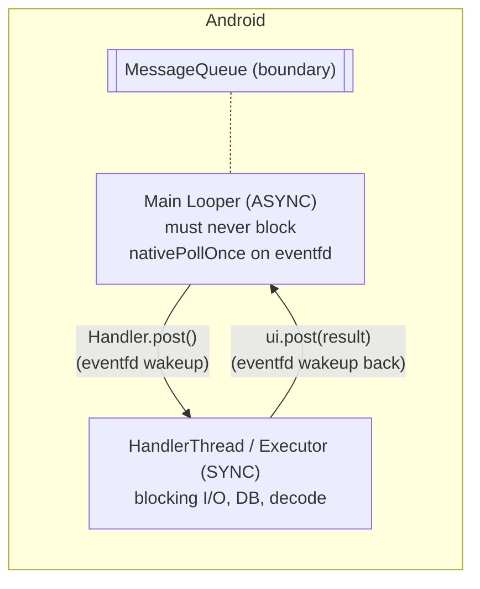
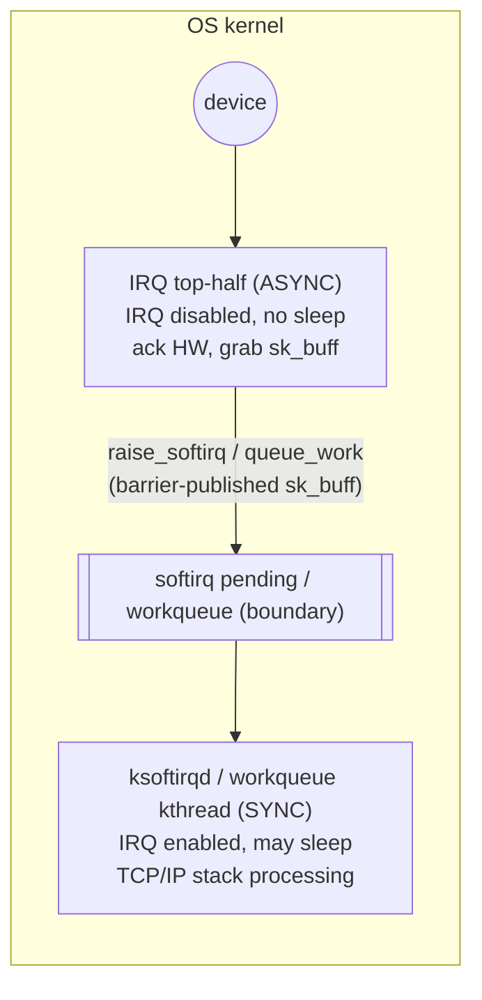

# Half-Sync/Half-Async — Professional Level

> **Source:** POSA2 — *Pattern-Oriented Software Architecture, Vol. 2* (Schmidt et al.)
> **Category:** [Concurrency](../README.md) — *"Patterns for coordinating work across threads, cores, and machines."*
> **Prerequisite:** [senior.md](senior.md)

## Table of Contents

1. [Introduction](#introduction)
2. [Internals of a Real System](#internals-of-a-real-system)
3. [Memory Model and Visibility (handoff across the queue)](#memory-model-and-visibility-handoff-across-the-queue)
4. [Performance: Cost of the Cross-Layer Copy & Wakeup](#performance-cost-of-the-cross-layer-copy--wakeup)
5. [Performance: Reducing the Handoff Tax](#performance-reducing-the-handoff-tax)
6. [Cross-Language Comparison](#cross-language-comparison)
7. [Microbenchmark Anatomy](#microbenchmark-anatomy)
8. [Diagrams](#diagrams)
9. [Related Topics](#related-topics)

---

## Introduction

This page goes under the hood of two real Half-Sync/Half-Async systems — the **Android Looper/Handler + worker threads** and the **OS interrupt top-half/bottom-half** — and then quantifies the two costs that define the pattern's performance ceiling: the **cross-layer memory copy** and the **cross-thread wakeup**. If senior level was "how to design the boundary," professional level is "what the boundary costs in nanoseconds and cache lines, and how the production systems claw those costs back."

## Internals of a Real System

### Android: main `Looper`/`Handler` (async) + worker threads (sync)

Android's UI concurrency *is* Half-Sync/Half-Async, with the main thread as the async layer:

- **The main thread runs a `Looper`** — an event loop pulling `Message`s off a `MessageQueue`. This is the async layer: it must **never block** (a few hundred ms of blocking trips the "Application Not Responding" watchdog). It dispatches input events, draws frames, and *posts* heavy work elsewhere.
- **`Handler.post(Runnable)` / `Handler.sendMessage`** enqueues onto a target thread's `MessageQueue`. The `MessageQueue` is the **queueing layer** — a priority queue ordered by `when` (timestamp), drained by exactly one `Looper`.
- **`HandlerThread` or an `Executor`** is the **sync layer**: a background thread with its own `Looper`, or a thread pool, that runs the blocking work (disk, network parse, DB). When done, it `post`s the result *back* to the main `Handler`, crossing the boundary the other direction.

```java
// SYNC layer: a HandlerThread doing blocking work
HandlerThread worker = new HandlerThread("io-worker");
worker.start();
Handler bg = new Handler(worker.getLooper());           // sync-side queue + loop
Handler ui = new Handler(Looper.getMainLooper());       // async-side queue + loop

// ASYNC layer (main thread) posts work and returns immediately:
bg.post(() -> {
    Bitmap b = decodeFromDisk(path);                    // BLOCKS — fine on worker
    ui.post(() -> imageView.setImageBitmap(b));         // hand result back to async layer
});
```

`MessageQueue` internally uses `epoll` on a pipe/eventfd: when empty, the `Looper` blocks in `nativePollOnce()` (the sanctioned blocking point, exactly like `select()`), woken by a write to the eventfd when a message is enqueued from another thread. So the cross-thread `post` cost is: enqueue under a lock + an `eventfd` write (one syscall) to wake the target loop. That eventfd write *is* the wakeup tax this pattern pays per handoff.

### OS kernel: interrupt top-half (async) → softirq/workqueue bottom-half (sync)

The lowest-level instance:

- **Top-half (async).** The hardware interrupt handler runs with the relevant IRQ line (often local interrupts) disabled. It does the absolute minimum: acknowledge the device, copy the small amount of latency-critical data (e.g. pull the packet descriptor), and **schedule deferred work** — `raise_softirq()`, `tasklet_schedule()`, or `queue_work()`. It **must not sleep** — no blocking, no allocation that can block. Same rule as our selector thread.
- **Queueing layer.** The softirq pending bitmask / the workqueue (`workqueue` is a kernel thread pool fed by a list) is the boundary.
- **Bottom-half (sync).** `ksoftirqd` or a workqueue kernel thread runs later with interrupts enabled and *may sleep/block* — it does the heavy protocol processing (e.g. the network stack walking the packet up through IP/TCP). This is the sync layer: comfortable, can block, runs in thread context.

The kernel chose this split for the exact reason POSA2 names: the top-half path must be blisteringly fast and non-blocking (you can't hold off interrupts while you do TCP reassembly), but the bulk of processing wants to be ordinary, sleepable, thread-context code. Half-Sync/Half-Async is the pattern, and the kernel is its oldest production deployment.

## Memory Model and Visibility (handoff across the queue)

The correctness of the handoff rests entirely on **safe publication**:

- **Java.** Putting an object into a `java.util.concurrent` `BlockingQueue` and taking it out establishes a **happens-before** edge: all writes the producer made *before* `put` are visible to the consumer *after* `take`. This covers the work item and everything it transitively referenced **at enqueue time**. The instant you mutate the item after enqueuing without further synchronization, you have a data race — the consumer may see torn or stale state. Hence: **immutable work items, or transfer of exclusive ownership.**
- **C/kernel.** No GC and no language memory model to lean on; the kernel uses explicit **memory barriers**. `queue_work()` / softirq raising are paired with `smp_wmb()`/`smp_rmb()` (or are built atop them) so the bottom-half sees the data the top-half wrote. Lock-free ring buffers (e.g. between NIC driver and stack) use acquire/release barriers on the producer/consumer indices. Getting a barrier wrong here is a one-in-a-billion-packets corruption bug — the reason these paths are written by specialists.
- **Ownership transfer beats copying.** The cleanest visibility story is "exactly one thread owns this buffer at a time." The producer fills it, publishes it (release), and *stops touching it*; the consumer acquires it and owns it exclusively. No shared mutable state means the only synchronization needed is the single publish/acquire edge the queue already provides.

## Performance: Cost of the Cross-Layer Copy & Wakeup

Two costs define the ceiling. Order-of-magnitude figures (modern x86, illustrative — always measure your own):

| Cost | Magnitude | Why it's there |
|------|-----------|----------------|
| **Enqueue/dequeue (uncontended lock)** | ~20–50 ns | CAS / lock acquire-release on the queue |
| **Enqueue/dequeue (contended)** | 100s of ns – µs | cache-line bouncing of the lock + head/tail across cores |
| **Cross-thread wakeup** (park→unpark) | ~1–5 µs | futex syscall + scheduler run + cache cold on wakeup |
| **Context switch** | ~1–5 µs | TLB/cache pollution dwarfs the register save/restore |
| **Cross-layer copy** (kernel buf → heap `byte[]`, 4 KB) | ~hundreds of ns + GC | memcpy bandwidth + allocation + future GC of the array |

The dominant terms are the **wakeup + context switch** (when a worker was parked) and the **copy** (if you copy bytes to enqueue). For a task whose useful work is, say, 50 µs of DB-bound processing, a ~3 µs handoff is ~6% overhead — "not unduly." For a 1 µs task, the same handoff is *300%* overhead — the pattern is a net loss, and you should inline or move to [Leader/Followers](../09-leader-followers/junior.md). This is the quantitative meaning of POSA2's "without **unduly** reducing performance."

## Performance: Reducing the Handoff Tax

Production systems attack each term:

1. **Avoid the copy — transfer ownership.** Enqueue a *reference* to a pooled/reference-counted buffer (Netty `ByteBuf`, kernel `sk_buff`) instead of copying bytes into a fresh array. The worker releases it back to the pool when done. Kills the memcpy and the GC pressure.
2. **Avoid the wakeup — keep workers hot (busy-wait briefly).** A worker that spins for a short window before parking (`onSpinWait()` / adaptive backoff) often finds the next item without ever parking, deleting the futex round-trip. The LMAX Disruptor's busy-spin wait strategy does exactly this for ultra-low-latency.
3. **Batch the handoff.** Enqueue/dequeue *N* items per lock acquisition (drain-in-batches). Amortizes the lock and the wakeup across many items — one wakeup serves a batch.
4. **Shard to kill contention.** Per-core queue + worker (see [senior.md](senior.md)) removes the contended-lock term entirely; each queue is single-producer/single-consumer and can be lock-free.
5. **Lock-free / wait-free queue.** `LinkedTransferQueue`, MPSC/SPSC ring buffers, or the Disruptor remove the lock; with cache-line padding (`@Contended`) they remove false sharing on head/tail.
6. **Coalesce wakeups.** Signal once per batch, not once per item — avoids thundering-herd unparks.

The end state of all six is a design that's barely distinguishable from Leader/Followers in cost — at which point the honest question is whether to keep the queue at all.

## Cross-Language Comparison

| Runtime | Async layer | Boundary | Sync layer | Notes |
|---------|-------------|----------|------------|-------|
| **Java** | NIO `Selector` / Netty `EventLoop` | `BlockingQueue` / Disruptor / `EventExecutor` | `ExecutorService` thread pool | virtual threads (Loom) blur the line — blocking sync code on cheap threads reduces the need for an explicit async layer |
| **C (kernel)** | IRQ top-half | softirq bitmask / workqueue list | `ksoftirqd` / workqueue kthread | barriers, not GC; `sk_buff` ownership, no copy |
| **C/C++ (userspace)** | `epoll`/`io_uring` reactor | lock-free ring (folly MPMCQueue, moodycamel) | `std::thread` pool | `io_uring` can make the front-end Proactor-like |
| **Go** | netpoller (runtime, async) | channel | goroutines (sync) | the runtime *is* the async layer; you write blocking goroutine code (sync) fed by channels — Half-Sync/Half-Async baked into the scheduler |
| **Node.js** | libuv event loop (async) | libuv thread-pool work queue | libuv worker threads (sync) | fs/crypto/dns blocking ops are deferred from the loop to the worker pool — exactly this pattern, hidden in the runtime |
| **Android/Kotlin** | main `Looper` | `MessageQueue` / `Dispatchers` | `HandlerThread` / `Dispatchers.IO` | coroutines + `Dispatchers.IO` is the modern sync layer |

The recurring theme: **mature runtimes bake the pattern in.** Go's `netpoller`+goroutines, Node's libuv loop+thread pool, and the JVM's selector+executor are all Half-Sync/Half-Async — the runtime owns the async layer and the boundary so application authors get to write blocking-style (sync) code. Loom virtual threads and Go goroutines push this further: when blocking is cheap (a parked virtual thread costs ~a few hundred bytes, not an OS thread), you can write the sync layer with one logical thread per request and let the runtime's async netpoller be the hidden async layer — the pattern survives, but the explicit user-managed boundary often disappears.

## Microbenchmark Anatomy

To measure the handoff tax honestly (JMH-style):

```java
@Benchmark @Threads(2)   // 1 producer, 1 consumer in @Group
public void handoff(Blackhole bh) {
    queue.put(payload);                 // producer side
    bh.consume(queue.take());           // consumer side (different thread in @Group)
}
```

What to control for, or you'll measure noise instead of the pattern:

- **Coordinated omission.** If you stop the producer while the consumer catches up, you hide latency. Use an open-loop load generator (fixed arrival rate) and an HDR histogram; report p99/p99.9, not the mean.
- **Park vs. spin regime.** A benchmark where the consumer never parks (queue always non-empty) measures the *cheap* path (~tens of ns) and hides the ~µs wakeup that dominates under bursty real traffic. Test both: saturated (no park) and intermittent (forces park/unpark).
- **Allocation/GC.** If your work item allocates, you're benchmarking the allocator and GC pauses, not the handoff. Pre-allocate / pool, and watch `-prof gc`.
- **False sharing.** Pad the queue's head/tail and the counters, or you'll measure cache-coherence traffic that a padded production queue wouldn't have.
- **CPU pinning & isolation.** Pin producer/consumer to specific cores (same socket vs. cross-socket changes results 2–5×); disable turbo for stable numbers.
- **Compare against the alternatives in the same harness.** Inline (no handoff) and a Leader/Followers self-promote, measured identically, are the only honest baselines for "is the queue worth it here?"

A correct microbenchmark typically shows: handoff ~tens of ns when hot, blowing up to ~µs when the consumer must be woken — and that bimodality, weighted by your real park-rate, is the number that decides Half-Sync/Half-Async vs. Leader/Followers.

## Diagrams





## Related Topics

- [Leader/Followers](../09-leader-followers/junior.md) — deletes the wakeup/copy tax this page quantifies.
- [Reactor](../03-reactor/junior.md) — the async layer (`Selector`, `Looper`, `epoll`).
- [Proactor](../04-proactor/junior.md) — `io_uring`/IOCP completion model.
- [Thread Pool](../05-thread-pool/junior.md) — the sync layer.
- [Producer–Consumer](../06-producer-consumer/junior.md) — queue internals, lock-free rings, false sharing.
