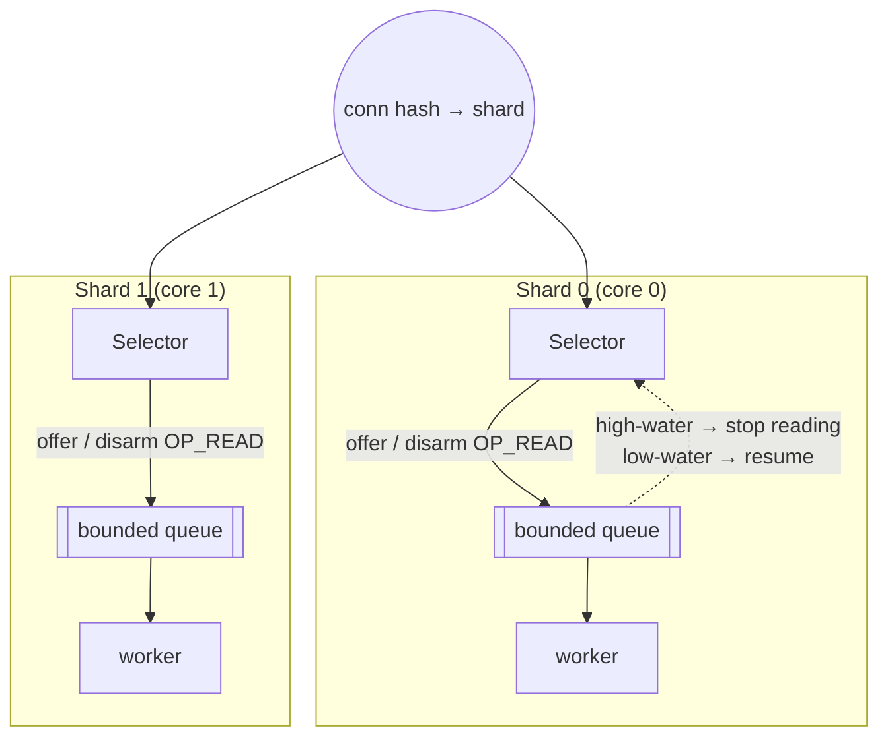

# Half-Sync/Half-Async — Senior Level

> **Source:** POSA2 — *Pattern-Oriented Software Architecture, Vol. 2* (Schmidt et al.)
> **Category:** [Concurrency](../README.md) — *"Patterns for coordinating work across threads, cores, and machines."*
> **Prerequisite:** [middle.md](middle.md)

## Table of Contents

1. [Introduction](#introduction)
2. [Half-Sync/Half-Async at Architectural Scale](#half-synchalf-async-at-architectural-scale)
3. [Queue Sizing & Backpressure Across the Boundary](#queue-sizing--backpressure-across-the-boundary)
4. [Concurrency Deep Dive](#concurrency-deep-dive)
5. [Testability Strategies](#testability-strategies)
6. [When It Becomes a Problem](#when-it-becomes-a-problem)
7. [Code Examples — Advanced](#code-examples--advanced)
8. [Real-World Architectures](#real-world-architectures)
9. [Pros & Cons at Scale](#pros--cons-at-scale)
10. [Trade-off Analysis Matrix](#trade-off-analysis-matrix)
11. [Migration Patterns (→ Leader/Followers)](#migration-patterns--leaderfollowers)
12. [Diagrams](#diagrams)
13. [Related Topics](#related-topics)

---

## Introduction

A senior engineer's job with this pattern is to reason about the **boundary as a queueing system** and to know precisely *when the queue stops helping and starts hurting*. The pattern's selling point — "simplify programming without unduly reducing performance" — contains a load-bearing word: *unduly*. There **is** a performance cost, and at scale you must be able to quantify it (the cross-layer copy, the context switch, the wakeup, the cache-line bouncing on the queue lock) and decide whether it's still acceptable, or whether it's time to migrate to a queue-less design like [Leader/Followers](../09-leader-followers/junior.md).

## Half-Sync/Half-Async at Architectural Scale

At scale the pattern recurses and composes:

- **Per-core boundaries.** A single global queue serializes every request through one lock — a scalability cliff at high request rates. The fix is *sharding the boundary*: one async layer + one queue + one worker per core (or NUMA node), with connections affined to a shard. This is how high-throughput servers (Netty's multiple `EventLoop`s, nginx's worker processes) actually deploy the pattern. The "single queue" of the textbook becomes *N* queues, each a smaller Half-Sync/Half-Async system.
- **Pipelines of boundaries.** Multi-stage processing (decode → business → encode) can chain several async/sync boundaries — this is the [SEDA](https://en.wikipedia.org/wiki/Staged_event-driven_architecture) idea: each stage is a queue + thread pool, with admission control per stage. Powerful for isolating slow stages, but every boundary adds a handoff; don't over-stage.
- **Boundary as a control point.** Because *all* work crosses the queue, it's the natural place for admission control, priority, fairness, shedding, and observability. Senior designs exploit this: priority queues for QoS, per-tenant sub-queues for fairness, load-shedding hooks at enqueue.

## Queue Sizing & Backpressure Across the Boundary

Treat the boundary with **Little's Law**: `L = λ × W`, where `L` is mean items in the system, `λ` is arrival rate, `W` is mean time in system. Two consequences:

1. **Queue capacity sets your worst-case in-system latency.** If the queue can hold `C` items and service rate is `μ` per worker × `N` workers, worst-case wait ≈ `C / (μ·N)`. Pick `C` from a **latency budget**, not from "feels big enough." If your budget is 50 ms and `μ·N = 10,000/s`, then `C ≤ 500`. A queue of 50,000 here would mean a full queue implies 5 s of latency — every queued request times out anyway. **Oversized queues convert overload into latency you can't use.**
2. **Bounded is non-negotiable; the bound is a *policy*.** Backpressure must propagate. Options, roughly in order of preference for an I/O server:
   - **Reject at the boundary** (`offer` fails → 503 / close). Honest, fast, frees the client to retry/elsewhere.
   - **Don't read** — leave bytes in the socket buffer (don't register `OP_READ` when the queue is near-full). This pushes backpressure into TCP flow control all the way to the *peer*, the cleanest mechanism because it never even reads work it can't process. This is the senior move and is what mature servers do.
   - **Block the async thread** — almost never acceptable; it stalls all I/O.
   - **Drop oldest / sample** — only for lossy telemetry.

The "don't read" option is the deepest insight: backpressure isn't only at the queue — you can refuse to *create* the work by not arming the readiness interest, letting the kernel's socket buffers and TCP window do the buffering and signal the sender to slow down.

## Concurrency Deep Dive

- **Memory model / safe publication.** A `BlockingQueue` establishes happens-before between `put` and `take`: everything the producer wrote *before* enqueuing is visible to the consumer *after* dequeuing — for the object's reachable state at enqueue time. This is why immutable work items are the rule: any post-enqueue mutation is a data race with no happens-before edge.
- **False sharing on the queue.** A naive array-backed queue has head/tail indices on the same cache line; producer and consumer ping-pong that line (cache-coherence traffic). High-end designs pad indices to separate cache lines (`@Contended`) or use ring buffers with sequence counters (LMAX Disruptor) to remove the lock entirely.
- **Lock vs. lock-free boundary.** `ArrayBlockingQueue` uses one lock for both ends → contention at high rates. `LinkedBlockingQueue` uses two locks (head/tail) → better but allocates per node. `LinkedTransferQueue` / Disruptor → lock-free / wait-free hand-off, lowest overhead, but more complex and harder to bound naively.
- **Context switches.** Every handoff is at minimum one wakeup of a parked worker → a scheduler context switch (~1–5 µs) plus cache pollution. At a million req/s, switches alone can saturate cores. This is the cost that eventually pushes you toward Leader/Followers (no handoff: the same thread that detects readiness runs the handler).
- **Wakeup amplification.** Naively signaling on every enqueue when many workers are parked causes thundering-herd wakeups. Use single-element signaling semantics (a proper `BlockingQueue` does this) — don't roll your own `notifyAll` per item.

## Testability Strategies

- **Inject the boundary.** Make `submit`/`take` an interface so tests can substitute a synchronous, in-line queue — run the whole pipeline deterministically on one thread.
- **Deterministic clocks and a controllable scheduler.** For latency/backpressure tests, drive arrivals from a virtual time source so tests aren't flaky.
- **Property: no loss under graceful shutdown.** Enqueue N, shut down, assert N processed. Run it under jitter (random sleeps in handlers) to flush out drain races.
- **Property: bounded memory under overload.** Flood with arrivals far above service rate; assert queue depth stays ≤ capacity and reject count = excess. This catches an accidentally-unbounded queue immediately.
- **Backpressure assertion.** Verify that when the queue is full, the async layer stops arming `OP_READ` (or rejects), and that this reflects in client-side TCP window / 503s.
- **Ordering tests.** With per-key affinity, assert per-key monotonicity while allowing cross-key reorder.

## When It Becomes a Problem

The pattern fails *gracefully into a few specific anti-states*:

1. **The queue is the bottleneck.** One global lock-based queue at very high request rates becomes the serialization point — workers idle waiting on the lock. Symptom: adding workers doesn't increase throughput. Fix: shard the boundary per core, or go lock-free, or migrate to Leader/Followers.
2. **Handoff cost dominates.** For sub-microsecond tasks, the enqueue + switch + wakeup + copy exceeds the work. Symptom: a pure-async or inline version is dramatically faster. Fix: process inline in the async layer, batch, or Leader/Followers.
3. **The cross-layer copy.** If the async layer copies bytes out of the kernel buffer into a heap `byte[]` to enqueue, you pay a memcpy per request and GC pressure. Fix: pass buffer ownership (slice/retain a pooled `ByteBuf`) instead of copying, or use the "don't read until a worker is ready" model so the copy happens on the worker.
4. **Latency under load.** Oversized queue → requests sit for seconds → time out anyway. Fix: size to latency budget; shed early.
5. **Context-switch storm.** At extreme concurrency the switch count saturates CPU. Fix: Leader/Followers eliminates the cross-thread handoff entirely.

## Code Examples — Advanced

**Backpressure via not arming `OP_READ` (TCP-level backpressure), plus pooled-buffer handoff to avoid the copy.**

```java
final class Boundary {
    private final MpscQueue<PooledRequest> queue;   // bounded, multi-producer/single... per shard
    private final int highWater, lowWater;

    /** ASYNC: called from selector thread. Returns whether to keep reading. */
    boolean submit(PooledRequest r) {
        boolean ok = queue.offer(r);   // never blocks
        if (!ok) { r.release(); return false; }
        // Backpressure signal: if queue is hot, ask caller to DISARM OP_READ.
        return queue.size() < highWater;
    }

    /** ASYNC: re-arm reads when queue has drained below low-water. */
    boolean shouldResumeReading() { return queue.size() <= lowWater; }
}

// Selector loop applies the signal:
boolean keepReading = boundary.submit(req);
if (!keepReading) key.interestOps(key.interestOps() & ~SelectionKey.OP_READ); // disarm
// ... elsewhere, after workers drain:
if (boundary.shouldResumeReading()) reArmReads();   // TCP window reopens; peer resumes
```

Here the request carries a **reference-counted pooled buffer** (`PooledRequest` wrapping a retained `ByteBuf`), so the handoff transfers *ownership* rather than copying bytes. The worker `release()`s it after processing, returning it to the pool. This removes both the per-request `byte[]` allocation and the memcpy — two of the three "becomes a problem" costs above.

**Per-shard boundary to kill queue contention:**

```java
Boundary[] shards = new Boundary[Runtime.getRuntime().availableProcessors()];
// connection -> shard by stable hash; each shard: own selector + own queue + own worker
int shard = Integer.hashCode(connId) % shards.length;
shards[shard].submit(req);   // no cross-shard lock contention; preserves per-conn ordering
```

Affining a connection to one shard gives free **per-connection ordering** (single consumer per shard) *and* removes global queue contention — two senior wins from one decision.

## Real-World Architectures

- **OS kernels (top-half / bottom-half).** The interrupt handler (async top-half) runs with interrupts disabled, does the bare minimum (ack hardware, grab data), and schedules a **softirq / tasklet / workqueue** item. The bottom-half (sync) runs later in a kernel thread with interrupts enabled and may sleep/block. This is Half-Sync/Half-Async at the lowest level of the machine — and the original motivating example in POSA2.
- **Android.** The main thread's `Looper` (async event loop) processes UI events and *posts* heavy work via `Handler`/`Executor` to `HandlerThread`s (sync workers). Results post back to the main `Looper`. UI thread = async layer that must never block; workers = sync layer. Detailed in [professional.md](professional.md).
- **Netty boss/worker.** Boss `EventLoop`s accept; worker `EventLoop`s do non-blocking I/O. Blocking handlers are moved to a separate `EventExecutorGroup` — that move is the Half-Sync/Half-Async hand-off, and Netty deliberately *shards* worker loops per core, exactly the per-core-boundary design above. The default (no extra executor) is closer to a pure Reactor / Leader-Followers hybrid; adding the executor *is* opting into Half-Sync/Half-Async.
- **nginx / HAProxy.** Event-driven workers (async) with optional thread pools for blocking operations (e.g. `aio threads` in nginx for disk reads that would otherwise block the event loop) — a textbook deferral of blocking work across a boundary.

## Pros & Cons at Scale

**Pros**

- ✅ The boundary is a single, natural control point for admission control, priority, fairness, shedding, and metrics.
- ✅ Independent scaling of I/O and compute; shard the whole thing per core for near-linear scaling.
- ✅ Application logic stays blocking and simple even at massive scale — the productivity win compounds across a large team.

**Cons**

- ❌ A non-sharded queue is a hard scalability ceiling (single-lock contention).
- ❌ Per-request handoff (switch + wakeup + maybe copy) caps throughput vs. queue-less designs.
- ❌ Tail latency is dominated by queue depth under load; needs disciplined sizing + shedding.
- ❌ Cross-layer copies create GC pressure unless you pass buffer ownership.

## Trade-off Analysis Matrix

| Dimension | Half-Sync/Half-Async | [Leader/Followers](../09-leader-followers/junior.md) | Pure [Reactor](../03-reactor/junior.md) |
|-----------|----------------------|-------------------|--------------|
| Handler style | blocking, simple | blocking, simple | non-blocking, hard |
| Cross-thread handoff | **yes** (queue) | **no** (self-promote) | no |
| Per-request overhead | switch + wakeup + maybe copy | minimal | minimal |
| Latency (loaded) | queue-depth bound | lowest | lowest |
| Backpressure point | the queue / OP_READ | thread availability | OP_READ |
| Independent I/O vs compute tuning | **yes** | coupled | coupled |
| Ordering | needs affinity | per-thread natural | single-thread natural |
| Best at | substantial work, big team | latency-critical, small uniform work | naturally-async logic |

## Migration Patterns (→ Leader/Followers)

When profiling shows the **handoff cost dominates** (context-switch storm, queue-lock contention, tiny tasks), migrate to [Leader/Followers](../09-leader-followers/junior.md):

1. **Recognize the trigger.** Adding workers doesn't raise throughput; flame graphs show time in `futex`/park-unpark and queue lock; tasks are short.
2. **Remove the queue.** Instead of `async-thread → queue → worker`, a pool of threads takes turns being the **leader** that waits on the selector. When the leader detects an event, it *promotes* a follower to become the next leader and then **handles the event itself**, in the same thread — no enqueue, no wakeup of a different thread, no copy.
3. **Preserve handler simplicity.** Handlers stay blocking/straight-line; they just run on the (former) leader thread.
4. **Trade-off accepted.** You lose the independent-tuning and explicit-buffer benefits of the queue and gain ~1 context switch + 1 wakeup + 1 copy saved per request. For latency-critical, small-uniform-work servers this is a large win.

The two patterns are siblings solving the same problem (simple handlers + efficient I/O); Half-Sync/Half-Async optimizes for **separation and tunability**, Leader/Followers for **latency** by deleting the boundary.

## Diagrams



```mermaid
sequenceDiagram
    participant Peer
    participant Sel as Selector (async)
    participant Q as Bounded queue
    participant Wk as Worker (sync)
    Peer->>Sel: data
    Sel->>Q: offer (ownership of pooled buf)
    alt queue hot (≥ high-water)
        Sel->>Sel: disarm OP_READ  → TCP window closes
        Note over Peer,Sel: peer stops sending (backpressure to source)
    end
    Wk->>Q: take
    Wk->>Wk: handle (may block); release buffer
    Wk-->>Sel: depth ≤ low-water → re-arm OP_READ
    Sel->>Peer: window reopens
```

## Related Topics

- [Leader/Followers](../09-leader-followers/junior.md) — the migration target; deletes the boundary for latency.
- [Reactor](../03-reactor/junior.md) — the async layer.
- [Thread Pool](../05-thread-pool/junior.md) — the sync layer.
- [Producer–Consumer](../06-producer-consumer/junior.md) — boundary semantics, contention, lock-free queues.
- [Proactor](../04-proactor/junior.md) — completion-based async front-end.
