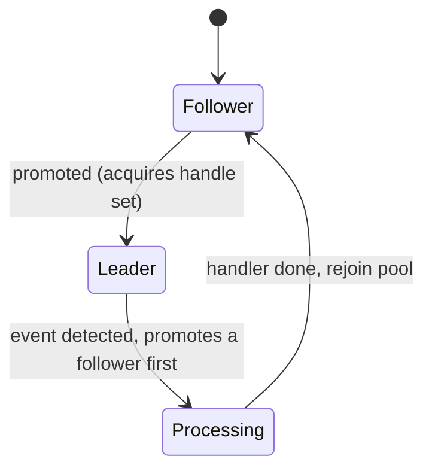
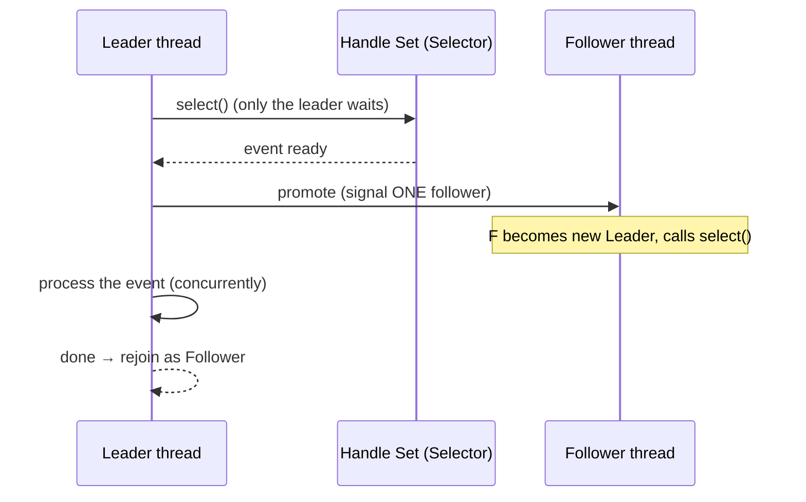

# Leader/Followers — Junior Level

> **Source:** POSA2 (Schmidt et al.) · Schmidt, Pyarali — *Leader/Followers* pattern paper
> **Category:** [Concurrency](../README.md) — *"Patterns for coordinating work across threads, cores, and machines."*

## Table of Contents

1. [Introduction](#1-introduction)
2. [Prerequisites](#2-prerequisites)
3. [Glossary](#3-glossary)
4. [Core Concepts](#4-core-concepts)
5. [Real-World Analogies](#5-real-world-analogies)
6. [Mental Models](#6-mental-models)
7. [Pros & Cons](#7-pros--cons)
8. [Use Cases](#8-use-cases)
9. [Code Examples](#9-code-examples)
10. [Coding Patterns](#10-coding-patterns)
11. [Clean Code](#11-clean-code)
12. [Best Practices](#12-best-practices)
13. [Edge Cases & Pitfalls](#13-edge-cases--pitfalls)
14. [Common Mistakes](#14-common-mistakes)
15. [Tricky Points](#15-tricky-points)
16. [Test Yourself](#16-test-yourself)
17. [Tricky Questions](#17-tricky-questions)
18. [Cheat Sheet](#18-cheat-sheet)
19. [Summary](#19-summary)
20. [What You Can Build](#20-what-you-can-build)
21. [Further Reading](#21-further-reading)
22. [Related Topics](#22-related-topics)
23. [Diagrams & Visual Aids](#23-diagrams--visual-aids)

---

## 1. Introduction

Picture a busy taxi rank at an airport. There is one spot at the very front of the queue — the **pole position**. The driver in that spot is the only one watching the arrivals door. The other drivers are dozing in their cars further back. The moment a passenger walks out, the front driver does **not** drive off first and *then* let the queue shuffle up. Instead he does it in the smart order: he taps the next driver awake — *"you're the lookout now"* — and only **then** drives the passenger away. By the time he is pulling onto the motorway, a fresh driver is already watching the door. The rank never goes blind.

That is the **Leader/Followers** pattern. You have a **pool of threads** that take turns sharing one set of **event sources** — typically a single OS-level demultiplexer such as `select`, `epoll`, or a Java `Selector` watching thousands of sockets. At any instant **exactly one thread is the leader**: it is the only one blocked on the shared handle set. Every other thread is a **follower**, asleep on a condition variable. When an event arrives, the leader **promotes** a follower to become the new leader, and **then** processes the event itself, on its own thread, concurrently with the new leader's waiting.

Why bother with this dance? Because the obvious alternative — one thread waits on the sockets and hands every ready event to a worker pool through a queue ([Half-Sync/Half-Async](../08-half-sync-half-async/junior.md)) — pays a tax on **every single request**: a lock on the queue, a memory hand-off, and a context switch from the I/O thread to a worker thread. Leader/Followers deletes that tax. The thread that *detects* the event is the same thread that *processes* it. No queue, no dispatcher, no hand-off. For a high-throughput server doing millions of small requests per second, removing one context switch per request is the difference between good and great.

This pattern is the engine inside ACE's `ACE_TP_Reactor` (TP = "thread pool") and shows up in the guts of high-performance middleware and RPC servers. It is not the pattern you reach for first — it is the one you reach for when a profiler tells you the dispatcher hand-off is your bottleneck.

## 2. Prerequisites

Before this topic, you should be comfortable with:

- **Threads and a thread pool** — what it means to have N worker threads sharing work. See [Thread Pool](../05-thread-pool/junior.md).
- **The Reactor pattern** — synchronous event demultiplexing: one thread asks the OS "which handles are ready?" and dispatches them. See [Reactor](../03-reactor/junior.md). Leader/Followers is, in effect, a *multi-threaded* Reactor.
- **Half-Sync/Half-Async** — the queue-and-dispatcher design that Leader/Followers competes with. See [Half-Sync/Half-Async](../08-half-sync-half-async/junior.md).
- **Locks and condition variables** — `synchronized`/`ReentrantLock`, `wait`/`notify`, `await`/`signal`. The promotion protocol is built entirely from these.
- **Non-blocking I/O** — `Selector`, `SelectionKey`, `select()` in Java NIO, or `epoll` in C.

## 3. Glossary

| Term | Meaning |
|------|---------|
| **Handle Set** | The shared collection of event sources the pool watches — e.g. a Java `Selector` registered with thousands of `SocketChannel`s, or an `epoll` fd. |
| **Leader** | The single thread currently blocked on the handle set (`select`). Only the leader waits on I/O. |
| **Follower** | A thread asleep on the promotion condition variable, waiting for its turn to become leader. |
| **Processing thread** | A thread that has left the leader role and is running an event handler. It is neither leading nor following. |
| **Promotion** | The act of waking a follower and designating it the new leader, so the pool stays responsive while the ex-leader processes. |
| **Promotion protocol** | The lock + condition variable that serializes leadership: who holds the handle set, who is next. |
| **Thundering herd** | The pathology where *all* threads wake on one event and fight over it. Leader/Followers avoids this by design — only the leader waits on I/O. |
| **Event Handler** | The application callback that processes a request once an event is detected (`handleEvent`). |
| **Thread affinity** | Which thread runs which work. Leader/Followers gives weak affinity: a request runs on "whoever happened to be leader," not a dedicated thread. |

## 4. Core Concepts

**One leader, many followers, some processors.** Each thread in the pool is always in exactly one of three states:

- **Leader** — blocked on the shared handle set, the sole I/O waiter.
- **Follower** — asleep on the condition variable, available for promotion.
- **Processing** — running an event handler after handing off leadership.

**The critical ordering: promote, *then* process.** When the leader's `select()` returns with a ready event, it must do two things — promote a new leader and process the event. The order is non-negotiable: **promote first**. If it processed first and promoted afterward, the entire pool would be blind for the whole duration of that handler. By promoting first, a fresh leader is watching the sockets *while* the old leader works. The pool's eyes never close.

**No dispatcher, no queue.** Contrast with [Half-Sync/Half-Async](../08-half-sync-half-async/junior.md): there, an async I/O layer pushes events onto a queue and sync worker threads pull from it. That queue is a synchronization point and a copy. Leader/Followers has neither. The same thread that the OS woke up is the thread that runs the handler. This is the whole point.

**Only the leader waits on the OS.** Followers do **not** all call `select()` on the same socket set. If they did, an arriving event would wake all of them (a *thundering herd*), they would all race to claim it, one would win, and the rest would have woken for nothing — wasted context switches. Leader/Followers serializes access to the handle set behind the promotion lock so that exactly one thread is ever in `select()`.

**The handle set is shared but access to it is serialized.** All threads can *eventually* hold the handle set; only one holds it at a time. The promotion lock is what enforces "only one."

## 5. Real-World Analogies

- **Airport taxi rank (the pole position).** Front driver watches the door; before driving off he taps the next driver awake. Promote-then-go.
- **Night-shift security desk with a relief roster.** One guard watches the monitors; the rest sleep in the break room. When something happens, the watching guard first wakes the next guard to take the monitors, *then* goes to deal with the incident. The desk is never unmanned.
- **A relay race where the baton is "the right to watch."** Whoever holds the baton watches the track. On an event, they pass the baton *before* sprinting, so the next watcher is already looking.
- **A single phone passed around a team.** Only the person holding the phone answers calls. When a call comes, they hand the phone to a teammate *before* walking off to handle the caller. Compare Half-Sync/Half-Async: a receptionist answers every call and writes a sticky note (the queue) for whichever teammate is free — extra step, extra paper.

## 6. Mental Models

1. **"Detect and process are the same thread."** This is the one-line summary. The thread the OS woke is the thread that does the work. No hand-off.
2. **"The pool's eyes must never close."** Promotion exists solely to keep one thread watching at all times. Every design decision flows from this invariant.
3. **"Leader/Followers = multi-threaded Reactor without a queue."** A Reactor is single-threaded event dispatch. Half-Sync/Half-Async bolts a worker pool on with a queue. Leader/Followers bolts a worker pool on by *passing the dispatch role around* instead of passing the events.
4. **"The promotion lock is a turnstile, not a waiting room."** Threads pass through it one at a time to claim leadership; they don't queue *inside* it doing work.

## 7. Pros & Cons

| ✓ Pros | ✗ Cons |
|--------|--------|
| Eliminates the dispatcher-to-worker hand-off and its context switch | More complex than Half-Sync/Half-Async — easy to get the promotion ordering wrong |
| No producer-consumer queue → no queue lock, no event copy | Weak thread affinity: a handler runs on "whoever was leader," hard to reason about ordering |
| Avoids the thundering herd — only one thread waits on I/O | The single promotion lock can itself become a contention bottleneck |
| Excellent CPU-cache behaviour: data stays on one thread/core | A long-running handler still leaves only N-1 threads available; sizing matters |
| Bounded threads (the pool) → predictable memory | Harder to test and debug — non-deterministic which thread runs what |

## 8. Use Cases

- **High-performance RPC and ORB middleware** (ACE/TAO, `ACE_TP_Reactor`) where per-request latency and throughput are king.
- **Connection-heavy servers** doing many *short* requests, where the per-request hand-off cost dominates.
- **Latency-sensitive event processing** where a context switch per event is measurable.
- **Embedded / constrained systems** that need a fixed thread pool and cannot afford queue memory churn.

**When *not* to use it:** if handlers are long-running or blocking (then a [Thread Pool](../05-thread-pool/junior.md) behind a queue is simpler and just as good), if you need strong ordering or thread affinity, or if your throughput is modest enough that the hand-off cost is irrelevant — then [Half-Sync/Half-Async](../08-half-sync-half-async/junior.md) is simpler and clearer.

## 9. Code Examples

A minimal Leader/Followers thread pool over a Java NIO `Selector`. The promotion lock + condition var live in the pool; each thread loops: become leader, select, promote, process.

```java
import java.io.IOException;
import java.nio.channels.SelectionKey;
import java.nio.channels.Selector;
import java.util.Iterator;
import java.util.Set;
import java.util.concurrent.locks.Condition;
import java.util.concurrent.locks.ReentrantLock;

/** A Leader/Followers thread pool sharing one Selector (the handle set). */
public final class LeaderFollowers {

    private final Selector selector;          // the shared handle set
    private final ReentrantLock lock = new ReentrantLock();
    private final Condition followersWait = lock.newCondition();

    // null  => no leader right now, a follower may step up
    // a id  => that thread is the leader; others must wait
    private Thread leader = null;

    public LeaderFollowers(Selector selector) {
        this.selector = selector;
    }

    public void run() {
        try {
            while (!Thread.currentThread().isInterrupted()) {
                becomeLeaderOrWait();        // 1. acquire leadership (or sleep as follower)
                SelectionKey key = waitForEvent();   // 2. leader blocks on the handle set
                promoteNewLeader();          // 3. hand leadership to a follower FIRST
                process(key);                // 4. THEN process the event ourselves
            }
        } catch (InterruptedException e) {
            Thread.currentThread().interrupt();
        }
    }

    /** Block until this thread is allowed to be the leader. */
    private void becomeLeaderOrWait() throws InterruptedException {
        lock.lock();
        try {
            while (leader != null) {         // someone else leads → follow (sleep)
                followersWait.await();
            }
            leader = Thread.currentThread(); // claim leadership
        } finally {
            lock.unlock();
        }
    }

    /** Only the leader reaches here, so only one thread is ever in select(). */
    private SelectionKey waitForEvent() {
        try {
            selector.select();               // blocks on the shared handle set
            Set<SelectionKey> keys = selector.selectedKeys();
            Iterator<SelectionKey> it = keys.iterator();
            if (!it.hasNext()) return null;
            SelectionKey key = it.next();
            it.remove();                     // claim this key so others don't re-dispatch it
            return key;
        } catch (IOException e) {
            return null;
        }
    }

    /** Wake a follower and make it the next leader — BEFORE we go process. */
    private void promoteNewLeader() {
        lock.lock();
        try {
            leader = null;                   // leadership is now vacant
            followersWait.signal();          // wake exactly ONE follower (not all → no herd)
        } finally {
            lock.unlock();
        }
    }

    private void process(SelectionKey key) {
        if (key == null || !key.isValid()) return;
        ((EventHandler) key.attachment()).handleEvent(key); // run the app callback
    }

    public interface EventHandler {
        void handleEvent(SelectionKey key);
    }
}
```

The four numbered steps are the whole pattern. Step 3 happening **before** step 4 is the single most important line of code here.

## 10. Coding Patterns

- **Promote-before-process.** Always `promoteNewLeader()` before running the handler. Make it a method so the ordering is obvious and reviewable.
- **`signal()`, not `signalAll()`.** You want to wake *one* follower (the next leader), not all of them. `signalAll` re-creates the thundering herd you were avoiding.
- **Single I/O waiter invariant.** Guard `select()` so that only the thread holding leadership ever calls it. In Java NIO this matters: `Selector.select()` is not designed to be called concurrently by many threads on the same selector.
- **Drain selected keys carefully.** Remove the key from `selectedKeys()` once claimed, so the next leader's `select()` doesn't re-report it.

## 11. Clean Code

- **Name the states.** A `ThreadRole { LEADER, FOLLOWER, PROCESSING }` enum (even if implicit) makes the design legible.
- **Keep the promotion protocol in one class.** The lock, the condition, and the `leader` field belong together. Don't scatter them.
- **One method per phase.** `becomeLeaderOrWait`, `waitForEvent`, `promoteNewLeader`, `process` — four named verbs map to the four steps.
- **Comment the ordering invariant.** The promote-then-process order is non-obvious; a one-line comment saves the next reader an hour.

## 12. Best Practices

- ✓ Promote **before** processing, always.
- ✓ Wake exactly one follower per event.
- ✓ Size the pool for the *blocking fraction* of your handlers, not just CPU count — a thread in `process()` is unavailable to lead.
- ✓ Keep handlers short. Leader/Followers shines for fast handlers; offload slow ones.
- ✓ Hold the promotion lock for the shortest possible window — only to mutate `leader` and signal.

## 13. Edge Cases & Pitfalls

- **Long-running handler.** If the new handler blocks for seconds, that's fine *as long as you promoted first* — the pool keeps serving with N-1 threads. If you forgot to promote first, the whole pool is blind for that duration.
- **All threads processing at once.** If every thread is in `process()`, there is **no leader** and incoming events sit undetected until someone finishes and re-leads. Size the pool so this is rare.
- **Spurious wakeups.** `await()` can return without a signal. The `while (leader != null)` loop (not an `if`) is mandatory.
- **Selector wakeup semantics.** A second thread cannot safely call `select()` on the same `Selector` concurrently. The promotion lock must guarantee single-waiter.

## 14. Common Mistakes

| Mistake | Consequence | Fix |
|---------|-------------|-----|
| Process first, then promote | Pool goes blind during every handler | Promote first |
| `signalAll()` on promotion | Thundering herd, wasted wakeups | `signal()` one follower |
| `if (leader != null)` instead of `while` | Spurious wakeup corrupts leadership | Use a `while` loop |
| Multiple threads in `select()` | Undefined NIO behaviour, double-dispatch | Single-waiter invariant via the lock |
| Forgetting `it.remove()` on the key | Same event dispatched twice | Remove claimed keys |

## 15. Tricky Points

- **"Promote first" feels backwards** — your instinct is to finish your own work first. Resist it. The pool's responsiveness depends on promoting first.
- **There is no central dispatcher.** Newcomers look for the "manager thread." There isn't one; the role rotates. That *is* the optimization.
- **A follower is not a worker waiting for work** — it is a thread waiting for the *right to wait on I/O*. Subtle but central.

## 16. Test Yourself

1. At any instant, how many threads are blocked on the handle set? (One — the leader.)
2. Why promote before processing? (So the pool keeps detecting events while the ex-leader works.)
3. Why `signal()` instead of `signalAll()`? (To wake one new leader, avoiding the thundering herd.)
4. What happens if all N threads are processing? (No leader; events go undetected until one finishes.)
5. What does Leader/Followers remove compared to Half-Sync/Half-Async? (The queue and the dispatcher-to-worker hand-off / context switch.)

## 17. Tricky Questions

- *If there's no dispatcher, who decides which handler runs?* The OS demultiplexer (`select`) reports the ready handle; the attached `EventHandler` decides. The "decision" is the registration, made earlier.
- *Can two events be processed in parallel?* Yes — while the ex-leader processes event A, the new leader can detect and start processing event B on its own thread.
- *Is ordering preserved across requests?* No. Requests run on whichever thread happened to lead. If you need ordering, this is the wrong pattern.

## 18. Cheat Sheet

```
States:   LEADER (in select)  →  PROCESSING (in handler)  →  FOLLOWER (await)  →  LEADER ...
Invariant: exactly ONE leader at a time; the pool's eyes never close.
Loop:     1. become leader (or await)
          2. select() on shared handle set
          3. PROMOTE a follower (signal ONE)   ← before processing!
          4. process the event yourself
Avoid:    process-before-promote, signalAll, if-instead-of-while, concurrent select.
Use when: many short handlers, hand-off cost matters, no ordering needed.
Avoid when: long/blocking handlers, need ordering/affinity → Half-Sync/Half-Async.
```

## 19. Summary

Leader/Followers is a thread pool where threads take turns being the single I/O waiter on a shared handle set. The leader detects an event, **promotes** a follower to take over watching, and **then** processes the event itself — so detection and processing happen on the same thread with no queue and no dispatcher hand-off. The payoff is fewer context switches and better cache locality; the cost is added complexity, weak thread affinity, and a promotion lock that can become a bottleneck. Reach for it when a profiler shows the Half-Sync/Half-Async hand-off is your bottleneck — not before.

## 20. What You Can Build

- A toy echo server using the `LeaderFollowers` class above, serving thousands of connections with a 4-thread pool.
- A micro-benchmark comparing Leader/Followers vs a queue-based [Thread Pool](../05-thread-pool/junior.md) on context-switch count.
- A connection multiplexer for a custom binary protocol.

## 21. Further Reading

- Schmidt, Pyarali — *Leader/Followers* pattern paper (the canonical source).
- *POSA2: Pattern-Oriented Software Architecture, Vol. 2* — Schmidt, Stal, Rohnert, Buschmann.
- The ACE `ACE_TP_Reactor` source and documentation.

## 22. Related Topics

- [Half-Sync/Half-Async](../08-half-sync-half-async/junior.md) — the queue-and-dispatcher alternative.
- [Reactor](../03-reactor/junior.md) — single-threaded event demultiplexing; Leader/Followers is its multi-threaded cousin.
- [Thread Pool](../05-thread-pool/junior.md) — the worker-pool foundation.

## 23. Diagrams & Visual Aids

**Per-thread state machine:**



**Promotion sequence (leader detects an event):**


