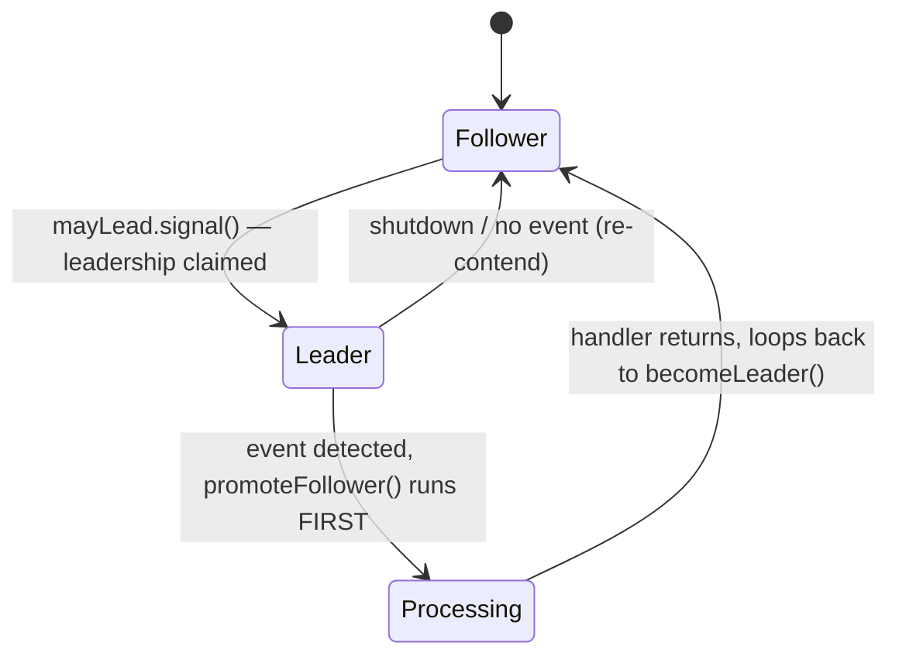
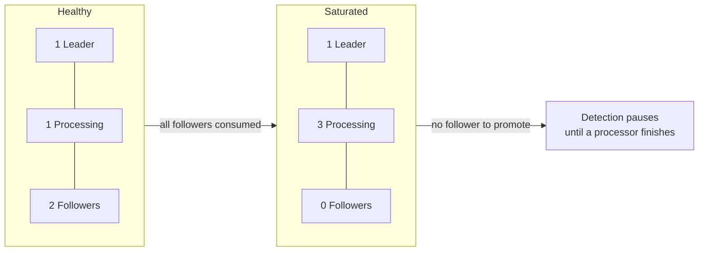

# Leader/Followers — Middle Level

> **Source:** POSA2 (Schmidt et al.) · Schmidt, Pyarali — *Leader/Followers* pattern paper
> **Category:** [Concurrency](../README.md) — *"Patterns for coordinating work across threads, cores, and machines."*
> **Prerequisite:** [junior.md](junior.md)

## Table of Contents

1. [Introduction](#1-introduction)
2. [When to Use Leader/Followers](#2-when-to-use-leaderfollowers)
3. [When NOT to Use It](#3-when-not-to-use-it)
4. [Real-World Cases](#4-real-world-cases)
5. [Code Examples — Production-Grade](#5-code-examples--production-grade)
6. [The State Machine (Leader / Follower / Processing)](#6-the-state-machine-leader--follower--processing)
7. [Promotion Protocol](#7-promotion-protocol)
8. [Trade-offs](#8-trade-offs)
9. [Alternatives Comparison](#9-alternatives-comparison)
10. [Refactoring to Leader/Followers](#10-refactoring-to-leaderfollowers)
11. [Pros & Cons (Deeper)](#11-pros--cons-deeper)
12. [Edge Cases](#12-edge-cases)
13. [Tricky Points](#13-tricky-points)
14. [Best Practices](#14-best-practices)
15. [Tasks (Practice)](#15-tasks-practice)
16. [Summary](#16-summary)
17. [Related Topics](#17-related-topics)
18. [Diagrams](#18-diagrams)

---

## 1. Introduction

At the junior level we framed Leader/Followers as "the same thread detects and processes — no queue, no dispatcher." At this level we treat it as an *engineering decision with measurable consequences*. The pattern trades **simplicity** for **two fewer synchronization points per request**: the queue lock and the dispatcher-to-worker context switch. Whether that trade is worth it depends entirely on your handler duration, your throughput, and whether you can tolerate weak thread affinity.

This page builds a production-grade pool with explicit state tracking and a clean promotion protocol, then positions it precisely against [Half-Sync/Half-Async](../08-half-sync-half-async/junior.md) and a thread-pool-per-Reactor design so you can pick the right one in a design review.

## 2. When to Use Leader/Followers

Reach for it when **all** of these hold:

- Handlers are **short and mostly CPU-bound** (parse a request, look up a cache, write a reply). The shorter the handler, the more the per-request hand-off cost dominates — and that's exactly what Leader/Followers removes.
- Throughput is **high** (tens of thousands of requests/sec or more) so saving one context switch per request is material.
- You **do not need request ordering or thread affinity** — any thread may run any handler.
- The handle set is a **single demultiplexer** (`epoll`/`Selector`) shared across all connections.
- You have profiled and found the **dispatcher hand-off / queue contention** is a real bottleneck.

## 3. When NOT to Use It

- **Long or blocking handlers** (DB calls, disk, downstream RPC). A blocked processor cannot lead; with N threads and long handlers you starve the leader role. Use a [Thread Pool](../05-thread-pool/junior.md) behind a queue instead — its decoupling is the feature, not a bug.
- **You need ordering or affinity** (per-session state machines, ordered streams). Leader/Followers gives you neither.
- **Modest load.** If the hand-off cost is noise, the added complexity buys nothing. Use [Half-Sync/Half-Async](../08-half-sync-half-async/junior.md) — it's easier to read and debug.
- **You need to scale handlers and I/O independently.** The queue in Half-Sync/Half-Async lets you size the I/O layer and worker pool separately; Leader/Followers fuses them.

## 4. Real-World Cases

- **ACE `ACE_TP_Reactor`** — the textbook implementation. A pool of threads shares one reactor; the leader runs the event loop, promotes, and dispatches. Powers TAO (the CORBA ORB) under high request rates.
- **High-performance RPC gateways** doing protocol parse + cache lookup + reply, where p99 latency matters and handlers are sub-millisecond.
- **Market-data fan-in** services where many sockets feed short, uniform handlers and a context switch per message is visible in the latency budget.

## 5. Code Examples — Production-Grade

This version tracks explicit roles, handles the "no follower available" case, supports clean shutdown, and isolates the promotion protocol.

```java
import java.io.IOException;
import java.nio.channels.SelectionKey;
import java.nio.channels.Selector;
import java.util.ArrayList;
import java.util.List;
import java.util.concurrent.atomic.AtomicInteger;
import java.util.concurrent.locks.Condition;
import java.util.concurrent.locks.ReentrantLock;

public final class LfThreadPool {

    enum Role { LEADER, FOLLOWER, PROCESSING }

    private final Selector selector;
    private final int poolSize;
    private final List<Thread> threads = new ArrayList<>();

    private final ReentrantLock lock = new ReentrantLock();
    private final Condition mayLead = lock.newCondition();
    private boolean leaderPresent = false;     // is a thread currently leading?
    private volatile boolean running = true;

    // diagnostics
    private final AtomicInteger processing = new AtomicInteger();

    public LfThreadPool(Selector selector, int poolSize) {
        this.selector = selector;
        this.poolSize = poolSize;
    }

    public void start() {
        for (int i = 0; i < poolSize; i++) {
            Thread t = new Thread(this::eventLoop, "lf-worker-" + i);
            threads.add(t);
            t.start();
        }
    }

    private void eventLoop() {
        try {
            while (running) {
                becomeLeader();                       // FOLLOWER -> LEADER
                List<SelectionKey> ready = leaderSelect();
                promoteFollower();                    // LEADER -> (vacant); wake one follower
                processing.incrementAndGet();         // -> PROCESSING
                try {
                    for (SelectionKey k : ready) dispatch(k);
                } finally {
                    processing.decrementAndGet();     // PROCESSING -> FOLLOWER (loop back)
                }
            }
        } catch (InterruptedException e) {
            Thread.currentThread().interrupt();
        }
    }

    /** Wait until leadership is free, then claim it. */
    private void becomeLeader() throws InterruptedException {
        lock.lock();
        try {
            while (leaderPresent && running) mayLead.await();   // while-loop: spurious wakeups
            if (!running) return;
            leaderPresent = true;
        } finally {
            lock.unlock();
        }
    }

    /** Only the leader runs this — single-waiter invariant on the Selector. */
    private List<SelectionKey> leaderSelect() {
        List<SelectionKey> claimed = new ArrayList<>();
        try {
            selector.select();                        // block on the shared handle set
            var it = selector.selectedKeys().iterator();
            while (it.hasNext()) {
                SelectionKey k = it.next();
                it.remove();                          // claim so the next leader won't re-see it
                if (k.isValid()) claimed.add(k);
            }
        } catch (IOException ignored) { }
        return claimed;
    }

    /** Promote BEFORE processing so the pool keeps detecting events. */
    private void promoteFollower() {
        lock.lock();
        try {
            leaderPresent = false;
            mayLead.signal();                         // exactly one follower becomes leader
        } finally {
            lock.unlock();
        }
    }

    private void dispatch(SelectionKey key) {
        Object att = key.attachment();
        if (att instanceof EventHandler h) h.handleEvent(key);
    }

    public void shutdown() {
        running = false;
        lock.lock();
        try { mayLead.signalAll(); } finally { lock.unlock(); }  // wake everyone to exit
        selector.wakeup();                            // unblock the leader's select()
    }

    public interface EventHandler { void handleEvent(SelectionKey key); }
}
```

Note the two `signalAll` exceptions: only at **shutdown** do we wake everyone (so they can observe `running == false` and exit). During normal operation we always `signal` exactly one.

## 6. The State Machine (Leader / Follower / Processing)

Each thread cycles through three states. The transitions are driven by the promotion protocol and the handler lifecycle:



Key invariants:

- **At most one LEADER** at any time (enforced by `leaderPresent` under the lock).
- **Zero or more PROCESSING** threads (bounded by pool size).
- **The rest are FOLLOWERS**. If LEADER + PROCESSING = N, there are no followers and the pool is fully saturated.

## 7. Promotion Protocol

The promotion protocol is the heart of the pattern. It is a tiny state machine guarded by one lock and one condition variable:

1. **Acquire** (`becomeLeader`): a follower waits on `mayLead` while `leaderPresent`. When signalled, it sets `leaderPresent = true` and becomes leader.
2. **Hold**: the leader, and only the leader, calls `selector.select()`. No other thread touches the handle set.
3. **Promote** (`promoteFollower`): the leader clears `leaderPresent` and `signal()`s exactly one waiting follower. This happens **before** processing.
4. **Release**: the ex-leader becomes a processing thread, runs handlers, then loops back to step 1.

The ordering "promote (3) before process" is what keeps the pool responsive. The "signal one, not all" choice is what avoids the thundering herd. Both are load-bearing.

## 8. Trade-offs

| Axis | Leader/Followers | Half-Sync/Half-Async |
|------|------------------|----------------------|
| Synchronization points per request | 1 (promotion lock) | 2+ (queue enqueue + dequeue) |
| Context switches per request | ~0 (same thread) | ≥1 (dispatcher → worker) |
| Data copy / hand-off | None | Event handed across queue |
| Thread affinity | Weak (any thread) | Weak, but I/O thread is dedicated |
| Independent scaling of I/O vs workers | No (fused) | Yes (queue decouples) |
| Implementation complexity | Higher | Lower |
| Best for | Short, fast handlers, max throughput | Mixed / blocking handlers, clarity |

## 9. Alternatives Comparison

**vs Half-Sync/Half-Async.** Half-Sync/Half-Async splits the system into an async I/O layer and sync workers connected by a queue. That queue is the decoupling point — it lets slow workers not stall I/O, and lets you size each layer independently. Leader/Followers *removes* that queue by rotating the I/O role through the workers. You gain throughput (no hand-off) but lose the decoupling: a slow handler now eats a thread that could have led. **Choose Half-Sync/Half-Async when handlers are slow or variable; choose Leader/Followers when they're fast and uniform.**

**vs Thread-Pool-per-Reactor.** Here you run K independent [Reactor](../03-reactor/junior.md)s, each single-threaded, each owning a subset of connections, with one thread per reactor. There is no shared handle set and no promotion lock — so no promotion-lock contention. But load can be **imbalanced** (one reactor's connections are hot, another's are idle) and there's no work stealing. Leader/Followers shares one handle set so any thread can serve any connection — better balance, at the cost of promotion-lock serialization. **Thread-Pool-per-Reactor wins on simplicity and zero shared-lock contention; Leader/Followers wins on load balance.**

## 10. Refactoring to Leader/Followers

Starting from a Half-Sync/Half-Async server:

1. **Identify the hand-off.** Find the queue between the I/O/dispatcher thread and the workers. That's what you're deleting.
2. **Make handlers thread-agnostic.** Remove any assumption that a handler runs on "the worker thread." In Leader/Followers it runs on the ex-leader.
3. **Introduce the promotion protocol.** Add the lock + condition + `leaderPresent` flag.
4. **Invert the loop.** Instead of "dispatcher selects → enqueues → worker dequeues → processes," make each worker: become leader → select → promote → process.
5. **Delete the queue and the dispatcher thread.** They are now redundant.
6. **Re-measure.** Confirm context-switch count dropped and throughput rose. If not, you didn't have a hand-off bottleneck — revert.

## 11. Pros & Cons (Deeper)

**Pros**
- ✓ Removes per-request hand-off latency — the dominant win for short handlers.
- ✓ Better CPU-cache locality: request data lives on one thread/core through detect+process.
- ✓ No queue memory churn; bounded, predictable footprint.
- ✓ No thundering herd by construction.

**Cons**
- ✗ The promotion lock serializes leadership; under extreme rates it becomes the new bottleneck.
- ✗ Weak affinity makes ordering, per-thread caches, and debugging harder.
- ✗ Blocking handlers degrade it badly — fewer threads available to lead.
- ✗ More moving parts than a queue; easy to introduce promote-after-process or signalAll bugs.

## 12. Edge Cases

- **No follower available to promote.** If all other threads are processing, `signal()` wakes nobody; the next thread to finish processing will become leader via `becomeLeader`. Detection simply pauses until then — size the pool so this is rare.
- **Selector returns zero keys** (e.g. after `wakeup()` or a spurious return). Promote and loop; don't treat empty as an error.
- **Handler registers new interest / new connections.** Must call `selector.wakeup()` if a non-leader thread modifies the selector, since the leader may be blocked in `select()`.
- **Exception in a handler.** Must not skip the loop-back; the `finally` ensures the thread rejoins as a follower rather than vanishing.

## 13. Tricky Points

- **`leaderPresent` vs "who is leader."** You rarely need the *identity* of the leader, only whether one *exists*. A boolean is enough and cheaper than storing a `Thread`.
- **Promotion lock window must be tiny.** Holding it across `select()` or across a handler would serialize everything. Hold it only to flip the flag and signal.
- **`select()` and `wakeup()` interaction.** When another thread changes selector interest, the blocked leader must be woken with `selector.wakeup()` or it won't notice until the next event.

## 14. Best Practices

- ✓ Keep the promotion lock window to flag-flip + signal only.
- ✓ Always `signal()` one in steady state; `signalAll()` only at shutdown.
- ✓ Wrap handler dispatch in try/finally so the thread always rejoins the pool.
- ✓ Expose a `processing` gauge to detect leader starvation (LEADER+PROCESSING == N).
- ✓ Size the pool with the blocking fraction in mind, not just CPU count.

## 15. Tasks (Practice)

1. Add a metric that counts how often `promoteFollower()` had no follower to wake.
2. Extend the pool to handle handler exceptions without losing the thread.
3. Add `selector.wakeup()` support so a handler can register a new connection mid-flight.
4. Build a load test comparing context-switch counts vs a queue-based thread pool (use `pidstat -w`).

## 16. Summary

Leader/Followers is the right tool when handlers are short, throughput is high, and the dispatcher hand-off is a measured bottleneck. The production form tracks three roles, isolates the promotion protocol behind one lock + condition, promotes before processing, and signals exactly one follower. Against Half-Sync/Half-Async it trades decoupling for fewer sync points; against Thread-Pool-per-Reactor it trades zero-lock simplicity for better load balance. Profile before adopting — and revert if the hand-off wasn't your bottleneck.

## 17. Related Topics

- [Half-Sync/Half-Async](../08-half-sync-half-async/junior.md) — the decoupled alternative.
- [Reactor](../03-reactor/junior.md) — the single-threaded base; Thread-Pool-per-Reactor uses K of these.
- [Thread Pool](../05-thread-pool/junior.md) — the worker pool used behind a queue.

## 18. Diagrams

**Saturation states across a 4-thread pool:**


