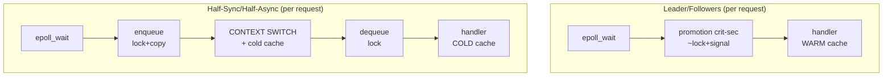
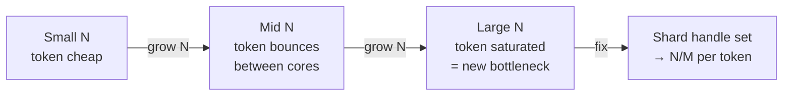

# Leader/Followers — Professional Level

> **Source:** POSA2 (Schmidt et al.) · Schmidt, Pyarali — *Leader/Followers* pattern paper
> **Category:** [Concurrency](../README.md) — *"Patterns for coordinating work across threads, cores, and machines."*
> **Prerequisite:** [senior.md](senior.md)

## Table of Contents

1. [Introduction](#1-introduction)
2. [Internals: ACE_TP_Reactor, the Promotion Token](#2-internals-ace_tp_reactor-the-promotion-token)
3. [Cache & Context-Switch Economics](#3-cache--context-switch-economics)
4. [Memory Model and Visibility](#4-memory-model-and-visibility)
5. [Performance: Where the Cycles Go](#5-performance-where-the-cycles-go)
6. [Performance: Tail Latency Under Burst](#6-performance-tail-latency-under-burst)
7. [Cross-Language Comparison](#7-cross-language-comparison)
8. [Microbenchmark Anatomy](#8-microbenchmark-anatomy)
9. [Diagrams](#9-diagrams)
10. [Related Topics](#10-related-topics)

---

## 1. Introduction

This page is about the *physics* of Leader/Followers: why removing one context switch per request measurably wins, what the promotion token costs in cache-coherence traffic, how the memory model makes it correct, and how to build a microbenchmark that proves (or disproves) the win on your hardware. The pattern's entire justification is a performance argument, so a professional must be able to quantify it — not assert it.

## 2. Internals: ACE_TP_Reactor, the Promotion Token

ACE's `ACE_TP_Reactor` is the canonical implementation, and its design choices are instructive.

- **The token.** ACE uses an `ACE_Token` — a recursive, FIFO-fair mutex with an associated condition — as the promotion lock. Owning the token means "I am the leader; I may run the event loop's `handle_events()`." This is exactly the `leaderPresent` + condition we modelled in Java, but with **FIFO fairness** built in, which prevents leader-starvation convoys.
- **Promote-before-dispatch.** Inside `handle_events()`, once the demultiplexer (`select`/`epoll`) returns ready handles, the reactor **releases the token (promotes) before invoking the handler's `handle_input()`**. A waiting follower grabs the token and re-enters `handle_events()` while the ex-leader dispatches. This is the promote-then-process invariant, in C++.
- **Suspend/resume of handlers.** To avoid two threads dispatching the *same* handle concurrently (since the handle set is shared), `ACE_TP_Reactor` **suspends** a handle before promoting and **resumes** it after the handler returns. This is the C++ analogue of `it.remove()` on a `SelectionKey` — it prevents double-dispatch of one connection while still letting other connections be dispatched in parallel.
- **The condition variable** is what followers block on; `signal()` (not broadcast) wakes one. Broadcasting would reintroduce the herd.

The lesson: a production Leader/Followers needs three things the toy version omits — FIFO fairness (token), per-handle suspend/resume (anti-double-dispatch), and careful wakeup on interest changes.

## 3. Cache & Context-Switch Economics

This is the heart of *why no dispatcher hand-off wins*.

**Context switch cost.** A thread-to-thread context switch on modern x86 costs roughly 1–5 µs of *direct* CPU time, but the *indirect* cost is larger: the incoming thread runs cold, suffering L1/L2/TLB misses as it reloads the working set. For a sub-microsecond handler, that indirect cost can exceed the handler's own runtime. Half-Sync/Half-Async pays this on **every request** (dispatcher thread → worker thread). Leader/Followers pays it **zero** times in steady state: the thread that `select()`ed is the thread that runs the handler — its caches are already warm with the connection's data structures (the `SelectionKey`, the handler object, the socket buffers it just touched).

**Cache-line residency.** When the leader returns from `select()`, the kernel has just touched the socket's receive buffer and the ready-set; that data is hot in L1/L2 on the leader's core. Processing on that same core reads from warm cache. Hand off to another core (different L1/L2, possibly different NUMA node) and you eat cold-cache misses plus cross-socket coherence traffic.

**The promotion token's own cost.** Promotion isn't free: the token is a contended cache line. Each acquire/release bounces the lock's cache line between cores (MESI invalidation). At N threads hammering one token, this coherence traffic is the bottleneck the senior page warned about. The trade is: **one contended cache line (the token) vs one cold-cache context switch per request.** For short handlers and moderate N, the token wins. Past the token's saturation point, you shard.

## 4. Memory Model and Visibility

Correctness rests on the lock providing the right happens-before edges (JMM / C++11 memory model).

- **Promotion publishes state.** When the old leader does `lock(); leaderPresent=false; signal(); unlock();` and the new leader does `lock(); while(leaderPresent) await(); leaderPresent=true; unlock();`, the unlock-then-lock pair establishes happens-before. Every write the old leader made before the unlock is visible to the new leader after its lock. This is why the new leader's `select()` correctly sees the (already-drained) selected-key set.
- **Thread confinement after promotion.** The selected key and its handler are touched by exactly one thread after promotion (the ex-leader, now processing). No further synchronization is needed for that data — it's confined. This is what keeps the pattern fast: the only synchronization is the tiny promotion critical section.
- **`volatile running` for shutdown.** The shutdown flag must be `volatile` (Java) / `std::atomic` (C++) because it's read outside the lock in the loop condition. Reading it inside the lock would be correct too but needlessly serializes.
- **Do not read shared state outside the lock.** A common bug: reading a "pending registrations" list from a handler without synchronization. The promotion lock only protects leadership, not your app state.

## 5. Performance: Where the Cycles Go

A steady-state Leader/Followers request spends cycles in:

1. `select()`/`epoll_wait` syscall — unavoidable, shared with all demultiplexing patterns.
2. **Promotion critical section** — lock acquire, flag flip, `signal`, release. This is the *only* overhead Leader/Followers adds over a bare Reactor, and it's the line to optimize/shard.
3. Handler execution — your code; warm-cache here is the win.

Half-Sync/Half-Async adds, on top of (1) and (3): a queue enqueue (lock + maybe alloc), a queue dequeue (lock), and a context switch (1–5 µs + cold-cache tax). So the comparison reduces to: **promotion critical section (L/F) vs queue ops + context switch (HSHA).** On most hardware the former is cheaper for short handlers — that's the whole pattern.

## 6. Performance: Tail Latency Under Burst

- **Burst arrival.** When K events arrive near-simultaneously, the leader's `select()` returns K ready handles. It promotes once, then dispatches all K on its own thread *serially*. Meanwhile the new leader is already waiting for the next batch. If you want the K handled in parallel, you must promote-and-dispatch per handle (promote, take one handle, the new leader takes the rest) — a design choice with a fairness/latency trade.
- **p99 sensitivity to handler variance.** Leader/Followers' p99 is excellent when handlers are uniform and short. Introduce one slow handler and it parks a thread; if it happens to park enough threads, detection latency spikes — directly visible in tail latency. This is why "uniform, short handlers" is a hard precondition, not a nicety.
- **No queue → no queue-induced latency, but no buffering either.** Half-Sync/Half-Async's queue absorbs bursts; Leader/Followers has no such shock absorber. Under sustained overload, Leader/Followers applies backpressure naturally (the leader simply can't `select()` while all threads process), whereas a queue can grow unboundedly. This is sometimes an advantage (bounded memory) and sometimes a disadvantage (less burst tolerance).

## 7. Cross-Language Comparison

| Language | Promotion lock | Handle set | Notes |
|----------|----------------|-----------|-------|
| **C++ (ACE)** | `ACE_Token` (FIFO, recursive) + condition | `ACE_TP_Reactor` over `select`/`epoll` | The reference; suspend/resume prevents double-dispatch. |
| **Java (NIO)** | `ReentrantLock` + `Condition` | `Selector` | `Selector` not safe for concurrent `select()`; promotion enforces single-waiter. `selectedKeys` removal = suspend/resume. |
| **C (raw epoll)** | `pthread_mutex` + `pthread_cond` | `epoll` fd | `EPOLLEXCLUSIVE`/`EPOLLONESHOT` are kernel alternatives to userspace promotion; `EPOLLONESHOT` gives per-fd suspend for free. |
| **Go** | Rarely used explicitly | runtime netpoller | The Go runtime *is* a Leader/Followers-like scheduler internally (one M does netpoll, hands Gs to others); app code uses goroutines instead. |
| **Rust** | `Mutex`/`Condvar` | `mio`/`epoll` | Same shape as Java; usually superseded by async runtimes (tokio) that do their own multiplexing. |

The modern idiom in C is `EPOLLEXCLUSIVE` (wakeup-herd fix) plus `EPOLLONESHOT` (per-fd one-shot, the kernel doing suspend/resume), which together approximate Leader/Followers in the kernel — often simpler than userspace promotion.

## 8. Microbenchmark Anatomy

To prove the win, measure the thing the pattern changes: **context switches per request** and **end-to-end latency** at fixed throughput.

```java
// Sketch: compare L/F vs queue-based pool on the SAME workload.
// Drive both with identical, short, CPU-bound handlers and identical load.
//
// Metrics to capture (not wall-clock alone):
//   - voluntary + involuntary context switches  (Linux: /proc/<pid>/status, pidstat -w)
//   - cache-misses                              (perf stat -e cache-misses)
//   - p50 / p99 / p999 handler-to-reply latency (HdrHistogram)
//   - throughput at saturation                  (requests/sec)
//
// Expected result for SHORT handlers:
//   L/F:   ~0 ctx-switches/req,  lower cache-misses, lower p99, higher throughput
//   Queue: ~1 ctx-switch/req,    higher cache-misses, higher p99
//
// Expected result for LONG/BLOCKING handlers:
//   L/F degrades (leader starvation); queue-based holds up. This INVERTS the result —
//   which is the whole point: the benchmark must include both regimes.
```

Benchmark discipline:

- **Same handler, same load, two designs.** Change only the dispatch mechanism.
- **Measure context switches, not just latency.** Latency is the effect; context switches are the cause the pattern targets. If ctx-switches don't drop, the pattern can't help.
- **Pin threads** to remove scheduler noise; warm up the JIT; measure steady state.
- **Test both regimes** (short and blocking handlers) so the benchmark can *falsify* "always use L/F."
- **Watch for the token ceiling.** Sweep N (pool size); find where promotion-lock contention flattens throughput. That's your shard point.

## 9. Diagrams

**Where a request spends time — L/F vs Half-Sync/Half-Async:**



**Token cache-line contention vs pool size:**



## 10. Related Topics

- [Half-Sync/Half-Async](../08-half-sync-half-async/junior.md) — the design whose hand-off cost Leader/Followers eliminates.
- [Reactor](../03-reactor/junior.md) — the demultiplexer Leader/Followers wraps with a thread pool.
- [Thread Pool](../05-thread-pool/junior.md) — sizing and the blocking-fraction calculation.
