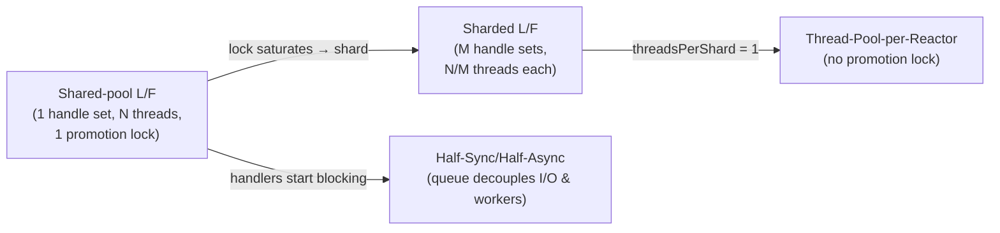
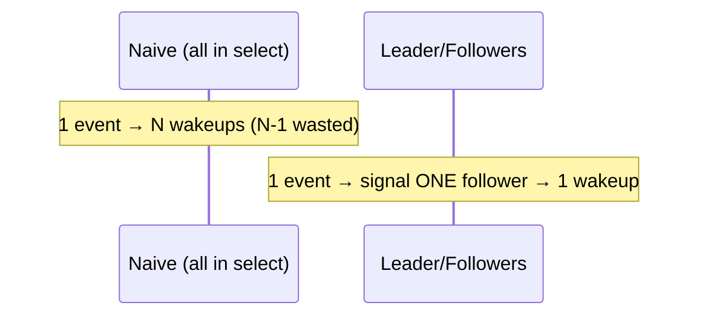

# Leader/Followers — Senior Level

> **Source:** POSA2 (Schmidt et al.) · Schmidt, Pyarali — *Leader/Followers* pattern paper
> **Category:** [Concurrency](../README.md) — *"Patterns for coordinating work across threads, cores, and machines."*
> **Prerequisite:** [middle.md](middle.md)

## Table of Contents

1. [Introduction](#1-introduction)
2. [Leader/Followers at Architectural Scale](#2-leaderfollowers-at-architectural-scale)
3. [Handle-Set Sharing & Thundering Herd Avoidance](#3-handle-set-sharing--thundering-herd-avoidance)
4. [Concurrency Deep Dive](#4-concurrency-deep-dive)
5. [Testability Strategies](#5-testability-strategies)
6. [When It Becomes a Problem](#6-when-it-becomes-a-problem)
7. [Code Examples — Advanced](#7-code-examples--advanced)
8. [Real-World Architectures](#8-real-world-architectures)
9. [Pros & Cons at Scale](#9-pros--cons-at-scale)
10. [Trade-off Analysis Matrix](#10-trade-off-analysis-matrix)
11. [Migration Patterns](#11-migration-patterns)
12. [Diagrams](#12-diagrams)
13. [Related Topics](#13-related-topics)

---

## 1. Introduction

At senior level, Leader/Followers stops being "a clever loop" and becomes a **scheduling discipline** with measurable systemic effects: it determines your context-switch rate, your cache residency, your tail latency under burst, and — critically — where your next bottleneck will appear (the promotion lock). This page treats the pattern as one option in a space that includes Half-Sync/Half-Async, Thread-Pool-per-Reactor, and sharded handle sets, and shows when each wins.

The central senior insight: **Leader/Followers converts a producer-consumer problem into a mutual-exclusion problem.** Half-Sync/Half-Async coordinates via a *queue* (producer-consumer); Leader/Followers coordinates via a *single lock guarding the right to wait on I/O* (mutual exclusion). Whether that's a win depends on which primitive your hardware and workload make cheaper.

## 2. Leader/Followers at Architectural Scale

A single Leader/Followers pool over one handle set scales until the promotion lock saturates. At that point you have three escalation moves:

1. **Shard the handle set.** Run M Leader/Followers pools, each owning a disjoint set of connections and its own selector + promotion lock. This is "sharded Leader/Followers" — it caps any one lock's contention at N/M threads. The cost is cross-shard load imbalance (mitigated by hashing connections to shards by expected load).
2. **Pin pools to cores (NUMA-aware).** Bind each pool's threads to a core/socket and keep that pool's connections on the same NUMA node, so detect+process never crosses sockets. This compounds Leader/Followers' cache advantage.
3. **Degrade to Thread-Pool-per-Reactor.** In the limit M = N (one thread per pool), sharded Leader/Followers *becomes* Thread-Pool-per-Reactor: no promotion lock at all, because there's never more than one thread per handle set. The promotion machinery only earns its keep when you want a shared handle set for load balance.

This continuum — one shared pool ↔ sharded pools ↔ thread-per-reactor — is the senior mental model. You slide along it as the promotion lock heats up.

## 3. Handle-Set Sharing & Thundering Herd Avoidance

The thundering herd is the failure mode Leader/Followers is *engineered* to avoid, and understanding it precisely is what separates a correct implementation from a subtly broken one.

**The naive herd.** If all N threads block in `select()` on the same handle set, one ready event wakes all N (or, on some OSes, an arbitrary subset). N-1 of them wake, find nothing to do, and go back to sleep — N-1 wasted context switches per event. At high event rates this destroys throughput.

**Leader/Followers' defense.** Only the leader is *ever* in `select()`. Followers block on a **condition variable**, not on the OS handle set. A `signal()` wakes exactly one. So one event → one wakeup → one new leader. The herd is structurally impossible.

**The subtle trap: `EPOLLEXCLUSIVE` and edge-triggering.** Modern kernels offer `EPOLLEXCLUSIVE` precisely to let multiple threads share an epoll fd without a herd — which looks like it makes Leader/Followers' promotion protocol redundant. It does not, fully: `EPOLLEXCLUSIVE` solves the *wakeup* herd but reintroduces the *hand-off* you were avoiding (you still need to decide which woken thread keeps watching). Leader/Followers' promotion is a userspace solution that also controls *who watches next* with cache-friendly ordering. The two compose, but you must understand which problem each solves.

## 4. Concurrency Deep Dive

- **The promotion lock is the only shared mutable state.** Everything else (the selected key, the handler) is thread-confined after promotion. This is what makes the pattern fast: the critical section is "flip a boolean, signal one CV." Microseconds.
- **Memory visibility.** The promotion lock provides the happens-before edge: the new leader's `select()` sees all writes the old leader made before `signal()`. You get this for free from the lock; do **not** read shared state outside it.
- **Fairness.** `ReentrantLock`/CV signalling is not strictly FIFO by default. If one thread keeps winning leadership (because it's the one that just finished processing and re-contends fastest), you can get unfairness. For most workloads this is benign; for latency-fairness-sensitive ones, use a fair lock or an explicit FIFO follower queue.
- **Lost-wakeup and double-dispatch.** The two classic correctness bugs: signalling with no follower waiting (lost — but recovered when a processor finishes and re-contends) and two threads both treating themselves as leader (double-dispatch — prevented by the `leaderPresent` guard under the lock).
- **Convoy formation.** If handlers are uneven, threads can convoy behind the promotion lock at the moment they all finish processing and re-contend simultaneously. Sharding the handle set breaks the convoy.

## 5. Testability Strategies

Leader/Followers is hard to test because *which thread runs what* is non-deterministic. Strategies:

- **Inject the handle set.** Abstract `select()` behind an interface so tests can feed a deterministic event stream without real sockets.
- **Inject the promotion protocol.** Make the lock + condition a collaborator you can instrument, asserting "promote was called before process" by recording call order.
- **Single-thread the pool in tests.** With poolSize = 1, the loop is deterministic: become leader → select → promote (no-op, no follower) → process. Verifies the loop logic without races.
- **Property: the eyes never close.** Assert that between any two events, the time with no thread in `select()` is bounded (i.e. promotion always happens promptly). A stress test with a leak detector on "events detected vs processed" catches promote-after-process regressions.
- **Chaos: slow handlers.** Inject artificial delays into handlers and assert detection still proceeds — this is the test that catches "processed before promoting."

## 6. When It Becomes a Problem

- **Promotion-lock saturation.** At extreme request rates the single lock becomes the bottleneck — the very hand-off cost you removed reappears as lock contention. Symptom: CPU spent in lock acquire/CV signal dominates. Fix: shard the handle set.
- **Blocking handlers.** Any handler that blocks (DB, RPC, disk) parks a thread that could lead. With long handlers, leader starvation occurs and detection latency spikes. Fix: don't use Leader/Followers for blocking work; or offload the blocking part to a separate pool.
- **Ordering requirements creep in.** A feature needs per-session ordering. Leader/Followers can't provide it without serializing the session onto one thread — at which point you've reinvented Thread-Pool-per-Reactor for that session.
- **Debuggability.** Production incidents are harder: "which thread ran this handler" is non-deterministic across runs, complicating log correlation. Mitigate with per-request trace IDs, not thread IDs.

## 7. Code Examples — Advanced

A **sharded** Leader/Followers — M pools, each with its own selector and promotion lock, connections hashed to shards. This is the standard scale-out form.

```java
public final class ShardedLeaderFollowers {
    private final LfThreadPool[] shards;

    public ShardedLeaderFollowers(int shardCount, int threadsPerShard) throws IOException {
        shards = new LfThreadPool[shardCount];
        for (int i = 0; i < shardCount; i++) {
            shards[i] = new LfThreadPool(Selector.open(), threadsPerShard);
        }
    }

    public void start() { for (var s : shards) s.start(); }

    /** Route a new connection to a shard; pin it there for its lifetime. */
    public void register(SocketChannel ch, EventHandler h) throws IOException {
        int shard = Math.floorMod(ch.hashCode(), shards.length);
        ch.configureBlocking(false);
        // Wake the shard's leader so it picks up the new registration immediately.
        shards[shard].registerInterest(ch, h);
    }
    // ... shutdown fans out to all shards ...
}
```

Each shard caps promotion-lock contention at `threadsPerShard`. Choosing `shardCount` so that `threadsPerShard` keeps the lock below saturation (often 2–4) is the tuning knob. Note that `registerInterest` must `selector.wakeup()` the shard's blocked leader so the new connection is watched without waiting for an unrelated event.

## 8. Real-World Architectures

- **ACE `ACE_TP_Reactor`.** The reference. A pool of threads runs `reactor.run_event_loop()`; internally the reactor uses a token (the promotion lock) to ensure one leader owns the demultiplexer at a time, promotes, and dispatches. TAO (CORBA ORB) layers RPC on top for high-throughput request processing.
- **High-performance application servers** historically used Leader/Followers-style pools for their connector layers where handlers were short and uniform.
- **Sharded epoll servers** (the modern Linux idiom) are effectively Thread-Pool-per-Reactor or sharded Leader/Followers — the same continuum, chosen by whether shards share connections.

## 9. Pros & Cons at Scale

| ✓ At scale | ✗ At scale |
|-----------|-----------|
| Lowest per-request overhead of the demultiplexing patterns | Single promotion lock becomes the ceiling → must shard |
| Cache/NUMA locality compounds when pools are core-pinned | Cross-shard imbalance once you shard |
| No queue memory → predictable footprint under burst | Blocking handlers starve the leader role |
| Composes into sharded / thread-per-reactor continuum | Non-determinism complicates ops and debugging |

## 10. Trade-off Analysis Matrix

| Dimension | Leader/Followers | Sharded L/F | Thread-Pool-per-Reactor | Half-Sync/Half-Async |
|-----------|------------------|-------------|-------------------------|----------------------|
| Shared handle set | Yes (1) | Per shard | No | Yes (in async layer) |
| Promotion lock contention | High at scale | Bounded per shard | None | N/A (queue instead) |
| Load balance | Best | Good | Worst (per-reactor imbalance) | Good (queue) |
| Hand-off cost | None | None | None | One per request |
| Blocking-handler tolerance | Poor | Poor | Poor | Good (decoupled) |
| Ordering/affinity | None | Per-shard | Per-reactor (strong) | None |
| Ops/debug difficulty | High | High | Medium | Medium |

## 11. Migration Patterns

- **Shared pool → sharded pool.** When the promotion lock saturates: introduce M selectors, hash connections to shards, give each shard its own pool. Connections are pinned for their lifetime to avoid cross-shard state movement.
- **Sharded L/F → thread-per-reactor.** Set threadsPerShard = 1. The promotion lock disappears (never two threads per handle set). Do this when load is naturally balanced and you want zero shared-lock overhead.
- **Leader/Followers → Half-Sync/Half-Async.** When handlers start blocking: reintroduce a queue and a worker pool so slow handlers stop starving detection. You trade the hand-off cost back for decoupling.

## 12. Diagrams

**The scaling continuum:**



**Thundering herd vs Leader/Followers wakeup:**



## 13. Related Topics

- [Half-Sync/Half-Async](../08-half-sync-half-async/junior.md) — the decoupled, queue-based alternative.
- [Reactor](../03-reactor/junior.md) — the demultiplexer at the core; thread-per-reactor uses K of these.
- [Thread Pool](../05-thread-pool/junior.md) — worker-pool foundations and sizing.
