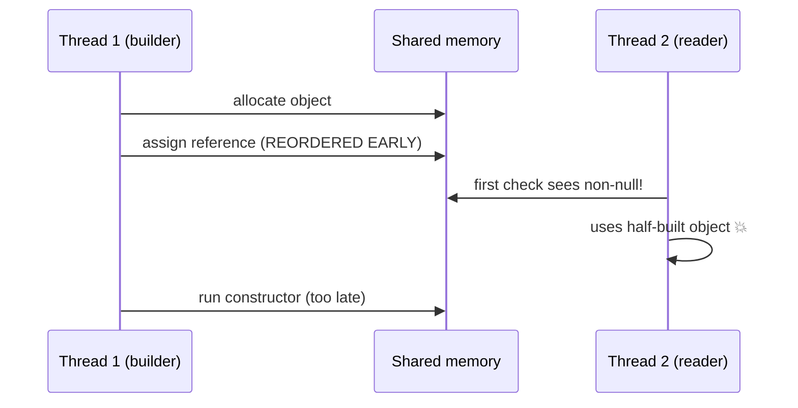

# Double-Checked Locking — Junior Level

> **Source:** POSA2 (Schmidt et al.) · Schmidt & Harrison — *Double-Checked Locking* · JSR-133 (Java Memory Model)
> **Category:** [Concurrency](../README.md) — *"Patterns for coordinating work across threads, cores, and machines."*

## Table of Contents

1. [Introduction](#introduction)
2. [Prerequisites](#prerequisites)
3. [Glossary](#glossary)
4. [Core Concepts](#core-concepts)
5. [Real-World Analogies](#real-world-analogies)
6. [Mental Models](#mental-models)
7. [Pros & Cons](#pros--cons)
8. [Use Cases](#use-cases)
9. [Code Examples](#code-examples)
10. [Coding Patterns](#coding-patterns)
11. [Clean Code](#clean-code)
12. [Best Practices](#best-practices)
13. [Edge Cases & Pitfalls](#edge-cases--pitfalls)
14. [Common Mistakes](#common-mistakes)
15. [Tricky Points](#tricky-points)
16. [Test Yourself](#test-yourself)
17. [Tricky Questions](#tricky-questions)
18. [Cheat Sheet](#cheat-sheet)
19. [Summary](#summary)
20. [What You Can Build](#what-you-can-build)
21. [Further Reading](#further-reading)
22. [Related Topics](#related-topics)
23. [Diagrams & Visual Aids](#diagrams--visual-aids)

---

## Introduction

**Double-Checked Locking (DCL)** is an optimization for **lazy initialization** in a multi-threaded program. The goal is simple: create an expensive object exactly once, the first time it is needed, while keeping every later access **fast and lock-free**.

The naive thread-safe approach is to wrap the whole "create-if-missing" block in a lock. That is correct, but every single access — even the millionth, when the object already exists — pays the cost of acquiring and releasing the lock. DCL removes that cost from the common path by **checking twice**:

1. **First check (no lock):** "Is the object already there?" If yes, return it immediately. No lock taken.
2. **Only if it looks missing**, take the lock, and **check again** inside the lock before creating it.

That second check matters because two threads might both pass the first check at the same moment; the lock serializes them, and the inner check stops the second thread from creating a duplicate.

The twist — and the reason this pattern is famous — is that the *obvious* version is **subtly broken** on real hardware and real compilers. Fixing it requires understanding how memory works across threads. That is why DCL is the single best pattern for learning the **memory model**. By the end of this page you will understand both the version that works and the version that looks fine but isn't.

## Prerequisites

Before this topic, you should be comfortable with:

- **Threads** — multiple lines of execution running at once, possibly on different CPU cores.
- **Shared mutable state** — a field that more than one thread reads and writes.
- **Locks / `synchronized`** — a mechanism that lets only one thread into a block at a time. See [Monitor Object](../02-monitor-object/junior.md).
- **Lazy initialization** — deferring the creation of an object until it is first used.
- **The Singleton pattern** — one shared instance for the whole program. See [Singleton](../../01-creational/05-singleton/junior.md).
- Basic Java syntax (`static`, `final`, `volatile`) or C++ (`std::mutex`, `std::atomic`).

## Glossary

| Term | Meaning |
| --- | --- |
| **Lazy initialization** | Creating an object only on first use, not at program start. |
| **Eager initialization** | Creating the object up front, before it's needed. |
| **Critical section** | Code that only one thread may run at a time, guarded by a lock. |
| **Race condition** | A bug where the result depends on the unpredictable timing of threads. |
| **Atomicity** | An operation appears to happen all-at-once; no thread sees a half-done state. |
| **Visibility** | Whether a write by one thread is seen by another thread. |
| **Ordering / reordering** | The order memory operations *appear* to happen in; compilers and CPUs may reorder them. |
| **`volatile` (Java)** | A keyword that gives a field visibility and ordering guarantees across threads. |
| **Happens-before** | A formal "this is guaranteed to be visible to that" relationship in the memory model. |
| **Safe publication** | Making a newly built object visible to other threads in a fully-constructed state. |
| **Partially constructed object** | An object whose reference is visible but whose fields aren't yet — a broken DCL hazard. |

## Core Concepts

### The problem DCL solves

You have a lazily-created shared object. The simplest correct version locks every access:

```java
class Config {
    private static Config instance;

    public static synchronized Config getInstance() { // lock on EVERY call
        if (instance == null) {
            instance = new Config();
        }
        return instance;
    }
}
```

This is **correct** but **slow**: `synchronized` is paid on every call, forever, even though initialization happens only once. For a hot path read millions of times, that overhead adds up.

### The double-checked idea

DCL splits the check in two:

```text
if (instance == null) {          // 1st check — cheap, no lock
    lock {
        if (instance == null) {  // 2nd check — under lock
            instance = create();
        }
    }
}
return instance;
```

- The **first check** lets the fast path skip the lock entirely once the object exists.
- The **lock** is taken only when the object *looks* missing.
- The **second check** handles the race where two threads both saw `null` and both entered the lock; only the first builds the object.

### The catch: three different guarantees

The naive version above hides a trap. Sharing data between threads needs **three** distinct properties, and the lock-free first check only gets you part of the way:

- **Atomicity** — `instance = new Config()` is *not* one step. It's roughly: (a) allocate memory, (b) run the constructor, (c) assign the reference to `instance`.
- **Visibility** — even after a thread writes `instance`, another thread might not *see* the write, or might see it without seeing the constructor's writes.
- **Ordering** — the compiler/CPU may reorder (a), (b), (c). If the reference is assigned **before** the constructor finishes, another thread can read a non-null `instance` that points to a **half-built object**.

The first check reads `instance` **without a lock**. Without extra guarantees, it can observe a non-null reference to an object whose fields are still default/garbage. That is the famous DCL bug — and you'll see the fix below.

## Real-World Analogies

- **Restaurant "is the table set?" check.** A waiter glances at a table from across the room (cheap, no lock): if it's already set, serve immediately. If it looks unset, walk over, *look again up close* (under lock), and set it only if it's truly unset. The "glance from across the room" can be fooled — you might see plates on the table but the cutlery isn't placed yet. That's the partially-constructed-object hazard.
- **Library book.** Two people want the same rare book. Each checks the shelf (first check). If it's missing, they ask the librarian, who serializes them (lock) and checks the back room (second check) before ordering a new copy — so only one copy is ordered.
- **Building a house and putting the address on the mailbox.** If the address sign goes up *before* the walls are finished, a visitor sees a valid address and walks into a roofless house. Safe publication means: finish the house, *then* put up the sign.

## Mental Models

- **"Cheap glance, careful look."** DCL = an unsynchronized fast glance, falling back to a synchronized careful look only when needed.
- **"The reference and the object are two different things."** A non-null reference does **not** guarantee the object behind it is finished. Keep these mentally separate.
- **"`volatile` is a one-way mirror with a timestamp."** It forces the writer to flush everything before publishing the reference, and forces the reader to refresh and see those writes.
- **"Tests lie here."** On your x86 laptop the broken version may pass a million times. On an ARM phone or under a different JIT, it breaks. Correctness comes from the memory model, not from the test passing.

## Pros & Cons

| | |
| --- | --- |
| ✓ Lock-free fast path after initialization | ✗ Notoriously easy to get wrong |
| ✓ Lazy — object built only if needed | ✗ Requires `volatile` (Java 5+) to be correct |
| ✓ Lower contention than locking every read | ✗ Was outright unfixable in pure Java before JSR-133 |
| ✓ Single shared instance, built once | ✗ Better idioms exist (holder, enum) for most cases |
| ✓ Teaches the memory model thoroughly | ✗ Overkill for cheap-to-create objects |

## Use Cases

- A **lazily-initialized singleton** that is expensive to build (loads a config file, opens a pool) and read on a hot path.
- A **cache field** that must be populated once and then read frequently without locking.
- **Library code** where you can't assume eager init is acceptable (e.g., you must not do work at class-load time).
- **Learning the memory model** — honestly, the most valuable use of DCL today is pedagogical.

> Reality check: for *most* singletons, the **Initialization-on-Demand Holder** idiom (below) is simpler and just as fast. Reach for DCL only when you must lazily initialize an **instance field** (not a static), where the holder trick doesn't apply.

## Code Examples

### 1. The naive, BROKEN version (do not ship)

```java
// ❌ BROKEN without `volatile` — shown to be understood, not used.
class BrokenSingleton {
    private static BrokenSingleton instance; // NOT volatile

    public static BrokenSingleton getInstance() {
        if (instance == null) {                  // 1st check (no lock)
            synchronized (BrokenSingleton.class) {
                if (instance == null) {          // 2nd check (under lock)
                    instance = new BrokenSingleton(); // ⚠ may publish early
                }
            }
        }
        return instance;
    }
}
```

**Why it's broken:** `instance = new BrokenSingleton()` is three steps — allocate, construct, assign. The compiler or CPU may reorder this to *assign the reference before the constructor finishes*. A second thread doing the first check (no lock) can then see a **non-null but half-built** object and use it. This is a real bug, not a theoretical one — it shows up on ARM/Power CPUs and certain JITs.

### 2. The CORRECT version — `volatile` (Java 5+)

```java
// ✅ Correct on Java 5+ thanks to JSR-133 volatile semantics.
class Singleton {
    private static volatile Singleton instance; // volatile is the fix

    public static Singleton getInstance() {
        Singleton result = instance;        // read volatile field once
        if (result == null) {               // 1st check (no lock)
            synchronized (Singleton.class) {
                result = instance;
                if (result == null) {       // 2nd check (under lock)
                    result = new Singleton();
                    instance = result;      // volatile write publishes safely
                }
            }
        }
        return result;
    }
}
```

`volatile` does two things JSR-133 promises: it stops the constructor's writes from being reordered *after* the publish, and it guarantees a reader who sees the non-null reference also sees the fully-constructed object. The local `result` is a minor speed tweak (one volatile read on the fast path instead of two).

### 3. The SIMPLER idiom — Initialization-on-Demand Holder

```java
// ✅ Lazy, thread-safe, lock-free — and NO volatile needed.
class Singleton {
    private Singleton() {}

    private static class Holder {
        static final Singleton INSTANCE = new Singleton();
    }

    public static Singleton getInstance() {
        return Holder.INSTANCE; // class loaded (and built) on first use
    }
}
```

The JVM loads the `Holder` class only when `getInstance()` first touches it, and **class initialization is thread-safe by the language spec**. You get laziness and safety for free — no `volatile`, no double check, no lock visible in your code.

### 4. The BULLETPROOF idiom — enum singleton

```java
// ✅ Simplest correct singleton; handles serialization & reflection too.
enum Singleton {
    INSTANCE;

    public void doWork() { /* ... */ }
}
// usage: Singleton.INSTANCE.doWork();
```

Enums are initialized once by the JVM with full thread safety, and they resist the two classic singleton attacks (reflection and serialization). The trade-off: enums are eager-ish (initialized when the enum class loads) and can't extend a class.

## Coding Patterns

- **Read the volatile field into a local first**, then test the local. Saves a volatile read on the hot path.
- **Always keep the inner second check.** Removing it reintroduces the duplicate-creation race.
- **Lock on a private, dedicated object** when guarding an *instance* field, so external code can't interfere with your lock.
- **Prefer the holder idiom for statics.** Use DCL only for instance fields where holder doesn't apply.

## Clean Code

- Name the field for what it holds (`instance`, `connectionPool`), not how it's locked.
- Don't scatter the double-check logic across methods — keep the whole pattern in one accessor.
- Add a short comment that the field **must stay `volatile`** — future maintainers delete `volatile` thinking it's redundant, and silently break the code.
- If a simpler idiom works (holder/enum), use it — clean code is correct code with the least machinery.

## Best Practices

- ✓ Mark the field `volatile` (Java) — this is non-negotiable for DCL correctness.
- ✓ Prefer **Initialization-on-Demand Holder** for static singletons.
- ✓ Prefer **enum** when you want the strongest, simplest singleton.
- ✓ Use a **local variable** for the volatile field to trim the fast path.
- ✓ Document *why* `volatile` is there so nobody removes it.
- ✗ Don't use DCL for cheap-to-create objects; the complexity isn't worth it.
- ✗ Don't rely on tests passing as proof of correctness.

## Edge Cases & Pitfalls

- **Removing `volatile`** because "the lock already protects it" — wrong; the *first* check reads without the lock.
- **Dropping the inner check** — two threads can both build the object.
- **Constructor that publishes `this`** (e.g., registers itself in a static map) — can leak a partial object regardless of DCL.
- **Mutable object whose fields change after publication** — DCL only guarantees safe *publication*, not ongoing thread-safety of mutations.
- **`final` fields inside the singleton** — these have their own safe-publication guarantee, but it doesn't rescue a non-`volatile` DCL field.

## Common Mistakes

1. Forgetting `volatile` — the #1 DCL bug.
2. Deleting the second (inner) `null` check.
3. Believing x86 "proves" it works — x86's strong memory model often *hides* the bug.
4. Using DCL where eager init or the holder idiom is simpler and equally fast.
5. Locking on `this` inside a `static` method (compile error) or on a public object (lock leak).
6. Assuming `volatile` makes the *whole object* thread-safe (it only governs the one field).

## Tricky Points

- The bug is about **publishing the reference before the object is done**, not about two threads creating two objects (the inner check handles that).
- `volatile` fixes DCL **only on Java 5+**. On Java 1.4 and earlier, DCL was **fundamentally broken** and no amount of `volatile` saved it.
- A passing test means nothing here — correctness is a property of the *memory model*, not of any run.

## Test Yourself

1. Why does the first `null` check skip the lock — what's the benefit?
2. Why is the *second* `null` check necessary?
3. What three steps hide inside `instance = new Singleton()`?
4. What exactly does `volatile` guarantee that fixes DCL?
5. Why does the holder idiom not need `volatile`?
6. Why might the broken version pass every test on your laptop?

## Tricky Questions

1. **If the lock already protects writes, why isn't the unlocked first read safe?** Because the first read happens *outside* the lock, so it has no happens-before edge to the write — it can see a stale or partial value without `volatile`.
2. **Could the inner check ever be skipped safely?** No. Two threads can both pass the outer check; without the inner check both will construct.
3. **Does `final` on the singleton's fields save a non-volatile DCL?** No. `final`-field safe publication helps only when the object is published through a `final` field or a properly synchronized path — not through a racy non-volatile read.

## Cheat Sheet

```text
DCL =  if (f == null) { lock { if (f == null) f = build(); } } return f;

MUST:   field is `volatile`        (Java 5+)
MUST:   keep BOTH null checks
FAST:   read volatile into a local, test the local
SIMPLER: static singleton  -> Initialization-on-Demand Holder
SIMPLEST: bulletproof       -> enum singleton
RULE:   non-null reference ≠ fully-constructed object
```

## Summary

Double-Checked Locking makes lazy initialization cheap by checking the "is it built?" condition **before** taking a lock and **again** after. The naive version is broken because writing the reference is not atomic and may be **reordered**, letting another thread see a **partially constructed** object through the unlocked first check. The fix in Java 5+ is to mark the field **`volatile`**. In most real code, the **Initialization-on-Demand Holder** idiom or an **enum** is simpler and just as fast — so the deepest value of DCL is teaching you the difference between **atomicity, visibility, and ordering**, and what **safe publication** means.

## What You Can Build

- A lazily-initialized, lock-free configuration singleton with a correct `volatile` DCL.
- The same singleton rebuilt with the holder idiom and with an enum — then benchmark all three.
- A tiny demo that *tries* to expose the broken version (easier on ARM than x86).

## Further Reading

- Schmidt & Harrison — *Double-Checked Locking* (POSA pattern paper).
- "The Double-Checked Locking is Broken Declaration" (the canonical write-up by Bacon, Bloch, Lea, et al.).
- JSR-133: *Java Memory Model and Thread Specification* (FAQ is very readable).
- Brian Goetz, *Java Concurrency in Practice*, §16 (the JMM) and the singleton sections.

## Related Topics

- [Monitor Object](../02-monitor-object/junior.md) — the lock-everything baseline DCL optimizes.
- [Balking](../11-balking/junior.md) — another "check a condition then act / skip" pattern.
- [Singleton](../../01-creational/05-singleton/junior.md) — the creational pattern DCL most often serves.

## Diagrams & Visual Aids

**DCL control flow:**

```mermaid
flowchart TD
    A[getInstance called] --> B{instance == null? (no lock)}
    B -- no --> R[return instance]
    B -- yes --> L[acquire lock]
    L --> C{instance == null? (under lock)}
    C -- no --> U[release lock] --> R
    C -- yes --> M[instance = new Singleton] --> U
```

**Why the naive version breaks — reordered publication:**


