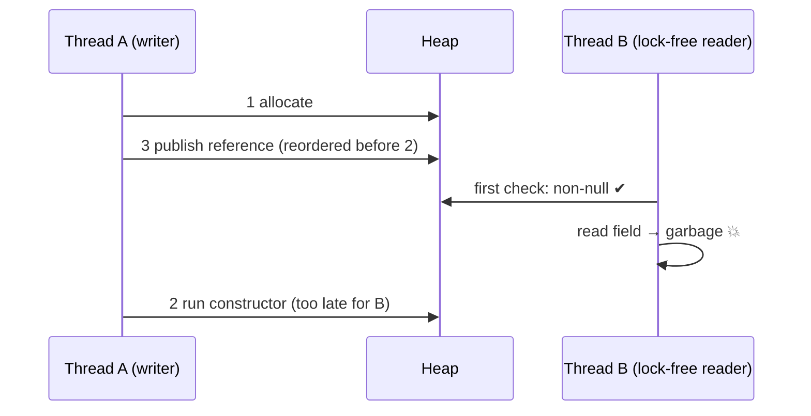
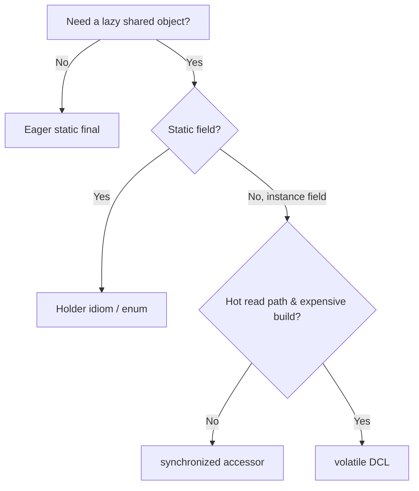

# Double-Checked Locking — Middle Level

> **Source:** POSA2 (Schmidt et al.) · Schmidt & Harrison — *Double-Checked Locking* · JSR-133 (Java Memory Model)
> **Category:** [Concurrency](../README.md) — *"Patterns for coordinating work across threads, cores, and machines."*
> **Prerequisite:** [junior](junior.md)

## Table of Contents

1. [Introduction](#introduction)
2. [When to Use Double-Checked Locking](#when-to-use-double-checked-locking)
3. [When NOT to Use It](#when-not-to-use-it)
4. [Real-World Cases](#real-world-cases)
5. [Code Examples — Production-Grade](#code-examples--production-grade)
6. [Why the Naive Version Is Broken](#why-the-naive-version-is-broken)
7. [The `volatile` Fix](#the-volatile-fix)
8. [Better Idioms](#better-idioms)
9. [Trade-offs](#trade-offs)
10. [Alternatives Comparison](#alternatives-comparison)
11. [Pros & Cons (Deeper)](#pros--cons-deeper)
12. [Edge Cases](#edge-cases)
13. [Tricky Points](#tricky-points)
14. [Best Practices](#best-practices)
15. [Tasks (Practice)](#tasks-practice)
16. [Summary](#summary)
17. [Related Topics](#related-topics)
18. [Diagrams](#diagrams)

---

## Introduction

At junior level you saw the shape of DCL: cheap unlocked check, lock, second check, build, publish. At middle level the questions become *engineering* questions: when is the lock-avoidance actually worth the risk, what exactly the memory model is doing under `instance = new X()`, and which **simpler idioms** make DCL unnecessary most of the time. The honest framing: DCL is a micro-optimization with a high correctness cost. You should be able to write it correctly **and** argue for why you usually shouldn't.

## When to Use Double-Checked Locking

Reach for DCL when **all** of these hold:

- The initialized value lives in an **instance field**, not a static (so the holder idiom doesn't apply).
- Initialization is **expensive** (I/O, large allocation, pool setup) — otherwise the lock-avoidance saves nothing meaningful.
- The field is read on a **hot path**, many times after the one-time write.
- You genuinely need **laziness** — eager init at construction or class-load is unacceptable (e.g., it would do forbidden work too early).

A textbook fit: a per-instance, lazily-built cache inside a long-lived service object that's read on every request.

## When NOT to Use It

- **Static singleton?** Use **Initialization-on-Demand Holder** or **enum** — simpler, equally fast, no `volatile` to forget.
- **Cheap object?** Just initialize eagerly. The lock you're avoiding is cheaper than the bug risk.
- **Read rarely?** A plain `synchronized` accessor is fine and obviously correct.
- **Can't guarantee `volatile` survives refactors?** Then the holder idiom protects you from a future maintainer.
- **You're on Java 1.4 or earlier.** DCL is unfixable there — don't.

## Real-World Cases

- **JDBC / connection pools** lazily created inside a service component the first time a query runs.
- **Lazily-parsed configuration** in framework code (Spring, Guice) where eager parsing at startup is too costly or has ordering constraints.
- **Logger / metrics registry** instance fields built once per component.
- **Library singletons** historically — many old libraries used broken DCL before Java 5 and were quietly fixed by adding `volatile`.

## Code Examples — Production-Grade

### Correct DCL on an instance field (the legitimate use case)

```java
public final class ReportService {
    private final DataSource ds;
    private volatile ExpensiveIndex index; // volatile is mandatory

    public ReportService(DataSource ds) { this.ds = ds; }

    public ExpensiveIndex index() {
        ExpensiveIndex local = index;     // single volatile read
        if (local == null) {
            synchronized (this) {
                local = index;
                if (local == null) {
                    local = buildIndex(ds); // expensive, lazy
                    index = local;           // volatile publish
                }
            }
        }
        return local;
    }

    private ExpensiveIndex buildIndex(DataSource ds) { /* heavy work */ }
}
```

Note: locking on `this` is acceptable here because `ReportService` controls its own monitor; in library code prefer a private lock object so external code can't accidentally contend on your monitor.

### Private-lock variant (defensive)

```java
private final Object lock = new Object();
private volatile ExpensiveIndex index;

public ExpensiveIndex index() {
    ExpensiveIndex local = index;
    if (local == null) {
        synchronized (lock) {
            local = index;
            if (local == null) index = local = buildIndex(ds);
        }
    }
    return local;
}
```

## Why the Naive Version Is Broken

Write out what the JVM actually does for `index = new ExpensiveIndex()`:

```text
1. mem = allocate(sizeof ExpensiveIndex)   // raw memory
2. ExpensiveIndex.<init>(mem)              // run the constructor (sets fields)
3. index = mem                             // publish the reference
```

Steps **2** and **3** have no data dependency the hardware is required to respect across threads, so a compiler or CPU may execute them as **1 → 3 → 2**. Now consider two threads:

- **Thread A** runs `1 → 3` (reference published) and is paused before `2` (constructor).
- **Thread B** runs the **unlocked first check**, sees `index != null`, returns it, and dereferences fields that are still **default/garbage**.

This is **partial construction** caused by **reordering** plus the **visibility** gap on the unlocked read. The inner second check does *not* help — the problem isn't duplicate creation, it's premature publication.



## The `volatile` Fix

JSR-133 (Java 5) gave `volatile` two teeth that fix DCL:

1. **A write to a `volatile` field cannot be reordered with the writes that precede it.** So step `2` (constructor) is guaranteed to complete *before* step `3` (the volatile publish). The reference is never published early.
2. **A read of a `volatile` field establishes a happens-before edge with the write that set it.** So a reader who sees the non-null reference is guaranteed to also see all writes that happened before the volatile store — i.e., the fully-constructed object.

In barrier terms: the `volatile` store acts as a **release** (everything before it is flushed and ordered first), and the `volatile` load acts as an **acquire** (the reader refreshes and sees those writes). That release/acquire pairing is exactly **safe publication**.

```java
private static volatile Singleton instance; // the entire fix is this one keyword
```

## Better Idioms

For most cases you should not write DCL at all.

### Initialization-on-Demand Holder (the go-to for statics)

```java
public final class Config {
    private Config() { /* expensive */ }

    private static final class Holder {
        static final Config INSTANCE = new Config();
    }

    public static Config getInstance() { return Holder.INSTANCE; }
}
```

Lazy (the `Holder` class loads only on first `getInstance()`), thread-safe (the JLS guarantees class initialization runs once under an internal lock), lock-free after load, and **no `volatile` to forget**. This is the idiom to reach for first.

### Enum singleton (the most robust)

```java
public enum Config {
    INSTANCE;
    public void reload() { /* ... */ }
}
```

Thread-safe by the JVM, immune to reflection and serialization attacks, but eager (initialized when the enum class loads) and cannot extend a class.

## Trade-offs

| Concern | DCL (`volatile`) | Holder idiom | Enum |
| --- | --- | --- | --- |
| Works on **instance** fields | ✓ | ✗ (statics only) | ✗ |
| Laziness | ✓ | ✓ | partial (class-load) |
| Lock-free fast path | ✓ | ✓ | ✓ |
| `volatile` needed | ✓ (easy to forget) | ✗ | ✗ |
| Easy to get wrong | ✗ (very) | ✓ (hard to break) | ✓ |
| Serialization/reflection safe | n/a | n/a | ✓ |

## Alternatives Comparison

- **`synchronized` accessor:** simplest, always correct, lock on every call. Fine for cold paths.
- **Eager `static final`:** trivially correct and lock-free, but not lazy.
- **`AtomicReference` + CAS:** lock-free build; can construct twice under race (last writer wins) unless you guard — acceptable only if double-build is harmless.
- **Holder idiom / enum:** best default for statics.
- **DCL:** the right tool only for **lazy instance fields on a hot path**.

## Pros & Cons (Deeper)

| ✓ Pros | ✗ Cons |
| --- | --- |
| Removes lock cost from the common read path | Correctness hinges on a single `volatile` keyword |
| Lazy + lock-free is a rare, valuable combo | A volatile read still has a (small) cost vs a plain read |
| Works where holder/enum can't (instance fields) | History of being shipped broken; reviewers distrust it |
| Great vehicle for understanding the JMM | Modern JITs make the holder idiom equally fast — DCL rarely "wins" |

## Edge Cases

- **`this`-escape in the constructor:** if `buildIndex`/constructor publishes the object somewhere else (a static registry, a listener) before returning, that's an unsafe publish independent of DCL.
- **Mutable singleton:** DCL guarantees safe *publication* only; later mutations need their own synchronization.
- **Field that can be reset to `null`:** DCL assumes write-once. If the field can go back to `null` and be rebuilt, you have a different (harder) problem.
- **Nested DCL fields:** each independent lazy field needs its own `volatile`.

## Tricky Points

- The inner check prevents **double creation**; `volatile` prevents **premature publication**. Two different bugs, two different fixes — you need **both**.
- Reading the volatile field into a local isn't cosmetic: it turns two volatile reads on the fast path into one.
- `final` fields inside the object get their own JMM guarantee, but that does **not** make a non-volatile DCL field safe.

## Best Practices

- ✓ Default to the **holder idiom** for static singletons.
- ✓ If you must DCL, mark the field `volatile` and **comment why**.
- ✓ Use a local for the volatile read on the fast path.
- ✓ Keep both checks; keep the build inside the lock.
- ✗ Don't reach for DCL to save a lock on a cold path.
- ✗ Don't assume passing tests prove correctness.

## Tasks (Practice)

1. Convert a `synchronized` accessor to correct `volatile` DCL; explain each guarantee `volatile` provides.
2. Rewrite the same singleton with the holder idiom and with an enum; compare line counts and failure modes.
3. Take a non-volatile DCL and write down the exact interleaving that breaks it.
4. Add a private lock object to a DCL that currently locks on `this`; argue why.
5. Benchmark `synchronized` vs DCL vs holder on a hot read path (note: differences are often tiny).

## Summary

DCL is a legitimate but narrow optimization: lazy initialization of an **instance field**, read on a **hot path**, where you must avoid per-read locking. The naive version is broken by **reordering** of construct-vs-publish and the **visibility** gap on the unlocked first read, allowing another thread to see a **partially constructed** object. The `volatile` keyword fixes it via release/acquire **safe publication**. For static singletons, the **Initialization-on-Demand Holder** and **enum** idioms are simpler, equally fast, and far harder to get wrong — prefer them.

## Related Topics

- [Monitor Object](../02-monitor-object/junior.md)
- [Balking](../11-balking/junior.md)
- [Singleton](../../01-creational/05-singleton/junior.md)

## Diagrams

**Decision guide:**


