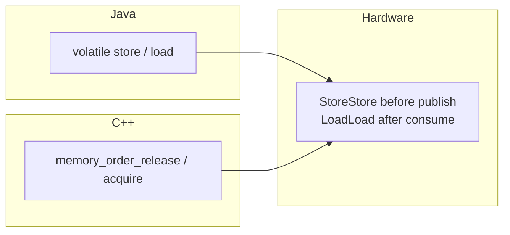
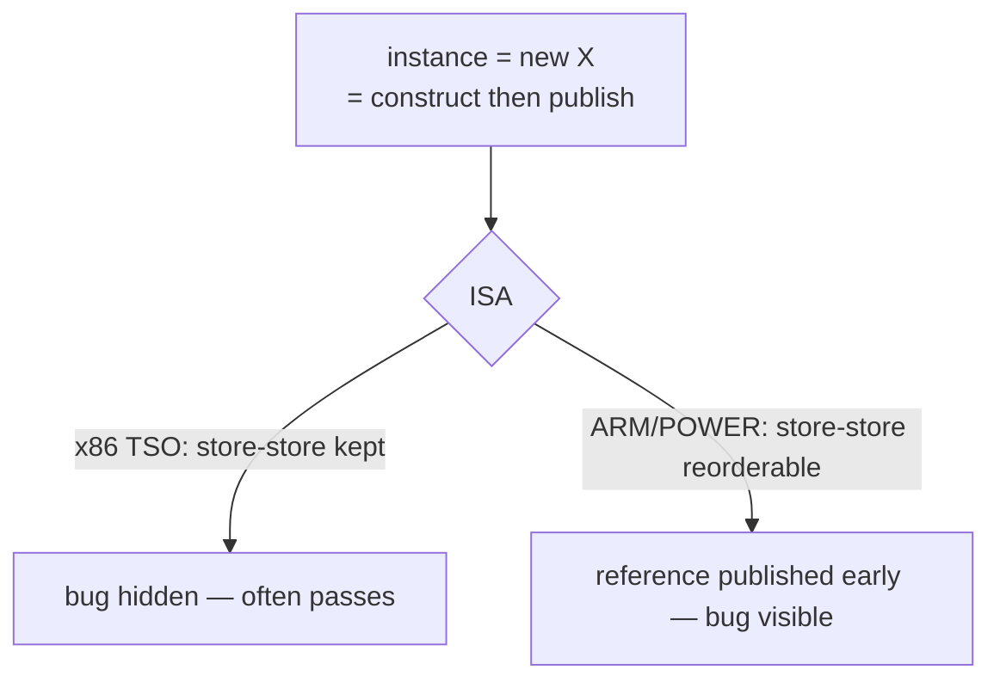

# Double-Checked Locking — Professional Level

> **Source:** POSA2 (Schmidt et al.) · Schmidt & Harrison — *Double-Checked Locking* · JSR-133 (Java Memory Model)
> **Category:** [Concurrency](../README.md) — *"Patterns for coordinating work across threads, cores, and machines."*
> **Prerequisite:** [senior](senior.md)

## Table of Contents

1. [Introduction](#introduction)
2. [The JSR-133 Story](#the-jsr-133-story)
3. [CPU Memory Models & Barriers](#cpu-memory-models--barriers)
4. [C++11 Solution](#c11-solution)
5. [Performance — Is DCL Even Worth It Now?](#performance--is-dcl-even-worth-it-now)
6. [Cross-Language Comparison](#cross-language-comparison)
7. [Microbenchmark Anatomy](#microbenchmark-anatomy)
8. [Diagrams](#diagrams)
9. [Related Topics](#related-topics)

---

## Introduction

This level is about the machinery underneath the keyword: what `volatile` compiles to on different CPUs, why DCL was *literally unfixable* in pure Java before 2004, how C++11 made the equivalent code well-defined for the first time, and whether the whole pattern still earns its keep on modern JITs. The thesis: DCL is a memory-ordering problem, and every language's answer is the same primitive — a **release store paired with an acquire load** — dressed in different syntax.

## The JSR-133 Story

Before Java 5, the **old** Java Memory Model (JLS 1st/2nd ed.) was both under-specified and, where specified, too weak to make DCL work. The infamous *"Double-Checked Locking is Broken"* declaration (Bacon, Bloch, Lea, Goetz, et al.) showed that **no** purely-Java trick — not `volatile` as then specified, not ordering hacks — could repair it, because:

- The old model did not guarantee that a `volatile` write could not be **reordered** with preceding non-volatile writes (the constructor's field stores). So even `volatile` allowed the reference to publish before the object was built.
- There was no clean **happens-before** framework tying a volatile read to the writes preceding the matching volatile write.

**JSR-133** (folded into Java 5, 2004) rewrote the model and fixed exactly this:

- **New `volatile` semantics:** a volatile **store** has *release* semantics — all prior memory operations (including the constructor's plain writes) are ordered **before** it and made visible; a volatile **load** has *acquire* semantics — subsequent reads see everything that happened before the matching store. Concretely, the compiler must emit barriers so that **StoreStore** precedes a volatile store and **LoadLoad/LoadStore** follows a volatile load.
- **Finalized happens-before** as the governing relation, making "safe publication" a precise, provable property.

After JSR-133, `volatile`-based DCL is correct. The takeaway for professionals: the bug was never "programmers forgot `volatile`" — for years, *even with `volatile`* it was broken. The fix was a **language specification change**, not a code change.

## CPU Memory Models & Barriers

`volatile` is a portable contract; the cost and even the *necessity* of fences depends on the target ISA.

| ISA / model | Store-store reorder? | Load-load reorder? | What a volatile store costs | DCL bug visible without volatile? |
| --- | --- | --- | --- | --- |
| **x86 / x86-64 (TSO)** | No | No (only store→load) | Often just a compiler barrier; `mfence`/`lock`-prefixed only for store→load | Rarely (TSO hides constructor-vs-publish reorder) |
| **ARMv8 / AArch64 (weak)** | Yes | Yes | `stlr`/`ldar` (release/acquire instructions) or `dmb` | **Yes** — readily exposed |
| **POWER (weak)** | Yes | Yes | `lwsync`/`sync` barriers | **Yes** |

This table is *why* the DCL bug is architecture-dependent. On x86 TSO, the only reordering allowed is store→load; the constructor-write → reference-publish pair is store→store, which TSO **preserves**, so the broken code often appears to work. On ARM/POWER, store→store can be reordered, the reference publishes early, and the bug bites. The portable lesson: **never reason about correctness from your dev machine's ISA.** Reason from the language model, which assumes the weakest hardware.

In barrier terms, the corrected DCL needs:

- Before the publishing store: a **StoreStore** barrier (constructor writes complete first) — this is the release.
- After the consuming load: a **LoadLoad/LoadStore** barrier (later reads see the object) — this is the acquire.

`volatile` (Java) and `memory_order_release`/`memory_order_acquire` (C++) both emit exactly these.

## C++11 Solution

Pre-C++11 there was **no portable way** to write DCL: the language had no memory model and no `volatile`-as-fence (C/C++ `volatile` is for memory-mapped I/O, **not** thread ordering — a common, dangerous confusion). DCL in C++03 was undefined behavior. C++11 introduced a formal memory model and the tools to do it right.

### Idiomatic: `std::call_once` + `std::once_flag`

```cpp
#include <mutex>
#include <memory>

class Singleton {
public:
    static Singleton& instance() {
        std::call_once(once_, [] { ptr_.reset(new Singleton()); });
        return *ptr_;
    }
private:
    Singleton() = default;
    static std::once_flag once_;
    static std::unique_ptr<Singleton> ptr_;
};
std::once_flag Singleton::once_;
std::unique_ptr<Singleton> Singleton::ptr_;
```

`std::call_once` runs the initializer exactly once, with all the publication/ordering handled by the standard library. It is the C++ analogue of "let the language do it" (like Java's holder idiom). Note: a function-local `static` is even simpler and is *guaranteed thread-safe initialization* since C++11 ("magic statics"):

```cpp
Singleton& instance() {
    static Singleton s;   // C++11: initialized exactly once, thread-safe
    return s;
}
```

This local-static form is the **preferred** C++ singleton — the compiler inserts the guard (often a fast already-initialized flag check, like an internal DCL).

### Explicit atomics — manual acquire/release DCL

```cpp
#include <atomic>
#include <mutex>

class LazyResource {
public:
    static LazyResource* get() {
        LazyResource* p = instance_.load(std::memory_order_acquire); // acquire load
        if (p == nullptr) {
            std::lock_guard<std::mutex> lk(mutex_);
            p = instance_.load(std::memory_order_relaxed);
            if (p == nullptr) {
                p = new LazyResource();                 // fully constructed
                instance_.store(p, std::memory_order_release); // release publish
            }
        }
        return p;
    }
private:
    static std::atomic<LazyResource*> instance_;
    static std::mutex mutex_;
};
std::atomic<LazyResource*> LazyResource::instance_{nullptr};
std::mutex LazyResource::mutex_;
```

The `release` store guarantees the constructor's writes precede the publish; the `acquire` load guarantees a reader seeing the pointer also sees the constructed object. This is the textbook DCL, now *well-defined* — and it is literally the same release/acquire pairing as Java's `volatile`. Using `memory_order_relaxed` for the inner reload is a legitimate optimization because the mutex already provides the necessary ordering inside the critical section.

## Performance — Is DCL Even Worth It Now?

Mostly **no**, and here's the honest accounting:

- **Uncontended lock cost has plummeted.** Java biased/lightweight locking and modern `synchronized` make an uncontended lock cheap; the gap DCL closes is smaller than it was in 1999.
- **The holder idiom's fast path is a *plain* read** (no acquire fence), so it is *strictly* at least as fast as volatile DCL on the hot path, while being trivially correct.
- **Volatile reads aren't free** on weak ISAs (an `ldar` / `dmb` is a real fence). DCL trades a lock for a fence on *every* read.
- **JITs warm up the path** — after compilation, the branch is well-predicted and the cost is dominated by the volatile load's ordering, which the holder idiom avoids.

Conclusion: keep DCL in your toolbox for the narrow **lazy-instance-field-on-hot-path** case; for everything static, the holder idiom wins on both simplicity and fast-path cost. Adopt DCL for *understanding*, not for *speed*.

## Cross-Language Comparison

| Language | Correct lazy-singleton idiom | Underlying primitive |
| --- | --- | --- |
| **Java 5+** | Holder idiom / enum; `volatile` DCL if instance field | volatile release/acquire (JSR-133) |
| **Java <5** | None correct — DCL unfixable; use eager or `synchronized` | (old JMM too weak) |
| **C++11+** | function-local `static`, or `std::call_once`; atomics DCL if needed | `memory_order_acquire/release`, once_flag |
| **C++03** | `std::mutex` every access (DCL is UB) | (no memory model) |
| **C#/.NET** | `Lazy<T>` (preferred); `volatile` DCL works (ECMA model + .NET stronger guarantees) | volatile + memory barriers |
| **Go** | `sync.Once` | internal atomic + memory fences |
| **Rust** | `OnceLock` / `LazyLock` / `once_cell` | atomics; data races are compile errors |
| **Python (CPython)** | module-level init or lock; GIL helps but isn't a memory model guarantee | GIL / threading.Lock |

The pattern recurs everywhere; the *good* answer is almost always "use the language's once-init primitive," not hand-rolled DCL.

## Microbenchmark Anatomy

To measure DCL honestly you must defeat the JIT and the memory hierarchy — naive loops mislead.

- **Use JMH** (Java) / **Google Benchmark** (C++). Hand-rolled `System.nanoTime()` loops get constant-folded and dead-code-eliminated.
- **Separate the cold path from the hot path.** The interesting number is the **already-initialized read**, not the one-time build. Benchmark steady-state reads.
- **Blackhole the result** so the JIT can't elide the load; `@Benchmark` should consume the returned reference.
- **Measure on the target ISA.** A volatile-read benchmark on x86 understates the cost you'll pay on ARM.
- **Compare against the holder idiom's plain read** — that's the real baseline. You'll typically find holder ≤ volatile DCL on the hot path, both far below per-read `synchronized` under contention.
- **Watch contention separately.** DCL's whole value is *uncontended* reads; benchmark with 1, N/2, and N threads to see where the lock-free path pays off versus `synchronized`.

A representative finding: under no contention the three lock-free options (holder, volatile DCL, enum) land within noise of each other and well under `synchronized`; under heavy contention `synchronized`'s per-read lock dominates, which is the only regime where DCL clearly beats it — and the holder idiom beats it too, for free.

## Diagrams

**Same primitive across languages:**



**x86 vs ARM exposure of the bug:**



## Related Topics

- [Monitor Object](../02-monitor-object/junior.md)
- [Balking](../11-balking/junior.md)
- [Singleton](../../01-creational/05-singleton/junior.md)
