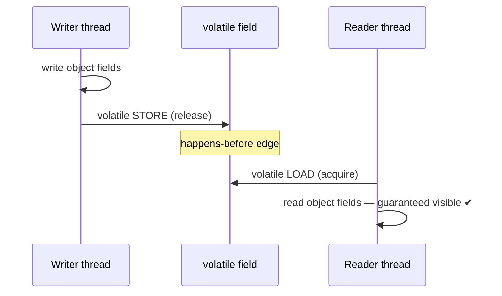

# Double-Checked Locking — Senior Level

> **Source:** POSA2 (Schmidt et al.) · Schmidt & Harrison — *Double-Checked Locking* · JSR-133 (Java Memory Model)
> **Category:** [Concurrency](../README.md) — *"Patterns for coordinating work across threads, cores, and machines."*
> **Prerequisite:** [middle](middle.md)

## Table of Contents

1. [Introduction](#introduction)
2. [DCL and the Memory Model](#dcl-and-the-memory-model)
3. [Happens-Before & Safe Publication (Deep Dive)](#happens-before--safe-publication-deep-dive)
4. [Out-of-Thin-Air & Reordering](#out-of-thin-air--reordering)
5. [Testability Strategies](#testability-strategies)
6. [When DCL Becomes a Problem](#when-dcl-becomes-a-problem)
7. [Code Examples — Advanced](#code-examples--advanced)
8. [Real-World Architectures](#real-world-architectures)
9. [Pros & Cons at Scale](#pros--cons-at-scale)
10. [Trade-off Analysis Matrix](#trade-off-analysis-matrix)
11. [Migration Patterns](#migration-patterns)
12. [Diagrams](#diagrams)
13. [Related Topics](#related-topics)

---

## Introduction

A senior engineer's job with DCL is mostly to **stop people from writing it** and to **explain precisely why the broken version is broken** in memory-model terms — because that explanation is the same one that underpins every lock-free data structure, every `volatile` flag, every `AtomicReference` your team will ever touch. DCL is a 10-line program that exercises the entire Java Memory Model. Treat it as a teaching artifact and a code-review tripwire.

## DCL and the Memory Model

The JMM is defined not in terms of "what the CPU does" but in terms of an abstract **happens-before** partial order over actions. A read is allowed to return the value of a write only if (roughly) that write is the most recent one in happens-before order, *or* there is a data race and then it may return **any** racing write — including a stale or partial one.

In the non-volatile DCL, the unlocked first read of `instance` and the write `instance = ...` form a **data race**: there is no happens-before edge between them (the write is inside a lock the reader never acquires). The model therefore permits the read to observe the reference **without** observing the constructor's writes that preceded it in *program order*. Program order is not enough across threads — you need a synchronization edge. That edge is exactly what `volatile` supplies.

## Happens-Before & Safe Publication (Deep Dive)

Safe publication has four sanctioned mechanisms in the JMM:

1. Initialize the reference from a **static initializer** (the holder idiom rides on this).
2. Store it into a **`volatile`** field (or `AtomicReference`).
3. Store it into a **`final`** field, then read it via that final field's constructed object.
4. Store it under a **lock** and read it under the same lock.

The non-volatile DCL uses *none* of these for the fast path: the build is locked, but the **read is not**, so the read isn't covered by mechanism 4. Switching the field to `volatile` upgrades it to mechanism 2. The release/acquire semantics give the precise edge: `constructor writes → volatile store` *happens-before* `volatile load → field reads`.

```text
Thread A:  [write fields] --hb--> volatile store(instance)
                                        |  (release → acquire)
Thread B:                          volatile load(instance) --hb--> [read fields]
```

This is why the order matters: in the corrected code the object is fully built, *then* the volatile store publishes it; the volatile load on the reader pairs with that store and drags the constructor's writes into visibility.

## Out-of-Thin-Air & Reordering

Two distinct phenomena combine to break naive DCL:

- **Compiler/CPU reordering:** the JIT may inline the constructor and hoist the reference assignment before the field stores; the CPU's store buffer may make stores visible in a different order. On weakly-ordered ISAs (ARM, POWER) plain stores can be reordered freely; on x86 (TSO) store-store ordering is preserved, which is *why the bug hides on x86*.
- **No happens-before on the racy read:** even if stores were ordered, without an acquire on the reader side, a different core may read from its own cache and miss the writes entirely.

The JMM forbids genuine **out-of-thin-air** values (a read can't fabricate a value never written), but a **partially initialized object** is not out-of-thin-air — every field value it exposes (zero/default) *was* legitimately written by the allocator. That's the subtle reason the model permits it: nothing illegal happened; you just lacked an ordering edge.

## Testability Strategies

The defining property of the DCL bug: **it is essentially untestable by example.**

- On **x86/x64** the strong TSO model masks the store reordering, so the broken version can pass billions of iterations on CI and dev laptops.
- The bug surfaces on **ARM/POWER**, under **aggressive JIT inlining**, under **GC relocation**, or simply under different timing.
- Stress tests, `Thread.yield()` sprinkling, and high thread counts do not reliably trigger it.

What actually works at senior level:

- **jcstress** (the OpenJDK Java Concurrency Stress harness) — purpose-built to expose memory-model violations by exploring interleavings and running on weak hardware. This is the *only* practical tool that can demonstrate the DCL bug deterministically-ish.
- **Static review / lint rules:** flag any field read outside a lock that is also written inside one — and require `volatile`. SpotBugs has detectors for broken DCL.
- **Architecture-aware CI:** run concurrency tests on ARM runners, not just x86.

Teaching point for reviews: "the test passed" is **not evidence of correctness** for racy code. Correctness is proven against the *model*, not the run.

## When DCL Becomes a Problem

- **Maintenance hazard:** a future edit removes `volatile` ("looks redundant — it's locked"), silently reintroducing the bug with zero test failures.
- **False sophistication:** teams adopt DCL for prestige where the holder idiom is simpler and JIT-equivalent in speed.
- **Volatile read cost:** on the absolute hottest paths, the volatile load's acquire fence is not free; sometimes you want the value cached in a final field via the holder idiom (a plain read after load).
- **Composite invariants:** DCL guards one field. If correctness spans multiple fields, you need a real lock or an immutable snapshot, not DCL.

## Code Examples — Advanced

### `VarHandle` acquire/release DCL (Java 9+, explicit memory order)

```java
import java.lang.invoke.MethodHandles;
import java.lang.invoke.VarHandle;

public final class LazyIndex {
    private static final VarHandle VH;
    static {
        try { VH = MethodHandles.lookup()
                .findVarHandle(LazyIndex.class, "index", ExpensiveIndex.class); }
        catch (ReflectiveOperationException e) { throw new ExceptionInInitializerError(e); }
    }

    private ExpensiveIndex index; // plain field; ordering via VarHandle modes
    private final Object lock = new Object();

    public ExpensiveIndex index() {
        ExpensiveIndex local = (ExpensiveIndex) VH.getAcquire(this); // acquire load
        if (local == null) {
            synchronized (lock) {
                local = (ExpensiveIndex) VH.getAcquire(this);
                if (local == null) {
                    local = build();
                    VH.setRelease(this, local); // release store == volatile-store semantics
                }
            }
        }
        return local;
    }
    private ExpensiveIndex build() { /* ... */ return new ExpensiveIndex(); }
}
```

`getAcquire`/`setRelease` express *exactly* the ordering DCL needs — no more, no less. This is the precise, expert form; for everyday code, plain `volatile` is clearer and the JIT generates equivalent fences.

### Stampless holder for a static (no DCL at all)

```java
public final class Registry {
    private static final class H { static final Registry I = new Registry(); }
    public static Registry get() { return H.I; } // plain read, fully published
}
```

After class init, `H.I` is read as a *plain* field with no acquire fence — strictly cheaper than a volatile read, while remaining lazy and safe.

## Real-World Architectures

- **JDK internals:** several JDK classes historically used DCL and were corrected to `volatile` after JSR-133; some moved to holder idioms.
- **Frameworks (Spring, Hibernate):** lazy bean/metadata initialization tends to prefer holder-style or explicitly-synchronized init over DCL, precisely to avoid the maintenance trap.
- **High-frequency systems:** prefer eager init or holder so the hot path is a plain read with no acquire fence; they pay the construction cost at warm-up.

## Pros & Cons at Scale

| ✓ | ✗ |
| --- | --- |
| One-time lock, then lock-free reads at any thread count | Volatile acquire fence on every read (vs plain read for holder) |
| Lazy where eager is unacceptable | Untestable by example; needs jcstress + ARM CI to validate |
| Minimal memory footprint (no extra holder class) | High review/maintenance cost; `volatile` deletions are silent |
| Generalizable lesson for all lock-free code | Rarely faster than holder idiom in practice |

## Trade-off Analysis Matrix

| Dimension | volatile DCL | VarHandle DCL | Holder idiom | enum | synchronized |
| --- | --- | --- | --- | --- | --- |
| Fast-path read cost | acquire load | acquire load | plain load | plain load | lock |
| Laziness | ✓ | ✓ | ✓ | partial | ✓ |
| Instance fields | ✓ | ✓ | ✗ | ✗ | ✓ |
| Footgun risk | high | high | low | very low | very low |
| Validation effort | jcstress/ARM | jcstress/ARM | trivial | trivial | trivial |

## Migration Patterns

- **Broken DCL → correct:** add `volatile` to the field; optionally hoist to a local. One-line fix; add a SpotBugs/lint guard so it can't regress.
- **DCL → holder (for statics):** delete the lock + double check, move construction into a private static holder class. Net: less code, plain-read fast path.
- **DCL → eager:** if construction is cheap or warm-up is acceptable, replace with `static final` / constructor init and delete all the machinery.
- **Adding a regression guard:** introduce a jcstress test for the publication, and a static-analysis rule that fails CI on a non-volatile racily-read field.

## Diagrams

**Happens-before edge that `volatile` creates:**



## Related Topics

- [Monitor Object](../02-monitor-object/junior.md)
- [Balking](../11-balking/junior.md)
- [Singleton](../../01-creational/05-singleton/junior.md)
