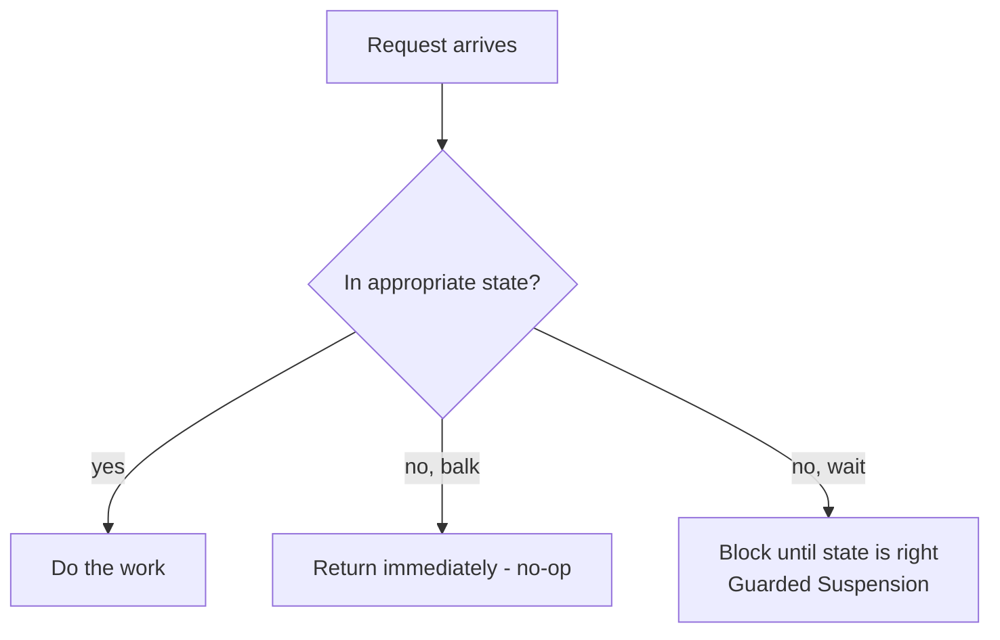
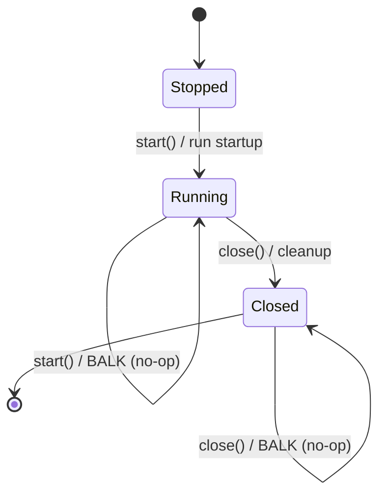

# Balking — Junior Level

> **Source:** Lea, *Concurrent Programming in Java* · Grand, *Patterns in Java* (Balking)
> **Category:** [Concurrency](../README.md) — *"Patterns for coordinating work across threads, cores, and machines."*

## Table of Contents

1. [Introduction](#introduction)
2. [Prerequisites](#prerequisites)
3. [Glossary](#glossary)
4. [Core Concepts](#core-concepts)
5. [Real-World Analogies](#real-world-analogies)
6. [Mental Models](#mental-models)
7. [Pros & Cons](#pros--cons)
8. [Use Cases](#use-cases)
9. [Code Examples](#code-examples)
10. [Coding Patterns](#coding-patterns)
11. [Clean Code](#clean-code)
12. [Best Practices](#best-practices)
13. [Edge Cases & Pitfalls](#edge-cases--pitfalls)
14. [Common Mistakes](#common-mistakes)
15. [Tricky Points](#tricky-points)
16. [Test Yourself](#test-yourself)
17. [Tricky Questions](#tricky-questions)
18. [Cheat Sheet](#cheat-sheet)
19. [Summary](#summary)
20. [What You Can Build](#what-you-can-build)
21. [Further Reading](#further-reading)
22. [Related Topics](#related-topics)
23. [Diagrams & Visual Aids](#diagrams--visual-aids)

---

## Introduction

You click **Save**. Nothing has changed since the last save, so the editor does *nothing* — no disk write, no spinner, no error. You click it again and again; still nothing happens, because there is nothing to do. That instant, silent "I'm not going to do this" is the **Balking** pattern.

Balking answers one question: *what should an object do when it is asked to perform an action it is not in the right state to perform?* It has three honest options. It can **wait** until the state becomes right (that is [Guarded Suspension](../06-producer-consumer/junior.md)). It can **throw** an error and make the caller deal with it. Or it can **balk** — give up immediately and return as if nothing was asked. Balking chooses the third path: *wrong state → quietly give up now, do not block, do not queue.*

The word "balk" comes from a horse that refuses a jump: it stops dead at the fence instead of trying. A balking object does the same. Asked to `start()` when it is already running, it returns at once. Asked to `save()` when nothing changed, it returns at once. Asked to `close()` a second time, only the *first* caller actually closes; everyone else balks.

The pattern looks trivial — "just check a flag and return early." The trap is that in a multithreaded program, *checking the flag and acting on it must happen as one indivisible step*. If two threads check "am I started?" at the same moment, both can see `false`, and both can start the engine. This **check-then-act race** is the single most important thing this topic teaches. Balking is easy; balking *correctly* under concurrency is the real lesson.

## Prerequisites

- **Threads:** An independent path of execution. Two threads in one process share the same objects and fields, which is why two callers can hit `start()` at the same instant.
- **Race condition:** A bug where the outcome depends on the unpredictable timing of threads touching shared data.
- **Shared mutable state:** A field that more than one thread reads and writes — here, the "state flag" (e.g. `started`, `changed`, `closed`).
- **`synchronized`:** Java's built-in lock. A `synchronized` method or block lets only one thread in at a time.
- **Idempotent:** An operation you can call many times and the effect is the same as calling it once. Balking is one common way to *make* an operation idempotent.

If "race condition" is new, read it first — the whole point of this topic is one specific race and how to close it.

## Glossary

| Term | Meaning |
|------|---------|
| **Balk** | To return immediately without doing the work, because the object is in the wrong state. |
| **State flag** | A boolean (or small enum) recording whether the action is appropriate — `started`, `changed`, `closed`. |
| **Guard condition** | The test that decides "do the work" vs "balk" — e.g. `if (!changed) return;`. |
| **Check-then-act** | A two-step "read state, then act on it" sequence that must be made atomic or it races. |
| **Atomic** | Indivisible: no other thread can observe a half-finished state in the middle of the operation. |
| **Once semantics** | A guarantee that the body runs exactly once no matter how many callers arrive. |
| **No-op** | "No operation" — the method returned having changed nothing. |
| **CAS** | Compare-And-Set: a hardware instruction that flips a value *only if* it still holds the expected value, atomically. |

## Core Concepts

**1. The guard is a state question, not a value question.** Balking does not ask "is this input valid?" — that is validation. It asks "is *this object* currently in a state where this action makes sense?" `save()` balks when `changed == false`. `start()` balks when `started == true`. The decision is about the object's lifecycle/state, not the caller's arguments.

**2. Balk vs wait is the whole design choice.** Given a wrong state, an object can:

| Strategy | Behavior on wrong state | Pattern |
|----------|------------------------|---------|
| **Balk** | Return now, do nothing | **Balking** |
| **Wait** | Block until state becomes right | [Guarded Suspension](../06-producer-consumer/junior.md) |
| **Throw** | Raise an exception | Defensive / fail-fast |

Balking is the right choice when *the action simply isn't needed* (nothing changed to save) or *has already been done* (already started, already closed) — when waiting would be pointless and throwing would be noise.

**3. The check and the act must be one atomic step.** This is the entire concurrency content of the pattern. Naively:

```java
if (!started) {   // CHECK
    started = true; // ACT
    startEngine();
}
```

Two threads can both pass the `if` before either sets `started = true`. Both start the engine. The fix is to make "check, then set the flag" indivisible — either with a lock (`synchronized`) or with a single atomic instruction (`compareAndSet`).

**4. The return value tells the caller what happened (often).** A bare `void` balk is silent. Many production balks return a `boolean`: `true` = "I did it," `false` = "I balked." That lets the caller decide whether silence matters.

## Real-World Analogies

- **The horse at the fence.** It balks — refuses the jump and stops — rather than attempting and waiting. This is the origin of the name.
- **A bouncer with a one-in rule.** Once the club is full, the bouncer turns people away instantly. He does not make them wait in line *inside* (that would be guarded suspension); he balks them at the door.
- **The "Mark as read" button.** Tap it on an already-read message and nothing happens. No error, no work — it balks because the state is already what you asked for.
- **A fire alarm pull handle.** The first person who pulls it triggers the alarm. The hundred people who pull it afterward change nothing — the alarm is already ringing. Classic *once* semantics via balking.
- **An elevator "close door" button while the doors are already closed.** Pressing it is a no-op.

## Mental Models

- **"Wrong state → give up now."** Burn this in. Balking is the opposite of patience. Where Guarded Suspension says "I'll wait for you," Balking says "not now, and I'm not waiting."
- **A balk is a self-loop on a state machine.** Draw the object's states. Balking is an event that arrives in a state where it isn't allowed — so it loops back to the *same* state and does nothing. It is a *rejected transition*.
- **The flag is a gate; the lock is the gatekeeper.** The boolean decides *whether* to pass. The lock (or CAS) ensures *only one* thread passes the gate per state change.
- **Balking turns "call once" into "call freely."** It makes an operation safe to call any number of times by collapsing all but the meaningful call into no-ops.

## Pros & Cons

**Pros** ✓

- Simple and cheap — a flag check and an early return.
- Makes operations **idempotent**: callers can retry safely.
- Avoids blocking: callers never hang waiting for state.
- Natural fit for lifecycle methods (`start`, `open`, `close`, `shutdown`) and "dirty flag" persistence (`save`).

**Cons** ✗

- **Silent no-ops can hide bugs.** If a caller *expected* the work to happen, a swallowed balk can mask a real logic error.
- Easy to implement **incorrectly** — the check-then-act race is subtle and only shows up under load.
- The caller often doesn't learn that it balked unless you return a signal.
- Not appropriate when the action *will* become valid soon and the caller genuinely needs it done — that is a job for waiting, not balking.

## Use Cases

- **`save()` with a dirty flag.** Persist only if something changed; balk otherwise.
- **One-shot `start()` / `open()`.** Idempotent startup: the second call is a no-op.
- **One-shot `close()` / `shutdown()`.** Only the first caller runs cleanup; the rest balk. (See [Double-Checked Locking](../10-double-checked-locking/junior.md) for the related "init once" cousin.)
- **Debounced / throttled flush.** "Flush at most once per 100 ms" — balk if a flush already happened recently.
- **Lazy one-time initialization** where re-initializing must not happen.

## Code Examples

### Example 1 — The classic balking `save()`

```java
public class Document {
    private boolean changed = false;
    private String content = "";

    // Mutating the document marks it dirty.
    public synchronized void edit(String text) {
        this.content = text;
        this.changed = true;
    }

    // BALKING: if nothing changed, give up immediately.
    public synchronized void save() {
        if (!changed) {
            return;            // balk — no work to do
        }
        changed = false;       // reset BEFORE the slow write? See pitfalls.
        doSave(content);
    }

    private void doSave(String data) {
        // ... write to disk ...
    }
}
```

The check (`!changed`) and the act (`changed = false; doSave`) both run inside the same `synchronized` method, so they form one atomic step. No two threads can both see `changed == true` and both write.

### Example 2 — One-shot `start()` (lock-based)

```java
public class Engine {
    private boolean started = false;

    public synchronized boolean start() {
        if (started) {
            return false;      // balk — already running
        }
        started = true;
        runStartupSequence();
        return true;           // tells caller: "I really started it"
    }
}
```

### Example 3 — One-shot `close()` with `AtomicBoolean` (lock-free)

```java
import java.util.concurrent.atomic.AtomicBoolean;

public class Resource implements AutoCloseable {
    private final AtomicBoolean closed = new AtomicBoolean(false);

    @Override
    public void close() {
        // compareAndSet(expected, new) flips false->true atomically,
        // returning true ONLY for the thread that won the flip.
        if (!closed.compareAndSet(false, true)) {
            return;            // balk — someone already closed it
        }
        releaseResources();    // runs exactly once
    }
}
```

`compareAndSet(false, true)` is the whole balk in one instruction. Exactly one caller gets `true` and runs cleanup; every other caller gets `false` and balks. No lock needed.

### Example 4 — Go: `sync.Once` is balking built into the standard library

```go
type Service struct {
    once sync.Once
}

func (s *Service) Start() {
    // The body runs exactly once; all later calls balk silently.
    s.once.Do(func() {
        runStartup()
    })
}
```

`sync.Once.Do` is the canonical Go balk: the first caller runs the function, every later caller returns immediately. Under the hood it uses an atomic flag plus a lock — the same idea as Example 3.

## Coding Patterns

- **Guard-and-return.** Put the balk first: `if (wrongState) return;`. Keep the happy path un-indented below it.
- **Return a `boolean` for "did/didn't."** Prefer `boolean start()` over `void start()` when the caller might care.
- **Reset the flag inside the lock.** The flag change and the guard must share the same critical section.
- **Prefer `compareAndSet` for pure once-only flags.** Lock-free, no `synchronized`, and the "winner takes all" semantics are exactly what one-shot lifecycle needs.

## Clean Code

- Name the flag for the *state*, not the action: `started`, `changed`, `closed` — not `doSave` or `flag`.
- Make the balk obvious: a single early `return` at the top reads better than a giant `if` wrapping the whole method.
- Don't bury a balk inside unrelated logic; a reader should see the guard immediately.
- If a balk is *surprising* (could indicate a bug upstream), **log it** rather than swallowing it silently.

## Best Practices

- ✓ Make check-then-act atomic — `synchronized` or `compareAndSet`. Always.
- ✓ Decide consciously: balk, wait, or throw. Write a one-line comment saying *why* balking is correct here.
- ✓ Return a signal (`boolean`) unless the no-op is genuinely uninteresting.
- ✓ For "exactly once," reach for `AtomicBoolean.compareAndSet` or Go's `sync.Once`.
- ✗ Don't balk when the caller truly needs the work eventually — wait instead.
- ✗ Don't reset the dirty flag *after* a write that might fail (you'd lose the change). See pitfalls.

## Edge Cases & Pitfalls

- **The non-atomic check.** `if (!started) { started = true; ... }` without a lock is the canonical bug. Two threads both pass.
- **Resetting the dirty flag too early.** If `save()` sets `changed = false` *before* the disk write and the write throws, the change is now lost *and* marked clean. Reset only after success, or restore on failure.
- **A balk that should have been a wait.** If `start()` is called before construction finishes and you balk, the engine may never start. Make sure "wrong state" really means "no action needed," not "not ready yet."
- **Visibility without synchronization.** A plain `boolean started` read by another thread may be **stale** — the reader might never see the write. `synchronized` and `AtomicBoolean` both fix visibility; a plain field does not.

## Common Mistakes

1. **Plain boolean, no lock.** Believing `boolean closed` is "good enough." It races *and* has visibility problems.
2. **`volatile` alone for a once-only flag.** `volatile` fixes visibility but **not** the check-then-act race — two threads can still both see `false`. You need atomicity (`compareAndSet`), not just visibility.
3. **Swallowing every balk.** Turning a genuine "this should never happen twice" into a silent no-op, so a real double-call bug goes unnoticed forever.
4. **Balking when you meant to wait** — turning a "not ready yet" into a permanent skip.

## Tricky Points

- **`volatile` vs `AtomicBoolean` for the flag.** `volatile boolean closed` makes reads/writes visible but `if (!closed) { closed = true; }` is still two operations → still a race. `AtomicBoolean.compareAndSet` collapses both into one atomic op. For *once* semantics you need the latter.
- **Balking returns; it does not block.** This is the line between Balking and Guarded Suspension. Same guard condition, opposite reaction.
- **A "successful" balk is still a no-op.** Returning `false` from `start()` is not a failure — it means "already done." Don't treat `false` as an error.

## Test Yourself

1. What does an object do when it *balks*? (Returns immediately without doing the work.)
2. Wrong state: Balking does ___; Guarded Suspension does ___. (gives up now / waits)
3. Why must check-then-act be atomic? (Two threads can both pass the check before either acts.)
4. Which single instruction implements a once-only balk? (`compareAndSet`.)
5. Is `volatile boolean` enough for one-shot `close()`? (No — it fixes visibility, not the race.)

## Tricky Questions

- **Q:** Two threads call `close()` simultaneously on the `AtomicBoolean` version. How many run cleanup?
  **A:** Exactly one — the one whose `compareAndSet(false, true)` returns `true`. The other gets `false` and balks.
- **Q:** Is balking the same as ignoring errors?
  **A:** No. Balking is a *deliberate, state-based* no-op for a valid situation. Ignoring errors swallows failures. A balk that might indicate a bug should be logged.
- **Q:** Can `save()` lose data if it balks?
  **A:** Not from balking itself — it only balks when `changed == false`. Data loss comes from resetting the dirty flag *before* a write that then fails.

## Cheat Sheet

```text
BALKING = wrong state → return NOW (no block, no queue)

  balk      : if (notReady) return;       ← give up
  wait      : while (notReady) wait();     ← Guarded Suspension
  throw     : if (notReady) throw ...;     ← fail-fast

CHECK-THEN-ACT must be atomic:
  synchronized { if (started) return; started = true; ... }
  closed.compareAndSet(false, true)        ← lock-free once
  sync.Once.Do(fn)                         ← Go once

Return boolean for "did(true)/balked(false)".
Log a balk that might mean a bug.
```

## Summary

Balking is the pattern of **giving up immediately when the object is in the wrong state** for the requested action — no waiting, no queuing. It is how you build idempotent lifecycle methods (`start`, `close`) and dirty-flag persistence (`save`). The pattern is conceptually tiny but has one sharp edge: the **check-then-act sequence must be atomic**, achieved with `synchronized` or, better for once-only flags, `AtomicBoolean.compareAndSet` (or Go's `sync.Once`). Its main danger is that a **silent no-op can hide a real bug**, so balks that aren't supposed to happen deserve a log line. Remember the contrast: *balk = give up now; guarded suspension = wait.*

## What You Can Build

- An idempotent `start()/stop()` lifecycle for a background service that's safe to call from anywhere.
- A document editor whose `save()` does nothing when there are no unsaved changes.
- A one-shot resource cleaner where exactly one of N concurrent `close()` calls frees the resource.
- A debounced log flusher that writes at most once per interval.

## Further Reading

- Doug Lea, *Concurrent Programming in Java*, §3.4 (Balking and the dirty-flag idiom).
- Mark Grand, *Patterns in Java* — the Balking pattern entry.
- `java.util.concurrent.atomic.AtomicBoolean` and Go's `sync.Once` documentation.

## Related Topics

- [Monitor Object](../02-monitor-object/junior.md) — the lock that makes check-then-act atomic.
- [Guarded Suspension via Producer–Consumer](../06-producer-consumer/junior.md) — the "wait instead of balk" alternative.
- [Double-Checked Locking](../10-double-checked-locking/junior.md) — the "initialize exactly once" cousin.

## Diagrams & Visual Aids

**Balk vs Wait decision:**



**One-shot lifecycle as a state machine (balk = self-loop):**


